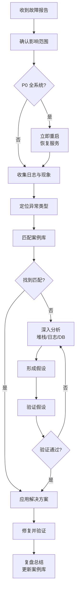

# core 模块 — 常见问题与故障排查

> 本文档汇总 core 模块及上层模块复用 core 时的常见问题、故障现象、根因分析和解决方案，涵盖 Shiro 认证、多数据源、ThreadLocal、CAS、Quartz、MyBatis、连接池、缓存等方面，并提供问题分类索引、案例库和日志分析指南。
> 与 [数据流向图](../04-mapping/data-flow.md) 互补：数据流呈现正常路径，本文档呈现异常路径与排查方法。

---

## 1. 问题分类索引

### 1.1 按模块分类

| 模块 | 常见问题 | 严重程度 | 参见案例 |
|------|----------|----------|----------|
| Shiro 认证 | 登录失败、权限不生效、缓存不更新 | 高 | 案例1、2、3 |
| 多数据源 | 查错库、ThreadLocal 串号、连接泄漏 | 高 | 案例4、5、6 |
| CAS 单点登录 | 登录回调失败、单点登出失效、票据过期 | 高 | 案例7、8 |
| Quartz 定时任务 | 任务不执行、任务阻塞、状态不一致 | 中 | 案例9、10 |
| MyBatis | 映射失败、SQL 注入、N+1 查询 | 中 | 案例11、12 |
| 连接池 | 连接耗尽、慢查询、连接超时 | 高 | 案例13、14 |
| 缓存 | EhCache 不一致、Session 丢失、缓存穿透 | 中 | 案例15、16 |
| 文件上传 | 类型校验失败、大文件 OOM、路径穿越 | 中 | 案例17、18 |
| 异步任务 | 上下文丢失、线程池满、任务拒绝 | 中 | 案例19、20 |

### 1.2 按异常类型分类

| 异常类型 | 典型异常类 | 常见场景 | 排查方向 |
|----------|------------|----------|----------|
| 认证异常 | `AuthenticationException` | 登录失败、密码错误 | 检查 ShiroRealm、密码加密、用户状态 |
| 授权异常 | `UnauthorizedException` | 无权限访问 | 检查角色权限、授权缓存、compId 隔离 |
| 数据源异常 | `IllegalStateException` | ThreadLocal 串号 | 检查 @DataSource、@After 清理 |
| SQL 异常 | `DataAccessException` | SQL 语法错误、连接失败 | 检查 Mapper XML、连接池配置 |
| CAS 异常 | `TicketValidationException` | 票据校验失败 | 检查 CAS 配置、网络连通性 |
| Quartz 异常 | `SchedulerException` | 任务调度失败 | 检查 Cron 表达式、任务类 |
| 缓存异常 | `CacheException` | EhCache 故障 | 检查 ehcache.xml、内存配置 |
| 文件异常 | `MultipartException` | 上传失败 | 检查文件大小、类型、磁盘空间 |

### 1.3 按影响范围分类

| 影响范围 | 典型问题 | 处理优先级 | 处理方式 |
|----------|----------|------------|----------|
| 全系统不可用 | 数据库连接池耗尽、内存溢出 | P0-紧急 | 立即重启 + 根因分析 |
| 单模块不可用 | CAS 登录失败、Quartz 任务阻塞 | P1-高 | 2 小时内修复 |
| 单功能异常 | 文件上传失败、权限校验错误 | P2-中 | 1 个工作日内修复 |
| 体验问题 | 缓存不一致、慢查询 | P3-低 | 排入迭代修复 |
| 安全隐患 | SQL 注入、XSS、越权访问 | P1-高 | 立即修复 |

---

## 2. 解决方案案例库

### 案例1：登录失败 - 密码加密方式不匹配

**问题现象**：用户使用正确密码登录，系统提示"用户名或密码错误"。

**根因分析**：core 的 `PasswordUtil.encryptMD5Password` 使用 MD5 + 用户名盐 + 1024 次迭代，但历史数据中部分用户密码是旧版 MD5（无盐、单次），导致比对失败。

**排查步骤**：
1. 查询数据库确认密码格式：
   ```sql
   SELECT user_name, password, LENGTH(password) AS pwd_len FROM t_user WHERE user_name = 'xxx';
   ```
2. 判断密码长度：
   - 32 位十六进制：可能是新版（1024 迭代）或旧版（单次 MD5）
   - 其他长度：异常数据
3. 手动计算新版加密结果比对：
   ```java
   String encrypted = PasswordUtil.encryptMD5Password("明文密码", "用户名", 1024);
   System.out.println(encrypted);
   ```
4. 如不匹配，尝试旧版 MD5：
   ```java
   String oldMd5 = DigestUtils.md5Hex("明文密码");
   ```

**解决方案**：
```java
// ShiroRealm 增加兼容性判断
protected AuthenticationInfo doGetAuthenticationInfo(AuthenticationToken token) {
    User user = shiroService.queryUserByName(username);
    String inputPassword = new String((char[]) token.getCredentials());

    // 优先尝试新版加密
    String newEncrypted = PasswordUtil.encryptMD5Password(inputPassword, username, 1024);
    if (newEncrypted.equals(user.getPassword())) {
        return new SimpleAuthenticationInfo(principal, user.getPassword(), salt, realmName);
    }

    // 兼容旧版 MD5
    String oldEncrypted = DigestUtils.md5Hex(inputPassword);
    if (oldEncrypted.equals(user.getPassword())) {
        // 自动升级为新版加密
        userMapper.updatePassword(user.getUserId(), newEncrypted);
        return new SimpleAuthenticationInfo(principal, newEncrypted, salt, realmName);
    }

    throw new IncorrectCredentialsException();
}
```

**预防措施**：
- 新建用户统一使用 `PasswordUtil.encryptMD5Password`；
- 登录逻辑增加兼容性判断，自动升级旧密码；
- 定期批量迁移历史密码。

---

### 案例2：权限不生效 - 授权缓存未更新

**问题现象**：管理员给用户分配了新角色，但用户仍提示"无权限"，需等待 10 分钟或重新登录才生效。

**根因分析**：Shiro 授权缓存 TTL=10min，角色变更时未主动清除对应用户的授权缓存，导致权限延迟生效。

**排查步骤**：
1. 检查 `ehcache.xml` 中 `shiro-authorizationCache` 的 `timeToLiveSeconds`；
2. 确认角色分配后是否调用了缓存清除；
3. 查看用户是否重新登录（登录会清除旧缓存）。

**解决方案**：
```java
@Service
public class RoleServiceImpl implements IRoleService {
    @Autowired
    private CacheManager cacheManager;
    @Autowired
    private IUserService userService;

    public void assignRoles(Integer userId, List<Integer> roleIds) {
        // 1. 更新角色关联
        userRoleMapper.deleteByUserId(userId);
        for (Integer roleId : roleIds) {
            UserRole ur = new UserRole();
            ur.setUserId(userId);
            ur.setRoleId(roleId);
            userRoleMapper.insert(ur);
        }

        // 2. 主动清除该用户的授权缓存
        User user = userService.selectByPrimaryKey(userId);
        Cache authzCache = cacheManager.getCache("shiro-authorizationCache");
        authzCache.remove(user.getUserName());
    }
}
```

**预防措施**：
- 角色/权限变更后必须清除相关用户的授权缓存；
- 提供管理界面"刷新用户权限"功能，主动清除指定用户缓存。

---

### 案例3：系统用户看到所有公司数据 - isSysUser 误判

**问题现象**：普通用户登录后能看到所有公司的数据，而非仅本公司。

**根因分析**：`ShiroRealm` 中 `isSysUser` 字段判断逻辑错误，或将普通用户的 `isSysUser` 误设为 1。

**排查步骤**：
1. 查询用户 `isSysUser` 字段：
   ```sql
   SELECT user_name, is_sys_user, comp_id FROM t_user WHERE user_name = 'xxx';
   ```
2. 检查 `ShiroRealm.doGetAuthorizationInfo` 中的 compId 逻辑：
   ```java
   if (principal.getIsSysUser() != null && principal.getIsSysUser() == 1) {
       compId = -1;  // 全公司
   } else {
       compId = principal.getCompId();
   }
   ```
3. 检查业务 SQL 是否包含 `comp_id` 条件。

**解决方案**：
```sql
-- 修正用户 isSysUser 字段
UPDATE t_user SET is_sys_user = 0 WHERE user_name = 'xxx';
```

**预防措施**：
- `isSysUser=1` 仅限系统管理员，新建用户默认 `isSysUser=0`；
- 业务 SQL 必须显式加 `comp_id` 条件，不依赖 Shiro 自动过滤。

---

### 案例4：查错库 - ThreadLocal 未清理导致数据源串号

**问题现象**：用户 A 在 SAP 数据源页面查询后，用户 B 在主库页面查询时返回 SAP 数据，或反之。

**根因分析**：`DataSourceAspect` 的 `@After` 未正确清理 ThreadLocal，线程池复用线程时残留上一个任务的数据源标识。

**排查步骤**：
1. 在 `DataSourceAspect` 增加日志：
   ```java
   @After("@annotation(dataSource)")
   public void after(JoinPoint point, DataSource dataSource) {
       log.debug("清理 ThreadLocal, before={}, method={}", DataSourceHolder.getDataSource(), point.getSignature());
       DataSourceHolder.clearDataSource();
       log.debug("清理后 ThreadLocal={}", DataSourceHolder.getDataSource());
   }
   ```
2. 检查是否有方法绕过了 AOP（如直接调用 `DataSourceHolder.setDataSource` 未清理）；
3. 检查异步任务是否使用了 `ContextCopyingDecorator`。

**解决方案**：
```java
// 方案一：增加 Servlet 过滤器兜底清理
public class ThreadLocalCleanupFilter implements Filter {
    @Override
    public void doFilter(ServletRequest req, ServletResponse res, FilterChain chain) {
        try {
            chain.doFilter(req, res);
        } finally {
            DataSourceHolder.clearDataSource();  // 兜底清理
        }
    }
}

// 方案二：异步任务必须装饰
executor.submit(ContextCopyingDecorator.decorate(() -> {
    try {
        service.crossDbQuery();
    } finally {
        DataSourceHolder.clearDataSource();
    }
}));
```

**预防措施**：
- 所有 ThreadLocal 使用必须在 `finally` 块清理；
- 异步任务必须使用 `ContextCopyingDecorator`；
- 增加 Servlet 过滤器兜底清理。

---

### 案例5：多数据源切换无效 - @DataSource 注解未生效

**问题现象**：Service 方法加了 `@DataSource("sap")`，但实际查询仍走主库。

**根因分析**：
1. AOP 切点配置错误，未拦截到注解；
2. 注解加在 private 方法上（Spring AOP 不拦截 private）；
3. 类内部方法调用（self-invocation），未经过 AOP 代理。

**排查步骤**：
1. 检查 `DataSourceAspect` 切点表达式：
   ```java
   @Before("@annotation(dataSource)")  // 正确
   // 或
   @Before("execution(* com.dp.plat..*.*(..)) && @annotation(dataSource)")  // 更精确
   ```
2. 检查方法是否为 public：
   ```java
   @DataSource("sap")
   public List<SapOrder> queryFromSap() { ... }  // 必须 public
   ```
3. 检查是否为内部调用：
   ```java
   @Service
   public class OrderService {
       public void process() {
           this.queryFromSap();  // 错误：内部调用，AOP 不生效
       }

       @DataSource("sap")
       public List<SapOrder> queryFromSap() { ... }
   }
   ```

**解决方案**：
```java
// 方案一：通过 AopContext 获取代理对象调用
@Service
public class OrderService {
    public void process() {
        ((OrderService) AopContext.currentProxy()).queryFromSap();  // 通过代理调用
    }

    @DataSource("sap")
    public List<SapOrder> queryFromSap() { ... }
}

// 方案二：拆分到不同 Service
@Service
public class OrderService {
    @Autowired
    private SapOrderService sapOrderService;

    public void process() {
        sapOrderService.queryFromSap();  // 调用其他 Service，AOP 生效
    }
}
```

**预防措施**：
- `@DataSource` 注解仅加在 public 方法上；
- 避免类内部方法调用，必要时通过 AopContext 或拆分 Service；
- 单元测试验证数据源切换是否生效。

---

### 案例6：连接泄漏 - DataSourceHolder 持有连接未释放

**问题现象**：Druid 监控显示活跃连接数持续增长，最终连接池耗尽，新请求超时。

**根因分析**：`@DataSource` 切换后，`RoutingDataSource` 获取了目标数据源连接，但事务异常导致连接未归还。

**排查步骤**：
1. Druid 监控页面查看"活跃连接数"趋势；
2. 检查 `removeAbandoned` 配置是否开启；
3. 查看堆栈定位持有连接的线程。

**解决方案**：
```properties
# 开启连接泄漏检测
druid.removeAbandoned=true
druid.removeAbandonedTimeout=300  # 5 分钟未归还视为泄漏
druid.logAbandoned=true  # 记录泄漏堆栈
```

```java
// 确保事务正确配置
@DataSource("sap")
@Transactional(readOnly = true, rollbackFor = Exception.class)  // 必须配置事务
public List<SapOrder> queryFromSap() {
    return sapOrderMapper.selectAll();
}
```

**预防措施**：
- 所有数据源访问方法必须配置 `@Transactional`；
- 开启 Druid `removeAbandoned` 自动回收泄漏连接；
- 定期检查 Druid 监控，关注活跃连接数趋势。

---

### 案例7：CAS 登录回调失败 - service 参数不匹配

**问题现象**：CAS 登录成功后回调 PMS 时报错"service 参数不匹配"。

**根因分析**：CAS Server 注册的 service URL 与 PMS 配置的 `casService` 不一致（如端口、路径差异）。

**排查步骤**：
1. 检查 PMS 配置：
   ```properties
   casService=https://pms.dp.com/login/cas
   ```
2. 检查 CAS Server 注册的 service：
   ```
   https://pms.dp.com/login/cas
   ```
3. 确认两者完全一致（包括协议、端口、路径）；
4. 检查反向代理是否修改了 URL（如 Nginx 重写）。

**解决方案**：
```properties
# 确保 casService 与 CAS Server 注册一致
casService=https://pms.dp.com/login/cas
casServerUrlPrefix=https://cas.dp.com/cas
casServerLoginUrl=https://cas.dp.com/cas/login
```

```nginx
# Nginx 配置保留原始 Host
proxy_set_header Host $host;
proxy_set_header X-Forwarded-Proto $scheme;
```

**预防措施**：
- CAS service 注册时使用最终用户访问的 URL；
- 反向代理保留原始 Host 和协议；
- 环境切换时同步更新 CAS 注册。

---

### 案例8：CAS 单点登出失效 - 集群 Session 不同步

**问题现象**：CAS Server 登出后，PMS 集群中部分节点用户仍可访问，未完全登出。

**根因分析**：`HashMapBackedSessionMappingStorage` 是内存存储，集群部署时各节点的 ST ⇄ Session 映射独立，登出回调只能命中当前节点。

**排查步骤**：
1. 确认是否集群部署；
2. 检查 `SingleSignOutHandler` 的 `SessionMappingStorage` 实现；
3. 多节点测试单点登出。

**解决方案**：
```java
// 自定义 Redis 共享存储
public class RedisBackedSessionMappingStorage implements SessionMappingStorage {
    @Autowired
    private RedisTemplate<String, String> redisTemplate;

    @Override
    public void addSessionById(String token, HttpSession session) {
        redisTemplate.opsForValue().set("cas:st:" + token, session.getId(), 30, TimeUnit.MINUTES);
        redisTemplate.opsForValue().set("cas:session:" + session.getId(), token, 30, TimeUnit.MINUTES);
    }

    @Override
    public HttpSession removeSessionByMappingId(String token) {
        String sessionId = redisTemplate.opsForValue().get("cas:st:" + token);
        if (sessionId == null) return null;
        // 通过 sessionId 在当前节点查找 Session 并销毁
        // ...
        redisTemplate.delete("cas:st:" + token);
        redisTemplate.delete("cas:session:" + sessionId);
        return null;
    }
}
```

**预防措施**：
- 集群部署必须使用共享存储（Redis）替代内存映射；
- 单点登出测试需覆盖所有节点。

---

### 案例9：Quartz 任务不执行 - Cron 表达式错误

**问题现象**：配置的定时任务从未执行。

**根因分析**：`beans-quartz.xml` 中 Cron 表达式语法错误或语义不符预期。

**排查步骤**：
1. 检查 Cron 表达式：
   ```xml
   <property name="cronExpression" value="0 0 2 * * ?"/>  <!-- 每天 2:00 -->
   ```
2. 使用在线工具验证表达式语义；
3. 检查 Quartz 调度器是否启动：
   ```java
   Scheduler scheduler = schedulerFactoryBean.getScheduler();
   log.info("Scheduler started: {}, running: {}", scheduler.isStarted(), scheduler.isInStandbyMode());
   ```
4. 检查任务类是否实现 `Job` 接口。

**解决方案**：
```xml
<!-- 正确的 Cron 表达式 -->
<bean id="mailerJobTrigger" class="org.springframework.scheduling.quartz.CronTriggerFactoryBean">
    <property name="jobDetail" ref="mailerJobDetail"/>
    <property name="cronExpression" value="0 0 2 * * ?"/>  <!-- 每天 2:00 执行 -->
</bean>
```

**Cron 表达式速查**：

| 表达式 | 含义 |
|--------|------|
| `0 0 2 * * ?` | 每天 2:00 |
| `0 0/30 * * * ?` | 每 30 分钟 |
| `0 0 12 ? * MON-FRI` | 工作日 12:00 |
| `0 0 0 1 * ?` | 每月 1 号 0:00 |

**预防措施**：
- Cron 表达式上线前用在线工具验证；
- 任务执行增加日志，便于排查是否触发。

---

### 案例10：Quartz 任务阻塞 - 长时间任务占用线程

**问题现象**：某个定时任务执行时间过长，导致其他任务延迟执行。

**根因分析**：Quartz 默认线程池大小为 10，长任务占用线程后，其他任务排队等待。

**排查步骤**：
1. 检查任务执行日志，定位耗时任务；
2. 检查 Quartz 线程池配置：
   ```xml
   <property name="threadCount" value="10"/>
   <property name="threadPriority" value="5"/>
   ```
3. 分析任务是否可拆分或异步化。

**解决方案**：
```xml
<!-- 增大线程池 -->
<property name="threadCount" value="20"/>
```

```java
// 长任务异步化
public class SynchronizeJob implements Job {
    @Override
    public void execute(JobExecutionContext context) {
        log.info("同步任务开始");
        // 异步执行，释放 Quartz 线程
        RequestThreadPoolExecutor.submit(() -> {
            try {
                doSync();
            } catch (Exception e) {
                log.error("同步失败", e);
            }
        });
        log.info("同步任务已提交异步执行");
    }
}
```

**预防措施**：
- 长任务异步化，Quartz 仅触发；
- 任务执行增加超时控制；
- 监控任务执行耗时。

---

### 案例11：MyBatis 映射失败 - 驼峰列名未映射

**问题现象**：查询结果中 `needChangePwd`、`isSysUser` 等字段为 null。

**根因分析**：core 表列存在驼峰（`needChangePwd`）与下划线（`user_id`）混用，未使用 `resultMap` 显式映射，依赖自动映射时驼峰列映射失败。

**排查步骤**：
1. 检查 Mapper XML 是否使用 `resultMap`：
   ```xml
   <!-- 错误：依赖自动映射 -->
   <select id="selectAll" resultType="User">
       SELECT * FROM t_user
   </select>

   <!-- 正确：显式 resultMap -->
   <select id="selectAll" resultMap="BaseResultMap">
       SELECT * FROM t_user
   </select>
   ```
2. 检查 `resultMap` 是否包含所有字段：
   ```xml
   <resultMap id="BaseResultMap" type="User">
       <id column="user_id" property="userId"/>
       <result column="needChangePwd" property="needChangePwd"/>  <!-- 驼峰列 -->
       <result column="isSysUser" property="isSysUser"/>
   </resultMap>
   ```

**解决方案**：所有查询显式使用 `resultMap`，避免依赖自动映射。

**预防措施**：
- 新表统一使用下划线命名；
- 老表保持现状，但必须显式映射；
- MyBatis 配置关闭自动映射：`<setting name="autoMappingBehavior" value="NONE"/>`。

---

### 案例12：N+1 查询 - 列表页性能差

**问题现象**：用户列表页加载耗时 5s，Druid 显示 100+ 次 SQL 查询。

**根因分析**：列表查询后，循环查询每个用户的角色、部门等关联信息，产生 N+1 查询。

**排查步骤**：
1. Druid 监控查看 SQL 执行次数；
2. 定位循环查询代码：
   ```java
   List<User> users = userMapper.selectAll();
   for (User u : users) {
       u.setRoles(roleMapper.selectByUserId(u.getUserId()));  // N 次查询
   }
   ```

**解决方案**：
```java
// 方案一：批量查询
List<User> users = userMapper.selectAll();
List<Integer> userIds = users.stream().map(User::getUserId).collect(Collectors.toList());
List<UserRole> allRoles = userRoleMapper.selectByUserIds(userIds);  // 1 次查询
Map<Integer, List<UserRole>> roleMap = allRoles.stream()
    .collect(Collectors.groupingBy(UserRole::getUserId));
users.forEach(u -> u.setRoles(roleMap.get(u.getUserId())));

// 方案二：JOIN 查询
<select id="selectAllWithRoles" resultMap="UserWithRolesMap">
    SELECT u.*, r.role_name FROM t_user u
    LEFT JOIN t_user_role ur ON u.user_id = ur.user_id
    LEFT JOIN t_role r ON ur.role_id = r.role_id
</select>
```

**预防措施**：
- 列表查询避免循环访问 DB；
- 使用 JOIN 或批量查询；
- Druid 监控关注 SQL 执行次数。

---

### 案例13：连接池耗尽 - 高并发下连接不足

**问题现象**：高峰期接口响应慢，最终报"获取连接超时"。

**根因分析**：`maxActive=20` 配置过低，高并发时连接不足。

**排查步骤**：
1. Druid 监控查看"活跃连接数"是否达到 `maxActive`；
2. 查看"等待线程数"是否大于 0；
3. 评估峰值 QPS 与单请求耗时，计算所需连接数：
   ```
   所需连接数 = QPS × 平均耗时(秒)
   ```

**解决方案**：
```properties
# 增大连接池
druid.maxActive=50
druid.maxWait=30000  # 缩短超时，快速失败
```

**预防措施**：
- 上线前压测，根据结果调整 `maxActive`；
- 监控连接池使用率，>80% 告警；
- 慢查询优化，降低单请求连接占用时间。

---

### 案例14：慢查询 - 缺少索引

**问题现象**：登录接口耗时 2s，Druid 显示 SQL 耗时 1.8s。

**根因分析**：`t_user.user_name` 字段无索引，全表扫描。

**排查步骤**：
1. Druid 慢 SQL 排行定位 SQL；
2. `EXPLAIN` 分析执行计划：
   ```sql
   EXPLAIN SELECT * FROM t_user WHERE user_name = 'xxx';
   ```
3. 检查 `type` 字段是否为 `ALL`（全表扫描）。

**解决方案**：
```sql
-- 添加索引
ALTER TABLE t_user ADD UNIQUE INDEX uk_user_name (user_name);
```

**预防措施**：
- 高频查询字段加索引；
- 上线前 `EXPLAIN` 检查执行计划；
- Druid 监控慢 SQL，定期优化。

---

### 案例15：EhCache 不一致 - 多节点缓存不同步

**问题现象**：集群部署时，A 节点修改数据后，B 节点仍读取旧缓存。

**根因分析**：EhCache 是本地缓存，多节点独立，无同步机制。

**解决方案**：
```xml
<!-- 方案一：使用 EhCache 集群同步 -->
<cacheManagerPeerProvider factory="RMI"
    properties="peerDiscovery=automatic, multicastGroupAddress=230.0.0.1, multicastGroupPort=4446"/>
<cacheManagerPeerListener factory="RMI"/>

<!-- 方案二：改用 Redis 集中缓存 -->
<bean id="cacheManager" class="org.springframework.data.redis.cache.RedisCacheManager">
    <property name="redisTemplate" ref="redisTemplate"/>
</bean>
```

**预防措施**：
- 集群部署使用集中缓存（Redis）；
- 或使用 EhCache RMI 集群同步；
- 缓存数据变更后主动广播失效。

---

### 案例16：Session 丢失 - EhCache 容量不足

**问题现象**：用户登录后频繁掉线，需重新登录。

**根因分析**：`shiro-activeSessionCache` 的 `maxEntriesLocalHeap` 不足，LRU 淘汰活跃用户 Session。

**排查步骤**：
1. 检查在线用户数与 `maxEntriesLocalHeap` 配置：
   ```xml
   <cache name="shiro-activeSessionCache" maxEntriesLocalHeap="10000"/>
   ```
2. 评估峰值在线用户数；
3. 检查 EhCache 统计信息。

**解决方案**：
```xml
<!-- 增大容量 -->
<cache name="shiro-activeSessionCache"
       maxEntriesLocalHeap="50000"
       timeToIdleSeconds="1800"
       timeToLiveSeconds="0"
       memoryStoreEvictionPolicy="LRU"/>
```

**预防措施**：
- `maxEntriesLocalHeap` 大于峰值在线用户数 × 1.5；
- 监控 EhCache 淘汰次数；
- 考虑使用 Redis Session 集中存储。

---

### 案例17：文件上传失败 - 类型校验过严

**问题现象**：用户上传 `.docx` 文件提示"类型不支持"。

**根因分析**：`t_file_type` 表中 `extensions` 字段配置为 `.doc`，未包含 `.docx`。

**排查步骤**：
1. 查询文件类型配置：
   ```sql
   SELECT type_code, extensions FROM t_file_type WHERE type_code = 'document';
   ```
2. 检查上传文件的扩展名是否在白名单。

**解决方案**：
```sql
-- 更新白名单
UPDATE t_file_type SET extensions = '.doc,.docx,.pdf,.xls,.xlsx,.ppt,.pptx' WHERE type_code = 'document';
```

**预防措施**：
- 文件类型白名单定期更新；
- 提供管理界面维护文件类型配置。

---

### 案例18：大文件上传 OOM - 全量读入内存

**问题现象**：上传 100MB 文件时，服务器 OOM。

**根因分析**：`MultipartFile.getBytes()` 将文件全量读入内存。

**解决方案**：
```java
// 错误：全量读入内存
byte[] bytes = file.getBytes();

// 正确：流式处理
try (InputStream in = file.getInputStream();
     OutputStream out = new FileOutputStream(storagePath)) {
    byte[] buffer = new byte[8192];
    int bytesRead;
    while ((bytesRead = in.read(buffer)) != -1) {
        out.write(buffer, 0, bytesRead);
    }
}
```

**预防措施**：
- 大文件使用流式处理；
- 配置 `maxFileSize` 和 `maxRequestSize` 限制；
- 监控上传接口内存占用。

---

### 案例19：异步任务上下文丢失 - 未使用 ContextCopyingDecorator

**问题现象**：异步任务中获取 `UserContext` 为 null，或数据源切换无效。

**根因分析**：直接提交 Runnable 到线程池，未装饰上下文。

**排查步骤**：
1. 检查异步任务代码：
   ```java
   // 错误：直接提交
   executor.submit(() -> service.query());

   // 正确：装饰
   executor.submit(ContextCopyingDecorator.decorate(() -> service.query()));
   ```
2. 检查子线程日志是否包含用户信息。

**解决方案**：所有异步任务必须使用 `ContextCopyingDecorator.decorate()` 包装。

**预防措施**：
- 异步任务代码 review 重点检查上下文传递；
- 提供 `RequestThreadPoolExecutor.submit` 封装方法，强制装饰。

---

### 案例20：线程池任务拒绝 - 队列满

**问题现象**：异步任务提交后未执行，日志无报错。

**根因分析**：线程池队列满，`CallerRunsPolicy` 在主线程执行导致主线程阻塞，或被拒绝。

**排查步骤**：
1. 检查线程池配置：
   ```java
   new ThreadPoolExecutor(10, 50, 60, TimeUnit.SECONDS,
       new LinkedBlockingQueue<>(200),  // 队列容量 200
       new ThreadPoolExecutor.CallerRunsPolicy());
   ```
2. 监控线程池 `getQueue().size()`；
3. 评估任务提交速率与处理速率。

**解决方案**：
```java
// 方案一：增大队列容量
new LinkedBlockingQueue<>(1000);

// 方案二：增大 maxPoolSize
new ThreadPoolExecutor(20, 100, 60, TimeUnit.SECONDS, ...);

// 方案三：自定义拒绝策略，记录日志
new RejectedExecutionHandler() {
    @Override
    public void rejectedExecution(Runnable r, ThreadPoolExecutor executor) {
        log.error("任务被拒绝, queueSize={}, activeCount={}", executor.getQueue().size(), executor.getActiveCount());
        // 可持久化到 DB 稍后重试
    }
}
```

**预防措施**：
- 根据压测结果调整线程池参数；
- 监控线程池队列长度；
- 拒绝策略记录日志，避免静默丢失。

---

## 3. 日志分析指南

### 3.1 日志文件位置

| 日志类型 | 位置 | 说明 |
|----------|------|------|
| 应用日志 | `/var/log/pms/application.log` | 业务日志 |
| 错误日志 | `/var/log/pms/error.log` | 异常堆栈 |
| Druid 日志 | `/var/log/pms/druid.log` | SQL 监控 |
| GC 日志 | `/var/log/pms/gc.log` | JVM GC |
| 访问日志 | `/var/log/pms/access.log` | HTTP 请求 |

### 3.2 日志分析技巧

**定位登录失败**：
```bash
grep "AuthenticationException" application.log | grep "2026-06-25" | head -20
```

**定位慢 SQL**：
```bash
grep "slow sql" druid.log | awk '{print $NF}' | sort -rn | head -10
```

**定位 ThreadLocal 串号**：
```bash
grep "DataSourceHolder" application.log | grep "ThreadLocal"
```

**定位 OOM**：
```bash
grep "OutOfMemoryError" error.log
grep "Full GC" gc.log | tail -20
```

### 3.3 关键日志关键字

| 关键字 | 含义 | 排查方向 |
|--------|------|----------|
| `AuthenticationException` | 认证失败 | 检查密码、用户状态 |
| `UnauthorizedException` | 授权失败 | 检查角色权限、缓存 |
| `IncorrectCredentialsException` | 密码错误 | 检查加密方式 |
| `DataSourceHolder` | 数据源切换 | 检查 ThreadLocal |
| `slow sql` | 慢 SQL | 检查索引、SQL 优化 |
| `removeAbandoned` | 连接泄漏 | 检查事务配置 |
| `OutOfMemoryError` | 内存溢出 | 检查 JVM 参数、内存泄漏 |
| `Full GC` | Full GC | 检查堆内存、对象生命周期 |

---

## 4. 故障排查流程

### 4.1 通用排查流程



### 4.2 紧急处理预案

| 故障级别 | 响应时间 | 处理方式 | 通知范围 |
|----------|----------|----------|----------|
| P0 | 5 分钟 | 立即重启 + 限流 | 全员通知 |
| P1 | 30 分钟 | 定位 + 临时修复 | 业务方通知 |
| P2 | 2 小时 | 排查 + 修复 | 工单记录 |
| P3 | 1 工作日 | 排入迭代 | 无需通知 |

---

## 5. 相关文档

- [数据流向图](../04-mapping/data-flow.md) — 正常数据流路径
- [性能优化](performance-optimization.md) — 性能问题预防
- [安全实践](security-practices.md) — 安全相关故障
- [Shiro 架构](../01-architecture/shiro-architecture.md) — 认证授权原理
- [多数据源](../01-architecture/multi-datasource.md) — 数据源切换原理
- [Quartz 配置](../01-architecture/quartz-configuration.md) — 定时任务配置
- [系统日志](../02-modules/system-log.md) — 日志组件
- [CRUD 矩阵](../04-mapping/crud-matrix.md) — 组件×表映射
