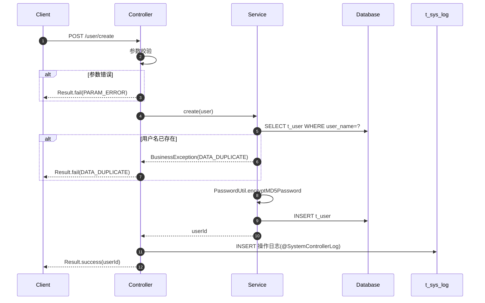

# core 模块 — 标准化接口文档模板

> 本模板用于 core 模块及上层模块所有 Controller 接口的标准化文档编写。每个接口对应一个文档实例，按照以下结构填写。
> 与 [代码示例](code-examples.md) 互补：代码示例提供实现套路，本模板提供文档规范。

---

## 1. 接口文档模板

### 1.1 接口基本信息

| 项目 | 内容 | 说明 |
|------|------|------|
| 接口名称 | [接口中文名称，如：创建用户] | 必填 |
| 接口描述 | [一句话描述功能] | 必填 |
| Controller | [类名，如：UserController] | 必填 |
| 方法名 | [方法名，如：create] | 必填 |
| URL | [如：POST /user/create] | 必填 |
| HTTP 方法 | [GET / POST / PUT / DELETE] | 必填 |
| 权限要求 | [如：authc / roles[admin] / perms[user:create]] | 必填 |
| 所属模块 | [如：用户管理] | 必填 |
| 审计日志 | [是/否，如：是，@SystemControllerLog(description="创建用户")] | 必填 |
| 涉及表 | [如：t_user(C), t_sys_log(C)] | 必填 |
| 数据源 | [如：默认 / @DataSource("sap")] | 选填，默认主库 |

### 1.2 请求参数

#### 表单参数（POST/PUT）

| 参数名 | 类型 | 必填 | 校验规则 | 默认值 | 业务含义 |
|--------|------|------|----------|--------|----------|
| user.userName | String | 是 | 非空，唯一，最大 50 字符 | - | 用户名 |
| user.password | String | 是 | 非空，最小 8 位 | - | 密码（明文，服务端加密） |
| user.realName | String | 是 | 非空，最大 50 字符 | - | 真实姓名 |
| user.compId | Integer | 是 | 非空，存在 t_company | - | 公司 ID |
| user.email | String | 否 | 邮箱格式 | - | 邮箱 |
| user.phone | String | 否 | 手机号格式 | - | 手机号 |

#### URL 参数（GET）

| 参数名 | 类型 | 必填 | 校验规则 | 默认值 | 业务含义 |
|--------|------|------|----------|--------|----------|
| userId | Integer | 是 | 正整数 | - | 用户 ID |

#### Session/上下文参数

| 参数名 | 来源 | 说明 |
|--------|------|------|
| Principal | Session | 当前登录用户主体，含 userId、userName、compId、isSysUser |
| UserContext | Session | 用户上下文，含角色、权限、区域权限 |
| remoteAddr | HttpServletRequest | 客户端 IP，用于日志记录 |

### 1.3 请求示例

#### POST 请求示例

```http
POST /user/create HTTP/1.1
Host: pms.dp.com
Content-Type: application/json
Cookie: JSESSIONID=abc123

{
  "user": {
    "userName": "zhangsan",
    "password": "password123",
    "realName": "张三",
    "compId": 1,
    "email": "zhangsan@dp.com",
    "phone": "13800138000"
  }
}
```

#### GET 请求示例

```http
GET /user/detail?userId=123 HTTP/1.1
Host: pms.dp.com
Cookie: JSESSIONID=abc123
```

### 1.4 响应结果

#### 成功响应

```json
{
  "code": "0",
  "message": "成功",
  "data": {
    "userId": 123,
    "userName": "zhangsan",
    "realName": "张三",
    "compId": 1,
    "createTime": "2026-06-25 10:00:00"
  }
}
```

| 字段 | 类型 | 说明 |
|------|------|------|
| code | String | 错误码，"0" 表示成功 |
| message | String | 消息，成功时为"成功" |
| data | Object | 返回数据，结构视接口而定 |
| data.userId | Integer | 用户 ID |
| data.userName | String | 用户名 |
| data.realName | String | 真实姓名 |
| data.compId | Integer | 公司 ID |
| data.createTime | String | 创建时间（yyyy-MM-dd HH:mm:ss） |

#### 失败响应

```json
{
  "code": "DATA_DUPLICATE",
  "message": "用户名已存在",
  "data": null
}
```

### 1.5 错误码

| 错误码 | 含义 | 触发场景 |
|--------|------|----------|
| `0` | 成功 | 操作成功 |
| `PARAM_ERROR` | 参数错误 | 必填项缺失、格式错误 |
| `DATA_DUPLICATE` | 数据重复 | 用户名已存在 |
| `UNAUTHORIZED` | 无权限 | 缺少 user:create 权限 |
| `SYS_ERR` | 系统异常 | 数据库异常等未捕获错误 |

> 完整错误码列表见 [错误码定义](error-codes.md)。

### 1.6 业务逻辑



### 1.7 注意事项

- **权限校验**：需 `user:create` 权限，Shiro 注解 `@RequiresPermissions("user:create")`
- **密码加密**：明文密码经 `PasswordUtil.encryptMD5Password` 加密后存储
- **审计日志**：通过 `@SystemControllerLog` 自动记录操作日志
- **公司隔离**：新用户 `compId` 必须为当前用户可管理的公司
- **唯一约束**：`user_name` 唯一，重复时返回 `DATA_DUPLICATE`

---

## 2. core 通用接口示例

### 2.1 登录接口

| 项目 | 内容 |
|------|------|
| 接口名称 | 用户登录 |
| Controller | LoginController |
| 方法名 | login |
| URL | POST /login |
| 权限要求 | anon（无需认证） |
| 审计日志 | 是，记录登录日志 |
| 涉及表 | t_user(R/U), t_user_login_record(C), t_sys_log(C), t_user_role(R), t_role_permission(R) |
| 数据源 | 默认 |

**请求参数**：

| 参数名 | 类型 | 必填 | 校验规则 | 业务含义 |
|--------|------|------|----------|----------|
| userName | String | 是 | 非空 | 用户名 |
| password | String | 是 | 非空 | 密码（明文） |
| captcha | String | 条件必填 | 与 Session 中验证码一致 | 验证码 |

**成功响应**：

```json
{
  "code": "0",
  "message": "成功",
  "data": {
    "userId": 123,
    "userName": "zhangsan",
    "realName": "张三",
    "compId": 1,
    "isSysUser": 0,
    "roles": ["ROLE_USER"],
    "permissions": ["user:view", "user:create"]
  }
}
```

**错误码**：

| 错误码 | 含义 | 触发场景 |
|--------|------|----------|
| `CAPTCHA_ERR` | 验证码错误 | 验证码不匹配或过期 |
| `UNKNOWN_ACCOUNT` | 用户不存在 | 用户名不存在 |
| `DISABLED` | 账号禁用/锁定 | status=0 或 status=2 |
| `AUTH_FAIL` | 认证失败 | 密码错误 |
| `LOGIN_FAIL` | 登录失败过多 | 失败次数超阈值 |

---

### 2.2 登出接口

| 项目 | 内容 |
|------|------|
| 接口名称 | 用户登出 |
| Controller | LoginController |
| 方法名 | logout |
| URL | GET /logout |
| 权限要求 | authc |
| 审计日志 | 是，记录登出日志 |
| 涉及表 | t_sys_log(C) |

**请求参数**：无

**成功响应**：

```json
{
  "code": "0",
  "message": "成功",
  "data": null
}
```

**业务逻辑**：
1. 调用 `SecurityUtils.getSubject().logout()` 销毁 Session；
2. 清除 EhCache 中的会话与授权缓存；
3. 记录登出日志；
4. 重定向到登录页。

---

### 2.3 密码修改接口

| 项目 | 内容 |
|------|------|
| 接口名称 | 修改密码 |
| Controller | PasswordController |
| 方法名 | changePassword |
| URL | POST /password/change |
| 权限要求 | authc |
| 审计日志 | 是，记录密码修改日志 |
| 涉及表 | t_user(U), t_password_history(C) |

**请求参数**：

| 参数名 | 类型 | 必填 | 校验规则 | 业务含义 |
|--------|------|------|----------|----------|
| oldPassword | String | 是 | 与当前密码匹配 | 原密码 |
| newPassword | String | 是 | 最小 8 位，复杂度校验，不与最近 5 次相同 | 新密码 |

**成功响应**：

```json
{
  "code": "0",
  "message": "成功",
  "data": null
}
```

**错误码**：

| 错误码 | 含义 | 触发场景 |
|--------|------|----------|
| `AUTH_FAIL` | 认证失败 | 原密码错误 |
| `PARAM_ERROR` | 参数错误 | 新密码不满足复杂度要求 |
| `DATA_DUPLICATE` | 数据重复 | 新密码与历史密码重复 |

---

### 2.4 文件上传接口

| 项目 | 内容 |
|------|------|
| 接口名称 | 文件上传 |
| Controller | UploaderController |
| 方法名 | upload |
| URL | POST /upload |
| 权限要求 | authc |
| 审计日志 | 是，记录上传日志 |
| 涉及表 | t_file(C), t_file_type(R) |
| Content-Type | multipart/form-data |

**请求参数**：

| 参数名 | 类型 | 必填 | 校验规则 | 业务含义 |
|--------|------|------|----------|----------|
| file | MultipartFile | 是 | 类型白名单，大小限制 | 上传的文件 |
| typeCode | String | 是 | 存在 t_file_type | 文件类型编码 |

**成功响应**：

```json
{
  "code": "0",
  "message": "成功",
  "data": {
    "fileId": 456,
    "originalName": "report.pdf",
    "fileSize": 102400,
    "fileType": "document",
    "uploadTime": "2026-06-25 10:00:00"
  }
}
```

**错误码**：

| 错误码 | 含义 | 触发场景 |
|--------|------|----------|
| `FILE_TYPE_ERR` | 文件类型不支持 | 扩展名不在白名单 |
| `FILE_SIZE_ERR` | 文件大小超限 | 超过配置的最大大小 |
| `UPLOAD_ERR` | 上传失败 | 磁盘写入失败 |

---

### 2.5 文件下载接口

| 项目 | 内容 |
|------|------|
| 接口名称 | 文件下载 |
| Controller | UploaderController |
| 方法名 | download |
| URL | GET /download |
| 权限要求 | authc |
| 审计日志 | 是，记录下载日志 |
| 涉及表 | t_file(R), t_file_download_log(C) |

**请求参数**：

| 参数名 | 类型 | 必填 | 校验规则 | 业务含义 |
|--------|------|------|----------|----------|
| fileId | Integer | 是 | 正整数，存在 t_file | 文件 ID |

**成功响应**：
- 响应头：`Content-Disposition: attachment; filename="originalName.pdf"`
- 响应体：文件二进制流

**错误码**：

| 错误码 | 含义 | 触发场景 |
|--------|------|----------|
| `FILE_NOT_FOUND` | 文件不存在 | fileId 无效 |
| `UNAUTHORIZED` | 无权限 | 无权下载该文件 |

---

### 2.6 数据导出接口

| 项目 | 内容 |
|------|------|
| 接口名称 | Excel 导出 |
| Controller | DataExportController |
| 方法名 | export |
| URL | POST /export |
| 权限要求 | authc |
| 审计日志 | 是，记录导出日志 |
| 涉及表 | 视导出内容而定 |

**请求参数**：

| 参数名 | 类型 | 必填 | 校验规则 | 业务含义 |
|--------|------|------|----------|----------|
| tableName | String | 是 | 白名单校验 | 导出表名 |
| conditions | JSON | 否 | - | 查询条件 |
| columns | List<String> | 否 | - | 导出列 |

**成功响应**：
- 响应头：`Content-Type: application/vnd.ms-excel`
- 响应体：Excel 文件流

---

### 2.7 用户查询接口（分页）

| 项目 | 内容 |
|------|------|
| 接口名称 | 用户分页查询 |
| Controller | UserController |
| 方法名 | list |
| URL | POST /user/list |
| 权限要求 | authc, perms[user:view] |
| 审计日志 | 否 |
| 涉及表 | t_user(R), t_user_info(R), t_company(R) |

**请求参数**：

| 参数名 | 类型 | 必填 | 默认值 | 业务含义 |
|--------|------|------|--------|----------|
| pageNum | Integer | 否 | 1 | 页码 |
| pageSize | Integer | 否 | 15 | 每页大小 |
| param.userName | String | 否 | - | 用户名（模糊查询） |
| param.status | Integer | 否 | - | 状态 |
| param.compId | Integer | 否 | - | 公司 ID |

**成功响应**：

```json
{
  "code": "0",
  "message": "成功",
  "data": {
    "list": [
      {
        "userId": 123,
        "userName": "zhangsan",
        "realName": "张三",
        "compId": 1,
        "compName": "总公司",
        "status": 1
      }
    ],
    "total": 100,
    "pageNum": 1,
    "pageSize": 15,
    "totalPages": 7
  }
}
```

---

### 2.8 用户详情接口

| 项目 | 内容 |
|------|------|
| 接口名称 | 用户详情 |
| Controller | UserController |
| 方法名 | detail |
| URL | GET /user/detail |
| 权限要求 | authc, perms[user:view] |
| 审计日志 | 否 |
| 涉及表 | t_user(R), t_user_info(R), t_user_role(R), t_role(R) |

**请求参数**：

| 参数名 | 类型 | 必填 | 业务含义 |
|--------|------|------|----------|
| userId | Integer | 是 | 用户 ID |

**成功响应**：

```json
{
  "code": "0",
  "message": "成功",
  "data": {
    "user": {
      "userId": 123,
      "userName": "zhangsan",
      "realName": "张三",
      "compId": 1,
      "status": 1,
      "isSysUser": 0,
      "createTime": "2026-01-01 00:00:00"
    },
    "userInfo": {
      "email": "zhangsan@dp.com",
      "phone": "13800138000",
      "officeCode": "BJ001",
      "areaPower": "BJ001,SH001"
    },
    "roles": [
      {"roleId": 1, "roleName": "管理员"}
    ]
  }
}
```

---

## 3. 接口设计规范

### 3.1 URL 设计

| 规则 | 示例 | 说明 |
|------|------|------|
| 使用小写字母 | `/user/create` | 不使用大写 |
| 使用连字符分隔 | `/user-role/list` | 不使用下划线 |
| 资源名用复数 | `/users` | 列表资源 |
| 动作用动词 | `/user/create` | core 保留动词风格 |
| 嵌套不超过 2 层 | `/user/{id}/roles` | 避免深层嵌套 |

### 3.2 HTTP 方法使用

| 方法 | 用途 | 示例 |
|------|------|------|
| GET | 查询 | `GET /user/detail?userId=123` |
| POST | 创建 | `POST /user/create` |
| PUT | 全量更新 | `PUT /user/update` |
| DELETE | 删除 | `DELETE /user/delete?userId=123` |

> **注意**：core 实际代码中 POST 用于大多数操作（含更新），严格 RESTful 风格需逐步迁移。

### 3.3 响应格式规范

```json
{
  "code": "0",
  "message": "成功",
  "data": {
    // 业务数据
  }
}
```

| 字段 | 类型 | 必填 | 说明 |
|------|------|------|------|
| code | String | 是 | 错误码，"0" 表示成功 |
| message | String | 是 | 消息，前端可直接展示 |
| data | Object | 否 | 成功时返回数据，失败时为 null |

### 3.4 分页响应规范

```json
{
  "code": "0",
  "message": "成功",
  "data": {
    "list": [],
    "total": 100,
    "pageNum": 1,
    "pageSize": 15,
    "totalPages": 7
  }
}
```

### 3.5 时间格式规范

| 类型 | 格式 | 示例 |
|------|------|------|
| 日期 | yyyy-MM-dd | 2026-06-25 |
| 时间 | yyyy-MM-dd HH:mm:ss | 2026-06-25 10:00:00 |
| 时间戳 | 毫秒数 | 1782352939000 |

> 实体日期字段加 `@JsonSerialize(using=JsonSerializer.class)` 统一格式化。

---

## 4. 接口文档编写检查清单

### 4.1 必填项检查

- [ ] 接口名称、描述、URL、HTTP 方法
- [ ] 权限要求（authc/roles/perms）
- [ ] 请求参数表（名、类型、必填、校验、含义）
- [ ] 请求示例（HTTP 报文）
- [ ] 成功响应示例与字段说明
- [ ] 错误码列表
- [ ] 涉及表与 CRUD 操作
- [ ] 业务逻辑时序图（复杂接口）

### 4.2 质量检查

- [ ] 参数校验规则明确（非空、长度、格式、范围）
- [ ] 错误码覆盖所有异常场景
- [ ] 响应字段类型与含义清晰
- [ ] 时间格式统一（yyyy-MM-dd HH:mm:ss）
- [ ] 示例 JSON 可直接用于测试
- [ ] 权限要求与 Shiro 配置一致
- [ ] 审计日志标注是否记录

### 4.3 安全检查

- [ ] 敏感字段（密码）不返回前端
- [ ] 错误消息不暴露系统信息（SQL、堆栈）
- [ ] 权限校验明确
- [ ] 文件上传/下载接口标注安全措施
- [ ] 越权风险已评估（compId 隔离）

---

## 5. 接口测试建议

### 5.1 测试工具

| 工具 | 用途 | 说明 |
|------|------|------|
| Postman | 接口测试 | 推荐，支持环境变量、集合 |
| curl | 命令行测试 | 快速验证 |
| Swagger | 接口文档 | 自动生成（core 未集成） |
| Druid | SQL 监控 | 验证 SQL 执行 |

### 5.2 测试用例设计

| 场景 | 测试要点 | 预期结果 |
|------|----------|----------|
| 正常流程 | 合法参数 | code=0，返回正确数据 |
| 参数缺失 | 必填项为空 | code=PARAM_ERROR |
| 参数非法 | 格式错误 | code=PARAM_ERROR |
| 未登录 | 无 Session | code=AUTH_FAIL |
| 无权限 | 缺少权限 | code=UNAUTHORIZED |
| 数据重复 | 唯一约束冲突 | code=DATA_DUPLICATE |
| 数据不存在 | ID 无效 | code=DATA_NOT_FOUND |
| 系统异常 | 模拟 DB 异常 | code=SYS_ERR |

### 5.3 curl 测试示例

```bash
# 登录
curl -X POST http://pms.dp.com/login \
  -H "Content-Type: application/x-www-form-urlencoded" \
  -d "userName=admin&password=admin123&captcha=abcd" \
  -c cookies.txt

# 查询用户列表（带 Session）
curl -X POST http://pms.dp.com/user/list \
  -H "Content-Type: application/json" \
  -d '{"pageNum":1,"pageSize":15,"param":{"userName":"zhang"}}' \
  -b cookies.txt

# 文件上传
curl -X POST http://pms.dp.com/upload \
  -F "file=@/path/to/file.pdf" \
  -F "typeCode=document" \
  -b cookies.txt
```

---

## 6. 相关文档

- [代码示例](code-examples.md) — 接口实现代码示例
- [错误码定义](error-codes.md) — 完整错误码列表
- [术语表](glossary.md) — 接口相关术语
- [编码规范](../05-standards/coding-standards.md) — Controller 编码规范
- [安全实践](../05-standards/security-practices.md) — 接口安全防护
- [数据流向图](../04-mapping/data-flow.md) — 接口数据流向
- [用户管理](../02-modules/user-management.md) — 用户接口详解
- [文件管理](../02-modules/file-management.md) — 文件接口详解
