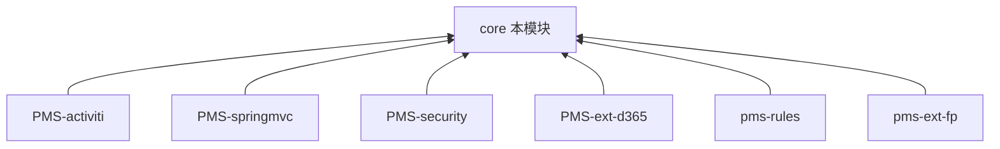

# core 模块知识库

> DPtech PMS 底层基础框架模块（`pms-mvc-core`）。为上层所有业务模块提供认证授权、多数据源、AOP、工具类等横切基础设施。本知识库独立维护。

---

## 模块定位

| 项 | 值 |
|----|----|
| 目录 | `PMS/core/` |
| artifactId | `pms-mvc-core` |
| 基础包 | `com.dp.plat.core` / `com.dp.plat.security` / `com.dp.plat.support` |
| 技术栈 | Spring 5 + Spring MVC + MyBatis 3.5 + Shiro 1.8 + CAS 3.2 |
| JDK | 1.8 |
| 角色 | 被依赖方（地基），不含业务逻辑 |
| 管辖数据库表 | `t_*` 系统支撑域（用户/角色/权限/菜单/组织/日志/文件/邮件/同步） |

### 依赖关系

core 是依赖图根节点，被以下模块依赖：

> 上层模块复用 core 的基类（AbstractBaseService/AbstractBaseMapper/BaseEntity）、统一返回（Result）、认证（ShiroRealm）、多数据源（@DataSource）、Excel 导出与工具类。详见各模块知识库。

---

## 文档目录

| 章节 | 文档 | 内容 |
|------|------|------|
| 01-架构 | [系统架构](01-architecture/system-architecture.md) | 分层架构、多数据源路由、Shiro+CAS 认证、包结构 |
| 02-模块 | [公共组件功能说明](02-modules/common-components.md) | 认证/数据源/AOP/Controller/工具/标签/异常逐组件说明 |
| 03-数据库 | [数据字典](03-database/complete-data-dictionary.md) | `t_*` 表族字段/索引/ER图/数据流转 |
| 04-映射 | [功能-数据CRUD矩阵](04-mapping/crud-matrix.md) | 组件×表 CRUD + 登录/数据源/日志数据流 |
| 05-规范 | [编码规范](05-standards/coding-standards.md) | 分层/命名/复用/并发/安全/性能/异常规范 |
| 06-参考 | [代码示例与术语](06-reference/code-examples.md) | 新增实体套路、接口模板、错误码、术语表 |
| 审计 | [audit/](audit/) | 知识库质量审核报告 |

---

## 快速导航

**新成员入门**：先读 [系统架构](01-architecture/system-architecture.md) → [公共组件](02-modules/common-components.md)

**上层模块开发者**：重点看 [编码规范 §3 代码复用](05-standards/coding-standards.md) + [代码示例 §1 新增实体套路](06-reference/code-examples.md)

**运维/排障**：[数据字典 §七 数据流转](03-database/complete-data-dictionary.md) + [CRUD矩阵](04-mapping/crud-matrix.md)

**安全相关**：架构 §4 认证授权 + 规范 §5 安全防护（细化组件见 [PMS-security](../../PMS-security/docs/README.md)）

---

## 跨库知识共享

- 数据库：core 主数据源由 `jdbc.properties` 的 `jdbc.url` 配置（dev=`dppms_d365`，release=`dppms_d365`）；PMS-struts 历史主干使用 `dppms_d365`（见 `pms.url`）。全量业务字典见 [PMS-struts/03-database/database_dict final.md](../PMS-struts/docs/03-database/database_dict%20final.md)
- EHR 组织表（ehr_*）：[PMS-springmvc 数据字典](../PMS-springmvc/docs/03-database/complete-data-dictionary.md)
- 安全组件细化（XSS/CSRF）：[PMS-security](../PMS-security/docs/02-modules/security-components.md)
- 规则/表达式（Aviator）：[pms-rules](../pms-rules/docs/02-modules/rules-engine.md)

---

## 文档维护

- 表结构变更（t_* 表）须同步更新 [03-数据库](03-database/complete-data-dictionary.md)
- 新增公共组件须更新 [02-模块](02-modules/common-components.md)
- 修改后运行 [audit/](audit/) 核对清单确保一致性
