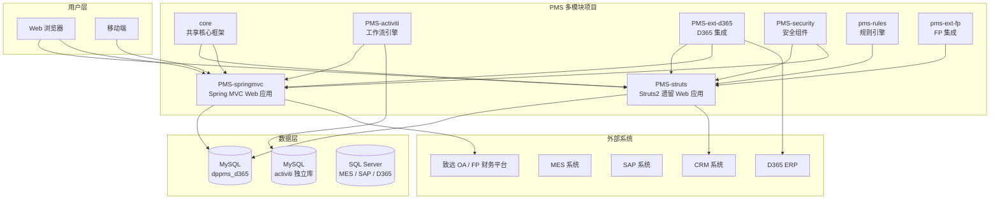
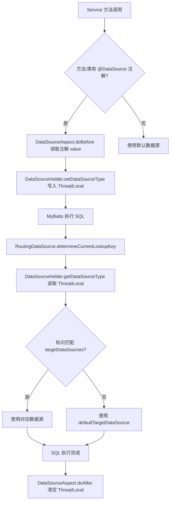
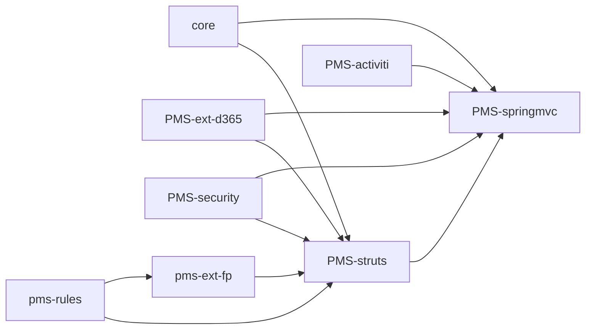
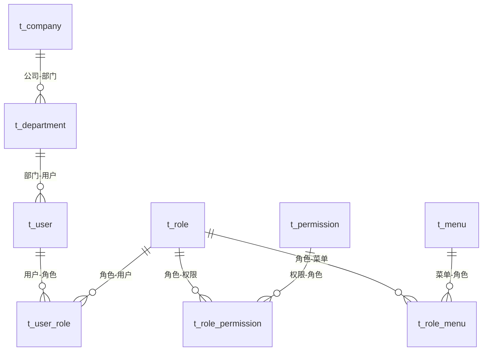

# PMS 系统 Code Wiki

> 迪普科技（DPtech）项目管理系统（Project Management System）代码知识库。本文档基于实际源码分析生成，覆盖项目整体架构、模块职责、关键类与函数、依赖关系与运行方式。

---

## 目录

- [1. 项目概述](#1-项目概述)
- [2. 整体架构](#2-整体架构)
- [3. 技术栈总览](#3-技术栈总览)
- [4. 模块详解](#4-模块详解)
  - [4.1 core（pms-mvc-core）共享框架](#41-corepms-mvc-core共享框架)
  - [4.2 PMS-struts 遗留 Web 主干](#42-pms-struts-遗留-web-主干)
  - [4.3 PMS-springmvc 新版 Web 表现层](#43-pms-springmvc-新版-web-表现层)
  - [4.4 PMS-activiti 工作流引擎](#44-pms-activiti-工作流引擎)
  - [4.5 PMS-security 安全组件](#45-pms-security-安全组件)
  - [4.6 PMS-ext-d365 D365 集成](#46-pms-ext-d365-d365-集成)
  - [4.7 pms-ext-fp 财务平台集成](#47-pms-ext-fp-财务平台集成)
  - [4.8 pms-rules 规则引擎](#48-pms-rules-规则引擎)
- [5. 关键技术机制](#5-关键技术机制)
- [6. 依赖关系](#6-依赖关系)
- [7. 数据库与数据源](#7-数据库与数据源)
- [8. 安全架构](#8-安全架构)
- [9. 项目运行方式](#9-项目运行方式)
- [10. 注意事项与避坑指南](#10-注意事项与避坑指南)

---

## 1. 项目概述

PMS（Project Management System）是一个基于 Java EE 的企业级应用系统，主要用于**项目管理、售前管理、回访管理、转包管理、维保管理、问题管理、工作流审批**等业务场景。系统采用 Maven 多模块架构，基础包名 `com.dp.plat`，JDK 1.8。

根 `pom.xml`（`com.dp.plat:pms:0.0.1`，packaging=pom）声明了 8 个子模块：

| 模块 | artifactId | 打包 | 工作区状态 |
|------|-----------|------|-----------|
| `core` | `pms-mvc-core` | war+jar | ✅ 存在 |
| `PMS-struts` | `pms-struts` | war+jar | ✅ 存在 |
| `PMS-springmvc` | `pms-springmvc` | war+jar | ✅ 存在 |
| `PMS-activiti` | `pms-activiti` | war+jar | ✅ 存在 |
| `PMS-ext-d365` | `pms-ext-d365` | jar | ✅ 存在 |
| `PMS-security` | `pms-security` | jar | ✅ 存在 |
| `pms-ext-fp` | `pms-ext-fp` | jar | ✅ 存在 |
| `pms-rules` | `pms-rules` | jar | ⚠️ 声明但目录不在当前工作区 |

> AGENTS.md 还提及 SPMS（备件管理系统），它是一个独立的非 Maven 项目，与 PMS 共用底层 `dppms_d365` 数据库，但目录不在当前工作区。

---

## 2. 整体架构



**架构特征：**

- **双 Web 框架并存**：遗留业务走 PMS-struts（Struts2 2.3.35，`*.action`），新业务走 PMS-springmvc（Spring MVC 5.3.19，`*.html`/`*.json`/`*.xlsx`）
- **双 ORM 并存**：遗留业务用 iBATIS（`<sqlMap>`），新业务用 MyBatis 3.5.9（`<mapper>`）
- **共享核心**：core 模块以 `war + core classifier jar` 形式被所有上层模块依赖
- **多数据源路由**：通过 `RoutingDataSource` + ThreadLocal 实现 MySQL/SQL Server 多库切换
- **war overlay**：PMS-springmvc 通过 war overlay 合并 core、PMS-activiti 的 Web 资源

---

## 3. 技术栈总览

| 层次 | 技术 | 版本 | 说明 |
|------|------|------|------|
| Web 框架 | Struts2 | 2.3.35 / 2.5.30 | PMS-struts 用 2.3.35，PMS-springmvc 用 2.5.30 |
| Web 框架 | Spring MVC | 5.3.19 | PMS-springmvc 使用 |
| IoC 容器 | Spring Framework | 5.3.19 | XML + 注解混合配置 |
| ORM | MyBatis | 3.5.9 | core、springmvc、ext-d365 使用 |
| ORM | iBATIS | 2.3.4.726 | PMS-struts 遗留使用 |
| 安全框架 | Apache Shiro | 1.8.0 | 认证、授权、会话管理 |
| 单点登录 | CAS Client | 3.2.2 | CAS 集成（可选） |
| 工作流 | Activiti | 5.23.0 | 流程审批引擎 |
| 定时任务 | Quartz | 2.3.2 | 任务调度 |
| 连接池 | Druid | 1.2.8 | 主连接池 |
| 连接池 | commons-dbcp | 1.4 | PMS-struts 遗留 |
| 数据库 | MySQL | 8.0.16 | 主数据库 `dppms_d365` |
| 数据库 | SQL Server | - | D365/SAP/MES 外部数据源 |
| JSON | Fastjson | 1.2.83 | 主要 JSON 处理 |
| JSON | Jackson | 2.13.1 | Spring MVC 集成 |
| Excel | Apache POI | 5.2.0 | Excel 导入导出 |
| Excel | EasyExcel | 3.1.1 | PMS-springmvc 使用 |
| 日志 | Logback | 1.2.10 | core、springmvc |
| 日志 | Log4j2 | 2.17.1 | PMS-struts |
| 模板引擎 | Velocity | 1.6.4 | PMS-struts 代码生成/邮件 |
| 模板引擎 | FreeMarker | 2.3.30 | PMS-springmvc |
| 规则引擎 | Aviator | 5.4.3 | 表达式求值（pms-rules 实际落地） |
| 规则引擎 | LiteFlow | 2.15.0 | 仅声明依赖，未落地 |
| 规则引擎 | Groovy | 3.0.19 | 仅声明依赖，未落地 |
| HTTP 客户端 | Hutool / OkHttp / HttpClient | - | 外部 API 调用 |
| HTML 解析 | Jsoup | 1.14.3 | XSS 过滤核心依赖 |

---

## 4. 模块详解

### 4.1 core（pms-mvc-core）共享框架

**定位**：PMS 项目的共享框架 / 基础设施模块，是所有上层业务模块的依赖根。打包为 `war`，同时通过 `maven-jar-plugin` 产出 `core` classifier 的 jar 供其他模块依赖。基础包名 `com.dp.plat.core`。

**核心职责**：多数据源路由、Shiro 认证授权（本地账号 + CAS 双模式）、Quartz 定时调度、系统级 AOP 切面、系统变量/菜单/角色/权限管理、通用工具类、Spring MVC 配置。

#### 包结构（`core/src/main/java/com/dp/plat/`）

```
core/
├── annotation/        # @DataSource、@SystemControllerLog、@SystemServiceLog
├── aop/               # DataSourceAspect、SystemLogAspect、ExceptionAspect、SystemCoreFunctionAspect
├── cas/               # CAS 单点登出（CasLogoutFilter、SingleSignOutHandler）
├── concurrent/        # 上下文传递线程池（RequestThreadPoolExecutor）
├── config/            # RoutingDataSource、DataSourceHolder、SystemConfig
├── context/           # HttpContext、SpringContext、UserContext
├── controller/        # admin/、cluster/、BaseController、LoginController 等
├── converter/         # DateConverter、DecimalConverter
├── dao/               # AbstractBaseMapper 及 23 个业务 Mapper
├── entity/            # BaseEntity、DataOperation
├── exception/         # ExceptionHandler、CaptchaException 等
├── factory/           # FilterChainDefinitionMapBuilder（Shiro 过滤链构建）
├── filter/            # AnyRolesAuthorizationFilter、HostFilter、CasFilter
├── interceptor/       # PasswordInterceptor（强制改密）
├── listener/          # DpFormAuthenticationListener
├── mapping/           # MyBatis XML（与 Java 同目录）
├── param/             # Consts、RoleConstant
├── pojo/              # User、Role、Menu、Permission、Resource 等
├── realms/            # ShiroRealm、CasRealm、Principal
├── schedule/          # MailerJob、SynchronizeJob、SyncType
├── serializer/        # DateSerializer、JsonSerializer
├── service/           # I*Service / impl/*Service
├── tags/              # JSP 自定义标签
├── util/              # DateUtil、FileUtil、IpUtil、PasswordUtil、SQLParser、JsoupUtil 等
├── view/              # ExcelView、ExcelView4XLSX
└── vo/                # Result、ResultCode、PageParam、TreeNode 等
```

#### 关键类

| 类 | 路径 | 职责 |
|----|------|------|
| `RoutingDataSource` | `core.config.RoutingDataSource` | 继承 `AbstractRoutingDataSource`，按 ThreadLocal 标识路由数据源 |
| `DataSourceHolder` | `core.config.DataSourceHolder` | 基于 `ThreadLocal<String>` 持有当前线程数据源标识 |
| `SystemConfig` | `core.config.SystemConfig` | `@Configuration`，启动时加载系统变量到静态 Map |
| `DataSource` | `core.annotation.DataSource` | 数据源切换注解（类/方法级别） |
| `DataSourceAspect` | `core.aop.DataSourceAspect` | 切面，方法前设置数据源标识，方法后清空 |
| `ShiroRealm` | `core.realms.ShiroRealm` | 本地账号认证授权 Realm（含验证码校验） |
| `CasRealm` | `core.realms.CasRealm` | CAS 单点登录 Realm |
| `Principal` | `core.realms.Principal` | 登录主体，封装用户/角色/权限/菜单 |
| `UsernamePasswordCaptchaToken` | `core.pojo.UsernamePasswordCaptchaToken` | 扩展 Token，携带验证码 |
| `FilterChainDefinitionMapBuilder` | `core.factory.FilterChainDefinitionMapBuilder` | 从 DB Resource 表动态构建 Shiro 过滤链 |
| `AnyRolesAuthorizationFilter` | `core.filter.AnyRolesAuthorizationFilter` | 任一角色通过即放行 |
| `HostFilter` | `core.filter.HostFilter` | IP 白/黑名单，支持通配符/段/CIDR |
| `SystemCoreFunctionAspect` | `core.aop.SystemCoreFunctionAspect` | 权限/菜单/系统变量热更新 Shiro 过滤链与缓存 |
| `SystemLogAspect` | `core.aop.SystemLogAspect` | 系统操作日志切面（`@SystemControllerLog`/`@SystemServiceLog`） |
| `ExceptionAspect` | `core.aop.ExceptionAspect` | Controller 层异常捕获切面 |
| `ExceptionHandler` | `core.exception.exceptionHandler.ExceptionHandler` | 全局异常解析器，异常入库 + 跳转 500 |
| `MailerJob` | `core.schedule.MailerJob` | 定时扫描并发送待发邮件 |
| `SynchronizeJob` | `core.schedule.SynchronizeJob` | 数据同步（全量/增量，多线程多数据源） |
| `SpringContext` / `HttpContext` / `UserContext` | `core.context.*` | Spring/请求/用户上下文持有器 |
| `PasswordUtil` | `core.util.PasswordUtil` | 密码加密（MD5/SHA1 + 盐 + 迭代） |
| `AbstractBaseService` / `AbstractBaseMapper` | `core.service.impl` / `core.dao` | Service/Mapper 泛型基类 |

#### 配置文件（`core/src/main/resources/`）

| 文件 | 作用 |
|------|------|
| `spring.xml` | Spring 主配置，数据源、RoutingDataSource、import 子配置 |
| `spring-mybatis.xml` | MyBatis 整合、Mapper 扫描、事务管理 |
| `spring-mvc.xml` | Spring MVC（视图解析、拦截器、AOP、文件上传） |
| `spring-shiro.xml` | Shiro 配置（本地账号模式） |
| `spring-shiro-cas.xml` | Shiro + CAS 单点登录配置 |
| `beans-quartz.xml` | Quartz 定时任务配置 |
| `ehcache.xml` | EhCache（Shiro 会话与授权缓存） |
| `logback.xml` | 日志配置 |
| `jdbc.properties` / `jdbc_dev.properties` / `jdbc_release.properties` | 数据源参数 |

---

### 4.2 PMS-struts 遗留 Web 主干

**定位**：DPtech PMS 核心业务主干模块（Struts2 技术栈），承载项目管理全生命周期业务，是 PMS 体系中功能最完整、数据量最大的模块。基础包名 `com.dp.plat`（含 action/service/dao/data/extend 等子包）。

**关键特征**：
- 源码目录非标准：`src/`（非 `src/main/java`），配置在 `config/`（非 `src/main/resources`），通过 pom 的 `<sourceDirectory>` 配置
- Struts2 **2.3.35**（与 PMS-springmvc 的 2.5.30 版本体系独立）
- **iBATIS 与 MyBatis 并存**：遗留业务用 iBATIS（`config-ibaits/sql-map-*.xml`），新业务用 MyBatis
- `echarts-utils` 为 system 作用域依赖，位于 `WebContent/WEB-INF/lib/Utils-v0.1.jar`
- Spring 为 XML 配置（`config-spring/applicationContext*.xml`）

#### 功能模块与核心 Action

| 功能模块 | 核心 Action | 主要数据表 |
|----------|------------|-----------|
| 项目管理 | `ProjectAction`、`PmClosedLoopAction`、`ProjectContractAction`、`ProjectMemberAction`、`ProjectWeeklyAction` | `pm_project*` |
| 售前管理 | `PresalesAction` | `pm_presales*` |
| 转包管理 | `subcontract.action.SubcontractAction` | `pm_subcontract*` |
| 回访管理 | `CallBackAction` | `pm_cl*` |
| 维保管理 | `maintenance.action.MaintenanceAction` | `pm_project_maintenance*` |
| 问题管理 | `prob.action.ProbManageAction` | `prob*` |
| 系统管理 | `UserManageAction`、`RoleManageAction`、`DepartmentManageAction`、`BasicDataManageAction` | `fnd*` |
| 报表分析 | `ReportAction`、`DataAnalysisAction` | 各业务表聚合 |
| 工作流 | `WorkFlowAction` | `act_*` |
| 证书管理 | `plus.certificate.action.CertificateAction` | - |
| 质保回访 | `warrantyCallback.action.WarrantyCallbackAction` | - |
| 督查管理 | `supervision.action.SupervisionAction` | - |
| 登录/上传 | `LoginAction`、`UploadAction`、`OperateLogAction` | `fnd_files` 等 |

#### 包结构（`PMS-struts/src/com/dp/plat/`）

```
├── action/            # 25 个 Struts2 Action（主入口）
├── aop/               # XMLAdvice、AspectUtil
├── context/           # HttpContext、SpringContext、UserContext、SystemContext、VContext
├── dao/               # 37 个 DAO 接口 + 实现（iBATIS 风格 Dao/DaoImpl）
├── data/              # bean/（业务 Bean）、activity/、report/、vo/
├── decorators/        # DisplayTag 装饰器
├── extend/            # crm/、erms/、mybatis/ 扩展
├── ibatis/            # iBATIS 类型处理器（FastjsonTypeHandler 等）、LRU 缓存
├── job/               # Quartz 定时任务（数据同步、邮件、报表）
├── maintenance/       # 维保子模块（action/aop/entity/quartz/vo）
├── param/             # 请求参数 Bean
├── plus/              # certificate/、unifytask/（统一任务推送）
├── prob/              # 问题管理子模块（含 version/ 版本解析策略）
├── service/           # 38 个 Service 接口 + 实现
├── subcontract/       # 转包子模块（action/dao/service/listener/quartz）
├── support/           # 左侧菜单组件
├── tags/              # JSP 自定义标签
├── taskHandler/       # BPMN 结束事件监听器（CallBackTaskHandler 等）
├── template/          # Excel/Word 模板
├── util/              # 工具类（MailUtil、DateUtil、MessageUtil、AviatorUtils 等）
└── warrantyCallback/  # 质保回访子模块
```

#### 关键类

| 类 | 路径 | 职责 |
|----|------|------|
| `BaseAction` / `ProjectBaseAction` | `com.dp.plat.action` | Action 基类，封装分页/用户上下文 |
| `ProjectServiceImpl` | `com.dp.plat.service` | 项目管理核心服务 |
| `WorkFlowServiceImpl` | `com.dp.plat.service` | 工作流启动/提交（`startProcess`/`submitTask`） |
| `CallBackTaskHandler` / `ProjectCloseTaskHandler` / `PresalesClosedTaskHandler` | `com.dp.plat.taskHandler` | BPMN 结束事件 `executionListener` |
| `CancelSubcontractFlowListener` | `com.dp.plat.subcontract.listener` | ServiceTask，取消转包申请 |
| `UnifyTaskListener` | `com.dp.plat.plus.unifytask.listener` | PMS-struts 侧统一任务监听器（5.13 版本实现） |
| `UnifyTask2SeeyonSender` | `com.dp.plat.plus.unifytask.sender` | 推送任务至致远 OA |
| `AbstractBaseService` / `AbstractBaseMapper` | `com.dp.plat.extend.mybatis` | MyBatis 泛型基类（供新业务复用） |
| `UserCheckFilter` | `com.dp.plat.util` | `*.action` 请求用户登录校验 |
| `AviatorUtils` | `com.dp.plat.util` | Aviator 表达式工具（与 pms-rules 同名，独立实现） |

#### 配置文件

| 目录 | 内容 |
|------|------|
| `config/` | `struts.xml`、`struts-sys.xml`、`jdbc*.properties`、`config.properties`、`beans-quartz.xml`、`ehcache.xml`、`log4j2.xml` |
| `config-ibaits/` | `sqlMapConfig*.xml`（主库 + CRM/D365/EHR/ITR/License/OA/SAP/SMS/SSE 多数据源）+ `sql-map-*-config.xml` |
| `config-spring/` | `applicationContext*.xml`（action/common/context/dao/security/service）、`activiti-context.xml`、`spring-extend-mybatis.xml` |
| `WebContent/WEB-INF/` | `web.xml`、`web-f.xml`、`web-s.xml`、`decorators.xml`、`*.tld` |

---

### 4.3 PMS-springmvc 新版 Web 表现层

**定位**：PMS 较新的 Web 表现层模块，基于 Spring MVC 5.3.19，承载项目管理（PM）、安服管理（AF）、工作流等核心业务的前后端交互，逐步替代 Struts2 Action。基础包名 `com.dp.plat.pms.springmvc`。

**与 PMS-struts 的关系**：并存。通过 `pms-struts` 的 `core` classifier jar 复用 PMS-struts 的 Service/DAO/Entity；`web.xml` 同时配置 Struts2 过滤器（`*.action`）和 Spring MVC DispatcherServlet（`*.html`/`*.json`/`*.xlsx`/`*.xls`/`/modals/*`）。`StrutsApiController` 提供桥接能力调用遗留 Struts2 Service。

#### 包结构（`PMS-springmvc/src/main/java/com/dp/plat/`）

```
├── activiti/
│   ├── unifytask/      # 统一任务推送（listener/、sender/、vo/）
│   └── core/handlers/  # MyBatis TypeHandler（Fastjson/Jackson/Object2String）
├── ehr/                # EHR 人事系统集成（annotation/controller/dao/entity/job/service/vo）
└── pms/
    ├── aop/            # ProjectManagementAspect、DispatchSettlementUpdateAspect
    ├── filter/         # ExcludeAdminControllerTypeFilter、UserCheckFilter
    └── springmvc/      # 业务主包
        ├── constant/   # ProjectConstant、RoleConstant
        ├── controller/ # 19 个 Controller（含 AbstractController/BaseController）
        ├── dao/        # 20 个 MyBatis Mapper
        ├── entity/     # 19 个实体
        ├── excel/      # ExcelAnalysisEventListener（EasyExcel）
        ├── job/        # 4 个 Quartz 定时任务
        ├── listener/   # 3 个 Activiti 任务监听器
        ├── mapping/    # 20 个 MyBatis XML（与 Java 同目录）
        ├── service/    # 20 个 Service 接口（impl/ 为实现）
        ├── util/       # DocUtil、ImageUtil、PermissionUtils
        └── vo/         # 22 个 VO
```

#### 关键类

**Controller 层（19 个）**：

| 类 | `@RequestMapping` | 职责 |
|----|-------------------|------|
| `AbstractController<T>` | - | 泛型基类，封装通用 CRUD/列表/详情/导入 |
| `BaseController` | - | 字段/列/Tab 查询能力 |
| `ProjectController` | `/pm/project` | 项目管理（立项/查询/转换/SMS 同步） |
| `ProjectTaskController` | `/pm/project/task` | 项目任务管理 |
| `ProjectMemberController` | `/pm/member` | 项目成员管理 |
| `ProjectManageUserController` | `/pm/user` | 项目用户管理（含 Shiro 权限刷新） |
| `DispatchProjectController` | `/pm/dispatch` | 外派项目管理 |
| `DispatchSettlementController` | `/pm/settlement` | 外派结算管理（含发票/付款同步） |
| `DailyReportController` | `/pm/daily/report` | 日报管理 |
| `IndustryAssetController` | `/af/industry/asset` | 行业资产管理 |
| `IndustryLeakController` | `/af/industry/leak` | 行业漏洞管理 |
| `WorkFlowController` | `/workflow` | 工作流审批（启动/完成/撤回/批量） |
| `WorkBenchController` | `/workflow/workbench` | 工作流工作台（待办/已办） |
| `StrutsApiController` | `/api` | 桥接遗留 Struts2 Service |

**其他核心类**：

| 类 | 职责 |
|----|------|
| `ProjectManagementAspect` | 用户/角色/菜单变更时刷新 Shiro 权限拦截链 |
| `ExcludeAdminControllerTypeFilter` | 按 `system.properties` 排除 admin controller（pms3 启用） |
| `QualityApproveTrackListener` / `SubcontractInspectionListener` | Activiti 任务监听器 |
| `D365DataJob` / `SMSDataJob` / `EhrDataJob` | 数据同步定时任务 |
| `DispatchSettlementInvoiceToFPJob` | 结算发票推送 FP |
| `ExcelAnalysisEventListener` | EasyExcel 分析监听器 |

#### Profile 机制

PMS-springmvc 有两个维度的 Profile：

**构建 Profile**（决定 finalName 和资源覆盖）：

| Profile | finalName | 默认激活 |
|---------|-----------|----------|
| `pms2` | `PMS2` | 是 |
| `pms3` | `AFPMS3` | 否 |

**环境 Profile**（决定数据源配置）：

| Profile | env | 默认激活 |
|---------|-----|----------|
| `dev` | dev | 是 |
| `release` | release | 否 |
| `test` | test | 否 |

资源覆盖顺序：`src/main/resources/` → `profiles/${env}/` → `profiles/${profile.build.id}/`（后者覆盖前者）。

---

### 4.4 PMS-activiti 工作流引擎

**定位**：PMS 工作流基础模块，集成 Activiti 5.23.0 引擎，提供流程审批、流程设计器（Activiti Modeler）、流程图跟踪能力。基础包名 `com.dp.plat.activiti`。打包为 `war`，同时产出 `api` classifier jar 供 PMS-springmvc 复用。

> BPMN 流程定义文件实际位于 `PMS-struts/bpmn/`，由 PMS-struts 部署到 Activiti 仓库；PMS-activiti 模块本身仅提供引擎与 API。

#### 关键类

| 类 | 路径 | 职责 |
|----|------|------|
| `ModelController` | `activiti.controller` | 流程模型管理（设计器入口） |
| `ProcessDefinitionController` | `activiti.controller` | 流程定义管理（部署/删除/转换/流程图） |
| `ProcessInstanceController` | `activiti.controller` | 流程实例管理 |
| `TaskController` | `activiti.controller` | 任务管理（待办/签收/委派/转办/撤销/撤回/跳转） |
| `ProcessService` | `activiti.service.impl` | 流程核心服务（~1140 行） |
| `RuntimePageService` | `activiti.service.impl` | 流程明细查询（已执行/当前/下一步节点、审批意见） |
| `ActUserTaskService` | `activiti.service.impl` | 动态任务分配（基于 `dp_act_unify_task` 表） |
| `RevokeTaskCmd` | `activiti.process.cmd` | 撤销任务（删除当前及后续，恢复历史任务） |
| `WithdrawTaskCmd` | `activiti.process.cmd` | 撤回任务（跳转至目标节点，支持多实例） |
| `JumpTaskCmdService` | `activiti.process.cmd` | 任务跳转（任意节点回退/前进） |
| `UserTaskListener` | `activiti.process.listener` | 动态用户任务分配监听器 |
| `CustomProcessDiagramGenerator` | `activiti.service.activiti` | 自定义流程图生成器（解决线条不显示文字） |
| `BpmnJsonConverter` | `activiti.converter` | 自定义 BPMN↔JSON 转换器（覆盖 Activiti 默认） |

#### BPMN 流程定义（位于 `PMS-struts/bpmn/`）

| 文件 | 流程 ID | 用途 |
|------|---------|------|
| `CallBack.bpmn` | `CallBack` | 回访流程 |
| `PmClosedLoop.bpmn` | `PmClosedLoop` | 项目闭环流程 |
| `Presales.bpmn` | `Presales` | 售前测试流程 |
| `Subcontract.bpmn` | `Subcontract` | 项目转包流程 |
| `Subcontract2.bpmn` | `Subcontract` | 转包修订版（去除 candidateGroups） |
| `SubcontractCallBack.bpmn` | `SubcontractCallBack` | 转包回访流程 |
| `testprocess.bpmn` | `activitiReview` | 测试流程 |

#### 重要说明

- **独立数据库**：PMS-activiti 使用独立的 `activiti` 数据库（`ACT_*` 表），与业务库 `dppms_d365` 分离。PMS-springmvc 集成时通过 `spring-activiti.xml` 覆盖配置，使 Activiti 引擎使用 `dppms_d365` 数据源。
- **七大 Service**：通过 `ProcessEngineFactoryBean` 暴露 Repository/Runtime/Task/History/Management/Identity/Form Service。

---

### 4.5 PMS-security 安全组件

**定位**：PMS 安全组件基础库，以 `jar` 打包，被 PMS-struts、PMS-springmvc 依赖，提供 CSRF 防护、XSS 防护、SQL 解析、AES 加密、验证码等能力。基础包名 `com.dp.plat.security`。

> core 模块中**不存在** `com.dp.plat.security` 包，所有安全类均在 PMS-security 模块内。

#### 包结构（`PMS-security/src/main/java/com/dp/plat/security/`）

```
├── context/HttpContext.java          # HTTP 请求上下文工具
├── csrf/                             # CSRF 防护
│   ├── CSRFTokenManager.java
│   ├── CsrfFilter.java               # Servlet Filter
│   ├── CsrfInterceptor.java          # Spring MVC Interceptor
│   └── CsrfValidateFailedException.java
├── interceptor/PasswordInterceptor.java  # 强制改密（抽象类，生产用 core 的实现）
├── util/
│   ├── ASEUtil.java                  # AES/ECB/PKCS5Padding 加密
│   ├── ByteUtils.java                # KMP 字节查找
│   ├── CaptchaUtil.java              # 图形验证码
│   ├── JsoupUtil.java                # HTML 清理/转义（XSS 核心）
│   └── SQLParser.java                # Druid SQL 解析
└── xss/
    ├── XssFilter.java                # Servlet Filter
    ├── XssHttpServletRequestWrapper.java
    ├── XssRequestBodyHttpServletRequestWrapper.java   # v1（当前启用）
    ├── XssRequestBodyHttpServletRequestWrapper2.java  # v2
    ├── XssRequestBodyHttpServletRequestWrapper3.java  # v3
    └── struts/                       # Struts2 集成（MDispatcher/MStrutsRequestWrapper/XssStrutsInterceptor）
```

#### 关键类与启用情况

| 安全组件 | PMS-struts | PMS-springmvc | 说明 |
|----------|-----------|---------------|------|
| `XssFilter` | 未使用 | ✅ 已启用 | 拦截 `*.html`/`*.json`/`*.xlsx`/`*.xls`/`/modals/*` |
| `XssStrutsInterceptor` | ✅ 已启用 | 不适用 | 配置在 `baseStack` 拦截栈 |
| `CsrfInterceptor` | 不适用 | ✅ 已启用 | 排除 `/sys/login.json` |
| `CsrfFilter` | 未使用 | 未使用 | 源码保留 |
| `SQLParser` | 按需调用 | 按需调用 | 工具类，**非** SQL 注入防火墙 |

#### XSS 防护要点

- `escapeHtml` 将 `&` 替换为**全角 `＆`**（非标准 `&amp;`），`<>` 替换为 `&gt;`/`&lt;`
- 名为 `password` 的参数**豁免过滤**
- `XssStrutsInterceptor` 三类 URL 配置：`excludeUrls`（豁免）/`cleanUrls`（白名单清理）/`encodeUrls`（编码）；`enable=false` 时全部按 cleanUrls 处理

---

### 4.6 PMS-ext-d365 D365 集成

**定位**：PMS 与 Microsoft Dynamics 365 ERP 的集成扩展层（jar），负责采购订单、采购收货、合同验收交付等业务数据向 D365 的实时推送与本地持久化。基础包名 `com.dp.plat.pms.extend.d365`。

#### 关键类

| 类 | 路径 | 职责 |
|----|------|------|
| `D365Api` | `...extend.d365.util.D365Api` | D365 REST API 核心（Token 认证、HTTP 通信、采购/收货推送、结果回填持久化） |
| `Purchase` / `PurchaseLine` | `...extend.d365.entity` | 采购订单头/行实体（`dp_erp_purchase_order_*`） |
| `PurchaseReceipt` / `PurchaseReceiptLine` | `...extend.d365.entity` | 采购收货头/行实体（`dp_erp_purchase_receipt_*`） |
| `TokenRequest` / `TokenResponse` | `...extend.d365.model` | OAuth2 Token 请求/响应 |
| `PurchaseHeader` / `PurchaseLine` | `...extend.d365.model` | 采购头/行 DTO（链式 builder） |
| `AbstractBaseService` / `AbstractBaseMapper` | `...extend.d365.service.impl` / `dao` | 泛型基类（审计字段自动填充） |

---

### 4.7 pms-ext-fp 财务平台集成

**定位**：PMS 对 FP（Financial Platform）财务平台的集成扩展层，封装 OAuth 认证、电子发票识别与验真、档案归档等远程 API 调用，并通过 pms-rules 规则引擎实现可配置的发票类型/状态判定。基础包名 `com.dp.plat.pms.extend.fp`。

#### 关键类

| 类 | 路径 | 职责 |
|----|------|------|
| `FPApi` | `...extend.fp.util.FPApi` | FP API 核心（Token 管理、HTTP 请求、连接池、批量推送限流） |
| `InvoiceUtil` | `...extend.fp.util.InvoiceUtil` | 发票工具（唯一号生成、类型/状态判定，集成 Aviator 规则引擎） |
| `MultipartBodyBuilder` | `...extend.fp.util.MultipartBodyBuilder` | Multipart 表单构建（支持 OkHttp + HttpClient） |
| `ElectronicInvoiceModel` | `...extend.fp.model` | 电子发票/档案条目核心模型 |
| `Response` / `TokenResponse` | `...extend.fp.model` | 通用响应 / Token 响应 |

#### 特性

- **Token 缓存与自动刷新**：基于 `ReentrantReadWriteLock`
- **多 HTTP 客户端**：OkHttp（默认，连接池）/ Apache HttpClient / Hutool
- **批量推送限流**：MINUTE 调度 / MULTIPLE 并发 / SINGLE 串行
- **规则引擎集成**：发票类型/状态判定调用 pms-rules 的 Aviator 表达式

---

### 4.8 pms-rules 规则引擎

**定位**：PMS 规则引擎公共模块（jar），为 `pms-ext-fp`、PMS-struts 等提供基于 Aviator 的表达式/脚本求值能力。基础包名 `com.dp.plat.rules`。

> ⚠️ 该模块目录不在当前工作区，但根 pom.xml 已声明。pom 声明了 Aviator、LiteFlow、Groovy 三种规则引擎依赖，但**当前实际落地代码仅 Aviator 部分**（LiteFlow 与 Groovy 仅声明依赖未使用）。

#### 关键类

| 类 | 路径 | 职责 |
|----|------|------|
| `AviatorUtils` | `com.dp.plat.rules.util.AviatorUtils` | Aviator 引擎工具（单例 + LRU 缓存，启用 Java 反射方法查找） |

> 注意：PMS-struts 与 core 模块中也存在同名的 `AviatorUtils`（`com.dp.plat.util.AviatorUtils` / `com.dp.plat.core.util.AviatorUtils`），为独立实现，与 pms-rules 模块的 `com.dp.plat.rules.util.AviatorUtils` 不同。

---

## 5. 关键技术机制

### 5.1 多数据源路由

core 模块通过 Spring `AbstractRoutingDataSource` + ThreadLocal + AOP 注解实现运行时数据源动态切换：



**核心代码**：

```java
public class RoutingDataSource extends AbstractRoutingDataSource {
    @Override
    protected Object determineCurrentLookupKey() {
        return DataSourceHolder.getDataSourceType();  // 从 ThreadLocal 读取
    }
}
```

**数据源标识**（`jdbc.properties`）：`jdbc.key1=Local`（默认启用）、`jdbc.key2~6=SMS/OFS/PMS/TMS/SAP`（注释，生产激活）。

### 5.2 Shiro 认证授权

core 支持本地账号（`ShiroRealm`）与 CAS（`CasRealm`）双模式，通过系统变量 `sys.cas` 切换（`0`=本地，`1`=CAS）。

- **密码策略**：MD5 + 用户名盐值 + 1024 次迭代（`HashedCredentialsMatcher`）
- **动态过滤链**：`FilterChainDefinitionMapBuilder` 从 DB `Resource` 表读取受保护 URL 与过滤规则，启动时构建
- **权限热更新**：`SystemCoreFunctionAspect` 监听 Resource/Menu/UserRole/RoleMenu/SystemVariable 的增删改，自动重建过滤链并清空在线用户授权缓存
- **权限模型**：RBAC，扩展公司维度（compId）与 URL 资源维度
- **会话**：Cookie 名 `dp.session.id`，超时 2 小时，`MemorySessionDAO`（内存）

### 5.3 Quartz 定时任务

通过 Spring `SchedulerFactoryBean` 调度，`MethodInvokingJobDetailFactoryBean` 调用指定 Bean 方法：

- **concurrent=false** 必设，防止单线程并发
- core 的 `MailerJob`、`SynchronizeJob`；PMS-springmvc 的 `D365DataJob`/`SMSDataJob`/`EhrDataJob`/`DispatchSettlementInvoiceToFPJob`；PMS-struts 的 `job/` 包下大量同步任务
- **默认未启动**：`beans-quartz.xml` / `quartz-job.xml` 中 `startQuartz` 的 `triggers` 列表均被注释，需手动取消注释启用

### 5.4 双 Web 框架 URL 分流

| URL 模式 | 处理框架 | 说明 |
|----------|---------|------|
| `*.action` | Struts2 | PMS-struts 遗留业务 |
| `*.html` / `*.json` / `*.xlsx` / `*.xls` / `/modals/*` | Spring MVC | PMS-springmvc 新业务 |
| `/activiti/*` | ActivtiMVC | Activiti 流程管理器 |
| `/druid/*` | Druid StatViewServlet | SQL 监控（部分模块注释） |

### 5.5 异常处理

三层异常处理：
1. `ExceptionAspect`（`@AfterThrowing`）拦截 Controller 异常，预入库并设置 `errorLogId`
2. `ExceptionHandler`（`HandlerExceptionResolver`）全局解析，区分 AJAX/非 AJAX，入库 + 跳转 500
3. `web.xml` 错误码映射：400/402/404/405 → `/to404.html`，500 → `/to500.html`

### 5.6 war overlay 机制

PMS-springmvc 通过 war overlay 合并 core、PMS-activiti 的 Web 资源：

```xml
<dependency>
    <groupId>com.dp.plat</groupId>
    <artifactId>pms-mvc-core</artifactId>
    <type>war</type>
</dependency>
```

- 同时依赖 `core` classifier jar 获取编译期类
- `maven-war-plugin` 配置 `warSourceExcludes>WEB-INF/lib/pms-struts-*-core.jar` 避免重复打包

---

## 6. 依赖关系

### 6.1 模块依赖图



### 6.2 依赖说明

| 依赖关系 | 类型 | 说明 |
|----------|------|------|
| core → PMS-struts / PMS-springmvc | war+jar | 提供共享框架（Spring/MyBatis/Shiro） |
| PMS-activiti → PMS-springmvc | war+api jar | 提供 Activiti 工作流能力 |
| PMS-struts → PMS-springmvc | core jar | PMS-springmvc 复用 PMS-struts 的 Service/DAO/Entity |
| PMS-ext-d365 → PMS-struts/springmvc | jar | D365 集成扩展 |
| PMS-security → PMS-struts/springmvc | jar | 安全过滤器/拦截器 |
| pms-rules → PMS-struts | jar | 规则引擎（Aviator） |
| pms-rules → pms-ext-fp | jar | FP 扩展依赖规则引擎 |
| pms-ext-fp → PMS-struts | jar | FP 集成扩展 |

### 6.3 classifier 约定

| 模块 | classifier | 用途 |
|------|-----------|------|
| `pms-mvc-core` | `core` | 共享框架 jar，供上层依赖 |
| `pms-struts` | `core` | Service/DAO/Entity jar，供 PMS-springmvc 复用 |
| `pms-activiti` | `api` | Controller/Service/Cmd/Listener jar，供 PMS-springmvc 复用 |

---

## 7. 数据库与数据源

### 7.1 数据库

| 数据库 | 用途 | 模块 |
|--------|------|------|
| MySQL `dppms_d365` | PMS 主业务库（项目管理域：`pm_project*`/`pm_cl*`/`pm_presales*`/`pm_subcontract*`/`prob*`/`fnd*` 等） | core、PMS-struts、PMS-springmvc |
| MySQL `activiti` | Activiti 工作流库（`ACT_*` 表） | PMS-activiti（独立；PMS-springmvc 集成时改用 dppms_d365） |
| SQL Server `AXDB` | D365 ERP | PMS-ext-d365 |
| SQL Server `DIPULive` | SAP 系统 | PMS-struts（iBATIS 多数据源） |
| SQL Server `R2EMES5SQL` | MES 系统 | SPMS（不在工作区） |
| MySQL `dpsms` | SMS 系统 | PMS-springmvc、PMS-struts |

### 7.2 多数据源配置

PMS-springmvc 的 `spring.xml` 配置 6 个数据源，通过 `RoutingDataSource` 路由：

| 数据源 Bean | 用途 | 连接池 |
|-------------|------|--------|
| `dataSourceLocal` | 本地数据库 | Druid |
| `dataSourcePMS` | PMS 主数据库 | Druid |
| `dataSourceSMS` | SMS 系统 | DriverManagerDataSource |
| `dataSourceEHR` | EHR 人事系统 | Druid |
| `dataSourceD365` | D365 系统 | Druid |
| `dataSourceCRM` | CRM 系统 | - |

PMS-struts 的 `config-ibaits/` 下有多个 `sqlMapConfig*.xml`（CRM/D365/EHR/ITR/License/OA/SAP/SMS/SSE）对应外部数据源 iBATIS 配置。

### 7.3 权限模型 ER



---

## 8. 安全架构

### 8.1 安全过滤器链（PMS-springmvc）

| 顺序 | 组件 | 类型 | 说明 |
|------|------|------|------|
| 1 | `CharacterEncodingFilter` | Filter | UTF-8 编码 |
| 2 | `UserCheckFilter` | Filter | `*.action` 用户登录校验 |
| 3 | `shiroFilter` | Filter | Shiro 认证授权 |
| 4 | `XssFilter` | Filter | XSS 过滤（`*.html`/`*.json`/`*.xlsx`/`*.xls`/`/modals/*`） |
| 5 | `ConfigurableSiteMeshFilter` | Filter | SpringMVC 页面装饰 |
| 6 | `HiddenHttpMethodFilter` | Filter | RESTful HTTP 方法转换 |
| 7 | `CsrfInterceptor` | Interceptor | CSRF 校验（POST/PUT/DELETE，排除 `/sys/login.json`） |
| 8 | `PasswordInterceptor` | Interceptor | 强制改密（`needChangePwd=true` 时重定向） |

### 8.2 Shiro 关键配置

| 配置项 | 值 |
|--------|-----|
| Session Cookie | `dp.session.id` |
| 密码算法 | MD5 + 盐 + 1024 次迭代 |
| 缓存 | EhCache（授权 10 分钟过期，会话永不过期） |
| 认证策略 | AtLeastOneSuccessfulStrategy |
| 登录 URL | `/sys/login.html` |

### 8.3 关键系统变量

| 变量 Key | 说明 | 取值 |
|---------|------|------|
| `sys.cas` | 认证模式 | `0`=本地，`1`=CAS |
| `sys.envirment.argu` | 环境参数 | `0`=开发，`1`/`2`=生产 |
| `sys.login.check.captcha` | 验证码开关 | `0`=不检查，`1`=检查 |
| `sys.adAuth` | AD 域认证 | `0`=不启用，`1`=启用 |
| `sys.admin.allow.hosts` | IP 白名单 | 通配符/段/CIDR |
| `sys.admin.deny.hosts` | IP 黑名单 | 通配符/段/CIDR |

---

## 9. 项目运行方式

### 9.1 环境要求

- **JDK**：1.8
- **构建工具**：Maven
- **数据库**：MySQL 8.0.16（主库 `dppms_d365`）、SQL Server（外部系统）
- **Servlet 容器**：Tomcat（war 部署）

### 9.2 PMS 完整构建

```bash
# 完整构建（从仓库根目录）
mvn clean package

# 指定环境
mvn clean package -P dev        # 本地开发（默认）
mvn clean package -P release    # 生产环境
mvn clean package -P test       # 测试环境
```

### 9.3 版本构建

```bash
# PMS3 版本（PMS-springmvc）
mvn clean package -P dev,pms3

# YFPMS 版本（PMS-struts）
mvn clean package -P dev,yfpms

# 生产环境 + PMS3
mvn clean package -P pms3,release
```

### 9.4 单模块构建

```bash
mvn clean package -pl PMS-struts
mvn clean package -pl PMS-springmvc -P dev,pms3
mvn clean package -pl core
```

### 9.5 输出产物

| Profile 组合 | finalName | 说明 |
|-------------|-----------|------|
| 默认（pms2+dev） | `PMS2.war` | PMS-springmvc 默认产物 |
| `pms3,release` | `AFPMS3.war` | PMS-springmvc PMS3 版本 |

### 9.6 测试

```bash
mvn test              # 从模块目录或根目录
```

- JUnit 4、Mockito 4.11.0（`mockito-inline`）
- 测试用例较少且多为临时性，非完整测试套件
- `MyBatisGenerator` 仅在 test 作用域

### 9.7 部署

- 将构建产出的 war 包部署到 Tomcat `webapps/` 目录
- PMS-struts 与 PMS-springmvc 通常独立部署为两个 war
- SPMS（备件管理系统，非 Maven）需通过 Eclipse Export WAR 或 Ant 构建（不在当前工作区）

---

## 10. 注意事项与避坑指南

### 10.1 构建相关

- **pms-rules 模块缺失**：根 pom.xml 声明了 `pms-rules` 模块，但目录不在当前工作区。完整构建会因找不到该模块而失败，需先获取该模块或从 pom 中移除。
- **目录大小写**：根 pom 引用 `pms-struts`（小写），实际目录为 `PMS-struts`，Linux 区分大小写可能构建失败。
- **PMS-struts 源码目录非标准**：源码在 `src/`（非 `src/main/java`），配置在 `config/`（非 `src/main/resources`），通过 pom 的 `<sourceDirectory>` 配置。
- **system 作用域依赖**：`echarts-utils` 位于 `PMS-struts/WebContent/WEB-INF/lib/Utils-v0.1.jar`。
- **资源覆盖顺序**（PMS-springmvc）：`profiles/${env}/` → `profiles/${profile.build.id}/` → `src/main/resources/`，后者覆盖前者。修改配置时注意目标环境。
- **pms3 独有 spring.xml**：`profiles/pms3/spring.xml` 会覆盖主 `spring.xml`，排查 Bean 装配问题需确认实际生效的配置文件。

### 10.2 代码结构

- **MyBatis XML 与 Java 同目录**：`com/dp/plat/**/mapping/*.xml`，移动 Java 文件需同步移动 XML。
- **Mapper 扫描路径**：`com.dp.plat.**.dao`（双星号）。
- **组件扫描基础包**：`com.dp.plat`，但 PMS-springmvc 排除 `com.dp.plat.activiti.controller.*`（由 ActivtiMVC 处理）。
- **iBATIS 与 MyBatis 不要混淆**：PMS-struts 遗留用 iBATIS（`<sqlMap>`），新业务用 MyBatis（`<mapper>`），XML 格式不同。
- **Struts2 版本不一致**：PMS-struts 用 2.3.35，PMS-springmvc 用 2.5.30，参数处理 API 不同。

### 10.3 多数据源

- **ThreadLocal 必须清理**：手动调用 `DataSourceHolder.setDataSourceType` 后必须在 `finally` 中 `clearDataSourceType()`，否则线程池复用导致数据源泄漏。
- **跨数据源事务失效**：`DataSourceTransactionManager` 绑定的是 `RoutingDataSource`，Spring 声明式事务无法跨物理数据源。
- **注解优先级**：`@DataSource` 方法注解优先于类注解。
- **AOP 代理生效前提**：同类内部方法调用不触发切面（绕过代理），需切换数据源的方法必须被外部类调用。
- **新增数据源三步**：`spring.xml` 配置物理 DataSource Bean → `RoutingDataSource.targetDataSources` 添加映射 → `jdbc.properties` 配置对应 key。

### 10.4 安全相关

- **`password` 字段豁免 XSS**：名为 `password` 的参数跳过过滤，其他密码字段名（`pwd`/`oldPassword`）会被过滤。
- **`&` 转义为全角 `＆`**：与标准 HTML 实体不同，富文本内容不建议经过 XSS 过滤器。
- **`SQLParser` 不是 SQL 注入防火墙**：仅提供 SQL 解析，注入防护应依赖 Druid `WallFilter` 或 MyBatis 参数化查询。
- **`ASEUtil` 使用 ECB 模式**：不安全，相同明文产生相同密文；`SHA1PRNG` 跨 JDK 实现可能不兼容；默认密码 `DP_SECRET` 硬编码。
- **权限修改后不生效**：通过 Service 修改会自动热更新；直接操作数据库需手动清缓存或重启。
- **CAS 与本地模式切换**：通过 `sys.cas` 控制，切换后需重启应用。

### 10.5 工作流

- **独立数据库**：PMS-activiti 默认使用独立 `activiti` 库；PMS-springmvc 集成时通过 `spring-activiti.xml` 覆盖为 `dppms_d365`。
- **流程定义缓存无过期**：`ProcessDefinitionCache` 静态 Map，流程定义变更后需重启应用。
- **撤回历史记录清理**：`ProcessService.deleteCurrentTaskInstance` 直接执行 `delete from ACT_HI_*` SQL，绕过 Activiti API，且使用字符串拼接 SQL 存在注入风险。
- **多实例撤回**：支持顺序多实例，并行多实例未实现（代码标注 TODO）。
- **启动流程必须设置启动人**：调用 `Authentication.setAuthenticatedUserId(username)` 后再 `startProcessInstanceByKey`，否则 `startUserId` 为空。

### 10.6 Quartz 任务

- **默认未启动**：所有模块的 `triggers` 列表均被注释，需手动取消注释启用。
- **`concurrent=false` 必设**：防止上次未完成下次又启动。
- **SynchronizeJob 防重入仅在单节点**：状态存内存，集群环境需引入分布式锁。
- **Job 需手动注入 Spring 上下文**：Quartz Job 不在 Spring 容器中，`D365DataJob.execute()` 需调用 `initApplicationContext("spring.xml")`。

### 10.7 日志

- **core/springmvc**：Logback（`logback.xml`），`com.dp.plat` 包 DEBUG，根 INFO，按级别分目录按天滚动保留 30 天。
- **PMS-struts**：Log4j2（`log4j2.xml`）。

### 10.8 Druid 监控

- 通过 `/druid/*` 访问 StatViewServlet SQL 监控页面。
- PMS-springmvc 的 web.xml 中 Druid StatViewServlet 与 WebStatFilter **已被注释**，启用需取消注释。
- core 模块 web.xml 中有启用。

---

## 附录：项目目录结构

```
/workspace/
├── pom.xml                    # 父 POM（声明 8 个模块）
├── AGENTS.md                  # 项目开发指南
├── core/                      # 共享框架模块（pms-mvc-core）
├── PMS-struts/                # 遗留 Web 主干（Struts2 2.3.35 + iBATIS/MyBatis）
├── PMS-springmvc/             # 新版 Web 表现层（Spring MVC 5.3.19 + MyBatis）
├── PMS-activiti/              # 工作流引擎（Activiti 5.23.0）
├── PMS-security/              # 安全组件（CSRF/XSS/SQL 解析/加密）
├── PMS-ext-d365/              # D365 ERP 集成扩展
├── pms-ext-fp/                # FP 财务平台集成扩展
└── docs/                      # 知识库文档（含各模块 docs/ 子目录）
```

> 各模块下均有独立的 `docs/` 知识库目录（按 `01-架构`/`02-模块`/`03-数据库`/`04-映射`/`05-规范`/`06-参考` 分类），含更详细的模块级文档可作进一步参考。
