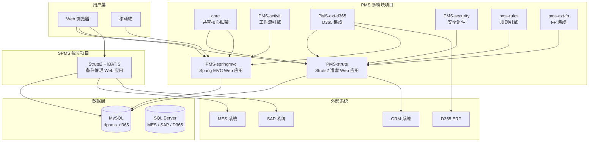
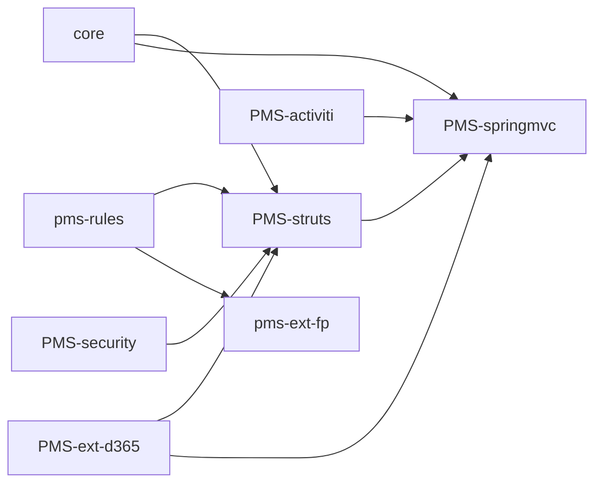
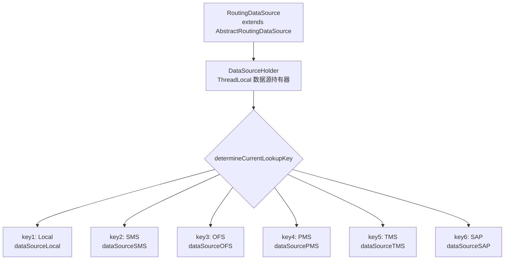
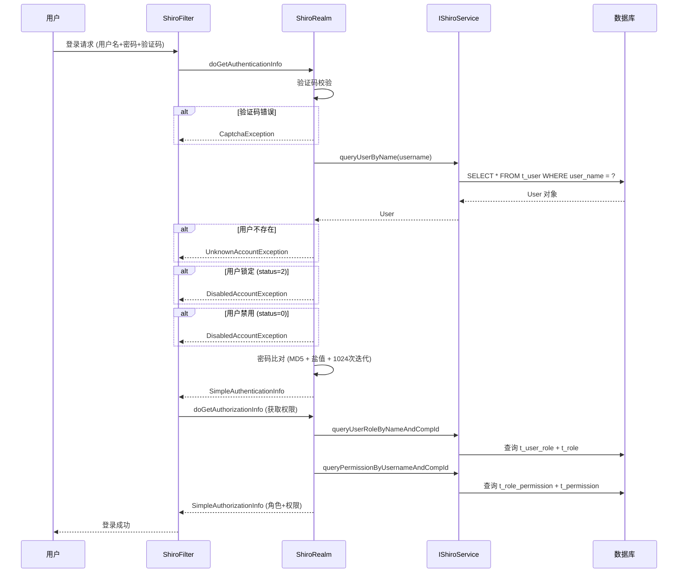
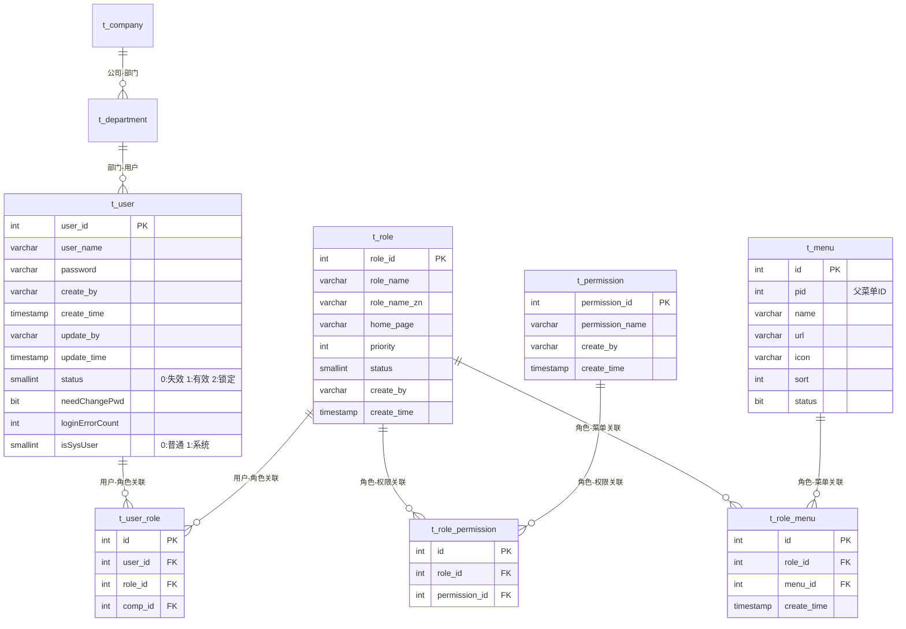

# PMS 系统架构概述

## 1. 系统定位

PMS（Project Management System，项目管理系统）是一个基于 Java EE 的企业级应用系统，主要用于项目管理、售前管理、回访管理、转包管理、问题管理、工作流审批等业务场景。系统采用多模块架构，与 SPMS（Spare Parts Management System，备件管理系统）共用底层数据库 `dppms_d365`。

## 2. 整体架构



## 3. 技术栈总览

### 3.1 PMS 项目技术栈

| 层次 | 技术 | 版本 | 说明 |
|------|------|------|------|
| Web 框架 | Struts2 | 2.5.30 / 2.3.35 | PMS-struts 使用 2.3.35 |
| Web 框架 | Spring MVC | 5.3.19 | PMS-springmvc 使用 |
| IoC 容器 | Spring Framework | 5.3.19 | XML + 注解混合配置 |
| ORM | MyBatis | 3.5.9 | core、springmvc 使用 |
| ORM | iBATIS | 2.3.4.726 | PMS-struts 遗留使用 |
| 安全框架 | Apache Shiro | 1.8.0 | 认证、授权、会话管理 |
| 单点登录 | CAS Client | 3.2.2 | CAS 集成 |
| 工作流 | Activiti | 5.23.0 | 流程审批引擎 |
| 定时任务 | Quartz | 2.3.2 | 任务调度 |
| 连接池 | Druid | 1.2.8 | 主连接池 |
| 连接池 | commons-dbcp | 1.4 | PMS-struts 使用 |
| 数据库 | MySQL | 8.0.16 | 主数据库 |
| 数据库 | SQL Server | - | 外部系统集成 |
| 数据库 | PostgreSQL | 42.7.0 | PMS-struts 可选支持 |
| JSON | Fastjson | 1.2.83 | 主要 JSON 处理 |
| JSON | Jackson | 2.13.1 | Spring MVC 集成 |
| Excel | Apache POI | 5.2.0 | Excel 导入导出 |
| Excel | EasyExcel | 3.1.1 | 简化 Excel 操作 |
| 日志 | Logback | 1.2.10 | core、springmvc |
| 日志 | Log4j2 | 2.17.1 | PMS-struts |
| 模板引擎 | Velocity | 1.6.4 | 代码生成、邮件模板 |
| 模板引擎 | FreeMarker | 2.3.30 | PMS-springmvc 使用 |
| 规则引擎 | Aviator | 5.4.3 | 表达式求值 |
| 规则引擎 | LiteFlow | 2.15.0 | 流程编排 |
| 规则引擎 | Groovy | 3.0.19 | 脚本引擎 |
| HTTP 客户端 | Hutool | 5.8.34 / 5.7.20 | HTTP 请求工具 |
| HTTP 客户端 | OkHttp | 5.1.0 | HTTP 请求工具 |
| HTML 解析 | Jsoup | 1.14.3 | HTML 解析、XSS 过滤 |

### 3.2 SPMS 项目技术栈

| 层次 | 技术 | 版本 | 说明 |
|------|------|------|------|
| Web 框架 | Struts2 | 2.0 | 传统配置方式 |
| IoC 容器 | Spring | - | DTD 配置方式 |
| ORM | iBATIS | 2.3.4.726 | SqlMapClient |
| 连接池 | commons-dbcp | 1.4 | BasicDataSource |
| 事务管理 | Spring JDBC | - | DataSourceTransactionManager |
| 日志 | Log4j | - | 传统日志 |
| 前端 | JSP + jQuery + DisplayTag | - | 服务端渲染 |
| JDK | Java | 1.7 | SPMS 使用 JDK 1.7 |

## 4. 模块依赖关系



### 依赖说明

| 依赖关系 | 类型 | 说明 |
|----------|------|------|
| core → PMS-struts | war+jar | 提供共享框架（Spring、MyBatis、Shiro） |
| core → PMS-springmvc | war+jar | 提供共享框架 |
| PMS-activiti → PMS-springmvc | war+jar | 提供 Activiti 工作流能力，含 classifier=api 的 jar |
| PMS-struts → PMS-springmvc | jar | PMS-springmvc 依赖 PMS-struts 的 classifier=core 的 jar |
| PMS-ext-d365 → PMS-struts/springmvc | jar | D365 集成扩展 |
| PMS-security → PMS-struts | jar | 安全过滤器 |
| pms-rules → PMS-struts | jar | 规则引擎 |
| pms-rules → pms-ext-fp | jar | FP 扩展依赖规则引擎 |

## 5. 数据源架构

### 5.1 数据源路由机制

core 模块通过 `RoutingDataSource` 实现多数据源动态路由：



**核心类说明：**

| 类名 | 路径 | 职责 |
|------|------|------|
| `RoutingDataSource` | `com.dp.plat.core.config` | 继承 Spring 的 `AbstractRoutingDataSource`，通过 `determineCurrentLookupKey()` 方法动态选择数据源 |
| `DataSourceHolder` | `com.dp.plat.core.config` | 使用 `ThreadLocal<String>` 在线程上下文中保存当前数据源标识 |

**使用方式：**
```java
// 设置数据源
DataSourceHolder.setDataSourceType("SMS");
try {
    // 执行 SMS 数据库操作
} finally {
    // 清除数据源标识
    DataSourceHolder.clearDataSourceType();
}
```

### 5.2 数据源配置

| 数据源标识 | 用途 | 数据库 | 默认激活 |
|-----------|------|--------|---------|
| Local | PMS 主数据库 | MySQL (dppms_d365) | ✅ |
| SMS | SMS 系统 | MySQL (dpsms) | ❌ |
| OFS | OFS 系统 | - | ❌ |
| PMS | PMS 旧系统 | - | ❌ |
| TMS | TMS 系统 | - | ❌ |
| SAP | SAP 系统 | SQL Server (DIPULive) | ❌ |

> **注意：** 当前配置文件中仅激活了 `Local` 数据源，其他数据源配置被注释。生产环境通过 `jdbc_release.properties` 激活全部数据源。

### 5.3 SPMS 数据源

SPMS 独立配置数据源，通过 `applicationContext.xml` 中的 Spring Bean 定义：

| 数据源 Bean | 用途 | 数据库类型 |
|-------------|------|-----------|
| `dataSource` | SPMS 主数据库 | MySQL (dppms_d365) |
| `sqlMapClientTemplateSAP` | SAP 系统 | SQL Server (DIPULive) |
| `sqlMapClientTemplateD365` | D365 系统 | SQL Server (AXDB) |
| `sqlMapClientTemplateSSE` | SSE 系统 | - |

## 6. 安全架构

### 6.1 Shiro 认证授权流程



### 6.2 Shiro 关键配置

| 配置项 | 值 | 说明 |
|--------|-----|------|
| Session Cookie 名称 | `dp.session.id` | 自定义会话 Cookie |
| 密码加密算法 | MD5 | 哈希算法 |
| 迭代次数 | 1024 | 密码哈希迭代次数 |
| 缓存管理器 | EhCache | 权限缓存 |
| 认证策略 | AtLeastOneSuccessfulStrategy | 至少一个 Realm 成功 |
| 登录 URL | `/sys/login.html` | 未认证跳转地址 |

### 6.3 权限模型



## 7. 系统配置机制

### 7.1 环境配置

PMS 通过 Maven Profile 管理多环境配置：

| Profile | 用途 | 配置文件位置 |
|---------|------|-------------|
| `dev`（默认） | 本地开发 | `config/profiles/dev/` |
| `test` | 测试环境 | `config/profiles/test/` |
| `release` | 生产环境 | `config/profiles/release/` |
| `pms`（默认） | PMS 默认构建 | - |
| `yfpms` | YFPMS 版本 | - |
| `pms2` | PMS2 版本 | - |
| `pms3` | PMS3 版本 | - |

### 7.2 系统变量

`SystemConfig` 类通过 `ISystemVariableService` 从数据库加载系统变量到 `HashMap<String, String> systemVariables`，在整个应用生命周期中提供全局配置访问：

```java
// 系统变量访问示例
String envArg = SystemConfig.systemVariables.get("sys.envirment.argu");
String checkCaptcha = SystemConfig.systemVariables.getOrDefault("sys.login.check.captcha", "1");
```

**关键系统变量：**

| 变量 Key | 说明 | 取值 |
|---------|------|------|
| `sys.envirment.argu` | 环境参数 | "0":开发, "1"/"2":生产 |
| `sys.login.check.captcha` | 是否检查验证码 | "0":不检查, "1":检查 |
| `sys.adAuth` | AD 域认证 | "0":不启用, "1":启用 |
| `sys.mail.config` | 邮件配置 | JSON 格式 |

## 8. 构建与部署

### 8.1 PMS 构建

```bash
# 完整构建
mvn clean package

# 指定环境
mvn clean package -P dev        # 开发环境
mvn clean package -P release     # 生产环境
mvn clean package -P test       # 测试环境

# 指定版本
mvn clean package -P dev,pms3   # PMS3 版本
mvn clean package -P dev,yfpms  # YFPMS 版本

# 单模块构建
mvn clean package -pl PMS-struts
mvn clean package -pl PMS-springmvc -P dev,pms3
```

### 8.2 SPMS 构建

SPMS 是非 Maven 项目，通过 Eclipse Export WAR 或 Ant 脚本构建。

### 8.3 JDK 版本

| 项目 | JDK 版本 |
|------|---------|
| PMS | 1.8 |
| SPMS | 1.7 |
