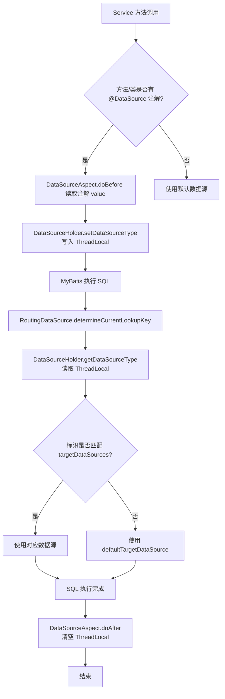
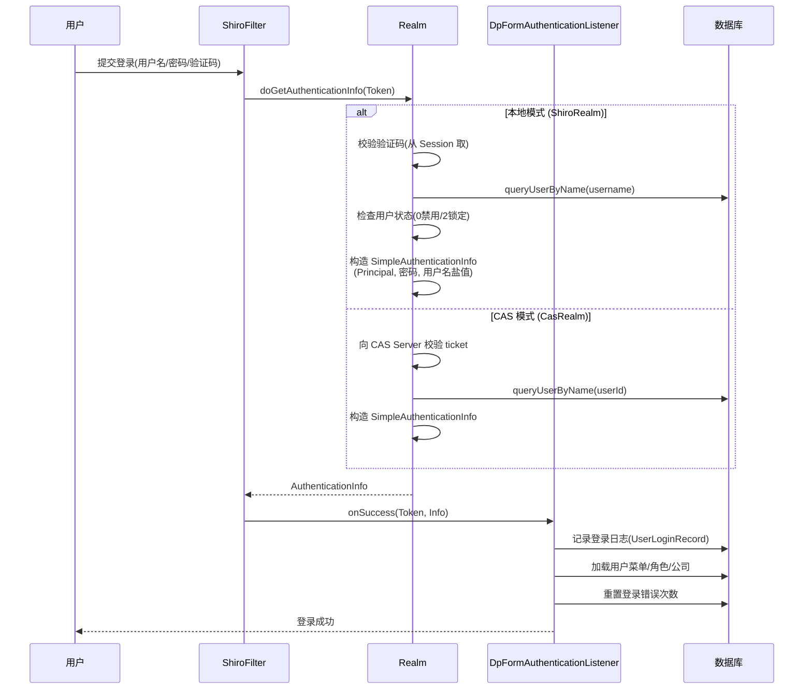
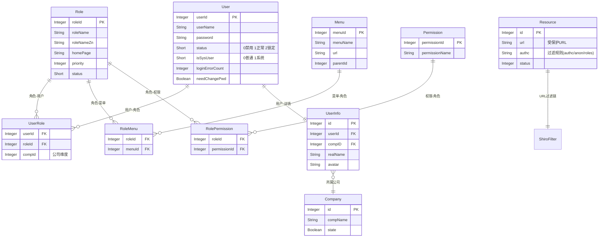
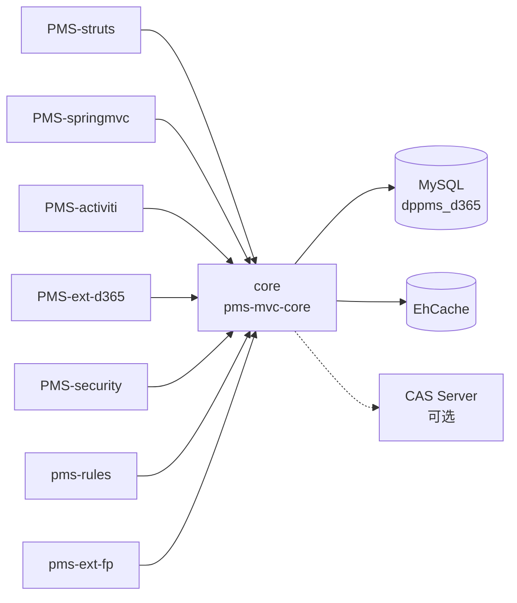

# core 模块文档（pms-mvc-core）

> PMS 项目的共享框架模块，为上层各业务模块（PMS-struts、PMS-springmvc、PMS-activiti 等）提供 Spring、MyBatis、Shiro、Quartz 等基础框架配置、通用工具类与系统级管理能力。

---

## 1. 模块概述

- **模块名称**：`pms-mvc-core`（Maven artifactId）
- **模块定位**：PMS 项目的共享框架 / 基础设施模块，是所有上层业务模块的依赖根。
- **核心职责**：
  - 提供多数据源路由（基于 Spring `AbstractRoutingDataSource` + AOP 注解切换）
  - 提供 Shiro 认证授权框架（含本地账号、CAS 单点登录双模式）
  - 提供 Quartz 定时任务调度（邮件发送、数据同步）
  - 提供系统级 AOP 切面（数据源切换、系统日志、异常捕获、权限热更新）
  - 提供系统变量、菜单、角色、权限、资源等基础管理能力
  - 提供通用工具类（日期、文件、IP、密码、JSoup、Excel 导出等）
  - 提供 Spring MVC 配置（视图解析、拦截器、文件上传、国际化、CSRF 防护）
- **技术栈**：Spring 5.3.19 + Spring MVC 5.3.19 + MyBatis 3.5.9 + Shiro 1.8.0 + Quartz 2.x + Druid 1.2.8 + Logback + EhCache
- **JDK 版本**：JDK 1.8
- **打包方式**：`war`（同时通过 `maven-jar-plugin` 产出 `core` classifier 的 jar 供其他模块依赖）
- **基础包名**：`com.dp.plat.core`（另含 `com.dp.plat.security`、`com.dp.plat.support` 子包）

---

## 2. 包结构

```
core/src/main/java/com/dp/plat/
├── core/
│   ├── annotation/        # 自定义注解（@DataSource、@SystemControllerLog、@SystemServiceLog）
│   ├── aop/               # AOP 切面（数据源切换、系统日志、异常捕获、权限热更新）
│   ├── cas/               # CAS 单点登出相关（CasLogoutFilter、SingleSignOutHandler）
│   ├── concurrent/        # 并发工具（上下文传递线程池）
│   ├── config/            # 核心配置（RoutingDataSource、DataSourceHolder、SystemConfig）
│   ├── context/           # 上下文持有器（HttpContext、SpringContext、UserContext）
│   ├── controller/        # 系统管理 Controller（admin/、cluster/、BaseController 等）
│   ├── converter/         # Spring MVC 类型转换器（DateConverter、DecimalConverter）
│   ├── dao/               # MyBatis Mapper 接口（AbstractBaseMapper 及各业务 Mapper）
│   ├── entity/            # 通用实体（BaseEntity、DataOperation）
│   ├── exception/         # 异常体系（ExceptionHandler、CaptchaException 等）
│   ├── factory/           # 工厂类（FilterChainDefinitionMapBuilder - Shiro 过滤链构建）
│   ├── filter/            # Shiro 过滤器（AnyRolesAuthorizationFilter、HostFilter、CasFilter）
│   ├── interceptor/       # MVC 拦截器（PasswordInterceptor - 强制改密）
│   ├── listener/          # Shiro 认证监听器（DpFormAuthenticationListener）
│   ├── mapping/           # MyBatis XML 映射文件（与 Java 同目录）
│   ├── param/             # 常量（Consts、RoleConstant）
│   ├── pojo/              # 实体类（User、Role、Menu、Permission、Resource 等）
│   ├── realms/            # Shiro Realm（ShiroRealm、CasRealm、Principal）
│   ├── schedule/          # Quartz 定时任务（MailerJob、SynchronizeJob、SyncType）
│   ├── serializer/        # JSON 序列化器（DateSerializer、JsonSerializer）
│   ├── service/           # 服务接口与实现（I*Service / impl/*Service）
│   ├── tags/              # JSP 自定义标签（LinkTag、ScriptTag、LeftMenuTag 等）
│   ├── util/              # 工具类（DateUtil、FileUtil、IpUtil、PasswordUtil、SQLParser 等）
│   ├── view/              # Spring MVC 视图（ExcelView、ExcelView4XLSX）
│   └── vo/                # 值对象（Result、ResultCode、PageParam、TreeNode 等）
├── security/              # 安全相关（独立于 core 包名）
│   ├── annotation/        # 字段加密注解（@EncryptEntity、@EncryptField）
│   ├── aop/               # 字段加密切面（EncryptFieldAOP）
│   ├── csrf/              # CSRF 防护（CSRFTokenManager、CsrfInterceptor）
│   ├── util/              # 安全工具（ASEUtil、ByteUtils）
│   └── xss/               # XSS 防护（XssFilter 及多种 HttpServletRequestWrapper）
└── support/               # 支撑组件
    ├── mail/              # 邮件发送（MailUtil、MailSenderInfo、MailConfig 等）
    ├── CaptchaServlet.java   # 验证码 Servlet
    ├── CaptchaUtil.java      # 验证码工具
    └── PropertiesUtil.java   # 属性文件工具
```

配置文件位于 `core/src/main/resources/`：

| 配置文件 | 作用 |
|---------|------|
| `spring.xml` | Spring 主配置，数据源、RoutingDataSource、import 其他配置 |
| `spring-mybatis.xml` | MyBatis 整合、Mapper 扫描、事务管理 |
| `spring-mvc.xml` | Spring MVC 配置（视图解析、拦截器、AOP、文件上传） |
| `spring-shiro.xml` | Shiro 配置（本地账号模式） |
| `spring-shiro-cas.xml` | Shiro + CAS 单点登录配置 |
| `spring-cxf.xml` | CXF WebService 配置（默认未启用） |
| `beans-quartz.xml` | Quartz 定时任务配置 |
| `ehcache.xml` | EhCache 缓存配置（Shiro 会话与授权缓存） |
| `logback.xml` | Logback 日志配置 |
| `jdbc.properties` | 数据源连接参数 |
| `jdbc_dev.properties` / `jdbc_release.properties` | 多环境数据源参数 |
| `config.properties` / `spring-cas.properties` | 系统配置 / CAS 参数 |
| `messages_zh_CN.properties` / `messages_en_US.properties` | 国际化资源 |

---

## 3. 核心类清单

### 3.1 多数据源与配置

| 类名 | 完整路径 | 职责 |
|------|----------|------|
| `RoutingDataSource` | `com.dp.plat.core.config.RoutingDataSource` | 继承 `AbstractRoutingDataSource`，按 ThreadLocal 标识路由数据源 |
| `DataSourceHolder` | `com.dp.plat.core.config.DataSourceHolder` | 基于 `ThreadLocal<String>` 持有当前线程数据源标识 |
| `SystemConfig` | `com.dp.plat.core.config.SystemConfig` | `@Configuration` 类，启动时加载系统变量到静态 Map |
| `DataSource` | `com.dp.plat.core.annotation.DataSource` | 数据源切换注解（类/方法级别） |
| `DataSourceAspect` | `com.dp.plat.core.aop.DataSourceAspect` | 切面，方法执行前设置数据源标识，执行后清空 |

### 3.2 Shiro 认证授权

| 类名 | 完整路径 | 职责 |
|------|----------|------|
| `ShiroRealm` | `com.dp.plat.core.realms.ShiroRealm` | 本地账号认证授权 Realm（含验证码校验） |
| `CasRealm` | `com.dp.plat.core.realms.CasRealm` | CAS 单点登录 Realm，继承 `org.apache.shiro.cas.CasRealm` |
| `Principal` | `com.dp.plat.core.realms.Principal` | 登录主体，封装用户、角色、权限、菜单等信息 |
| `UsernamePasswordCaptchaToken` | `com.dp.plat.core.pojo.UsernamePasswordCaptchaToken` | 扩展 `UsernamePasswordToken`，携带验证码 |
| `DpFormAuthenticationListener` | `com.dp.plat.core.listener.DpFormAuthenticationListener` | 认证监听器，记录登录日志、加载用户菜单 |
| `FilterChainDefinitionMapBuilder` | `com.dp.plat.core.factory.FilterChainDefinitionMapBuilder` | 从数据库 Resource 表动态构建 Shiro 过滤链 |
| `AnyRolesAuthorizationFilter` | `com.dp.plat.core.filter.AnyRolesAuthorizationFilter` | 任一角色通过即放行（Shiro 默认 roles 为"且"关系） |
| `HostFilter` | `com.dp.plat.core.filter.HostFilter` | IP 白名单/黑名单过滤，支持通配符、IP 段、CIDR |
| `CasFilter` | `com.dp.plat.core.filter.CasFilter` | CAS 票据过滤器 |
| `CasLogoutFilter` | `com.dp.plat.core.cas.CasLogoutFilter` | CAS 单点登出过滤器 |
| `SystemCoreFunctionAspect` | `com.dp.plat.core.aop.SystemCoreFunctionAspect` | 权限/菜单/系统变量变更时热更新 Shiro 过滤链与缓存 |
| `PasswordInterceptor` | `com.dp.plat.core.interceptor.PasswordInterceptor` | 强制修改密码拦截器 |
| `PasswordUtil` | `com.dp.plat.core.util.PasswordUtil` | 密码加密工具（MD5/SHA1 + 盐值 + 迭代） |

### 3.3 Quartz 定时任务

| 类名 | 完整路径 | 职责 |
|------|----------|------|
| `MailerJob` | `com.dp.plat.core.schedule.MailerJob` | 定时扫描并发送待发邮件 |
| `SynchronizeJob` | `com.dp.plat.core.schedule.SynchronizeJob` | 数据同步任务（全量/增量），支持多线程、多数据源 |
| `SyncType` | `com.dp.plat.core.schedule.SyncType` | 同步类型枚举（FULL_SYNC 全量 / INCREM_SYNC 增量） |

### 3.4 AOP 切面

| 类名 | 完整路径 | 职责 |
|------|----------|------|
| `DataSourceAspect` | `com.dp.plat.core.aop.DataSourceAspect` | 数据源切换切面 |
| `SystemLogAspect` | `com.dp.plat.core.aop.SystemLogAspect` | 系统操作日志切面（`@SystemControllerLog` / `@SystemServiceLog`） |
| `ExceptionAspect` | `com.dp.plat.core.aop.ExceptionAspect` | Controller 层异常捕获切面 |
| `SystemCoreFunctionAspect` | `com.dp.plat.core.aop.SystemCoreFunctionAspect` | 权限/菜单/系统变量热更新切面 |

### 3.5 上下文与工具

| 类名 | 完整路径 | 职责 |
|------|----------|------|
| `SpringContext` | `com.dp.plat.core.context.SpringContext` | Spring `ApplicationContext` 持有器，提供静态 `getBean` |
| `HttpContext` | `com.dp.plat.core.context.HttpContext` | 当前请求/会话/IP 获取，支持 mock 请求 |
| `UserContext` | `com.dp.plat.core.context.UserContext` | 当前用户/角色/权限查询，在线会话管理 |
| `ExceptionHandler` | `com.dp.plat.core.exception.exceptionHandler.ExceptionHandler` | 全局异常解析器，异常入库 + 跳转 500 |
| `DateUtil` / `FileUtil` / `IpUtil` / `JsoupUtil` / `MenuUtil` / `SQLParser` | `com.dp.plat.core.util.*` | 通用工具类 |
| `ExcelView` / `ExcelView4XLSX` | `com.dp.plat.core.view.*` | Excel 导出视图（POI） |

---

## 4. 多数据源路由机制

### 4.1 路由流程

core 模块通过 Spring 的 `AbstractRoutingDataSource` 实现运行时数据源动态切换，结合自定义注解 `@DataSource` 与 AOP 切面，在 Service 方法调用前设置数据源标识。



### 4.2 核心代码

**RoutingDataSource**（`com/dp/plat/core/config/RoutingDataSource.java`）：

```java
package com.dp.plat.core.config;

import org.springframework.jdbc.datasource.lookup.AbstractRoutingDataSource;

// 继承 Spring 抽象路由数据源，按 ThreadLocal 标识决定使用哪个物理数据源
public class RoutingDataSource extends AbstractRoutingDataSource {
    @Override
    protected Object determineCurrentLookupKey() {
        // 从 ThreadLocal 中获取当前线程的数据源标识
        return DataSourceHolder.getDataSourceType();
    }
}
```

**DataSourceHolder**（`com/dp/plat/core/config/DataSourceHolder.java`）：

```java
package com.dp.plat.core.config;

// 基于 ThreadLocal 持有当前线程的数据源标识
public class DataSourceHolder {
    private static final ThreadLocal<String> contextHolder = new ThreadLocal<String>();

    // 设置数据源类型（如 "Local"、"SMS"、"SAP" 等）
    public static void setDataSourceType(String dataSourceType) {
        contextHolder.set(dataSourceType);
    }

    // 获取当前线程的数据源类型
    public static String getDataSourceType() {
        return contextHolder.get();
    }

    // 清除数据源类型（必须调用，避免线程池复用导致数据源泄漏）
    public static void clearDataSourceType() {
        contextHolder.remove();
    }
}
```

**DataSourceAspect**（`com/dp/plat/core/aop/DataSourceAspect.java`，关键片段）：

```java
@Aspect
@Component
public class DataSourceAspect {
    // 切点：类或方法上标注 @DataSource
    @Pointcut("@within(com.dp.plat.core.annotation.DataSource) || @annotation(com.dp.plat.core.annotation.DataSource)")
    public void serviceAspect() {}

    @Before("serviceAspect()")
    public void doBefore(JoinPoint joinPoint) {
        // 优先取方法注解，其次取类注解
        Class<?> targetClass = joinPoint.getTarget().getClass();
        String dataSource = "";
        if (targetClass.isAnnotationPresent(DataSource.class)) {
            dataSource = targetClass.getAnnotation(DataSource.class).value();
        }
        String methodDataSource = getMethodAnnotationValue(joinPoint);
        if (methodDataSource != null && !methodDataSource.equals(dataSource)) {
            dataSource = methodDataSource;
        }
        DataSourceHolder.setDataSourceType(dataSource);
    }

    @After("serviceAspect()")
    public void doAfter(JoinPoint joinPoint) {
        // 方法执行后清空 ThreadLocal，防止数据源标识泄漏到后续请求
        DataSourceHolder.setDataSourceType("");
    }
}
```

**注解定义**（`com/dp/plat/core/annotation/DataSource.java`）：

```java
@Target({ElementType.TYPE, ElementType.METHOD})
@Retention(RetentionPolicy.RUNTIME)
@Documented
public @interface DataSource {
    String value() default "";  // 数据源标识，对应 jdbc.key1/key2...
}
```

### 4.3 数据源配置

数据源在 `spring.xml` 中配置，物理数据源使用 Druid 连接池：

```xml
<!-- 物理数据源：本地主库 -->
<bean id="dataSourceLocal" class="com.alibaba.druid.pool.DruidDataSource" destroy-method="close">
    <property name="driverClassName" value="${jdbc.driver}"/>
    <property name="url" value="${jdbc.url}"/>
    <property name="username" value="${jdbc.username}"/>
    <property name="password" value="${jdbc.password}"/>
    <property name="initialSize" value="${jdbc.initialSize}"/>
    <property name="maxActive" value="${jdbc.maxActive}"/>
    <!-- ... 其他连接池参数 -->
    <property name="filters" value="stat"/>
</bean>

<!-- 路由数据源：targetDataSources 映射标识 → 物理数据源 -->
<bean id="dataSource" class="com.dp.plat.core.config.RoutingDataSource">
    <property name="targetDataSources">
        <map key-type="java.lang.String">
            <entry key="${jdbc.key1}" value-ref="dataSourceLocal"/>
            <!-- 预留多数据源扩展位（SMS、OFS、PMS、TMS、SAP 等） -->
        </map>
    </property>
    <property name="defaultTargetDataSource" ref="dataSourceLocal"/>
</bean>
```

**数据源标识配置**（`jdbc.properties`）：

| 属性键 | 默认值 | 说明 |
|--------|--------|------|
| `jdbc.key1` | `Local` | 本地主数据源标识（默认启用） |
| `jdbc.key2` | `SMS`（注释） | SMS 系统数据源标识 |
| `jdbc.key3` | `OFS`（注释） | OFS 系统数据源标识 |
| `jdbc.key4` | `PMS`（注释） | PMS 系统数据源标识 |
| `jdbc.key5` | `TMS`（注释） | TMS 系统数据源标识 |
| `jdbc.key6` | `SAP`（注释） | SAP 系统数据源标识 |

> 当前 `spring.xml` 中仅启用 `dataSourceLocal`，其余数据源配置已注释，需要多数据源时取消注释并在 `jdbc.properties` 中配置对应 key。

---

## 5. Shiro 认证授权

### 5.1 认证流程

core 模块支持两种认证模式，通过系统变量 `sys.cas`（`0`=本地，`1`=CAS）切换，由 `FilterChainDefinitionMapBuilder` 在启动时动态判断。



### 5.2 权限模型 ER 图

权限模型基于 RBAC（基于角色的访问控制），并扩展了公司（compId）维度与资源（URL 过滤链）维度。



### 5.3 密码加密策略

core 模块采用 **MD5 + 用户名盐值 + 1024 次迭代** 的加密策略，由 `HashedCredentialsMatcher` 在 `spring-shiro.xml` 中配置：

```xml
<bean id="jdbcRealm" class="com.dp.plat.core.realms.ShiroRealm">
    <property name="credentialsMatcher">
        <bean class="org.apache.shiro.authc.credential.HashedCredentialsMatcher">
            <property name="hashAlgorithmName" value="MD5"/>
            <property name="hashIterations" value="1024"/>
        </bean>
    </property>
</bean>
```

**ShiroRealm 认证逻辑关键点**（`com/dp/plat/core/realms/ShiroRealm.java`）：

- 验证码校验：受系统变量 `sys.envirment.argu`（`1`/`2` 时校验）与 `sys.login.check.captcha`（默认 `1` 校验）控制。
- 用户状态校验：`status==2` 抛 `DisabledAccountException`（锁定），`status==0` 抛 `DisabledAccountException`（禁用）。
- 密码盐值：使用 `username` 作为盐值（`ByteSource.Util.bytes(username)`）。
- AD 域兼容：当 `sys.envirment.argu=0` 或 `sys.adAuth=1` 时，使用明文密码重新计算 MD5 与库中比对（支持 AD 域认证场景）。

**PasswordUtil 工具类**（`com/dp/plat/core/util/PasswordUtil.java`）提供多种加密方法：

| 方法 | 算法 | 盐值 | 迭代次数 | 用途 |
|------|------|------|----------|------|
| `encryptMD5Password(credentials)` | MD5 | 无 | 1 | 简单 MD5 |
| `encryptMD5Password(credentials, saltSource)` | MD5 | 有 | 1 | 带盐 MD5 |
| `encryptMD5Password(credentials, saltSource, 1024)` | MD5 | 有 | 1024 | **登录认证默认策略** |
| `encryptSHA1Password(...)` | SHA1 | 可选 | 可选 | SHA1 加密 |
| `encryptPassword(saltSource, credentials)` | SHA1→MD5 | 有 | 1→1024 | 双重加密（先 SHA1 1 次，再 MD5 1024 次） |
| `createRandomPassword(pwdLength)` | - | - | - | 生成随机密码（默认 8 位） |

### 5.4 授权与权限缓存

**授权流程**（`ShiroRealm.doGetAuthorizationInfo`）：

1. 从 `PrincipalCollection` 获取登录 `Principal`。
2. 根据 `userName` + `compId` 查询用户角色集合（`queryUserRoleByNameAndCompId`）。
3. 根据 `userName` + `compId` 查询用户权限字符串集合（`queryPermissionByUsernameAndCompId`）。
4. 系统用户（`isSysUser != 0`）的 `compId` 传 `-1`，表示跨公司权限。
5. 将角色、权限、最高优先级角色（`maxRole`）回写到 `Principal`。

**权限缓存**（`ehcache.xml`）：

```xml
<!-- 授权信息缓存：10 分钟过期 -->
<cache name="org.apache.shiro.realm.SimpleAccountRealm.authorization"
       maxEntriesLocalHeap="10000"
       eternal="false"
       timeToLiveSeconds="600"
       overflowToDisk="false"/>

<!-- 活跃会话缓存：永不过期（由 Shiro 显式管理） -->
<cache name="shiro-activeSessionCache"
       maxEntriesLocalHeap="10000"
       eternal="true"
       overflowToDisk="true"
       diskPersistent="true"
       diskExpiryThreadIntervalSeconds="600"/>
```

### 5.5 动态过滤链

`FilterChainDefinitionMapBuilder` 从数据库 `Resource` 表读取受保护 URL 及其过滤规则（`authc`/`anon`/`roles[xxx]`），动态构建 Shiro 过滤链。当 `sys.cas=1` 时，自动在 `authc` 规则后追加 `casLogoutFilter,casFilter`。

`SystemCoreFunctionAspect` 监听 `IResourceService` 的增删改操作，触发过滤链重建（清空 `appliedPaths`、`FilterChains`，重新调用 `buildFilterChainDefinitionMap`），并清空所有在线用户的授权缓存，实现权限热更新。

---

## 6. Quartz 定时任务

### 6.1 任务清单

任务配置位于 `beans-quartz.xml`，通过 Spring 的 `SchedulerFactoryBean` 调度。

| 任务类 | Bean 名称 | 调用方法 | Cron 表达式 | 状态 | 说明 |
|--------|-----------|----------|-------------|------|------|
| `MailerJob` | `mailJob` | `execute()` | `0 0/5 8-20 * * ?` | **已注释** | 每天 8:00-20:00 每 5 分钟扫描并发送待发邮件 |
| `SynchronizeJob` | - | `execute()` | - | 由子类配置 | 数据同步任务（全量/增量），子模块继承配置具体同步规则 |

> 当前 `startQuartz` 的 `triggers` 列表中所有 trigger 均已注释，定时任务默认不启动。需要时取消注释并配置对应 trigger。

### 6.2 配置方式

采用 Spring + Quartz 集成方式，`MethodInvokingJobDetailFactoryBean` 调用指定 Bean 的方法：

```xml
<!-- 工作类 -->
<bean id="mailJob" class="com.dp.plat.core.schedule.MailerJob"/>

<!-- JobDetail：调用 mailJob 的 execute 方法，concurrent=false 防止并发 -->
<bean id="mailTask" class="org.springframework.scheduling.quartz.MethodInvokingJobDetailFactoryBean">
    <property name="targetObject" ref="mailJob"/>
    <property name="targetMethod" value="execute"/>
    <property name="concurrent" value="false"/>  <!-- 关键：单线程执行，防止上次未完成下次又启动 -->
</bean>

<!-- 触发器：Cron 表达式 -->
<bean id="mailTrigger" class="org.springframework.scheduling.quartz.CronTriggerFactoryBean">
    <property name="jobDetail" ref="mailTask"/>
    <property name="cronExpression" value="0 0/5 8-20 * * ?"/>
</bean>

<!-- 总调度器：lazy-init=false 容器启动即调度 -->
<bean id="startQuartz" lazy-init="false" autowire="no"
      class="org.springframework.scheduling.quartz.SchedulerFactoryBean">
    <property name="triggers">
        <list>
            <!-- <ref bean="mailTrigger"/> -->
        </list>
    </property>
</bean>
```

### 6.3 SynchronizeJob 数据同步机制

`SynchronizeJob` 是数据同步的抽象基类，支持全量（`FULL_SYNC`）与增量（`INCREM_SYNC`）两种模式：

- **多线程同步**：通过 `Executors.newFixedThreadPool` 并发同步多个实体，线程池大小由系统变量 `sys.sync.threadPool.size`（默认 3）控制。
- **多数据源切换**：通过 `DataSourceHolder.setDataSourceType` 在源数据源与目标数据源间切换。
- **批量插入**：默认每批 1000 条（`BATCH_INSERT_NUMBER`），通过反射调用 `synchronizeService.insertXxx(List)`。
- **增量同步状态**：通过 `SyncState` 记录每个实体的 `lastId`、`offset`、`lastSyncTime`，下次同步从上次位置继续。
- **防重入**：`ConcurrentHashMap<String, SyncType> syncStateMap` 记录每个实体类的同步状态，防止并发重复同步。
- **同步日志**：每次同步记录 `SyncLog`（含异常堆栈、数据量、耗时）。

---

## 7. Spring 配置

### 7.1 配置文件加载链

`web.xml` 中通过 `contextConfigLocation` 指定根容器配置：

```xml
<context-param>
    <param-name>contextConfigLocation</param-name>
    <param-value>classpath:spring.xml,classpath:beans-quartz.xml</param-value>
</context-param>
```

Spring MVC 配置由 DispatcherServlet 加载：

```xml
<servlet>
    <servlet-name>SpringMVC</servlet-name>
    <servlet-class>org.springframework.web.servlet.DispatcherServlet</servlet-class>
    <init-param>
        <param-name>contextConfigLocation</param-name>
        <param-value>classpath:spring-mvc.xml</param-value>
    </init-param>
    <load-on-startup>1</load-on-startup>
</servlet>
```

### 7.2 配置文件职责

| 配置文件 | 加载方式 | 核心内容 |
|---------|----------|----------|
| `spring.xml` | 根容器 | PropertyPlaceholder、Druid 数据源、RoutingDataSource、import 子配置 |
| `spring-mybatis.xml` | spring.xml import | 组件扫描 `com.dp.plat`、SqlSessionFactory、MapperScanner、事务管理 |
| `spring-shiro.xml` | spring.xml import | SecurityManager、Realm、ShiroFilter、过滤链（本地模式） |
| `spring-shiro-cas.xml` | 替换 spring-shiro.xml | CAS 模式 Shiro 配置（含 casRealm、casFilter、casLogoutFilter） |
| `spring-mvc.xml` | DispatcherServlet | 视图解析、拦截器、AOP、文件上传、国际化、Druid 监控 |
| `beans-quartz.xml` | 根容器 | Quartz 任务调度 |

### 7.3 组件扫描

- **Spring 根容器**（`spring-mybatis.xml`）：`<context:component-scan base-package="com.dp.plat" />`，扫描所有 `com.dp.plat` 下的 `@Component`/`@Service`/`@Repository`。
- **Spring MVC**（`spring-mvc.xml`）：同样扫描 `com.dp.plat`，使 `@Controller` 生效。

### 7.4 事务管理

```xml
<!-- DataSourceTransactionManager 绑定路由数据源 -->
<bean id="transactionManager"
      class="org.springframework.jdbc.datasource.DataSourceTransactionManager">
    <property name="dataSource" ref="dataSource"/>
</bean>

<!-- 开启注解驱动事务，使用 CGLIB 代理 -->
<tx:annotation-driven transaction-manager="transactionManager" proxy-target-class="true"/>
```

> 注意：事务管理器绑定的是 `dataSource`（RoutingDataSource），而非物理数据源。多数据源场景下，**Spring 声明式事务无法跨数据源**，同一事务内切换数据源会导致事务失效。

### 7.5 MyBatis 配置

```xml
<bean id="sqlSessionFactory" class="org.mybatis.spring.SqlSessionFactoryBean">
    <property name="dataSource" ref="dataSource"/>
    <!-- Mapper XML 扫描：classpath 下 com/dp/plat/**/mapping/*.xml -->
    <property name="mapperLocations">
        <array>
            <value>classpath*:com/dp/plat/**/mapping/*.xml</value>
            <value>classpath*:com/dp/plat/**/mapping/**/*.xml</value>
        </array>
    </property>
    <property name="configuration">
        <bean class="org.apache.ibatis.session.Configuration">
            <!-- 查询结果含 null 字段时仍调用 setter（避免 Map 缺字段） -->
            <property name="callSettersOnNulls" value="true"/>
        </bean>
    </property>
</bean>

<!-- Mapper 接口扫描：com.dp.plat 下所有 Mapper 接口 -->
<bean class="org.mybatis.spring.mapper.MapperScannerConfigurer">
    <property name="basePackage" value="com.dp.plat"/>
    <property name="sqlSessionFactoryBeanName" value="sqlSessionFactory"/>
</bean>
```

### 7.6 Spring MVC 拦截器

`spring-mvc.xml` 配置了三个拦截器：

| 拦截器 | 作用 | 排除路径 |
|--------|------|----------|
| `LocaleChangeInterceptor` | 国际化语言切换（参数 `lang`） | 无 |
| `CsrfInterceptor` | CSRF 防护（`com.dp.plat.security.csrf.CsrfInterceptor`） | `/sys/login.json` |
| `PasswordInterceptor` | 强制修改密码（`needChangePwd=true` 时重定向） | `/password.*`、`/modifyPassword.*` |

### 7.7 AOP 配置

`spring-mvc.xml` 中配置了 Druid 监控 AOP 与 Shiro 注解驱动：

```xml
<!-- Druid SQL 监控：拦截 service 与 dao 层 -->
<bean id="druid-stat-interceptor" class="com.alibaba.druid.support.spring.stat.DruidStatInterceptor"/>
<bean id="druid-stat-pointcut" class="org.springframework.aop.support.JdkRegexpMethodPointcut" scope="prototype">
    <property name="patterns">
        <list>
            <value>com.dp.plat.service.*</value>
            <value>com.dp.plat.dao.*</value>
        </list>
    </property>
</bean>
<aop:config proxy-target-class="true">
    <aop:advisor advice-ref="druid-stat-interceptor" pointcut-ref="druid-stat-pointcut"/>
</aop:config>
<aop:aspectj-autoproxy/>  <!-- 启用 @AspectJ 注解驱动，使 core 的各切面生效 -->
```

---

## 8. 异常处理机制

core 模块采用三层异常处理：

### 8.1 全局异常解析器

`ExceptionHandler`（`com/dp/plat/core/exception/exceptionHandler/ExceptionHandler.java`）实现 `HandlerExceptionResolver`，在 `spring-mvc.xml` 中注册：

```xml
<bean id="exceptionHandler" class="com.dp.plat.core.exception.exceptionHandler.ExceptionHandler"/>
```

**处理逻辑**：
1. 检查 request 是否已有 `errorLogId`（被 `ExceptionAspect` 预先记录），有则复用。
2. 否则构造 `SysLog` 记录异常信息（异常类名、堆栈、请求 IP、方法签名、当前用户），入库。
3. 区分 AJAX 请求（`accept: application/json` 或 `X-Requested-With: XMLHttpRequest`）：AJAX 返回 500 状态码，非 AJAX 重定向到 `/500.html`。
4. 提供静态方法 `insertException(Throwable)` 供非 Web 上下文（如定时任务）记录异常。

### 8.2 Controller 层异常切面

`ExceptionAspect`（`com/dp/plat/core/aop/ExceptionAspect.java`）通过 `@AfterThrowing` 拦截 `com.dp.plat..*.controller..*` 的所有方法异常，预先将异常入库并设置 `errorLogId` 到 request，供 `ExceptionHandler` 复用，避免重复记录。

### 8.3 系统日志切面

`SystemLogAspect` 拦截 `@SystemControllerLog` / `@SystemServiceLog` 注解的方法：

- **`@After`**：方法正常返回后，异步记录操作日志（通过 `ConcurrentLinkedQueue` + 单线程 `LogThread` 消费）。
- **`@AfterThrowing`**：方法抛异常时，同步记录异常日志（`type=1` 表示异常）。
- **描述变量替换**：支持在 `description` 中使用 `$fieldName$` 占位符，自动从方法参数中解析替换（支持嵌套属性 `user.username`）。

### 8.4 自定义异常类

| 异常类 | 路径 | 用途 |
|--------|------|------|
| `CaptchaException` | `com.dp.plat.core.exception.CaptchaException` | 验证码错误 |
| `CustomRuntimeException` | `com.dp.plat.core.exception.CustomRuntimeException` | 自定义运行时异常基类 |
| `CustomExceptionInterface` | `com.dp.plat.core.exception.CustomExceptionInterface` | 自定义异常接口 |
| `ExcelImportException` | `com.dp.plat.core.exception.ExcelImportException` | Excel 导入异常 |
| `UploadException` | `com.dp.plat.core.exception.UploadException` | 文件上传异常 |
| `CsrfValidateFailedException` | `com.dp.plat.security.csrf.CsrfValidateFailedException` | CSRF 校验失败 |

### 8.5 错误页面映射

`web.xml` 配置了 HTTP 错误码到页面的映射：

| 错误码 | 跳转路径 |
|--------|----------|
| 400 / 402 / 404 / 405 | `/to404.html` |
| 500 | `/to500.html` |

---

## 9. 模块间调用关系



- **被依赖方**：core 是所有上层业务模块的依赖根，通过 `maven-jar-plugin` 产出的 `core` classifier jar 被各模块引用。
- **依赖关系**（来自根 `AGENTS.md`）：
  - `core → PMS-activiti → PMS-springmvc`
  - `core → PMS-struts (jar) → PMS-springmvc`
  - `PMS-ext-d365 → PMS-struts, PMS-springmvc`
  - `PMS-security → PMS-struts`
  - `pms-rules → PMS-struts, pms-ext-fp`
- **外部依赖**：MySQL 数据库（`dppms_d365`）、EhCache（本地缓存）、可选 CAS Server（单点登录）。

---

## 10. 最佳实践与避坑指南

### 10.1 多数据源使用注意事项

1. **ThreadLocal 必须清理**：`DataSourceAspect.doAfter` 已将标识置空，但若在 Service 内手动调用 `DataSourceHolder.setDataSourceType`，必须在 `finally` 中调用 `clearDataSourceType()`，否则线程池复用会导致后续请求使用错误数据源。`SynchronizeJob` 即遵循此模式。

2. **跨数据源事务失效**：`DataSourceTransactionManager` 绑定的是 `RoutingDataSource`，Spring 声明式事务无法跨物理数据源。需要跨库事务时，应使用 `JtaTransactionManager` 或避免在同一事务内切换数据源。

3. **注解优先级**：`@DataSource` 方法注解优先于类注解。若类标注 `@DataSource("Local")`，方法标注 `@DataSource("SAP")`，则方法执行时使用 SAP 数据源。

4. **AOP 代理生效前提**：`@DataSource` 注解切换依赖 Spring AOP，**同类内部方法调用不会触发切面**（绕过代理）。需要切换数据源的方法必须被外部类调用。

5. **多数据源扩展**：新增数据源需三步——在 `spring.xml` 配置物理 DataSource Bean、在 `RoutingDataSource.targetDataSources` 添加映射、在 `jdbc.properties` 配置对应 key。

### 10.2 Shiro 权限缓存常见问题

1. **权限修改后不生效**：`SystemCoreFunctionAspect` 已监听 `IResourceService`、`IMenuService`、`IUserRoleService`、`IRoleMenuService`、`ISystemVariableService` 的增删改，自动清空在线用户授权缓存。但若直接操作数据库（绕过 Service），需手动调用 `shiroRealm.doClearCache` 或重启应用。

2. **会话缓存持久化**：`ehcache.xml` 中 `shiro-activeSessionCache` 配置了 `diskPersistent=true`，重启后可恢复会话。但 `MemorySessionDAO`（默认）不持久化会话数据，重启后会话仍会失效。如需真正的会话持久化，需替换为 `EnterpriseCacheSessionDAO` 或自定义 `SessionDAO`。

3. **CAS 与本地模式切换**：通过系统变量 `sys.cas` 控制（`0`=本地，`1`=CAS）。`FilterChainDefinitionMapBuilder` 启动时判断，若 `casFilter` Bean 不存在则强制设为本地模式。切换模式后需重启应用。

4. **验证码开关**：受 `sys.envirment.argu`（`1`/`2` 时启用验证码）与 `sys.login.check.captcha`（默认 `1` 启用）双重控制。开发环境可设 `sys.envirment.argu=0` 跳过验证码。

5. **IP 白名单/黑名单**：`HostFilter` 从系统变量 `sys.admin.allow.hosts`（白名单）和 `sys.admin.deny.hosts`（黑名单）读取，支持通配符（`10.102.0.*`）、IP 段（`10.102.0.106-10.102.0.109`）、CIDR（`10.102.0.0/24`）。修改后实时生效（每次请求重新读取）。

6. **强制改密**：`PasswordInterceptor` 检查 `Principal.needChangePwd`，为 `true` 时重定向到 `/password.html?needChangePwd=true`。CAS 模式下（`sys.cas=1`）跳过强制改密（因密码由 CAS 管理）。

### 10.3 Quartz 任务并发注意事项

1. **`concurrent=false` 必设**：`MethodInvokingJobDetailFactoryBean` 的 `concurrent` 属性必须设为 `false`，防止上次任务未执行完，下次触发又启动新实例，导致数据重复处理。`MailerJob` 配置已遵循。

2. **任务默认未启用**：`beans-quartz.xml` 中 `startQuartz` 的 `triggers` 列表所有 trigger 均已注释。启用任务需取消对应 `<ref bean="xxxTrigger"/>` 的注释。

3. **SynchronizeJob 防重入**：`SynchronizeJob` 通过 `ConcurrentHashMap<String, SyncType> syncStateMap` 记录每个实体类的同步状态，防止同一实体并发同步。但该状态存在内存中，**集群环境下无法跨节点互斥**，多节点部署需引入分布式锁（如数据库锁、Redis 锁）。

4. **线程池大小**：`SynchronizeJob` 的线程池大小由系统变量 `sys.sync.threadPool.size`（默认 3）控制，实际取 `min(配置值, 实体数量)`，至少为 1。

5. **数据源关闭**：`SynchronizeJob.execute` 的 `finally` 块会尝试关闭源数据源连接（`DriverManagerDataSource` 场景）。若使用 `DruidDataSource`，注释了 `restart()` 调用，连接由连接池管理，无需手动关闭。

### 10.4 其他注意事项

1. **Mapper XML 位置**：MyBatis XML 映射文件与 Java 文件同目录（`com/dp/plat/**/mapping/*.xml`），移动 Java 文件时需一并处理 XML。

2. **日志级别**：`logback.xml` 中 `com.dp.plat` 包日志级别为 `DEBUG`，根日志级别为 `INFO`。生产环境建议将 `com.dp.plat` 调整为 `INFO` 或 `WARN`。日志按级别分目录（`logs/error/`、`logs/info/` 等）按天滚动，保留 30 天。

3. **Druid 监控**：通过 `/druid/*` 路径访问 Druid SQL 监控页面（`StatViewServlet`），`DruidWebStatFilter` 已配置排除静态资源。

4. **系统变量加载**：`SystemConfig` 在容器启动时通过 `@Bean` 加载系统变量到静态 Map `SystemConfig.systemVariables`。`SystemCoreFunctionAspect` 监听 `ISystemVariableService` 的增删改，自动刷新该 Map。**禁止直接修改静态 Map**，应通过 Service 修改数据库后由切面刷新。

5. **war 打包特殊性**：core 打包为 `war`，同时通过 `maven-jar-plugin` 产出 `pms-mvc-core-core.jar`（classifier 为 `core`）供其他模块依赖。`maven-war-plugin` 配置了 `overlays` 排除 `WEB-INF/lib/*`，避免依赖冲突。

---

## 11. 变更记录

| 版本 | 日期 | 修改人 | 修改内容 |
|------|------|--------|----------|
| v1.0 | 2026-06-24 | - | 初始版本，基于源码梳理生成 |
