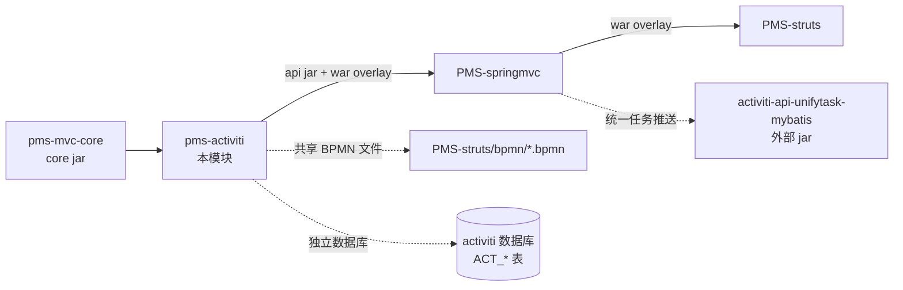
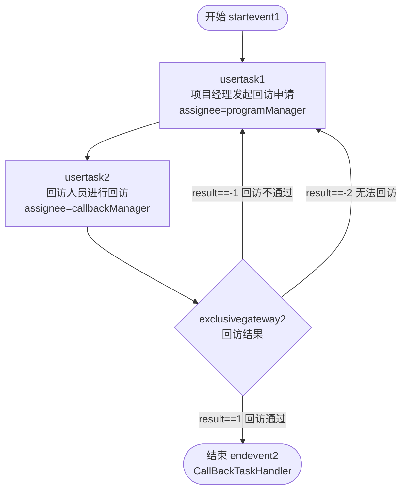
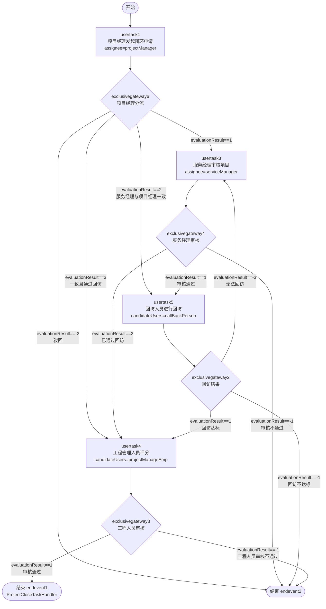
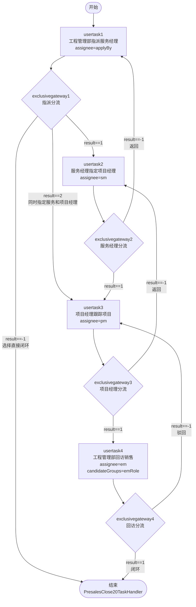
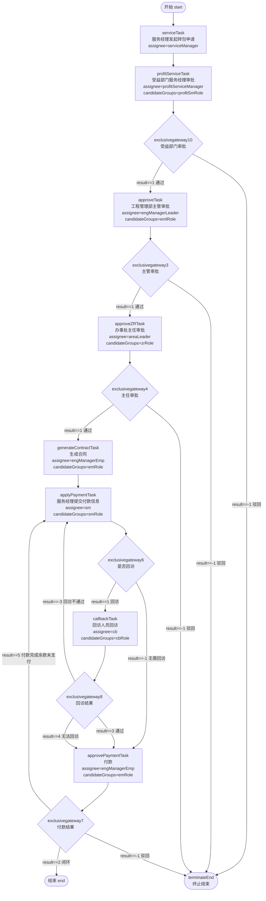
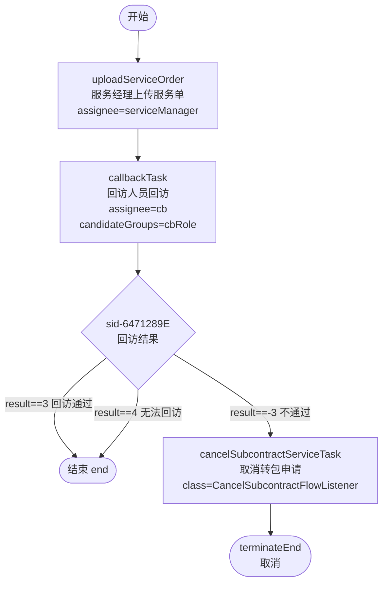
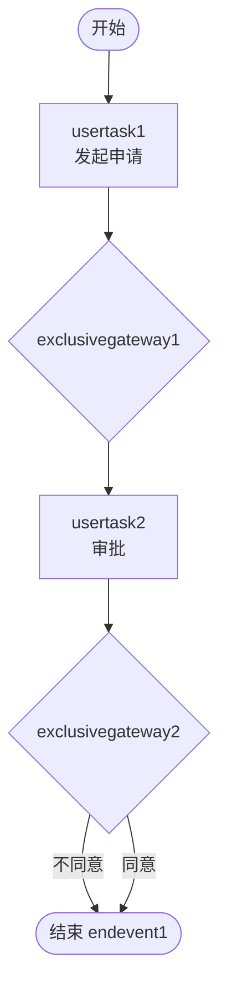
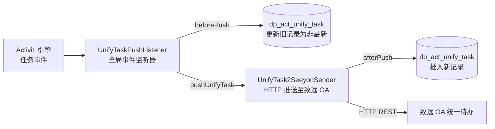

# PMS-activiti 模块文档

> 本文档对 PMS 项目中的 PMS-activiti 模块进行完整的功能梳理，覆盖模块定位、包结构、核心类、Activiti 配置、BPMN 流程定义、工作流 API、统一任务表、业务集成方式、异常处理及避坑指南。所有内容均基于实际源码与 BPMN 文件分析，未虚构类名或流程节点。

---

## 1. 模块概述

- **模块名称**：`PMS-activiti`（Maven artifactId：`pms-activiti`）
- **模块定位**：PMS 系统的工作流基础模块，集成 Activiti 5.23.0 引擎，提供流程审批能力、流程设计器（Activiti Modeler）以及流程图跟踪能力。基础包名 `com.dp.plat.activiti`。
- **核心职责**：
  - 提供 Activiti ProcessEngine 及 7 大 Service（Repository/Runtime/Task/History/Management/Identity/Form）的 Spring 工厂 bean 配置
  - 提供流程模型（Model）的在线设计、部署、删除、转换（BPMN ↔ JSON）能力，对应 Activiti Modeler 编辑器
  - 提供流程定义（ProcessDefinition）的部署、查询、激活/挂起、删除、转换为模型、流程图查看能力
  - 提供流程实例（ProcessInstance）的运行列表、流程跟踪图、激活/挂起、删除、流程明细查看能力
  - 提供任务（Task）的待办、已办、签收/取消签收、委派、转办、撤销、撤回、跳转（任意节点回退/前进）能力
  - 提供自定义 Command 实现（撤销 RevokeTaskCmd、撤回 WithdrawTaskCmd、跳转 JumpTaskCmdService、删除活动任务 DeleteActiveTaskCmd、启动活动 StartActivityCmd）
  - 提供流程图自定义生成器 `CustomProcessDiagramGenerator`，解决流程线条不显示文字的问题
  - 提供任务监听器 `UserTaskListener`，基于 `dp_act_unify_task` 表实现动态审批人/候选人/候选组分配
  - 提供 `RuntimePageService` 用于查询流程明细（已执行节点、当前节点、下一步节点、审批意见）
  - 通过 `pms-activiti-<version>-api.jar` 向 PMS-springmvc 暴露 Controller、Service、Cmd、Listener 等扩展能力
- **技术栈**：
  - 工作流引擎：Activiti 5.23.0（`activiti-engine`、`activiti-spring`、`activiti-modeler`、`activiti-diagram-rest`、`activiti-json-converter`、`activiti-bpmn-converter`、`activiti-explorer`、`activiti-simple-workflow`）
  - Web 层：Spring MVC（`spring-webmvc`，由父 POM 控制 Spring 版本）
  - ORM：MyBatis（通过 `pms-mvc-core` 间接引入）+ Hibernate 5.1.10（仅 `spring-hibernate.xml` 中配置，实际未使用）
  - 数据库：MySQL（独立 `activiti` 数据库，与 `dppms_d365` 业务库分离）
  - 连接池：c3p0 0.9.5.2（`spring-hibernate.xml`）+ commons-dbcp（`activiti-custom-context.xml`，备用）
  - 流程图渲染：Batik 1.9.1（SVG 解析）、Vaadin 6.8.18（Activiti Explorer UI）
  - JSON：Jackson（与父 POM 版本一致）
  - 日志：SLF4J + Log4j2
  - 表达式：JUEL（Activiti 内置）
- **JDK 版本**：JDK 1.8（继承自父 POM）
- **打包方式**：`war`（同时通过 `maven-jar-plugin` 产出 `api` 分类器 jar 供 PMS-springmvc 复用）

### 模块在系统中的位置



> 说明：BPMN 流程定义文件实际位于 `PMS-struts/bpmn/` 目录，由 PMS-struts 部署到 Activiti 仓库；PMS-activiti 模块本身不包含业务流程定义，仅提供引擎与 API。

---

## 2. 包结构

模块根目录：`d:\常规软件\QoderCode\workspace\PMS\PMS-activiti\`

```
PMS-activiti/
├── pom.xml                              # Maven 构建配置
├── src/main/java/com/dp/plat/activiti/
│   ├── controller/                      # Spring MVC 控制器（5 个）
│   │   ├── ModelController.java         # 流程模型管理（设计器入口）
│   │   ├── ProcessDefinitionController.java  # 流程定义管理
│   │   ├── ProcessInstanceController.java    # 流程实例管理
│   │   ├── TaskController.java          # 任务管理（待办/签收/委派/转办/撤销/撤回/跳转）
│   │   └── WorkFlowSubModalController.java   # 工作流模态框页面跳转
│   ├── converter/                       # BPMN 转换器
│   │   ├── BpmnJsonConverter.java       # 自定义 JSON↔BPMN 转换（覆盖 Activiti 默认实现）
│   │   └── CallActivityJsonConverter.java    # CallActivity 节点转换
│   ├── dao/                             # MyBatis Mapper 接口
│   │   ├── ActUserTaskMapper.java       # dp_act_unify_task 表操作
│   │   ├── PerformanceMapper.java       # 绩效表操作（示例）
│   │   └── VacationMapper.java          # 请假表操作（示例）
│   ├── entity/                          # 实体/VO（20 个）
│   │   ├── ActUserTask.java             # 动态任务分配配置实体
│   │   ├── BaseVO.java                  # 流程变量基类（携带 Task/ProcessInstance/ProcessDefinition）
│   │   ├── Constants.java               # 流程常量（审批结果/任务状态/流程变量名）
│   │   ├── CommentVO.java               # 评论 VO
│   │   ├── ProcessDefine.java           # 流程定义 VO
│   │   ├── ProcessDefinitionEntity.java # 流程定义展示实体
│   │   ├── ProcessInstance.java         # 流程实例 VO
│   │   ├── ProcessInstanceEntity.java   # 流程实例展示实体
│   │   ├── ProcessModel.java            # 流程模型 VO
│   │   ├── Datagrid.java                # 数据表格 VO
│   │   ├── ExaminedPerson.java          # 被考核人（ServiceTask 示例）
│   │   ├── ExpenseAccount.java          # 报销单（示例）
│   │   ├── Indicator.java               # 指标
│   │   ├── Performance.java             # 绩效
│   │   ├── Salary.java / SalaryAdjust.java  # 薪资/调薪（示例）
│   │   ├── SuperviseReceive.java        # 督办接收
│   │   ├── UserTask1.java               # 用户任务 VO
│   │   ├── Vacation.java / VacationBak.java  # 请假/请假备份
│   │   └── ...
│   ├── enums/
│   │   └── VacationType.java            # 请假类型枚举
│   ├── mapping/                         # MyBatis XML（与 Java 同目录）
│   │   ├── ActUserTaskMapper.xml
│   │   ├── PerformanceMapper.xml
│   │   └── VacationMapper.xml
│   ├── process/                         # 流程扩展
│   │   ├── ServiceTask/
│   │   │   └── PerformanceObjective.java    # JavaDelegate 示例（ServiceTask）
│   │   ├── behavior/
│   │   │   └── SequentialMultiInstanceBehavior.java  # 顺序多实例行为（用于撤回时重建实例）
│   │   ├── cmd/                         # 自定义 Command（5 个）
│   │   │   ├── RevokeTaskCmd.java       # 撤销任务（删除当前及后续，恢复历史任务）
│   │   │   ├── WithdrawTaskCmd.java     # 撤回任务（跳转至目标任务定义节点，支持多实例）
│   │   │   ├── JumpTaskCmdService.java  # 任务跳转（终止当前任务并跳转）
│   │   │   ├── DeleteActiveTaskCmd.java # 删除活动任务
│   │   │   └── StartActivityCmd.java    # 启动指定活动节点
│   │   ├── exception/
│   │   │   └── CustomActivitiException.java  # 自定义 Activiti 异常
│   │   └── listener/
│   │       ├── UserTaskListener.java    # 动态用户任务分配监听器
│   │       └── AfterModifyApplyProcessor.java  # 修改后处理监听器（示例，已注释）
│   ├── service/                         # 服务层
│   │   ├── activiti/
│   │   │   ├── CustomProcessDiagramGenerator.java  # 自定义流程图生成器
│   │   │   └── NextTaskGetor.java       # 下一任务获取器
│   │   ├── impl/
│   │   │   ├── ProcessService.java      # 流程服务实现（核心，~1140 行）
│   │   │   ├── WorkflowService.java     # 工作流辅助服务
│   │   │   ├── TraceService.java        # 流程跟踪服务（占位，未实现）
│   │   │   ├── RuntimePageService.java  # 运行时页面服务（流程明细）
│   │   │   ├── ActUserTaskService.java  # 动态任务分配服务
│   │   │   ├── VacationService.java     # 请假服务（示例）
│   │   │   └── PerformanceService.java  # 绩效服务（示例）
│   │   ├── IProcessService.java         # 流程服务接口
│   │   ├── IWorkflowService.java        # 工作流服务接口
│   │   ├── ITraceService.java           # 跟踪服务接口
│   │   ├── IRuntimePageService.java     # 运行时页面服务接口
│   │   ├── IActUserTaskService.java     # 动态任务服务接口
│   │   ├── IVacationService.java        # 请假服务接口
│   │   └── IPerformanceService.java     # 绩效服务接口
│   ├── utils/
│   │   ├── BeanUtils.java               # Bean 工具
│   │   ├── WorkflowUtils.java           # 工作流工具（节点类型中文化、流程图导出）
│   │   └── ProcessDefinitionCache.java  # 流程定义缓存（静态 Map）
│   └── vo/
│       └── ActivityVo.java              # 活动节点 VO（流程明细展示）
├── src/main/java/org/apache/ibatis/type/
│   └── JdbcType.java                    # MyBatis JdbcType 覆盖（修正）
├── src/main/resources/
│   ├── spring-activiti.xml              # Activiti 引擎主配置（生产用）
│   ├── activiti-custom-context.xml      # Activiti 备用配置（含独立 dataSource）
│   ├── spring-activiti-mvc.xml          # Spring MVC 配置（Controller 扫描）
│   ├── spring.xml                       # Spring 主配置（加载 config.properties）
│   ├── spring-hibernate.xml             # Hibernate + c3p0 配置（备用，实际未用）
│   ├── engine.properties                # Activiti 引擎参数（字体、历史级别、导出路径）
│   ├── db.properties                    # 独立 activiti 数据库连接（mysql activiti 库）
│   ├── config.properties                # 通用配置（含 hibernate、字体）
│   ├── ehcahce.xml                      # EhCache 配置
│   ├── log4j.properties                 # 日志配置
│   ├── stencilset.json / stencilset_cn.json / stencilset_en.json  # 流程设计器图标集
│   ├── ui.properties / ui.properties.alfresco  # Activiti Explorer UI 配置
│   └── ...
└── src/main/webapp/
    ├── WEB-INF/
    │   ├── web.xml                      # Web 部署描述符
    │   └── jsp/
    │       ├── vacation/                # 请假示例 JSP（6 个）
    │       ├── workflow/                # 工作流管理 JSP（含 modals/）
    │       └── resource.jsp
    ├── editor-app/                      # Activiti Modeler 编辑器前端（Angular 1.2.13）
    ├── diagram-viewer/                  # 流程图查看器前端（Raphael 2.1.1）
    ├── VAADIN/                          # Vaadin 主题资源（Activiti Explorer）
    ├── static/                          # 静态资源（ace 编辑器等）
    ├── modeler.html                     # 流程设计器入口
    └── index.html                       # 模块首页
```

---

## 3. 核心类清单

### 3.1 Controller 层

| 类名 | 完整路径 | 职责 |
|------|----------|------|
| `ModelController` | `com.dp.plat.activiti.controller.ModelController` | 流程模型管理：列表、创建、部署、删除；跳转 `modeler.html` 设计器 |
| `ProcessDefinitionController` | `com.dp.plat.activiti.controller.ProcessDefinitionController` | 流程定义管理：列表、部署（zip/bar/bpmn）、删除（级联）、转换为模型、流程图/资源加载、激活/挂起 |
| `ProcessInstanceController` | `com.dp.plat.activiti.controller.ProcessInstanceController` | 流程实例管理：运行列表、流程跟踪图、流程明细、激活/挂起、删除 |
| `TaskController` | `com.dp.plat.activiti.controller.TaskController` | 任务管理：待办（todoTask）、已办（endTask）、签收/取消签收、委派、转办、撤销、撤回、跳转 |
| `WorkFlowSubModalController` | `com.dp.plat.activiti.controller.WorkFlowSubModalController` | 工作流模态框页面跳转（showDefinition/showInstance/completeTask） |

### 3.2 Service 层

| 类名 | 完整路径 | 职责 |
|------|----------|------|
| `ProcessService` | `com.dp.plat.activiti.service.impl.ProcessService` | 流程核心服务：待办/已办查询、签收、委派、转办、完成任务、撤销、撤回、跳转、流程图生成、流程明细、动态流程创建 |
| `WorkflowService` | `com.dp.plat.activiti.service.impl.WorkflowService` | 工作流辅助服务：根据流程实例获取当前任务列表（基于 activityId 反射） |
| `TraceService` | `com.dp.plat.activiti.service.impl.TraceService` | 流程跟踪服务（占位实现，返回 null） |
| `RuntimePageService` | `com.dp.plat.activiti.service.impl.RuntimePageService` | 运行时页面服务：查询流程明细（已执行节点、当前节点、下一步节点、审批意见、候选人姓名） |
| `ActUserTaskService` | `com.dp.plat.activiti.service.impl.ActUserTaskService` | 动态任务分配服务：根据流程定义 key 查询 `dp_act_unify_task` 配置 |
| `VacationService` | `com.dp.plat.activiti.service.impl.VacationService` | 请假服务（示例，继承 `AbstractBaseService`） |
| `PerformanceService` | `com.dp.plat.activiti.service.impl.PerformanceService` | 绩效服务（示例） |

### 3.3 Command 层（自定义 Activiti 命令）

| 类名 | 完整路径 | 职责 |
|------|----------|------|
| `RevokeTaskCmd` | `com.dp.plat.activiti.process.cmd.RevokeTaskCmd` | 撤销任务：删除当前及后续活动任务、删除历史记录、恢复被撤销的历史任务为活动任务；返回 0=成功 / 1=流程已结束 / 2=下一节点已通过不可撤销 |
| `WithdrawTaskCmd` | `com.dp.plat.activiti.process.cmd.WithdrawTaskCmd` | 撤回任务：删除当前任务，跳转至目标任务定义节点；支持多实例节点撤回（顺序多实例）、单节点↔多实例节点互转 |
| `JumpTaskCmdService` | `com.dp.plat.activiti.process.cmd.JumpTaskCmdService` | 任务跳转：删除当前 execution 下的所有任务，添加跳转评论，跳转至目标 activityId |
| `DeleteActiveTaskCmd` | `com.dp.plat.activiti.process.cmd.DeleteActiveTaskCmd` | 删除活动任务（封装 `TaskEntityManager.deleteTask`） |
| `StartActivityCmd` | `com.dp.plat.activiti.process.cmd.StartActivityCmd` | 启动指定活动节点（执行 `AtomicOperation.ACTIVITY_START`） |

### 3.4 Listener 层

| 类名 | 完整路径 | 职责 |
|------|----------|------|
| `UserTaskListener` | `com.dp.plat.activiti.process.listener.UserTaskListener` | 动态用户任务分配监听器：根据 `dp_act_unify_task` 表配置，在任务创建时动态设置 assignee/candidateUser/candidateGroup/modify |
| `AfterModifyApplyProcessor` | `com.dp.plat.activiti.process.listener.AfterModifyApplyProcessor` | 修改后处理监听器（示例，业务逻辑已注释） |

### 3.5 工具与扩展

| 类名 | 完整路径 | 职责 |
|------|----------|------|
| `CustomProcessDiagramGenerator` | `com.dp.plat.activiti.service.activiti.CustomProcessDiagramGenerator` | 自定义流程图生成器：继承 `DefaultProcessDiagramGenerator`，解决流程线条不显示文字问题 |
| `NextTaskGetor` | `com.dp.plat.activiti.service.activiti.NextTaskGetor` | 下一任务获取器：基于 `ProcessEngines.getDefaultProcessEngine()` 获取下一用户任务定义 |
| `ProcessDefinitionCache` | `com.dp.plat.activiti.utils.ProcessDefinitionCache` | 流程定义缓存：静态 Map 缓存 `ProcessDefinition` 与 `ActivityImpl`，避免重复查询 |
| `WorkflowUtils` | `com.dp.plat.activiti.utils.WorkflowUtils` | 工作流工具：节点类型中文化、流程图导出到文件 |
| `BeanUtils` | `com.dp.plat.activiti.utils.BeanUtils` | Bean 工具（空白判断等） |
| `BpmnJsonConverter` | `com.dp.plat.activiti.converter.BpmnJsonConverter` | 自定义 BPMN↔JSON 转换器（覆盖 Activiti 默认实现，用于 Modeler） |
| `CallActivityJsonConverter` | `com.dp.plat.activiti.converter.CallActivityJsonConverter` | CallActivity 节点 JSON 转换 |
| `SequentialMultiInstanceBehavior` | `com.dp.plat.activiti.process.behavior.SequentialMultiInstanceBehavior` | 顺序多实例行为扩展：支持从指定 loopCounter 创建实例（用于撤回） |
| `PerformanceObjective` | `com.dp.plat.activiti.process.ServiceTask.PerformanceObjective` | JavaDelegate 示例（ServiceTask） |
| `CustomActivitiException` | `com.dp.plat.activiti.process.exception.CustomActivitiException` | 自定义 Activiti 异常，实现 `CustomExceptionInterface` |

---

## 4. Activiti 配置

### 4.1 ProcessEngine 配置

模块提供两套等价的 ProcessEngine 配置：

- **生产配置**：`src/main/resources/spring-activiti.xml`（由 `web.xml` 的 `contextConfigLocation` 加载）
- **备用配置**：`src/main/resources/activiti-custom-context.xml`（含独立 dataSource，未在 web.xml 中引用）

核心配置（`spring-activiti.xml`）：

```xml
<bean id="processEngineConfiguration" class="org.activiti.spring.SpringProcessEngineConfiguration">
    <property name="dataSource" ref="dataSource" />
    <property name="transactionManager" ref="transactionManager" />
    <property name="databaseSchema" value="ACT" />
    <property name="databaseSchemaUpdate" value="true" />
    <property name="jobExecutorActivate" value="true" />
    <property name="enableDatabaseEventLogging" value="true" />
    <property name="customFormTypes">
        <list>
            <bean class="org.activiti.explorer.form.UserFormType" />
            <bean class="org.activiti.explorer.form.ProcessDefinitionFormType" />
            <bean class="org.activiti.explorer.form.MonthFormType" />
        </list>
    </property>
    <!-- 生成流程图的字体（中文宋体） -->
    <property name="activityFontName" value="${diagram.activityFontName}"/>
    <property name="labelFontName" value="${diagram.labelFontName}"/>
    <property name="annotationFontName" value="${diagram.annotationFontName}"/>
    <property name="processDiagramGenerator" ref="customerProcessDiagramGenerator"/>
</bean>

<bean id="processEngine" class="org.activiti.spring.ProcessEngineFactoryBean">
    <property name="processEngineConfiguration" ref="processEngineConfiguration" />
</bean>

<bean id="customerProcessDiagramGenerator" class="com.dp.plat.activiti.service.activiti.CustomProcessDiagramGenerator"/>
```

### 4.2 七大 Service 工厂 Bean

通过 `ProcessEngineFactoryBean` 暴露 Activiti 7 大 Service：

| Bean 名称 | 工厂方法 | 用途 |
|-----------|----------|------|
| `repositoryService` | `getRepositoryService` | 流程部署、流程定义、模型管理 |
| `runtimeService` | `getRuntimeService` | 流程实例、执行、流程变量 |
| `taskService` | `getTaskService` | 任务、评论、身份链接 |
| `historyService` | `getHistoryService` | 历史流程、历史任务、历史变量 |
| `managementService` | `getManagementService` | 数据库表管理、命令执行、作业管理 |
| `identityService` | `getIdentityService` | 用户、组管理 |
| `formService` | `getFormService` | 表单数据 |

### 4.3 数据库策略

- **databaseSchema**：`ACT`（Activiti 标准表前缀）
- **databaseSchemaUpdate**：`true`（启动时自动创建/更新表结构）
- **jobExecutorActivate**：`true`（启用作业执行器，处理定时任务/异步任务）
- **enableDatabaseEventLogging**：`true`（启用数据库事件日志）
- **history.level**：`full`（来自 `engine.properties`，完整历史记录）
- **asyncexecutor.enabled**：`true`（启用异步执行器）
- **asyncexecutor.activate**：`true`（激活异步执行器）

### 4.4 数据源与事务管理

模块存在三套数据源配置，实际生效的是 `spring-activiti.xml` 引用的 `dataSource`（由 `spring-hibernate.xml` 提供的 c3p0）：

| 配置文件 | 数据源类型 | 数据库 URL | 用途 |
|----------|-----------|-----------|------|
| `spring-hibernate.xml` | c3p0 `ComboPooledDataSource` | `${jdbc.url}`（来自 `config.properties`，默认 `jdbc:mysql:///activiti`） | 生产数据源，被 `spring-activiti.xml` 引用 |
| `activiti-custom-context.xml` | commons-dbcp `BasicDataSource` | `${jdbc.url}`（来自 `db.properties`，指向 `10.102.0.106:3306/activiti`） | 备用数据源，未启用 |
| `db.properties` | — | `jdbc:mysql://10.102.0.106:3306/activiti` | 备用配置 |

> **重要**：PMS-activiti 使用**独立的 `activiti` 数据库**，与 PMS 业务库 `dppms_d365` 分离。流程数据（`ACT_*` 表）存储在 `activiti` 库，业务数据存储在 `dppms_d365` 库。PMS-springmvc 集成时会通过 `RoutingDataSource` 路由到 `dppms_d365`，但 Activiti 引擎仍使用独立数据源。

事务管理器：`org.springframework.jdbc.datasource.DataSourceTransactionManager`（JDBC 事务，非 JTA）。

### 4.5 Spring MVC 配置

`spring-activiti-mvc.xml`：

```xml
<!-- 扫描 Controller -->
<context:component-scan base-package="com.dp.plat.activiti.controller" />
<context:component-scan base-package="org.activiti.rest.editor" />
<context:component-scan base-package="org.activiti.rest.diagram" />

<!-- 静态资源 -->
<mvc:resources mapping="/static/images/**" location="/static/images/" />
<mvc:resources mapping="/static/js/**" location="/static/js/" />
<mvc:resources mapping="/static/css/**" location="/static/css/" />

<!-- 视图解析：JSP，前缀 /WEB-INF/，后缀 .jsp -->
<bean class="org.springframework.web.servlet.view.InternalResourceViewResolver">
    <property name="viewClass" value="org.springframework.web.servlet.view.JstlView" />
    <property name="prefix" value="/WEB-INF/" />
    <property name="suffix" value=".jsp" />
</bean>
```

### 4.6 Web 部署描述符（web.xml）

- **contextConfigLocation**：`classpath:spring.xml,classpath:spring-hibernate.xml,classpath:spring-activiti.xml`
- **DispatcherServlet**：`springmvc`，拦截 `/` 与 `/service/*`，配置文件 `spring-activiti-mvc.xml`
- **过滤器**：`CharacterEncodingFilter`（UTF-8）、`OpenSessionInViewFilter`（Hibernate）
- **静态资源**：`.gif/.jpg/.png/.woff/.svg/.map/.ttf/.js/.css/.json/.html/.xml` 由 default servlet 处理
- **Session 超时**：30 分钟

---

## 5. BPMN 流程定义

BPMN 流程定义文件位于 `d:\常规软件\QoderCode\workspace\PMS\PMS-struts\bpmn\`，由 PMS-struts 部署到 Activiti 仓库。共 7 个流程定义文件：

| 文件 | 流程 ID | 流程名称 | 用途 |
|------|---------|----------|------|
| `CallBack.bpmn` | `CallBack` | 回访流程 | 项目回访审批 |
| `PmClosedLoop.bpmn` | `PmClosedLoop` | 项目闭环流程 | 项目闭环审批（含回访、评分） |
| `Presales.bpmn` | `Presales` | 售前测试流程 | 售前项目跟踪与闭环 |
| `Subcontract.bpmn` | `Subcontract` | 项目转包流程 | 项目转包审批（含回访、付款） |
| `Subcontract2.bpmn` | `Subcontract` | 项目转包流程 | Subcontract 的修订版（去除 candidateGroups） |
| `SubcontractCallBack.bpmn` | `SubcontractCallBack` | 项目转包回访流程 | 转包项目独立回访流程 |
| `testprocess.bpmn` | `activitiReview` | Review And Approve Activiti Process | 测试流程 |

### 5.1 CallBack（回访流程）

**流程变量**：
- `${programManager}`：项目经理（usertask1 受理人）
- `${callbackManager}`：回访人员（usertask2 受理人）
- `${result}`：审批结果（1=通过，-1=不通过，-2=无法回访）

**流程图**：



**节点说明**：
- `startevent1`：开始事件
- `usertask1`：项目经理发起回访申请，受理人 `${programManager}`
- `usertask2`：回访人员进行回访，受理人 `${callbackManager}`
- `exclusivegateway2`：排他网关，根据 `${result}` 决定流向
- `endevent2`：结束事件，绑定 `com.dp.plat.taskHandler.CallBackTaskHandler`（流程结束监听器，位于 PMS-struts）
- `flow6`（回访通过）：绑定 `CallBackTaskHandler` 开始监听器

### 5.2 PmClosedLoop（项目闭环流程）

**流程变量**：
- `${projectManager}`：项目经理
- `${serviceManager}`：服务经理
- `${projectManageEmp}`：工程管理人员（候选用户）
- `${callBackPerson}`：回访人员（候选用户）
- `${evaluationResult}`：审批结果（1=通过，-1=不通过，-2=驳回，-3=无法回访，2=已通过回访/服务经理与项目经理一致，3=服务经理与项目经理一致且通过回访）

**流程图**：



**节点说明**：
- `usertask1`：项目经理发起闭环申请
- `usertask3`：服务经理审核项目
- `usertask4`：工程管理人员评分（候选用户 `${projectManageEmp}`）
- `usertask5`：回访人员进行回访（候选用户 `${callBackPerson}`）
- `exclusivegateway6`：项目经理分流网关（4 个分支）
- `exclusivegateway4`：服务经理审核网关（3 个分支）
- `exclusivegateway2`：回访结果网关（3 个分支：达标/不达标/无法回访）
- `exclusivegateway3`：工程人员审核网关（2 个分支）
- `endevent1`：正常结束，绑定 `com.dp.plat.taskHandler.ProjectCloseTaskHandler`
- `endevent2`：异常结束（无监听器）

### 5.3 Presales（售前测试流程）

**流程变量**：
- `${applyBy}`：工程管理部指派人
- `${sm}`：服务经理
- `${pm}`：项目经理
- `${em}`：工程管理部回访人（候选组 `${emRole}`）
- `${result}`：审批结果（1=通过，-1=返回/驳回/直接闭环，2=同时指定服务和项目经理）

**流程图**：



**节点说明**：
- `usertask1`：工程管理部指派服务经理
- `usertask2`：服务经理指定项目经理
- `usertask3`：项目经理跟踪项目
- `usertask4`：工程管理部回访销售（候选组 `${emRole}`）
- `endevent1`：结束事件，绑定 `PresalesClosedTaskHandler`（flow17 闭环）或 `PresalesClose20TaskHandler`（直接闭环）

### 5.4 Subcontract（项目转包流程）

**流程变量**：
- `${serviceManager}`：服务经理
- `${profitServiceManager}`：受益部门服务经理（候选组 `${profitSmRole}`）
- `${engManagerLeader}`：工程管理部主管（候选组 `${emlRole}`）
- `${areaLeader}`：办事处主任（候选组 `${zrRole}`）
- `${engManagerEmp}`：工程管理人员（候选组 `${emRole}`）
- `${sm}`：服务经理（候选组 `${smRole}`）
- `${cb}`：回访人员（候选组 `${cbRole}`）
- `${result}`：审批结果（1=通过，-1=驳回/无需回访，2=闭环，3=回访通过，4=无法回访，5=付款完成余款未支付，-3=回访不通过）

**流程图**：



**节点说明**：
- `serviceTask`：服务经理发起转包申请
- `profitServiceTask`：受益部门服务经理审批（候选组 `${profitSmRole}`）
- `approveTask`：工程管理部主管审批（候选组 `${emlRole}`）
- `approveZRTask`：办事处主任审批（候选组 `${zrRole}`）
- `generateContractTask`：生成合同（候选组 `${emRole}`）
- `applyPaymentTask`：服务经理提交付款信息（候选组 `${smRole}`）
- `callbackTask`：回访人员回访（候选组 `${cbRole}`）
- `approvePaymentTask`：付款（候选组 `${emRole}`）
- `terminateEnd`：终止结束事件（`terminateEventDefinition`），立即终止流程
- `end`：正常结束事件

> **版本差异**：`Subcontract2.bpmn` 与 `Subcontract.bpmn` 流程结构相同，但 `Subcontract2.bpmn` 的 `approveTask`、`approveZRTask`、`generateContractTask`、`applyPaymentTask`、`callbackTask`、`approvePaymentTask` 节点**未配置 `candidateGroups`**，仅保留 `assignee`。

### 5.5 SubcontractCallBack（项目转包回访流程）

**流程变量**：
- `${serviceManager}`：服务经理
- `${cb}`：回访人员（候选组 `${cbRole}`）
- `${result}`：审批结果（3=回访通过，4=无法回访，-3=不通过）

**流程图**：



**节点说明**：
- `uploadServiceOrder`：服务经理上传服务单
- `callbackTask`：回访人员回访
- `cancelSubcontractServiceTask`：ServiceTask，`activiti:class="com.dp.plat.subcontract.listener.CancelSubcontractFlowListener"`（取消转包申请）
- `terminateEnd`：终止结束事件

### 5.6 testprocess（测试流程）

**流程 ID**：`activitiReview`（注意：文件名 `testprocess.bpmn`，但流程 ID 为 `activitiReview`）

**流程图**：



**节点说明**：简单的两节点审批流程，无受理人配置，用于功能测试。

---

## 6. 工作流 API

### 6.1 流程部署

**接口**：`ProcessDefinitionController.deploy`

| 项 | 值 |
|----|----|
| URL | `/workflow/definition/deploy` |
| 方法 | POST（multipart） |
| 参数 | `deployFile`（MultipartFile，支持 `.zip`/`.bar`/`.bpmn`） |
| 返回 | `model.status` + `model.message` |

**核心逻辑**：
```java
// ProcessDefinitionController.deploy()
String extension = FilenameUtils.getExtension(fileName);
if (extension.equals("zip") || extension.equals("bar")) {
    ZipInputStream zip = new ZipInputStream(fileInputStream);
    deployment = repositoryService.createDeployment().name(fileName).addZipInputStream(zip).deploy();
} else {
    deployment = repositoryService.createDeployment().addInputStream(fileName, fileInputStream).deploy();
}
```

**模型部署**（`ModelController.deploy`）：从 Activiti Modeler 的 JSON 模型转换为 BPMN XML 后部署：
```java
// ModelController.deploy()
BpmnModel model = new com.dp.plat.activiti.converter.BpmnJsonConverter().convertToBpmnModel(modelNode);
bpmnBytes = new BpmnXMLConverter().convertToXML(model);
String processName = modelData.getName() + ".bpmn20.xml";
Deployment deployment = repositoryService.createDeployment()
    .name(modelData.getName())
    .addString(processName, new String(bpmnBytes))
    .deploy();
```

### 6.2 流程启动

PMS-activiti 模块本身**不提供**业务流程启动接口，流程启动由 PMS-struts 的 `WorkFlowServiceImpl.startProcess` 实现：

```java
// PMS-struts: com.dp.plat.service.WorkFlowServiceImpl.startProcess()
public ProcessInstance startProcess(String processDefinitionKey, String businessKey, Map<String, Object> vars) {
    String username = UserContext.getUserContext().getUser().getUsername();
    Authentication.setAuthenticatedUserId(username);
    ProcessInstance pi = runtimeService.startProcessInstanceByKey(processDefinitionKey, businessKey, vars);
    Authentication.setAuthenticatedUserId(null);
    return pi;
}
```

> **关键点**：启动流程前必须调用 `Authentication.setAuthenticatedUserId(username)` 设置启动人，否则 `startUserId` 为空，影响后续流程明细展示与撤回判断。

### 6.3 任务审批

**完成任务**：`ProcessService.complete`

```java
// ProcessService.complete()
public void complete(String taskId, String content, String userId, Map<String, Object> variables) {
    Task task = taskService.createTaskQuery().taskCandidateOrAssigned(userId).taskId(taskId).singleResult();
    if (task == null) {
        throw new ActivitiObjectNotFoundException("任务不存在！");
    }
    String processInstanceId = task.getProcessInstanceId();
    ProcessInstance pi = runtimeService.createProcessInstanceQuery().processInstanceId(processInstanceId).singleResult();
    // 设置认证用户（评论人）
    identityService.setAuthenticatedUserId(userId);
    // 添加审批评论
    if (content != null) {
        taskService.addComment(taskId, pi.getId(), content);
    }
    // 保存任务本地变量（审批结果、审批意见）
    taskService.setVariablesLocal(task.getId(), variables);
    // 完成委派任务
    if (DelegationState.PENDING == task.getDelegationState()) {
        taskService.resolveTask(taskId, variables);
    }
    // 正常完成任务
    taskService.setAssignee(taskId, userId);
    taskService.complete(taskId, variables);
}
```

**任务操作 API 清单**：

| 操作 | Controller 方法 | URL | Service 方法 | 说明 |
|------|----------------|-----|-------------|------|
| 待办列表 | `TaskController.todoTask` | `/workflow/task/todoTask` | `processService.findTodoTask` | 普通用户查个人待办，admin 查全部 |
| 已办列表 | `TaskController.findFinishedTaskInstances` | `/workflow/task/endTask` | `processService.findFinishedTaskInstances` | admin 查全部，普通用户查个人 |
| 签收 | `TaskController.claim` | `/workflow/task/claim/{taskId}` | `processService.claim` | 设置 `authenticatedUserId` 后调用 `taskService.claim` |
| 取消签收 | `TaskController.unclaim` | `/workflow/task/unclaim/{taskId}` | `processService.unclaim` | 调用 `taskService.unclaim` |
| 委派 | `TaskController.delegateTask` | `/workflow/task/delegate/{taskId}` | `processService.delegateTask` | 调用 `taskService.delegateTask`，任务回归原受理人 |
| 转办 | `TaskController.transferTask` | `/workflow/task/transfer/{taskId}` | `processService.transferTask` | 设置新 assignee，原 assignee 设为 owner，添加评论 |
| 撤销 | `TaskController.revoke` | `/workflow/task/revoke/{processInstanceId}/{taskId}` | `processService.revoke` | 执行 `RevokeTaskCmd`，返回 0/1/2 |
| 撤回 | `TaskController.withdrawTask` | `/workflow/task/withdraw/{instanceId}/{userId}` (POST) | `processService.withdrawTask` | 先 `canWithdraw` 判断，再 `jumpTask` |
| 跳转 | `TaskController.jumpTargetTask` | `/workflow/task/jump` | `processService.moveTo` | 任意节点跳转（回退/前进） |

### 6.4 流程回调（撤销/撤回/跳转）

#### 6.4.1 撤销（Revoke）

**语义**：申请人撤销已提交的流程，使流程回到申请节点。

**实现**：`RevokeTaskCmd`

```java
// RevokeTaskCmd.execute()
// 1. 获取历史任务和历史节点
HistoricTaskInstanceEntity historicTaskInstanceEntity = ...findHistoricTaskInstanceById(historyTaskId);
HistoricActivityInstanceEntity historicActivityInstanceEntity = getHistoricActivityInstanceEntity(historyTaskId);

// 2. 检查当前流程实例是否存在
ProcessInstance processInstance = runtimeService.createProcessInstanceQuery().processInstanceId(processInstanceId).singleResult();
if (processInstance == null) return 1;  // 流程已结束

// 3. 检查下一节点是否已通过
for (Task currentTask : currentTasks) {
    HistoricTaskInstance hti = historyService.createHistoricTaskInstanceQuery().taskId(currentTaskId).singleResult();
    if (hti != null && "completed".equals(hti.getDeleteReason())) {
        return 2;  // 下一节点已通过，不能撤销
    }
}

// 4. 删除所有活动任务、删除历史记录、恢复历史任务
for (Task currentTask : currentTasks) {
    deleteActiveTasks(processInstance.getProcessInstanceId());
    Command<Void> cmd = new DeleteActiveTaskCmd((TaskEntity) currentTask, "revoke", true);
    Context.getProcessEngineConfiguration().getManagementService().executeCommand(cmd);
    deleteHistoryActivities(historyTaskId, processInstanceId);
    processHistoryTask(historicTaskInstanceEntity, historicActivityInstanceEntity);
}
return 0;  // 撤销成功
```

**返回值**：
- `0`：撤销成功
- `1`：流程已结束
- `2`：下一节点已通过，不能撤销

#### 6.4.2 撤回（Withdraw）

**语义**：审批人撤回自己已审批的任务，使流程回到自己节点。

**实现**：`WithdrawTaskCmd`

```java
// WithdrawTaskCmd.execute()
// 1. 删除当前任务
currentTaskEntity.setExecutionId(null);
taskService.saveTask(currentTaskEntity);
taskService.deleteTask(currentTaskEntity.getId(), true);

// 2. 根据目标节点类型分支处理
if (多实例节点撤回至单用户节点) {
    // 删除当前 execution 分支，父 execution 执行目标 activity
    execution.destroy();
    execution.deleteCascade(userName + "撤回");
    executionParent.setActive(true);
    executionParent.executeActivity(activity);
} else if (多实例节点内部撤回) {
    // 删除原分支，创建新分支，从指定 loopCounter 创建实例
    multiInstanceWithdraw(activity, execution, loopCounter - 1);
} else if (单用户节点撤回至多实例节点) {
    // 创建子 execution，多实例行为创建实例
    ExecutionEntity childExecution = execution.createExecution();
    multiInstanceWithdraw(activity, childExecution);
} else {
    // 普通跳转
    execution.executeActivity(activity);
}
```

**撤回前置判断**：`ProcessService.canWithdraw`

```java
// canWithdraw()
List<HistoricTaskInstance> taskInstances = historyService.createHistoricTaskInstanceQuery()
    .processUnfinished().processInstanceId(processInstanceId)
    .orderByTaskCreateTime().desc().orderByTaskId().desc().list();
if (taskInstances.size() < 2) return "已办理，不可撤回";
HistoricTaskInstance taskInstance = taskInstances.get(1);  // 上一任务
HistoricTaskInstance taskCurrent = taskInstances.get(0);   // 当前任务
// 当前任务未签收 或 当前任务为指定办理人（非签收产生）
if (StringUtils.isEmpty(taskCurrent.getAssignee()) || getTaskState(taskCurrent.getId())) {
    if (taskInstance.getAssignee() != null && taskInstance.getAssignee().equals(userId)) {
        return "可以撤回";
    }
}
```

#### 6.4.3 跳转（Jump）

**语义**：将当前任务跳转至任意活动节点（回退或前进）。

**实现**：`ProcessService.moveTo` → `DeleteActiveTaskCmd` + `StartActivityCmd`

```java
// ProcessService.moveTo()
ProcessDefinitionEntity processDefinitionEntity = (ProcessDefinitionEntity) 
    ((RepositoryServiceImpl) repositoryService).getDeployedProcessDefinition(currentTaskEntity.getProcessDefinitionId());
ActivityImpl activity = (ActivityImpl) processDefinitionEntity.findActivity(targetTaskDefinitionKey);

// 删除当前任务，启动目标活动
Command<Void> deleteCmd = new DeleteActiveTaskCmd(currentTaskEntity, "jump", true);
Command<Void> StartCmd = new StartActivityCmd(currentTaskEntity.getExecutionId(), activity);
processEngine.getManagementService().executeCommand(deleteCmd);
processEngine.getManagementService().executeCommand(StartCmd);
```

**终止流程**：`ProcessService.terminateProcess`

```java
// terminateProcess()
// 查找 endEvent 节点，跳转至结束
List<ActivityImpl> activityImpls = getAllActivities(processDefinitionId);
for (ActivityImpl activity : activityImpls) {
    if ("endEvent".equals(activity.getProperty("type").toString())) {
        JumpTaskCmdService jumpTaskCmd = new JumpTaskCmdService(
            task.getExecutionId(), activity.getId(), Constants.STATE_TERMINATE, terminateReason);
        Map<String, Object> variables = new HashMap<>();
        variables.put(Constants.APPROVE_RESULT, Constants.STATE_TERMINATE);
        jumpTaskCmd.setVariables(variables);
        ((TaskServiceImpl) taskService).getCommandExecutor().execute(jumpTaskCmd);
        break;
    }
}
```

---

## 7. 统一任务表 `dp_act_unify_task`

### 7.1 设计背景

PMS 系统集成致远 OA（Seeyon）统一待办中心，需要将 Activiti 的任务变更实时推送至致远 OA。`dp_act_unify_task` 表用于记录推送至外部系统的统一待办任务，便于状态同步与追溯。

> **说明**：`dp_act_unify_task` 表的实体类 `UnifyTask`、Service 接口 `IUnifyTaskService`、Mapper 由外部 jar `com.dp.plat:activiti-api-unifytask-mybatis:5.22.0.v20220902` 提供，源码不在 PMS 项目中。PMS-springmvc 与 PMS-struts 通过依赖该 jar 实现统一任务推送。

### 7.2 集成架构



### 7.3 核心组件

| 组件 | 模块 | 路径 | 职责 |
|------|------|------|------|
| `UnifyTaskPushListener` | PMS-springmvc | `com.dp.plat.activiti.unifytask.listener.UnifyTaskPushListener` | Activiti 全局事件监听器（5.22 版本实现方式），监听任务创建/完成/删除事件 |
| `UnifyTaskListener` | PMS-struts | `com.dp.plat.plus.unifytask.listener.UnifyTaskListener` | PMS-struts 侧的统一任务监听器（5.13 版本实现方式，继承 `AbstractUnifyTaskListener`） |
| `UnifyTask2SeeyonSender` | PMS-springmvc / PMS-struts | `com.dp.plat.activiti.unifytask.sender.UnifyTask2SeeyonSender` | 推送任务至致远 OA（HTTP REST），含 token 获取、创建/更新待办 |
| `SeeyonTask` | PMS-struts | `com.dp.plat.plus.unifytask.vo.SeeyonTask` | 致远 OA 待办任务 VO，继承 `UnifyTask`，扩展 taskId/registerCode/title/state 等字段 |
| `UnifyTask` | 外部 jar | `com.dp.plat.activiti.unifytask.entity.UnifyTask` | 统一任务实体（对应 `dp_act_unify_task` 表） |
| `IUnifyTaskService` | 外部 jar | `com.dp.plat.activiti.unifytask.service.IUnifyTaskService` | 统一任务 Service（insertSelective/updateByPrimaryKeySelective/updateBySelective） |

### 7.4 推送流程

1. **事件触发**：Activiti 引擎触发任务事件（create/assignment/complete/delete/ENTITY_ACTIVATED/ENTITY_SUSPENDED）
2. **监听器分发**：`UnifyTaskPushListener.onEvent` → `dispatchEvent` → `pushUnifyTask`
3. **beforePush**：将同一 `originTaskId` + `procInstId` 的旧记录更新为 `latest=false`
4. **initUnifyTask**：根据 `DelegateTask` 构造 `UnifyTask` 列表（接收人列表）
5. **推送**：`UnifyTask2SeeyonSender.pushUnifyTask` 通过 HTTP REST 调用致远 OA 接口
6. **afterPush**：插入新的 `UnifyTask` 记录（`latest=true`）

### 7.5 配置

统一任务推送通过系统参数 `sys.unify.task.push.config`（存储在 `dppms_d365` 库）配置：

```json
{
  "senders": ["com.dp.plat.activiti.unifytask.sender.UnifyTask2SeeyonSender"],
  "com.dp.plat.activiti.unifytask.sender.UnifyTask2SeeyonSender": {
    "targetUrl": "http://seeyon.example.com",
    "tokenPath": "/token",
    "createPath": "/create",
    "updatePath": "/update",
    "restUser": "xxx",
    "restPassword": "xxx",
    "registerCode": "PMS",
    "taskTitlePrefix": "[PMS]",
    "taskPrefix": "PMS_",
    "timeout": 30000
  }
}
```

流程表单 URL 通过系统参数 `sys.unify.task.push.url.config` 配置，支持按流程 key + 任务 key 定制表单 URL。

### 7.6 角色映射

`UnifyTaskListener.getRoleGroupMap` 维护了流程变量中的角色 key 与系统角色 ID 的映射：

| 流程变量 key | 角色 ID 常量 | 含义 |
|-------------|-------------|------|
| `cbRole` / `callbackRole` | `MessageUtil.ROLE_CALLBACKPER` | 回访人员 |
| `emRole` | `MessageUtil.ROLE_ENGINEEMANAGER` | 工程管理人员 |
| `emlRole` | `MessageUtil.ROLE_ENGINEEMANAGER_LEADER` | 工程管理主管 |
| `smRole` / `profitSmRole` / `parentSmRole` | `MessageUtil.ROLE_SERVICEMANAGER` | 服务经理 |
| `pmRole` | `MessageUtil.ROLE_PROGRAMMANAGER` | 项目经理 |
| `zrRole` | `MessageUtil.ROLE_AREA_LEADER` | 办事处主任 |
| `presalesStaffRole` | `MessageUtil.ROLE_PRESALES_STAFF` | 售前人员 |

---

## 8. 业务集成方式

### 8.1 与 PMS-struts 的集成

PMS-struts 是 BPMN 流程定义的**实际持有者**与**业务流程启动方**：

- **BPMN 文件**：`PMS-struts/bpmn/*.bpmn`，由 PMS-struts 部署到 Activiti 仓库
- **流程启动**：`com.dp.plat.service.WorkFlowServiceImpl.startProcess` 调用 `runtimeService.startProcessInstanceByKey`
- **任务提交**：`WorkFlowServiceImpl.submitTask` 完成任务并设置流程变量（outcome/issamecustomer/needleader）
- **任务处理器**：`com.dp.plat.taskHandler.*TaskHandler`（如 `CallBackTaskHandler`、`ProjectCloseTaskHandler`、`PresalesClosedTaskHandler`、`PresalesClose20TaskHandler`），作为 BPMN 结束事件的 `executionListener`
- **ServiceTask**：`com.dp.plat.subcontract.listener.CancelSubcontractFlowListener`（取消转包申请）
- **统一任务监听器**：`com.dp.plat.plus.unifytask.listener.UnifyTaskListener`（5.13 版本实现方式）

### 8.2 与 PMS-springmvc 的集成

PMS-springmvc 通过 **war overlay** + **api jar** 双重依赖集成 PMS-activiti：

```xml
<!-- PMS-springmvc/pom.xml -->
<dependency>
    <groupId>com.dp.plat</groupId>
    <artifactId>pms-activiti</artifactId>
    <version>${project.version}</version>
    <classifier>api</classifier>
    <type>jar</type>
</dependency>
<dependency>
    <groupId>com.dp.plat</groupId>
    <artifactId>pms-activiti</artifactId>
    <version>${project.version}</version>
    <type>war</type>
</dependency>
```

- **api jar**：提供 `com.dp.plat.activiti.controller.*`、`service.*`、`process.*`、`utils.*` 等类
- **war overlay**：合并 `editor-app/`、`diagram-viewer/`、`VAADIN/`、`static/`、`WEB-INF/jsp/workflow/` 等 Web 资源
- **统一任务推送**：`com.dp.plat.activiti.unifytask.listener.UnifyTaskPushListener`（5.22 版本实现方式，配置在 `PMS-springmvc/src/main/resources/spring-activiti.xml` 的 `eventListeners`）
- **Activiti 配置覆盖**：PMS-springmvc 的 `spring-activiti.xml` 覆盖 PMS-activiti 的配置，使用 `dppms_d365` 数据源（通过 `RoutingDataSource`）

### 8.3 与 core 模块的集成

PMS-activiti 依赖 `pms-mvc-core` 的 `core` 分类器 jar：

```xml
<!-- PMS-activiti/pom.xml -->
<dependency>
    <groupId>com.dp.plat</groupId>
    <artifactId>pms-mvc-core</artifactId>
    <classifier>core</classifier>
    <type>jar</type>
    <version>${project.version}</version>
</dependency>
```

复用 core 模块的：
- `com.dp.plat.core.param.Consts`：URL 路径常量（`WORKFLOW_MANAGER`）
- `com.dp.plat.core.context.UserContext`：用户上下文
- `com.dp.plat.core.pojo.User`：用户实体
- `com.dp.plat.core.service.IUserService`：用户服务
- `com.dp.plat.core.service.impl.AbstractBaseService`：Service 基类
- `com.dp.plat.core.dao.AbstractBaseMapper`：Mapper 基类
- `com.dp.plat.core.vo.PageParam`：分页参数
- `com.dp.plat.core.vo.Result`：结果封装
- `com.dp.plat.core.exception.exceptionHandler.ExceptionHandler`：异常处理
- `com.dp.plat.core.config.RoutingDataSource`：路由数据源

---

## 9. 异常处理机制

### 9.1 自定义异常

| 异常类 | 路径 | 用途 |
|--------|------|------|
| `CustomActivitiException` | `com.dp.plat.activiti.process.exception.CustomActivitiException` | 自定义 Activiti 异常，继承 `ActivitiException`，实现 `CustomExceptionInterface`，用于多实例撤回等场景 |

### 9.2 Controller 层异常处理

Controller 层通过 `try-catch` 捕获 Activiti 异常，调用 `ExceptionHandler.insertException(e)` 记录异常，并返回 `model.status=false` + `model.message`：

```java
// TaskController.claim()
try {
    processService.claim(user, taskId);
    model.addAttribute("status", Boolean.TRUE);
    model.addAttribute("message", "任务签收成功！");
} catch (ActivitiObjectNotFoundException e) {
    model.addAttribute("status", Boolean.FALSE);
    model.addAttribute("message", "此任务不存在！任务签收失败！");
    ExceptionHandler.insertException(e);
} catch (ActivitiTaskAlreadyClaimedException e) {
    model.addAttribute("status", Boolean.FALSE);
    model.addAttribute("message", "此任务已被其他组成员签收！请刷新页面重新查看！");
    ExceptionHandler.insertException(e);
} catch (Exception e) {
    model.addAttribute("status", Boolean.FALSE);
    model.addAttribute("message", "任务签收失败！请联系管理员！");
    ExceptionHandler.insertException(e);
}
```

### 9.3 Activiti 原生异常

模块直接抛出 Activiti 原生异常：
- `ActivitiObjectNotFoundException`：任务/流程不存在
- `ActivitiTaskAlreadyClaimedException`：任务已被签收
- `ActivitiIllegalArgumentException`：参数非法（如转办人相同）

### 9.4 撤回异常处理

`WithdrawTaskCmd` 在多实例撤回失败时抛出 `CustomActivitiException`：

```java
try {
    multiInstanceWithdraw(activity, execution, (Integer) loopCounter - 1);
} catch (Exception e) {
    throw new CustomActivitiException(e.getMessage());
}
```

---

## 10. 最佳实践与避坑指南

### 10.1 流程版本管理

- **流程定义版本**：Activiti 自动按 `key` 递增版本号，部署同名流程会产生新版本，旧版本仍可查询
- **流程定义挂起**：使用 `repositoryService.suspendProcessDefinitionById(id, true, null)` 挂起流程定义，同时挂起所有流程实例；激活使用 `activateProcessDefinitionById`
- **流程实例挂起**：使用 `runtimeService.suspendProcessInstanceById` / `activateProcessInstanceById`
- **删除部署**：`repositoryService.deleteDeployment(deploymentId, true)` 级联删除流程实例与历史数据；若不级联（`false`），存在运行中实例时会删除失败
- **避坑**：BPMN 文件修改后需重新部署，已运行的流程实例仍使用旧版本定义；如需迁移，需调用 `runtimeService.createProcessInstanceMigrationBuilder`

### 10.2 流程回退处理

- **撤销 vs 撤回 vs 跳转**：
  - **撤销（Revoke）**：申请人撤销，回到申请节点；通过 `RevokeTaskCmd` 实现，删除当前及后续任务，恢复历史任务
  - **撤回（Withdraw）**：审批人撤回，回到自己节点；通过 `WithdrawTaskCmd` 实现，删除当前任务，跳转至目标节点
  - **跳转（Jump）**：任意节点跳转；通过 `DeleteActiveTaskCmd` + `StartActivityCmd` 实现
- **撤回前置条件**（`canWithdraw`）：
  - 流程未结束（`processUnfinished`）
  - 至少有 2 个历史任务
  - 当前任务未签收（`assignee` 为空）或为指定办理人（非签收产生，通过 `getTaskState` 判断 `IdentityLinkType.CANDIDATE`）
  - 上一任务的 assignee 等于当前 userId
- **多实例撤回**：`WithdrawTaskCmd` 支持顺序多实例节点撤回，但**并行多实例节点撤回未实现**（代码中标注 `TODO`）
- **避坑**：撤回会直接操作 `ACT_HI_ACTINST`、`ACT_HI_TASKINST` 表删除历史记录，存在数据一致性风险；`deleteCurrentTaskInstance` 方法中部分逻辑被注释（`FIXME 逻辑存在问题，旧的任务办理人付给了新的任务`）

### 10.3 性能注意事项

- **流程定义缓存**：`ProcessDefinitionCache` 使用静态 Map 缓存流程定义与活动节点，避免重复查询数据库；但**无过期机制**，流程定义变更后需重启应用
- **Native SQL 查询**：`ProcessService.listRuningProcess` 使用 `NativeProcessInstanceQuery` 查询运行中流程，SQL 较复杂（多表 JOIN），数据量大时需优化
- **流程明细查询**：`RuntimePageService.getActivityList` 使用 `createNativeHistoricActivityInstanceQuery` 自定义 SQL，含 `LEFT JOIN act_hi_taskinst`，且注释说明存在数据重复问题（`FIXME 目标承诺驳回时，会数据重复`），通过 `RES.ID_ + 1 = TSK.ID_` 临时解决
- **候选人解析**：`RuntimePageService.getCandidateUserNames` 使用 Command 模式动态执行表达式，避免 lazy load 异常；但每个节点都会查询用户/组，节点多时性能较差
- **流程图生成**：`ProcessService.getDiagram` 每次生成流程图都会查询 `BpmnModel`、活动节点、高亮线，建议缓存
- **统一任务推送**：`UnifyTaskPushListener.dispatchEvent` 使用 `@Transactional(propagation = Propagation.REQUIRES_NEW)` 新事务推送，避免主事务回滚影响；但 HTTP 调用致远 OA 同步阻塞，需设置合理 `timeout`（默认 30s）

### 10.4 其他避坑点

- **独立数据库**：PMS-activiti 使用独立的 `activiti` 数据库（非 `dppms_d365`），跨库查询业务数据需通过 `RoutingDataSource` 路由
- **字体配置**：流程图中文显示需配置 `activityFontName`/`labelFontName`/`annotationFontName` 为 `宋体`（`engine.properties`），否则中文乱码
- **自定义 BpmnJsonConverter**：`ModelController.deploy` 使用 `com.dp.plat.activiti.converter.BpmnJsonConverter`（自定义）而非 Activiti 默认的 `org.activiti.editor.language.json.converter.BpmnJsonConverter`，部署模型时需注意兼容性
- **OpenSessionInViewFilter**：web.xml 配置了 Hibernate 的 `OpenSessionInViewFilter`，但实际未使用 Hibernate，可移除
- **spring-hibernate.xml**：配置了 c3p0 + Hibernate SessionFactory，但 `packagesToScan` 指向 `com.fh.server.api.entity`（非本项目包），实际未使用；仅 c3p0 数据源被 `spring-activiti.xml` 引用
- **JdbcType 覆盖**：`src/main/java/org/apache/ibatis/type/JdbcType.java` 覆盖了 MyBatis 原生 `JdbcType`，需注意编译顺序
- **Vaadin 6.8.18**：Activiti Explorer 依赖 Vaadin 6.x，与 Spring MVC 共存时需注意静态资源映射（`VAADIN/` 目录）
- **撤回历史记录清理**：`ProcessService.deleteCurrentTaskInstance` 直接执行 `delete from ACT_HI_TASKINST` / `delete from ACT_HI_ACTINST` SQL，绕过 Activiti API，需谨慎使用
- **任务跳转 SQL 注入风险**：`ProcessService.deleteCurrentTaskInstance` 使用字符串拼接 SQL（`"ID_='" + taskId + "'"`），存在 SQL 注入风险，应使用参数化查询

---

## 11. 变更记录

| 版本 | 日期 | 修改人 | 修改内容 |
|------|------|--------|----------|
| v1.0 | 2026-06-24 | 自动生成 | 初始版本，基于源码与 BPMN 文件分析生成 |
