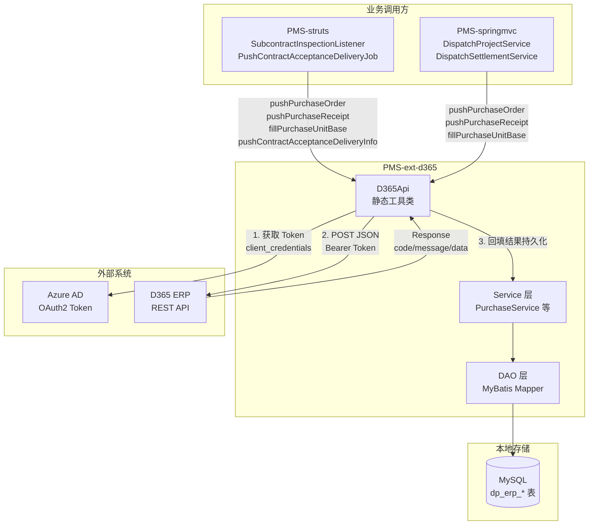
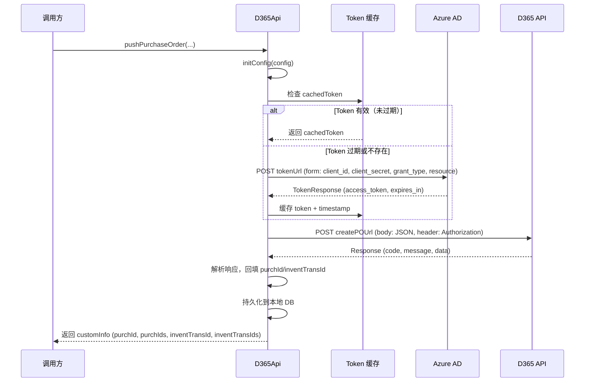
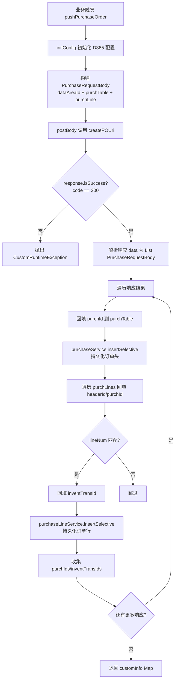
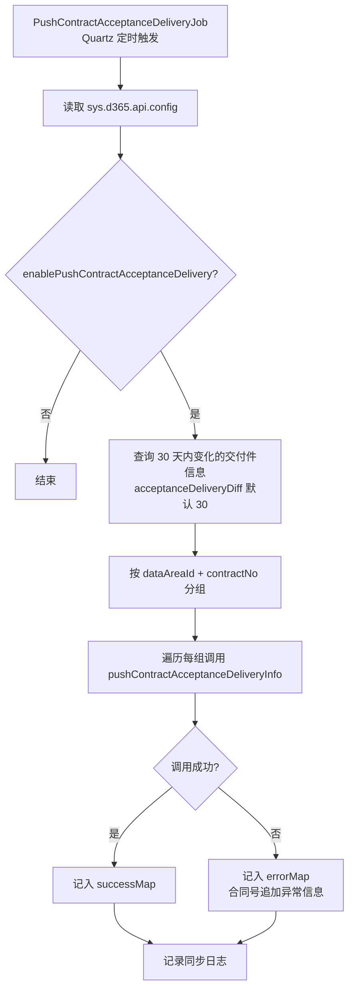
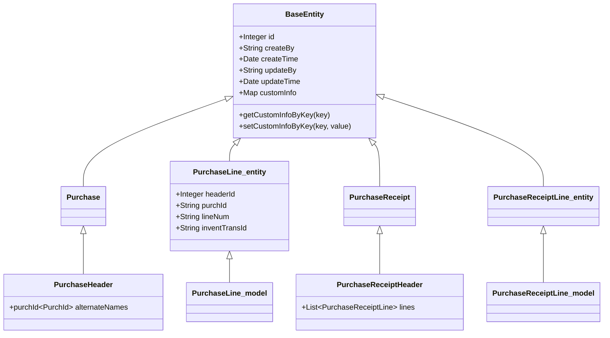
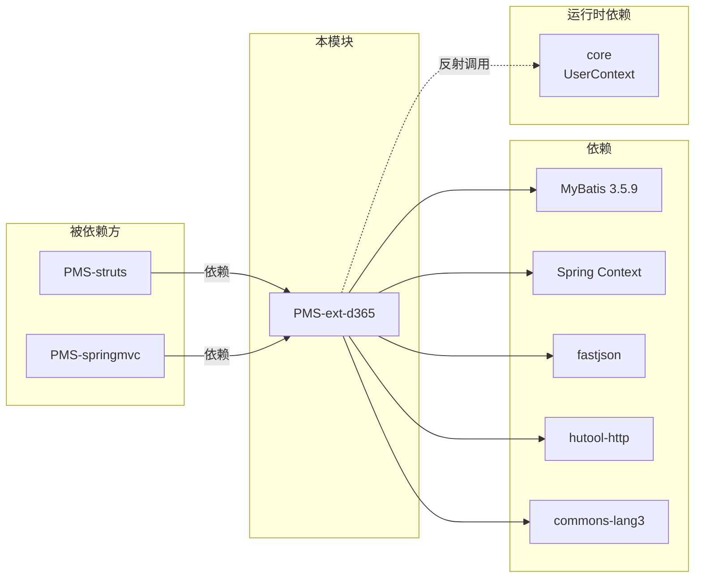

# PMS-ext-d365 模块文档

> PMS 与 Microsoft Dynamics 365 ERP 系统的集成扩展模块。负责采购订单、采购收货、合同验收交付等业务数据向 D365 的实时推送与本地持久化。

---

## 1. 模块概述

- **模块名称**：`pms-ext-d365`
- **模块定位**：D365 ERP 集成扩展层（jar 库），为 PMS-struts / PMS-springmvc 业务模块提供与 D365 系统交互的统一能力。
- **核心职责**：
  - 封装 D365 REST API 调用（OAuth2 认证、HTTP 通信、JSON 序列化）
  - 推送采购订单（PO）到 D365 并将回填结果（purchId、inventTransId）持久化到本地
  - 推送采购收货（Packing Slip）到 D365 并持久化
  - 推送合同验收交付节点信息到 D365
  - 填充采购订单基准单位（数量/价格精度、单位换算）
- **技术栈**：Spring 5.3.19 + MyBatis 3.5.9 + fastjson + Hutool-http + commons-lang3
- **JDK 版本**：JDK 1.8
- **打包类型**：jar
- **基础包名**：`com.dp.plat.pms.extend.d365`

---

## 2. 包结构

```
PMS-ext-d365/
└── src/main/java/com/dp/plat/pms/extend/d365/
    ├── util/
    │   └── D365Api.java              # D365 API 核心工具类（静态方法）
    ├── entity/                       # 数据库实体（MyBatis 映射）
    │   ├── BaseEntity.java           # 实体基类（id、审计字段、customInfo）
    │   ├── Purchase.java             # 采购订单头实体
    │   ├── PurchaseLine.java         # 采购订单行实体
    │   ├── PurchaseReceipt.java      # 采购收货头实体
    │   └── PurchaseReceiptLine.java  # 采购收货行实体
    ├── model/                        # API 请求/响应 DTO
    │   ├── Request.java              # 通用请求包装（泛型，带 responseType）
    │   ├── RequestBody.java          # 请求体基类（dataAreaId）
    │   ├── Response.java             # 统一响应（code/message/data）
    │   ├── TokenRequest.java         # OAuth2 Token 请求
    │   ├── TokenResponse.java        # OAuth2 Token 响应
    │   ├── PurchaseRequest.java      # 采购请求
    │   ├── PurchaseRequestBody.java  # 采购请求体（purchTable + purchLine）
    │   ├── PurchaseHeader.java       # 采购头 DTO（继承 Purchase）
    │   ├── PurchaseHeader2.java      # 采购头 DTO 备选（自带 @JSONField 字段）
    │   ├── PurchaseLine.java         # 采购行 DTO（继承 entity.PurchaseLine）
    │   ├── PurchaseLine2.java        # 采购行 DTO 备选（自带 @JSONField 字段）
    │   ├── PurchaseReceiptHeader.java# 收货头 DTO（继承 PurchaseReceipt，含 lines）
    │   └── PurchaseReceiptLine.java  # 收货行 DTO（继承 entity.PurchaseReceiptLine）
    ├── dao/                          # MyBatis Mapper 接口
    │   ├── AbstractBaseMapper.java   # 基础 Mapper 接口
    │   ├── PurchaseMapper.java
    │   ├── PurchaseLineMapper.java
    │   ├── PurchaseReceiptMapper.java
    │   └── PurchaseReceiptLineMapper.java
    ├── mapping/                      # MyBatis XML 映射（与 Java 同目录）
    │   ├── PurchaseMapper.xml
    │   ├── PurchaseLineMapper.xml
    │   ├── PurchaseReceiptMapper.xml
    │   └── PurchaseReceiptLineMapper.xml
    ├── service/                      # Service 接口
    │   ├── IAbstractBaseService.java
    │   ├── IPurchaseService.java
    │   ├── IPurchaseLineService.java
    │   ├── IPurchaseReceiptService.java
    │   └── IPurchaseReceiptLineService.java
    ├── service/impl/                 # Service 实现
    │   ├── AbstractBaseService.java  # 基础实现（审计字段自动填充）
    │   ├── PurchaseService.java
    │   ├── PurchaseLineService.java
    │   ├── PurchaseReceiptService.java
    │   └── PurchaseReceiptLineService.java
    └── exception/
        └── CustomRuntimeException.java # 自定义运行时异常
```

> **注意**：MyBatis XML 映射文件与 Java 文件同目录（`mapping/` 子包），符合 PMS 项目约定。

---

## 3. 核心类清单

### 3.1 API 工具类

| 类名 | 完整路径 | 职责 |
|------|----------|------|
| `D365Api` | `com.dp.plat.pms.extend.d365.util.D365Api` | D365 REST API 调用核心，静态方法封装 Token 认证、HTTP 通信、采购/收货推送、结果回填持久化 |

### 3.2 Entity 实体类

| 类名 | 完整路径 | 对应表 | 说明 |
|------|----------|--------|------|
| `BaseEntity` | `...entity.BaseEntity` | - | 实体基类，含 id、createBy/createTime、updateBy/updateTime、customInfo(Map) |
| `Purchase` | `...entity.Purchase` | `dp_erp_purchase_order_header` | 采购订单头（purchId、供应商、合同、交货、转包信息等） |
| `PurchaseLine` | `...entity.PurchaseLine` | `dp_erp_purchase_order_line` | 采购订单行（物料、数量、价格、维度信息） |
| `PurchaseReceipt` | `...entity.PurchaseReceipt` | `dp_erp_purchase_receipt_header` | 采购收货头（packingSlipId、源单据关联） |
| `PurchaseReceiptLine` | `...entity.PurchaseReceiptLine` | `dp_erp_purchase_receipt_line` | 采购收货行（qty、price、amount、批次号） |

### 3.3 Model DTO 类

| 类名 | 完整路径 | 职责 |
|------|----------|------|
| `Request<T>` | `...model.Request` | 通用请求包装，通过反射提取泛型 responseType，含 headers 和 request body |
| `RequestBody` | `...model.RequestBody` | 请求体基类，含 dataAreaId（D365 账套） |
| `Response` | `...model.Response` | 统一响应，code=200 表示成功，data 为 List<Map> |
| `TokenRequest` | `...model.TokenRequest` | OAuth2 Token 请求（resource、client_id、client_secret、grant_type） |
| `TokenResponse` | `...model.TokenResponse` | OAuth2 Token 响应（access_token、expires_in、error 等） |
| `PurchaseRequestBody` | `...model.PurchaseRequestBody` | 采购请求体，含 purchTable(PurchaseHeader) + purchLine(List) |
| `PurchaseHeader` | `...model.PurchaseHeader` | 采购头 DTO，继承 Purchase，添加链式 builder 方法，purchId 支持 `PurchId` 别名解析 |
| `PurchaseLine` | `...model.PurchaseLine` | 采购行 DTO，继承 entity.PurchaseLine，添加链式 builder 方法 |
| `PurchaseReceiptHeader` | `...model.PurchaseReceiptHeader` | 收货头 DTO，继承 PurchaseReceipt，含 lines 列表 |
| `PurchaseReceiptLine` | `...model.PurchaseReceiptLine` | 收货行 DTO，继承 entity.PurchaseReceiptLine |

> `PurchaseHeader2` / `PurchaseLine2` 为备选实现，自带 `@JSONField` 注解的字段（未在主流程使用，保留作兼容）。

### 3.4 DAO 接口

| 类名 | 完整路径 | 泛型 | 说明 |
|------|----------|------|------|
| `AbstractBaseMapper<T>` | `...dao.AbstractBaseMapper` | `<T>` | 基础 Mapper，定义 8 个标准方法 |
| `PurchaseMapper` | `...dao.PurchaseMapper` | `Purchase` | 采购订单头 CRUD |
| `PurchaseLineMapper` | `...dao.PurchaseLineMapper` | `model.PurchaseLine` | 采购订单行 CRUD（注意泛型为 model 包） |
| `PurchaseReceiptMapper` | `...dao.PurchaseReceiptMapper` | `PurchaseReceipt` | 采购收货头 CRUD |
| `PurchaseReceiptLineMapper` | `...dao.PurchaseReceiptLineMapper` | `PurchaseReceiptLine` | 采购收货行 CRUD |

> **避坑**：`PurchaseLineMapper` 的泛型是 `model.PurchaseLine`（DTO），而非 `entity.PurchaseLine`。但 XML resultMap 的 type 指向 `entity.PurchaseLine`。实际使用中通过 `insertSelective` 持久化的是 model.PurchaseLine（继承自 entity.PurchaseLine），兼容无问题。

### 3.5 Service 类

| 接口 | 实现类 | Bean 名称 | 泛型 |
|------|--------|-----------|------|
| `IAbstractBaseService<T>` | `AbstractBaseService<Mapper, T>` | - | 基础抽象类 |
| `IPurchaseService` | `PurchaseService` | `d365PurchaseService` | `PurchaseMapper, Purchase` |
| `IPurchaseLineService` | `PurchaseLineService` | `d365PurchaseLineService` | `PurchaseLineMapper, model.PurchaseLine` |
| `IPurchaseReceiptService` | `PurchaseReceiptService` | `d365PurchaseReceiptService` | `PurchaseReceiptMapper, PurchaseReceipt` |
| `IPurchaseReceiptLineService` | `PurchaseReceiptLineService` | `d365PurchaseReceiptLineService` | `PurchaseReceiptLineMapper, PurchaseReceiptLine` |

### 3.6 异常类

| 类名 | 完整路径 | 说明 |
|------|----------|------|
| `CustomRuntimeException` | `...exception.CustomRuntimeException` | 自定义运行时异常，D365 接口调用失败时抛出 |

---

## 4. D365 集成架构



### 认证流程



---

## 5. 接口调用方式与代码示例

### 5.1 D365 API 端点配置

配置通过 `sys.d365.api.config` 系统参数（JSON 字符串）注入，关键字段：

| 配置项 | 说明 | 示例值 |
|--------|------|--------|
| `serviceUrl` | D365 服务基础地址 | `https://usnconeboxax1aos.cloud.onebox.dynamics.com` |
| `tokenUrl` | OAuth2 Token 地址（含 `%s` 占位符，用 appId 格式化） | `https://login.microsoftonline.com/%s/oauth2/token` |
| `appId` | Azure AD 应用 ID（用于格式化 tokenUrl） | `1402f304-...` |
| `clientId` | OAuth2 客户端 ID | `69d7585c-...` |
| `clientSecret` | OAuth2 客户端密钥 | `F-58Q~...` |
| `grantType` | 授权类型 | `client_credentials` |
| `resource` | 资源标识（默认取 serviceUrl） | D365 服务地址 |
| `createPOUrl` | 创建采购订单接口路径 | `/api/services/IWS_InterfaceInboundServiceGroup/CreatePurchTable/create` |
| `receiptPOUrl` | 创建采购收货接口路径 | `/api/services/IWS_InterfaceInboundServiceGroup/CreatePurchPackingSlip/create` |
| `paymentSchedUrl` | 合同验收交付推送接口路径 | - |
| `enablePushPurchaseOrder` | 是否启用采购订单推送 | `true` |
| `enablePushContractAcceptanceDelivery` | 是否启用合同验收交付推送 | `true` |

### 5.2 D365Api 核心方法

#### 获取 Token（自动缓存）

```java
// Token 获取带缓存机制，过期自动刷新
// 缓存字段：private static volatile TokenResponse cachedToken
public static TokenResponse getToken() {
    // 1. 检查 cachedToken 是否存在且未过期
    //    - 通过 expiresOn 或 expiresIn + timestamp 计算过期时间
    // 2. 若有效直接返回；否则发起 token 请求
    // 3. 请求成功后缓存 token 并记录 timestamp
}
```

#### 推送采购订单（泛型回填版）

```java
// 调用方传入业务对象（如 SubcontractProject / DispatchProject），方法将 D365 返回的
// purchId、inventTransId 等回填到对象的 customInfo 中
SubcontractProject subcontract = D365Api.pushPurchaseOrder(
    subcontract,           // 业务对象（泛型 T，需继承 BaseEntity）
    dataAreaId,            // D365 账套，如 "DPGF"
    purchTable,            // PurchaseHeader 采购头
    purchLines,            // List<PurchaseLine> 采购行
    config                 // Map<String, Object> D365 配置
);
// 回填后 subcontract.customInfo 包含：
//   purchId     - 采购订单号
//   purchIds    - 采购订单号列表（支持多次推送累积）
//   inventTransId  - 批次号
//   inventTransIds - 批次号列表
```

#### 推送采购收货

```java
BaseEntity entity = D365Api.pushPurchaseReceipt(
    entity,                // 业务对象
    dataAreaId,            // D365 账套
    receipt,               // PurchaseReceiptHeader 收货头
    receiptLines,          // List<PurchaseReceiptLine> 收货行
    config                 // D365 配置
);
// 回填后 customInfo 包含：packingSlipId、purchId、purchIds、inventTransId、inventTransIds
```

#### 推送合同验收交付信息

```java
// 由 PushContractAcceptanceDeliveryJob（Quartz 定时任务）调用
D365Api.pushContractAcceptanceDeliveryInfo(
    dataAreaId,            // D365 账套
    contractNo,            // 合同号
    lines,                 // List<Map<String, Object>> 验收交付节点信息
    config                 // D365 配置
);
```

#### 填充采购基准单位

```java
// 从 customInfo 或 config 读取精度配置，回填到业务对象
D365Api.fillPurchaseUnitBase(subcontract, config);
// 回填字段：purchUnitBase（基准单位）、purchPriceBase（价格基准）、purchQtyBase（数量基准）
// 精度配置：qtyScale（数量小数位，默认2）、priceScale（价格小数位，默认2）
```

### 5.3 HTTP 通信核心方法

```java
// 统一 POST 方法（内部核心）
public static <T> T post(String url, Request<T> request, boolean isForm, boolean needAuth) {
    // 1. 若 url 无 host，拼接 serviceUrl 前缀
    // 2. 创建 POST 请求，设置自定义 headers
    // 3. 若 needAuth=true，获取 Token 并设置 Authorization 头
    // 4. isForm=true 用 form 提交，否则用 JSON body 提交
    // 5. 执行请求，解析响应为 responseType
}

// 便捷方法
public static <T> T postForm(String url, Request<T> params)           // 表单+认证
public static <T> T postBody(String url, Request<T> params)           // JSON+认证
public static <T> T postBody(String url, Request<T> params, boolean needAuth) // JSON+可选认证
```

> **JSON 序列化**：`toJSONString()` 方法禁用了 fastjson 默认的 `SortField` 和 `MapSortField`，保持字段声明顺序，确保 D365 接口字段顺序正确。

---

## 6. 数据同步机制

### 6.1 同步模式

| 业务场景 | 同步模式 | 触发方式 | 调用方 |
|----------|----------|----------|--------|
| 采购订单推送 | 实时同步 | 业务事件触发（转包审批/派工立项） | SubcontractInspectionListener、DispatchProjectService |
| 采购收货推送 | 实时同步 | 业务事件触发（转包验收/派工结算） | SubcontractInspectionListener、DispatchSettlementService |
| 合同验收交付 | 定时同步 | Quartz 定时任务 | PushContractAcceptanceDeliveryJob |

### 6.2 采购订单推送流程



### 6.3 采购收货推送流程

与采购订单推送类似，区别：
- 请求体直接使用 `PurchaseReceiptHeader`（含 `lines` 字段），不使用 `PurchaseRequestBody` 包装
- 响应解析为 `List<PurchaseReceiptHeader>`
- 行匹配通过 `inventTransId` 而非 `lineNum`
- 持久化使用 `purchaseReceiptService` 和 `purchaseReceiptLineService`

### 6.4 合同验收交付定时同步



---

## 7. 数据映射与转换规则

### 7.1 Entity 与 Model 继承关系



### 7.2 字段映射规则

| D365 字段 | 本地 Entity 字段 | 说明 |
|-----------|------------------|------|
| `PurchId` / `purchId` | `purchId` | 采购订单号，PurchaseHeader 支持 `alternateNames` 兼容大小写 |
| `dataAreaId` | `dataAreaId` | D365 账套（如 DPGF） |
| `purchTable` | `PurchaseHeader` | 采购订单头对象 |
| `purchLine` | `List<PurchaseLine>` | 采购订单行列表 |
| `inventTransId` | `inventTransId` | 库存批次号（D365 返回，回填到本地） |
| `lineNum` | `lineNum` | 行号（用于匹配响应与请求行） |
| `packingSlipId` | `packingSlipId` | 收货单号 |
| `lines` | `List<PurchaseReceiptLine>` | 收货行列表（仅 PurchaseReceiptHeader） |

### 7.3 customInfo 透传机制

`BaseEntity.customInfo`（Map<String, Object>）用于在 D365Api 与业务对象间透传数据：

| Key | 含义 | 写入方 | 读取方 |
|-----|------|--------|--------|
| `purchId` | 最新采购订单号 | D365Api.pushPurchaseOrder | 业务层 |
| `purchIds` | 采购订单号列表（累积） | D365Api.pushPurchaseOrder | 业务层 |
| `inventTransId` | 最新批次号 | D365Api.pushPurchaseOrder | 业务层 |
| `inventTransIds` | 批次号列表（累积） | D365Api.pushPurchaseOrder | 业务层 |
| `packingSlipId` | 收货单号 | D365Api.pushPurchaseReceipt | 业务层 |
| `purchUnitBase` | 采购基准单位 | D365Api.fillPurchaseUnitBase | 业务层 |
| `purchPriceBase` | 价格基准 | D365Api.fillPurchaseUnitBase | 业务层 |
| `purchQtyBase` | 数量基准 | D365Api.fillPurchaseUnitBase | 业务层 |

---

## 8. 数据库表关联

| 表名 | 别名 | Entity | CRUD 操作 | 说明 |
|------|------|--------|-----------|------|
| `dp_erp_purchase_order_header` | `poh` | `Purchase` | C / R / U / D | 采购订单头 |
| `dp_erp_purchase_order_line` | `pol` | `PurchaseLine` | C / R / U / D | 采购订单行 |
| `dp_erp_purchase_receipt_header` | - | `PurchaseReceipt` | C / R / U / D | 采购收货头 |
| `dp_erp_purchase_receipt_line` | - | `PurchaseReceiptLine` | C / R / U / D | 采购收货行 |

### 关键字段说明

**dp_erp_purchase_order_header**（采购订单头）：
- `id`（PK，自增）、`sourceType`/`sourceId`（源数据关联）、`purchId`（采购订单号）
- `vendAccount`（供应商账号）、`purchName`（采购事项）、`purchPoolId`（采购订单池）
- `purContract`/`salesContract`（采购/销售合同号）、`contractAmount`（合同金额）
- `deliveryDate`（交货日期）、`dataAreaId`（账套）
- `subcontractType`/`subcontStartDate`/`subcontEndDate`（转包信息）
- `customInfo`（JSON，自定义信息）、审计字段（createBy/createTime/updateBy/updateTime）

**dp_erp_purchase_order_line**（采购订单行）：
- `id`（PK）、`headerId`（FK→头表 id）、`purchId`（采购订单号）、`lineNum`（行号）
- `itemId`（物料编码）、`purchQty`/`purchPrice`（数量/单价）
- `inventTransId`（批次号，D365 回填）、`inventSiteId`/`inventLocationId`/`wmsLocationId`（仓储）
- `dim*` 系列维度字段（dimDepartment、dimBU、dimProductLine、dimCustomer、dimVendor 等）

**dp_erp_purchase_receipt_header**（采购收货头）：
- `id`（PK）、`sourceOrderType`/`sourceOrderId`（源订单关联）
- `sourceReceiptType`/`sourceReceiptId`（源收货关联）
- `purchId`（采购订单号）、`packingSlipId`（收货单号）、`deliveryDate`/`documentDate`

**dp_erp_purchase_receipt_line**（采购收货行）：
- `id`（PK）、`receiptId`（FK→收货头 id）、`purchId`、`lineNum`/`inventTransId`（二选一匹配）
- `qty`/`price`/`amount`（数量/单价/金额）

---

## 9. 异常处理机制

### 9.1 异常类

`CustomRuntimeException`（继承 `RuntimeException`）：D365 接口调用失败时抛出。

```java
// 抛出示例（D365Api.pushPurchaseOrder 内）
if (!response.isSuccess()) {
    throw new CustomRuntimeException(
        StringUtils.defaultIfBlank(response.getMessage(), "接口调用异常！")
    );
}
```

### 9.2 异常处理策略

| 场景 | 处理方式 |
|------|----------|
| D365 接口返回 code != 200 | 抛出 `CustomRuntimeException`，消息取 response.message（为空则用"接口调用异常！"） |
| Token 获取失败 | cachedToken 置空，返回含 error 的 TokenResponse |
| Token 过期检查异常 | cachedToken 置空，重新获取 |
| 审计字段填充失败（无 setCreateBy 方法） | 静默忽略（catch 后不处理） |
| UserContext 反射获取用户名失败 | 返回 null |
| 合同验收交付推送失败 | 记入 errorMap，合同号追加异常消息，不中断整体流程 |

### 9.3 调用方异常处理示例

```java
// PushContractAcceptanceDeliveryJob 中的处理
try {
    D365Api.pushContractAcceptanceDeliveryInfo(dataAreaId, contractNo, lines, config);
    resultMap = successMap;
} catch (Exception e) {
    contractNo = contractNo + StringUtils.trimToEmpty(e.getMessage());
    resultMap = errorMap;
}
```

---

## 10. 模块间依赖关系



### 调用方明细

| 调用方模块 | 调用方类 | 调用方法 | 业务场景 |
|-----------|----------|----------|----------|
| PMS-struts | `SubcontractInspectionListener` | `pushPurchaseOrder` | 项目转包审批→推送采购订单 |
| PMS-struts | `SubcontractInspectionListener` | `pushPurchaseReceipt` | 项目转包验收→推送采购收货 |
| PMS-struts | `SubcontractInspectionListener` | `fillPurchaseUnitBase` | 填充采购基准单位 |
| PMS-struts | `PushContractAcceptanceDeliveryJob` | `pushContractAcceptanceDeliveryInfo` | Quartz 定时推送合同验收交付 |
| PMS-springmvc | `DispatchProjectService` | `pushPurchaseOrder` | 派工立项→推送采购订单 |
| PMS-springmvc | `DispatchProjectService` | `fillPurchaseUnitBase` | 填充采购基准单位 |
| PMS-springmvc | `DispatchSettlementService` | `pushPurchaseReceipt` | 派工结算→推送采购收货 |

### 运行时隐式依赖

- **core 模块**：`AbstractBaseService.getCurrentUsername()` 通过反射调用 `com.dp.plat.core.context.UserContext.getCurrentUsername()`（或 `getUsername()`），用于自动填充 createBy/updateBy。若 core 不在 classpath，则静默返回 null。

---

## 11. 最佳实践与避坑指南

### 11.1 配置初始化

- **必须先调用 `initConfig`**：D365Api 使用静态字段存储配置，调用任何接口前必须通过 `initConfig(Map)` 或带 config 参数的方法初始化。`pushPurchaseOrder` 等方法内部已自动调用。
- **tokenUrl 格式化**：`tokenUrl` 中的 `%s` 会被 `appId` 格式化，配置时需保留占位符。
- **配置来源**：配置通过 `sys.d365.api.config` 系统参数（JSON）注入，调用方读取后转为 Map 传入。

### 11.2 静态字段与 Spring 注入的冲突处理

D365Api 是静态工具类，但需要调用 Spring 管理的 Service。采用 `@PostConstruct` + 静态实例桥接模式：

```java
@Component("d365Api")
public class D365Api {
    @Autowired
    private IPurchaseService purchaseService;  // Spring 注入
    private static D365Api d365Api;            // 静态桥接实例

    @PostConstruct
    public void init() {
        d365Api = this;
        d365Api.purchaseService = this.purchaseService;  // 赋值给静态上下文
        // ... 其他 service
    }
}
```

> **避坑**：静态方法中通过 `d365Api.purchaseService` 访问，若 Spring 未完成初始化（@PostConstruct 未执行）会 NPE。

### 11.3 Token 缓存

- Token 缓存在 `static volatile TokenResponse cachedToken` 中，**进程级共享**。
- 过期判断优先使用 `expiresOn`，若无则通过 `timestamp + expiresIn` 计算。
- 过期或异常时 cachedToken 置空，下次调用自动重新获取。
- **避坑**：多线程并发首次获取 Token 可能重复请求，但 volatile 保证可见性，影响可控。

### 11.4 JSON 序列化顺序

D365 接口对字段顺序敏感，`toJSONString()` 方法禁用了 fastjson 的 `SortField`：

```java
int features = JSON.DEFAULT_GENERATE_FEATURE & ~SerializerFeature.SortField.getMask();
SerializeConfig serializeConfig = new SerializeConfig(true);
serializeConfig.config(clazz, SerializerFeature.SortField, false);
serializeConfig.config(clazz, SerializerFeature.MapSortField, false);
```

> **避坑**：若直接使用 `JSON.toJSONString()` 而非 `D365Api.toJSONString()`，字段会按字母排序，可能导致 D365 接口解析异常。

### 11.5 PurchaseLineMapper 泛型陷阱

`PurchaseLineMapper extends AbstractBaseMapper<model.PurchaseLine>`，泛型是 model 包的 PurchaseLine，而非 entity 包。但 XML resultMap type 指向 `entity.PurchaseLine`。由于 model.PurchaseLine 继承 entity.PurchaseLine，MyBatis 映射无问题，但代码阅读时需注意区分。

### 11.6 代码生成

- Entity、DAO、Service、XML 均由 MyBatisGenerator 生成（`src/test/java/CodeInit.java` 触发）。
- 生成配置：`src/test/resources/generatorConfigMain.xml`，根类 `BaseEntity`，基础 Mapper `AbstractBaseMapper`。
- **避坑**：修改 Entity 字段后需同步修改 XML 映射，重新生成会覆盖自定义改动。

### 11.7 调试日志

D365Api 大量使用 `System.out.println` 输出调试信息（URL、请求体、响应体），生产环境需注意日志量。建议后续替换为正式日志框架。

---

## 12. 变更记录

| 版本 | 日期 | 修改人 | 修改内容 |
|------|------|--------|----------|
| v1.0 | 2026-06-24 | - | 初始版本，基于源码梳理生成 |
