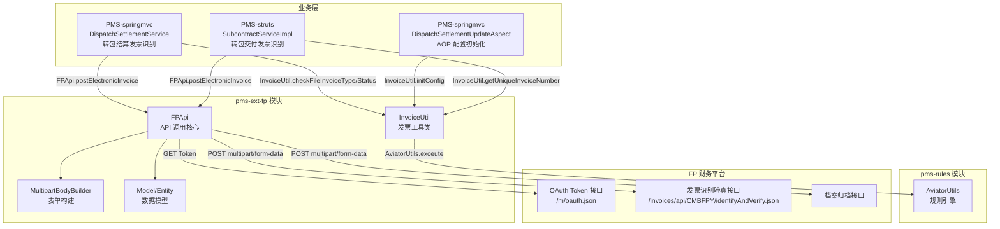
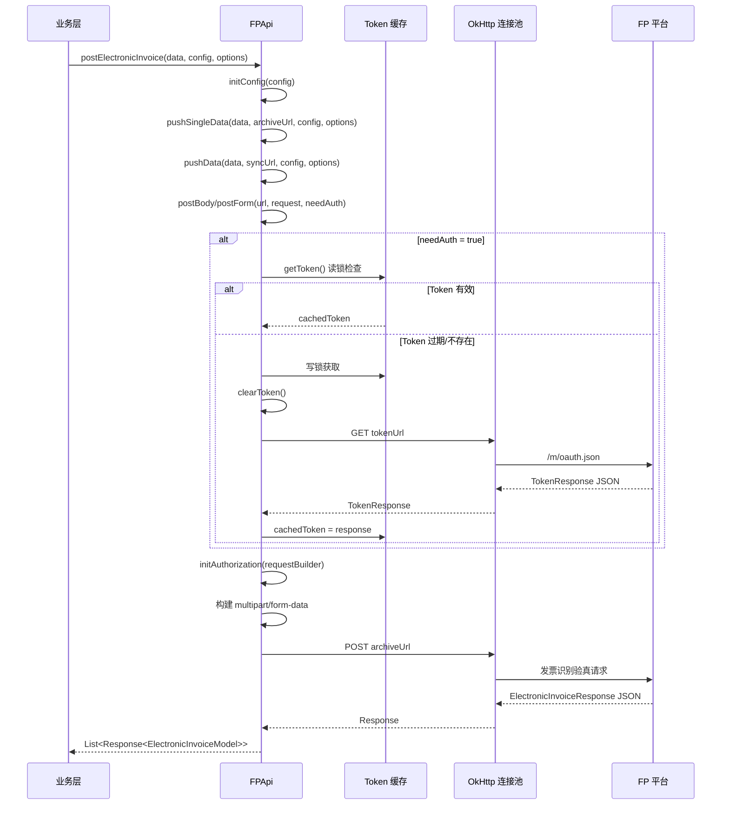
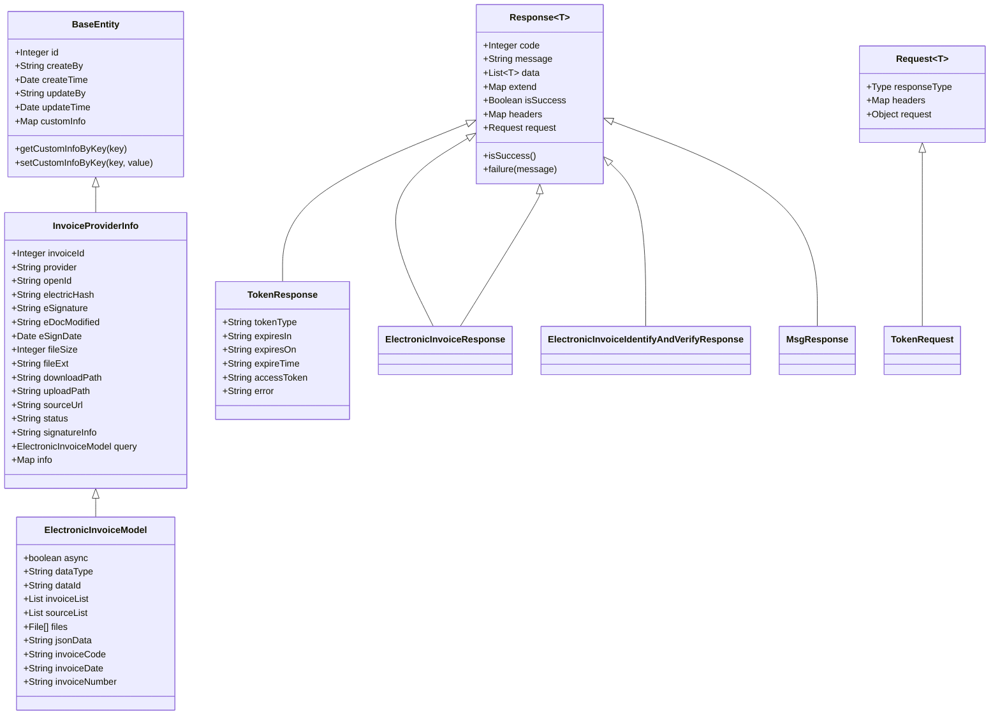
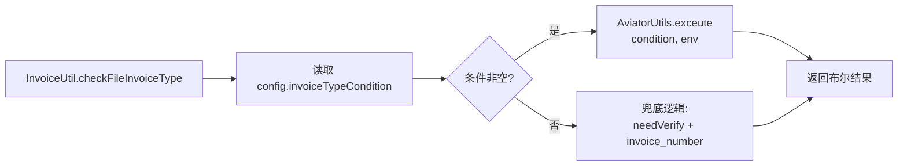
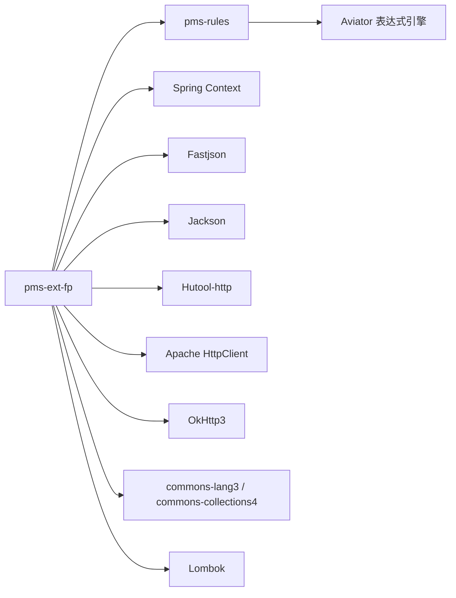
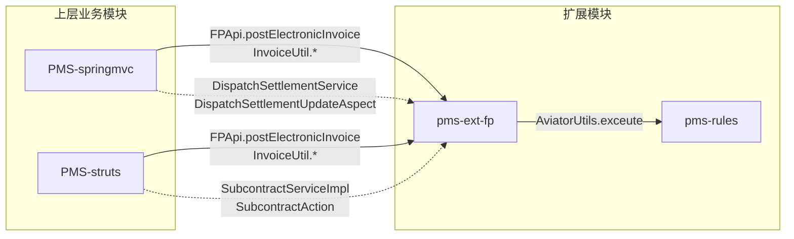

# pms-ext-fp 模块文档（FP 集成扩展）

> PMS 项目的 FP（财务平台 / Financial Platform）集成扩展模块，封装 FP 系统的 OAuth 认证、电子发票识别与验真、档案归档等远程 API 调用能力，并通过 pms-rules 规则引擎实现可配置的发票类型/状态判定。

---

## 1. 模块概述

- **模块名称**：`pms-ext-fp`（Maven artifactId）
- **模块定位**：PMS 对 FP 财务平台的集成扩展层，为上层业务模块（PMS-springmvc、PMS-struts）提供电子发票识别、验真、归档等能力的工具类与数据模型。
- **核心职责**：
  - 封装 FP 平台远程 API 调用（Token 获取、发票识别验真、档案归档）
  - 提供 Token 缓存与自动刷新机制（基于 `ReentrantReadWriteLock`）
  - 提供多 HTTP 客户端实现（OkHttp / Apache HttpClient / Hutool），默认使用 OkHttp 连接池
  - 提供批量数据推送的限流策略（MINUTE 调度 / MULTIPLE 并发 / SINGLE 串行）
  - 提供发票类型/状态的可配置化判定（集成 pms-rules 的 Aviator 表达式引擎）
  - 提供电子发票相关的实体、模型、请求/响应数据结构
- **技术栈**：Spring Context + Fastjson + Jackson + OkHttp3 + Apache HttpClient + Hutool + Aviator（经 pms-rules）+ Lombok
- **JDK 版本**：JDK 1.8
- **打包方式**：`jar`
- **基础包名**：`com.dp.plat.pms.extend.fp`

---

## 2. 包结构

```
pms-ext-fp/src/main/java/com/dp/plat/pms/extend/fp/
├── entity/
│   ├── BaseEntity.java              # 基础实体（id、审计字段、customInfo 自定义信息）
│   └── InvoiceProviderInfo.java     # 发票来源信息实体（关联 tb_invoice，含电子签名/文件元数据）
├── model/
│   ├── Request.java                 # 通用请求包装（泛型，含 responseType 反射推断）
│   ├── RequestBody.java             # 请求体（func 方法名 + data 列表）
│   ├── Response.java                # 通用响应基类（泛型，code/message/data/extend/headers）
│   ├── TokenRequest.java            # Token 请求（oauthType/code/nickName）
│   ├── TokenResponse.java           # Token 响应（accessToken/expiresIn/expiresOn 等）
│   ├── ElectronicInvoiceModel.java  # 电子发票/档案条目模型（核心业务模型，Lombok @Builder）
│   ├── ElectronicInvoiceResponse.java                    # 电子发票响应
│   ├── ElectronicInvoiceIdentifyAndVerifyResponse.java  # 发票识别验真响应
│   └── MsgResponse.java                                  # 消息响应
└── util/
    ├── FPApi.java                   # FP API 核心工具类（HTTP 调用、Token 管理、连接池）
    ├── InvoiceUtil.java             # 发票工具类（唯一号生成、类型/状态判定，集成规则引擎）
    └── MultipartBodyBuilder.java    # Multipart 表单构建器（支持 File/InputStream/String）
```

> ⚠️ **注意**：测试类 `FPApiTest.java` 位于 `src/test/java/com/dp/plat/erms/util/` 包下（历史遗留的 `erms` 包名，与主代码 `pms.extend.fp` 不一致）。

---

## 3. 核心类清单

| 类名 | 完整路径 | 职责 |
|------|----------|------|
| `FPApi` | `com.dp.plat.pms.extend.fp.util.FPApi` | FP 平台 API 调用核心类，封装 Token 管理、HTTP 请求、连接池、批量推送限流 |
| `InvoiceUtil` | `com.dp.plat.pms.extend.fp.util.InvoiceUtil` | 发票工具类，提供唯一发票号生成、发票类型/状态判定（集成 Aviator 规则引擎） |
| `MultipartBodyBuilder` | `com.dp.plat.pms.extend.fp.util.MultipartBodyBuilder` | Multipart 表单数据构建器，同时支持 OkHttp 与 Apache HttpClient |
| `ElectronicInvoiceModel` | `com.dp.plat.pms.extend.fp.model.ElectronicInvoiceModel` | 电子发票/档案条目核心模型，含归档字段与业务类型枚举 |
| `InvoiceProviderInfo` | `com.dp.plat.pms.extend.fp.entity.InvoiceProviderInfo` | 发票来源信息实体，关联 tb_invoice 表 |
| `Response` | `com.dp.plat.pms.extend.fp.model.Response` | 通用响应基类，定义成功码（0/200）与 failure 静态工厂 |
| `TokenResponse` | `com.dp.plat.pms.extend.fp.model.TokenResponse` | Token 响应，accessToken 映射自 `__RequestVerificationToken` 字段 |
| `Request` | `com.dp.plat.pms.extend.fp.model.Request` | 通用请求包装，通过反射推断 responseType |
| `BaseEntity` | `com.dp.plat.pms.extend.fp.entity.BaseEntity` | 实体基类，提供 customInfo 自定义信息存取 |

---

## 4. FP 集成架构

### 4.1 FP 系统定位

FP 是迪普科技内部的**财务平台**（Financial Platform），部署于 `http://fp.dptech.com`，提供：

- **OAuth 认证**：通过 `/m/oauth.json` 获取访问令牌
- **电子发票识别与验真**：通过 `/invoices/api/CMBFPY/identifyAndVerify.json` 接口
- **档案归档**：通过 `archiveUrl` 配置的接口推送报销单据与发票

### 4.2 整体架构图



### 4.3 配置体系

FP 集成的配置通过系统变量 `sys.fp.api` / `sys.fp.api.config` 注入，支持三种初始化方式：

| 初始化方式 | 方法签名 | 使用场景 |
|------------|----------|----------|
| Map 直接注入 | `FPApi.initConfig(Map<String, Object>)` | 一次性配置 |
| Supplier 动态获取 | `FPApi.initConfig(Supplier<...>)` | 配置可动态刷新 |
| Function 按 Key 获取 | `FPApi.initConfig(Function<String,...>, key)` | 多租户/多配置场景 |

核心配置项（来自测试用例 `FPApiTest`）：

| 配置键 | 示例值 | 说明 |
|--------|--------|------|
| `serviceUrl` | `http://fp.dptech.com` | FP 服务地址 |
| `tokenUrl` | `/m/oauth.json` | Token 获取接口 |
| `archiveUrl` | `/invoices/api/CMBFPY/identifyAndVerify.json` | 发票识别验真接口 |
| `authType` | `header` | 认证方式（bearer/header/query/cookie） |
| `authKey` | `__RequestVerificationToken` | 认证字段名 |
| `enableCookie` | `true` | 是否启用 Cookie |
| `cookieKey` | `dp.session.id` | Cookie 键名 |
| `provider` | `api` | 发票来源 |
| `openId` | `yfPurchase` | 用户唯一标识 |
| `postByForm` | `true` | 是否表单提交 |
| `debug` | `true` | 是否开启调试日志 |
| `rateLimit` | `30` | 请求限流（次/分钟） |
| `enableRetry` | `false` | 是否启用失败重试 |
| `httpClient.maxTotal` | `100` | 连接池最大连接数 |
| `httpClient.maxPerRoute` | `20` | 每路由最大连接数 |
| `httpClient.connectTimeout` | `10000` | 连接超时（毫秒） |
| `httpClient.readTimeout` | `60000` | 读取超时（毫秒） |
| `httpClient.keepAliveMinutes` | `5` | 连接保活时间（分钟） |

---

## 5. 接口与数据流

### 5.1 核心调用流程



### 5.2 FPApi 核心方法

#### Token 管理

| 方法 | 说明 |
|------|------|
| `TokenResponse getToken()` | 获取 Token，优先读缓存，过期则写锁刷新。支持 `expiresOn`/`expiresIn`/`expireTime` 三种过期判定 |
| `clearToken()` | 清除缓存 Token 与 Cookie（写锁） |
| `initAuthorization(...)` | 4 个重载：HttpRequest / HttpRequestBase / okhttp3.Request.Builder / URL，按 authType 注入认证信息 |

#### 发票推送

| 方法 | 说明 |
|------|------|
| `ElectronicInvoiceResponse postElectronicInvoice(T data)` | 单条发票推送（multipart/form-data） |
| `ElectronicInvoiceResponse postElectronicInvoice(T data, Map config, Map options)` | 单条推送（带配置与选项） |
| `List<Response<T>> postElectronicInvoice(List<T> list, Map config, Map options)` | 批量推送（MULTIPLE 并发模式） |
| `List<Response<ElectronicInvoiceModel>> postElectronicInvoice(dataType, dataId, files, sourceList, config, options)` | 文件列表批量识别验真 |

#### 数据推送与限流

| 方法 | 说明 |
|------|------|
| `pushData(list, url, rateLimit, config, limitType, splitToList, options)` | 推送总入口，按 limitType 分发 |
| `pushListData(...)` | 列表推送（splitToList=true，按 rateLimit 拆分） |
| `pushSingleData(...)` | 单条推送（splitToList=false） |
| `schedulePushData(...)` | MINUTE 模式：`ScheduledExecutorService` 按延迟调度 |
| `multiplePushData(...)` | MULTIPLE 模式：`fixedExecutor`（10 线程）并发提交，按序获取结果 |

限流模式常量：

| 常量 | 值 | 行为 |
|------|----|----|
| `MINUTE` | `"MINUTE"` | 调度器按分钟延迟串行发送 |
| `MULTIPLE` | `"MULTIPLE"` | 固定线程池并发发送，保持顺序 |
| `SINGLE` | `"SINGLE"` | 简单 for 循环串行发送 |

#### HTTP 请求

| 方法 | 说明 |
|------|------|
| `request(method, url, request, isForm, needAuth, options)` | 请求总入口，**默认调用 `requestWithOkHttp`** |
| `requestWithOkHttp(...)` | OkHttp 实现（默认启用） |
| `requestWithPool(...)` | Apache HttpClient 连接池实现（已注释） |
| `requestWithHutool(...)` | Hutool HttpUtil 实现（已注释） |
| `retryRequest(...)` | 失败重试，清 Token 后按 `enableRetry` 配置决定是否重试一次 |

### 5.3 InvoiceUtil 核心方法

| 方法 | 说明 |
|------|------|
| `getUniqueInvoiceNumber(Map invoice)` | 生成唯一发票号：优先 `uniqueInvoiceNumber`，否则 `invoice_code-invoice_number` 拼接 |
| `getFileInvoiceType(defaultValue)` | 从配置获取发票文件类型，默认 9 |
| `getFileInspectionType(defaultValue)` | 从配置获取验收材料类型，默认 5 |
| `checkFileInvoiceType(invoice, config)` | 判断是否发票类型：先取 `invoiceTypeCondition` Aviator 表达式执行，失败则按 `needVerify`+`invoice_number` 兜底 |
| `checkFileInvoiceStatus(invoice, config)` | 判断发票验真状态：先取 `invoiceStatusCondition` Aviator 表达式执行，失败则按 `identify && (!needVerify \|\| verified_status)` 兜底 |
| `initConfig(Supplier)` | 注入配置 Supplier |

### 5.4 数据模型关系



### 5.5 业务类型枚举（ElectronicInvoiceModel.businessType）

| 值 | 含义 |
|----|------|
| 1 | 电子发票-原材料/加工费 |
| 2 | 发票-行政采购（OA） |
| 4 | 安服 |
| 5 | 用服 |
| 6 | 美金发票 |
| 7 | 手工凭证 |
| 8 | SSE发票-一般报销发票 |
| 9 | 增值税发票（销项）-电子票 |
| 10 | 增值税发票（销项）-纸质票扫描件 |

---

## 6. 与 pms-rules 的集成

### 6.1 集成机制

`InvoiceUtil` 通过 `pms-rules` 模块的 `AviatorUtils` 实现发票类型/状态的可配置化判定，避免硬编码业务规则。



### 6.2 AviatorUtils 调用细节

```java
// InvoiceUtil 中的调用方式（checkFileInvoiceType / checkFileInvoiceStatus）
String condition = (String) invoice.get("condition");
condition = MapUtils.getString(config, "invoiceTypeCondition", condition);
if (StringUtils.isNotBlank(condition)) {
    Map<String, Object> env = new HashMap<>();
    env.put("entity", Collections.singletonMap("entity", invoice));
    return Boolean.TRUE.equals(AviatorUtils.exceute(condition, env));
}
```

- **规则脚本来源**：配置项 `invoiceTypeCondition` / `invoiceStatusCondition`，或 invoice Map 中的 `condition` 字段
- **执行环境**：`{entity: {entity: invoice}}`（双层嵌套，Aviator 表达式通过 `entity.entity.xxx` 访问发票字段）
- **AviatorUtils 特性**：LRU 缓存（默认 100）、MD5 缓存 Key、支持 Java 反射方法调用

### 6.3 配置示例

```json
{
  "invoiceTypeCondition": "entity.entity.invoice_number != nil && entity.entity.invoice_number != ''",
  "invoiceStatusCondition": "entity.entity.identify == true && (entity.entity.needVerify == false || entity.entity.verified_status == true)",
  "invoiceType": 9,
  "inspectionType": 5
}
```

---

## 7. 异常处理机制

### 7.1 异常处理策略

pms-ext-fp 模块**未定义自定义异常类**（注：模块内 `docs/02-modules/fp-integration.md` 中提到的 `FPException` 类实际不存在），统一通过以下方式处理异常：

| 场景 | 处理方式 |
|------|----------|
| HTTP 请求异常 | 捕获后调用 `retryRequest`，按 `enableRetry` 配置决定是否重试一次 |
| 响应反序列化失败 | 返回空 Response，设置 `message` 为错误信息（"响应内容不是Json格式！" / "反序列化发生异常！"） |
| 响应为空 | 返回空 Response，设置 `message` 为 "响应内容为空！" |
| Token 解析异常 | 调用 `clearToken()` 清除缓存后重新获取 |
| 调度推送异常 | 包装为 `RuntimeException("Error pushing data", e)` 抛出 |
| 并发推送异常 | 捕获 `RejectedExecutionException` 返回 `Response.failure("当前系统繁忙，请稍候再试！")`，其他异常返回 `Response.failure(e.getMessage())` |
| Future 超时 | `future.cancel(true)` 后返回 `Response.failure("请求超时")` |
| Aviator 规则执行异常 | `e.printStackTrace()` 后走兜底逻辑 |

### 7.2 Response 失败工厂

```java
// Response 提供静态失败工厂方法
public static <T> Response<T> failure(String message);
public static <T, R extends Response<T>> R failure(String message, Type responseType);
public static <T, R extends Response<T>> R failure(String message, Class<R> responseClass);
```

### 7.3 成功判定

`Response.isSuccess()` 返回 `true` 的条件：
- `isSuccess` 字段为 `true`，或
- `code` 字段在成功码集合 `{0, 200}` 中

---

## 8. 模块间依赖关系

### 8.1 Maven 依赖



### 8.2 模块调用关系



### 8.3 实际调用点

| 调用方模块 | 调用方类 | 调用方法 | 用途 |
|------------|----------|----------|------|
| PMS-springmvc | `DispatchSettlementService` | `FPApi.postElectronicInvoice` | 转包结算发票识别验真 |
| PMS-springmvc | `DispatchSettlementService` | `InvoiceUtil.getFileInvoiceType/getUniqueInvoiceNumber/checkFileInvoiceType/checkFileInvoiceStatus` | 发票类型判定与状态检查 |
| PMS-springmvc | `DispatchSettlementUpdateAspect` | `InvoiceUtil.initConfig` | AOP 切面初始化 InvoiceUtil 配置 |
| PMS-struts | `SubcontractServiceImpl` | `FPApi.postElectronicInvoice("payment", ...)` | 转包交付发票识别 |
| PMS-struts | `SubcontractServiceImpl` | `InvoiceUtil.getUniqueInvoiceNumber` | 发票号去重 |
| PMS-struts | `SubcontractAction` | `InvoiceUtil.getUniqueInvoiceNumber` | 发票号去重 |

### 8.4 配置注入路径

```
系统变量 sys.fp.api.config (JSON 字符串)
    ↓
SystemConfig.systemVariables.get("sys.fp.api.config")   ← PMS-springmvc
SystemContext.getConfig("sys.fp.api.config")            ← PMS-struts
    ↓
FPApi.initConfig(config) / InvoiceUtil.initConfig(supplier)
    ↓
FPApi 静态字段（serviceUrl/tokenUrl/archiveUrl/authType/authKey...）
```

---

## 9. 最佳实践与避坑指南

### 9.1 已知陷阱

- **pom.xml 拼写错误**：`<project.build.name>${project.name}}</project.build.name>` 多了一个 `}`，该属性未被构建插件使用，不影响构建，但属于明显笔误。
- **测试包名不一致**：`FPApiTest.java` 位于 `com.dp.plat.erms.util` 包下（历史遗留），与主代码 `com.dp.plat.pms.extend.fp` 不一致，重构时需注意。
- **`FPException` 不存在**：模块内 `docs/02-modules/fp-integration.md` 文档声称存在 `FPException` 自定义异常类，实际源码中并不存在，以本文件为准。
- **FPApi 全局静态状态**：`FPApi` 大量使用 `static` 字段（config、cachedToken、serviceUrl 等），全局共享，多租户场景下配置会互相覆盖。多配置场景应使用 `initConfig(Function, key)` 模式。
- **HTTP 客户端切换**：`request` 方法默认调用 `requestWithOkHttp`，`requestWithPool`（Apache HttpClient）与 `requestWithHutool` 已被注释。切换需修改源码第 1221-1223 行。
- **Token 字段映射**：`TokenResponse.accessToken` 映射自 JSON 字段 `__RequestVerificationToken`（非标准的 `access_token`），这是 FP 平台的特定字段名。
- **ElectronicInvoiceModel 的 `query`/`info` 字段**：使用 `@JSONField(serialize = true, deserialize = false)`，序列化时输出但反序列化时忽略主 setter，另有 `@JSONField(deserialize = true)` 的 String 参数 setter 单独处理反序列化。

### 9.2 使用建议

- **配置初始化**：业务层应在启动时通过 AOP（如 `DispatchSettlementUpdateAspect`）调用 `InvoiceUtil.initConfig(supplier)` 注入配置 Supplier，确保配置可动态刷新。
- **Token 刷新**：`getToken()` 内部已实现读锁检查 + 写锁刷新的双重检查机制，业务层无需手动管理 Token。
- **批量推送**：大批量发票识别使用 `postElectronicInvoice(List, config, options)`（MULTIPLE 并发模式），默认 10 线程并发，通过 `rateLimit` 控制频率。
- **限流配置**：`rateLimit` 默认 30 次/分钟，MULTIPLE 模式下按 `60/rateLimit` 秒间隔发送。
- **连接池调优**：通过 `httpClient` 配置节点调整 `maxTotal`/`maxPerRoute`/`connectTimeout`/`readTimeout`/`keepAliveMinutes`。
- **规则引擎集成**：发票类型/状态判定优先使用 Aviator 表达式（`invoiceTypeCondition`/`invoiceStatusCondition`），表达式为空时走代码兜底逻辑，便于运维动态调整规则。
- **资源释放**：`FPApi` 实现 `DisposableBean`，Spring 容器关闭时自动回收 `scheduler`、`fixedExecutor`、`HttpClientPool`、`OkHttpPool`。
- **调试日志**：配置 `debug: true` 开启请求/响应日志，日志通过 SLF4J 输出，生产环境应关闭。

### 9.3 扩展提示

- 新增 FP 接口时，复用 `pushData`/`postBody`/`postForm` 系列方法，仅需传入不同的 `syncUrl`。
- 自定义响应类型通过 `options.put("responseType", XxxResponse.class)` 指定。
- 表单提交设置 `options.put("headers", Collections.singletonMap("Content-Type", "multipart/form-data"))`，并配合 `MultipartBodyBuilder` 构建文件上传。

---

## 10. 变更记录

| 版本 | 日期 | 修改人 | 修改内容 |
|------|------|--------|----------|
| v1.0 | 2026-06-24 | - | 初始版本，基于源码梳理生成 |
