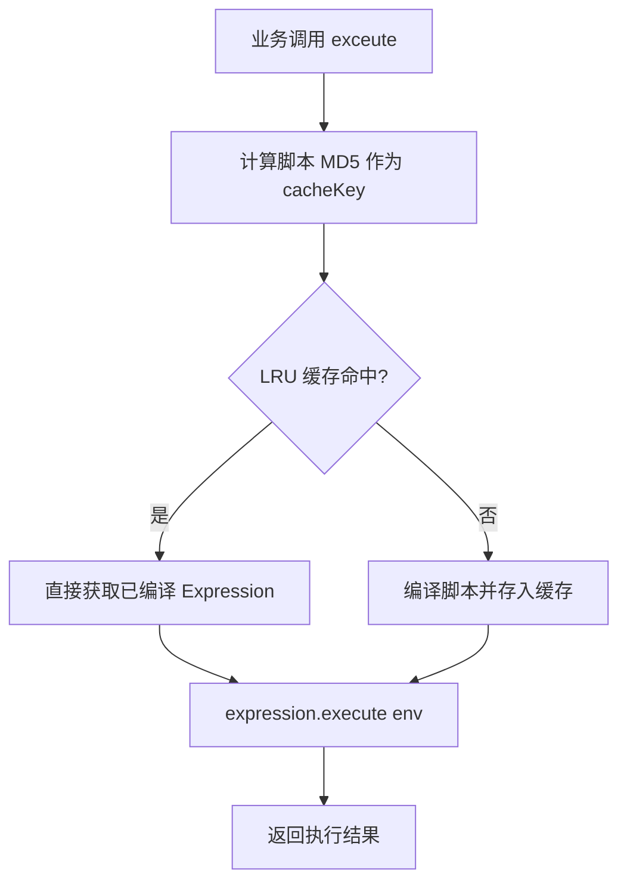
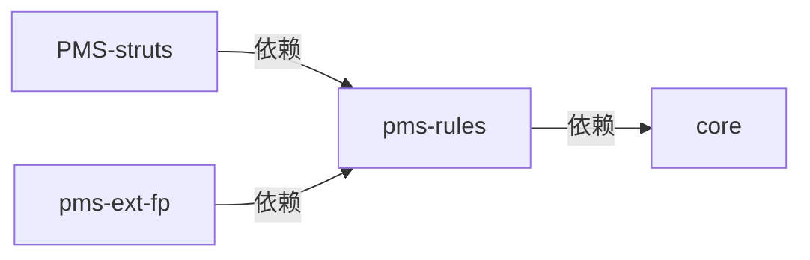

# pms-rules 模块文档（规则引擎）

> PMS 项目的规则引擎公共模块，以 jar 形式打包，为业务模块提供基于 Aviator 的表达式/脚本求值能力。pom.xml 中声明了 Aviator、LiteFlow、Groovy 三种规则引擎依赖，但**当前实际落地代码仅实现了 Aviator 部分**，LiteFlow 与 Groovy 依赖尚未被任何 Java 代码、配置或脚本使用。

---

## 1. 模块概述

- **模块名称**：`pms-rules`（Maven artifactId，`<name>` 为「规则引擎」）
- **模块定位**：PMS 系统的规则引擎公共方法模块，为上层业务模块（`pms-ext-fp`、`PMS-struts` 等）提供可热更新的规则脚本执行能力。
- **核心职责**：
  - 封装 Aviator 表达式引擎，提供统一的脚本编译、缓存与执行入口
  - 通过 LRU 缓存机制提升重复表达式的执行性能
  - 启用 Java 反射方法查找（`JavaMethodReflectionFunctionMissing`），允许在表达式中直接调用 Java 静态/实例方法
- **技术栈**：Aviator 5.4.3 + LiteFlow 2.15.0（仅声明依赖，未使用）+ Groovy 3.0.19（仅声明依赖，未使用）+ Spring（`spring-context`）+ Fastjson + Jackson
- **JDK 版本**：JDK 1.8
- **打包方式**：`jar`（默认打包，产物为 `规则引擎.jar` / `规则引擎-sources.jar`）
- **基础包名**：`com.dp.plat.rules`

---

## 2. 包结构

```
pms-rules/
├── pom.xml                              # Maven 构建文件，声明三种规则引擎依赖
└── src/main/java/com/dp/plat/rules/
    └── util/
        └── AviatorUtils.java            # Aviator 引擎工具类（单例 + LRU 缓存）
```

> ⚠️ **重要事实**：整个模块仅包含 1 个 Java 源文件。`src/main/resources/` 目录下无任何配置文件，无 LiteFlow 流程定义文件（`.el`/`.xml`），无 Groovy 脚本文件（`.groovy`）。

### 2.1 Maven 依赖（pom.xml）

| 依赖 | 版本 | 作用域 | 实际使用情况 |
|------|------|--------|--------------|
| `com.googlecode.aviator:aviator` | 5.4.3（父 pom 管理） | compile | ✅ 已使用，核心实现 |
| `com.yomahub:liteflow-spring` | 2.15.0（父 pom 管理） | compile | ❌ 仅声明，无任何代码/配置引用 |
| `org.codehaus.groovy:groovy` | 3.0.19 | compile | ❌ 仅声明，无任何代码/脚本引用 |
| `org.springframework:spring-context` | 父 pom 管理 | compile | ✅ 使用 `DigestUtils` |
| `com.alibaba:fastjson` | 父 pom 管理 | compile | 间接传递 |
| `com.fasterxml.jackson.core:jackson-databind` | 父 pom 管理 | compile | 间接传递 |
| `org.projectlombok:lombok` | 1.18.24 | compile | 提供（当前类未使用） |
| `org.mockito:mockito-inline` | 4.11.0 | test | 测试作用域 |

---

## 3. 核心类清单

| 类名 | 完整路径 | 职责 |
|------|----------|------|
| `AviatorUtils` | `com.dp.plat.rules.util.AviatorUtils` | Aviator 表达式引擎工具类，提供单例实例、脚本编译执行、LRU 缓存管理与实例重置 |

> 模块内**不存在** Rule/RuleEngine/RuleService 等规则管理类，也**不存在** Rule Entity/DAO 等持久化类。规则脚本以字符串形式存储在业务模块的配置（如系统参数、JSON 配置）中，由业务方自行管理生命周期。

---

## 4. 三种规则引擎对比

pom.xml 声明了三种规则引擎依赖，但实际使用情况差异极大：

| 维度 | Aviator | LiteFlow | Groovy |
|------|---------|----------|--------|
| **依赖版本** | 5.4.3 | 2.15.0 | 3.0.19 |
| **引擎类型** | 表达式/轻量脚本求值 | 流程编排引擎 | JVM 动态脚本语言 |
| **是否被代码使用** | ✅ 是（`AviatorUtils`） | ❌ 否 | ❌ 否 |
| **是否有配置文件** | ❌ 无（纯代码配置） | ❌ 无流程定义 | ❌ 无 `.groovy` 脚本 |
| **典型用途** | 条件判断、业务规则计算 | 节点编排、复杂流程 | 灵活脚本扩展 |
| **当前状态** | 生产可用 | 预留依赖，未落地 | 预留依赖，未落地 |
| **学习成本** | 低 | 中 | 中 |
| **执行性能** | 高（编译为字节码 + 缓存） | 中 | 中（编译为字节码） |
| **安全性** | 较高（沙箱受限） | 高（节点隔离） | 低（可访问任意 Java 类） |

> 📌 **结论**：当前 pms-rules 模块实质上是「Aviator 工具模块」。LiteFlow 与 Groovy 依赖属于预留引入，若需启用须自行补充实现代码与配置。

---

## 5. Aviator 表达式引擎

### 5.1 AviatorUtils 类结构

`AviatorUtils` 采用**静态内部类持有者（Static Holder）单例模式**，延迟初始化 `AviatorEvaluatorInstance`：

```java
public class AviatorUtils {

    private static int cacheSize = 100;

    private static class StaticHolder {
        private static AviatorEvaluatorInstance INSTANCE = newInstance();
        
        private static AviatorEvaluatorInstance newInstance() {
            AviatorEvaluatorInstance instance = AviatorEvaluator.getInstance();
            instance.useLRUExpressionCache(cacheSize);              // 启用 LRU 缓存
            instance.setCachedExpressionByDefault(true);            // 默认缓存编译结果
            instance.setFunctionMissing(JavaMethodReflectionFunctionMissing.getInstance()); // 反射方法查找
            return instance;
        }
    }

    public static AviatorEvaluatorInstance getInstance() {
        return StaticHolder.INSTANCE;
    }
    
    public static Object exceute(String script, Map<String, Object> env) {
        AviatorEvaluatorInstance evaluatorInstance = getInstance();
        // 缓存 Key：脚本内容的 MD5 摘要
        String cacheKey = DigestUtils.md5DigestAsHex(script.getBytes());
        // 编译脚本（命中缓存则直接返回）
        Expression expression = evaluatorInstance.compile(cacheKey, script, true);
        // 执行脚本
        Object result = expression.execute(env);
        return result;
    }
    
    public static void setCacheSize(int cacheSize) { /* 调整缓存大小 */ }
    
    public static void resetAviator() { /* 清空缓存并重建实例 */ }
}
```

### 5.2 核心方法说明

| 方法签名 | 功能 | 备注 |
|----------|------|------|
| `AviatorEvaluatorInstance getInstance()` | 获取单例 Aviator 实例 | 可用于注册自定义函数、预编译表达式 |
| `Object exceute(String script, Map<String,Object> env)` | 编译并执行表达式 | ⚠️ 方法名拼写为 `exceute`（非 `execute`），历史遗留 |
| `int getCacheSize()` | 获取当前缓存大小 | 默认 100 |
| `void setCacheSize(int cacheSize)` | 设置缓存大小并立即生效 | 会调用 `useLRUExpressionCache` |
| `void resetAviator()` | 清空缓存并重建实例 | 用于内存释放或配置热更新 |

### 5.3 引擎配置要点

| 配置项 | 值 | 说明 |
|--------|-----|------|
| 缓存策略 | LRU（最近最少使用） | `useLRUExpressionCache` |
| 默认缓存 | `true` | `setCachedExpressionByDefault` |
| 缓存容量 | 100 | 可通过 `setCacheSize` 调整 |
| 缓存 Key | 脚本 MD5 摘要 | `DigestUtils.md5DigestAsHex`（Spring 提供） |
| 函数缺失处理 | Java 反射查找 | `JavaMethodReflectionFunctionMissing` |

### 5.4 表达式语法示例（取自实际业务代码）

#### 5.4.1 简单数学与逻辑运算

```java
// 数学计算
Object result = AviatorUtils.exceute("1 + 2 * 3", new HashMap<>());
// 结果: 7

// 逻辑判断（变量来自 env）
Map<String, Object> env = new HashMap<>();
env.put("age", 25);
Object result = AviatorUtils.exceute("age >= 18 && age <= 60", env);
// 结果: true
```

#### 5.4.2 复杂脚本（含 use 导入、控制流、反射调用）

以下脚本来自 `SubcontractTest`，用于判断是否需要区域负责人审核分包：

```java
String condition = "use com.alibaba.fastjson.JSON;"
        + "    use java.util.Map;"
        + "    use java.util.List;"
        + "    use com.dp.plat.context.SpringContext;"
        + "    let payments = entity.entity;"
        + "    p(payments);"                       // p() 为内置打印函数
        + "    if (payments == nil || isEmpty(payments)) {"
        + "      return false;"
        + "    }"
        + "    let payment = get(payments, 0);"
        + "    let subcontractService = SpringContext.getBean('subcontractService');"
        + "    let subcontract = selectSubcontractProjectById(subcontractService, payment.subcontractId);"
        + "    if (subcontract == nil) {"
        + "      return false;"
        + "    }"
        + "    let auditEngineeFeeOffices = getSysArg(context, 'subcontract.areaLeader.auditEngineeFee.offices');"
        + "    if(auditEngineeFeeOffices == nil) {"
        + "      return true;"
        + "    }"
        + "    return !contains(auditEngineeFeeOffices, subcontract.profitDepCode);";

Map<String, Object> env = new HashMap<>();
env.put("entity", entity);
env.put("context", this);                          // context 用于回调 Java 方法
Object result = AviatorUtils.exceute(condition, env);
```

#### 5.4.3 业务实体赋值脚本（取自售前项目自动启动）

```java
String script = 
    "      let presales = entity.presales;\r\n" + 
    "      let projectType = presales.projectType;\r\n" + 
    "      let officeName = presales.officeName;\r\n" + 
    "      let projectName = presales.projectName;\r\n" + 
    "      if (projectType != nil && projectType != '') {\n" +
    "          return;\n" +
    "      }\r\n" + 
    "      if ('161000' == officeCode || contains(officeName, '专网营销部')) {\r\n" + 
    "          projectType = '专网项目';\r\n" + 
    "      } elsif ('161100' == officeCode || contains(officeName, '战略合作部')) {\r\n" + 
    "          projectType = '战略合作部项目';\r\n" + 
    "      } elsif (contains(projectName, '集采')) {\r\n" + 
    "          projectType = '集采项目';\r\n" + 
    "      } elsif (contains(projectName, '展会')) {\r\n" + 
    "          projectType = '展会';\r\n" + 
    "      } else {\r\n" + 
    "          projectType = '销售测试';\r\n" + 
    "      }\r\n" +
    "      setProjectType(presales, projectType);";   // 反射调用 Java 方法修改实体
```

### 5.5 支持的语法特性

| 语法特性 | 示例 | 说明 |
|----------|------|------|
| 变量声明 | `let x = 1;` | 局部变量 |
| 空值判断 | `x == nil`、`x != nil` | Aviator 的 null 表示 |
| 控制流 | `if/elsif/else` | 注意是 `elsif`（无 `e`） |
| 返回 | `return;`、`return true;` | 脚本可提前返回 |
| 导入 Java 类 | `use java.util.Map;` | 类似 Java import |
| 集合操作 | `get(list, 0)`、`contains(x, y)`、`isEmpty(x)` | 内置函数 |
| 反射方法调用 | `SpringContext.getBean('xxx')` | 由 `JavaMethodReflectionFunctionMissing` 支持 |
| 属性访问 | `entity.presales`、`presales.projectType` | Map key 或 JavaBean 属性 |
| 字符串 | `'单引号字符串'` | 推荐单引号 |
| 内置打印 | `p(x)` | 调试输出到 stdout |

---

## 6. LiteFlow 流程编排

> ⚠️ **当前状态：未落地**。pom.xml 声明了 `liteflow-spring` 2.15.0 依赖，但全仓库搜索 `com.yomahub.liteflow`、`liteflow`、`<chain>`、`.el` 流程定义文件均无任何匹配。本节仅说明预留能力与启用方式。

### 6.1 预期能力（未实现）

LiteFlow 是一个轻量级规则编排引擎，支持通过 EL 表达式或 XML/JSON 定义流程链，将业务拆分为多个节点组件进行编排。典型用法：


### 6.2 启用步骤（如需落地）

1. 在 `src/main/resources/` 下新增 LiteFlow 配置（如 `liteflow.xml` 或 `application.yml`）
2. 定义节点组件（继承 `NodeComponent`）与流程链（`<chain>`）
3. 注入 `FlowExecutor` 执行流程

> 当前模块未提供任何上述实现，使用前须自行补充。

---

## 7. Groovy 脚本引擎

> ⚠️ **当前状态：未落地**。pom.xml 声明了 `groovy` 3.0.19 依赖，但全仓库搜索 `GroovyShell`、`GroovyClassLoader`、`GroovyScriptEngine` 及 `.groovy` 脚本文件均无任何匹配。本节仅说明预留能力。

### 7.1 预期能力（未实现）

Groovy 是 JVM 上的动态语言，可与 Java 无缝互操作。典型用法为通过 `GroovyClassLoader` 编译脚本并缓存 `Class` 实例，实现热部署规则。

### 7.2 启用步骤（如需落地）

1. 编写 `GroovyUtils` 工具类（类似 `AviatorUtils`），封装 `GroovyClassLoader` 与脚本缓存
2. 注意安全性：Groovy 可访问任意 Java 类，须做沙箱限制
3. 注意内存：`GroovyClassLoader` 每次编译会生成新 Class，须配合缓存或清理机制避免 Metaspace 溢出

> 当前模块未提供任何上述实现，使用前须自行补充。

---

## 8. 规则管理与缓存机制

### 8.1 规则存储

pms-rules 模块**本身不持久化规则**。规则脚本以字符串形式由业务方存储，常见来源：

| 存储位置 | 业务场景 | 示例 |
|----------|----------|------|
| 系统参数表（`SystemContext.getSysArg`） | 发票类型判断条件、分包审核条件 | `SubcontractConstant.SUBCONTRACT_INSPECTION_DELIVERY_CHECK_INVOICE_CONDITION` |
| 业务配置 JSON（`config.scripts`） | 项目状态更新触发的脚本集合 | `ProjectStateUpdateAspect.execScripts` |
| 工作流节点配置 | 审批人启用条件 | `SubcontractInspectionListener.checkAssignee` |
| 实体字段（`invoice.condition`） | 发票类型/状态判断 | `InvoiceUtil.checkFileInvoiceType` |

### 8.2 缓存机制



**缓存关键点**：

- **缓存粒度**：以脚本字符串的 MD5 为 Key，相同脚本只编译一次
- **缓存容量**：默认 100，LRU 淘汰策略
- **缓存共享**：单例实例全局共享，所有业务方共用同一缓存池
- **缓存重置**：`resetAviator()` 清空全部缓存并重建实例，用于内存释放或脚本批量更新场景
- **动态调整**：`setCacheSize(n)` 运行时调整容量

### 8.3 执行环境变量约定

业务方调用 `exceute(script, env)` 时，`env` 中常见的关键变量：

| 变量名 | 含义 | 典型来源 |
|--------|------|----------|
| `entity` | 业务实体（Map 或 JavaBean） | 工作流变量、业务对象 |
| `config` | 当前规则配置 Map | 规则定义本身 |
| `configs` | 配置集合 | `execScripts` 场景 |
| `context` | 上下文对象（通常为切面/监听器实例） | 用于在脚本中回调 Java 方法 |
| `taskVars` | 工作流变量作用域 | Activiti `VariableScope` |

---

## 9. 业务集成方式

### 9.1 模块依赖关系



> 注：`PMS-struts` 与 `pms-ext-fp` 的 pom.xml 均声明了对 `pms-rules` 的依赖。但实际业务代码中，`PMS-struts`/`PMS-springmvc` 使用的是**自身包内**的 `com.dp.plat.util.AviatorUtils`（见第 11 节避坑指南），只有 `pms-ext-fp` 真正使用了 `com.dp.plat.rules.util.AviatorUtils`（本模块版本）。

### 9.2 业务调用点清单

| 调用方 | 文件 | 包名（实际使用） | 场景 |
|--------|------|------------------|------|
| `InvoiceUtil` | `pms-ext-fp/.../fp/util/InvoiceUtil.java` | `com.dp.plat.rules.util` ✅ | 发票类型/状态条件判断 |
| `ProjectStateUpdateAspect` | `PMS-struts/.../maintenance/aop/` | `com.dp.plat.util` ⚠️ | 项目状态更新规则校验 + 脚本执行 |
| `DispatchSettlementUpdateAspect` | `PMS-springmvc/.../pms/aop/` | `com.dp.plat.util` ⚠️ | 派工结算更新规则校验 + 脚本执行 |
| `SubcontractUtil` | `PMS-struts/.../subcontract/utils/` | `com.dp.plat.util` ⚠️ | 分包交付件发票类型/状态判断 |
| `SubcontractInspectionListener` | `PMS-struts/.../subcontract/listener/` | `com.dp.plat.util` ⚠️ | 分包验收审批人条件判断 |
| `AutoStartPresalesProjectJob` | `PMS-struts/.../job/` | `com.dp.plat.util` ⚠️ | 售前项目类型匹配脚本 |
| `WorkflowUtil` | `PMS-struts/.../util/WorkflowUtil.java` | `com.dp.plat.util` ⚠️ | Activiti 多实例节点完成条件变量提取 |

> ✅ = 使用 pms-rules 模块版本；⚠️ = 使用 PMS-struts 本地同名类（见第 11 节）

### 9.3 典型集成模式：规则条件判断

```java
// 模式：从配置读取条件表达式，构造 env，执行并判断布尔结果
public boolean checkRule(Map<String, Object> rule, Map<String, Object> variables) {
    boolean enable = !rule.containsKey("condition");
    if (enable) {
        return enable;
    }
    String condition = (String) rule.get("condition");
    Map<String, Object> env = new HashMap<>();
    env.put("entity", variables.get("entity"));
    env.put("config", rule);
    env.put("context", this);              // 回调入口

    Object result = false;
    try {
        result = AviatorUtils.exceute(condition, env);
    } catch (Exception e) {
        logError("规则脚本执行发生错误：", e);
    }
    return Boolean.TRUE.equals(result);
}
```

### 9.4 典型集成模式：批量脚本执行

```java
// 模式：从 config.scripts 读取脚本集合，循环执行，收集结果
public Object execScripts(Map<String, Object> entity, Map<String, Object> config, String scriptName) {
    String scripts = JSON.toJSON(config.getOrDefault("scripts", "")).toString();
    if (StringUtils.isBlank(scripts)) {
        return null;
    }
    Map<String, Object> env = new HashMap<>();
    env.put("entity", entity);
    env.put("configs", config);
    env.put("context", this);

    Map<String, Object> scriptMap = JSON.parseObject(scripts, JSONUtil.MapTypeReference);
    // ... 解析脚本列表，支持按 scriptName 过滤
    List<Object> results = new ArrayList<>();
    for (Map<String, Object> script : scriptList) {
        try {
            if (ObjectUtils.isNotEmpty(script.get("script"))) {
                boolean enable = checkRule(script, env);   // 先判断启用条件
                if (enable) {
                    env.put("config", script);
                    Object result = AviatorUtils.exceute(String.valueOf(script.get("script")), env);
                    results.add(result);
                }
            }
        } catch (Exception e) {
            logError("规则脚本执行发生错误：", e);
        }
    }
    return results;
}
```

---

## 10. 异常处理机制

### 10.1 模块内异常处理

`AviatorUtils` 本身**不捕获异常**，编译或执行失败时直接抛出 Aviator 运行时异常（如 `CompileExpressionErrorException`、`ExpressionRuntimeException`）。

### 10.2 业务方异常处理约定

业务调用方普遍采用 `try-catch + 默认值` 模式，避免规则失败阻断主流程：

```java
// 模式1：条件判断失败返回 false
try {
    result = AviatorUtils.exceute(condition, env);
} catch (Exception e) {
    logError("规则脚本执行发生错误：", e);
}
return Boolean.TRUE.equals(result);   // 异常时 result 保持 false 初始值

// 模式2：打印堆栈 + 走兜底逻辑
try {
    if (StringUtils.isNotBlank(condition)) {
        return Boolean.TRUE.equals(AviatorUtils.exceute(condition, env));
    }
} catch (Exception e) {
    e.printStackTrace();
}
return /* 兜底判断逻辑 */;
```

### 10.3 异常处理建议

- **不要**在 `AviatorUtils` 内部吞掉异常，否则业务方无法感知规则错误
- 业务方应记录失败脚本内容与 env，便于排查
- 批量脚本执行场景（`execScripts`）应收集错误列表，统一抛出或返回

---

## 11. 最佳实践与避坑指南

### 11.1 ⚠️ AviatorUtils 三处重复定义

全仓库存在 **3 个同名 `AviatorUtils` 类**，逻辑几乎一致，仅 MD5 工具不同：

| 位置 | 包名 | MD5 工具 | 实际使用方 |
|------|------|----------|------------|
| `pms-rules` 模块 | `com.dp.plat.rules.util` | Spring `DigestUtils.md5DigestAsHex` | `pms-ext-fp` |
| `PMS-struts` 模块 | `com.dp.plat.util` | `Md5Util.getMD5` | `PMS-struts`、`PMS-springmvc` |
| `core` 模块 | `com.dp.plat.core.util` | `PasswordUtil.encryptMD5Password` | （备用） |

**避坑**：
- 修改 `AviatorUtils` 逻辑时，**三处须同步修改**，否则行为不一致
- 业务方 `import` 时务必确认包名，`com.dp.plat.util.AviatorUtils` 与 `com.dp.plat.rules.util.AviatorUtils` 不可混用
- 长期建议统一收敛至 `pms-rules` 模块，删除其余两份副本

### 11.2 ⚠️ 方法名拼写错误

`exceute`（应为 `execute`）为历史遗留拼写错误，全仓库已广泛使用，**不可轻易重命名**，否则将引发大面积编译错误。新增代码应保持一致拼写。

### 11.3 ⚠️ LiteFlow / Groovy 依赖未使用

pom.xml 声明了 LiteFlow 与 Groovy 依赖，但**无任何代码使用**。这会带来：

- **构建体积膨胀**：引入不必要的 jar
- **维护成本**：版本升级时需评估，但实际无代码可测
- **认知误导**：阅读者可能误以为模块已支持三种引擎

**建议**：若短期无落地计划，可移除未使用依赖；若保留作为预留，须在团队内明确告知现状。

### 11.4 ⚠️ 反射方法调用的安全风险

`JavaMethodReflectionFunctionMissing` 允许表达式通过反射调用任意 Java 静态/实例方法（如 `SpringContext.getBean`、`Runtime.getRuntime`）。这意味着：

- 规则脚本来源须**可信**，不可由终端用户直接编辑
- 否则存在任意代码执行风险（可执行系统命令、访问敏感数据）

**建议**：规则脚本应仅由管理员维护，并通过系统参数表严格控制。

### 11.5 ⚠️ 缓存 Key 碰撞与内存

- 缓存 Key 为脚本 MD5，理论上存在碰撞风险（极低），且不同业务方相同脚本会共享缓存（无副作用，因 Expression 无状态）
- LRU 容量默认 100，若业务规则数量大且频繁更新，可能导致频繁淘汰重编译，建议按需调大
- `resetAviator()` 会清空全部缓存，**影响全局**，不可在高并发期随意调用

### 11.6 ⚠️ 脚本调试

- 内置 `p(x)` 函数输出到 stdout，生产环境慎用
- 建议在脚本中通过 `return` 提前返回，避免长脚本难以定位问题
- 复杂脚本应先在测试用例（参考 `SubcontractTest`、`AutoStartPresalesProjectJobTest`）中验证

### 11.7 ✅ 推荐用法

- **简单条件判断**：使用 Aviator 表达式（`age >= 18`）
- **复杂业务规则**：使用 Aviator 脚本（`use` + `let` + `if/elsif/else`）
- **需要回调 Java**：通过 `context` 变量传入业务对象，在脚本中反射调用
- **批量脚本**：参考 `execScripts` 模式，先 `checkRule` 判断启用条件，再执行主体脚本

---

## 12. 变更记录

| 版本 | 日期 | 修改人 | 修改内容 |
|------|------|--------|----------|
| v1.0 | 2026-06-24 | - | 初始版本，基于源码梳理生成 |
