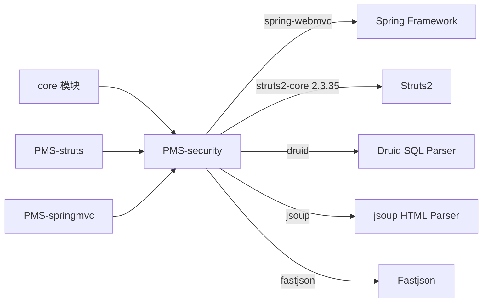
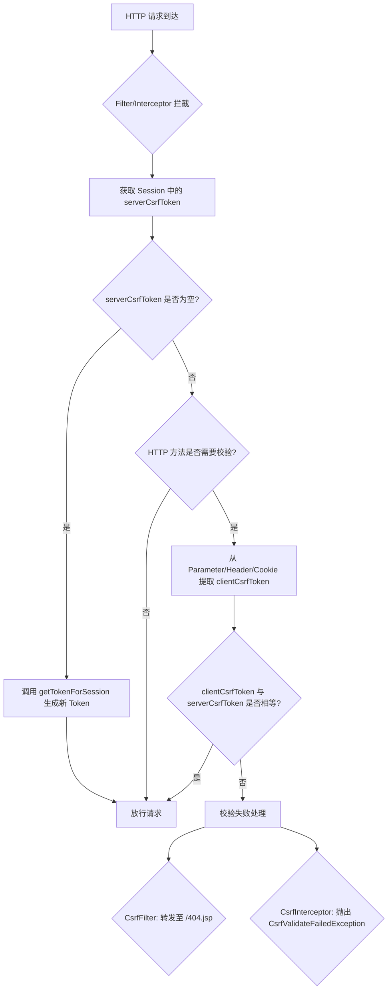
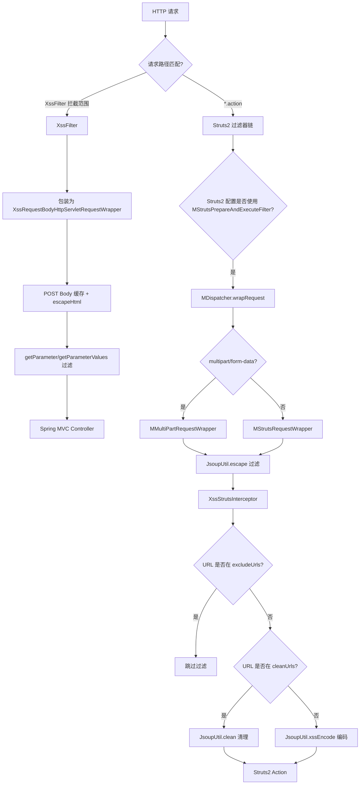
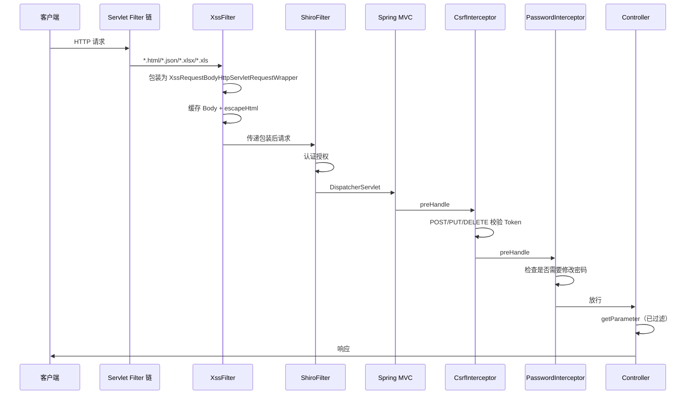
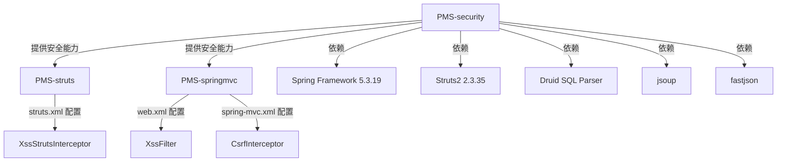

# PMS-security 模块文档

> 本文档对 PMS 项目中的 PMS-security 安全组件模块进行完整的功能梳理，覆盖模块定位、包结构、核心类、CSRF 防护、XSS 防护、SQL 解析、数据加密、验证码、安全过滤器链配置、异常处理及避坑指南。所有内容均基于实际源码分析，未虚构类名或方法名。

---

## 1. 模块概述

- **模块名称**：`PMS-security`（Maven artifactId：`pms-security`）
- **模块定位**：PMS 系统的安全组件基础库，以 `jar` 形式打包，被 `PMS-struts`、`PMS-springmvc` 等 Web 表现层模块依赖，提供 CSRF 防护、XSS 防护、SQL 解析、AES 加密、验证码等安全基础能力。
- **核心职责**：
  - **CSRF 防护**：基于 Session 的 Token 机制，提供 Servlet Filter（`CsrfFilter`）与 Spring MVC Interceptor（`CsrfInterceptor`）两种接入方式
  - **XSS 防护**：提供 Servlet Filter（`XssFilter`）+ Request Wrapper 组合方案，以及 Struts2 拦截器（`XssStrutsInterceptor`）方案，支持表单参数、JSON Body、Multipart 上传等多种请求形态
  - **Struts2 集成**：通过 `MDispatcher`、`MStrutsRequestWrapper`、`MMultiPartRequestWrapper` 等 Struts2 内部组件的子类化，在请求包装阶段注入 XSS 过滤
  - **SQL 解析**：基于 Druid SQL 解析器，提供表名提取、正则匹配、SQL 变量填充等能力，供动态 SQL 场景使用
  - **数据加密**：AES/ECB/PKCS5Padding 对称加密工具
  - **验证码**：图形验证码生成工具
  - **HTTP 上下文**：当前请求/会话获取、请求类型判断（Ajax/JSON/HTML/Excel）、客户端 IP 获取
- **技术栈**：
  - Spring 5.3.19（`spring-context`、`spring-web`、`spring-webmvc`）
  - Struts2 2.3.35（`struts2-core`，compile 作用域，用于 Struts2 集成类）
  - Druid（SQL 解析）
  - jsoup（HTML 清理，XSS 防护核心依赖）
  - fastjson（JSON 解析）
  - commons-lang3、commons-fileupload（通过 struts2-core 传递依赖）
- **JDK 版本**：JDK 1.8
- **打包方式**：`jar`

### 模块依赖关系



> **说明**：PMS-security 被 `PMS-struts`、`PMS-springmvc` 依赖（见根 `AGENTS.md` 模块依赖图：`PMS-security → PMS-struts`）。core 模块中**不存在** `com.dp.plat.security` 包，所有安全类均位于 PMS-security 模块内。

---

## 2. 包结构

模块根目录：`d:\常规软件\QoderCode\workspace\PMS\PMS-security\`

```
PMS-security/
├── pom.xml                              # Maven 构建配置
└── src/main/java/
    └── com/dp/plat/security/
        ├── context/
        │   └── HttpContext.java         # HTTP 请求上下文工具
        ├── csrf/
        │   ├── CSRFTokenManager.java    # CSRF Token 管理器（生成/存储/提取）
        │   ├── CsrfFilter.java          # CSRF Servlet 过滤器
        │   ├── CsrfInterceptor.java     # CSRF Spring MVC 拦截器
        │   └── CsrfValidateFailedException.java  # CSRF 校验失败异常
        ├── interceptor/
        │   └── PasswordInterceptor.java # 强制修改密码拦截器（抽象类）
        ├── util/
        │   ├── ASEUtil.java             # AES 加密工具
        │   ├── ByteUtils.java           # 字节工具（KMP 查找、ByteBuffer 操作）
        │   ├── CaptchaUtil.java         # 图形验证码工具
        │   ├── JsoupUtil.java           # HTML 清理/转义工具（XSS 防护核心）
        │   └── SQLParser.java           # SQL 解析工具（基于 Druid）
        └── xss/
            ├── XssFilter.java                       # XSS Servlet 过滤器
            ├── XssHttpServletRequestWrapper.java    # 基础 Request 包装器
            ├── XssRequestBodyHttpServletRequestWrapper.java   # POST Body 缓存+过滤（v1）
            ├── XssRequestBodyHttpServletRequestWrapper2.java  # JSON Body 解析+过滤（v2）
            ├── XssRequestBodyHttpServletRequestWrapper3.java  # JSON Body 解析+过滤（v3）
            └── struts/                              # Struts2 集成子包
                ├── MDispatcher.java                 # Struts2 Dispatcher 子类
                ├── MMultiPartRequestWrapper.java    # Multipart 请求包装器子类
                ├── MStrutsPrepareAndExecuteFilter.java  # Struts2 主过滤器子类
                ├── MStrutsRequestWrapper.java       # 普通请求包装器子类
                └── XssStrutsInterceptor.java        # Struts2 XSS 拦截器
```

---

## 3. 核心类清单

| 类名 | 完整路径 | 职责 |
|------|----------|------|
| `HttpContext` | `com.dp.plat.security.context.HttpContext` | 获取当前 HttpServletRequest/HttpSession，判断请求类型（Ajax/JSON/HTML/Excel），获取 baseUri 与客户端 IP |
| `CSRFTokenManager` | `com.dp.plat.security.csrf.CSRFTokenManager` | CSRF Token 生成（UUID）、Session 存储、从 Parameter/Header/Cookie 提取 Token |
| `CsrfFilter` | `com.dp.plat.security.csrf.CsrfFilter` | Servlet Filter 级 CSRF 校验，校验失败转发至 `/404.jsp`，支持 `excludePattern` 豁免 |
| `CsrfInterceptor` | `com.dp.plat.security.csrf.CsrfInterceptor` | Spring MVC Interceptor，仅对 POST/PUT/DELETE 校验，校验失败抛 `CsrfValidateFailedException`，postHandle 注入 Token 到 Model |
| `CsrfValidateFailedException` | `com.dp.plat.security.csrf.CsrfValidateFailedException` | CSRF 校验失败运行时异常 |
| `PasswordInterceptor` | `com.dp.plat.security.interceptor.PasswordInterceptor` | 抽象拦截器，强制密码修改重定向（实际生产使用 `com.dp.plat.core.interceptor.PasswordInterceptor`） |
| `ASEUtil` | `com.dp.plat.security.util.ASEUtil` | AES/ECB/PKCS5Padding 对称加密/解密，Base64 编码输出 |
| `ByteUtils` | `com.dp.plat.security.util.ByteUtils` | KMP 算法字节数组查找、DirectByteBuffer 追加/扩容/读取 |
| `CaptchaUtil` | `com.dp.plat.security.util.CaptchaUtil` | 图形验证码生成（80×30，4 位字符，50 条干扰线） |
| `JsoupUtil` | `com.dp.plat.security.util.JsoupUtil` | HTML 清理（jsoup Safelist）、HTML 转义/反转义、XSS 编码（处理 `%3c`/`%3e` URL 编码） |
| `SQLParser` | `com.dp.plat.security.util.SQLParser` | 基于 Druid 的 SQL 解析：表名提取、正则匹配校验、SQL 变量解析与填充 |
| `XssFilter` | `com.dp.plat.security.xss.XssFilter` | Servlet Filter，将请求包装为 `XssRequestBodyHttpServletRequestWrapper` |
| `XssHttpServletRequestWrapper` | `com.dp.plat.security.xss.XssHttpServletRequestWrapper` | 基础包装器，对 getHeader/getParameter/getParameterValues 调用 `JsoupUtil.clean` |
| `XssRequestBodyHttpServletRequestWrapper` | `com.dp.plat.security.xss.XssRequestBodyHttpServletRequestWrapper` | POST Body 缓存 + `escapeHtml` 过滤，支持 Multipart 字节级重写，password 字段豁免 |
| `XssRequestBodyHttpServletRequestWrapper2` | `com.dp.plat.security.xss.XssRequestBodyHttpServletRequestWrapper2` | 使用 `JSON.parseObject` 解析 Body，Multipart 通过 `setRequest` 注入 |
| `XssRequestBodyHttpServletRequestWrapper3` | `com.dp.plat.security.xss.XssRequestBodyHttpServletRequestWrapper3` | 使用 `JSON.parseObject` 解析 Body，Multipart 仅提取参数不重写 Body |
| `MDispatcher` | `com.dp.plat.security.xss.struts.MDispatcher` | 继承 `org.apache.struts2.dispatcher.Dispatcher`，重写 `wrapRequest` 使用自定义包装器 |
| `MStrutsPrepareAndExecuteFilter` | `com.dp.plat.security.xss.struts.MStrutsPrepareAndExecuteFilter` | 继承 `StrutsPrepareAndExecuteFilter`，通过 `MDispatcher` 替换默认 Dispatcher |
| `MStrutsRequestWrapper` | `com.dp.plat.security.xss.struts.MStrutsRequestWrapper` | 继承 `StrutsRequestWrapper`，getParameter/getParameterValues 调用 `JsoupUtil.escape` |
| `MMultiPartRequestWrapper` | `com.dp.plat.security.xss.struts.MMultiPartRequestWrapper` | 继承 `MultiPartRequestWrapper`，同 `MStrutsRequestWrapper` 的 escape 逻辑 |
| `XssStrutsInterceptor` | `com.dp.plat.security.xss.struts.XssStrutsInterceptor` | Struts2 拦截器，支持 excludeUrls/cleanUrls/encodeUrls 三类 URL 配置，按 URL 决定 clean 或 xssEncode |

---

## 4. CSRF 防护机制

### 4.1 Token 管理器（CSRFTokenManager）

`CSRFTokenManager` 是 CSRF 防护的核心，负责 Token 的生成、Session 存储与请求提取。

**关键常量**：

| 常量名 | 值 | 说明 |
|--------|-----|------|
| `CSRF_PARAM_NAME_DEFAULT` | `__RequestVerificationToken` | 默认 Token 参数名 |
| `CSRF_TOKEN_FOR_SESSION_ATTR_NAME` | `com.dp.plat.security.csrf.CSRFTokenManager.tokenval` | Session 中存储 Token 的属性名 |
| `CSRF_TOKEN_PARAM_NAME` | `CSRF_TOKEN` | Cookie/Header 中传递 Token 名的标识 |

**核心方法**：

- `generateToken()`：使用 `UUID.randomUUID().toString()` 生成 Token
- `getTokenForSession(HttpSession)`：从 Session 获取 Token，不存在则生成并存储（`synchronized(session)` 保证线程安全）
- `getTokenFromRequest(HttpServletRequest)`：依次从 **Parameter → Header → Cookie** 提取客户端 Token
- `getTokenName()` / `setCsrfTokenName(String)`：获取/设置 Token 参数名（全局静态变量）

### 4.2 CSRF 校验流程



### 4.3 CsrfFilter（Servlet Filter）

`CsrfFilter` 提供 Servlet 容器级别的 CSRF 防护，**对所有 HTTP 方法均校验**（`isNeedValidatorCsrfToken` 直接返回 `true`，注释中可见原计划仅校验 POST/DELETE/PUT）。

**校验失败处理**：`request.getRequestDispatcher("/404.jsp").forward(request, response)`

**校验成功后**：
1. 从 Session 获取 Token
2. 将 Token 名与值写入响应 Header（`CSRF_TOKEN` 与 `__RequestVerificationToken`）
3. 写入两个 HttpOnly Cookie：`CSRF_TOKEN`（Token 名）与 `__RequestVerificationToken`（Token 值）

**豁免配置**（web.xml init-param）：

```xml
<filter>
    <filter-name>csrfFilter</filter-name>
    <filter-class>com.dp.plat.security.csrf.CsrfFilter</filter-class>
    <init-param>
        <param-name>excludePattern</param-name>
        <param-value>/static/.*|/api/public/.*</param-value>
    </init-param>
</filter>
```

> `excludePattern` 通过 `servletPath.matches(excludePattern)` 正则匹配。

### 4.4 CsrfInterceptor（Spring MVC Interceptor）

`CsrfInterceptor` 实现 `AsyncHandlerInterceptor`，仅对 **POST/PUT/DELETE** 方法校验（`isNeedValidatorCsrfToken` 返回 `"POST".equals(method) || "DELETE".equals(method) || "PUT".equals(method)`）。

**校验失败处理**：抛出 `CsrfValidateFailedException("csrf token validate failed")`

**postHandle 行为**：当 `modelAndView != null` 时，将 Token 注入 Model（`model.put(tokenName, token)`）并写入响应 Header，便于前端页面渲染表单隐藏域。

**实际配置**（`PMS-springmvc/src/main/resources/spring-mvc.xml` 第 138-143 行）：

```xml
<!--CSRF拦截器  -->
<mvc:interceptor>
    <mvc:mapping path="/**"/>
    <mvc:exclude-mapping path="/sys/login.json"/>
    <bean id="csrfInterceptor" class="com.dp.plat.security.csrf.CsrfInterceptor"></bean>
</mvc:interceptor>
```

### 4.5 CsrfFilter 与 CsrfInterceptor 对比

| 维度 | CsrfFilter | CsrfInterceptor |
|------|-----------|-----------------|
| 类型 | Servlet Filter | Spring MVC HandlerInterceptor |
| 校验方法 | 所有方法（POST/GET/PUT/DELETE 等） | 仅 POST/PUT/DELETE |
| 失败处理 | forward 至 `/404.jsp` | 抛出 `CsrfValidateFailedException` |
| Token 下发 | Header + HttpOnly Cookie | Model + Header（postHandle） |
| 豁免方式 | `excludePattern` init-param（正则） | `<mvc:exclude-mapping>` |
| 实际启用 | 未在 web.xml 中配置 | 已在 spring-mvc.xml 中配置 |

> **注意**：当前生产环境仅启用了 `CsrfInterceptor`（Spring MVC 场景），`CsrfFilter` 未在 web.xml 中注册。

---

## 5. XSS 防护机制

PMS-security 提供两套并行的 XSS 防护方案：**Servlet Filter + Request Wrapper**（用于 Spring MVC）与 **Struts2 拦截器 + Dispatcher 扩展**（用于 Struts2）。

### 5.1 XSS 防护整体架构



### 5.2 XssFilter（Servlet Filter）

`XssFilter` 是 Spring MVC 场景的 XSS 入口，将请求包装为 `XssRequestBodyHttpServletRequestWrapper`。

**实际配置**（`PMS-springmvc/src/main/webapp/WEB-INF/web.xml` 第 164-179 行）：

```xml
<filter>
    <filter-name>XssFilter</filter-name>
    <filter-class>com.dp.plat.security.xss.XssFilter</filter-class>
    <!-- <init-param>
        <param-name>excludePattern</param-name>
        <param-value>/sys/notifyTemplate/.*\..*</param-value>
    </init-param> -->
</filter>
<filter-mapping>
    <filter-name>XssFilter</filter-name>
    <url-pattern>*.html</url-pattern>
    <url-pattern>*.json</url-pattern>
    <url-pattern>*.xlsx</url-pattern>
    <url-pattern>*.xls</url-pattern>
    <url-pattern>/modals/*</url-pattern>
</filter-mapping>
```

> **注意**：源码中存在注释掉的 `CommonsMultipartResolver` 分支，当前对所有请求统一使用 `XssRequestBodyHttpServletRequestWrapper` 包装。

### 5.3 Request Wrapper 实现

PMS-security 提供了 4 个 Request Wrapper 实现，对应不同的过滤策略：

| 类名 | 过滤方式 | Body 处理 | Multipart 处理 | JSON 解析 |
|------|----------|-----------|----------------|-----------|
| `XssHttpServletRequestWrapper` | `JsoupUtil.clean` | 不处理 Body | 不处理 | 否 |
| `XssRequestBodyHttpServletRequestWrapper` | `escapeHtml`（自定义） | 缓存 + 字节级重写 | 字节级重写 Body | `JSONValidator.from().validate()` |
| `XssRequestBodyHttpServletRequestWrapper2` | `escapeHtml`（自定义） | 缓存 + `JSON.parseObject` | `setRequest` 注入 | `JSON.parseObject` |
| `XssRequestBodyHttpServletRequestWrapper3` | `escapeHtml`（自定义） | 缓存 + `JSON.parseObject` | 仅提取参数 | `JSON.parseObject` |

**当前 XssFilter 实际使用的是 `XssRequestBodyHttpServletRequestWrapper`（v1）**。

#### 5.3.1 escapeHtml 算法

三个 `XssRequestBodyHttpServletRequestWrapper` 均使用相同的 `escapeHtml` 实现（避免过滤中文）：

```java
public static String escapeHtml(String s) {
    if (s == null || s.isEmpty()) {
        return "";
    }
    StringBuilder sb = new StringBuilder("");
    for (int i = 0; i < s.length(); i++) {
        char c = s.charAt(i);
        switch (c) {
        case '>': sb.append("&gt;"); break;
        case '<': sb.append("&lt;"); break;
        case '&': sb.append('＆'); break;  // 全角＆
        default:  sb.append(c); break;
        }
    }
    return sb.toString();
}
```

> **注意**：`&` 被替换为全角 `＆` 而非 `&amp;`，与标准 HTML 转义不同。源码注释中可见 `;` 替换为全角 `；` 的逻辑已被注释掉。

#### 5.3.2 password 字段豁免

所有 `XssRequestBodyHttpServletRequestWrapper` 在 `getParameter` 与 `getParameterValues` 中对名为 `password` 的参数**跳过过滤**，直接返回原值：

```java
if ("password".equals(parameter)) {
    return value;  // 或 values.toArray(...)
}
```

#### 5.3.3 POST Body 缓存机制

`XssRequestBodyHttpServletRequestWrapper` 在构造时：
1. 调用 `StreamUtils.copyToByteArray(request.getInputStream())` 读取 Body 字节
2. 对 Body 字符串执行 `escapeHtml`
3. 若 `JSONValidator.from(temp).validate()` 通过，则用转义后的字节替换原 Body
4. 调用 `processParameters` 解析 Body 为参数 Map（支持 URL 编码解码）
5. 重写 `getInputStream()`/`getReader()` 返回缓存的 Body 字节

#### 5.3.4 Multipart 字节级重写（v1 独有）

`XssRequestBodyHttpServletRequestWrapper` 对 Multipart 请求进行字节级处理：
1. 使用 `CommonsMultipartResolver` 解析 Multipart
2. 使用 `ServletFileUpload.parseRequest` 获取 `FileItem` 列表
3. 通过 `ByteUtils.indexOf`（KMP 算法）定位每个 FileItem 在原始 Body 中的偏移
4. 对 `isFormField()` 的字段内容执行 `escapeHtml` 后转回字节
5. 使用 `DirectByteBuffer` 拼接原始片段与过滤后片段，重新生成 Body

### 5.4 Struts2 XSS 集成

#### 5.4.1 MStrutsPrepareAndExecuteFilter + MDispatcher

`MStrutsPrepareAndExecuteFilter` 继承 Struts2 的 `StrutsPrepareAndExecuteFilter`，重写 `createDispatcher` 返回 `MDispatcher`。

`MDispatcher` 重写 `wrapRequest`：
- `multipart/form-data` 请求 → `MMultiPartRequestWrapper`
- 其他请求 → `MStrutsRequestWrapper`

> **注意**：当前 `PMS-struts` 的 `web.xml` 使用的是标准 `StrutsPrepareAndExecuteFilter`（第 70 行），**未启用** `MStrutsPrepareAndExecuteFilter`。Struts2 的 XSS 防护实际由 `XssStrutsInterceptor` 承担。

#### 5.4.2 MStrutsRequestWrapper / MMultiPartRequestWrapper

两者均对 `getParameter` 与 `getParameterValues` 调用 `JsoupUtil.escape`（注意是 `escape` 而非 `clean`）：

```java
@Override
public String getParameter(String name) {
    name = JsoupUtil.escape(name);
    return JsoupUtil.escape(super.getParameter(name));
}
```

#### 5.4.3 XssStrutsInterceptor

`XssStrutsInterceptor` 继承 Struts2 的 `AbstractInterceptor`，是 Struts2 场景下**实际启用**的 XSS 防护组件。

**配置**（`PMS-struts/config/struts.xml` 第 24-42 行）：

```xml
<!-- XSS拦截器 -->
<interceptor name="XssStrutsInterceptor" class="com.dp.plat.security.xss.struts.XssStrutsInterceptor">
    <param name="enable">true</param>
    <param name="excludeUrls">/base/executeSql.*</param>
    <param name="cleanUrls">/module/prob_*,/probAudit.*,/probAjax_*.*</param>
</interceptor>

<interceptor-stack name="baseStack">
    <interceptor-ref name="XssStrutsInterceptor"></interceptor-ref>
    <interceptor-ref name="MyInterceptor"></interceptor-ref>
    ...
</interceptor-stack>
```

**三类 URL 配置**：

| 参数 | 说明 | 命中后行为 |
|------|------|-----------|
| `excludeUrls` | 豁免 URL 集合（逗号分隔，正则前缀匹配） | 直接放行，不过滤 |
| `cleanUrls` | 需清理的 URL 集合 | 调用 `JsoupUtil.clean`（使用 `getFormSafelist` 白名单） |
| `encodeUrls` | 需转义的 URL 集合 | 调用 `JsoupUtil.xssEncode` |
| `enable` | 总开关 | `false` 时 `isMatch` 始终返回 `true`（即所有 URL 都匹配 cleanUrls，全部清理） |

**默认行为**：当 URL 不在 `cleanUrls` 中时，使用 `JsoupUtil.xssEncode`（轻量级编码，仅处理 `<>` 与 `%3c/%3e`）。

**过滤逻辑**（Struts 2.3 分支）：

```java
Map<String, Object> httpParameters = actionContext.getParameters();
for (Entry<String, Object> entry : httpParameters.entrySet()) {
    Object parameter = entry.getValue();
    if (parameter instanceof String[]) {
        String[] strArr = (String[]) parameter;
        for (int i = 0; i < strArr.length; i++) {
            strArr[i] = isClean ? JsoupUtil.clean(strArr[i]) : JsoupUtil.xssEncode(strArr[i]);
        }
        entry.setValue(strArr);
    } else if (parameter instanceof String) {
        String param = isClean ? JsoupUtil.clean(param, JsoupUtil.getFormSafelist()) : JsoupUtil.xssEncode(param);
        entry.setValue(param);
    }
}
```

### 5.5 JsoupUtil 工具类

`JsoupUtil` 是 XSS 防护的核心工具类，提供多种 HTML 处理方式：

| 方法 | 说明 | 使用场景 |
|------|------|----------|
| `clean(String html)` | 使用 relaxed 白名单清理，baseUri 取自 `HttpContext.baseUri()` | `XssHttpServletRequestWrapper`、`cleanUrls` 命中 |
| `clean(String html, String baseUri)` | 指定 baseUri 的清理 | 相对路径处理 |
| `clean(String html, Safelist safelist)` | 自定义白名单清理 | 特殊场景 |
| `clean(String html, String baseUri, Safelist safelist)` | 先 `unescape` 再 `Jsoup.clean` | 完整清理 |
| `escape(String html)` | `&` → `＆` 后 `HtmlUtils.htmlEscape` | `MStrutsRequestWrapper` |
| `unescape(String html)` | `＆` → `&` 后 `HtmlUtils.htmlUnescape` | `clean` 内部预处理 |
| `xssEncode(String s)` | 仅转义 `<>`，处理 `%3c/%3e/%3C/%3E` URL 编码 | `XssStrutsInterceptor` 默认 |
| `getFormSafelist()` | relaxed 白名单 + input/select/label 标签 + 表单属性 | `cleanUrls` 命中时 |

**默认 clean 白名单**（`Safelist.relaxed()` 扩展）：

```java
Safelist.relaxed()
    .addAttributes(":all", "style", "title", "width", "height", "align", "valign")
    .addAttributes("table", "cellpadding", "cellspacing", "rule", "border")
    .preserveRelativeLinks(true)
```

**表单白名单**（`getFormSafelist()`）：

```java
Safelist.relaxed()
    .addTags("input", "select", "label")
    .addAttributes("input", "type", "name", "placeholder", "autocomplete", "data-flag", "data-src", "value", "checked")
    .addAttributes("select", "type", "name", "placeholder", "autocomplete", "data-flag", "data-src", "value", "selected")
    .addAttributes(":all", "id", "class", "style", "title", "width", "height", "align", "valign")
    .addAttributes("table", "cellpadding", "cellspacing", "rule", "border")
    .preserveRelativeLinks(true)
```

---

## 6. SQL 解析与防护机制

### 6.1 SQLParser 工具类

`SQLParser` 基于 Druid 的 `SQLUtils` 提供 SQL 解析能力，**并非** Druid 的 `WallFilter`（SQL 注入防火墙）。它主要用于动态 SQL 场景下的表名校验与变量填充。

> **重要说明**：PMS-security 的 pom.xml 中 Druid 依赖为 `compile` 作用域，但 `SQLParser` 使用的是 `com.alibaba.druid.sql.SQLUtils`（SQL 解析器），而非 `com.alibaba.druid.wall.WallFilter`（SQL 防火墙）。Druid 的 `WallFilter` 若需启用，应在数据源配置中设置。

### 6.2 核心功能

#### 6.2.1 SQL 语句解析

```java
// 解析 SQL 为 SQLStatement 列表
public static List<SQLStatement> parseStatements(String sql, DbType dbType)

// 解析为单条 SQLStatement
public static SQLStatement parseSingleStatement(String sql, DbType dbType)

// 解析并获取 SchemaStatVisitor（含表名、字段等信息）
public static List<SchemaStatVisitor> parseStatementsVisitors(String sql, DbType dbType)
```

#### 6.2.2 表名提取与匹配

```java
// 从 SQL 中提取所有表名
public static Set<String> parseTables(String sql, DbType dbType)

// 校验 SQL 中的表名是否全部匹配正则
public static boolean matcherAll(String sql, String regex, DbType dbType)

// 校验 SQL 中的表名是否全部不匹配正则
public static boolean unMatcherAll(String sql, String regex, DbType dbType)

// 返回匹配结果（含未匹配的表名集合）
public static SqlParserResult matcherSqlTables(String sql, String regex, DbType dbType)
public static SqlParserResult unMatcherSqlTables(String sql, String regex, DbType dbType)
```

#### 6.2.3 SQL 变量解析与填充

`SQLParser` 支持解析 SQL 中的变量占位符并填充值：

| 占位符格式 | before | after | quote | 示例 |
|-----------|--------|-------|-------|------|
| `${|}` | `${` | `}` | false（不加引号） | `${newProjectId}` |
| `#{|}` | `#{` | `}` | `'`（单引号） | `#{newProjectId}` |
| `$|$` | `$` | `$` | false | `$newProjectId$` |
| `#|#` | `#` | `#` | `'` | `#newProjectId#` |

```java
// 解析 SQL 中的变量
public static Map<String, Map<String, Object>> parseSqlParams(String sql)

// 填充 SQL 变量（支持嵌套属性，如 ${project.projectId}）
public static String fillSqlParams(String sql, Map<String, Object> values)
```

#### 6.2.4 数据库类型获取

```java
public static DbType getCurrentDbType(DataSource dataSource)
```

通过 `DataSource` 获取连接，读取 `DatabaseProductName` 转换为 `DbType`。

### 6.3 SqlParserResult 内部类

```java
public static class SqlParserResult {
    private boolean valid;           // 是否全部匹配/全部不匹配
    private Set<String> matchTables; // 未匹配/匹配的表名集合
}
```

### 6.4 Druid WebStatFilter 配置

Druid 的 `WebStatFilter` 在 `PMS-springmvc` 的 web.xml 中**已被注释**（第 265-288 行），`core` 模块的 web.xml 中有启用。配置示例：

```xml
<filter>
    <filter-name>DruidWebStatFilter</filter-name>
    <filter-class>com.alibaba.druid.support.http.WebStatFilter</filter-class>
    <init-param>
        <param-name>exclusions</param-name>
        <param-value>*.js,*.gif,*.jpg,*.png,*.css,*.ico,/druid/*</param-value>
    </init-param>
</filter>
```

---

## 7. 数据加密与验证码

### 7.1 ASEUtil（AES 加密）

`ASEUtil` 提供 AES 对称加密（注意类名拼写为 ASE，实际算法为 AES）。

**算法配置**：

| 配置项 | 值 |
|--------|-----|
| 算法 | `AES` |
| 模式/填充 | `AES/ECB/PKCS5Padding` |
| 密钥长度 | 128 位 |
| 密钥生成 | `KeyGenerator` + `SHA1PRNG` 随机数 |
| 默认密码 | `DP_SECRET` |
| 输出编码 | Base64 |

**核心方法**：

```java
// 加密（返回 Base64 字符串）
public static String encrypt(String content, String password)

// 解密（输入 Base64 字符串）
public static String decrypt(String content, String password)
```

> **安全提示**：ECB 模式不安全，相同明文产生相同密文。`SHA1PRNG` 在不同 JDK 实现间可能不兼容。默认密码 `DP_SECRET` 硬编码在源码中。

### 7.2 CaptchaUtil（验证码）

`CaptchaUtil` 提供图形验证码生成能力。

**配置参数**：

| 参数 | 默认值 | 说明 |
|------|--------|------|
| `width` | 80 | 图片宽度（像素） |
| `height` | 30 | 图片高度（像素） |
| `lineNum` | 50 | 干扰线数量 |
| `strNum` | 4 | 验证码字符数 |
| `FONT_NAME` | Fixedsys | 字体名称 |
| `FONT_SIZE` | 20 | 字体大小 |
| `RANDOM_STRS` | `123456789ABCDEFGHIJKLMNPQRSTUVWXYZ` | 字符集（无 0/O/I 防混淆） |

**核心方法**：

```java
// 生成随机码（仅字符串）
public String genRandomCode()

// 根据指定随机码生成图片
public BufferedImage genRandomCodeImage(String randomCode)

// 生成随机码并填充到 StringBuffer，返回图片
public BufferedImage genRandomCodeImage(StringBuffer randomCode)

// 输出验证码到 HTTP 响应，并存入 Session
public static void responseCaptcha(HttpServletRequest req, HttpServletResponse resp, String KEY_CAPTCHA)
```

> **使用方式**：`responseCaptcha` 将验证码存入 `session.setAttribute(KEY_CAPTCHA, code)`，验证时从 Session 取出比对。

---

## 8. HTTP 上下文（HttpContext）

`HttpContext` 基于 Spring 的 `RequestContextHolder` 提供请求上下文访问。

**核心方法**：

| 方法 | 说明 |
|------|------|
| `getCurrentRequest()` | 获取当前 HttpServletRequest（通过 `RequestContextHolder.currentRequestAttributes()`） |
| `getCurrentSession()` | 获取当前 HttpSession |
| `isAjax()` | 判断是否 Ajax 请求（检查 `accept` 含 `application/json` 或 `X-Requested-With` 含 `XMLHttpRequest`） |
| `isJSON()` | 判断是否 JSON 请求（`accept` 含 `application/json` 或 servletPath 以 `.json` 结尾） |
| `isHTML()` | 判断是否 HTML 请求（`accept` 含 `text/plain` 或 servletPath 以 `.html`/`.htm` 结尾或无扩展名） |
| `isExcel()` | 判断是否 Excel 请求（servletPath 以 `.xlsx`/`.xls` 结尾） |
| `baseUri()` | 获取基础 URI（`scheme://serverName:port/contextPath`） |
| `getCurrentIp(HttpServletRequest)` | 获取客户端 IP（依次检查 `x-forwarded-for`、`Proxy-Client-IP`、`WL-Proxy-Client-IP`、`HTTP_CLIENT_IP`、`HTTP_X_FORWARDED_FOR`、`RemoteAddr`） |

> **使用场景**：`JsoupUtil.clean(String)` 默认调用 `HttpContext.baseUri()` 作为 jsoup 清理的 baseUri。

---

## 9. 安全过滤器链配置

### 9.1 PMS-springmvc 过滤器链

`PMS-springmvc/src/main/webapp/WEB-INF/web.xml` 中的安全相关过滤器：

| 顺序 | Filter 名称 | 类 | URL Pattern | 说明 |
|------|------------|-----|-------------|------|
| 1 | `encodingFilter` | `CharacterEncodingFilter` | `/*` | UTF-8 编码 |
| 2 | `UserCheck` | `com.dp.plat.util.UserCheckFilter` | `*.action` | 用户登录校验 |
| 3 | `shiroFilter` | `DelegatingFilterProxy` | `/*` | Shiro 认证授权 |
| 4 | `XssFilter` | `com.dp.plat.security.xss.XssFilter` | `*.html`、`*.json`、`*.xlsx`、`*.xls`、`/modals/*` | XSS 过滤 |
| 5 | `SpringMVC_Sitemesh` | `ConfigurableSiteMeshFilter` | `*.html` | 页面装饰 |
| 6 | `hiddenHttpMethodFilter` | `HiddenHttpMethodFilter` | Servlet `SpringMVC` | HTTP 方法转换 |

**Spring MVC 拦截器**（`spring-mvc.xml`）：

| 顺序 | 拦截器 | 映射 | 排除 | 说明 |
|------|--------|------|------|------|
| 1 | `csrfInterceptor` | `/**` | `/sys/login.json` | CSRF 校验 |
| 2 | `pwdInterceptor` | `/**` | `/password.*`、`/modifyPassword.*` | 强制密码修改（使用 `com.dp.plat.core.interceptor.PasswordInterceptor`） |

### 9.2 PMS-struts 过滤器链

`PMS-struts` 使用 Struts2 标准过滤器链，XSS 防护通过 `XssStrutsInterceptor` 拦截器实现：

| 组件 | 说明 |
|------|------|
| `StrutsPrepareFilter` + `StrutsExecuteFilter` | Struts2 标准过滤器（未使用 `MStrutsPrepareAndExecuteFilter`） |
| `XssStrutsInterceptor` | 在 `baseStack` 拦截栈中首个执行，对参数执行 clean/xssEncode |

### 9.3 过滤器协作流程



---

## 10. 异常处理机制

### 10.1 CSRF 校验失败异常

`CsrfValidateFailedException` 继承 `RuntimeException`，由 `CsrfInterceptor.preHandle` 在 Token 校验失败时抛出：

```java
throw new CsrfValidateFailedException("csrf token validate failed");
```

> **注意**：该异常需由 Spring MVC 全局异常处理器（`@ControllerAdvice` 或 `SimpleMappingExceptionResolver`）捕获处理，PMS-security 模块本身不提供异常处理器。

### 10.2 CsrfFilter 失败处理

`CsrfFilter` 不抛出异常，而是直接 `request.getRequestDispatcher("/404.jsp").forward(request, response)` 转发到 404 页面。

### 10.3 XssStrutsInterceptor 异常处理

`XssStrutsInterceptor` 在 `intercept` 方法中通过 try-catch 包裹 `servletRequest.getServletPath()`，异常时静默忽略（继续执行过滤逻辑）。

### 10.4 SQLParser 异常处理

`SQLParser.handlerException(Throwable... e)` 为空方法，所有异常被静默吞掉。`getCurrentDbType` 中 `catch (Throwable e)` 也为空。

---

## 11. 模块间依赖关系

### 11.1 依赖方向



### 11.2 实际使用情况

| 安全组件 | PMS-struts | PMS-springmvc | 说明 |
|----------|-----------|---------------|------|
| `XssFilter` | 未使用 | ✅ 已启用 | 拦截 `*.html`、`*.json`、`*.xlsx`、`*.xls`、`/modals/*` |
| `XssStrutsInterceptor` | ✅ 已启用 | 不适用 | 配置在 `baseStack` 拦截栈 |
| `CsrfInterceptor` | 不适用 | ✅ 已启用 | 排除 `/sys/login.json` |
| `CsrfFilter` | 未使用 | 未使用 | 源码保留，未在 web.xml 注册 |
| `MStrutsPrepareAndExecuteFilter` | 未使用 | 不适用 | 源码保留，web.xml 使用标准 Struts2 过滤器 |
| `PasswordInterceptor`（本模块） | 未使用 | 未使用 | 实际使用 `com.dp.plat.core.interceptor.PasswordInterceptor` |
| `JsoupUtil` | ✅ 间接使用 | ✅ 间接使用 | 通过 Wrapper/Interceptor 调用 |
| `SQLParser` | 视业务调用 | 视业务调用 | 工具类，按需调用 |
| `ASEUtil` | 视业务调用 | 视业务调用 | 工具类，按需调用 |
| `CaptchaUtil` | 视业务调用 | 视业务调用 | 工具类，按需调用 |
| `HttpContext` | ✅ 间接使用 | ✅ 间接使用 | `JsoupUtil.clean` 默认调用 `baseUri()` |

---

## 12. 最佳实践与避坑指南

### 12.1 XSS 防护避坑

1. **`password` 字段豁免**：所有 `XssRequestBodyHttpServletRequestWrapper` 对名为 `password` 的参数跳过过滤。若密码字段名非 `password`（如 `pwd`、`oldPassword`），则会被过滤，可能导致密码变更。新增密码相关字段时需注意字段名或调整源码。

2. **`&` 转义为全角 `＆`**：`escapeHtml` 将 `&` 替换为全角 `＆` 而非标准 `&amp;`。若前端依赖标准 HTML 实体解析，可能出现显示异常。富文本内容（如 HTML 邮件）不建议经过此过滤器。

3. **JSON Body 仅在 `JSONValidator.validate()` 通过时才替换**：若 Body 不是合法 JSON，则保留原始字节（`XssRequestBodyHttpServletRequestWrapper` v1）。这意味着非 JSON 格式的 POST Body（如纯文本、XML）不会被 `escapeHtml` 处理 Body 本身，但 `getParameter` 仍会过滤。

4. **Multipart 字节级重写风险**：`XssRequestBodyHttpServletRequestWrapper` v1 通过 KMP 算法定位 FileItem 偏移并重写 Body。若上传内容中恰好包含与 `Content-Disposition` 头相同的字节序列，可能导致偏移计算错误。当前 `XssFilter` 实际使用的是 v1，需关注大文件上传场景。

5. **`XssHttpServletRequestWrapper` 未被使用**：`XssFilter` 源码中注释掉了 `XssHttpServletRequestWrapper` 的使用，当前统一使用 `XssRequestBodyHttpServletRequestWrapper`。若仅需简单的 getParameter 过滤（不处理 Body），可考虑切换。

6. **`excludePattern` 使用 `String.matches`**：`XssFilter` 与 `CsrfFilter` 的豁免匹配使用 `servletPath.matches(excludePattern)`，这是**全量匹配**而非部分匹配。正则需覆盖完整路径，如 `/sys/notifyTemplate/.*\..*` 而非 `notifyTemplate`。

7. **三个 Wrapper 版本差异**：
   - v1（`XssRequestBodyHttpServletRequestWrapper`）：Multipart 字节级重写，当前启用
   - v2（`XssRequestBodyHttpServletRequestWrapper2`）：Multipart 通过 `setRequest` 注入，`CommonsMultipartResolver` 无参构造
   - v3（`XssRequestBodyHttpServletRequestWrapper3`）：Multipart 仅提取参数不重写 Body
   - 切换版本需评估 Multipart 处理兼容性

### 12.2 CSRF 防护避坑

1. **`CsrfFilter` 与 `CsrfInterceptor` 不要同时启用**：两者都会校验 Token，同时启用可能导致 Token 被消费或重复校验。当前生产仅启用 `CsrfInterceptor`。

2. **`CsrfFilter` 校验所有方法**：`isNeedValidatorCsrfToken` 始终返回 `true`，包括 GET 请求。若启用 `CsrfFilter`，需通过 `excludePattern` 豁免静态资源与 GET 接口。

3. **首次请求无 Token**：Session 中无 Token 时，`CsrfFilter`/`CsrfInterceptor` 会调用 `getTokenForSession` 生成新 Token 并放行。前端需在首次 GET 请求时获取 Token（从 Header 或 Cookie），后续 POST 携带。

4. **Token 名可全局修改**：`CSRFTokenManager.setCsrfTokenName` 修改的是静态变量，影响全局。不建议在运行时调用。

5. **`CsrfInterceptor` 排除登录接口**：`spring-mvc.xml` 中排除了 `/sys/login.json`，因为登录前 Session 中无 Token。新增无需登录的接口需同步排除。

### 12.3 Struts2 集成避坑

1. **`XssStrutsInterceptor` 的 `enable` 默认为 false**：若未配置 `enable=true`，`isMatch` 始终返回 `true`，导致所有 URL 都被当作 `cleanUrls` 处理（全部执行 `JsoupUtil.clean`）。当前 `struts.xml` 已配置 `enable=true`。

2. **`cleanUrls` 与 `encodeUrls` 互斥**：URL 命中 `cleanUrls` 时执行 `JsoupUtil.clean`（白名单清理，可能删除标签），否则执行 `JsoupUtil.xssEncode`（仅编码 `<>`）。富文本内容应放入 `cleanUrls`，普通参数保持默认 `xssEncode`。

3. **`excludeUrls` 使用正则前缀匹配**：`Pattern.compile("^" + pattern)`，配置 `/base/executeSql.*` 匹配以 `/base/executeSql` 开头的所有路径。

4. **Struts2 版本差异**：`XssStrutsInterceptor` 源码中保留了 Struts 2.5（`HttpParameters`）与 Struts 2.3（`Map<String, Object>`）两套分支，当前激活的是 Struts 2.3 分支（注释掉了 2.5 分支）。PMS-struts 使用 Struts2 2.3.35，参数处理走 2.3 分支逻辑，与当前版本一致。PMS-springmvc 使用 Struts2 2.5.30，若启用此拦截器需切换至 2.5 分支。

### 12.4 SQL 解析避坑

1. **`SQLParser` 不是 SQL 注入防火墙**：它仅提供 SQL 解析与表名匹配能力，不拦截恶意 SQL。SQL 注入防护应依赖 Druid `WallFilter`（数据源配置）或 MyBatis 参数化查询。

2. **`handlerException` 静默吞异常**：`SQLParser` 的异常处理为空方法，调用方无法感知解析失败。使用 `fillSqlParams` 等方法时需自行校验返回值。

3. **`fillSqlParams` 使用 `replaceAll`**：变量值中的 `$`、`\` 等特殊字符可能导致正则异常。源码中有 `Matcher.quoteReplacement` 的兜底处理，但仍需注意值中包含 `\Q`/`\E` 的情况。

### 12.5 加密与验证码避坑

1. **`ASEUtil` 使用 ECB 模式**：ECB 模式不安全，相同明文产生相同密文。不建议用于加密敏感数据。如需安全加密，应改为 CBC/GCM 模式。

2. **`SHA1PRNG` 跨平台兼容性**：`ASEUtil` 使用 `SecureRandom.getInstance("SHA1PRNG")` 生成密钥，不同 JDK 实现（Oracle vs OpenJDK）可能产生不同密钥序列，导致跨平台解密失败。

3. **`CaptchaUtil` 字符集无 0/O/I**：`RANDOM_STRS = "123456789ABCDEFGHIJKLMNPQRSTUVWXYZ"`，排除了易混淆字符。验证码校验时需注意大小写（源码未做大小写转换）。

### 12.6 通用避坑

1. **core 模块无 security 包**：`com.dp.plat.security` 包仅存在于 PMS-security 模块，core 模块中不存在。`com.dp.plat.core.interceptor.PasswordInterceptor` 是另一个独立的密码拦截器实现，与 `com.dp.plat.security.interceptor.PasswordInterceptor`（抽象类）不同。

2. **Struts2 版本差异**：PMS-security 的 pom.xml 显式声明 `struts2.version=2.3.35`，PMS-struts 同样使用 2.3.35，PMS-springmvc 使用 2.5.30。`XssStrutsInterceptor` 中 Struts 2.3 与 2.5 的参数 API 不同，需注意兼容性。

3. **`HttpContext.getCurrentIp` 信任 `x-forwarded-for`**：该 Header 可被客户端伪造，不应作为安全决策依据。如需可靠 IP，应配置反向代理信任链。

4. **现有 `security-components.md` 文档不准确**：`PMS-security/docs/02-modules/security-components.md` 中的代码示例与方法签名与实际源码不符（如 `CSRFTokenManager.generateToken(HttpSession)`、`ASEUtil.encrypt(String)` 单参版本、`SQLParser` 使用 JSQLParser 等均属虚构），以本文档为准。

---

## 13. 变更记录

| 版本 | 日期 | 修改人 | 修改内容 |
|------|------|--------|----------|
| v1.0 | 2026-06-24 | - | 基于源码分析生成初始版本，覆盖全部 21 个类的实际实现 |
