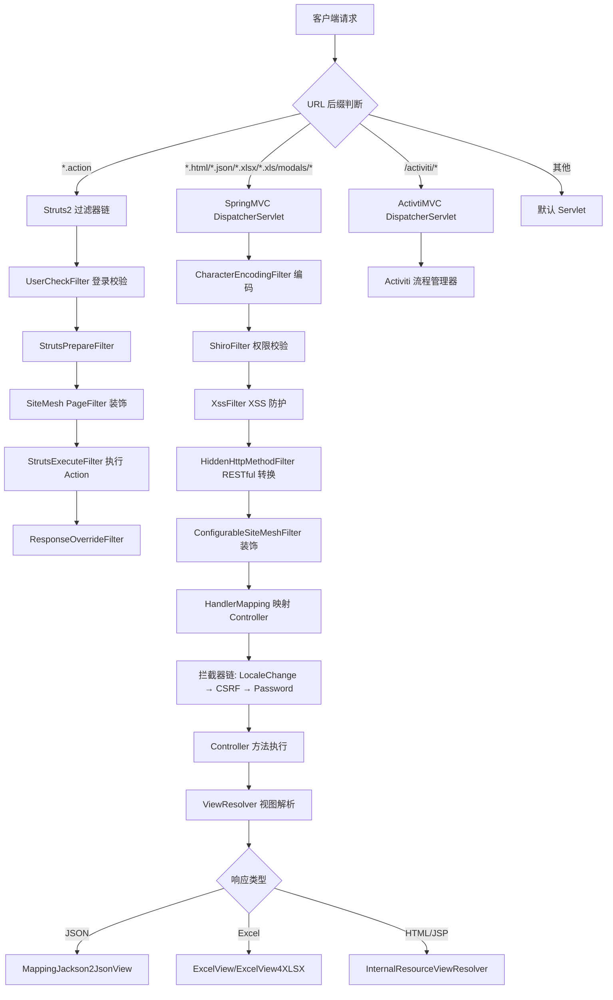
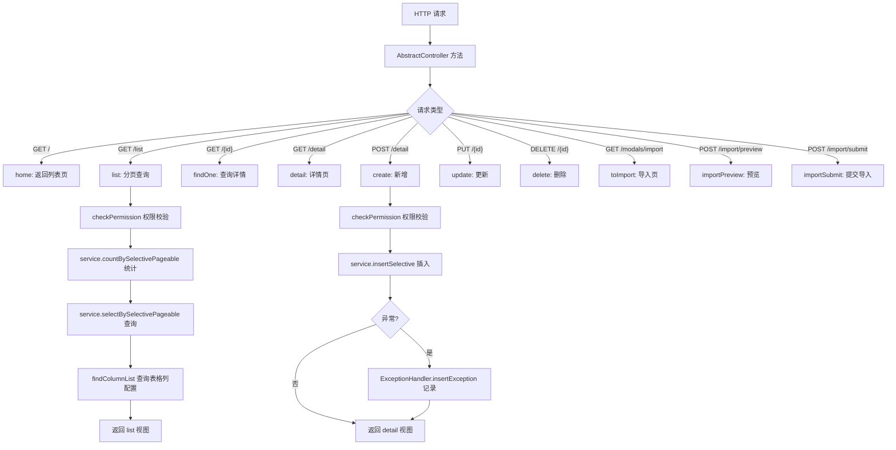
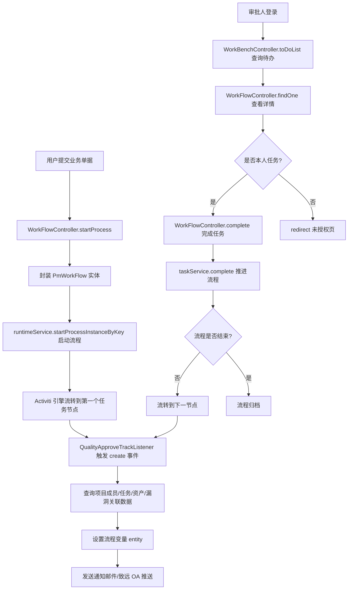
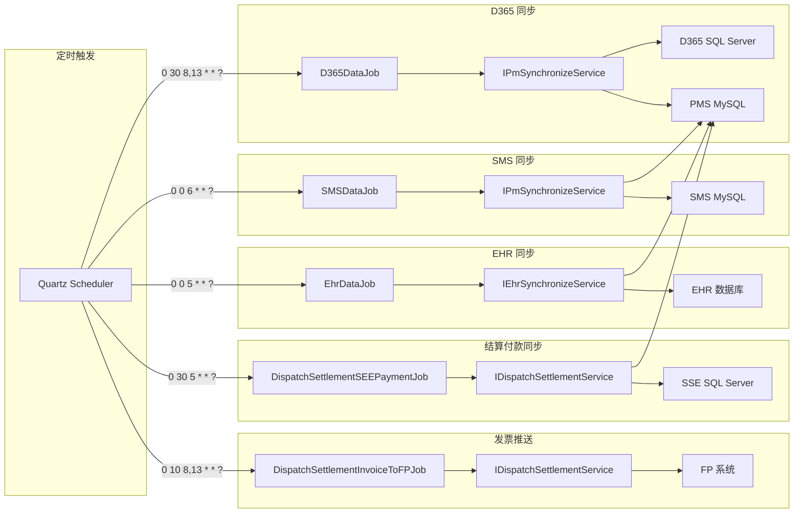
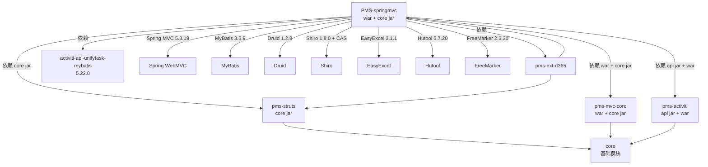

# PMS-springmvc 模块文档

> 本文档对 PMS 项目中的 PMS-springmvc 模块进行完整的功能梳理，覆盖模块定位、包结构、核心类、Spring MVC 配置、Profile 机制、业务流程、模块依赖、接口清单、异常处理及避坑指南。

---

## 1. 模块概述

- **模块名称**：`PMS-springmvc`（Maven artifactId：`pms-springmvc`）
- **模块定位**：PMS 系统中较新的 Web 表现层模块，基于 Spring MVC 5.3.19 实现，承载项目管理（PM）、安服管理（AF）、工作流（Workflow）等核心业务的前后端交互。与遗留的 PMS-struts（Struts2）模块并存，逐步替代 Struts2 Action。
- **核心职责**：
  - 提供基于 `@Controller` 注解的 RESTful 风格接口，URL 后缀包括 `.html`、`.json`、`.xlsx`、`.xls` 以及 `/modals/*` 路径
  - 实现项目管理（项目立项、转包、结算、日报）、行业资产管理、行业漏洞管理、用户管理、工作流审批等业务功能
  - 通过 `AbstractController` 泛型基类封装统一的 CRUD、列表分页、详情、导入预览/提交等通用操作
  - 集成 Activiti 5.23.0 工作流引擎，处理质量审批跟踪、分包检验等审批流程
  - 通过 Quartz 定时任务与外部系统（D365、SMS、EHR、SSE）进行数据同步
- **技术栈**：
  - Web 层：Spring MVC 5.3.19（`spring-webmvc`）
  - ORM：MyBatis 3.5.9（新模块） + iBATIS（遗留 `spring-pms.xml` 中保留 `sqlMapClient`）
  - 数据库：MySQL 8.0.16（主库 `dppms_d365`）、SQL Server（D365/SAP/SSE 外部数据源）
  - 连接池：Druid 1.2.8（多数据源通过 `RoutingDataSource` 路由）
  - 安全：Shiro 1.8.0 + CAS 3.2.2（单点登录）
  - 工作流：Activiti 5.23.0（通过 `pms-activiti` 模块集成）
  - Excel：阿里 EasyExcel 3.1.1
  - 工具库：Hutool 5.7.20、Apache Commons、Fastjson
  - 模板：FreeMarker 2.3.30、JSP（InternalResourceViewResolver）
- **JDK 版本**：JDK 1.8（编译参数 `-parameters -Xlint:all`）
- **打包方式**：`war`（同时通过 `maven-jar-plugin` 产出 `core` 分类器 jar 供其他模块复用）

### 与 PMS-struts 的关系

PMS-springmvc 与 PMS-struts 是**并存**的两个 Web 表现层模块：

- PMS-springmvc 通过 `pms-struts` 的 `core` 分类器 jar 依赖复用 PMS-struts 的 Service、DAO、Entity 等核心代码（`pms-struts-${version}-core.jar`）
- `web.xml` 中同时配置了 Struts2 过滤器（处理 `*.action`）和 Spring MVC DispatcherServlet（处理 `*.html`、`*.json`、`*.xlsx`、`*.xls`、`/modals/*`）
- 新业务功能在 PMS-springmvc 中开发，遗留功能仍由 PMS-struts 的 Action 处理
- `StrutsApiController` 提供桥接能力，让 Spring MVC 调用遗留 Struts2 Service（如 `DepartmentManageService`、`BasicDataService`）

---

## 2. 包结构

模块根目录：`d:\常规软件\QoderCode\workspace\PMS\PMS-springmvc\`

```
PMS-springmvc/
├── pom.xml                          # Maven 构建配置（含 pms2/pms3/dev/test/release Profile）
├── src/main/java/
│   └── com/dp/plat/
│       ├── activiti/                # Activiti 工作流扩展
│       │   ├── unifytask/           # 统一任务推送
│       │   │   ├── listener/        # UnifyTaskPushListener（任务推送监听器）
│       │   │   ├── sender/          # UnifyTask2SeeyonSender（推送至致远 OA）
│       │   │   └── vo/              # SeeyonTask
│       │   └── core/handlers/       # MyBatis TypeHandler（Fastjson/Jackson/Object2String）
│       ├── ehr/                     # EHR 人事系统集成
│       │   ├── annotation/          # TreeNodeParam 注解
│       │   ├── constants/           # UrlPrefixConstant
│       │   ├── controller/          # EHRDataController
│       │   ├── dao/                 # EHR 相关 Mapper（8 个）
│       │   ├── entity/              # EHR 实体（Company/Department/Employee 等）
│       │   ├── job/                 # EhrDataJob（定时同步）
│       │   ├── mapping/             # MyBatis XML（与 Java 同目录）
│       │   ├── service/             # EHR Service 接口与实现
│       │   ├── utils/               # TreeNodeUtils
│       │   └── vo/                  # EHR VO（DepartmentVO/EmployeeVO 等）
│       └── pms/                     # PMS 业务核心包
│           ├── aop/                 # AOP 切面
│           │   ├── DispatchSettlementUpdateAspect.java
│           │   └── ProjectManagementAspect.java   # 用户/角色/菜单变更时刷新 Shiro 权限
│           ├── filter/              # 组件扫描过滤器
│           │   ├── ExcludeAdminControllerTypeFilter.java  # 按 system.properties 排除 admin controller
│           │   └── UserCheckFilter.java                   # Struts2 用户登录校验过滤器
│           └── springmvc/           # Spring MVC 业务主包
│               ├── constant/        # ProjectConstant、RoleConstant
│               ├── controller/      # 19 个 Controller（含 AbstractController/BaseController）
│               ├── dao/             # 20 个 MyBatis Mapper 接口
│               ├── entity/          # 19 个实体类
│               ├── excel/           # ExcelAnalysisEventListener（EasyExcel 监听器）
│               ├── job/             # 4 个 Quartz 定时任务
│               ├── listener/        # 3 个 Activiti 任务监听器
│               ├── mapping/         # 20 个 MyBatis XML 映射文件（与 Java 同目录）
│               ├── service/         # 20 个 Service 接口（impl 子包为实现）
│               ├── util/            # DocUtil、ImageUtil、PermissionUtils
│               └── vo/              # 22 个 VO（视图对象）
├── src/main/resources/
│   ├── spring.xml                   # 主 Spring 配置（数据源、import 其他配置）
│   ├── spring-mvc.xml               # Spring MVC 配置（DispatcherServlet 加载）
│   ├── spring-mybatis.xml           # MyBatis 整合配置
│   ├── spring-pms.xml               # 遗留 PMS 配置（iBATIS、多数据源、AOP）
│   ├── spring-activiti.xml          # Activiti 工作流配置
│   ├── spring-shiro-cas.xml         # Shiro + CAS 单点登录配置
│   ├── activiti-context.xml         # Activiti Service Bean（workFlowService）
│   ├── quartz-job.xml               # Quartz 定时任务配置
│   ├── pms-sql-map-config.xml       # iBATIS SQL Map 配置
│   ├── ehcache.xml                  # EhCache 缓存配置
│   ├── logback.xml                  # 日志配置
│   ├── config.properties            # 通用配置
│   ├── system.properties            # 系统参数（代理、admin 排除等）
│   ├── spring-cas.properties        # CAS 参数
│   ├── messages_zh_CN.properties    # 国际化资源
│   ├── jdbc_dev.properties          # dev 环境数据源
│   ├── jdbc_release.properties      # release 环境数据源
│   ├── jdbc_test.properties         # test 环境数据源
│   ├── profiles/                    # Profile 覆盖目录
│   │   ├── dev/                     # 开发环境（spring.xml、jdbc.properties）
│   │   ├── release/                 # 生产环境（spring.xml、quartz-job.xml）
│   │   ├── test/                    # 测试环境（spring.xml）
│   │   ├── pms2/                    # PMS2 构建 Profile（config.properties、system.properties）
│   │   └── pms3/                    # PMS3 构建 Profile（config.properties、system.properties、quartz-job.xml、spring.xml）
│   ├── activiti/                    # BPMN 流程定义文件
│   │   └── QualityApproveTrack_5_254336.bpmn
│   └── dataReport/                  # 数据导出 SQL 脚本
├── src/main/webapp/
│   ├── WEB-INF/
│   │   ├── web.xml                  # Web 应用部署描述符
│   │   ├── jsp/                     # JSP 视图（按业务模块组织）
│   │   │   ├── dailyReport/         # 日报
│   │   │   ├── dispatch/            # 外派
│   │   │   ├── industry/            # 行业资产/漏洞
│   │   │   ├── project/             # 项目管理
│   │   │   ├── settlement/          # 结算
│   │   │   ├── template/            # 通用模板（list/detail/import/vue 组件）
│   │   │   ├── user/                # 用户管理
│   │   │   └── workflow/            # 工作流
│   │   └── lib/                     # pms-struts-0.0.1-core.jar（system 作用域依赖）
│   ├── common/header.jsp
│   ├── static/pm/js/                # 前端 JS（initComm/router/tab-init/vue-form-component）
│   └── index.jsp                    # 欢迎页
└── logs/                            # 日志输出目录（按日期分文件夹）
```

### 基础包说明

| 包 | 职责 |
|----|------|
| `com.dp.plat.pms.springmvc.controller` | Spring MVC 控制器层，19 个 Controller 类 |
| `com.dp.plat.pms.springmvc.service` | Service 接口层，20 个接口（实现类在 `impl` 子包） |
| `com.dp.plat.pms.springmvc.dao` | MyBatis Mapper 接口层，20 个 Mapper |
| `com.dp.plat.pms.springmvc.entity` | 数据库实体类，19 个 |
| `com.dp.plat.pms.springmvc.vo` | 视图对象，22 个 |
| `com.dp.plat.pms.springmvc.mapping` | MyBatis XML 映射文件，20 个（与 Java 同目录） |
| `com.dp.plat.pms.springmvc.constant` | 常量定义（ProjectConstant、RoleConstant） |
| `com.dp.plat.pms.springmvc.job` | Quartz 定时任务，4 个 |
| `com.dp.plat.pms.springmvc.listener` | Activiti 任务监听器，3 个 |
| `com.dp.plat.pms.springmvc.util` | 工具类（DocUtil、ImageUtil、PermissionUtils） |
| `com.dp.plat.pms.springmvc.excel` | EasyExcel 监听器 |
| `com.dp.plat.pms.aop` | AOP 切面（权限刷新、结算更新） |
| `com.dp.plat.pms.filter` | 过滤器（admin 排除、用户校验） |
| `com.dp.plat.ehr.*` | EHR 人事系统集成（独立子模块） |
| `com.dp.plat.activiti.unifytask.*` | Activiti 统一任务推送（致远 OA 集成） |
| `com.dp.plat.core.handlers` | MyBatis TypeHandler（JSON 类型处理） |

---

## 3. 核心类清单

### 3.1 Controller 层（19 个）

| 类名 | 完整路径 | @RequestMapping | 职责 |
|------|----------|-----------------|------|
| `AbstractController` | `com.dp.plat.pms.springmvc.controller.AbstractController` | - | 泛型控制器基类，封装通用 CRUD/列表/详情/导入 |
| `BaseController` | `com.dp.plat.pms.springmvc.controller.BaseController` | - | 控制器基类，提供字段/列/Tab 查询能力 |
| `ProjectController` | `com.dp.plat.pms.springmvc.controller.ProjectController` | `/pm/project` | 项目管理（立项、查询、转换、SMS 同步） |
| `ProjectTaskController` | `com.dp.plat.pms.springmvc.controller.ProjectTaskController` | `/pm/project/task` | 项目任务管理 |
| `ProjectMemberController` | `com.dp.plat.pms.springmvc.controller.ProjectMemberController` | `/pm/member` | 项目成员管理 |
| `ProjectManageUserController` | `com.dp.plat.pms.springmvc.controller.ProjectManageUserController` | `/pm/user` | 项目用户管理（含 Shiro 权限刷新） |
| `ProjectAssetController` | `com.dp.plat.pms.springmvc.controller.ProjectAssetController` | `/pm/project/asset` | 项目资产关联 |
| `ProjectAssetLeakController` | `com.dp.plat.pms.springmvc.controller.ProjectAssetLeakController` | `/pm/asset/leak` | 项目资产漏洞关联 |
| `DispatchProjectController` | `com.dp.plat.pms.springmvc.controller.DispatchProjectController` | `/pm/dispatch` | 外派项目管理（含提交、付款、生成单号） |
| `DispatchSettlementController` | `com.dp.plat.pms.springmvc.controller.DispatchSettlementController` | `/pm/settlement` | 外派结算管理（含发票、付款同步） |
| `DailyReportController` | `com.dp.plat.pms.springmvc.controller.DailyReportController` | `/pm/daily/report` | 日报管理 |
| `FacilitatorController` | `com.dp.plat.pms.springmvc.controller.FacilitatorController` | `/pm/facilitator` | 服务商管理 |
| `CommonRelatedDataController` | `com.dp.plat.pms.springmvc.controller.CommonRelatedDataController` | `/pm/common/related` | 通用关联数据管理 |
| `IndustryAssetController` | `com.dp.plat.pms.springmvc.controller.IndustryAssetController` | `/af/industry/asset` | 行业资产管理 |
| `IndustryLeakController` | `com.dp.plat.pms.springmvc.controller.IndustryLeakController` | `/af/industry/leak` | 行业漏洞管理 |
| `IndustryLeakWarningController` | `com.dp.plat.pms.springmvc.controller.IndustryLeakWarningController` | `/af/industry/warning` | 行业漏洞预警管理 |
| `WorkFlowController` | `com.dp.plat.pms.springmvc.controller.WorkFlowController` | `/workflow` | 工作流审批（启动/完成/撤回/批量） |
| `WorkBenchController` | `com.dp.plat.pms.springmvc.controller.WorkBenchController` | `/workflow/workbench` | 工作流工作台（待办/已办/他人任务） |
| `StrutsApiController` | `com.dp.plat.pms.springmvc.controller.StrutsApiController` | `/api` | 桥接遗留 Struts2 Service 的 API |

### 3.2 Service 层（20 个接口）

| 接口名 | 完整路径 | 继承 | 职责 |
|--------|----------|------|------|
| `IProjectService` | `com.dp.plat.pms.springmvc.service.IProjectService` | `IAbstractBaseService<Project>` | 项目管理 |
| `IProjectTaskService` | `com.dp.plat.pms.springmvc.service.IProjectTaskService` | `IAbstractBaseService<ProjectTask>` | 项目任务 |
| `IProjectMemberService` | `com.dp.plat.pms.springmvc.service.IProjectMemberService` | `IAbstractBaseService<ProjectMember>` | 项目成员 |
| `IProjectHeaderService` | `com.dp.plat.pms.springmvc.service.IProjectHeaderService` | `ProjectService` | 项目头信息（继承遗留 ProjectService） |
| `IProjectManageUserService` | `com.dp.plat.pms.springmvc.service.IProjectManageUserService` | `IUserService` | 项目用户管理（继承遗留 IUserService） |
| `IDispatchProjectService` | `com.dp.plat.pms.springmvc.service.IDispatchProjectService` | `IAbstractBaseService<DispatchProject>` | 外派项目 |
| `IDispatchSettlementService` | `com.dp.plat.pms.springmvc.service.IDispatchSettlementService` | `IAbstractBaseService<DispatchSettlement>` | 外派结算 |
| `IDailyReportService` | `com.dp.plat.pms.springmvc.service.IDailyReportService` | `IAbstractBaseService<DailyReport>` | 日报 |
| `IFacilitatorService` | `com.dp.plat.pms.springmvc.service.IFacilitatorService` | `IAbstractBaseService<Facilitator>` | 服务商 |
| `ICommonRelatedDataService` | `com.dp.plat.pms.springmvc.service.ICommonRelatedDataService` | `IExcelAnalysisService<CommonRelatedData>` | 通用关联数据（支持 Excel 导入） |
| `IIndustryAssetService` | `com.dp.plat.pms.springmvc.service.IIndustryAssetService` | `IExcelAnalysisService<IndustryAsset>` | 行业资产（支持 Excel 导入） |
| `IIndustryLeakService` | `com.dp.plat.pms.springmvc.service.IIndustryLeakService` | `IAbstractBaseService<IndustryLeak>` | 行业漏洞 |
| `IIndustryLeakWarningService` | `com.dp.plat.pms.springmvc.service.IIndustryLeakWarningService` | `IAbstractBaseService<IndustryLeakWarning>` | 行业漏洞预警 |
| `IIndustryAssetLeakRelationService` | `com.dp.plat.pms.springmvc.service.IIndustryAssetLeakRelationService` | `IAbstractBaseService<IndustryAssetLeakRelation>` | 资产漏洞关联 |
| `IIndustryAssetProjectRelationService` | `com.dp.plat.pms.springmvc.service.IIndustryAssetProjectRelationService` | `IAbstractBaseService<IndustryAssetProjectRelation>` | 资产项目关联 |
| `IPmWorkFlowService` | `com.dp.plat.pms.springmvc.service.IPmWorkFlowService` | `IAbstractBaseService<PmWorkFlow>` | 工作流业务 |
| `IPmWorkBenchService` | `com.dp.plat.pms.springmvc.service.IPmWorkBenchService` | - | 工作流工作台（无基类） |
| `IDataFieldRelationService` | `com.dp.plat.pms.springmvc.service.IDataFieldRelationService` | `IAbstractBaseService<DataFieldRelation>` | 字段配置关系 |
| `IExcelAnalysisService` | `com.dp.plat.pms.springmvc.service.IExcelAnalysisService<T>` | `IAbstractBaseService<T>` | Excel 导入分析通用接口 |
| `IPmSynchronizeService` | `com.dp.plat.pms.springmvc.service.IPmSynchronizeService` | `ISynchronizeService` | 数据同步（D365/SMS） |

### 3.3 DAO 层（20 个 Mapper）

| Mapper 接口 | 实体 | 继承 |
|-------------|------|------|
| `ProjectMapper` | `Project` | `AbstractBaseMapper<Project>` |
| `ProjectTaskMapper` | `ProjectTask` | `AbstractBaseMapper<ProjectTask>` |
| `ProjectMemberMapper` | `ProjectMember` | `AbstractBaseMapper<ProjectMember>` |
| `ProjectHeaderMapper` | `ProjectHeader` | `AbstractBaseMapper<ProjectHeader>` |
| `ProjectManageUserMapper` | - | -（自定义接口） |
| `DispatchProjectMapper` | `DispatchProject` | `AbstractBaseMapper<DispatchProject>` |
| `DispatchSettlementMapper` | `DispatchSettlement` | `AbstractBaseMapper<DispatchSettlement>` |
| `DailyReportMapper` | `DailyReport` | `AbstractBaseMapper<DailyReport>` |
| `FacilitatorMapper` | `Facilitator` | `AbstractBaseMapper<Facilitator>` |
| `CommonRelatedDataMapper` | `CommonRelatedData` | `AbstractBaseMapper<CommonRelatedData>` |
| `IndustryAssetMapper` | `IndustryAsset` | `AbstractBaseMapper<IndustryAsset>` |
| `IndustryLeakMapper` | `IndustryLeak` | `AbstractBaseMapper<IndustryLeak>` |
| `IndustryLeakWarningMapper` | `IndustryLeakWarning` | `AbstractBaseMapper<IndustryLeakWarning>` |
| `IndustryAssetLeakRelationMapper` | `IndustryAssetLeakRelation` | `AbstractBaseMapper<IndustryAssetLeakRelation>` |
| `IndustryAssetProjectRelationMapper` | `IndustryAssetProjectRelation` | `AbstractBaseMapper<IndustryAssetProjectRelation>` |
| `PmWorkFlowMapper` | `PmWorkFlow` | `AbstractBaseMapper<PmWorkFlow>` |
| `PmWorkBenchMapper` | - | -（自定义接口） |
| `DataFieldRelationMapper` | `DataFieldRelation` | `AbstractBaseMapper<DataFieldRelation>` |
| `ExcelAnalysisMapper` | - | -（Excel 临时表分析） |
| `PmSynchronizeMapper` | - | -（数据同步） |

### 3.4 其他核心类

| 类名 | 完整路径 | 职责 |
|------|----------|------|
| `ProjectConstant` | `com.dp.plat.pms.springmvc.constant.ProjectConstant` | 业务常量（URL 路径、项目类型、流程类型、成员角色） |
| `RoleConstant` | `com.dp.plat.pms.springmvc.constant.RoleConstant` | 角色常量（PM_ADMIN、PM_SUB_ADMIN、FINANCIAL_AP 等） |
| `ProjectManagementAspect` | `com.dp.plat.pms.aop.ProjectManagementAspect` | 用户/角色/菜单变更时刷新 Shiro 权限拦截链 |
| `DispatchSettlementUpdateAspect` | `com.dp.plat.pms.aop.DispatchSettlementUpdateAspect` | 结算更新切面 |
| `ExcludeAdminControllerTypeFilter` | `com.dp.plat.pms.filter.ExcludeAdminControllerTypeFilter` | 按 `system.properties` 配置排除 admin controller 的组件扫描过滤器 |
| `UserCheckFilter` | `com.dp.plat.pms.filter.UserCheckFilter` | Struts2 `*.action` 请求的用户登录校验过滤器 |
| `QualityApproveTrackListener` | `com.dp.plat.pms.springmvc.listener.QualityApproveTrackListener` | 质量审批跟踪流程任务监听器 |
| `QualityApproveTrackListener2` | `com.dp.plat.pms.springmvc.listener.QualityApproveTrackListener2` | 质量审批跟踪流程任务监听器（V2） |
| `SubcontractInspectionListener` | `com.dp.plat.pms.springmvc.listener.SubcontractInspectionListener` | 分包检验流程任务监听器 |
| `D365DataJob` | `com.dp.plat.pms.springmvc.job.D365DataJob` | D365 数据全量同步定时任务 |
| `SMSDataJob` | `com.dp.plat.pms.springmvc.job.SMSDataJob` | SMS 数据同步定时任务 |
| `DispatchSettlementInvoiceToFPJob` | `com.dp.plat.pms.springmvc.job.DispatchSettlementInvoiceToFPJob` | 结算发票推送 FP 定时任务 |
| `DispatchSettlementSEEPaymentJob` | `com.dp.plat.pms.springmvc.job.DispatchSettlementSEEPaymentJob` | 结算 SSE 付款同步定时任务 |
| `ExcelAnalysisEventListener` | `com.dp.plat.pms.springmvc.excel.ExcelAnalysisEventListener` | EasyExcel 分析监听器 |
| `DocUtil` | `com.dp.plat.pms.springmvc.util.DocUtil` | 文档生成工具 |
| `PermissionUtils` | `com.dp.plat.pms.springmvc.util.PermissionUtils` | 权限工具 |
| `FastjsonTypeHandler` | `com.dp.plat.core.handlers.FastjsonTypeHandler` | MyBatis JSON 类型处理器（Fastjson） |

---

## 4. Spring MVC 配置

### 4.1 配置文件清单

| 配置文件 | 位置 | 加载方式 | 职责 |
|----------|------|----------|------|
| `web.xml` | `src/main/webapp/WEB-INF/` | Servlet 容器 | 部署描述符，配置 DispatcherServlet、过滤器、监听器 |
| `spring-mvc.xml` | `src/main/resources/` | DispatcherServlet 初始化 | Spring MVC 配置（组件扫描、视图解析、拦截器、文件上传） |
| `spring.xml` | `src/main/resources/` | `ContextLoaderListener` | 主 Spring 容器配置（数据源、import 子配置） |
| `spring-mybatis.xml` | `src/main/resources/` | `spring.xml` import | MyBatis 整合（SqlSessionFactory、Mapper 扫描、事务） |
| `spring-pms.xml` | `src/main/resources/` | `spring.xml` import | 遗留 PMS 配置（iBATIS、多数据源、AOP 性能拦截） |
| `spring-activiti.xml` | `src/main/resources/` | `spring.xml` import | Activiti 流程引擎配置 |
| `spring-shiro-cas.xml` | `src/main/resources/` | `spring.xml` import（注释） | Shiro + CAS 单点登录配置 |
| `activiti-context.xml` | `src/main/resources/` | `spring-pms.xml` import | Activiti Service Bean（workFlowService） |
| `quartz-job.xml` | `src/main/resources/` | `spring.xml` import | Quartz 定时任务配置 |
| `pms-sql-map-config.xml` | `src/main/resources/` | `spring-pms.xml` 引用 | iBATIS SQL Map 配置 |

### 4.2 DispatcherServlet 配置

`web.xml` 中配置了两个 DispatcherServlet：

**SpringMVC**（主 Servlet，`load-on-startup=1`）：
- 配置文件：`classpath:spring-mvc.xml`
- URL 映射：`*.html`、`*.json`、`*.xlsx`、`*.xls`、`/modals/*`
- 支持异步：`async-supported=true`

**ActivtiMVC**（Activiti 专用 Servlet，`load-on-startup=-99`）：
- 配置文件：`classpath:spring-activiti-mvc.xml`（来自 pms-activiti war 依赖）
- URL 映射：`/activiti/*`
- 用于 Activiti 流程管理器自带的前端控制器

### 4.3 组件扫描

`spring-mvc.xml` 第 43-47 行配置：

```xml
<context:component-scan base-package="com.dp.plat">
    <context:exclude-filter type="assignable" expression="com.dp.plat.activiti.controller.*" />
    <context:exclude-filter type="custom" expression="com.dp.plat.pms.filter.ExcludeAdminControllerTypeFilter" />
</context:component-scan>
```

- 扫描基础包：`com.dp.plat`（覆盖 springmvc、ehr、activiti、core 等）
- 排除 `com.dp.plat.activiti.controller.*`（由 ActivtiMVC Servlet 处理）
- 通过自定义 `ExcludeAdminControllerTypeFilter` 按 `system.properties` 中的 `sys.admin.exclude` 开关排除 admin controller（pms3 Profile 下启用）

`spring-mybatis.xml` 第 16-18 行配置：

```xml
<context:component-scan base-package="com.dp.plat" />
```

- Service 层组件扫描（与 MVC 层共享父容器）

### 4.4 拦截器链

`spring-mvc.xml` 配置了 3 个 MVC 拦截器（按顺序执行）：

| 顺序 | 拦截器 | 路径 | 排除路径 | 职责 |
|------|--------|------|----------|------|
| 1 | `LocaleChangeInterceptor` | `/**` | - | 国际化语言切换（参数名 `lang`） |
| 2 | `CsrfInterceptor` | `/**` | `/sys/login.json` | CSRF 防护 |
| 3 | `PasswordInterceptor` | `/**` | `/password.*`、`/modifyPassword.*` | 强制修改密码（重定向到 `/password.html?needChangePwd=true`） |

`web.xml` 中还配置了以下过滤器（按顺序）：

| 顺序 | 过滤器 | URL 模式 | 职责 |
|------|--------|----------|------|
| 1 | `CharacterEncodingFilter` | `/*` | UTF-8 编码 |
| 2 | `UserCheckFilter` | `*.action` | Struts2 用户登录校验 |
| 3 | `StrutsPrepareFilter` | `*.action` | Struts2 准备过滤器 |
| 4 | `PageFilter`（SiteMesh） | `*.action` | 页面装饰 |
| 5 | `StrutsExecuteFilter` | `*.action` | Struts2 执行过滤器 |
| 6 | `StrutsPrepareAndExecuteFilter` | `*.action` | Struts2 主过滤器 |
| 7 | `ResponseOverrideFilter` | `*.action`、`*.jsp` | DisplayTag 响应覆盖 |
| 8 | `shiroFilter` | `*.html`、`*.json`、`*.xlsx`、`*.xls`、`/modals/*` | Shiro 权限过滤 |
| 9 | `XssFilter` | `*.html`、`*.json`、`*.xlsx`、`*.xls`、`/modals/*` | XSS 防护 |
| 10 | `ConfigurableSiteMeshFilter` | `*.html` | SpringMVC 页面装饰 |
| 11 | `HiddenHttpMethodFilter` | ServletName=SpringMVC | RESTful HTTP 方法转换 |

### 4.5 视图解析

`spring-mvc.xml` 配置了 `ContentNegotiatingViewResolver`（优先级 1），支持根据请求后缀/参数选择视图：

- **ContentNegotiationManager** 配置：
  - 默认 MIME 类型：`text/html`
  - 忽略 Accept Header
  - 支持路径扩展名识别（`favorPathExtension=true`）
  - 支持参数识别（`favorParameter=true`，参数名 `type`）
  - 媒体类型映射：`html→text/html`、`json→application/json`、`excel→application/vnd.openxmlformats-officedocument.spreadsheetml.sheet`

- **视图解析器链**：
  1. `BeanNameViewResolver`（按 bean 名称查找视图）
  2. `InternalResourceViewResolver`（JSP 视图，前缀 `/WEB-INF/jsp/`，后缀 `.jsp`）

- **默认候选视图**：
  - `MappingJackson2JsonView`（JSON 输出）
  - `ExcelView`（XLS 导出）
  - `ExcelView4XLSX`（XLSX 导出）

### 4.6 其他 MVC 配置

- **注解驱动**：`<mvc:annotation-driven enable-matrix-variables="true" conversion-service="conversionService">`
  - 自定义转换器：`DateConverter`（日期）、`DecimalConverter`（货币）
  - JSON 转换器：`MappingJackson2HttpMessageConverter`
  - 路径匹配：`suffix-pattern=true`（支持后缀模式匹配）
- **静态资源**：`<mvc:default-servlet-handler />`（交给默认 Servlet 处理）
- **文件上传**：`CommonsMultipartResolver`（默认编码 UTF-8，最大上传 10485760000 字节，内存最大 40960 字节）
- **国际化**：`ReloadableResourceBundleMessageSource`（basename `classpath:messages`）
- **异常处理**：`ExceptionHandler`（`com.dp.plat.core.exception.exceptionHandler.ExceptionHandler`）
- **Shiro 注解**：通过 `DefaultAdvisorAutoProxyCreator` + `AuthorizationAttributeSourceAdvisor` 启用 `@RequiresRoles`、`@RequiresPermissions`
- **AOP**：`<aop:aspectj-autoproxy/>`（支持 `@Aspect` 注解切面）

### 4.7 数据源与多数据源路由

`spring.xml` 配置了 6 个数据源，通过 `RoutingDataSource`（`com.dp.plat.core.config.RoutingDataSource`）路由：

| 数据源 Bean | 用途 | 连接池 |
|-------------|------|--------|
| `dataSourceLocal` | 本地数据库 | Druid |
| `dataSourcePMS` | PMS 主数据库 | Druid |
| `dataSourceSMS` | SMS 系统 | DriverManagerDataSource |
| `dataSourceEHR` | EHR 人事系统 | Druid |
| `dataSourceD365` | D365 系统 | Druid |
| `dataSourceCRM` | CRM 系统 | - |

`spring-pms.xml` 中还配置了 iBATIS 专用的 `dataSourceSAP`、`dataSourceSSE`，通过 `SqlMapClientTemplate` 访问。

---

## 5. Profile 机制

### 5.1 Profile 分类

PMS-springmvc 的 Profile 分为两个维度：

**构建 Profile**（决定 `finalName` 和资源覆盖）：

| Profile ID | `profile.build.id` | `profile.build.name`（finalName） | 默认激活 |
|------------|---------------------|-----------------------------------|----------|
| `pms2` | `pms2` | `PMS2` | 是（`activeByDefault=true`） |
| `pms3` | `pms3` | `AFPMS3` | 否 |

**环境 Profile**（决定数据源配置）：

| Profile ID | `env` | 默认激活 |
|------------|-------|----------|
| `dev` | `dev` | 是（`activeByDefault=true`） |
| `release` | `release` | 否 |
| `test` | `test` | 否 |

### 5.2 资源覆盖机制

`pom.xml` 的 `<resources>` 配置三层资源覆盖（后者覆盖前者）：

1. `src/main/resources/`（排除 `profiles/**`）
2. `src/main/resources/profiles/${env}/`（环境配置）
3. `src/main/resources/profiles/${profile.build.id}/`（构建配置）

构建示例：
- `mvn clean package` → 默认 `pms2` + `dev`，输出 `PMS2.war`
- `mvn clean package -P pms3,release` → `pms3` + `release`，输出 `AFPMS3.war`

### 5.3 pms2 vs pms3 差异

通过对比 `profiles/pms2/` 与 `profiles/pms3/` 下的配置文件：

**`system.properties` 差异**：

| 配置项 | pms2 | pms3 | 说明 |
|--------|------|------|------|
| `sys.has.proxy` | `false` | `true` | pms3 启用代理（影响 URL 构造） |
| `sys.admin.exclude` | `false` | `true` | pms3 排除 admin controller（通过 `ExcludeAdminControllerTypeFilter`） |

**`config.properties` 差异**：

| 配置项 | pms2 | pms3 | 说明 |
|--------|------|------|------|
| `sys.upload.server.name` | `pms2` | `pms3` | 多机部署时的服务名标识 |

**pms3 独有文件**：
- `profiles/pms3/spring.xml`（覆盖主 `spring.xml`）
- `profiles/pms3/quartz-job.xml`（覆盖主 `quartz-job.xml`）

**pms2 独有文件**：
- 仅 `config.properties` 和 `system.properties`

### 5.4 admin controller 排除机制

`ExcludeAdminControllerTypeFilter`（`com.dp.plat.pms.filter`）在组件扫描时根据 `system.properties` 的 `sys.admin.exclude` 开关决定是否排除匹配正则 `.*.admin.*?(?<!UserController)$` 的 Controller 类（保留 `UserController`）。pms3 Profile 下此开关为 `true`，用于在生产环境屏蔽管理类接口。

---

## 6. 业务流程

### 6.1 请求处理总流程



### 6.2 通用 CRUD 流程（AbstractController）



### 6.3 工作流审批流程



### 6.4 数据同步流程（Quartz 定时任务）



> 注：`quartz-job.xml` 中 `startQuertz` 的 `triggers` 列表当前为空（被注释），定时任务默认不启动，需手动启用。

---

## 7. 模块间依赖关系

### 7.1 Maven 依赖图



### 7.2 依赖说明

| 依赖 | 类型 | 用途 | 排除项 |
|------|------|------|--------|
| `pms-struts` (core jar) | jar | 复用 PMS-struts 的 Service/DAO/Entity 核心代码 | mybatis、slf4j-api、activiti-api-unifytask-patch、hutool |
| `pms-mvc-core` (war + core jar) | war + jar | MVC 核心基础（含 web.xml 合并） | mybatis |
| `pms-activiti` (api jar + war) | jar + war | Activiti 工作流集成 | mybatis |
| `pms-ext-d365` | jar | D365 系统集成扩展 | - |
| `activiti-api-unifytask-mybatis` | jar | 统一任务推送 MyBatis 适配 | org.activiti.* |
| `spring-webmvc` | jar | Spring MVC 框架 | - |
| `mybatis` | jar | ORM 框架 | - |
| `druid` | jar | 数据库连接池 | - |
| `shiro-core/web/ehcache/spring/cas` | jar | 安全框架 + 单点登录 | slf4j-api |
| `easyexcel` | jar | Excel 导入导出 | cglib、poi-ooxml-schemas |
| `hutool-core/http` | jar | 工具库 | - |
| `freemarker` | jar | 模板引擎 | - |
| `MyBatisGenerator` | jar (test) | 测试用代码生成器 | freemarker |

### 7.3 与其他模块的协作

- **与 core 模块**：通过 `pms-struts-core.jar` 间接依赖 core，复用 `IAbstractBaseService`、`AbstractBaseMapper`、`Result`、`PageParam`、`UserContext`、`HttpContext`、`ExceptionHandler`、`Consts` 等基础类
- **与 PMS-struts 模块**：复用遗留 Service（如 `ProjectService`、`ProjectPlanService`、`DepartmentManageService`、`BasicDataService`），通过 `StrutsApiController` 桥接调用
- **与 PMS-activiti 模块**：通过 `IProcessService`、`RuntimePageService` 调用工作流能力，使用 `TaskService`、`RuntimeService`、`HistoryService` 直接操作 Activiti 引擎
- **与 pms-ext-d365 模块**：依赖 D365 扩展，用于 D365 数据同步
- **与 pms-ext-fp 模块**：通过 `DispatchSettlementInvoiceToFPJob` 推送发票到 FP 系统

---

## 8. 接口清单

### 8.1 项目管理（ProjectController，`/pm/project`）

| 方法 | 路径 | HTTP | 功能 |
|------|------|------|------|
| `home` | `/pm/project` | GET | 项目管理首页 |
| `list` | `/pm/project/list` | GET | 项目分页列表 |
| `findOne` | `/pm/project/{id}` | GET | 查询单个项目 |
| `detail` | `/pm/project/detail` | GET | 项目详情页 |
| `create` | `/pm/project/detail` | POST | 新增项目 |
| `update` | `/pm/project/{id}` | PUT | 更新项目 |
| `delete` | `/pm/project/{id}` | DELETE | 删除项目 |
| `transform` | `/pm/project/{id}/transform/{type}` | GET | 项目类型转换页 |
| `transformSubmit` | `/pm/project/{id}/transform/{type}` | POST | 提交项目类型转换 |
| `orderDetail` | `/pm/project/{ids}/orderDetail` | GET | 订单详情 |
| `orderDetailList` | `/pm/project/orderDetail` | GET | 订单详情列表 |
| `productInfo` | `/pm/project/productInfo` | GET | 产品信息 |
| `syncSMSData` | `/pm/project/syncSMSData` | GET | 同步 SMS 数据 |

### 8.2 工作流（WorkFlowController，`/workflow`）

| 方法 | 路径 | HTTP | 功能 |
|------|------|------|------|
| `home` | `/workflow` | GET | 工作流首页 |
| `list` | `/workflow/list` | GET | 工作流分页列表 |
| `infoList` | `/workflow/info/list` | GET | 流程活动信息列表 |
| `findOne` | `/workflow/{id}` | GET | 查询工作流详情 |
| `findTask` | `/workflow/task/{taskId}` | GET | 查询任务详情 |
| `checkTask` | `/workflow/task/{taskId}/check` | GET | 校验任务 |
| `complete` | `/workflow/complete/{taskId}` | POST | 完成任务 |
| `completeBatch` | `/workflow/complete/batch` | POST | 批量完成任务 |
| `evaluateBatch` | `/workflow/evaluate/batch` | POST | 批量评价 |
| `closeProcess` | `/workflow/test/closeProcess` | GET | 测试关闭流程 |
| `withdraw` | `/workflow/withdraw/{instanceId}/{userId}` | POST | 撤回流程 |
| `startProcess` | `/workflow/startProcess` | POST | 启动流程 |
| `completeByKey` | `/workflow/{processKey}/complete/{taskId}` | POST | 按流程 Key 完成任务 |
| `revokeProcess` | `/workflow/{id}/revokeProcess` | POST | 撤销流程 |

### 8.3 工作台（WorkBenchController，`/workflow/workbench`）

| 方法 | 路径 | HTTP | 功能 |
|------|------|------|------|
| `listView` | `/workflow/workbench` | GET | 工作台首页 |
| `listToDoTask` | `/workflow/workbench/toDoList` | GET | 我的待办 |
| `listOthersTask` | `/workflow/workbench/listOthersTask` | GET | 他人待办 |
| `finishedTaskList` | `/workflow/workbench/finishedTaskList` | GET | 已办列表 |

### 8.4 外派项目（DispatchProjectController，`/pm/dispatch`）

| 方法 | 路径 | HTTP | 功能 |
|------|------|------|------|
| `list` | `/pm/dispatch/list` | GET | 外派项目列表 |
| `findOne` | `/pm/dispatch/{id}` | GET | 查询外派项目 |
| `detail` | `/pm/dispatch/detail` | GET | 外派详情页 |
| `create` | `/pm/dispatch/detail` | POST | 新增外派 |
| `update` | `/pm/dispatch/{id}` | PUT | 更新外派 |
| `delete` | `/pm/dispatch/{id}` | DELETE | 删除外派 |
| `submit` | `/pm/dispatch/submit` | POST | 提交外派 |
| `payment` | `/pm/dispatch/modals/payment` | GET | 付款弹窗 |
| `generateDispatchSeq` | `/pm/dispatch/generateDispatchSeq` | GET | 生成外派单号 |
| `multiDimInfos` | `/pm/dispatch/{id}/multiDimInfos` | GET | 多维信息 |
| `listWithSettleInfo` | `/pm/dispatch/listWithSettleInfo` | GET | 带结算信息的列表 |

### 8.5 外派结算（DispatchSettlementController，`/pm/settlement`）

| 方法 | 路径 | HTTP | 功能 |
|------|------|------|------|
| `list` | `/pm/settlement/list` | GET | 结算列表 |
| `findOne` | `/pm/settlement/{id}` | GET | 查询结算 |
| `detail` | `/pm/settlement/detail` | GET | 结算详情页 |
| `create` | `/pm/settlement/detail` | POST | 新增结算 |
| `update` | `/pm/settlement/{id}` | PUT | 更新结算 |
| `submit` | `/pm/settlement/submit` | POST | 提交结算 |
| `delete` | `/pm/settlement/{id}` | DELETE | 删除结算 |
| `invoice` | `/pm/settlement/{id}/invoice` | GET | 发票详情 |
| `verifyInvoice` | `/pm/settlement/{id}/invoice/verify` | GET | 发票核验 |
| `syncPayment` | `/pm/settlement/syncPayment` | GET | 同步付款 |

### 8.6 其他 Controller 接口路径汇总

| Controller | 基础路径 | 主要操作 |
|------------|----------|----------|
| `ProjectTaskController` | `/pm/project/task` | 任务 CRUD、下载 |
| `ProjectMemberController` | `/pm/member` | 成员 CRUD |
| `ProjectManageUserController` | `/pm/user` | 用户 CRUD、角色分配 |
| `ProjectAssetController` | `/pm/project/asset` | 资产关联更新、删除 |
| `ProjectAssetLeakController` | `/pm/asset/leak` | 资产漏洞关联更新、删除 |
| `DailyReportController` | `/pm/daily/report` | 日报 CRUD |
| `FacilitatorController` | `/pm/facilitator` | 服务商删除 |
| `CommonRelatedDataController` | `/pm/common/related` | 通用关联数据 CRUD |
| `IndustryAssetController` | `/af/industry/asset` | 行业资产列表、更新、删除 |
| `IndustryLeakController` | `/af/industry/leak` | 行业漏洞 CRUD |
| `IndustryLeakWarningController` | `/af/industry/warning` | 漏洞预警 CRUD |
| `StrutsApiController` | `/api` | `departmentList`、`companyList`、`basicDataByType` |

### 8.7 通用接口（AbstractController 提供）

继承 `AbstractController` 的子类自动获得以下通用接口（路径前缀为类级 `@RequestMapping`）：

| 方法 | 路径 | HTTP | 功能 |
|------|------|------|------|
| `home` | `/` | GET | 模块首页 |
| `list` | `/list` | GET | 分页列表 |
| `findOne` | `/{id}`、`/modals/{id}` | GET | 查询详情 |
| `detail` | `/detail`、`/modals/detail` | GET | 详情页 |
| `create` | `/detail` | POST | 新增 |
| `update` | `/{id}` | PUT | 更新 |
| `delete` | `/{id}` | DELETE | 删除 |
| `toImport` | `/modals/import` | GET | 导入页 |
| `importPreview` | `/import/preview` | POST | 导入预览 |
| `previewTempTable` | `/previewTempTable` | GET | 预览临时表 |
| `dropTempTable` | `/dropTempTable` | GET | 删除临时表 |
| `importSubmit` | `/import/submit` | POST | 提交导入 |
| `submitTempTable` | `/import/submitTempTable` | POST | 提交临时表数据 |

---

## 9. 异常处理机制

### 9.1 全局异常处理

- **Handler 类**：`com.dp.plat.core.exception.exceptionHandler.ExceptionHandler`（在 `spring-mvc.xml` 第 122 行注册为 `exceptionHandler` bean）
- **核心方法**：`ExceptionHandler.insertException(Exception e)` —— 记录异常到数据库并返回错误 ID
- **使用模式**：Controller 中通过 try-catch 捕获异常，调用 `ExceptionHandler.insertException(e)` 记录，并将错误 ID 和消息放入 Model：

```java
try {
    service.insertSelective((T) v);
} catch (Exception e) {
    status = false;
    Integer errorId = ExceptionHandler.insertException(e);
    model.addAttribute("errorId", errorId);
    message = e.getMessage();
}
model.addAttribute("status", status);
model.addAttribute("message", message);
```

### 9.2 错误页面配置

`web.xml` 配置了 HTTP 错误码到错误页的映射：

| 错误码 | 跳转页面 |
|--------|----------|
| 400 | `/to404.html` |
| 402 | `/to404.html` |
| 404 | `/to404.html` |
| 405 | `/to404.html` |
| 500 | `/to500.html` |
| 默认 | `/404.html` |

### 9.3 权限异常

- Controller 层通过 `checkPermission(V v, Model model, String... permissions)` 方法校验权限
- 权限不足时返回 `Consts.VIEW_UNAUTHORIZED`（未授权视图），并设置 `status=false`、`message="没有权限进行该操作！"`
- Shiro 注解（`@RequiresRoles`、`@RequiresPermissions`）通过 `AuthorizationAttributeSourceAdvisor` 启用，未授权时抛出 `AuthorizationException`

### 9.4 Activiti 工作流异常

`WorkFlowController` 中捕获 `ActivitiException`、`ActivitiObjectNotFoundException`、`CustomActivitiException` 等工作流专属异常，通过 `CustomExceptionInterface` 统一处理。

### 9.5 Session 配置

- Session 超时：120 分钟（`web.xml` `<session-timeout>120</session-timeout>`）
- Shiro Session 超时：7200000 毫秒（2 小时，`spring-shiro-cas.xml`）
- SessionDAO：`MemorySessionDAO`（内存存储）
- Cookie 名：`dp.session.id`

---

## 10. 最佳实践与避坑指南

### 10.1 构建相关

- **默认 Profile**：不指定 Profile 时默认构建 `pms2` + `dev`，输出 `PMS2.war`。构建 pms3 必须显式指定 `-P pms3`，否则 `sys.admin.exclude=false` 会导致 admin controller 被错误暴露
- **资源覆盖顺序**：`profiles/${env}/` 覆盖 `profiles/${profile.build.id}/` 覆盖 `src/main/resources/`。修改配置时注意目标环境，避免改错文件
- **pms3 独有 spring.xml**：`profiles/pms3/spring.xml` 会覆盖主 `spring.xml`，排查 Bean 装配问题时要确认实际生效的配置文件
- **war 排除 pms-struts-core.jar**：`maven-war-plugin` 配置 `warSourceExcludes>WEB-INF/lib/pms-struts-*-core.jar`，避免 war 包内重复打包

### 10.2 代码结构

- **MyBatis XML 与 Java 同目录**：`com/dp/plat/pms/springmvc/mapping/*.xml` 与 `dao/*.java` 同目录，移动 Java 文件时需同步移动 XML，且 `spring-mybatis.xml` 的 `mapperLocations` 为 `classpath*:com/dp/plat/**/mapping/*.xml`
- **Mapper 扫描路径**：`com.dp.plat.**.dao`（注意是双星号），新增 DAO 必须放在此路径下
- **组件扫描基础包**：`com.dp.plat`（覆盖所有子模块），但 `com.dp.plat.activiti.controller.*` 被排除（由 ActivtiMVC Servlet 处理）
- **system 作用域依赖**：`WebContent/WEB-INF/lib/pms-struts-0.0.1-core.jar`（实际为 `src/main/webapp/WEB-INF/lib/`），有 `.bak` 和 `.bak2` 备份，修改需谨慎

### 10.3 双 Web 框架并存

- **URL 分流**：`*.action` 走 Struts2，`*.html`/`*.json`/`*.xlsx`/`*.xls`/`/modals/*` 走 SpringMVC，`/activiti/*` 走 ActivtiMVC。新增接口时注意选择正确的后缀
- **SiteMesh 装饰**：Struts2 用 `PageFilter`，SpringMVC 用 `ConfigurableSiteMeshFilter`，两者装饰配置可能不同
- **UserCheckFilter 仅对 *.action 生效**：SpringMVC 请求的登录校验由 ShiroFilter 负责，不要在 SpringMVC Controller 中依赖 `UserCheckFilter` 的逻辑

### 10.4 多数据源

- **RoutingDataSource 路由**：默认数据源为 `dataSourceLocal`，通过 `${jdbc.key1}`~`${jdbc.key6}` 路由到不同数据源。切换数据源需通过 `DbContextHolder` 设置 key（具体见 core 模块）
- **iBATIS 与 MyBatis 共存**：`spring-pms.xml` 保留 iBATIS 的 `sqlMapClient`/`sqlMapClientTemplate`（用于遗留 Service），新业务应使用 MyBatis 的 `sqlSessionFactory`
- **外部数据源用 DriverManagerDataSource**：`dataSourceSAP`、`dataSourceSSE`、`dataSourceSMS` 使用无连接池的 `DriverManagerDataSource`，高并发场景需评估性能

### 10.5 工作流集成

- **Activiti 版本**：使用 `5.22.0.v20220902`（定制版），通过 `pms-activiti` 模块集成。直接使用 `TaskService`、`RuntimeService`、`HistoryService` 操作引擎
- **流程定义文件**：`src/main/resources/activiti/QualityApproveTrack_5_254336.bpmn`，部署时通过 `repositoryService` 部署
- **任务监听器**：`QualityApproveTrackListener`、`SubcontractInspectionListener` 通过 `@Component` 注册，在 BPMN 中通过 `delegateExpression` 引用
- **流程变量 entity**：`PmWorkFlow` 实体作为流程变量 `entity` 存储，任务办理时通过 `taskService.getVariable(taskId, "entity", PmWorkFlow.class)` 获取

### 10.6 Quartz 定时任务

- **默认未启动**：`quartz-job.xml` 中 `startQuertz` 的 `triggers` 列表为空（被注释），定时任务默认不执行。启用需取消注释对应的 `<ref bean="xxxTrigger" />`
- **单线程执行**：所有 Job 配置 `concurrent=false`，防止上次未执行完下次又开始
- **Job 初始化 Spring 上下文**：`D365DataJob.execute()` 中调用 `this.initApplicationContext("spring.xml")`，因为 Quartz Job 不在 Spring 容器中，需手动注入依赖

### 10.7 Profile 切换

- **pms3 启用 admin 排除**：`sys.admin.exclude=true`，匹配正则 `.*.admin.*?(?<!UserController)$` 的 Controller 不会被扫描。新增 admin Controller 时注意命名（以 `UserController` 结尾可保留）
- **pms3 启用代理**：`sys.has.proxy=true`，影响 URL 构造逻辑
- **环境切换**：`dev`/`test`/`release` 切换数据源配置（`jdbc_*.properties`），`pms2`/`pms3` 切换系统行为配置

### 10.8 安全相关

- **Shiro MD5 加密**：`HashedCredentialsMatcher` 使用 MD5 算法，迭代 1024 次
- **CAS 单点登录**：通过 `CasRealm`、`CasFilter`、`CasSubjectFactory` 集成，配置在 `spring-shiro-cas.xml`。`spring.xml` 中默认注释了 `spring-shiro-cas.xml` 的 import，启用 CAS 需取消注释
- **CSRF 拦截**：`CsrfInterceptor` 拦截所有请求，排除 `/sys/login.json`
- **XSS 防护**：`XssFilter` 拦截 `*.html`/`*.json`/`*.xlsx`/`*.xls`/`/modals/*` 请求
- **SQL 注入过滤**：`system.properties` 中 `sys.sql.inject.filter` 配置了 SQL 注入关键字正则（注意已去除 `SET`，因为 `FIND_IN_SET` 会被误识别）

### 10.9 开发调试

- **日志**：Logback（`logback.xml`），日志输出到 `logs/` 目录，按日期分文件夹，包含 `debug`/`info`/`warn`/`error`/`trace` 五个级别
- **Druid 监控**：`web.xml` 中 Druid StatViewServlet 和 WebStatFilter 被注释，启用需取消注释并访问 `/druid/*`
- **性能拦截**：`spring-pms.xml` 配置 `PreformanceThresholdInterceptor` 拦截所有 `*Service` Bean，记录慢查询到 `opLogService`
- **Eclipse 项目**：`.classpath`、`.project`、`.factorypath`、`.settings/` 为 Eclipse 工程文件，IDEA 导入时需通过 Maven 导入

---

## 11. 变更记录

| 版本 | 日期 | 修改人 | 修改内容 |
|------|------|--------|----------|
| v1.0 | 2026-06-24 | 自动生成 | 初始版本，基于源码分析生成模块文档 |
