# dppms_d365 数据库 ER 图

> 基于生产环境 MySQL 数据库 dppms_d365 实际结构生成
> 引擎: MySQL 8.0.16 | 核心业务表: 151 张 | 显式外键: 27 条
> 说明: 本数据库外键约束较少（仅 Activiti 工作流表和部分权限表有显式外键），大部分表间关系通过命名约定（如 projectId、contractNo、sheetID 等字段）和业务逻辑隐式关联。本 ER 图综合显式外键与命名约定推断绘制。

---

## 概览

本数据库按业务模块划分为以下 13 个核心域：

| 模块 | 表前缀 | 表数量 | 核心业务 |
|------|--------|--------|----------|
| 用户权限 | t_* | 9 | 用户、角色、菜单、权限管理 |
| 基础平台 | fnd_* | 17 | 基础数据、组织机构、文件、邮件 |
| 项目管理 | pm_project* | 25 | 项目头、状态、合同、成员、发货、维护 |
| 售前管理 | pm_presales_* | 16 | 售前项目、回访、产品线、借货 |
| 转包管理 | pm_subcontract_*、pm_dispatch_* | 13 | 转包项目、外派、结算、服务商 |
| 回访管理 | pm_cl_* | 8 | 回访申请、评测、问卷模板与结果 |
| 问题管理 | prob_* | 9 | 问题主表、产品、恢复、软件版本 |
| 工作流 | act_*、pm_workflow、dp_act_unify_task | 25 | Activiti 引擎、流程实例、统一待办 |
| ERP 集成 | dp_erp_*、pm_order_* | 12 | 采购订单、收货、订单数据同步 |
| 发货反馈 | fb_* | 15 | 合同、发货、条码、质保、软版本 |
| RMA/备件/仓库 | rma_*、spare_*、app_*、brw_*、warehouse* | 22 | RMA 申请、备件、借用、仓库 |
| EHR 人力 | ehr_* | 6 | 公司、部门、岗位、员工 |
| 其他/系统 | t_company、t_dictionary、sys_* 等 | 20 | 系统配置、字典、日志、同步 |

---

## 1. 用户权限模块

本模块管理用户认证、角色授权、菜单展示与资源权限控制。采用经典的 RBAC（基于角色的访问控制）模型。

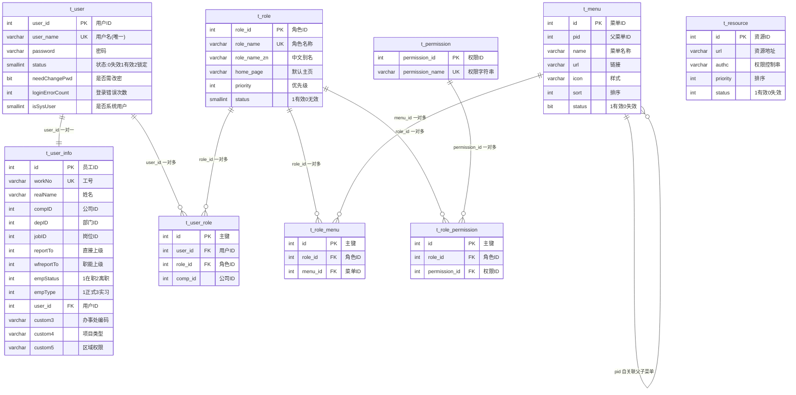

**关系说明：**
- `t_user` 与 `t_user_info` 通过 `user_id` 形成 1:1 关系（显式外键 `fk_userInfo_userId`），用户账号与员工档案一一对应
- `t_user_role` 为用户-角色关联表（多对多），支持一个用户拥有多个角色，并区分公司维度（`comp_id`）
- `t_role_menu` 为角色-菜单关联表（多对多），控制角色可见的菜单
- `t_role_permission` 为角色-权限关联表（多对多），控制角色的操作权限
- `t_menu` 通过 `pid` 自关联实现多级菜单树
- `t_resource` 定义 URL 级别的资源权限，与 `t_permission` 配合实现细粒度访问控制
- `t_user_info` 的 `custom3/custom4/custom5` 字段分别存储办事处编码、项目类型、区域权限，是业务扩展字段

---

## 2. 基础平台模块

本模块提供系统级基础数据支撑，包括基础字典、组织机构、文件管理、邮件服务等。

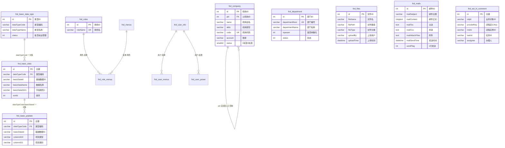

**关系说明：**
- `fnd_basic_data_type` 与 `fnd_basic_data` 通过 `dataTypeCode` 形成 1:N 关系，构成字典分类-字典项的两级结构
- `fnd_basic_prjstate` 是项目状态基础数据表，通过 `dataTypeCode` + `basicDataId` 关联 `fnd_basic_data`，用于定义项目状态流转
- `fnd_company` 通过 `pid` 自关联实现组织机构树（公司-分公司-部门层级）
- `fnd_roles`/`fnd_menus`/`fnd_role_menus` 是另一套角色菜单体系（与 `t_role`/`t_menu` 并存，可能是历史遗留或不同子系统的权限模型）
- `fnd_act_hi_comment` 是工作流批注的扩展表，通过 `instId`/`taskId` 关联 Activiti 流程实例
- `fnd_files` 为统一的文件存储表，被多个业务表通过文件 ID 引用（如 `pm_project_maintenance.deliverFileIds`）

---

## 3. 项目管理模块

本模块是系统的核心业务模块，管理售后项目的全生命周期，包括项目头信息、状态、合同、成员、产品线、发货、维护、周报等。

```mermaid
erDiagram
    pm_project ||--|| pm_project_state : "projectId 一对一"
    pm_project ||--o{ pm_project_contract : "projectId 一对多"
    pm_project ||--o{ pm_project_member : "projectId 一对多"
    pm_project ||--o{ pm_project_product_line : "projectId 一对多"
    pm_project ||--o{ pm_project_shipment : "projectId 一对多"
    pm_project ||--o{ pm_project_related_party : "projectId 一对多"
    pm_project ||--o{ pm_project_notification : "projectId 一对多"
    pm_project ||--o{ pm_project_instruction : "projectId 一对多"
    pm_project ||--o{ pm_project_log : "projectId 一对多"
    pm_project ||--o{ pm_project_maintenance : "projectId 一对多"
    pm_project ||--o{ pm_project_task : "projectId 一对多"
    pm_project ||--o{ pm_project_weekly : "projectId 一对多"
    pm_project ||--o{ pm_project_soft_version : "projectId 一对多"
    pm_project ||--o{ pm_project_warranty_callback : "projectId 一对多"
    pm_project ||--o{ pm_project_supervision : "projectCode 一对多"
    pm_project ||--o{ pm_basic_deliver_detail : "projectId 一对多"
    pm_project_group ||--o{ pm_project_group_relationship : "projectGroupCode 一对多"
    pm_project_group ||--o{ pm_project_contract : "projectGroupCode 一对多"
    pm_project_notification ||--o{ pm_project_notification_state : "notifyId 一对多"
    pm_project_weekly ||--o{ pm_project_weekly_content : "weeklyId 一对多"
    pm_project_weekly ||--o{ pm_project_weekly_feedback : "weeklyId 一对多"
    pm_project_maintenance ||--o{ pm_project_maintenance_service_delivery : "maintenanceId 一对多"
    pm_project_soft_version ||--o{ pm_project_soft_version_history : "projectId+barCode 一对多"

    pm_project {
        int projectId PK "项目主键"
        varchar projectType "10用服售后/afss安服售后/afxx安服先行"
        varchar projectCode UK "项目编码"
        varchar projectName "项目名称"
        varchar projectState "项目阶段状态"
        varchar isback "回退状态码"
        varchar column001 "办事处编码"
        varchar column002 "客户编码ERP"
        varchar column003 "客户名称ERP"
        varchar column009 "订单创建时间"
        varchar salesType "销售类型"
        int compId "公司ID"
        json customInfo "自定义信息"
        json customConfig "自定义配置"
    }

    pm_project_state {
        int projectId PK_FK "项目ID"
        varchar projectPlanState "工程计划状态"
        varchar shipmentState "发货状态"
        varchar projectState "项目状态"
    }

    pm_project_contract {
        int id PK "主键"
        varchar contractNo "合同号"
        varchar projectGroupCode FK "项目组编码"
    }

    pm_project_group {
        int id PK "主键"
        varchar projectGroupCode UK "项目组编码"
        varchar projectGroupName "项目组名称"
        varchar projectType "项目类型"
    }

    pm_project_group_relationship {
        int id PK "主键"
        varchar projectGroupCode FK "项目组编码"
        varchar projectCode "项目编码"
        varchar smsProjectCode "原SMS项目编码"
        varchar mergeBranchMark "拆分合并标识"
    }

    pm_project_member {
        int id PK "主键"
        int projectId FK "项目ID"
        varchar projectType "10售后/20售前"
        varchar memberRole "项目角色"
        varchar memberCode "人员编码"
        varchar memberName "人员名称"
        varchar fromFlag "1项目信息2成员信息"
    }

    pm_project_product_line {
        int id PK "主键"
        int projectId FK "项目ID"
        varchar contractNo "合同号"
        varchar itemCode "产品编码"
        varchar itemName "产品名称"
        int projectQuantity "项目数量"
        int orderQuantity "订单数量"
        int deliverQuantity "已发货数量"
        int openQuantity "未发货数量"
    }

    pm_project_shipment {
        int id PK "主键"
        int projectId FK "项目ID"
        varchar barcode "条码"
        varchar contractNo "合同号"
        varchar itemCode "产品编码"
        int chProjectId "串货转移前projectId"
        int transferProjectId "串货转移后projectId"
        varchar transferFlag "转移标识"
    }

    pm_project_related_party {
        int id PK "主键"
        int projectId FK "项目ID"
        varchar partyRole "相关方角色"
        varchar partyCode "相关方编码"
        varchar partyName "相关方名称"
    }

    pm_project_notification {
        int id PK "主键"
        int projectId FK "项目ID"
        varchar notifySubject "通知标题"
        text notifyContent "通知内容"
    }

    pm_project_notification_state {
        int id PK "主键"
        int notifyId FK "通知ID"
        varchar notifyObject "通知对象"
        int notifyState "0无1有"
        datetime checkTime "查看时间"
    }

    pm_project_instruction {
        int id PK "主键"
        int projectId FK "项目ID"
        text instructionsInfo "批示内容"
        datetime instructionsTime "批示时间"
        varchar instructionsUser "批示用户"
        int dataType "0批示1反馈"
        int instructionsId "批示ID"
    }

    pm_project_log {
        int id PK "主键"
        int projectId FK "项目ID"
        varchar handleName "操作名称"
        varchar handleDesc "操作描述"
        varchar handleUser "操作用户"
        int handleState "0无通知1有通知"
    }

    pm_project_maintenance {
        int id PK "主键"
        int projectId FK "项目ID"
        varchar projectCode "项目编码"
        int projectType "10售后20售前"
        varchar type "任务性质"
        varchar category "任务分类"
        varchar subCategory "任务小类"
        varchar officeCode "办事处"
        datetime processTime "处理时间"
        int quesnaireId "问卷ID"
        int year "年度"
        int quarter "季度"
        int month "月份"
        int wsCount "维保服务次数"
        int wafCount "其他服务次数"
    }

    pm_project_task {
        int taskId PK "任务ID"
        int projectId FK "项目ID"
        varchar projectType "项目类型"
        varchar taskTypeCode "任务类型编码"
        int taskTypeId "任务类型ID"
    }

    pm_project_weekly {
        int weeklyId PK "周报ID"
        int projectId FK "项目ID"
    }

    pm_project_weekly_content {
        int id PK "主键"
        int weeklyId FK "周报ID"
    }

    pm_project_weekly_feedback {
        int id PK "主键"
        int weeklyId FK "周报ID"
    }

    pm_project_soft_version {
        int id PK "主键"
        int projectId FK "项目ID"
        varchar barCode "条码"
        varchar conp "组件版本"
        varchar conpType "组件类型"
        varchar conpSeries "组件系列"
        varchar conpMark "组件标识"
        varchar itemCode "物料编码"
        int datastate "数据状态"
    }

    pm_project_warranty_callback {
        int id PK "主键"
        int projectId FK "项目ID"
        varchar projectCode "项目编码"
    }

    pm_project_supervision {
        int id PK "主键"
        varchar projectCode "项目编码"
        varchar officeCode "办事处"
    }

    pm_basic_deliver_detail {
        int id PK "主键"
        int projectId FK "项目ID"
        varchar projectType "项目类型"
        int deliverId "交付件ID"
        varchar deliverableType "交付类型"
    }
```

**关系说明：**
- `pm_project` 是项目头信息主表，通过 `projectId` 与几乎所有项目子表形成 1:N 关系
- `pm_project_state` 与 `pm_project` 是 1:1 关系，`projectId` 同时作为主键和外键，存储项目的各类状态（计划状态、发货状态、项目状态等）
- `pm_project_group`（项目组）通过 `pm_project_group_relationship` 与项目形成多对多关系，支持项目拆分合并（`mergeBranchMark` 字段标识）
- `pm_project_contract` 通过 `projectGroupCode` 关联项目组，一个项目组可对应多个合同
- `pm_project_member` 通过 `projectId` + `projectType` 关联项目，`fromFlag` 标识成员信息来源（项目信息或成员信息）
- `pm_project_product_line` 记录项目产品线，包含订单数量、已发货数量、未发货数量，是发货管理的核心
- `pm_project_shipment` 记录发货明细，支持串货转移（`chProjectId`/`transferProjectId`/`transferFlag` 字段）
- `pm_project_notification` 与 `pm_project_notification_state` 形成 1:N 关系，记录通知及每个用户的查看状态
- `pm_project_instruction` 通过 `dataType`（0批示/1反馈）和 `instructionsId` 实现批示与反馈的自关联
- `pm_project_maintenance` 是维护服务记录表，通过 `quesnaireId` 关联回访问卷，支持维保次数统计（`wsCount`/`wafCount`）
- `pm_project_soft_version` 记录设备软件版本，通过 `projectId` + `barCode` 唯一标识一台设备的版本信息
- `pm_project` 的 `column001`-`column014` 是泛化字段，分别对应办事处编码、客户编码、客户名称、市场部编码、系统部ID、拓展部ID、子行业ID、不予跟踪原因、订单创建时间、项目类型、项目分类、项目实施方式、最终客户名称、回退说明等业务含义

---

## 4. 售前管理模块

本模块管理售前项目信息、回访、产品线及借货流程，与 SMS、CRM、OA、SAP 等外部系统有数据同步。

```mermaid
erDiagram
    pm_presales_project_header ||--|| pm_presales_project_duration : "presalesId 一对一(显式外键)"
    pm_presales_project_header ||--o{ pm_presales_project_callback : "presalesId 一对多"
    pm_presales_project_header ||--o{ pm_presales_project_product_line : "presalesId 一对多"
    pm_presales_project_header }o--|| pm_presales_lend_info_from_crm : "lendInfoId 借货信息"
    pm_presales_project_callback }o--|| pm_cl_quesnaire_result_header : "quesnaireId 问卷结果"

    pm_presales_project_header {
        int presalesId PK "售前项目ID"
        varchar projectCode UK "项目编码"
        varchar lendInfoId FK "借货信息ID"
        varchar instId "流程实例ID"
    }

    pm_presales_project_duration {
        int presalesId PK_FK "售前项目ID(显式外键)"
    }

    pm_presales_project_callback {
        int id PK "主键"
        int presalesId FK "售前项目ID"
        varchar taskId "任务ID"
        int quesnaireId FK "问卷ID"
        int quesnaireVersion "问卷版本"
        int quesnaireState "-1草稿1已提交"
    }

    pm_presales_project_product_line {
        int productLineId PK "产品线ID"
        int presalesId FK "售前项目ID"
        varchar lendInfoId "借货信息ID"
    }

    pm_presales_project_rma_info {
        int id PK "主键"
        varchar contract "合同号"
        varchar itemcode "物料编码"
    }

    pm_presales_lend_info_from_crm {
        int id PK "CRM借货信息ID"
    }

    pm_presales_lend_info_from_oa {
        int id PK "OA借货信息ID"
        int lendInfoId FK "借货信息ID"
    }

    pm_presales_lend_2_delivery_off_from_sap {
        int id PK "主键"
        varchar contract "合同号"
        varchar orderNumber "订单号"
        varchar lineId "行ID"
        varchar ppliCode "借货产品线编码"
    }

    pm_presales_lend_2_rma_from_sms {
        int id PK "主键"
        varchar contract "合同号"
        varchar itemcode "物料编码"
        varchar orderNumber "订单号"
        varchar lineId "行ID"
        varchar ppliCode "借货产品线编码"
    }

    pm_presales_lend_2_sale_from_sms {
        int id PK "主键"
        varchar projectCode "项目编码"
    }
```

**关系说明：**
- `pm_presales_project_header` 与 `pm_presales_project_duration` 通过 `presalesId` 形成 1:1 关系（数据库中唯一的业务表显式外键），存储售前项目周期信息
- `pm_presales_project_header` 通过 `lendInfoId` 关联借货信息（来源可能是 CRM、OA 或 SMS）
- `pm_presales_project_callback` 通过 `quesnaireId` 关联回访问卷结果，复用回访模块的问卷体系
- `pm_presales_lend_*_from_*` 系列表是借货数据从各外部系统（CRM/OA/SMS/SAP）同步的快照表，通过 `contract`/`orderNumber`/`lineId`/`ppliCode` 等字段关联
- 售前项目通过 `instId` 关联 Activiti 工作流实例，驱动售前审批流程

---

## 5. 转包管理模块

本模块管理转包项目和外派项目，包括服务商管理、转包明细、结算、付款等。

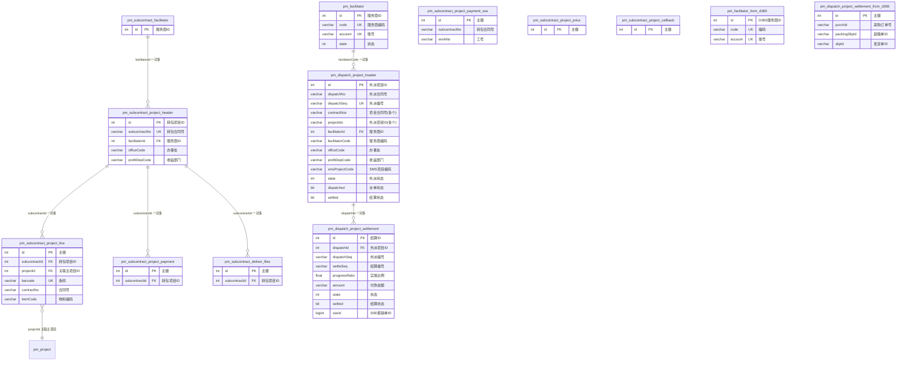

**关系说明：**
- `pm_subcontract_facilitator` 和 `pm_facilitator` 是两套服务商表（前者用于转包，后者用于外派），`pm_facilitator_form_d365` 是从 D365 同步的服务商数据
- `pm_subcontract_project_header` 通过 `facilitatorId` 关联服务商，一个服务商可承接多个转包项目
- `pm_subcontract_project_line` 通过 `subcontractId` 关联转包头，通过 `projectId` 反向关联 `pm_project` 主项目，`barcode` 在转包项目内唯一（复合唯一索引）
- `pm_dispatch_project_header` 是外派项目表，`projectIds` 字段以逗号分隔存储多个关联项目ID，支持一个外派对应多个项目
- `pm_dispatch_project_settlement` 通过 `dispatchId` 关联外派头，记录每次结算信息，`sseId` 关联 SSE 报销系统
- `pm_dispatch_project_settlement_from_d365` 是从 D365 同步的结算数据，通过 `purchId`/`packingSlipId`/`slipId` 与 D365 采购系统关联

---

## 6. 回访管理模块

本模块管理项目回访流程，包括回访申请、评测、问卷模板与结果，支持 400 回访和项目组评分。

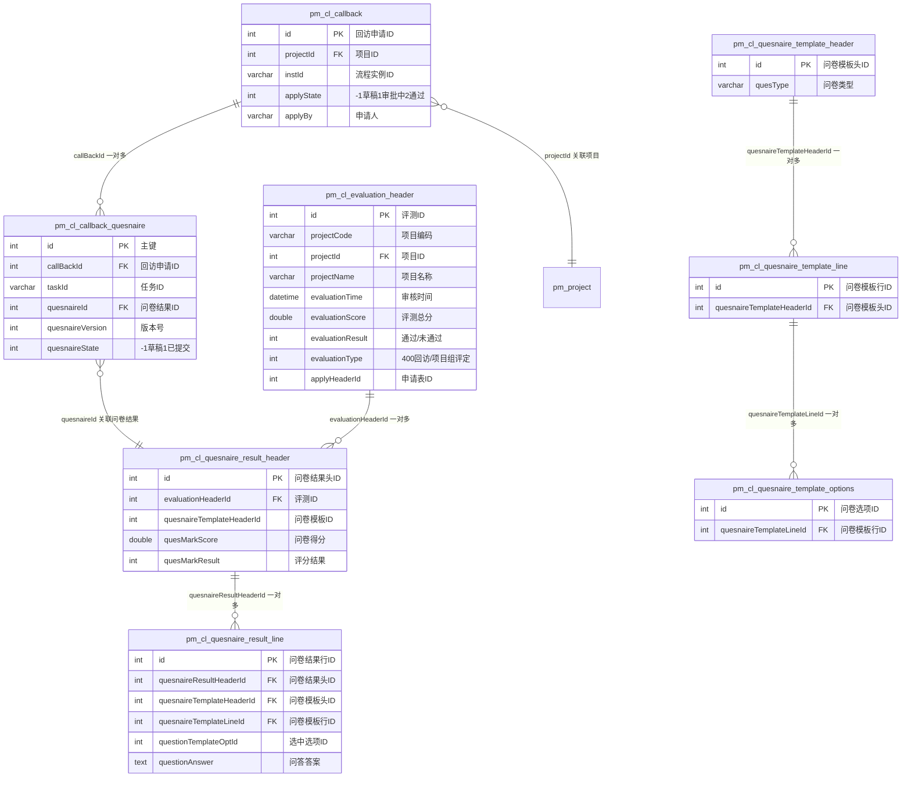

**关系说明：**
- 回访模块采用"模板-结果"双层问卷结构：`pm_cl_quesnaire_template_*` 定义问卷模板（头-行-选项三级），`pm_cl_quesnaire_result_*` 记录问卷结果（头-行两级）
- `pm_cl_callback` 是回访申请主表，通过 `projectId` 关联项目，通过 `instId` 关联工作流
- `pm_cl_callback_quesnaire` 是回访申请与问卷结果的关联表，通过 `callBackId` 关联回访申请，通过 `quesnaireId` 关联问卷结果
- `pm_cl_evaluation_header` 是评测主表，`evaluationType` 区分 400 回访和项目组总分评定
- `pm_cl_quesnaire_result_line` 通过 `questionTemplateOptId` 记录用户选择的选项，通过 `questionAnswer` 记录文本问答
- 问卷模板支持版本控制（`quesnaireVersion` 字段）

---

## 7. 问题管理模块

本模块管理产品问题跟踪与恢复流程，包括问题主表、受影响产品、恢复处理、软件版本等。

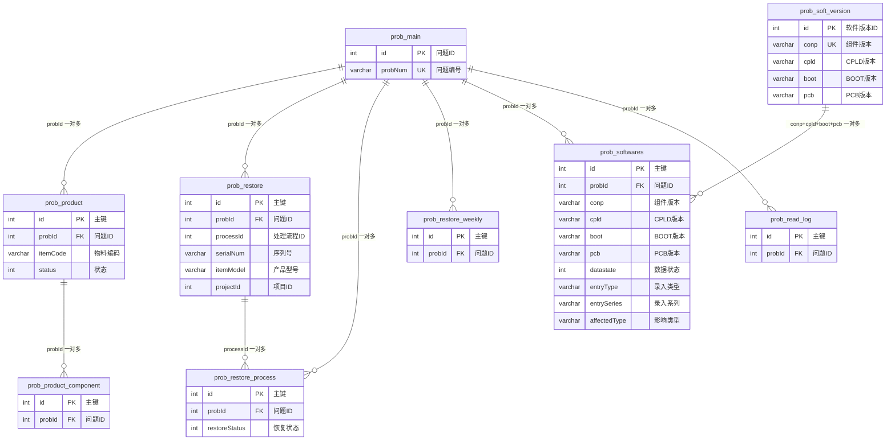

**关系说明：**
- `prob_main` 是问题主表，通过 `probId` 关联所有子表
- `prob_product` 记录受影响的产品，通过 `probId` + `status` + `itemCode` 复合索引支持按问题查询产品状态
- `prob_restore` 记录恢复处理，通过 `probId` + `serialNum` 唯一标识一台设备的恢复记录，`processId` 关联处理流程
- `prob_restore_process` 记录恢复处理流程，通过 `probId` + `restoreStatus` 复合索引支持按问题查询恢复状态
- `prob_softwares` 记录问题涉及的软件版本，通过 `probId` + `datastate` + `entryType` + `entrySeries` 复合索引支持多维度查询
- `prob_soft_version` 是软件版本主数据表，`conp` + `cpld` + `boot` + `pcb` 四字段组成唯一索引，作为软件版本的权威定义

---

## 8. 工作流模块（Activiti）

本模块基于 Activiti 5.23.0 引擎，管理 BPMN 流程定义、流程实例、任务、变量等，并通过 `pm_workflow` 和 `dp_act_unify_task` 扩展业务集成。

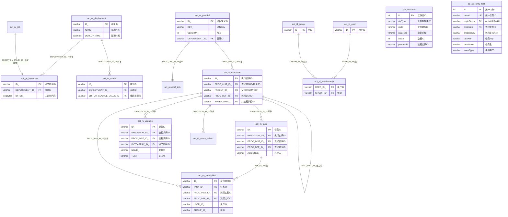

**关系说明：**
- Activiti 表间关系由引擎自身维护（显式外键），遵循 BPMN 2.0 标准模型
- `act_re_*`（Repository）管理流程定义和部署，`act_ru_*`（Runtime）管理运行时数据，`act_hi_*`（History）管理历史数据，`act_id_*`（Identity）管理身份
- `act_ru_execution` 通过 `PARENT_ID_` 和 `PROC_INST_ID_` 自关联实现执行树结构
- `pm_workflow` 是业务-工作流关联表，通过 `objType` + `objId` + `dataType` + `dataId` 四字段复合索引定位业务数据，`procInstId` 关联流程实例
- `dp_act_unify_task` 是统一待办任务表，通过 `originTaskId` 关联 Activiti 原始任务，`procInstId` 关联流程实例，实现多流程引擎的待办聚合

---

## 9. ERP 集成模块

本模块管理从 ERP 系统（D365/SAP）同步的采购订单、收货单及销售订单数据。

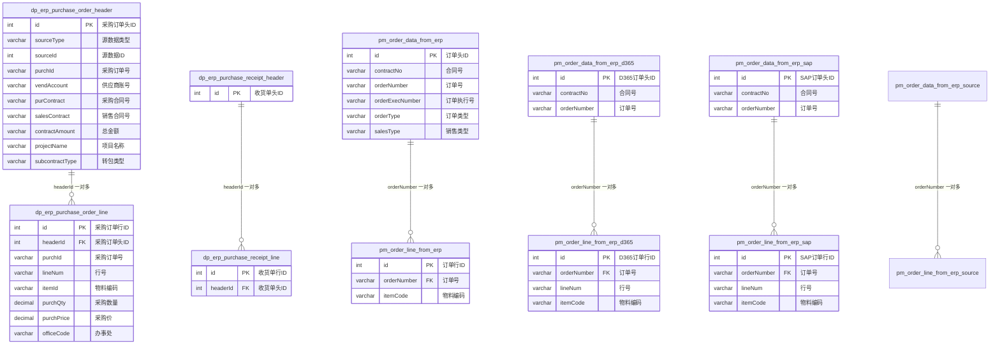

**关系说明：**
- ERP 集成采用"头-行"两级结构，`dp_erp_purchase_order_header`/`dp_erp_purchase_order_line` 管理采购订单，`dp_erp_purchase_receipt_header`/`dp_erp_purchase_receipt_line` 管理收货单
- `pm_order_data_from_erp_*` 系列表按数据来源（D365/SAP/Source）分表存储销售订单数据，结构一致，通过 `orderNumber` 关联头行
- `pm_order_line_from_erp_d365` 和 `pm_order_line_from_erp_sap` 通过 `orderNumber` + `lineNum` 复合索引支持按订单号查询行明细
- `dp_erp_purchase_order_header` 的 `sourceType` + `sourceId` 字段标识订单来源（可能是转包或外派），实现 ERP 数据与业务数据的追溯

---

## 10. 发货反馈模块

本模块管理发货条码、质保信息、软件版本等，与 RMA 和仓库模块有数据交互。

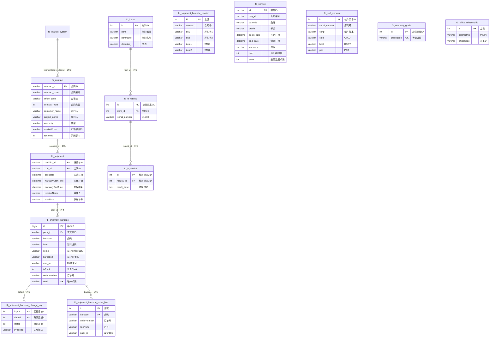

**关系说明：**
- `fb_contract` 是合同主表，通过 `contract_id` 关联发货单，`marketCode` + `systemId` 关联市场部与系统部
- `fb_shipment` 通过 `con_id` 关联合同，`packlist_id` 作为发货单标识关联条码明细
- `fb_shipment_barcode` 是发货条码明细表，通过 `pack_id` 关联发货单，`barcode` + `pack_id` + `rma_no` 三字段复合索引支持多维度查询，`item2`/`barcode2` 记录母子公司发货对应关系
- `fb_shipment_barcode_change_log` 记录条码变更日志，通过 `dataId` + `lasted` + `logID` 复合索引支持查询某条码的最新变更
- `fb_shipment_barcode_order_line` 记录条码与订单行的关联，通过 `orderNumber` + `barcode` 复合索引支持按订单查询条码
- `fb_items` 与 `fb_ft_result1`/`fb_ft_result2` 形成三级结构，记录物料的检测结果
- `fb_service` 记录质保服务信息，`isyb` 标识延保数据，`state` 标识最新数据（针对多条续保记录）
- `fb_soft_version` 记录设备软件版本，通过 `serial_number` 关联设备

---

## 11. RMA/备件/仓库模块

本模块管理 RMA 申请、备件借用、仓库库存等，是 SPMS 系统的核心业务模块。

```mermaid
erDiagram
    rma_app_info ||--o{ rma_bar : "sheetID 一对多"
    rma_app_info ||--o{ rma_spare_info : "sheetID 一对多"
    rma_app_info ||--o{ app_accessory_info : "sheetID 一对多"
    rma_app_info ||--o{ app_comment : "sheetID 一对多"
    rma_app_info ||--o{ rma_info2mes_result : "sheetID 一对多"
    rma_app_info ||--o{ rma_repair_report_from_mes : "sheetId 一对多"
    brw_app_info ||--o{ brw_spare_info : "sheetID 一对多"
    brw_app_info ||--o{ app_accessory_info : "sheetID 一对多"
    brw_app_info ||--o{ app_comment : "sheetID 一对多"
    brw_app_info }o--|| addressee_info : "addre_id 关联收件人"
    spare_parts ||--o{ spare_parts_applicant : "spare_code 一对多"
    spare_parts ||--o{ bar : "spare_id 一对多"
    tx_info ||--o{ app_spare_part : "tx_id 一对多"
    warehouse ||--o{ warehouse_info : "whs_code 一对多"
    warehouse_info ||--o{ warehouse_info_detail : "info_id 一对多"

    rma_app_info {
        int id PK "RMA申请ID"
        varchar sheetID UK "流水号"
    }

    rma_applicant {
        int id PK "RMA申请人ID"
        int id UK "关联ID"
        varchar spare_code UK "备件编码"
    }

    rma_bar {
        int id PK "主键"
        int rma_id FK "RMA申请ID"
    }

    rma_spare_info {
        int id PK "主键"
        varchar sheetID FK "流水号"
        varchar tx_id FK "交易ID"
    }

    rma_info2mes_result {
        int id PK "主键"
        varchar sheetID FK "流水号"
    }

    rma_repair_report_from_mes {
        int id PK "主键"
        varchar sheetId FK "流水号"
    }

    brw_app_info {
        int id PK "借用申请ID"
        varchar sheetID UK "流水号"
        varchar applicant "申请人"
        varchar contractNo "合同号"
        varchar app_type "0借用1转移2历史"
        int addre_id FK "收件人ID"
        varchar demand_type "需求类型"
    }

    brw_spare_info {
        int id PK "主键"
        varchar sheetID FK "流水号"
    }

    app_accessory_info {
        int id PK "附件ID"
        varchar sheetID FK "流水号"
        varchar accessoryName "附件名"
        int accessoryType "1发货-1坏件返回"
        varchar accessoryPath "上传路径"
    }

    app_comment {
        int id PK "审批ID"
        varchar sheetID FK "流水号"
        varchar is_pass "0未处理1通过2未通过-1作废"
        varchar state "1最新0旧"
        int isUnion "是否联合供应链"
    }

    app_spare_part {
        int id PK "主键"
        int tx_id UK "交易ID"
        varchar isOK "0未核销1核销"
        char isNew "0历史1最新2转移中"
        char contract_sub_type "0RMA1保障2库存3借用"
        varchar item_code "物料号"
        char isReceive "0待确认1已接收2待发货"
    }

    tx_info {
        int tx_id PK "交易ID"
        varchar sheetID FK "流水号"
    }

    spare_parts {
        int id PK "备件ID"
        varchar spare_code UK "备件编码"
    }

    spare_parts_applicant {
        int id PK "主键"
        varchar spare_code FK "备件编码"
    }

    bar {
        int id PK "主键"
        int spare_id FK "备件ID"
        varchar bar_code "设备编码"
        varchar serial_number "序列号"
        varchar spare_code "备件编码"
    }

    addressee_info {
        int addre_id PK "收件人ID"
        varchar username "用户账号"
        varchar addre_name "收件人姓名"
        varchar addre_tel "收件人电话"
        varchar addr "地址"
    }

    warehouse {
        int whs_id PK "仓库ID"
        varchar whs_code UK "仓库编码"
    }

    warehouse_info {
        int info_id PK "仓库信息ID"
        varchar whs_code FK "仓库编码"
    }

    warehouse_info_detail {
        int id PK "主键"
        int info_id FK "仓库信息ID"
    }

    back_type {
        int id PK "退回类型ID"
        varchar back "退回编码"
        varchar back_type "退回类型"
        varchar back_state "退回状态"
    }

    serve_type {
        int id PK "服务类型ID"
        varchar serve "服务编码"
    }

    tain_type {
        int id PK "检测类型ID"
        varchar tain "检测编码"
    }
```

**关系说明：**
- `rma_app_info` 和 `brw_app_info` 分别是 RMA 申请和借用申请的主表，通过 `sheetID`（流水号）关联所有子表
- `app_accessory_info` 和 `app_comment` 是 RMA 和借用共用的附件表和审批表，通过 `sheetID` 关联，`accessoryType` 区分发货信息（1）和坏件返回信息（-1）
- `tx_info` 是交易信息表，通过 `tx_id` 关联 `app_spare_part`，记录备件核销信息
- `app_spare_part` 的 `contract_sub_type` 字段标识发货类型（0RMA/1项目保障/2库存/3借用），`isNew` 字段管理数据状态（0历史/1最新/2转移中）
- `spare_parts` 是备件主数据表，通过 `spare_code` 关联申请人和条码
- `bar` 表通过 `spare_id` 关联备件，记录设备条码和序列号
- `warehouse`/`warehouse_info`/`warehouse_info_detail` 三级结构管理仓库信息
- `back_type`/`serve_type`/`tain_type` 是三类基础字典表，分别管理退回类型、服务类型、检测类型

---

## 12. EHR 人力模块

本模块管理公司、部门、岗位、员工等人力资源基础数据。

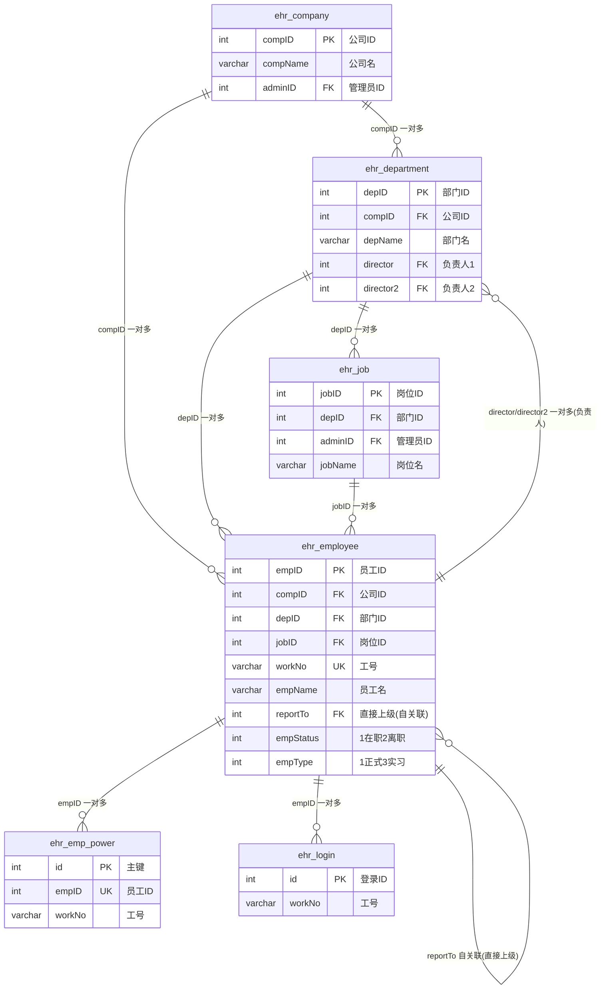

**关系说明：**
- EHR 模块采用"公司-部门-岗位-员工"四级结构
- `ehr_company` 通过 `compID` 关联部门和员工，`adminID` 关联管理员员工
- `ehr_department` 通过 `depID` 关联岗位和员工，`director`/`director2` 字段关联部门负责人
- `ehr_job` 通过 `jobID` 关联员工，`adminID` 关联岗位管理员
- `ehr_employee` 通过 `reportTo` 自关联实现组织汇报关系树
- `ehr_emp_power` 通过 `empID` 唯一索引关联员工，记录员工权限
- `ehr_login` 记录员工登录信息，通过 `workNo` 关联

---

## 13. 其他系统模块

本模块包含系统配置、字典、日志、同步等支撑性表。

```mermaid
erDiagram
    t_company ||--o{ t_company : "pid 自关联"
    sys_state_or_type ||--o{ sys_state_or_type : "stCode 自关联"
    t_user ||--o{ t_user_login_record : "user_id 一对多"
    t_file_type ||--o{ t_file : "fileType 一对多"

    t_company {
        int id PK "公司ID"
        int pid FK "父公司ID"
        varchar compCode "公司编码"
        int adminID FK "管理员ID"
    }

    t_dictionary {
        int id PK "字典ID"
    }

    t_file {
        int id PK "文件ID"
        varchar fileType FK "文件类型"
    }

    t_file_type {
        int id PK "文件类型ID"
    }

    t_mails {
        int id PK "邮件ID"
    }

    t_notify_template {
        int id PK "通知模板ID"
        varchar templateCode UK "模板编码"
    }

    t_sys_log {
        int id PK "日志ID"
        varchar type "日志类型"
        varchar create_by "创建人"
        datetime create_date "创建时间"
        varchar description "描述"
    }

    t_sys_variable {
        varchar code PK "变量编码"
        int id FK "变量ID"
    }

    t_sync_log {
        int id PK "同步日志ID"
    }

    t_sync_state {
        int id PK "同步状态ID"
        varchar tableObject UK "同步表对象"
    }

    t_user_login_record {
        int id PK "登录记录ID"
    }

    sys_state_or_type {
        int id PK "状态/类型ID"
        varchar stCode "状态码"
        varchar resolveCode "解析码"
    }

    data_field_relation {
        int id PK "字段关系ID"
        varchar dataName "数据名"
        int dataId "数据实例ID"
        varchar field "字段"
        int compId "公司ID"
        varchar superData "父类dataName"
    }

    pm_common_related_data {
        int id PK "公共关联数据ID"
        varchar type "类型"
        varchar objType "对象类型"
        int objId "对象ID"
    }

    pm_daily_report {
        int id PK "日报ID"
        int projectId FK "项目ID"
        varchar projectCode "项目编码"
        varchar projectType "项目类型"
        varchar officeCode "办事处"
        varchar type "类型"
        varchar category "分类"
        varchar subCategory "小类"
    }

    pm_workflow {
        int id PK "工作流ID"
        varchar objType "对象类型"
        varchar objId "对象ID"
        varchar dataType "数据类型"
        int dataId "数据ID"
        varchar procInstId "流程实例ID"
    }

    af_industry_asset ||--o{ af_industry_asset_leak_relation : "assetId 一对多"
    af_industry_asset ||--o{ af_industry_asset_project_relation : "assetId 一对多"
    af_industry_leak ||--o{ af_industry_asset_leak_relation : "projectId 一对多"

    af_industry_asset {
        int id PK "资产ID"
        int projectId "项目ID"
    }

    af_industry_leak {
        int id PK "泄漏ID"
    }

    af_industry_asset_leak_relation {
        int id PK "主键"
        int assetId FK "资产ID"
        int projectId FK "项目ID"
    }

    af_industry_asset_project_relation {
        int id PK "主键"
        int assetId FK "资产ID"
        int projectId FK "项目ID"
    }
```

**关系说明：**
- `t_company` 通过 `pid` 自关联实现公司层级树
- `sys_state_or_type` 是系统状态/类型字典表，通过 `stCode` 自关联实现状态层级
- `t_user_login_record` 通过 `user_id` 关联用户登录记录
- `t_file` 通过 `fileType` 关联文件类型
- `t_notify_template` 通过 `templateCode` 唯一索引管理通知模板
- `t_sys_variable` 以 `code` 为主键存储系统变量
- `t_sync_state` 通过 `tableObject` 唯一索引记录各表同步状态
- `data_field_relation` 是动态字段关系表，通过 `dataName` + `dataId` 定位业务数据，`superData` 实现字段继承
- `pm_common_related_data` 通过 `type` + `objType` + `objId` 三字段复合索引管理公共关联数据
- `pm_daily_report` 是日报表，通过 `projectId` 关联项目，支持按办事处、类型、分类、小类多维度统计
- `af_industry_asset`（工业安全资产）通过 `assetId` 关联泄漏关系和项目关系，`af_industry_leak` 通过 `projectId` 关联资产泄漏关系

---

## 跨模块关系总览

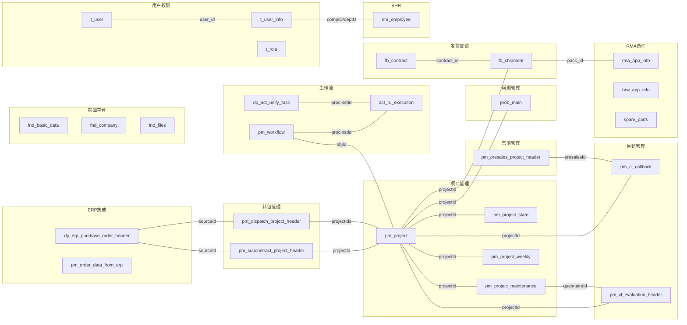

**跨模块关系说明：**

1. **用户-项目**：`t_user_info` 通过 `compID`/`depID` 关联 EHR 模块的 `ehr_employee`，项目成员 `pm_project_member` 通过 `memberCode` 关联用户
2. **项目-工作流**：`pm_workflow` 通过 `objType` + `objId` 关联项目（`pm_project`）、售前（`pm_presales_project_header`）、转包（`pm_subcontract_project_header`）等业务对象，通过 `procInstId` 关联 Activiti 流程实例
3. **项目-回访**：`pm_cl_callback` 和 `pm_cl_evaluation_header` 通过 `projectId` 关联项目，`pm_project_maintenance` 通过 `quesnaireId` 关联回访问卷
4. **项目-问题**：`prob_restore` 通过 `projectId` 关联项目，实现问题恢复与项目的追溯
5. **项目-发货**：`pm_project_shipment` 通过 `projectId` 关联项目，`fb_shipment` 通过 `con_id` 关联合同，间接关联项目
6. **转包-项目**：`pm_subcontract_project_line` 通过 `projectId` 关联主项目，`pm_dispatch_project_header` 通过 `projectIds`（逗号分隔）关联多个项目
7. **ERP-转包**：`dp_erp_purchase_order_header` 通过 `sourceType` + `sourceId` 关联转包项目或外派项目，实现采购订单与业务的追溯
8. **发货-RMA**：`fb_shipment_barcode` 通过 `rma_no` 关联 RMA 申请，`fb_shipment` 通过 `pack_id` 关联 RMA 发货
9. **售前-回访**：`pm_presales_project_callback` 通过 `quesnaireId` 复用回访模块的问卷体系

---

## 关系类型统计

| 关系类型 | 数量 | 说明 |
|----------|------|------|
| 一对一 (1:1) | 3 | pm_project↔pm_project_state, pm_presales_project_header↔pm_presales_project_duration, t_user↔t_user_info |
| 一对多 (1:N) | 85+ | 项目头与各子表、合同与发货、发货与条码等 |
| 多对多 (M:N) | 5 | t_user↔t_role(通过t_user_role), t_role↔t_menu(通过t_role_menu), t_role↔t_permission(通过t_role_permission), pm_project↔pm_project_group(通过pm_project_group_relationship), act_id_user↔act_id_group(通过act_id_membership) |
| 自关联 | 6 | t_menu(pid), fnd_company(pid), act_ru_execution(PARENT_ID_), ehr_employee(reportTo), t_company(pid), sys_state_or_type(stCode) |

---

## 注意事项

1. **外键约束缺失**：本数据库仅 Activiti 表和部分权限表（t_user_info, t_user_role, pm_presales_project_duration）有显式外键约束，绝大多数表间关系通过命名约定和业务逻辑维护，存在数据一致性风险
2. **泛化字段**：`pm_project` 表的 `column001`-`column014` 是泛化字段，实际对应办事处编码、客户信息等业务含义，需结合代码理解
3. **多套权限体系**：存在 `t_*` 和 `fnd_*` 两套权限表，可能是不同子系统的遗留，需确认使用情况
4. **多数据源同步**：`*_from_sms`、`*_from_crm`、`*_from_oa`、`*_from_sap`、`*_from_d365`、`*_from_mes` 等表是外部系统数据同步的快照表，需关注同步频率和数据一致性
5. **历史表**：`*_history`、`*_bak` 等表是历史数据归档表，需关注归档策略和查询性能
