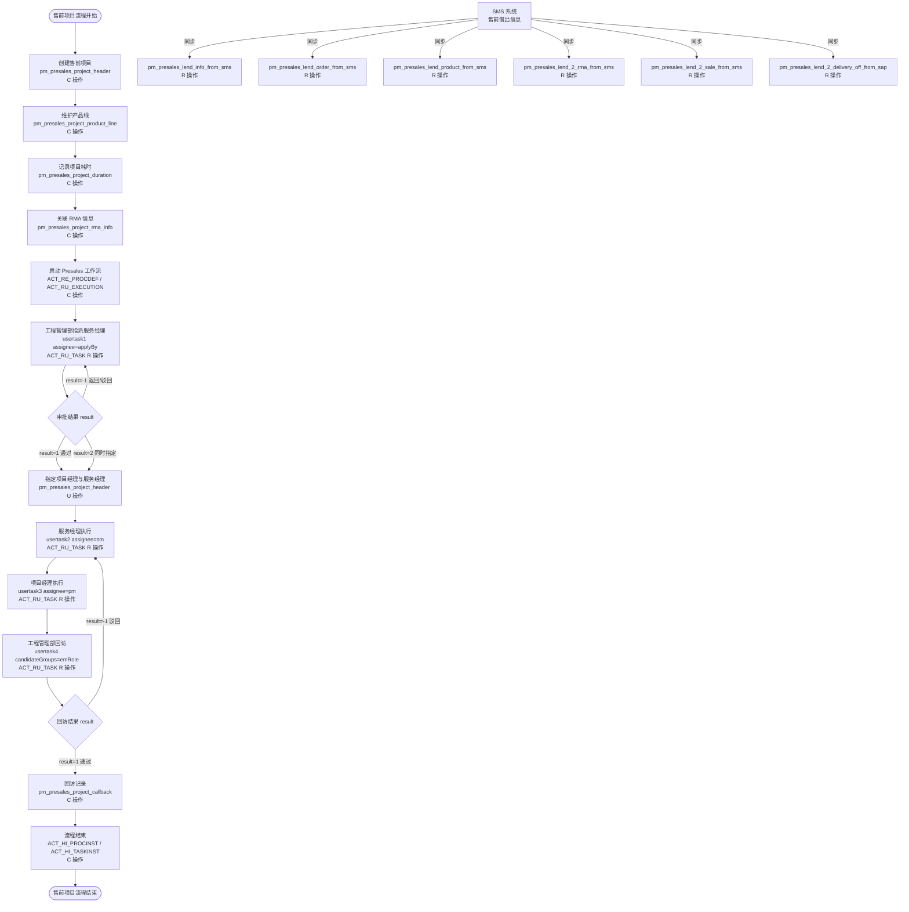
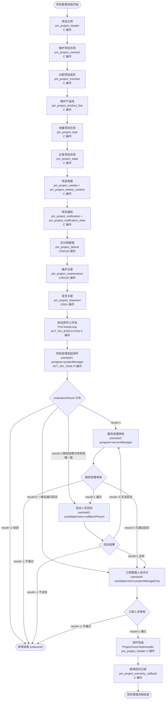
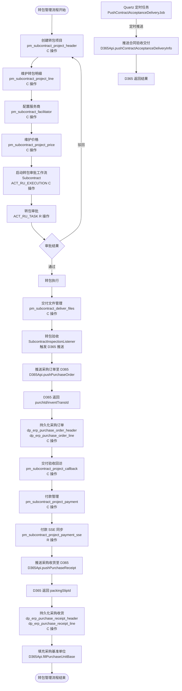
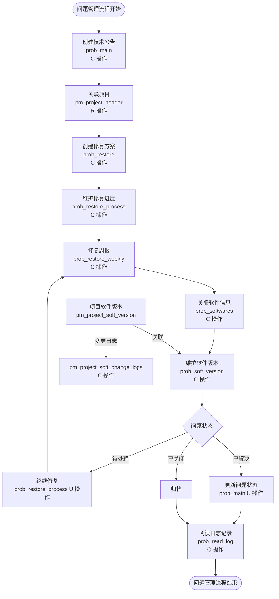
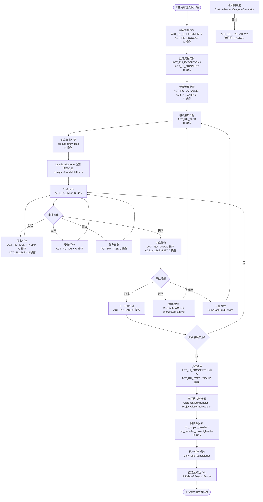
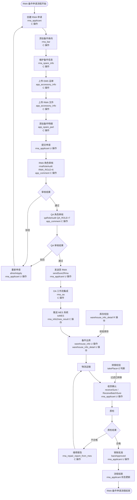
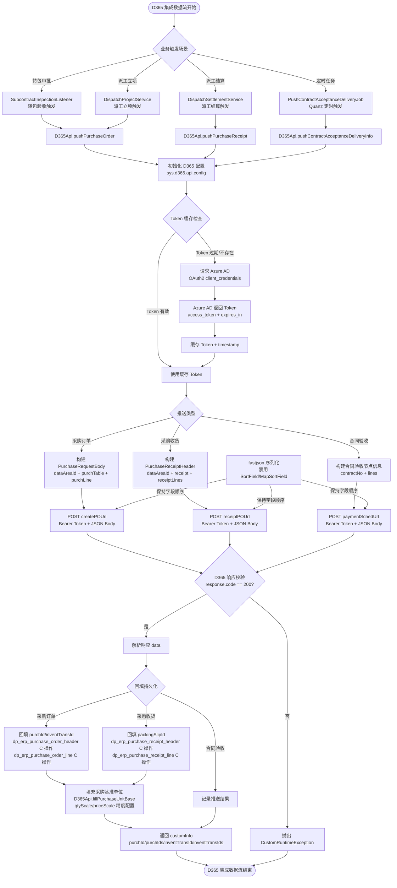
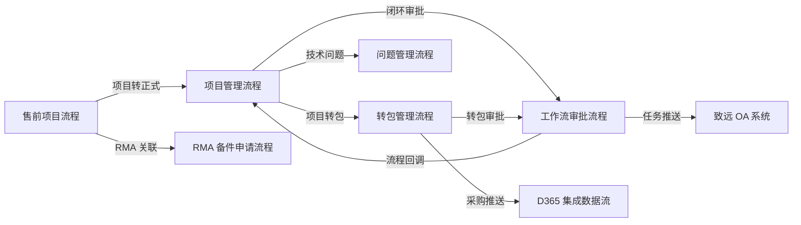

# PMS 关键业务流程数据流向图

> 本文档绘制 PMS 与 SPMS 系统 7 个关键业务流程的数据流向图，使用 Mermaid flowchart 表示。
> 每个流程图标注：数据节点（表名）、数据转换规则、校验机制、数据流向箭头。
> 数据库：dppms_d365 / dppms_d365 (MySQL 8.0.16) / activiti (独立 MySQL) / 外部 SQL Server (D365/SAP/MES)

---

## 1. 售前项目流程

> 业务说明：售前测试项目从创建到闭环的完整数据流，涵盖项目创建、产品线维护、任务分配、回访闭环。
> 涉及模块：PMS-struts（售前测试子模块）、PMS-activiti（Presales 流程）
> BPMN 流程：`Presales.bpmn`（流程 ID：`Presales`）

### 1.1 数据流向图

### 1.2 数据节点说明

| 数据节点 | 表名 | 操作 | 说明 |
|---------|------|------|------|
| 售前项目主表 | pm_presales_project_header | C/R/U/D | 售前项目创建、状态流转 |
| 售前项目产品线 | pm_presales_project_product_line | C/R/U/D | 产品线维护 |
| 售前项目耗时 | pm_presales_project_duration | C/R/U | 项目耗时记录 |
| 售前项目RMA信息 | pm_presales_project_rma_info | C/R/U | RMA 关联信息 |
| 售前项目回访 | pm_presales_project_callback | C/R/U | 回访记录 |
| 流程定义 | ACT_RE_PROCDEF | R | Presales 流程定义 |
| 流程实例 | ACT_RU_EXECUTION / ACT_HI_PROCINST | C/R | 流程实例运行/历史 |
| 任务实例 | ACT_RU_TASK / ACT_HI_TASKINST | C/R/U | 任务待办/已办 |
| SMS 同步表 | pm_presales_lend_*_from_sms | R | SMS 系统同步数据（只读） |

### 1.3 数据转换规则

| 转换环节 | 转换规则 | 校验机制 |
|---------|---------|---------|
| SMS → 本地表 | 售前借出信息定时同步至 pm_presales_lend_* 表 | 数据格式校验、唯一性校验（sheetID） |
| 项目状态流转 | 待指派 → 已指派 → 执行中 → 回访中 → 已闭环 | 状态机校验（result 字段：1=通过，-1=驳回） |
| 工作流变量绑定 | applyBy/sm/pm/emRole → ACT_RU_TASK.assignee | 用户存在性校验（user_info） |
| 回访结果回写 | result=1 → pm_presales_project_callback 插入回访记录 | 回访人员权限校验（emRole 候选组） |

### 1.4 校验机制

- **唯一性校验**：售前项目编号唯一（pm_presales_project_header.project_no）
- **引用完整性**：产品线关联项目主表（product_line.project_id → header.id）
- **业务规则**：工作流审批顺序校验（必须先指派服务经理，再执行项目）
- **权限校验**：回访人员必须属于 emRole 候选组

---

## 2. 项目管理流程

> 业务说明：项目从立项到闭环的完整数据流，涵盖项目创建、成员管理、里程碑/任务、交付物、闭环审批。
> 涉及模块：PMS-struts（项目管理子模块）、PMS-springmvc（项目管理 Controller）、PMS-activiti（PmClosedLoop 流程）
> BPMN 流程：`PmClosedLoop.bpmn`（流程 ID：`PmClosedLoop`）

### 2.1 数据流向图

### 2.2 数据节点说明

| 数据节点 | 表名 | 操作 | 说明 |
|---------|------|------|------|
| 项目主表 | pm_project_header | C/R/U/D | 项目立项、状态更新 |
| 项目合同 | pm_project_contract | C/R | 项目合同关联 |
| 项目成员 | pm_project_member | C/R/U/D | 成员分配、失效变更 |
| 项目产品线 | pm_project_product_line | C/R/U/D | 产品线维护 |
| 项目任务 | pm_project_task | C/R/U | 里程碑/任务管理 |
| 项目状态 | pm_project_state | C/R/U | 状态变更记录 |
| 项目周报 | pm_project_weekly / pm_project_weekly_content | C/R/U | 周报主表与内容 |
| 项目通知 | pm_project_notification / pm_project_notification_state | C/R/U | 通知与状态 |
| 项目交付物 | pm_project_deliver | C/R/U/D | 交付件管理 |
| 维护记录 | pm_project_maintenance | C/R/U/D | 维护记录 |
| 项目发货 | pm_project_shipment | C/R/U | 发货关联 |
| 维保回访 | pm_project_warranty_callback | C/R/U/D | 维保回访记录 |
| 工作流实例 | ACT_RU_EXECUTION / ACT_HI_PROCINST | C/R | 闭环流程实例 |
| 任务实例 | ACT_RU_TASK / ACT_HI_TASKINST | C/R/U | 审批任务 |

### 2.3 数据转换规则

| 转换环节 | 转换规则 | 校验机制 |
|---------|---------|---------|
| 项目状态流转 | 立项 → 执行中 → 待闭环 → 已闭环 | 状态机校验（pm_project_state 记录变更） |
| 闭环审批分流 | evaluationResult 决定审批路径（1/2/3/-2） | 分流网关校验（exclusivegateway6） |
| 服务经理审核 | evaluationResult（1=通过/-1=不通过/2=已通过回访） | 审核结果校验（exclusivegateway4） |
| 回访结果 | evaluationResult（1=达标/-1=不达标/-3=无法回访） | 回访结果校验（exclusivegateway2） |
| 工程人员评分 | evaluationResult（1=通过/-1=不通过） | 评分结果校验（exclusivegateway3） |
| 闭环回调 | ProjectCloseTaskHandler 更新 pm_project_header 状态 | 流程结束监听器校验 |

### 2.4 校验机制

- **唯一性校验**：项目编号唯一（pm_project_header.project_no）
- **引用完整性**：成员关联项目（member.project_id → header.id）、合同关联项目
- **业务规则**：闭环前必须完成交付物、维护记录
- **权限校验**：项目经理（projectManager）、服务经理（serviceManager）、回访人员（callBackPerson）、工程管理人员（projectManageEmp）

---

## 3. 转包管理流程

> 业务说明：项目转包从创建到付款的完整数据流，涵盖转包创建、服务商管理、交付验收、付款、D365 同步。
> 涉及模块：PMS-struts（转包子模块）、PMS-activiti（Subcontract 流程）、PMS-ext-d365（D365 集成）
> BPMN 流程：`Subcontract.bpmn` / `Subcontract2.bpmn`（流程 ID：`Subcontract`）

### 3.1 数据流向图

### 3.2 数据节点说明

| 数据节点 | 表名 | 操作 | 说明 |
|---------|------|------|------|
| 转包项目主表 | pm_subcontract_project_header | C/R/U/D | 转包项目创建 |
| 转包项目明细 | pm_subcontract_project_line | C/R/U/D | 转包明细 |
| 服务商 | pm_subcontract_facilitator | C/R/U | 服务商配置 |
| 转包价格 | pm_subcontract_project_price | C/R/U | 价格维护 |
| 交付文件 | pm_subcontract_deliver_files | C/R/U/D | 交付文件管理 |
| 转包回访 | pm_subcontract_project_callback | C/R/U | 验收回访 |
| 付款记录 | pm_subcontract_project_payment | C/R/U | 付款管理 |
| 付款SSE同步 | pm_subcontract_project_payment_sse | R | SSE 系统同步（只读） |
| 采购订单头 | dp_erp_purchase_order_header | C/R/U | D365 采购订单持久化 |
| 采购订单行 | dp_erp_purchase_order_line | C/R/U | D365 采购订单行持久化 |
| 采购收货头 | dp_erp_purchase_receipt_header | C/R/U | D365 采购收货持久化 |
| 采购收货行 | dp_erp_purchase_receipt_line | C/R/U | D365 采购收货行持久化 |
| 工作流实例 | ACT_RU_EXECUTION / ACT_HI_PROCINST | C/R | 转包审批流程 |

### 3.3 数据转换规则

| 转换环节 | 转换规则 | 校验机制 |
|---------|---------|---------|
| 转包项目 → D365 采购订单 | SubcontractProject → PurchaseHeader + PurchaseLine | 字段映射校验、dataAreaId 校验 |
| D365 返回 → 本地持久化 | purchId/inventTransId 回填至 customInfo | response.code==200 校验 |
| 转包验收 → D365 采购收货 | 验收信息 → PurchaseReceiptHeader + PurchaseReceiptLine | 收货数量校验 |
| D365 返回 → 本地持久化 | packingSlipId 回填至 customInfo | response.code==200 校验 |
| 采购基准单位填充 | qtyScale/priceScale 精度配置 → purchUnitBase/purchPriceBase/purchQtyBase | 精度配置校验 |
| SSE 付款同步 | SSE 系统付款数据 → pm_subcontract_project_payment_sse | 数据格式校验 |
| 合同验收交付推送 | Quartz 定时任务 → D365 pushContractAcceptanceDeliveryInfo | 定时触发校验 |

### 3.4 校验机制

- **OAuth2 认证**：D365 API 调用前获取 Azure AD Token（client_credentials 模式），Token 缓存与过期刷新
- **响应校验**：D365 返回 response.code==200 表示成功，否则抛出 CustomRuntimeException
- **字段映射校验**：lineNum 匹配采购订单行（purchLines.lineNum ↔ response.lineNum）
- **唯一性校验**：转包项目编号唯一、D365 采购订单号（purchId）唯一
- **引用完整性**：转包明细关联主表、采购订单行关联订单头（headerId）

---

## 4. 问题管理流程

> 业务说明：技术公告/问题从创建到修复的完整数据流，涵盖问题创建、处理方案、修复进度、软件版本管理。
> 涉及模块：PMS-struts（技术公告/问题管理子模块）

### 4.1 数据流向图

### 4.2 数据节点说明

| 数据节点 | 表名 | 操作 | 说明 |
|---------|------|------|------|
| 技术公告主表 | prob_main | C/R/U/D | 问题创建、状态更新 |
| 修复方案表 | prob_restore | C/R/U/D | 修复方案管理 |
| 修复进度表 | prob_restore_process | C/R/U | 修复进度记录（probId 关联 prob_main） |
| 修复周报表 | prob_restore_weekly | C/R/U | 修复周报（fileId 关联附件） |
| 软件信息表 | prob_softwares | C/R/U/D | 软件信息管理 |
| 软件版本表 | prob_soft_version | C/R/U/D | 软件版本维护 |
| 阅读日志 | prob_read_log | C/R | 问题阅读记录 |
| 项目软件版本 | pm_project_soft_version | C/R/U/D | 项目软件版本关联 |
| 软件变更日志 | pm_project_soft_change_logs | C/R | 软件版本变更记录 |

### 4.3 数据转换规则

| 转换环节 | 转换规则 | 校验机制 |
|---------|---------|---------|
| 问题状态流转 | 待处理 → 处理中 → 已解决 → 已关闭 | 状态机校验（prob_main.state） |
| 修复方案关联 | prob_restore.probId → prob_main.id | 引用完整性校验 |
| 修复进度关联 | prob_restore_process.probId → prob_main.id | 引用完整性校验 |
| 软件版本关联 | prob_soft_version 关联 prob_softwares | 软件存在性校验 |
| 项目软件版本同步 | pm_project_soft_version 变更 → pm_project_soft_change_logs 记录 | 变更日志校验 |

### 4.4 校验机制

- **唯一性校验**：技术公告编号唯一（prob_main.id）
- **引用完整性**：修复方案/进度通过 probId 关联问题主表
- **业务规则**：问题关闭前必须有修复方案
- **阅读记录校验**：prob_read_log 记录用户阅读历史，避免重复提醒

---

## 5. 工作流审批流程

> 业务说明：Activiti 工作流从启动到回调的完整数据流，涵盖流程启动、任务分配、审批操作、回调处理。
> 涉及模块：PMS-activiti（工作流引擎）、PMS-springmvc（统一任务推送）
> 数据库：独立 `activiti` 数据库（ACT_* 表），与业务库 `dppms_d365` 分离

### 5.1 数据流向图

### 5.2 数据节点说明

| 数据节点 | 表名 | 操作 | 说明 |
|---------|------|------|------|
| 流程部署 | ACT_RE_DEPLOYMENT / ACT_RE_PROCDEF | C/R/D | 流程定义部署 |
| 流程实例 | ACT_RU_EXECUTION / ACT_HI_PROCINST | C/R/U/D | 运行中/历史流程实例 |
| 任务实例 | ACT_RU_TASK / ACT_HI_TASKINST | C/R/U/D | 运行中/历史任务 |
| 流程变量 | ACT_RU_VARIABLE / ACT_HI_VARINST | C/R/U/D | 运行中/历史变量 |
| 身份链接 | ACT_RU_IDENTITYLINK / ACT_HI_IDENTITYLINK | C/R | 任务参与者（签收/委派/转办） |
| 流程图资源 | ACT_GE_BYTEARRAY | R | 流程图 PNG/SVG 二进制资源 |
| 动态任务配置 | dp_act_unify_task | C/R/U/D | 动态审批人/候选人/候选组配置 |
| 业务回调表 | pm_project_header / pm_presales_project_header | U | 流程结束后更新业务状态 |
| 统一任务推送 | activiti-api-unifytask（外部 jar） | C | 任务推送至致远 OA |

### 5.3 数据转换规则

| 转换环节 | 转换规则 | 校验机制 |
|---------|---------|---------|
| 流程定义部署 | BPMN 文件 → ACT_RE_PROCDEF | BPMN 格式校验、流程 ID 唯一性 |
| 流程变量绑定 | applyBy/sm/pm → ACT_RU_TASK.assignee | 用户存在性校验 |
| 动态任务分配 | dp_act_unify_task 配置 → UserTaskListener 设置 assignee | 配置存在性校验 |
| 任务完成 → 历史 | ACT_RU_TASK → ACT_HI_TASKINST | 任务状态校验（已完成才能归档） |
| 流程结束 → 业务回调 | endevent 监听器 → 业务表状态更新 | 监听器配置校验 |
| 统一任务推送 | ACT_RU_TASK → SeeyonTask → 致远 OA | 推送格式校验 |

### 5.4 校验机制

- **流程定义校验**：BPMN 文件格式校验、流程 ID 唯一性
- **任务分配校验**：UserTaskListener 根据 dp_act_unify_task 配置动态分配
- **撤销校验**：RevokeTaskCmd 返回 0=成功 / 1=流程已结束 / 2=下一节点已通过不可撤销
- **撤回校验**：WithdrawTaskCmd 支持多实例节点撤回、单节点↔多实例节点互转
- **跳转校验**：JumpTaskCmdService 删除当前 execution 下所有任务后跳转
- **流程图校验**：CustomProcessDiagramGenerator 解决流程线条不显示文字问题

---

## 6. RMA 备件申请流程

> 业务说明：SPMS 系统 RMA 备件申请从申请到销账的完整数据流，涵盖申请、审核、出库、质检。
> 涉及模块：SPMS 备件申请模块（RmaApplicantAction）
> 数据库：dppms_d365 (MySQL)
> 审核机制：RMA 角色（RMA_ROLE=6）先审核 → QA 角色（QA_ROLE=7）复审

### 6.1 数据流向图

### 6.2 数据节点说明

| 数据节点 | 表名 | 操作 | 说明 |
|---------|------|------|------|
| RMA 申请主表 | rma_applicant | C/R/U/D | 申请创建、状态流转、销账 |
| RMA 条码表 | rma_bar | C/R/U/D | 备件条码维护 |
| RMA 备件信息 | rma_spare_info | C/R/U | 备件信息维护 |
| 申请备件明细 | app_spare_part | C/R/U/D | 备件明细管理 |
| 审批意见表 | app_comment | C/R/U | 审核意见记录 |
| 申请附件表 | app_accessory_info | C/R/U/D | EMS 运单、RMA 文件上传 |
| OA 工作流表 | rma_oa | C | OA 工作流集成 |
| MES 推送结果 | rma_info2mes_result | C/R | MES 推送记录 |
| MES 维修报告 | rma_repair_report_from_mes | C/R | MES 维修报告回传 |
| 库存汇总表 | warehouse_info | R/U | 出库时数量调整 |
| 库存明细表 | warehouse_info_detail | R/U | 出库时状态更新 |

### 6.3 数据转换规则

| 转换环节 | 转换规则 | 校验机制 |
|---------|---------|---------|
| 申请状态流转 | 待审批 → RMA审核 → QA审核 → 已发送 → 已收货 → 已销账 | 状态机校验（is_pass 字段） |
| RMA 角色审核 | is_pass=1（通过）/ is_pass=2（驳回） | 角色权限校验（RMA_ROLE=6） |
| QA 角色审核 | is_pass=1（通过）/ is_pass=2（驳回） | 角色权限校验（QA_ROLE=7） |
| OA 工作流集成 | insert-rma_oa 写入 OA 表 | OA 表结构一致性校验 |
| MES 推送 | toMES 推送 RMA 信息至 MES | MES 系统可用性校验 |
| 出库库存调整 | warehouse_info 数量减一、warehouse_info_detail 状态更新 | 库存数量校验（数量>0） |
| 收货确认 | isReceive=1 | 收货状态校验 |
| 销账 | backApproved 更新销账状态 | 流程状态校验（必须已收货） |

### 6.4 校验机制

- **双角色审核**：RMA 角色（6）先审核 → QA 角色（7）复审，顺序不可颠倒
- **库存校验**：出库前校验 warehouse_info_detail 库存数量
- **转移校验**：takePlace=2 时通过 queryHasHistory/queryHasNewStory 校验是否已转移
- **条码唯一性**：rma_bar 条码唯一
- **附件校验**：EMS 运单、RMA 文件上传路径校验
- **MES 推送容错**：推送失败不影响主流程，记录 rma_info2mes_result

---

## 7. D365 集成数据流

> 业务说明：PMS 系统与 Microsoft Dynamics 365 ERP 系统的集成数据流，涵盖 OAuth2 认证、采购订单/收货推送、结果回填持久化。
> 涉及模块：PMS-ext-d365（D365 集成扩展层）
> 外部系统：Azure AD（OAuth2 认证）、D365 ERP（REST API）
> 本地存储：dp_erp_purchase_* 表（MySQL dppms_d365）

### 7.1 数据流向图

### 7.2 数据节点说明

| 数据节点 | 表名/系统 | 操作 | 说明 |
|---------|----------|------|------|
| 系统参数配置 | sys.d365.api.config（fnd_sys_arg） | R | D365 API 配置（JSON 字符串） |
| 采购订单头 | dp_erp_purchase_order_header | C/R/U | D365 采购订单持久化 |
| 采购订单行 | dp_erp_purchase_order_line | C/R/U | D365 采购订单行持久化 |
| 采购收货头 | dp_erp_purchase_receipt_header | C/R/U | D365 采购收货持久化 |
| 采购收货行 | dp_erp_purchase_receipt_line | C/R/U | D365 采购收货行持久化 |
| Azure AD | 外部系统 | R | OAuth2 Token 获取 |
| D365 ERP | 外部系统 | C | REST API 调用（创建采购订单/收货/合同验收） |
| 业务对象 | SubcontractProject / DispatchProject | R/U | 转包项目/派工项目（回填 customInfo） |

### 7.3 数据转换规则

| 转换环节 | 转换规则 | 校验机制 |
|---------|---------|---------|
| 业务对象 → D365 请求 | SubcontractProject → PurchaseHeader + PurchaseLine | 字段映射、dataAreaId 校验 |
| OAuth2 认证 | client_credentials 模式 → access_token | Token 过期校验（expiresIn + timestamp） |
| Token 缓存 | cachedToken + timestamp → 过期判断 | volatile 关键字保证可见性 |
| D365 响应解析 | response.data → List<PurchaseRequestBody> | response.code==200 校验 |
| purchId 回填 | response.purchId → customInfo.purchId | lineNum 匹配校验 |
| inventTransId 回填 | response.inventTransId → customInfo.inventTransId | lineNum 匹配校验 |
| 采购基准单位填充 | qtyScale/priceScale → purchUnitBase/purchPriceBase/purchQtyBase | 精度配置校验（默认2位小数） |
| JSON 序列化 | fastjson 禁用 SortField/MapSortField | 字段顺序保持校验 |

### 7.4 校验机制

- **OAuth2 认证校验**：Token 缓存机制，过期自动刷新（volatile cachedToken + timestamp）
- **响应状态码校验**：response.code==200 表示成功，否则抛出 CustomRuntimeException
- **字段映射校验**：lineNum 匹配采购订单行（purchLines.lineNum ↔ response.lineNum）
- **配置校验**：enablePushPurchaseOrder / enablePushContractAcceptanceDelivery 开关控制
- **JSON 序列化校验**：禁用 fastjson SortField/MapSortField，保持字段声明顺序
- **精度校验**：qtyScale（数量小数位，默认2）、priceScale（价格小数位，默认2）
- **HTTP 通信校验**：Hutool-http 封装 POST 请求，支持自定义 headers、form/JSON body

---

## 8. 跨流程数据关联分析

### 8.1 流程间数据依赖关系

### 8.2 关键共享表跨流程分析

| 共享表 | 涉及流程 | 数据流向 | 冲突风险 |
|--------|---------|---------|---------|
| pm_project_header | 售前项目、项目管理、问题管理、工作流审批 | 售前转正式创建项目 → 项目管理维护 → 工作流回调更新状态 | 低（各流程操作不同字段） |
| pm_project_soft_version | 项目管理、问题管理 | 项目管理维护版本 → 问题管理关联软件版本 | 中（需事务保证一致性） |
| ACT_RU_TASK | 工作流审批、项目管理、转包管理 | 各流程启动工作流 → 创建任务 → 审批完成 | 低（流程实例隔离） |
| dp_erp_purchase_order_* | 转包管理、D365 集成 | 转包触发推送 → D365 返回回填 → 本地持久化 | 低（单流程独占） |
| rma_applicant | RMA 备件申请、售前项目 | 售前项目关联 RMA → RMA 独立流程 | 低（售前只读关联） |
| warehouse_info_detail | RMA 备件申请、备件转移 | RMA 出库更新库存 → 转移调整库存 | 中（需事务保证数量一致） |

### 8.3 数据一致性保障策略

| 一致性场景 | 保障策略 | 说明 |
|-----------|---------|------|
| 工作流与业务表一致性 | 流程结束监听器回调更新业务表 | CallBackTaskHandler / ProjectCloseTaskHandler |
| D365 推送与本地持久化一致性 | 同步推送 + 响应回填持久化 | pushPurchaseOrder 内部完成推送与持久化 |
| 库存数量一致性 | 事务保证 + 数量校验 | 出库/转移操作在事务内完成 |
| 跨数据源一致性 | 续保写回发货系统需异常处理 | insertServiceToshipment 跨数据源操作 |
| Token 缓存一致性 | volatile + timestamp 过期判断 | 多线程环境 Token 刷新安全 |

---

## 9. 变更记录

| 版本 | 日期 | 变更内容 | 变更人 |
|------|------|---------|--------|
| 1.0 | 2026-06-24 | 初始版本，覆盖 7 个关键业务流程的数据流向图 | 知识库构建 |
