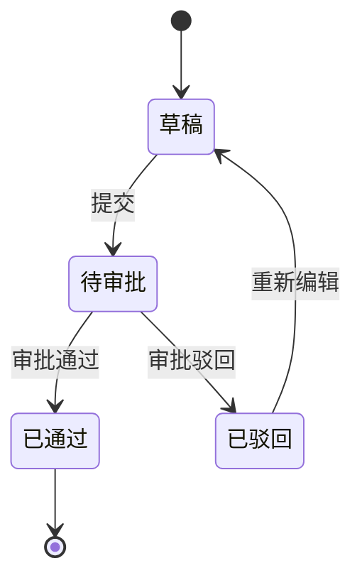

# 数据字典模板

> 本模板用于规范 PMS / SPMS 数据库表的数据字典编写。使用时请将 `<...>` 占位符替换为实际内容。

---

## 1. 表基本信息

- **表名**：`<如 t_spare_apply>`
- **表注释/业务含义**：`<如 备件申请单主表>`
- **所属数据库**：`<如 MySQL dppms_d365 / SQL Server AXDB>`
- **所属模块**：`<如 SPMS-spare / PMS-struts>`
- **存储引擎**：`<如 InnoDB>`
- **字符集**：`<如 utf8mb4>`

## 2. 字段列表

| 字段名 | 数据类型 | 长度 | 是否可空 | 默认值 | 约束 | 业务含义 |
|--------|----------|------|----------|--------|------|----------|
| `id` | BIGINT | 20 | 否 | - | 主键，自增 | 主键 ID |
| `<field>` | `<VARCHAR/INT/...>` | `<长度>` | `<是/否>` | `<默认值>` | `<PK/UK/FK/INDEX/NOT NULL>` | `<业务含义>` |
| `create_time` | DATETIME | - | 否 | CURRENT_TIMESTAMP | - | 创建时间 |
| `update_time` | DATETIME | - | 是 | - | - | 更新时间 |
| `create_by` | VARCHAR | 64 | 是 | - | - | 创建人 |
| `is_deleted` | TINYINT | 1 | 否 | 0 | - | 逻辑删除标识：0-未删除，1-已删除 |

## 3. 索引列表

| 索引名 | 类型 | 字段 | 使用场景 | 性能影响 |
|--------|------|------|----------|----------|
| `PRIMARY` | 主键索引 | `id` | 主键查询 | - |
| `idx_<field>` | 普通索引 | `<field>` | `<如 按业务编号查询>` | `<如 写入略有开销，查询显著提升>` |
| `uk_<field>` | 唯一索引 | `<field>` | `<如 防止重复提交>` | `<插入时需校验唯一性>` |
| `idx_<f1>_<f2>` | 联合索引 | `<f1, f2>` | `<如 多条件列表查询>` | `<遵循最左前缀原则>` |

## 4. 表间关系

### 4.1 关系图

```mermaid
erDiagram
    <t_main> ||--o{ <t_detail> : "1:N <关系说明>"
    <t_main> }o--|| <t_dict> : "N:1 <关系说明>"
```

### 4.2 关系说明

| 主表 | 从表 | 关系类型 | 关联字段 | 说明 |
|------|------|----------|----------|------|
| `<t_main>` | `<t_detail>` | 一对多 | `<main.id = detail.main_id>` | `<业务说明>` |
| `<t_main>` | `<t_dict>` | 多对一 | `<main.type = dict.code>` | `<业务说明>` |

## 5. 数据生命周期

| 阶段 | 触发场景 | 操作 | 责任模块/接口 | 说明 |
|------|----------|------|----------------|------|
| 创建 | `<如 提交申请单>` | INSERT | `<XxxAction.create>` | `<初始状态、默认值说明>` |
| 修改 | `<如 审批通过/驳回>` | UPDATE | `<XxxAction.audit>` | `<状态流转说明>` |
| 归档 | `<如 年度归档>` | UPDATE / 归档表 | `<定时任务/手工>` | `<归档条件与策略>` |
| 删除 | `<如 撤销申请>` | 逻辑删除/物理删除 | `<XxxAction.delete>` | `<是否逻辑删除、保留策略>` |

## 6. 状态流转（如适用）



## 7. 备注

<补充说明：如数据量级、分库分表策略、历史数据迁移、与外部系统（MES/SAP/D365）的数据同步规则等。>

| 版本 | 日期 | 修改人 | 修改内容 |
|------|------|--------|----------|
| v1.0 | `<yyyy-MM-dd>` | `<作者>` | 初始版本 |
