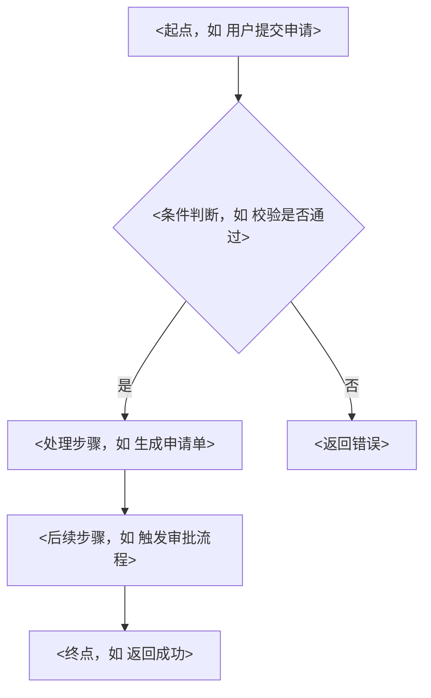
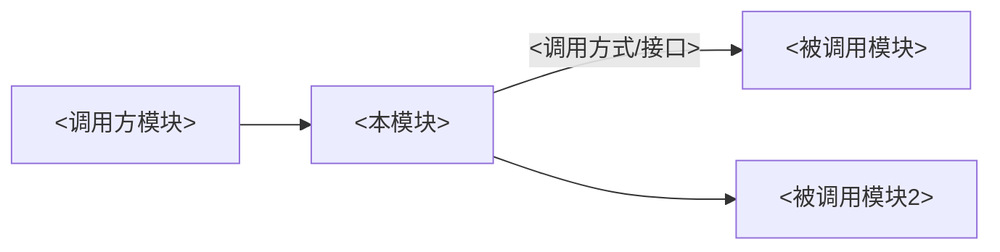

# 模块文档模板

> 本模板用于规范 PMS / SPMS 各模块功能说明文档的编写。使用时请将 `<...>` 占位符替换为实际内容。

---

## 1. 模块概述

- **模块名称**：`<如 PMS-struts / SPMS-spare>`
- **模块定位**：`<一句话描述模块在系统中的位置，如：Web 表现层，承载 Struts2 Action>`
- **核心职责**：
  - `<职责1>`
  - `<职责2>`
- **技术栈**：`<如 Struts2 2.5.30 + Spring 5.3.19 + MyBatis 3.5.9>`
- **JDK 版本**：`<如 JDK 1.8 / JavaSE-1.7>`

## 2. 包结构

```
<module-root>/
├── <src/main/java 或 src/>
│   └── com.dp.plat.<子包>/
│       ├── action/        # Action/Controller 层
│       ├── service/       # 业务逻辑层
│       ├── dao/           # 数据访问层
│       ├── model/         # 实体/DTO
│       └── mapping/       # MyBatis XML 映射（与 Java 同目录）
└── <config/ 或 src/main/resources/>
    └── <配置文件>
```

## 3. 核心类清单

| 类名 | 完整路径 | 职责 |
|------|----------|------|
| `<ClassName>` | `com.dp.plat.xxx.XxxAction` | `<职责说明>` |
| `<ClassName>` | `com.dp.plat.xxx.XxxService` | `<职责说明>` |
| `<ClassName>` | `com.dp.plat.xxx.XxxDao` | `<职责说明>` |

## 4. 业务流程



## 5. 接口清单

| Action/Controller 方法 | 请求路径 | 请求方法 | 功能说明 |
|------------------------|----------|----------|----------|
| `<XxxAction.list>` | `/<namespace>/list.action` | GET | `<分页查询列表>` |
| `<XxxAction.save>` | `/<namespace>/save.action` | POST | `<新增/更新>` |
| `<XxxAction.delete>` | `/<namespace>/delete.action` | POST | `<删除>` |

> 详细接口字段请参考 `interface-template.md` 单独编写接口文档。

## 6. 数据表关联

| 表名 | CRUD 操作 | 说明 |
|------|-----------|------|
| `<t_xxx>` | C / R / U | `<业务含义>` |
| `<t_yyy>` | R | `<关联查询用途>` |

## 7. 核心处理逻辑

```java
// <方法说明：如 备件申请单创建核心逻辑>
public Result createApply(ApplyDTO dto) {
    // 1. 参数校验
    // <校验逻辑说明>
    // 2. 业务规则校验（库存、权限等）
    // <规则说明>
    // 3. 持久化
    // <持久化说明>
    // 4. 触发后续流程（工作流/通知）
    // <后续处理说明>
    return Result.success();
}
```

## 8. 异常处理机制

- **全局异常处理**：`<如 Struts2 全局异常映射 / @ControllerAdvice>`
- **业务异常**：`<自定义异常类及抛出场景>`
- **错误码约定**：`<见接口文档错误码表>`

## 9. 关键算法与性能优化

- `<算法/优化点1，如：列表查询使用 Druid 连接池 + 索引优化>`
- `<算法/优化点2，如：批量操作避免 N+1 查询>`
- `<缓存策略，如适用>`

## 10. 模块间调用关系



- **依赖模块**：`<如 core、PMS-security>`
- **被依赖方**：`<如 PMS-springmvc 依赖本模块>`

## 11. 最佳实践与避坑指南

- `<避坑点1，如：PMS-struts 源码目录非标准 src/，配置在 config/>`
- `<避坑点2，如：MyBatis XML 与 Java 文件同目录，移动时需一并处理>`
- `<避坑点3，如：system 作用域依赖需手动维护 lib 下 jar>`

## 12. 变更记录

| 版本 | 日期 | 修改人 | 修改内容 |
|------|------|--------|----------|
| v1.0 | `<yyyy-MM-dd>` | `<作者>` | 初始版本 |
