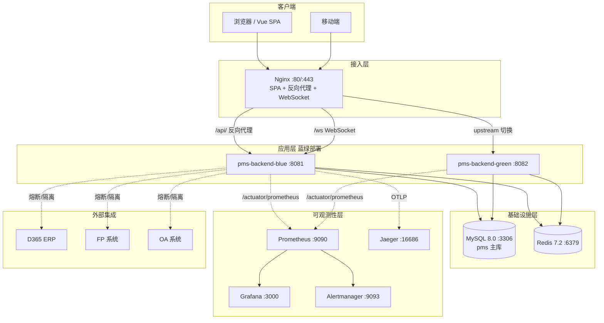
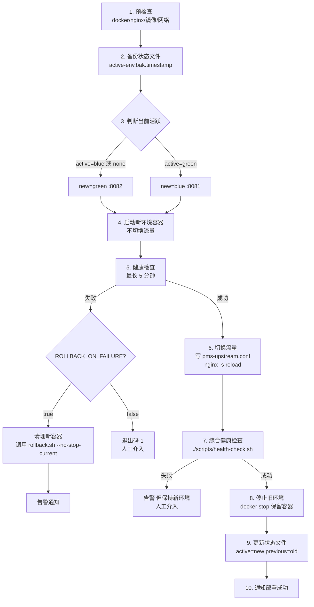

# 部署指南

> 网络设备工程项目管理系统（network-equipment-pms）生产部署完整手册。
> 涵盖系统架构、单机体验、生产部署、蓝绿发布、Kubernetes 指引与性能调优。

## 目录

1. [系统架构概览](#1-系统架构概览)
2. [环境要求](#2-环境要求)
3. [快速开始（5 分钟体验版）](#3-快速开始5-分钟体验版)
4. [生产部署完整流程](#4-生产部署完整流程)
5. [配置说明（.env 参数详解）](#5-配置说明env-参数详解)
6. [蓝绿部署流程](#6-蓝绿部署流程)
7. [回滚流程](#7-回滚流程)
8. [健康检查](#8-健康检查)
9. [Kubernetes 部署指引](#9-kubernetes-部署指引)
10. [性能调优建议](#10-性能调优建议)
11. [常见部署问题排查](#11-常见部署问题排查)

---

## 1. 系统架构概览

### 1.1 技术栈

| 层次 | 技术选型 | 说明 |
|------|----------|------|
| 前端 | Vue 3 + Element Plus + Vite | SPA，Nginx 托管静态资源 |
| 后端 | Spring Boot 3.2.5 + JDK 17 | 多模块 Maven 工程（pms-admin 主启动） |
| ORM | MyBatis-Plus 3.5.x | 含乐观锁、逻辑删除、分页插件 |
| 数据库 | MySQL 8.0.36 | 主数据存储，utf8mb4 |
| 缓存 | Redis 7.2 | 会话、限流计数、幂等键、字典缓存 |
| 工作流 | Flowable | 嵌入式引擎，与业务同库 |
| 可观测性 | Prometheus + Grafana + Alertmanager + Jaeger | 指标、告警、链路追踪 |
| 集成 | D365 / FP / OA（Resilience4j 熔断隔离） | OAuth2 client_credentials |
| 安全 | Spring Security + JWT + AES-256-GCM 字段加密 | Bearer Token 鉴权 |

### 1.2 架构图



### 1.3 组件职责

| 组件 | 镜像 / 来源 | 端口 | 职责 |
|------|-------------|------|------|
| `pms-mysql` | `mysql:8.0.36` | 3306 | 业务数据、Flowable 工作流数据 |
| `pms-redis` | `redis:7.2-alpine` | 6379 | 缓存、限流、幂等、分布式锁 |
| `pms-backend` | `Dockerfile.backend`（多阶段构建） | 8080（蓝绿 8081/8082） | 业务 API、工作流、集成调度 |
| `pms-frontend` | `Dockerfile.frontend`（Nginx + dist） | 80 | SPA 静态托管 + 反向代理 |
| `pms-prometheus` | `prom/prometheus:v2.51.0` | 9090 | 指标抓取与存储 |
| `pms-grafana` | `grafana/grafana:10.4.0` | 3000 | 仪表盘可视化 |
| `pms-alertmanager` | `prom/alertmanager:v0.27.0` | 9093 | 告警路由与通知 |
| `pms-jaeger` | `jaegertracing/all-in-one:1.55` | 16686 / 4317 / 4318 | 链路追踪 UI + OTLP 接收 |

### 1.4 三层 Compose 拆分

项目将部署拆为三个 docker-compose 文件，按职责分离：

| 文件 | 内容 | 启动顺序 |
|------|------|----------|
| `docker-compose.infra.yml` | MySQL + Redis（基础设施，长期运行） | 1 |
| `docker-compose.app.yml` | backend + frontend + mock 服务（应用层） | 2 |
| `docker-compose.observe.yml` | Prometheus + Grafana + Alertmanager + Jaeger（可观测性） | 3（可选） |

> **提示**：生产环境推荐蓝绿部署，应用层由 `scripts/deploy.sh` 通过 `docker run` 管理，而非 `docker-compose.app.yml` 直接 `up`。Compose 文件主要用于开发/测试与单机体验。

---

## 2. 环境要求

### 2.1 操作系统

| OS | 版本 | 架构 | 备注 |
|----|------|------|------|
| CentOS / RHEL | 7.9+ / 8.x / 9.x | x86_64 | 生产推荐，内核 ≥ 3.10 |
| Ubuntu Server | 20.04 LTS / 22.04 LTS | x86_64 | 开发/测试常用 |
| Rocky Linux | 8.x / 9.x | x86_64 | CentOS 替代 |
| Debian | 11 (Bullseye) / 12 (Bookworm) | x86_64 | 同上 |

### 2.2 软件版本要求

| 软件 | 最低版本 | 推荐版本 | 校验命令 |
|------|----------|----------|----------|
| Docker Engine | 20.10+ | 24.0+ | `docker version` |
| Docker Compose | v2.0+（plugin） | v2.20+ | `docker compose version` |
| JDK | 17（构建期） | 17.0.10+ | `java -version` |
| Maven | 3.8+（构建期） | 3.9.6 | `mvn -version` |
| Node.js | 18+（前端构建） | 20 LTS | `node -v` |
| MySQL Client | 8.0+ | 8.0.36 | `mysql --version` |
| Redis CLI | 6.0+ | 7.2 | `redis-cli --version` |
| Nginx | 1.20+ | 1.24+ | `nginx -v` |

> **注意**：项目使用 `docker-compose.yml` 顶级 `version: '3.8'` 字段，Docker Compose v2 已不再需要该字段但仍兼容。运行期仅需 Docker，无需在宿主安装 JDK/Maven/Node。

### 2.3 硬件资源建议

| 部署规模 | CPU | 内存 | 磁盘 | 适用场景 |
|----------|-----|------|------|----------|
| 单机体验 | 2C | 4G | 20G SSD | 本地试用 / Demo |
| 小型生产（≤200 用户） | 4C | 8G | 100G SSD | 单机全栈 |
| 中型生产（200~1000 用户） | 8C | 16G | 200G SSD | 应用与 DB 分离 |
| 大型生产（>1000 用户） | 16C+ | 32G+ | 500G+ SSD | 多节点 + 读写分离 |

> **磁盘说明**：含 MySQL 数据、Redis 持久化、日志、备份。生产建议数据盘独立挂载，备份盘独立。

### 2.4 网络与端口

| 端口 | 协议 | 用途 | 是否对外暴露 |
|------|------|------|--------------|
| 80 | HTTP | 前端 Nginx | 是（建议经负载均衡） |
| 443 | HTTPS | 前端 Nginx（TLS） | 是 |
| 8081 | HTTP | backend blue（蓝绿） | 否（仅本机） |
| 8082 | HTTP | backend green（蓝绿） | 否（仅本机） |
| 3306 | TCP | MySQL | 否（仅内网） |
| 6379 | TCP | Redis | 否（仅内网） |
| 9090 | HTTP | Prometheus | 否（仅运维网） |
| 3000 | HTTP | Grafana | 运维网或经反代 |
| 9093 | HTTP | Alertmanager | 否（仅运维网） |
| 16686 | HTTP | Jaeger UI | 运维网或经反代 |
| 4317 / 4318 | gRPC / HTTP | Jaeger OTLP 接收 | 否（仅内网） |

---

## 3. 快速开始（5 分钟体验版）

### 3.1 前置条件

已安装 Docker 与 Docker Compose v2，且当前用户具备 docker 组权限。

```bash
docker version && docker compose version
```

### 3.2 一键启动

```bash
# 1. 克隆项目
git clone <repo-url> network-equipment-pms
cd network-equipment-pms

# 2. 准备环境变量（使用示例默认值，仅用于体验）
cp .env.example .env

# 3. 启动基础设施 + 应用（一条命令）
docker compose -f docker-compose.infra.yml -f docker-compose.app.yml up -d

# 4. 查看启动状态
docker compose -f docker-compose.infra.yml -f docker-compose.app.yml ps
```

### 3.3 验证服务

```bash
# 等待约 60s 让应用启动完成后，执行健康检查
curl -s http://localhost:8080/actuator/health | jq .

# 期望输出：
# { "status": "UP" }

# 访问前端
# 浏览器打开 http://localhost  （默认账号见 sys_user 表初始化脚本）
```

### 3.4 体验可观测性（可选）

```bash
docker compose -f docker-compose.observe.yml up -d
# Grafana：http://localhost:3000  账号 admin / 密码见 .env 的 GRAFANA_ADMIN_PASSWORD
# Jaeger：http://localhost:16686
# Prometheus：http://localhost:9090
```

### 3.5 停止与清理

```bash
# 停止应用与基础设施
docker compose -f docker-compose.infra.yml -f docker-compose.app.yml down

# 停止并删除数据卷（⚠️ 会清空所有数据，仅体验环境使用）
docker compose -f docker-compose.infra.yml -f docker-compose.app.yml down -v
```

---

## 4. 生产部署完整流程

### 4.1 准备工作

#### 4.1.1 服务器规划

| 角色 | 主机名示例 | 配置 | 数量 | 说明 |
|------|-----------|------|------|------|
| 应用+DB 合一 | pms-app-01 | 8C/16G/200G | 1 | 小型生产 |
| 应用服务器 | pms-app-01/02 | 8C/16G/100G | 2 | 中型，负载均衡 |
| DB 服务器 | pms-db-01 | 8C/32G/500G | 1+1 | 主从 |
| 可观测性服务器 | pms-obs-01 | 4C/8G/200G | 1 | 独立部署 |

#### 4.1.2 域名与证书

| 域名 | 用途 | 证书要求 |
|------|------|----------|
| `pms.example.com` | 主站 | 通配符或单域名证书，HTTPS |
| `grafana.example.com` | Grafana（可选） | 同上 |
| `jaeger.example.com` | Jaeger（可选） | 同上 |

> SSL 证书可通过 Let's Encrypt（certbot）或企业 CA 签发。Nginx 配置 TLS 1.2/1.3。

#### 4.1.3 基础软件安装

```bash
# CentOS / RHEL
sudo yum install -y yum-utils
sudo yum-config-manager --add-repo https://download.docker.com/linux/centos/docker-ce.repo
sudo yum install -y docker-ce docker-ce-cli containerd.io docker-compose-plugin
sudo systemctl enable --now docker

# Ubuntu / Debian
sudo apt-get update
sudo apt-get install -y ca-certificates curl gnupg
sudo install -m 0755 -d /etc/apt/keyrings
curl -fsSL https://download.docker.com/linux/ubuntu/gpg | sudo gpg --dearmor -o /etc/apt/keyrings/docker.gpg
echo "deb [arch=amd64 signed-by=/etc/apt/keyrings/docker.gpg] https://download.docker.com/linux/ubuntu $(lsb_release -cs) stable" | sudo tee /etc/apt/sources.list.d/docker.list
sudo apt-get update
sudo apt-get install -y docker-ce docker-ce-cli containerd.io docker-compose-plugin

# 宿主 Nginx（用于蓝绿 upstream 切换）
sudo yum install -y nginx    # CentOS
sudo apt install -y nginx    # Ubuntu

# MySQL / Redis 客户端（health-check.sh 需要）
sudo yum install -y mysql redis    # CentOS
sudo apt install -y mysql-client redis-tools    # Ubuntu
```

#### 4.1.4 部署用户与目录

```bash
# 创建专用部署用户
sudo useradd -m -s /bin/bash deploy
sudo usermod -aG docker deploy

# 配置 sudo 免密（仅 docker / nginx 相关命令）
echo "deploy ALL=(ALL) NOPASSWD: /usr/bin/docker, /usr/sbin/nginx" | sudo tee /etc/sudoers.d/deploy

# 创建项目与状态目录
sudo mkdir -p /opt/pms /var/lib/pms /data/backups/pms
sudo chown -R deploy:deploy /opt/pms /var/lib/pms /data/backups/pms
```

### 4.2 基础设施部署

#### 4.2.1 配置 .env

```bash
cd /opt/pms
cp .env.example .env
vim .env
```

生产 `.env` 必须修改的项（详见 [§5](#5-配置说明env-参数详解)）：

```bash
MYSQL_ROOT_PASSWORD=<强随机密码>
MYSQL_PASSWORD=<强随机密码>
REDIS_PASSWORD=<强随机密码>
APP_ENCRYPT_KEY=<Base64 编码的 32 字节密钥>
JWT_SECRET=<至少 32 字符的随机串>
SPRING_PROFILES_ACTIVE=prod
GRAFANA_ADMIN_PASSWORD=<强随机密码>
```

生成密钥的命令：

```bash
# APP_ENCRYPT_KEY（AES-256-GCM，32 字节 Base64）
openssl rand -base64 32

# JWT_SECRET（64 字符随机串）
openssl rand -base64 48 | tr -d '/+=' | head -c 64

# MySQL / Redis 密码
openssl rand -base64 24 | tr -d '/+=' | head -c 24
```

#### 4.2.2 启动 MySQL + Redis

```bash
docker compose -f docker-compose.infra.yml up -d

# 验证健康
docker compose -f docker-compose.infra.yml ps
# 两个服务均应为 healthy

# 验证 MySQL
docker exec pms-mysql mysql -uroot -p"$MYSQL_ROOT_PASSWORD" -e "SHOW DATABASES;"

# 验证 Redis
docker exec pms-redis redis-cli -a "$REDIS_PASSWORD" PING
# 期望：PONG
```

> **提示**：MySQL 容器首次启动会执行 `scripts/init-db.sh`（挂载到 `/docker-entrypoint-initdb.d/`），用于初始化数据库与权限。Schema 由后端 Flyway（`db/migration`）在应用启动时自动迁移。

### 4.3 应用部署（蓝绿模式）

生产推荐使用蓝绿部署脚本，而非 `docker-compose.app.yml up`。

#### 4.3.1 构建并推送镜像

通过 CI/CD（`.github/workflows/deploy.yml`）自动构建并推送到 GHCR；也可手动构建：

```bash
# 后端镜像
docker build -f Dockerfile.backend -t ghcr.io/org/network-equipment-pms/pms-backend:v1.0.0 .

# 前端镜像
docker build -f Dockerfile.frontend -t ghcr.io/org/network-equipment-pms/pms-frontend:v1.0.0 .
```

#### 4.3.2 配置宿主 Nginx 边缘代理

```nginx
# /etc/nginx/conf.d/pms.conf
include /etc/nginx/conf.d/pms-upstream.conf;   # 由 deploy.sh 自动生成

server {
    listen 80;
    server_name pms.example.com;
    return 301 https://$host$request_uri;
}

server {
    listen 443 ssl http2;
    server_name pms.example.com;

    ssl_certificate     /etc/nginx/ssl/pms.example.com.crt;
    ssl_certificate_key /etc/nginx/ssl/pms.example.com.key;
    ssl_protocols       TLSv1.2 TLSv1.3;
    ssl_ciphers         HIGH:!aNULL:!MD5;

    # 安全头（与前端 nginx.conf 一致）
    add_header X-Frame-Options "SAMEORIGIN" always;
    add_header X-Content-Type-Options "nosniff" always;
    add_header Strict-Transport-Security "max-age=31536000; includeSubDomains" always;

    client_max_body_size 100m;   # 文件上传上限

    # API 反向代理到蓝绿 upstream
    location /api/ {
        proxy_pass http://pms_backend/api/;
        proxy_set_header Host $host;
        proxy_set_header X-Real-IP $remote_addr;
        proxy_set_header X-Forwarded-For $proxy_add_x_forwarded_for;
        proxy_set_header X-Forwarded-Proto $scheme;
        proxy_read_timeout 120s;
    }

    # WebSocket
    location /ws {
        proxy_pass http://pms_backend/ws;
        proxy_http_version 1.1;
        proxy_set_header Upgrade $http_upgrade;
        proxy_set_header Connection "upgrade";
        proxy_set_header Host $host;
        proxy_read_timeout 3600s;
    }

    # 前端静态资源（前端容器 :80）
    location / {
        proxy_pass http://127.0.0.1:80;
        proxy_set_header Host $host;
    }
}
```

#### 4.3.3 启动前端容器

```bash
docker run -d --name pms-frontend \
  --network pms-network \
  -p 80:80 \
  --restart unless-stopped \
  ghcr.io/org/network-equipment-pms/pms-frontend:v1.0.0
```

#### 4.3.4 执行首次蓝绿部署

```bash
# 首次部署：active=none → 部署到 blue
IMAGE_TAG=v1.0.0 ./scripts/deploy.sh

# 查看状态
cat /var/lib/pms/active-env
# 期望：active=blue

# 综合健康检查
./scripts/health-check.sh
```

详细蓝绿流程见 [§6](#6-蓝绿部署流程)。

### 4.4 可观测性部署

```bash
# 启动可观测性栈
docker compose -f docker-compose.observe.yml up -d

# 验证
docker compose -f docker-compose.observe.yml ps

# Prometheus 抓取目标状态
curl -s http://localhost:9090/api/v1/targets | jq '.data.activeTargets[].health'
# 期望：所有目标为 "up"
```

可观测性组件细节见 [运维手册 - 监控告警](./operations.md#监控告警)。

### 4.5 部署后验证清单

```bash
# 1. 基础设施健康
docker compose -f docker-compose.infra.yml ps

# 2. 应用健康
curl -s https://pms.example.com/actuator/health | jq .

# 3. 蓝绿状态
cat /var/lib/pms/active-env

# 4. 综合健康检查脚本
./scripts/health-check.sh

# 5. Nginx upstream 指向
cat /etc/nginx/conf.d/pms-upstream.conf

# 6. Prometheus 抓取
curl -s http://localhost:9090/api/v1/targets | jq '.data.activeTargets | length'

# 7. 业务接口冒烟
curl -s https://pms.example.com/api/auth/captcha | jq .
```

---

## 5. 配置说明（.env 参数详解）

`.env.example` 定义全部可配置参数。下表按分组列出，所有值均通过环境变量覆盖 Spring 配置（`${VAR:default}` 占位符）。

### 5.1 MySQL 配置

| 变量 | 默认值 | 必填 | 说明 |
|------|--------|------|------|
| `MYSQL_ROOT_PASSWORD` | `changeme_root` | ✅ 生产必改 | MySQL root 密码，仅初始化与运维使用 |
| `MYSQL_DATABASE` | `pms` | 否 | 业务数据库名，与 Flyway 迁移一致 |
| `MYSQL_USER` | `pms` | 否 | 业务账号（非 root） |
| `MYSQL_PASSWORD` | `changeme_pms` | ✅ 生产必改 | 业务账号密码 |
| `MYSQL_PORT` | `3306` | 否 | 宿主映射端口（生产建议不暴露，仅容器内通信） |

### 5.2 Redis 配置

| 变量 | 默认值 | 必填 | 说明 |
|------|--------|------|------|
| `REDIS_PASSWORD` | `changeme_redis` | ✅ 生产必改 | Redis 访问密码 |
| `REDIS_PORT` | `6379` | 否 | 宿主映射端口 |

> Redis 容器启动参数固定 `--maxmemory 256mb --maxmemory-policy allkeys-lru`。生产如需更大容量，修改 `docker-compose.infra.yml` 的 `command`。

### 5.3 应用配置

| 变量 | 默认值 | 必填 | 说明 |
|------|--------|------|------|
| `SPRING_PROFILES_ACTIVE` | `prod` | 否 | Spring profile，生产用 `prod`（关闭 Swagger） |
| `APP_ENCRYPT_KEY` | （空） | ✅ 生产必填 | AES-256-GCM 字段加密密钥，Base64 编码 32 字节。**配置后无法更改**（否则历史加密数据不可解密） |
| `JWT_SECRET` | `your_jwt_secret_key_at_least_32_chars_long` | ✅ 生产必改 | JWT 签名密钥，≥32 字符。**轮换会使所有已签发 Token 失效** |
| `BACKEND_PORT` | `8080` | 否 | 单实例模式宿主端口（蓝绿模式不使用） |
| `FRONTEND_PORT` | `80` | 否 | 前端容器宿主端口 |

### 5.4 Mock 服务（仅开发/测试）

| 变量 | 默认值 | 说明 |
|------|--------|------|
| `MOCK_D365_PORT` | `8090` | D365 mock 服务端口，`--profile mock` 启用 |
| `MOCK_FP_PORT` | `8091` | FP mock 服务端口 |
| `MOCK_OA_PORT` | `8092` | OA mock 服务端口 |

### 5.5 可观测性端口

| 变量 | 默认值 | 说明 |
|------|--------|------|
| `PROMETHEUS_PORT` | `9090` | Prometheus UI |
| `GRAFANA_PORT` | `3000` | Grafana UI |
| `GRAFANA_ADMIN_PASSWORD` | `changeme_grafana` | Grafana admin 登录密码 |
| `ALERTMANAGER_PORT` | `9093` | Alertmanager UI |
| `JAEGER_UI_PORT` | `16686` | Jaeger UI |
| `JAEGER_GRPC_PORT` | `4317` | OTLP gRPC 接收 |
| `JAEGER_HTTP_PORT` | `4318` | OTLP HTTP 接收 |

### 5.6 外部集成（D365 / FP / OA）

| 变量 | 说明 |
|------|------|
| `D365_API_BASE_URL` / `FP_API_BASE_URL` / `OA_API_BASE_URL` | 外部系统 API 基址 |
| `D365_OAUTH_TOKEN_URL` / `FP_OAUTH_TOKEN_URL` / `OA_OAUTH_TOKEN_URL` | OAuth2 token 端点 |
| `D365_OAUTH_CLIENT_ID` / `FP_OAUTH_CLIENT_ID` / `OA_OAUTH_CLIENT_ID` | OAuth2 client_id |
| `D365_OAUTH_CLIENT_SECRET` / `FP_OAUTH_CLIENT_SECRET` / `OA_OAUTH_CLIENT_SECRET` | OAuth2 client_secret（敏感） |

> 集成采用 `client_credentials` grant type。Resilience4j 配置（熔断/隔离/限流/重试）见 `application.yml`，无需在 `.env` 配置。

### 5.7 蓝绿部署脚本变量（deploy.sh / rollback.sh / health-check.sh）

| 变量 | 默认值 | 说明 |
|------|--------|------|
| `REGISTRY` | `ghcr.io` | 镜像仓库域名 |
| `IMAGE_REPO` | `${REGISTRY}/network-equipment-pms/pms-backend` | 镜像仓库地址 |
| `IMAGE_TAG` | `latest` | 部署镜像 tag |
| `BLUE_CONTAINER` / `GREEN_CONTAINER` | `pms-backend-blue` / `pms-backend-green` | 蓝绿容器名 |
| `BLUE_PORT` / `GREEN_PORT` | `8081` / `8082` | 蓝绿宿主端口 |
| `STATE_DIR` / `STATE_FILE` | `/var/lib/pms` / `active-env` | 蓝绿状态文件目录与路径 |
| `NGINX_UPSTREAM_CONF` | `/etc/nginx/conf.d/pms-upstream.conf` | Nginx upstream 配置路径 |
| `NGINX_CONTAINER` | （空） | 容器化 nginx 名；留空则用宿主 nginx |
| `NGINX_UPSTREAM_NAME` | `pms_backend` | upstream 块名 |
| `HEALTH_CHECK_URL` | `http://localhost:8080/actuator/health` | 健康检查端点 |
| `HEALTH_CHECK_TIMEOUT` | `300` | 健康检查超时（秒） |
| `HEALTH_CHECK_INTERVAL` | `5` | 重试间隔（秒） |
| `TRAFFIC_SWITCH_WAIT` | `30` | 流量切换后等待（秒） |
| `ROLLBACK_ON_FAILURE` | `true` | 部署失败是否自动回滚 |
| `JAVA_OPTS` | `-Xms512m -Xmx2g -XX:MaxMetaspaceSize=256m -XX:+UseG1GC ...` | JVM 参数 |
| `DOCKER_NETWORK` | （自动检测） | Docker 网络名 |
| `OTEL_ENDPOINT` | `http://jaeger:4317` | OpenTelemetry OTLP 端点 |
| `NOTIFY_WEBHOOK` | （空） | 通知 webhook URL |

---

## 6. 蓝绿部署流程

### 6.1 原理

维护两套完全相同的应用环境（blue / green），任意时刻只有一套对外提供服务。新版本部署到非活跃环境，验证通过后再切换流量，实现**零停机**发布。

### 6.2 蓝绿环境映射

| 环境 | 容器名 | 宿主端口 | 内部端口 |
|------|--------|----------|----------|
| blue | `pms-backend-blue` | 8081 | 8080 |
| green | `pms-backend-green` | 8082 | 8080 |

### 6.3 部署流程图



### 6.4 deploy.sh 使用

```bash
# 部署 latest 镜像
./scripts/deploy.sh

# 部署指定 tag（推荐生产）
IMAGE_TAG=v1.2.3 ./scripts/deploy.sh

# 部署失败不自动回滚（用于调试）
ROLLBACK_ON_FAILURE=false ./scripts/deploy.sh

# 指定私有仓库
IMAGE_REPO=registry.internal.com/pms-backend IMAGE_TAG=v1.2.3 ./scripts/deploy.sh

# 覆盖完整镜像地址（绕过 IMAGE_REPO/IMAGE_TAG 组合）
BACKEND_IMAGE=registry.internal.com/pms-backend:v1.2.3 ./scripts/deploy.sh
```

**关键行为：**
- 首次部署：`active=none` → 部署到 blue
- 健康检查超时 5 分钟（`HEALTH_CHECK_TIMEOUT=300`）
- 旧容器**停止但保留**（`docker stop`，不 `docker rm`），便于秒级回滚
- 失败时若 `ROLLBACK_ON_FAILURE=true`，自动调用 `rollback.sh --no-stop-current`
- 流量切换后等待 `TRAFFIC_SWITCH_WAIT`（默认 30s）再继续

### 6.5 状态文件

`/var/lib/pms/active-env`：

```
# PMS 蓝绿部署状态文件（由 deploy.sh 维护，请勿手动编辑）
updated=2026-07-06T10:30:00Z
active=green
previous=blue
active_image=ghcr.io/org/network-equipment-pms/pms-backend:v1.2.3
previous_image=ghcr.io/org/network-equipment-pms/pms-backend:v1.2.2
```

---

## 7. 回滚流程

### 7.1 rollback.sh 使用

```bash
# 蓝绿互换（秒级回滚，零额外构建）
./scripts/rollback.sh

# 回滚到指定镜像 tag
./scripts/rollback.sh v1.0.5

# 回滚后保留当前容器（调试用，不停止）
./scripts/rollback.sh --keep-current

# 仅切换流量，不停止当前（deploy.sh 失败时自动调用）
./scripts/rollback.sh --no-stop-current

# 演练模式（仅打印动作，不实际执行）
./scripts/rollback.sh --dry-run
```

### 7.2 回滚策略

| 策略 | 命令 | 适用场景 | 耗时 |
|------|------|----------|------|
| 蓝绿互换 | `./scripts/rollback.sh` | 上线后发现业务异常，旧容器仍保留 | 秒级 |
| 指定 tag | `./scripts/rollback.sh v1.0.5` | 旧容器已被删除，需拉取历史镜像 | 分钟级（含拉取） |
| 仅切流量 | `./scripts/rollback.sh --no-stop-current` | deploy.sh 失败自动调用 | 秒级 |
| 演练 | `./scripts/rollback.sh --dry-run` | 验证回滚逻辑 | 即时 |

### 7.3 回滚失败处理

若回滚目标健康检查也失败，**当前活跃环境不受影响**（rollback.sh 不会停止当前环境）。此时需人工介入：

```bash
# 查看两个环境状态
docker ps -a | grep pms-backend
docker logs --tail 100 pms-backend-blue
docker logs --tail 100 pms-backend-green
cat /var/lib/pms/active-env

# 紧急启动一个已知可用镜像
docker run -d --name pms-backend-emergency \
  --network pms-network -p 8080:8080 \
  ghcr.io/org/network-equipment-pms/pms-backend:v1.0.0

# 手动切换 nginx upstream
echo 'upstream pms_backend { server 127.0.0.1:8080 max_fails=3 fail_timeout=30s; keepalive 32; }' \
  | sudo tee /etc/nginx/conf.d/pms-upstream.conf
sudo nginx -s reload
```

---

## 8. 健康检查

### 8.1 health-check.sh 使用

```bash
# 默认检查 localhost:8080
./scripts/health-check.sh

# 检查指定端口（如检查 blue 环境）
HEALTH_CHECK_URL=http://localhost:8081/actuator/health \
API_BASE_URL=http://localhost:8081 \
./scripts/health-check.sh

# 自定义 MySQL/Redis 连接
MYSQL_HOST=10.0.0.1 MYSQL_PASSWORD=xxx \
REDIS_HOST=10.0.0.1 REDIS_PASSWORD=yyy \
./scripts/health-check.sh
```

### 8.2 检查项

| # | 检查项 | 检查方式 | 失败影响 |
|---|--------|----------|----------|
| 1 | Actuator `/actuator/health` | HTTP GET | 服务不可用 |
| 2 | 登录验证码 `/api/auth/captcha` | HTTP GET | 业务接口不可用 |
| 3 | 项目列表 `/api/project/list` | HTTP GET（401/403 视为在线） | 业务接口不可用 |
| 4 | MySQL 连接 + 关键表行数 | `mysql -e "SELECT COUNT(*)"` | 数据库不可用 |
| 5 | Redis PING | `redis-cli PING` | 缓存不可用 |
| 6 | 磁盘空间（阈值 90%） | `df` | 可能导致服务崩溃 |
| 7 | 内存使用（阈值 90%） | `free` | 可能 OOM |

- 退出码：`0` 全部通过，`1` 至少一项失败
- 关键业务表：`pms_project`、`pms_asset`、`sys_user`

### 8.3 Docker 内置 HEALTHCHECK

`Dockerfile.backend` 已配置：

```dockerfile
HEALTHCHECK --interval=30s --timeout=10s --start-period=60s --retries=3 \
  CMD curl -f http://localhost:8080/actuator/health || exit 1
```

可通过 `docker inspect pms-backend-blue --format='{{.State.Health.Status}}'` 查看。

---

## 9. Kubernetes 部署指引

> 本节提供 Helm Chart 设计思路与关键 manifest 片段，不要求完整实现。生产 K8s 部署需根据集群实际情况调整。

### 9.1 Helm Chart 结构建议

```
pms-helm/
├── Chart.yaml
├── values.yaml              # 全局可配置参数
├── values-prod.yaml         # 生产环境覆盖
├── templates/
│   ├── _helpers.tpl
│   ├── backend-deployment.yaml
│   ├── backend-service.yaml
│   ├── backend-hpa.yaml
│   ├── backend-configmap.yaml
│   ├── backend-secret.yaml
│   ├── frontend-deployment.yaml
│   ├── frontend-service.yaml
│   ├── ingress.yaml
│   ├── mysql-statefulset.yaml     # 或使用外部 Operator
│   ├── redis-statefulset.yaml     # 或使用外部 Operator
│   ├── prometheus-servicemonitor.yaml
│   └── networkpolicy.yaml
```

### 9.2 后端 Deployment（关键片段）

```yaml
apiVersion: apps/v1
kind: Deployment
metadata:
  name: pms-backend
  labels:
    app: pms-backend
spec:
  replicas: 3
  strategy:
    type: RollingUpdate
    rollingUpdate:
      maxSurge: 1
      maxUnavailable: 0
  selector:
    matchLabels:
      app: pms-backend
  template:
    metadata:
      labels:
        app: pms-backend
      annotations:
        prometheus.io/scrape: "true"
        prometheus.io/path: "/actuator/prometheus"
        prometheus.io/port: "8080"
    spec:
      securityContext:
        runAsNonRoot: true
        runAsUser: 1000
        fsGroup: 1000
      containers:
        - name: backend
          image: ghcr.io/org/network-equipment-pms/pms-backend:v1.2.3
          ports:
            - containerPort: 8080
          envFrom:
            - configMapRef:
                name: pms-backend-config
            - secretRef:
                name: pms-backend-secret
          resources:
            requests:
              cpu: 1000m
              memory: 1Gi
            limits:
              cpu: 2000m
              memory: 2Gi
          readinessProbe:
            httpGet:
              path: /actuator/health/readiness
              port: 8080
            initialDelaySeconds: 60
            periodSeconds: 10
          livenessProbe:
            httpGet:
              path: /actuator/health/liveness
              port: 8080
            initialDelaySeconds: 120
            periodSeconds: 20
          volumeMounts:
            - name: logs
              mountPath: /app/logs
      volumes:
        - name: logs
          emptyDir: {}
```

### 9.3 HPA（水平自动扩缩）

```yaml
apiVersion: autoscaling/v2
kind: HorizontalPodAutoscaler
metadata:
  name: pms-backend-hpa
spec:
  scaleTargetRef:
    apiVersion: apps/v1
    kind: Deployment
    name: pms-backend
  minReplicas: 3
  maxReplicas: 10
  metrics:
    - type: Resource
      resource:
        name: cpu
        target:
          type: Utilization
          averageUtilization: 70
    - type: Resource
      resource:
        name: memory
        target:
          type: Utilization
          averageUtilization: 80
```

### 9.4 Ingress（TLS + 路由）

```yaml
apiVersion: networking.k8s.io/v1
kind: Ingress
metadata:
  name: pms-ingress
  annotations:
    nginx.ingress.kubernetes.io/proxy-body-size: "100m"
    nginx.ingress.kubernetes.io/proxy-read-timeout: "120"
    nginx.ingress.kubernetes.io/websocket-services: "pms-backend"
spec:
  tls:
    - hosts: [pms.example.com]
      secretName: pms-tls
  rules:
    - host: pms.example.com
      http:
        paths:
          - path: /api/
            pathType: Prefix
            backend:
              service:
                name: pms-backend
                port: { number: 8080 }
          - path: /ws
            pathType: Prefix
            backend:
              service:
                name: pms-backend
                port: { number: 8080 }
          - path: /
            pathType: Prefix
            backend:
              service:
                name: pms-frontend
                port: { number: 80 }
```

### 9.5 K8s vs Docker Compose 决策

| 维度 | Docker Compose + 蓝绿 | Kubernetes |
|------|----------------------|------------|
| 适用规模 | 单机 / 小型 | 多节点 / 中大型 |
| 高可用 | 蓝绿双实例，单机故障即不可用 | 多副本 + 节点调度，单节点故障自愈 |
| 弹性伸缩 | 手动 | HPA 自动 |
| 滚动发布 | 蓝绿脚本 | 原生 RollingUpdate |
| 运维成本 | 低 | 高（需 K8s 运维能力） |
| 推荐场景 | ≤500 用户 | >500 用户或需高可用 |

---

## 10. 性能调优建议

### 10.1 JVM 参数

`Dockerfile.backend` 默认：

```
-Xms512m -Xmx2g -XX:MaxMetaspaceSize=256m -XX:+UseG1GC
-XX:+HeapDumpOnOutOfMemoryError -XX:HeapDumpPath=/app/logs/
-Djava.security.egd=file:/dev/./urandom
```

生产调优建议（通过 `JAVA_OPTS` 环境变量覆盖）：

```bash
# 4G 内存容器
JAVA_OPTS="-Xms2g -Xmx2g -XX:MaxMetaspaceSize=256m \
  -XX:+UseG1GC -XX:MaxGCPauseMillis=200 \
  -XX:+HeapDumpOnOutOfMemoryError -XX:HeapDumpPath=/app/logs/ \
  -XX:+PrintGCDetails -Xlog:gc*:file=/app/logs/gc.log:time,uptime:filecount=10,filesize=50m \
  -Djava.security.egd=file:/dev/./urandom \
  -XX:+ExitOnOutOfMemoryError"
```

| 参数 | 作用 | 推荐值 |
|------|------|--------|
| `-Xms` / `-Xmx` | 初始/最大堆 | 设为相同值，避免动态扩缩开销；容器内存的 50~60% |
| `-XX:+UseG1GC` | G1 收集器 | 适用于 4G+ 堆，低暂停 |
| `-XX:MaxGCPauseMillis` | 目标 GC 暂停 | 200ms |
| `-XX:+HeapDumpOnOutOfMemoryError` | OOM 时自动堆转储 | 必开 |
| `-XX:+ExitOnOutOfMemoryError` | OOM 时立即退出（由容器重启） | 生产推荐 |
| `-Djava.security.egd` | 加速 SecureRandom | 必开，避免启动慢 |

### 10.2 MySQL 调优

`docker-compose.infra.yml` 默认未挂载自定义 `my.cnf`。生产建议挂载：

```ini
# /opt/pms/config/mysql/my.cnf
[mysqld]
# 字符集
character-set-server=utf8mb4
collation-server=utf8mb4_unicode_ci

# InnoDB（按 16G 内存服务器调优）
innodb_buffer_pool_size=8G            # 物理内存 50~60%
innodb_log_file_size=1G
innodb_log_buffer_size=64M
innodb_flush_log_at_trx_commit=2      # 性能与可靠性折衷
innodb_flush_method=O_DIRECT

# 连接
max_connections=500
wait_timeout=600
interactive_timeout=600

# 慢查询
slow_query_log=1
slow_query_log_file=/var/lib/mysql/slow.log
long_query_time=1

# binlog（备份恢复需要）
log_bin=mysql-bin
binlog_format=ROW
expire_logs_days=7
server_id=1
```

挂载方式：

```yaml
# docker-compose.infra.yml 的 mysql 服务追加
volumes:
  - ./config/mysql/my.cnf:/etc/mysql/conf.d/my.cnf:ro
```

### 10.3 Redis 调优

```yaml
# docker-compose.infra.yml 的 redis command 调整
command: >
  redis-server
  --requirepass ${REDIS_PASSWORD}
  --maxmemory 1gb
  --maxmemory-policy allkeys-lru
  --appendonly yes
  --appendfsync everysec
  --save 900 1
  --save 300 10
  --save 60 10000
```

| 参数 | 作用 | 推荐值 |
|------|------|--------|
| `maxmemory` | 最大内存 | 容器内存 80% |
| `maxmemory-policy` | 淘汰策略 | `allkeys-lru`（缓存场景） |
| `appendonly` | AOF 持久化 | `yes`（生产推荐，RDB + AOF 双持久化） |
| `appendfsync` | AOF 刷盘策略 | `everysec`（性能与可靠性折衷） |

### 10.4 Nginx 调优

```nginx
# /etc/nginx/nginx.conf 的 events / http 段
worker_processes auto;
worker_rlimit_nofile 65535;

events {
    worker_connections 10240;
    use epoll;
    multi_accept on;
}

http {
    sendfile on;
    tcp_nopush on;
    tcp_nodelay on;
    keepalive_timeout 65;
    keepalive_requests 100;
    server_tokens off;
    client_max_body_size 100m;
    client_body_buffer_size 128k;

    # gzip（前端 nginx.conf 已配置，此处边缘代理可再压缩）
    gzip on;
    gzip_vary on;
    gzip_min_length 1024;
    gzip_comp_level 6;
    gzip_types text/plain text/css application/json application/javascript
               text/xml application/xml text/javascript image/svg+xml;

    # upstream keepalive（蓝绿 upstream）
    upstream pms_backend {
        server 127.0.0.1:8081 max_fails=3 fail_timeout=30s;
        keepalive 32;
    }
}
```

### 10.5 HikariCP 连接池

`application-prod.yml` 默认：

```yaml
hikari:
  minimum-idle: 10
  maximum-pool-size: 50
  idle-timeout: 30000
  max-lifetime: 1800000
  connection-timeout: 30000
```

| 参数 | 推荐公式 | 说明 |
|------|----------|------|
| `maximum-pool-size` | `CPU 核心数 × 2 + 磁盘数` | 经验公式，按业务压测调整 |
| `minimum-idle` | `= maximum-pool-size` | 固定大小，避免连接抖动 |
| `connection-timeout` | 30000ms | 获取连接超时 |
| `max-lifetime` | 1800000ms（30 分钟） | < MySQL `wait_timeout` |

---

## 11. 常见部署问题排查

### 11.1 容器启动失败

```bash
# 查看容器日志
docker logs pms-backend-blue

# 常见原因
# 1. 端口被占用
sudo ss -tlnp | grep 8081
# 2. 镜像拉取失败（私有仓库未登录）
docker login ghcr.io -u <user> -p <token>
# 3. 网络不存在
docker network ls | grep pms-network
docker network create pms-network  # 如缺失
```

### 11.2 应用连不上 MySQL

```bash
# 检查容器间 DNS（同一网络）
docker exec pms-backend-blue nslookup mysql
docker exec pms-backend-blue nc -zv mysql 3306

# 检查环境变量
docker exec pms-backend-blue env | grep MYSQL

# 常见原因
# - SPRING_DATASOURCE_URL 未指向 mysql:3306
# - MYSQL_PASSWORD 与 infra 的 MYSQL_PASSWORD 不一致
# - MySQL 容器未 healthy
```

### 11.3 应用连不上 Redis

```bash
docker exec pms-backend-blue nc -zv redis 6379
docker exec pms-redis redis-cli -a "$REDIS_PASSWORD" PING
# 检查 SPRING_REDIS_PASSWORD 是否一致
```

### 11.4 Nginx 502 Bad Gateway

```bash
# 1. 检查 upstream 指向
cat /etc/nginx/conf.d/pms-upstream.conf
# 2. 检查目标端口是否监听
curl -s http://127.0.0.1:8081/actuator/health
# 3. 检查 nginx 错误日志
sudo tail -f /var/log/nginx/error.log
```

### 11.5 Flyway 迁移失败

```bash
docker logs pms-backend-blue 2>&1 | grep -A 20 Flyway

# 常见原因
# - baseline-on-migrate=false 且库非空 → 设置 baseline-on-migrate=true
# - 迁移脚本 checksum 不匹配 → 手动修复 flyway_schema_history 表
# - SQL 语法错误 → 修复脚本，删除失败记录后重启
```

### 11.6 镜像构建失败（Maven 下载超时）

```bash
# 配置 maven-settings.xml 镜像源（项目已含 maven-settings.xml）
# 离线构建：先在 CI 缓存依赖
mvn dependency:go-offline -B
# 增大 Docker 构建内存与超时
docker build --network=host -f Dockerfile.backend .
```

### 11.7 健康检查脚本误报

```bash
# health-check.sh 依赖宿主 mysql/redis 客户端
which mysql redis-cli
# 若缺失：sudo yum install -y mysql redis

# 自定义连接参数
MYSQL_HOST=127.0.0.1 MYSQL_PASSWORD=xxx REDIS_PASSWORD=yyy ./scripts/health-check.sh
```

### 11.8 蓝绿状态文件丢失

```bash
# 通过容器运行状态推断
docker ps --format '{{.Names}} {{.Status}}' | grep pms-backend

# 手动重建
sudo tee /var/lib/pms/active-env <<EOF
active=blue
previous=green
active_image=ghcr.io/org/network-equipment-pms/pms-backend:v1.2.3
previous_image=ghcr.io/org/network-equipment-pms/pms-backend:v1.2.2
EOF
```

### 11.9 磁盘空间不足

```bash
# 清理 Docker 资源
docker system prune -af --volumes
# 清理旧备份
./scripts/backup-cleanup.sh
# 检查日志大小
du -sh /app/logs /var/lib/docker/containers
```

### 11.10 HTTPS 证书过期

```bash
# 查看证书有效期
echo | openssl s_client -connect pms.example.com:443 2>/dev/null \
  | openssl x509 -noout -dates

# Let's Encrypt 自动续期
sudo certbot renew --dry-run
sudo crontab -e
# 0 3 * * * certbot renew --quiet --post-hook "nginx -s reload"
```

---

## 相关文件

| 文件 | 说明 |
|------|------|
| `docker-compose.infra.yml` | 基础设施（MySQL / Redis） |
| `docker-compose.app.yml` | 应用层（backend / frontend / mock） |
| `docker-compose.observe.yml` | 可观测性栈 |
| `Dockerfile.backend` | 后端多阶段构建（非 root pms UID 1000） |
| `Dockerfile.frontend` | 前端多阶段构建（非 root app UID 1001） |
| `nginx.conf` | 前端容器 Nginx 配置（SPA + 反代 + 安全头） |
| `scripts/deploy.sh` | 蓝绿部署脚本 |
| `scripts/rollback.sh` | 回滚脚本 |
| `scripts/health-check.sh` | 综合健康检查脚本 |
| `scripts/DEPLOYMENT.md` | 蓝绿部署配套说明（更详细的脚本变量参考） |
| `.env.example` | 环境变量模板 |
| `.github/workflows/deploy.yml` | CI/CD 部署流水线 |
| `deploy/prometheus/prometheus.yml` | Prometheus 抓取配置 |
| `deploy/alertmanager/alertmanager.yml` | Alertmanager 路由配置 |

> **下一步**：[运维手册](./operations.md) | [故障排查手册](./troubleshooting.md) | [API 规范](./api-spec.md) | [低代码使用指南](./lowcode-guide.md)
