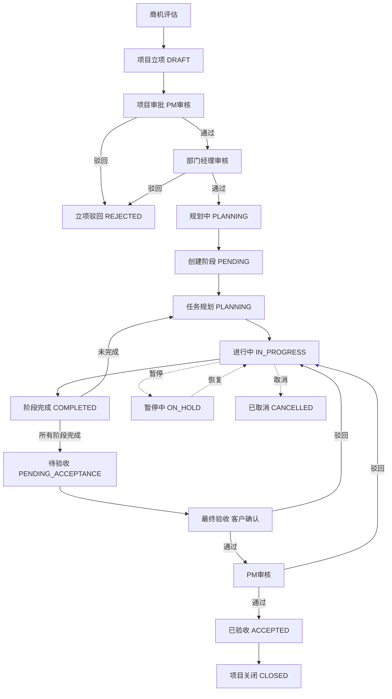
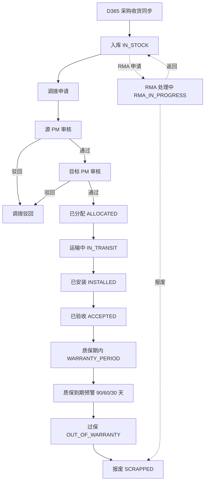
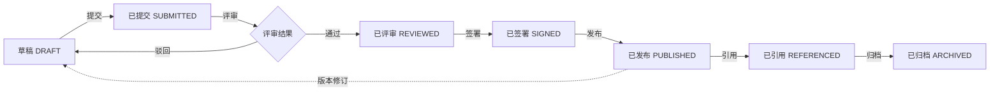
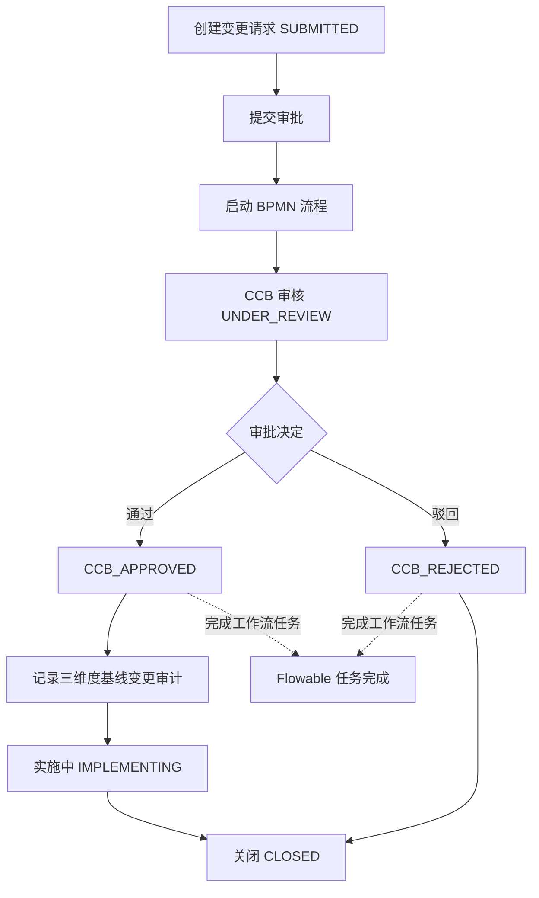
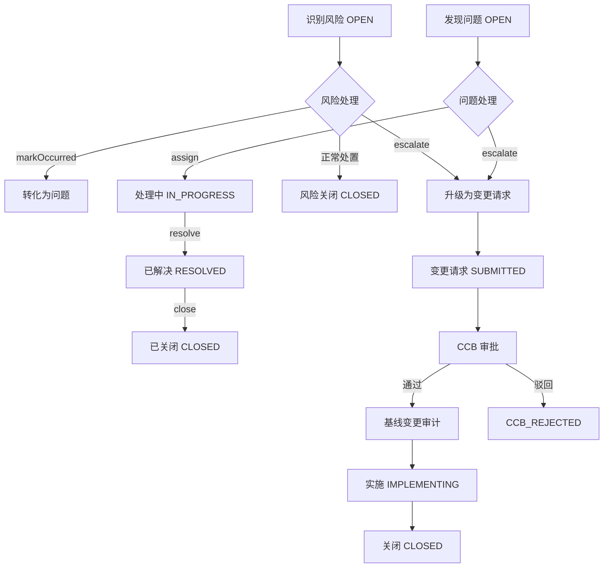
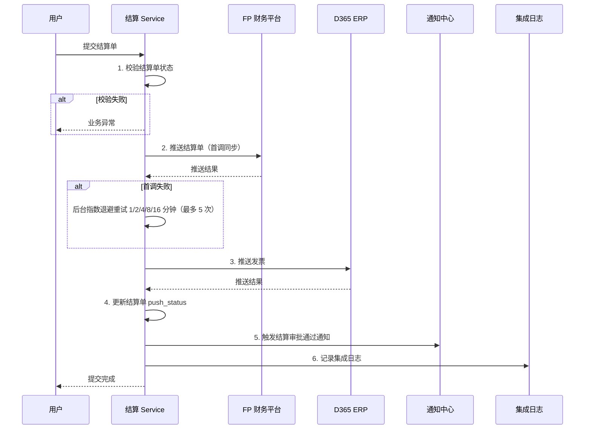
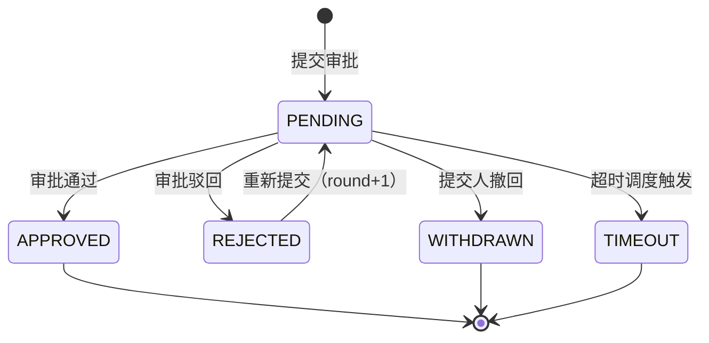
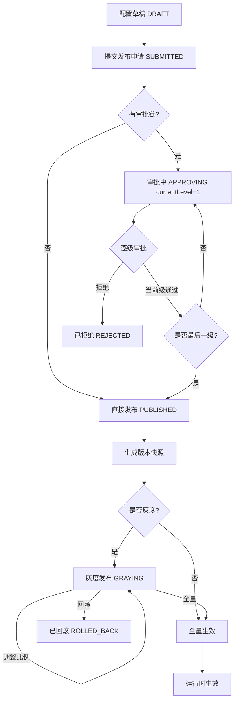

# 网络设备工程项目交付管理平台 — 产品需求文档（PRD）

---

## 第 1 章 文档信息

### 1.1 文档目的

本《产品需求文档》（Product Requirements Document，PRD）面向 `network-equipment-pms` 网络设备工程项目交付管理平台，从产品视角系统描述产品的定位、目标用户、功能需求、非功能需求、业务流程与演进路线。文档面向产品经理、研发工程师、测试工程师、实施顾问、运维人员、客户代表等多类干系人，作为研发与验收的统一基线。

### 1.2 适用范围

- 本文档适用于 `network-equipment-pms` 1.0.0-SNAPSHOT 版本，涵盖 14 个后端 Maven 模块（pms-common / pms-system / pms-project / pms-implementation / pms-asset / pms-deliverable / pms-baseline / pms-file / pms-workflow / pms-integration / pms-notification / pms-governance / pms-lowcode / pms-admin）与 1 个前端（pms-frontend，Vue 3）。
- 文档覆盖 PPDIOO（Prepare / Plan / Design / Implement / Operate / Optimize）全生命周期，包括项目立项、阶段管理、任务执行、资产交付、交付件全生命周期、计划基线、审批中心、风险/问题/变更治理、外部系统集成、通知中心与低代码平台等能力。

### 1.3 术语与缩写

| 缩写 | 全称 | 说明 |
|------|------|------|
| PMS | Project Management System | 项目管理系统，本平台简称 |
| PPDIOO | Prepare/Plan/Design/Implement/Operate/Optimize | 思科网络项目交付方法论 |
| RBAC | Role-Based Access Control | 基于角色的访问控制 |
| CCB | Change Control Board | 变更控制委员会 |
| RMA | Return Merchandise Authorization | 退换货授权 |
| DFS | Depth-First Search | 深度优先遍历，用于基线循环检测 |
| Saga | 长事务协调模式 | 用于结算单提交编排 |
| SPI | Service Provider Interface | 服务提供接口，用于跨模块解耦 |
| BPMN | Business Process Model and Notation | 业务流程建模标记 |
| OAuth2 | Open Authorization 2.0 | 开放授权协议 |
| JWT | JSON Web Token | 基于 JSON 的无状态令牌 |
| D365 | Microsoft Dynamics 365 | 微软 ERP 系统 |
| FP | Financial Platform | 财务平台 |
| OA | Office Automation | 致远 OA 协同办公系统 |
| SLA | Service Level Agreement | 服务水平协议 |
| APM | Application Performance Monitoring | 应用性能监控 |
| DFS | Depth-First Search | 深度优先搜索 |
| RMA | Return Merchandise Authorization | 退换货 |
| Punch List | 尾项清单 | 交付遗留问题清单 |
| WBS | Work Breakdown Structure | 工作分解结构 |
| PML | Project Management Library | 项目管理库 |

### 1.4 文档版本

| 版本 | 日期 | 修订人 | 修订说明 |
|------|------|--------|----------|
| V1.0 | 2026-07-22 | 产品团队 | 首版发布，覆盖 14 个后端模块 + 前端 |

### 1.5 关联文档

- `01-SRS-需求规格说明书.md`：详细的软件需求规格
- `docs/knowledge/README.md`：模块索引（15 篇文档，8699 行）
- `docs/knowledge/pms-*.md`：14 个模块知识库
- `docs/superpowers/architecture/module-dependencies.md`：模块依赖文档

---

## 第 2 章 产品概述

### 2.1 产品定位

`network-equipment-pms` 是面向**网络设备工程项目交付**的企业级管理平台，定位为「PPDIOO 全生命周期数字孪生中枢」。平台以**项目交付**为主线，以**资产全生命周期**为骨架，以**计划基线**为度量基准，通过**统一审批中心**与**三本账治理**保障过程可控，通过**外部系统集成**贯通 ERP / 财务 / OA 边界，通过**低代码平台**支撑业务快速二次开发。

平台核心价值主张：

1. **全流程数字化**：从项目立项 → 阶段 → 任务 → 交付件 → 终验 → 关闭的全链路在线化，所有状态变更可追溯。
2. **资产端到端追踪**：从 D365 采购收货同步 → 入库 → 调拨 → 装箱 → 实施 → RMA → 质保到期预警的资产全生命周期管理。
3. **计划与执行双轨**：基于基线快照的三阈值偏差监控，自动识别延期 / 成本超支 / 范围蔓延。
4. **治理三本账闭环**：风险 / 问题 / 变更请求三本账通过显式联动形成闭环，避免治理动作悬空。
5. **集成解耦**：12 个 SPI 接口下沉到 pms-common，业务模块通过 SPI 扩展点协作，避免模块环依赖。
6. **低代码扩展**：配置即应用，业务方可在不重启系统的前提下创建新实体、表单、列表、微流、规则与流程。

### 2.2 产品目标

| 目标层级 | 目标描述 | 衡量指标 |
|----------|----------|----------|
| 战略目标 | 成为网络设备工程项目交付的标准数字化平台 | 至少 5 个项目并行在线运行 |
| 业务目标 | 提升项目交付效率与合规性 | 平均交付周期缩短 ≥15%，关键交付件在线签署率 ≥90% |
| 运营目标 | 降低跨系统手工协作成本 | D365/FP/OA 集成失败率 ≤5%，集成重试自愈率 ≥80% |
| 技术目标 | 建设可演进、可观测、可扩展的微模块架构 | API p95 < 500ms，系统可用性 ≥99.5% |
| 用户目标 | 提升一线作业人员体验 | 一线用户日活留存 ≥70% |

### 2.3 产品边界

**包含范围内**：

- 项目立项、阶段、任务、里程碑、交付件的全生命周期管理。
- 设备资产从采购入库到 RMA 退役的全生命周期。
- 计划基线快照、偏差监控与三阈值预警。
- 统一审批中心（10 类业务对象审批流转）+ Flowable 工作流引擎。
- 项目治理三本账（变更请求 / 风险登记册 / 问题日志）。
- 与 D365（ERP）、FP（财务）、致远 OA 的双向集成。
- 站内信、WebSocket、邮件、OA 多通道通知中心。
- 低代码平台（实体建模、微流、规则、连接器、触发器、流程绑定、版本管理、灰度发布）。
- 文件存储抽象（本地 / MinIO / OSS）+ EXIF GPS + 地理围栏。
- Vue 3 前端 + 低代码组件 SDK。

**不包含范围外**：

- 不直接承担 ERP / 财务核心账务处理，仅通过集成接口同步数据。
- 不替换 OA 系统的协同办公能力，仅做待办镜像。
- 不提供网络设备配置管理（CMDB）功能，仅管理设备作为资产。
- 不直接管理网络工程师的工时记录系统（可通过低代码扩展）。

### 2.4 系统总体架构

平台采用**多模块 Maven 单体 + 前后端分离**的部署形态：

- **后端**：14 个 Maven 模块，基础包名 `com.dp.plat`，JDK 17 + Spring Boot 3.2.5，由 `pms-admin` 聚合启动为单个可执行 fat jar。
- **前端**：Vue 3.5 + TypeScript 6 + Vite 8 + Element Plus 2.14，构建产物部署于 Nginx 或内嵌静态资源。
- **数据库**：MySQL 8.0（主库 `network_equipment_pms`）+ Redis（缓存/分布式锁/Pub-Sub）。
- **工作流**：Flowable 7.0.1，BPMN 流程定义自动部署。
- **可观测性**：Micrometer + Prometheus（指标）+ OpenTelemetry OTLP（追踪，10% 采样）+ Logback JSON（日志）。
- **数据库迁移**：Flyway，86 个迁移脚本。

模块依赖关系（自下而上）：

```
pms-common  ─────────────────────────────────────────────┐
   │                                                    │
   ├──> pms-system                                     │
   ├──> pms-project                                    │
   ├──> pms-implementation                             │
   ├──> pms-asset                                      │
   ├──> pms-deliverable                               │
   ├──> pms-baseline                                   │
   ├──> pms-file                                       │
   ├──> pms-notification                               │
   ├──> pms-workflow  ──> pms-governance               │
   ├──> pms-integration                                │
   ├──> pms-lowcode                                    │
   │                                                    │
   └──────────────────────────────────> pms-admin  <────┘
                                          （聚合启动）
```

### 2.5 核心方法论

#### 2.5.1 PPDIOO 全生命周期

平台采用思科 PPDIOO 方法论，将网络设备工程交付拆分为六阶段：

| 阶段 | 中文 | 平台对应能力 |
|------|------|--------------|
| Prepare | 准备 | 项目立项、商机评估 |
| Plan | 规划 | 项目阶段规划、WBS 分解、任务创建 |
| Design | 设计 | 设计文档（交付件 SUBMITTED → REVIEWED） |
| Implement | 实施 | 任务执行、资产装箱、割接实施 |
| Operate | 运营 | 终验、 Punch List、质保期管理 |
| Optimize | 优化 | 经验复盘、基线偏差分析、流程改进 |

#### 2.5.2 三本账治理

借鉴 PMBOK 治理三本账实践：

- **变更请求登记册**（Change Request Log）：CCB 审批状态机 + BPMN 流程 + 基线变更审计。
- **风险登记册**（Risk Register）：5×5 风险矩阵 + 评分自动计算 + 三档优先级。
- **问题日志**（Issue Log）：分配 / 解决 / 关闭流转。

三账通过显式调用形成单向无环依赖链：风险 → 问题、风险 → 变更请求、问题 → 变更请求。

#### 2.5.3 物化路径树

项目主子关系采用物化路径树（`project_path` + `depth`），支持高效子树查询与层级统计：

- `project_path` 存储从根节点到当前节点的完整路径（如 `/1/3/7/`）。
- `depth` 存储节点深度（根节点为 1）。
- 查询子树：`LIKE '/1/3/%'`。
- 查询祖先：按 `/` 切分 `project_path` 解析。

#### 2.5.4 Saga 协调器

结算单提交采用 Saga 协调器 6 步编排，保证跨步骤最终一致性：

1. 校验结算单状态。
2. 推送结算单到 FP（首调 + 后台指数退避重试）。
3. 推送发票到 D365。
4. 更新结算单 `push_status`。
5. 触发通知（结算审批通过）。
6. 记录集成日志。

任一步骤失败均触发补偿，集成重试通过 Resilience4j 与定时调度自愈。

---

## 第 3 章 市场分析

### 3.1 行业背景

网络设备工程项目（如运营商核心网扩容、企业园区网络升级、数据中心网络建设）具有以下特征：

- **项目周期长**：通常 3-18 个月，涉及准备、设计、实施、验收、运维多阶段。
- **资产价值高**：单项目设备价值从数十万到数千万不等，资产管理失误差错成本高。
- **跨系统协同多**：需与 ERP（采购/收货/发票）、财务（结算/支付）、OA（审批待办）等系统交互。
- **合规要求严**：交付件需电子签名、版本可追溯、变更需 CCB 审批。
- **现场作业分散**：多地多项目并行，需移动端 + 离线支持。

### 3.2 竞品对比

| 维度 | 本平台 | 传统 PM 工具（如 MS Project） | 通用 PMS（如 Jira） | ERP 自带 PM |
|------|--------|-------------------------------|---------------------|-------------|
| 网络设备行业适配 | ★★★★★ 原生支持 | ★★ 通用 | ★★ 通用 | ★★ 强绑定 ERP |
| 资产全生命周期 | ★★★★★ 9 态状态机 | ★ 不支持 | ★ 不支持 | ★★★ 依赖库存模块 |
| PPDIOO 方法论 | ★★★★★ 内置 12 节点里程碑 | ★★ 通用阶段 | ★ 不内置 | ★ 不内置 |
| 三本账治理 | ★★★★★ 风险/问题/变更闭环 | ★★ 风险登记 | ★★★ 风险问题 | ★ 不支持 |
| 计划基线 | ★★★★★ 三阈值偏差监控 | ★★★ 基线对比 | ★ 不支持 | ★ 不支持 |
| 审批中心 | ★★★★★ 统一 10 类对象 | ★ 不支持 | ★★ 工作流 | ★★ ERP 审批 |
| 外部集成 | ★★★★★ D365/FP/OA 双向 | ★ 不支持 | ★★ API | ★★★★ ERP 原生 |
| 低代码扩展 | ★★★★★ 实体/微流/规则/连接器 | ★ 不支持 | ★★ 插件市场 | ★★ 表单配置 |
| 多通道通知 | ★★★★★ 站内信/WebSocket/邮件/OA | ★ 不支持 | ★★ 邮件 | ★★ 邮件 |

### 3.3 目标客户画像

| 客户类型 | 典型规模 | 核心诉求 | 平台价值 |
|----------|----------|----------|----------|
| 网络设备制造商 | 500-5000 人 | 项目交付全过程在线、与 ERP 打通 | 集成 D365 双向同步 |
| 系统集成商 | 100-1000 人 | 多项目并行管理、资源调度 | 物化路径树 + 任务依赖 DAG |
| 运营商工程部门 | 1000+ 人 | 大规模项目里程碑管控、合规审计 | 12 节点里程碑 + 三本账治理 |
| 大型企业 IT 部门 | 500-5000 人 | 网络改造项目 + 资产台账 | 9 态资产 + 质保预警 |
| 行业解决方案商 | 50-500 人 | 快速二次开发、行业模板复用 | 低代码平台 + 模板市场 |

### 3.4 差异化优势

1. **行业垂直**：原生支持 PPDIOO + 网络设备资产 + RMA + 质保等专业场景。
2. **基线驱动**：业内少有的三阈值偏差监控（天数/百分比/任务数 OR）。
3. **治理闭环**：三本账显式联动，避免治理动作悬空。
4. **双轨审批**：自建审批中心 + Flowable 引擎并存，灵活与规范兼顾。
5. **集成弹性**：Resilience4j 四层保护 + OAuth2 单飞刷新，避免外部系统雪崩。
6. **低代码扩展**：27 张低代码表 + 11 种微流节点 + 3 种规则引擎，业务自助创新。

---

## 第 4 章 用户角色与权限

### 4.1 角色体系概述

平台采用 RBAC（基于角色的访问控制）模型，用户-角色-菜单三层关联。角色按业务职能划分为以下 9 类核心角色 + 1 类超级管理员。

### 4.2 角色清单

| 角色编码 | 角色名称 | 主要职责 | 主要模块权限 |
|----------|----------|----------|--------------|
| `SUPER_ADMIN` | 超级管理员 | 系统全权管理、权限分配、数据字典维护 | `*`（全权限） |
| `PROJECT_MANAGER` | 项目经理 | 项目立项、阶段管理、任务分派、基线管理、审批 | project / implementation / baseline / approval |
| `DELIVERY_ENGINEER` | 实施工程师 | 任务执行、资产装箱、交付件提交、 Punch List 处理 | implementation / asset / deliverable |
| `ASSET_MANAGER` | 资产管理员 | 资产入库、调拨审批、RMA 工单、质保管理 | asset / warranty / rma |
| `CHANGE_MANAGER` | 变更经理 | CCB 审批、变更请求处理、基线变更审计 | governance / approval |
| `FINANCE_OFFICER` | 财务专员 | 结算审批、发票推送、支付回调处理 | implementation / integration:fp |
| `INTEGRATION_OPS` | 集成运维 | D365/FP/OA 集成监控、重试调度、健康检查 | integration / system:schedule |
| `GOVERNANCE_OFFICER` | 治理专员 | 风险登记、问题日志、风险矩阵、风险升级 | governance:risk / governance:issue |
| `LOWCODE_DESIGNER` | 低代码设计师 | 实体/表单/微流/规则设计、发布审批、模板管理 | lowcode:* |
| `SYSTEM_ADMIN` | 系统管理员 | 用户/角色/菜单/字典管理、审计日志、系统状态 | system:* / system:audit |

### 4.3 RBAC 权限矩阵

权限码命名约定：`{module}:{resource}:{action}`，action 取值 `list / add / edit / remove / process / push / sync / ocr / send / retry` 等。

| 资源 | 超管 | PM | 实施工程师 | 资产管理 | 变更经理 | 财务专员 | 集成运维 | 治理专员 | 低代码设计 | 系统管理 |
|------|------|-----|----------|---------|---------|---------|---------|---------|----------|---------|
| `project:list` | ✓ | ✓ | ✓ | ✓ | ✓ | ✓ | ✓ | ✓ | ✓ | ✓ |
| `project:add` | ✓ | ✓ | — | — | — | — | — | — | — | — |
| `project:edit` | ✓ | ✓ | — | — | — | — | — | — | — | — |
| `project:close` | ✓ | ✓ | — | — | — | — | — | — | — | — |
| `project:phase:edit` | ✓ | ✓ | — | — | — | — | — | — | — | — |
| `implementation:task:add` | ✓ | ✓ | — | — | — | — | — | — | — | — |
| `implementation:task:edit` | ✓ | ✓ | ✓ | — | — | — | — | — | — | — |
| `implementation:task:process` | ✓ | ✓ | ✓ | — | — | — | — | — | — | — |
| `implementation:settlement:process` | ✓ | ✓ | — | — | — | ✓ | — | — | — | — |
| `asset:add` | ✓ | — | — | ✓ | — | — | — | — | — | — |
| `asset:edit` | ✓ | — | ✓ | ✓ | — | — | — | — | — | — |
| `asset:transfer:process` | ✓ | ✓ | — | ✓ | ✓ | — | — | — | — | — |
| `asset:rma:process` | ✓ | — | — | ✓ | — | — | — | — | — | — |
| `warranty:list` | ✓ | ✓ | ✓ | ✓ | — | — | — | — | — | — |
| `deliverable:add` | ✓ | ✓ | ✓ | — | — | — | — | — | — | — |
| `deliverable:process` | ✓ | ✓ | ✓ | — | — | — | — | — | — | — |
| `baseline:add` | ✓ | ✓ | — | — | — | — | — | — | — | — |
| `baseline:change` | ✓ | ✓ | — | — | ✓ | — | — | — | — | — |
| `governance:changeRequest:process` | ✓ | ✓ | — | — | ✓ | — | — | — | — | — |
| `governance:risk:add` | ✓ | ✓ | ✓ | — | — | — | — | ✓ | — | — |
| `governance:risk:process` | ✓ | ✓ | — | — | — | — | — | ✓ | — | — |
| `governance:issue:process` | ✓ | ✓ | ✓ | — | — | — | — | ✓ | — | — |
| `workflow:approval:process` | ✓ | ✓ | ✓ | ✓ | ✓ | ✓ | — | ✓ | — | — |
| `integration:d365:sync` | ✓ | — | — | — | — | — | ✓ | — | — | — |
| `integration:fp:push` | ✓ | — | — | — | — | ✓ | ✓ | — | — | — |
| `integration:oa:push` | ✓ | — | — | — | — | — | ✓ | — | — | — |
| `integration:log:retry` | ✓ | — | — | — | — | — | ✓ | — | — | — |
| `notification:notification:send` | ✓ | — | — | — | — | — | — | — | — | ✓ |
| `lowcode:entity:*` | ✓ | — | — | — | — | — | — | — | ✓ | — |
| `lowcode:microflow:*` | ✓ | — | — | — | — | — | — | — | ✓ | — |
| `lowcode:publish:*` | ✓ | — | — | — | — | — | — | — | ✓ | — |
| `system:user:add` | ✓ | — | — | — | — | — | — | — | — | ✓ |
| `system:audit:list` | ✓ | — | — | — | — | — | — | — | — | ✓ |

> 说明：`✓` 表示拥有该权限，`—` 表示无。超级管理员通过权限码 `*` 全量放行。

### 4.4 鉴权机制

平台采用**双轨权限校验**：

1. **方法级**：Spring Security `@PreAuthorize("hasAuthority('xxx')")` 注解，基于 JWT 解析的 `GrantedAuthority` 集合。
2. **SpEL 级**：`@ss.hasPermi('xxx')` 自定义 SpEL 方法，支持复杂表达式（如 `@ss.hasPermi('lowcode:data:' + #entityCode + ':list')` 实现按实体粒度授权）。

JWT 通过 `Authorization: Bearer <token>` 头传入，过期时间 24 小时（生产环境从 `JWT_SECRET` 环境变量读取密钥）。WebSocket 握手阶段从 `Authorization` 头或 `?token=` 查询参数解析 JWT。

### 4.5 数据权限

除功能权限外，平台通过 MyBatis-Plus InnerInterceptor 实现数据权限控制：

- **项目维度**：项目经理仅可见自己负责的项目。
- **任务维度**：实施工程师仅可见分派给自己的任务。
- **审批维度**：审批人仅可见待自己审批的记录。

---

## 第 5 章 功能需求

本章按 14 个模块逐一描述功能需求，每个模块按「模块定位 + 核心能力 + API 端点 + 状态机」结构组织。

### 5.1 pms-common — 公共基础模块

**模块定位**：横切关注点与跨模块 SPI 接口下沉。

**核心能力**：

1. **统一响应封装**：`Result<T>` 标准信封（`code` / `message` / `data`），前端 Axios 拦截器自动剥离。
2. **统一异常体系**：`BusinessException` / `IntegrationException` / `DdlSecurityException` 等。
3. **BaseEntity 公共字段**：`id` / `createTime` / `updateTime` / `createBy` / `updateBy` / `deleted`（`@TableLogic`）。
4. **12 个 SPI 接口**：下沉到本模块，业务模块通过实现扩展点协作：
   - `ApprovalTrigger` — 审批触发
   - `ApprovalStatusChecker` — 审批状态校验
   - `ApprovalPlanBatchCreator` — 审批计划批量创建
   - `ProjectTemplateProvider` — 项目模板提供
   - `ProjectPathGenerator` — 物化路径生成
   - `PhaseExitValidator` — 阶段退出校验
   - `BaselineSnapshotProvider` — 基线快照提供
   - `BaselineDeviationCalculator` — 基线偏差计算
   - `NotificationSender` — 通知发送
   - `FileStorageProvider` — 文件存储提供
   - `IntegrationRetryHandler` — 集成重试处理
   - `SagaCoordinator` — Saga 协调器
5. **横切关注点**：
   - **加密**：AES-256-GCM 字段级加密（`@FieldEncrypt` 注解）。
   - **限流**：基于 Redis 的滑动窗口限流（`@RateLimit` 注解）。
   - **幂等**：基于 `X-Idempotent-Key` 头的幂等拦截（`@Idempotent` 注解 + `IdempotentAspect`）。
   - **XSS 过滤**：XssFilter + XssHttpServletRequestWrapper。
   - **链路追踪**：MDC `traceId` / `userId` / `username` 注入。
6. **MyBatis-Plus 基础设施**：分页 + 乐观锁 + 数据权限 InnerInterceptor + MetaObjectHandler 自动填充。
7. **安全工具**：`SecurityUtils.getCurrentUserId()` / `getCurrentUsername()` 从 JWT 解析当前用户。

### 5.2 pms-system — 系统管理中台

**模块定位**：用户 / 角色 / 菜单 / 字典 / 权限 / 安全 / 缓存。

**核心能力**：

1. **用户管理**：用户 CRUD、密码 BCrypt 加密、用户状态启用/禁用、密码重置。
2. **角色管理**：角色 CRUD、角色-菜单关联、角色-数据权限配置。
3. **菜单管理**：菜单树 CRUD、菜单-权限码关联、菜单类型（目录/菜单/按钮）。
4. **字典管理**：字典类型 + 字典项 CRUD，缓存到 Redis（`sysDict` 命名缓存 60 分钟）。
5. **配置管理**：系统配置表 `sys_config`，键值对存储。
6. **操作日志**：`@OperLog` 注解 + AOP 自动记录，businessType：1=新增 / 2=修改 / 3=删除。
7. **登录日志**：登录成功/失败记录，含 IP / UserAgent / 登录时间。
8. **JWT 认证**：JJWT 签发与校验，`JwtAuthenticationFilter` 过滤器。
9. **Spring Security 配置**：无状态会话（STATELESS）+ 过滤器链：SecurityHeadersFilter → RateLimitFilter → XssFilter → JwtAuthenticationFilter → UsernamePasswordAuthenticationFilter。
10. **Redis 配置**：`@EnableCaching` + `RedisTemplate` + `CacheManager`（默认 TTL 30 分钟 + 0~5 分钟随机抖动防雪崩）。
11. **API 文档**：Springdoc OpenAPI 3 配置，Bearer JWT SecurityScheme。

**API 端点**：`/api/auth/login`、`/api/auth/logout`、`/api/auth/info`、`/api/system/user/*`、`/api/system/role/*`、`/api/system/menu/*`、`/api/system/dict/*`、`/api/system/config/*`、`/api/system/operLog/*`、`/api/system/loginLog/*`。

### 5.3 pms-project — 项目交付管理

**模块定位**：项目全生命周期管理核心。

**核心能力**：

1. **项目管理**：
   - 项目 CRUD、项目编码 `PRJ-YYYY-XXXX` 自动生成。
   - **11 态状态机**：`DRAFT` → `PLANNING` → `IN_PROGRESS` → `PENDING_ACCEPTANCE` → `ACCEPTED` → `CLOSED`；分支：`ON_HOLD` / `CANCELLED` / `REJECTED`。
   - **物化路径树**：`project_path` + `depth` 实现主子项目树，支持子树查询与层级统计。
   - 项目关闭 / 取消 / 进度汇总。

2. **阶段管理**：
   - **4 态状态机**：`PENDING` → `IN_PROGRESS` → `COMPLETED` / `EXIT_BLOCKED`。
   - 阶段退出闸门：`PhaseExitValidator` SPI 校验强制交付件。
   - PPDIOO 12 节点里程碑模型。

3. **项目模板**：
   - 模板深拷贝 12 步：复制项目基础信息 → 阶段 → 任务 → 资产清单 → 交付件模板 → 基线 → 审批节点 → 成员 → 配置 → Punch List 模板 → RMA 模板 → 关联关系。
   - 模板版本发布、归档。

4. **项目配置**：项目级配置项，按项目维度存储。

5. **项目成员**：项目成员管理，角色分配。

6. **里程碑**：**5 态状态机**（`PLANNED` → `IN_PROGRESS` → `COMPLETED` / `DELAYED` / `CANCELLED`），逾期通知。

7. **Punch List**：尾项清单管理，到期提醒。

**API 端点**：`/api/project/*`、`/api/project/phase/*`、`/api/project/template/*`、`/api/project/config/*`、`/api/project/member/*`、`/api/project/milestone/*`、`/api/project/punch-list/*`。

### 5.4 pms-implementation — 实施管理

**模块定位**：任务执行与结算管理。

**核心能力**：

1. **实施任务**：
   - **7 态状态机**：`PENDING` → `ACCEPTED` → `IN_PROGRESS` → `COMPLETED` → `VERIFIED`；分支：`REJECTED` / `CANCELLED`。
   - 任务树（`taskPath` + `depth` 物化路径）。
   - 任务依赖关系 DAG（AntV G6 渲染，循环依赖检测）。
   - 任务分配（OEM 分派 / 代理商分派）、优先级、计划日期。
   - 任务清单（Checklist）、任务评论、任务活动日志。

2. **双轨进度汇总**：
   - 同步递归：从子任务汇总到父任务，再到阶段、项目。
   - 异步持久化：进度快照落库，避免实时聚合性能问题。

3. **结算管理**：
   - 结算单 CRUD、**6 步 Saga 编排**（校验 → 推送 FP → 推送发票到 D365 → 更新状态 → 通知 → 日志）。
   - 结算审批工作流（PM → 财务两级审批）。

4. **强制检查项闸门**：任务完成前校验强制检查项，未全部勾选不允许完成。

5. **代理商管理**：代理商 CRUD、代理商评分（按 overallScore 排名 Top10）。

**API 端点**：`/api/implementation/task/*`、`/api/implementation/settlement/*`、`/api/implementation/agent/*`、`/api/implementation/agent-score/*`、`/api/implementation/task-activity/*`、`/api/implementation/task-checklist/*`、`/api/implementation/task-comment/*`、`/api/implementation/task-dependency/*`。

### 5.5 pms-asset — 设备资产管理

**模块定位**：资产全生命周期管理。

**核心能力**：

1. **资产管理**：
   - **9 态状态机**：`IN_STOCK` → `ALLOCATED` → `IN_TRANSIT` → `INSTALLED` → `ACCEPTED` → `WARRANTY_PERIOD` → `OUT_OF_WARRANTY` → `SCRAPPED`；分支：`RMA_IN_PROGRESS`。
   - 资产 CRUD、资产编码、序列号（SN，D365 同步回填）。
   - 资产分类树（`pms_asset_category`）、资产型号（`pms_asset_model`，含 `standard_price` 用于资产总值统计）。
   - 资产装箱、资产位置（库房 / 站点）。

2. **资产调拨**：
   - 跨项目调拨审批工作流（源 PM → 目标 PM 两级审批）。
   - 调拨记录、调拨状态追踪。

3. **RMA 退换货**：
   - **6 步闭环**：申请 → 审批 → 发货 → 维修 → 返回 → 入库。
   - RMA 工单 CRUD、状态追踪、关联资产。

4. **质保管理**：
   - 质保记录、质保期起止。
   - **三档到期预警**：90 天 / 60 天 / 30 天（通过 `pms-notification` 模板化通知）。
   - 质保扫描（现场扫码查询质保状态）。

5. **质保到期预警调度**：`@Scheduled` 定时扫描即将到期质保，触发通知。

**API 端点**：`/api/asset/*`、`/api/asset/category/*`、`/api/asset/model/*`、`/api/asset/transfer/*`、`/api/rma/*`、`/api/warranty/*`。

### 5.6 pms-deliverable — 交付件管理

**模块定位**：交付件全生命周期管理。

**核心能力**：

1. **交付件管理**：
   - **7 态状态机**：`DRAFT` → `SUBMITTED` → `REVIEWED` → `SIGNED` → `PUBLISHED` → `REFERENCED` → `ARCHIVED`。
   - 字典驱动类型：通过 `pms_deliverable_type` 字典配置类型（DOCUMENT / CODE / ENTITY_REF / MODEL / CONFIG / DATA / OTHER）。
   - 性质分类重构：`ref_entity_type` / `ref_entity_id` / `template_inherited` 字段。

2. **版本管理**：`reviseDeliverable` 新建版本不覆盖旧版本，不可变历史。

3. **电子签名**：`signDeliverable` 数字签名记录。

4. **引用实体**：`DeliverableRefEntitySelector` 选择器，支持引用 TASK / ASSET / PHASE / PROJECT / DELIVERABLE / REPORT 实体。

5. **阶段退出校验**：`validateMandatoryDeliverables(phaseId)` 校验阶段强制交付件是否全部到位。

**API 端点**：`/api/deliverable/*`、`/api/deliverable/{id}/submit`、`/api/deliverable/{id}/review`、`/api/deliverable/{id}/sign`、`/api/deliverable/{id}/publish`、`/api/deliverable/{id}/archive`、`/api/deliverable/{id}/revise`、`/api/deliverable/ref-entity/*`（聚合在 pms-admin）。

### 5.7 pms-baseline — 基线管理

**模块定位**：计划基线快照与偏差监控。

**核心能力**：

1. **基线快照**：
   - 任务计划快照（`TaskPlanSnapshot`）。
   - **单一活跃基线**：同一项目同一时间仅允许一个 ACTIVE 基线。
   - 基线状态：`DRAFT` → `ACTIVE` → `ARCHIVED`。

2. **DFS 循环检测**：基线变更前深度优先遍历检测任务依赖循环，避免死锁。

3. **三阈值偏差监控**：
   - **天数阈值**：任务延期天数超过阈值。
   - **百分比阈值**：延期天数 / 计划工期超过百分比。
   - **任务数阈值**：延期任务数超过阈值。
   - 三者 OR 关系，任一满足即触发审批。

4. **偏差分析**：`BaselineDiffTable` 逐任务对比基线 vs 当前计划，延迟红色 / 提前绿色高亮。

5. **基线变更审批**：通过 `ApprovalTrigger` SPI 触发审批。

**API 端点**：`/api/baseline/*`、`/api/baseline/{id}/activate`、`/api/baseline/{id}/archive`、`/api/baseline/{id}/diff`、`/api/baseline/deviation`。

### 5.8 pms-file — 文件管理

**模块定位**：文件存储抽象与附件管理。

**核心能力**：

1. **存储抽象**：
   - 本地存储（`local`，默认 `./pms-files`）。
   - MinIO（`minio`）。
   - 阿里云 OSS（`oss`）。
   - 通过 `pms.file.storage.type` 配置切换。

2. **附件管理**：
   - 附件 CRUD，关联业务对象（`biz_type` + `biz_id`）。
   - 文件上传 / 下载 / 删除。

3. **EXIF GPS**：解析图片 EXIF 信息提取 GPS 坐标。

4. **地理围栏**：基于 GPS 坐标校验是否在允许范围内，防止现场虚假打卡。

**API 端点**：`/api/file/upload`、`/api/file/download/{id}`、`/api/file/delete/{id}`、`/api/attachment/*`。

### 5.9 pms-workflow — 工作流与审批中心

**模块定位**：Flowable 引擎集成 + 统一审批中心。

**核心能力**：

1. **Flowable 工作流引擎**：
   - BPMN 流程定义部署、流程实例生命周期管理。
   - 任务办理 / 转办 / 撤回、流程图渲染。
   - 流程历史查询。
   - 5 个预置 BPMN 流程：项目审批、资产转移、最终验收、结算审批、网络割接。

2. **统一审批中心（Story 6）**：
   - **双轨并存**：自建审批表（`pms_approval_record/node/history/field_permission`）+ Flowable 引擎。
   - **10 类业务对象审批**：PROJECT / TASK / DELIVERABLE / RISK / ISSUE / CHANGE / RESOURCE / COST / PHASE_EXIT / BASELINE_CHANGE。
   - **5 态审批状态机**：`PENDING` → `APPROVED` / `REJECTED` / `WITHDRAWN` / `TIMEOUT`。
   - 审批退回重新提交复用原记录、`round` 递增。
   - **字段脱敏**：`ApprovalFieldPermission` 按 VISIBLE / MASKED / HIDDEN 三种权限控制字段可见性。
   - **超时调度**：`ApprovalTimeoutScheduler` 定时扫描超时审批，触发升级。
   - **OA 镜像**：`OaTaskListener` 将 Flowable 任务 create/complete 事件镜像到致远 OA。

3. **审批触发机制**：`ApprovalTriggerEvent` Spring 事件 + `ApprovalDispatcher` 异步消费。

**API 端点**：`/api/workflow/*`、`/api/workflow/approval/*`、`/api/workflow/field-perm/*`。

### 5.10 pms-integration — 外部系统集成

**模块定位**：D365 / FP / OA 双向集成。

**核心能力**：

1. **D365 集成**（Microsoft Dynamics 365 ERP）：
   - OAuth2 `client_credentials` 鉴权。
   - 采购单推送、采购收货推送。
   - 同步采购单 / 采购收货 / 资产序列号 / 发票到本地。
   - 反射查找 `assetMapper` 更新 `pms_asset.serial_no`、`settlementMapper` 更新 `pms_settlement.invoice_no`。

2. **FP 集成**（Financial Platform 财务平台）：
   - OAuth2 鉴权。
   - 结算单推送（首调同步 + 后台指数退避重试 1/2/4/8/16 分钟，最多 5 次）。
   - 发票图片 OCR 识别。
   - 支付回调接收。

3. **OA 集成**（致远 OA）：
   - OAuth2 鉴权，Token 剩余 < 5 分钟自动续期。
   - 待办推送 / 完成 / 转办。

4. **弹性容错**（Resilience4j 四层保护）：
   - **CircuitBreaker**：计数滑动窗口 20，失败率 ≥50% 熔断，30s 后半开，半开 5 次试探。
   - **Bulkhead**：信号量隔离，最大并发 10，等待 5s。
   - **RateLimiter**：50 次/秒，等待 10s。
   - **Retry**：最多 3 次，1s 起步指数退避上限 16s，仅对 IOException/TimeoutException 重试。

5. **OAuth2 Token 缓存**：Redis Hash 跨实例共享 + `TokenRefreshLock`（Redis SETNX + Lua 解锁）单飞刷新，避免 Token 端点雪崩。

6. **集成日志**：所有外部调用落库 `pms_integration_log`，支持按日志 ID 手动重试与定时调度重试（5 分钟扫描一次）。

7. **健康检查聚合**：`IntegrationHealthController` 输出 `HEALTHY` / `DEGRADED` / `DOWN` 总体状态。

**API 端点**：`/api/integration/d365/*`、`/api/integration/fp/*`、`/api/integration/oa/*`、`/api/integration/log/*`、`/api/integration/health`。

### 5.11 pms-notification — 通知中心

**模块定位**：多通道通知投递。

**核心能力**：

1. **站内信管理**：`pms_notification` 表，记录接收人、标题、正文、业务分类、业务类型、业务 id、已读状态、投递通道。

2. **四通道并发投递**：
   - `IN_APP`：同步落库。
   - `WS`：异步 + Redis Pub/Sub 跨实例广播 + STOMP `/topic/notification/{userId}`。
   - `EMAIL`：异步（占位实现）。
   - `OA`：异步（占位实现）。
   - 任一通道失败仅记录日志、不阻塞其他通道。

3. **模板化发送**：基于 Freemarker 渲染 `pms_notification_template`，调用方仅传 `templateCode + variables`。预置 12 个标准模板（里程碑逾期 / 任务分派 / 任务转派 / 审批待办 / Punch List 到期 / 质保 90/60/30 天预警 / RMA 状态变更 / 结算审批通过 / 变更请求 CCB / 风险升级）。

4. **WebSocket 实时推送**：
   - STOMP 端点 `/ws`，不启用 SockJS（原生 WebSocket）。
   - JWT 握手鉴权（从 `Authorization` 头或 `?token=` 参数解析）。
   - 心跳 10s，消息大小上限 64KB。

5. **已读管理**：单条标记已读、批量标记已读、未读数统计。

**API 端点**：`/api/notification/page`、`/api/notification/unread/count`、`/api/notification/{id}/read`、`/api/notification/read/all`、`/api/notification/send`、`/api/notification/template/*`。

### 5.12 pms-governance — 项目治理

**模块定位**：变更请求 / 风险 / 问题三本账治理。

**核心能力**：

1. **变更请求管理**：
   - **6 态状态机**：`SUBMITTED` → `UNDER_REVIEW` → `CCB_APPROVED` → `IMPLEMENTING` → `CLOSED`；分支：`CCB_REJECTED`。
   - CCB 审批 BPMN 流程（`change-request-approval.bpmn20.xml`）。
   - **基线变更审计**：审批通过时对 `impactSchedule` / `impactCost` / `impactScope` 三维度分别记录 `BaselineHistory`。
   - `ObjectProvider<WorkflowService>` 注入，工作流模块未加载时降级运行。
   - 编号 `CR-YYYY-XXXX` 自动生成。

2. **风险登记册**：
   - **4 态状态机**：`OPEN` → `IN_PROGRESS` / `ESCALATED` → `CLOSED`。
   - **5×5 风险矩阵**：`likelihood`（1-5）× `impact`（1-5）= `score`（1-25）。
   - **三档优先级**：1-6 LOW / 7-12 MEDIUM / 13-25 HIGH。
   - 风险已发生转化为问题（`markOccurred`）、风险升级为变更请求（`escalate`）。
   - 编号 `RISK-YYYY-XXXX`。

3. **问题日志**：
   - **4 态状态机**：`OPEN` → `IN_PROGRESS` → `RESOLVED` → `CLOSED`。
   - 分配处理人（OPEN 自动转 IN_PROGRESS）、解决、关闭。
   - 问题升级为变更请求（`escalate`）。
   - 编号 `ISSUE-YYYY-XXXX`。

4. **三账联动**（单向无环依赖链）：风险 → 问题、风险 → 变更请求、问题 → 变更请求。

**API 端点**：`/api/governance/change-request/*`、`/api/governance/risk/*`、`/api/governance/issue/*`、`/api/governance/risk/matrix`。

### 5.13 pms-lowcode — 低代码平台

**模块定位**：配置即应用中枢。

**核心能力**：

1. **可视化配置存储**：表单 / 列表 / 标签页 / 关联页四类配置 JSON Schema 存储，状态流转 DRAFT → PUBLISHED → ARCHIVED。

2. **实体建模与 DDL 自动化**：
   - 实体设计器（实体 + 字段 + 关联关系）。
   - DDL 生成器按方言（MySQL / PostgreSQL / SQLServer）生成 CREATE/ALTER/DROP。
   - DDL 安全执行（危险语句拦截 + 表结构备份 + 执行日志 + 回滚）。
   - 动态实体数据 CRUD（JdbcTemplate + 字段白名单防注入）。

3. **微流引擎**：
   - DAG 节点编排 + Groovy 沙箱（`SecureASTCustomizer`）。
   - 11 种节点类型：START / END / ASSIGN / CONDITION / LOOP / CALL_SERVICE / CALL_MICROFLOW / CALL_RULE / CALL_CONNECTOR / THROW_EXCEPTION / RETURN。
   - 断点调试器（断点 / 单步 / 继续 / 变量监视）。
   - 流程图渲染（SVG/PNG）。

4. **规则引擎**：
   - 三种规则类型：决策表 / Aviator 表达式 / LiteFlow。
   - Aviator 沙箱（禁用 NewInstance / Module / InternalVars + 移除系统函数）。
   - 规则集编排：THEN / WHEN / IF / SWITCH。
   - 规则测试用例（EQUALS / CONTAINS / NOT_NULL 断言）。

5. **连接器集成**：
   - 4 种连接器：REST / DB / MQ（RabbitMQ + Kafka）/ FILE（SFTP）。
   - 5 种鉴权：NONE / BASIC / BEARER / API_KEY / OAUTH2。
   - Resilience4j 重试 / 熔断 / 限流。
   - JsonPath responseMapping 字段重命名。
   - OpenAPI/Swagger 文档导入。

6. **触发器调度**：
   - 3 种触发类型：CRUD / QUARTZ / EVENT。
   - 2 种目标类型：MICROFLOW / PROCESS。
   - CRUD 触发器 BEFORE 异常阻断主操作，AFTER 异常仅记日志。

7. **流程集成**：
   - 流程绑定（节点-表单映射 + 任务回调 JSON）。
   - `ProcessTaskCallbackListener` Flowable 任务事件回调微流。
   - 流程 SLA 双阶段触发（80% 预警 + 截止升级）。

8. **版本管理与环境晋升**：
   - 不可变版本快照。
   - 版本树分支（借鉴 git parent commit 模型）。
   - Diff 对比、回滚预览。
   - 环境晋升（DEV → TEST → PROD，配置包 zip 导入导出 + 门禁预检 + 冲突检测）。
   - 依赖完整性校验（包内自洽 + 目标环境存在性）。

9. **发布流水线**：
   - 多级审批链。
   - 灰度发布（按 `grayPercentage` 或 `tenantWhitelist` 渐进生效）。
   - 协同编辑（HTTP 轮询，预留 Yjs 升级）。
   - 编辑锁（Redis SETNX + DB 持久化）。
   - 线程化评论（@提及通知）。

10. **配置审计**：AOP 切面自动写审计日志。

11. **模板市场**：模板上架 / 下架 / 归档 / 下载 / 评分。

12. **应用源码导出**：将低代码应用打包为可独立部署的源码 ZIP（JSON + DDL + POM + README）。

13. **数据导入导出**：Excel 异步导入 / 同步导出。

14. **APM 全链路指标**：Micrometer 指标采集（微流 / 规则 / 连接器 / 触发器 / Flowable 回调）。

**API 端点**：30 个 Controller，全部 `/api/lowcode/*` 前缀。

### 5.14 pms-admin — 聚合启动模块

**模块定位**：统一启动入口 + 跨模块聚合查询。

**核心能力**：

1. **统一启动**：`PmsApplication` 主类，`@SpringBootApplication(scanBasePackages = "com.dp.plat")` 扫描全部 14 个模块。
2. **MyBatis Mapper 扫描**：`@MapperScan({"com.dp.plat.**.mapper", "com.dp.plat.**.dao", "com.dp.plat.**.engine.ddl"})`。
3. **定时任务**：`@EnableScheduling` 启用 Quartz / `@Scheduled`。
4. **重试**：`@EnableRetry` 启用 Spring Retry，配合外部集成 `@Retryable`。
5. **聚合查询端点**：
   - `DeliverableRefEntityController`：交付件引用实体聚合查询（TASK/ASSET/PHASE/PROJECT/DELIVERABLE/REPORT）。
   - `ReportController`：报表统计与仪表盘聚合（8 个仪表盘指标 + 项目趋势 + 待办列表 + 近期动态）。
6. **数据库迁移**：Flyway 86 个迁移脚本（V1-V86）。
7. **BPMN 流程部署**：5 个 `*.bpmn20.xml` 自动部署。
8. **健康检查**：`DatabaseHealthIndicator` + `RedisHealthIndicator`。
9. **可观测性**：Actuator + Micrometer + Prometheus + OpenTelemetry + Logback JSON。

### 5.15 pms-frontend — 前端应用

**模块定位**：Vue 3 单页应用 + 低代码组件 SDK。

**核心能力**：

1. **业务前台**：项目全生命周期统一交互入口，项目工作区枢纽页 8 Tab（概览 / 阶段 / 任务 / 交付件 / 基线 / 审批 / 成员 / 配置）。
2. **低代码平台前台**：实体 / 表单 / 列表 / Tab / 关联页 / 微流 / 规则 / 流程 / 触发器 / 连接器 / 发布中心 / 审批链 / 模板市场 / APM 看板 / 应用源码导出 全套设计器 UI。
3. **系统管理控制台**：用户 / 角色 / 菜单 / 字典 / 缓存 / 定时任务 / 审计日志 / 系统状态 / 集成健康。
4. **技术栈**：Vue 3.5 + TypeScript 6 + Vite 8 + Element Plus 2.14 + Pinia 3 + Vue Router 4.6 + Axios 1.18。
5. **图编辑**：AntV X6（微流/实体设计器）+ AntV G6（任务依赖 DAG）+ bpmn-js（流程设计器）。
6. **代码编辑器**：Monaco Editor。
7. **图表**：ECharts 6。
8. **路由权限三段式校验**：token 存在性 + 低代码运行时派生权限 + `meta.perms`。
9. **数据集成校验**：30+ 业务 validator 文件，前端镜像后端 `@Valid`。
10. **幂等键**：写操作自动注入 `X-Idempotent-Key`（UUID v4）。
11. **PWA**：Service Worker + 离线监听 + 更新检测。
12. **WebSocket**：原生 WebSocket（不依赖 sockjs/stompjs），5 秒重连。
13. **多标签页**：标签持久化 + 拖拽排序。
14. **顶栏一级 Tab + 侧栏二级菜单联动**：钉钉/飞书风格。
15. **低代码组件 SDK**：独立打包 ES + UMD 双格式，借鉴 Power Apps PCF。

---

## 第 6 章 非功能需求

### 6.1 性能需求

| 指标 | 目标值 | 测量方式 |
|------|--------|----------|
| API 响应时间 p50 | < 200ms | Micrometer HTTP 直方图 |
| API 响应时间 p95 | < 500ms | Micrometer HTTP 直方图 |
| API 响应时间 p99 | < 2s | Micrometer HTTP 直方图 |
| 列表查询接口（10 万行数据） | < 1s | 集成测试 |
| 文件上传（100MB） | < 30s | 集成测试 |
| WebSocket 推送延迟 | < 1s | 前端监控 |
| 外部集成首调响应 | < 30s（读取超时） | Resilience4j 指标 |
| 并发用户数 | ≥ 200 | 压测 |
| 数据库连接池 | min-idle=5（开发）/ 10（生产），max=20（开发）/ 50（生产） | HikariCP |
| Quartz 线程池 | 5 | 配置 |

### 6.2 可用性需求

| 指标 | 目标值 |
|------|--------|
| 系统可用性 | ≥ 99.5%（年停机 ≤ 43.8 小时） |
| 计划维护窗口 | 每月第 1 个周日 00:00-04:00 |
| 故障恢复时间（RTO） | ≤ 30 分钟 |
| 数据丢失容忍（RPO） | ≤ 5 分钟（MySQL 主从复制延迟） |
| 集成失败自愈率 | ≥ 80%（通过 Resilience4j + 定时重试） |

### 6.3 安全需求

1. **认证**：JWT 无状态会话，密钥从 `JWT_SECRET` 环境变量读取（生产环境缺失快速失败）。
2. **授权**：RBAC + `@PreAuthorize` + `@ss.hasPermi` 双轨权限校验。
3. **数据加密**：
   - 传输层：HTTPS（生产环境）。
   - 字段级：AES-256-GCM（`@FieldEncrypt` 注解）。
   - 密码：BCrypt。
   - 凭据：低代码连接器凭据 AES 加密存储。
4. **XSS 防护**：XssFilter + XssHttpServletRequestWrapper + 前端 DOMPurify。
5. **CSRF 防护**：无状态会话天然免疫 CSRF。
6. **SQL 注入防护**：MyBatis 参数化查询 + 低代码字段白名单 + 标识符正则白名单。
7. **幂等性**：`X-Idempotent-Key` 头 + `IdempotentAspect`。
8. **限流**：基于 Redis 的滑动窗口限流（`@RateLimit`）。
9. **Groovy/Aviator 沙箱**：拦截危险类调用、禁止 new 关键字、移除系统函数。
10. **审计日志**：`@OperLog` 操作日志 + 低代码 `ConfigAuditAspect` 配置审计 + 登录日志。
11. **WebSocket 鉴权**：握手阶段 JWT 校验，无 token 或解析失败拒绝握手。

### 6.4 可靠性需求

1. **乐观锁**：`@Version` 注解，并发更新冲突时抛 `OptimisticLockingFailureException`。
2. **逻辑删除**：`@TableLogic`，`deleted` 字段（0/1），所有查询自动过滤。
3. **Saga 协调器**：结算单提交 6 步编排，任一步骤失败触发补偿。
4. **集成重试**：Resilience4j Retry + 定时调度重试（5 分钟扫描）。
5. **OAuth2 单飞刷新**：Redis SETNX + Lua 解锁，避免多实例并发刷新。
6. **WebSocket 心跳**：10s 心跳，独立 ThreadPoolTaskScheduler 避免循环依赖。
7. **Redis 防雪崩**：缓存 TTL 30 分钟 + 0~5 分钟随机抖动。
8. **Redis 防穿透**：`disableCachingNullValues`。
9. **降级运行**：`ObjectProvider` 注入工作流服务，模块未加载时降级。

### 6.5 可维护性需求

1. **模块化**：14 个 Maven 模块，单一职责，依赖关系单向无环。
2. **SPI 解耦**：12 个 SPI 接口下沉到 pms-common，业务模块通过扩展点协作。
3. **配置化**：字典驱动 + Properties 文件按环境区分 + 配置中心 `sys_config`。
4. **Flyway 迁移**：86 个迁移脚本，`out-of-order: true` 允许乱序补录。
5. **可观测性三件套**：Metrics（Micrometer + Prometheus）+ Tracing（OpenTelemetry OTLP）+ Logging（Logback JSON 结构化）。
6. **链路追踪**：MDC `traceId` / `userId` / `username` 贯穿日志。
7. **API 文档**：Springdoc OpenAPI 3 自动生成。
8. **测试覆盖**：JUnit 5 + Mockito（单元）+ Testcontainers（集成）+ Vitest（前端单元）+ Playwright（E2E）。

### 6.6 可扩展性需求

1. **水平扩展**：无状态会话支持多实例部署，Redis Pub/Sub 解决 WebSocket 跨实例推送。
2. **低代码扩展**：业务方可在不重启系统的前提下创建新实体、表单、列表、微流、规则、流程。
3. **多数据源**：`RoutingDataSource` 支持 6+ 数据库（local / PMS / SMS / EHR / D365 / CRM）。
4. **多数据库方言**：DDL 生成器支持 MySQL / PostgreSQL / SQLServer。
5. **多文件存储**：本地 / MinIO / OSS 通过配置切换。
6. **多通道通知**：IN_APP / WS / EMAIL / OA 四通道并发投递。

### 6.7 兼容性需求

1. **浏览器**：Chrome 90+、Edge 90+、Firefox 88+、Safari 14+。
2. **移动端**：响应式布局，768px 断点切换抽屉式侧栏。
3. **数据库**：MySQL 8.0.16+（主）、PostgreSQL 42.7.0（可选）、SQL Server（D365 集成）。
4. **JDK**：Java 17。
5. **Node.js**：构建时 18+。

### 6.8 国际化需求

- 当前版本仅支持简体中文。
- 字典项支持多语言扩展（`itemText` 字段）。
- 预留 i18n 接入点（Vue i18n 待引入）。

### 6.9 部署需求

1. **打包**：Spring Boot fat jar（后端）+ 静态资源（前端）。
2. **环境分级**：dev（默认）/ test / prod / mock。
3. **生产环境安全**：
   - `jwt.secret` 仅从 `JWT_SECRET` 环境变量读取。
   - 关闭 Swagger UI 与 api-docs。
   - 日志级别 root=INFO、`com.dp.plat`=INFO。
4. **配置外部化**：数据库 / Redis / JWT / 加密密钥 / 外部集成全部支持环境变量覆盖。
5. **Docker 支持**：mock-d365 / mock-fp / mock-oa 提供 Dockerfile。

---

## 第 7 章 业务流程图

### 7.1 项目全生命周期流程



### 7.2 资产全生命周期流程



### 7.3 交付件全生命周期流程



### 7.4 变更请求 CCB 审批流程



### 7.5 风险/问题/变更三账联动流程



### 7.6 结算单 Saga 协调器 6 步编排流程



### 7.7 统一审批中心审批流转流程



### 7.8 低代码发布流水线流程



---

## 第 8 章 数据指标体系

### 8.1 仪表盘概要指标（8 个）

| 指标 | 计算 | 用途 |
|------|------|------|
| 项目总数 | `selectCount(pms_project)` | 仪表盘首屏 |
| 进行中项目 | `selectCount(pms_project where status = IN_PROGRESS)` | 仪表盘首屏 |
| 在库设备 | `selectCount(pms_asset where status = IN_STOCK)` | 仪表盘首屏 |
| 待办数 | 当前用户开放态任务数（PENDING/ACCEPTED/IN_PROGRESS） | 仪表盘首屏 |
| 本月交付 | 当月项目状态转为 CLOSED 数 | 仪表盘首屏 |
| 本月新增项目 | 当月创建项目数 | 仪表盘首屏 |
| 本月新增资产 | 当月入库资产数 | 仪表盘首屏 |
| 告警数 | 逾期任务数 + 30 天内到期质保数 | 仪表盘首屏 |

### 8.2 项目交付统计指标

| 指标 | 计算 |
|------|------|
| 月发起数 | 按月分组 `selectCount(pms_project where createTime 在本月)` |
| 月完成数 | 按月分组 `selectCount(pms_project where status = CLOSED and closedAt 在本月)` |
| 进行中总数 | `selectCount(pms_project where status = IN_PROGRESS)` |
| 已完成总数 | `selectCount(pms_project where status = CLOSED)` |
| 平均交付周期（天） | `avg(DATEDIFF(closedAt, createTime))` |
| 延期率 | 延期项目数 / 总项目数 |

### 8.3 设备资产统计指标

| 指标 | 计算 |
|------|------|
| 按状态分组 | `groupBy(status)` + `selectCount` |
| 按分类分组 | `groupBy(categoryId)` + `selectCount` |
| 资产总值 | `sum(pms_asset_model.standard_price where model in assets)` |

### 8.4 实施效能统计指标

| 指标 | 计算 |
|------|------|
| 月完成数 | 按月分组任务完成数 |
| 平均时长 | `avg(DATEDIFF(completedAt, startTime))` |
| 任务类型完成率 | OEM / AGENT 分别计算 |
| 代理商 Top10 | 按 `overallScore` 降序 |

### 8.5 集成健康指标

| 指标 | 计算 |
|------|------|
| overallStatus | 3 系统全连通 HEALTHY / 部分 DEGRADED / 全断 DOWN |
| 各系统 connected | `tokenValid && recentPushCount > 0` |
| 24h 推送数 | `selectCount(pms_integration_log where createdAt > now-24h and responseStatus = SUCCESS)` |
| 24h 失败数 | `selectCount(pms_integration_log where createdAt > now-24h and responseStatus = FAILED)` |

### 8.6 低代码 APM 指标（Prometheus 抓取格式）

| 指标 | 类型 | 标签 |
|------|------|------|
| `lowcode_microflow_execution_total` | Counter | microflow_code, status |
| `lowcode_microflow_duration_seconds` | Timer | microflow_code |
| `lowcode_microflow_node_duration_seconds` | Timer | node_type, status |
| `lowcode_rule_execution_total` | Counter | rule_type, status |
| `lowcode_rule_duration_seconds` | Timer | rule_type |
| `lowcode_connector_call_total` | Counter | connector_type, connector_code, status |
| `lowcode_connector_duration_seconds` | Timer | connector_type, connector_code |
| `lowcode_trigger_execution_total` | Counter | trigger_type, trigger_code, status |
| `lowcode_trigger_duration_seconds` | Timer | trigger_type, trigger_code |
| `lowcode_flowable_callback_total` | Counter | process_key, event, status |

### 8.7 HTTP 请求 SLO 指标

| SLO 阈值 | 含义 |
|----------|------|
| 50ms | 极速接口（如字典查询） |
| 100ms | 快速接口（如分页列表） |
| 200ms | 普通接口（如 CRUD） |
| 500ms | 复杂接口（如聚合查询） |
| 1s | 重接口（如报表统计） |
| 2s | 极重接口（如基线偏差计算） |
| 5s | 超重接口（如低代码执行） |

---

## 第 9 章 产品路线图

### 9.1 版本规划

| 版本 | 时间 | 主题 | 主要内容 |
|------|------|------|----------|
| V1.0 | 2026-Q3 | MVP | 14 个后端模块 + 前端核心页面，PPDIOO 全生命周期 |
| V1.1 | 2026-Q4 | 集成增强 | D365/FP/OA 集成稳定性提升、健康监控告警 |
| V1.2 | 2027-Q1 | 移动端 | 移动端适配（响应式 768px 断点 + PWA 离线） |
| V1.3 | 2027-Q2 | 低代码增强 | Yjs 协同编辑升级、模板市场丰富、APM 可视化看板 |
| V2.0 | 2027-Q3 | 平台化 | 多租户支持、开放 API 平台、组件市场开放 |

### 9.2 V1.0 详细里程碑

| 里程碑 | 内容 | 验收标准 |
|--------|------|----------|
| M1：基础框架 | pms-common + pms-system | 用户登录、RBAC 权限、字典、缓存就绪 |
| M2：项目核心 | pms-project + pms-implementation | 项目立项 → 阶段 → 任务全链路打通 |
| M3：资产管理 | pms-asset + pms-file | 资产入库 → 调拨 → RMA → 质保全链路 |
| M4：交付治理 | pms-deliverable + pms-baseline + pms-governance | 交付件 7 态 + 基线偏差 + 三本账 |
| M5：工作流 | pms-workflow + pms-notification | Flowable 引擎 + 统一审批中心 + 多通道通知 |
| M6：外部集成 | pms-integration | D365/FP/OA 双向集成 + Resilience4j |
| M7：低代码 | pms-lowcode | 实体/微流/规则/连接器/触发器全能力 |
| M8：聚合启动 | pms-admin + pms-frontend | Flyway 86 脚本 + 前端 30+ 页面 |

### 9.3 技术债务清理

| 债务 | 优先级 | 计划版本 |
|------|--------|----------|
| 编号生成器并发风险（`generateCrNo` 等） | 高 | V1.1（数据库唯一索引 / 分布式锁） |
| `ApprovalCenterController` 包名错位 | 中 | V1.1 |
| `findCurrentTaskId` 按 processInstanceId 直接查询 | 中 | V1.1 |
| `BaselineHistory.oldValue` 固定占位字符串 | 中 | V1.2（集成 `pms-baseline` 真实快照） |
| 低代码协同编辑从 HTTP 轮询升级到 Yjs | 低 | V1.3 |
| 国际化（Vue i18n） | 低 | V2.0 |
| 多租户支持 | 中 | V2.0 |

---

## 第 10 章 风险与依赖

### 10.1 技术风险

| 风险 | 影响 | 概率 | 缓解措施 |
|------|------|------|----------|
| Flowable 引擎稳定性 | 审批流转受阻 | 中 | 双轨并存，自建审批表不依赖 Flowable |
| D365/FP/OA 外部系统不可用 | 集成失败 | 高 | Resilience4j 四层保护 + 定时重试 + 降级 |
| MySQL 单点故障 | 系统不可用 | 低 | 主从复制 + RPO ≤ 5 分钟 |
| Redis 单点故障 | 缓存失效 / WebSocket 推送中断 | 中 | Redis 集群（V2.0） |
| Groovy/Aviator 沙箱逃逸 | 安全风险 | 低 | AST 检查 + 白名单 + 正则阻断 |
| 编号生成器并发冲突 | 数据重复 | 中 | V1.1 加唯一索引 / 分布式锁 |

### 10.2 业务风险

| 风险 | 影响 | 概率 | 缓解措施 |
|------|------|------|----------|
| 用户 adoption 低 | 投资回报率低 | 中 | 一线用户培训 + 移动端 + PWA |
| 三本账治理流于形式 | 治理失效 | 中 | 显式联动 + 闭环校验 + 审计日志 |
| 基线偏差监控过严 | 流程僵化 | 低 | 三阈值 OR 关系 + 审批触发而非阻断 |
| 低代码滥用 | 系统碎片化 | 中 | 多级审批链 + 灰度发布 + 配置审计 |

### 10.3 外部依赖

| 依赖 | 类型 | 风险 |
|------|------|------|
| Microsoft Dynamics 365 | 外部系统 | API 变更 / 限流 |
| 财务平台 FP | 外部系统 | 接口契约变更 |
| 致远 OA | 外部系统 | 待办镜像失败（不阻断主流程） |
| MySQL 8.0 | 基础设施 | 版本升级兼容性 |
| Redis | 基础设施 | 集群方案待 V2.0 |
| Flowable 7.0.1 | 开源组件 | 版本升级 / 社区维护 |
| Vue 3 / Element Plus | 前端框架 | 大版本升级破坏性变更 |
| Java 17 | 运行时 | LTS 支持 |

### 10.4 内部依赖

模块依赖关系（自下而上，单向无环）：

```
pms-common  →  所有业务模块
pms-system  →  pms-lowcode
pms-workflow →  pms-governance
pms-notification →  pms-lowcode
pms-file  →  pms-lowcode
所有业务模块  →  pms-admin（聚合）
```

跨模块协作通过 12 个 SPI 接口解耦，避免模块环依赖。

---

## 第 11 章 附录

### 11.1 状态机汇总

| 领域 | 状态数 | 状态枚举 |
|------|--------|----------|
| 项目 | 11 | DRAFT / PLANNING / IN_PROGRESS / PENDING_ACCEPTANCE / ACCEPTED / CLOSED / ON_HOLD / CANCELLED / REJECTED / (待定) |
| 任务 | 7 | PENDING / ACCEPTED / IN_PROGRESS / COMPLETED / VERIFIED / REJECTED / CANCELLED |
| 资产 | 9 | IN_STOCK / ALLOCATED / IN_TRANSIT / INSTALLED / ACCEPTED / WARRANTY_PERIOD / OUT_OF_WARRANTY / SCRAPPED / RMA_IN_PROGRESS |
| 交付件 | 7 | DRAFT / SUBMITTED / REVIEWED / SIGNED / PUBLISHED / REFERENCED / ARCHIVED |
| 阶段 | 4 | PENDING / IN_PROGRESS / COMPLETED / EXIT_BLOCKED |
| 里程碑 | 5 | PLANNED / IN_PROGRESS / COMPLETED / DELAYED / CANCELLED |
| 变更请求 | 6 | SUBMITTED / UNDER_REVIEW / CCB_APPROVED / CCB_REJECTED / IMPLEMENTING / CLOSED |
| 风险 | 4 | OPEN / IN_PROGRESS / ESCALATED / CLOSED |
| 问题 | 4 | OPEN / IN_PROGRESS / RESOLVED / CLOSED |
| 审批 | 5 | PENDING / APPROVED / REJECTED / WITHDRAWN / TIMEOUT |
| 基线 | 3 | DRAFT / ACTIVE / ARCHIVED |
| RMA | 6 | 申请 → 审批 → 发货 → 维修 → 返回 → 入库 |

### 11.2 SPI 接口清单（12 个）

| SPI 接口 | 提供方 | 消费方 | 用途 |
|----------|--------|--------|------|
| `ApprovalTrigger` | pms-workflow | pms-project / pms-baseline | 审批触发 |
| `ApprovalStatusChecker` | pms-workflow | pms-project / pms-baseline | 审批状态校验 |
| `ApprovalPlanBatchCreator` | pms-workflow | pms-project | 审批计划批量创建 |
| `ProjectTemplateProvider` | pms-project | pms-admin | 项目模板提供 |
| `ProjectPathGenerator` | pms-project | pms-admin | 物化路径生成 |
| `PhaseExitValidator` | pms-project | pms-deliverable | 阶段退出校验 |
| `BaselineSnapshotProvider` | pms-baseline | pms-governance | 基线快照提供 |
| `BaselineDeviationCalculator` | pms-baseline | pms-admin | 基线偏差计算 |
| `NotificationSender` | pms-notification | 所有业务模块 | 通知发送 |
| `FileStorageProvider` | pms-file | 所有业务模块 | 文件存储提供 |
| `IntegrationRetryHandler` | pms-integration | pms-admin | 集成重试处理 |
| `SagaCoordinator` | pms-common | pms-implementation | Saga 协调器 |

### 11.3 BPMN 流程清单（5 个）

| 流程 ID | 流程名称 | 用途 |
|---------|----------|------|
| `projectApproval` | 项目审批流程 | 项目立项两级审批（PM → 部门经理） |
| `assetTransfer` | 资产转移流程 | 资产跨项目转移两级审批（源 PM → 目标 PM） |
| `finalAcceptance` | 最终验收流程 | 项目最终验收两级确认（客户 → PM） |
| `settlementApproval` | 结算审批流程 | 项目结算两级审批（PM → 财务） |
| `changeRequestApproval` | 变更请求 CCB 审批流程 | CCB 审批（来自 pms-governance） |

### 11.4 预置通知模板（12 个）

| templateCode | 描述 |
|--------------|------|
| `MILESTONE_OVERDUE` | 里程碑逾期提醒 |
| `TASK_ASSIGNED` | 任务分派通知 |
| `TASK_DELEGATED` | 任务转派通知 |
| `APPROVAL_TODO` | 审批待办通知 |
| `PUNCH_LIST_DEADLINE` | 尾项清单到期提醒 |
| `WARRANTY_EXPIRE_90` | 质保到期 90 天预警 |
| `WARRANTY_EXPIRE_60` | 质保到期 60 天预警 |
| `WARRANTY_EXPIRE_30` | 质保到期 30 天预警 |
| `RMA_STATUS_CHANGE` | RMA 状态变更通知 |
| `SETTLEMENT_APPROVED` | 结算审批通过通知 |
| `CHANGE_REQUEST_CCB` | 变更请求 CCB 评审通知 |
| `RISK_ESCALATED` | 风险升级提醒 |

### 11.5 Flyway 迁移脚本清单（86 个）

| 版本范围 | 主旨 |
|----------|------|
| V1 — V6 | 系统/项目/资产/实施/集成五大领域基线建表 |
| V7 — V26 | 流程实例 ID 关联、领域扩展、索引/权限/外键/版本字段补强 |
| V27 — V57 | 低代码平台大规模建表（31 个脚本） |
| V58 — V68 | 演示数据种子与低代码/业务修复 |
| V69 — V86 | 项目管理增强、交付件全生命周期、审批中心、网络割接工作区 |

### 11.6 低代码微流节点类型（11 种）

| 节点类型 | 用途 |
|----------|------|
| `START` / `END` | 开始/结束节点 |
| `ASSIGN` | Groovy 表达式赋值 |
| `CONDITION` | Groovy 布尔表达式条件分支 |
| `LOOP` | Groovy 布尔表达式循环 |
| `CALL_SERVICE` | 调用 Spring Bean 方法 |
| `CALL_MICROFLOW` | 调用另一微流 |
| `CALL_RULE` | 调用规则 |
| `CALL_CONNECTOR` | 调用连接器 |
| `THROW_EXCEPTION` | 抛出业务异常 |
| `RETURN` | 返回结果终止执行 |

### 11.7 低代码连接器类型（4 种）

| 类型 | 能力 |
|------|------|
| REST | HTTP 调用 + 5 种鉴权 + Resilience4j + 3 种分页 + JsonPath |
| DB | JDBC 查询/更新 + DDL 拦截 |
| MQ | RabbitMQ + Kafka，PRODUCE/CONSUME |
| FILE | SFTP，UPLOAD/DOWNLOAD/LIST/DELETE |

### 11.8 低代码触发器类型（3 种）

| 类型 | 触发方式 |
|------|----------|
| CRUD | DynamicEntityDataService 在 create/update/delete 前后调用 |
| QUARTZ | Quartz Job 按 cron 表达式触发 |
| EVENT | Spring ApplicationEvent 发布 + 直接执行目标微流 |

### 11.9 外部集成端点清单

| 系统 | 端点 | 用途 |
|------|------|------|
| D365 | `/api/integration/d365/health` | 健康检查 |
| D365 | `/api/integration/d365/push-receipt` | 推送采购收货 |
| D365 | `/api/integration/d365/sync/purchase-orders` | 同步采购单 |
| D365 | `/api/integration/d365/sync/purchase-receipts` | 同步采购收货 |
| D365 | `/api/integration/d365/sync/asset-serial-numbers` | 同步资产序列号 |
| D365 | `/api/integration/d365/sync/invoices` | 同步发票 |
| FP | `/api/integration/fp/health` | 健康检查 |
| FP | `/api/integration/fp/push-settlement` | 推送结算单 |
| FP | `/api/integration/fp/ocr-invoice` | 发票图片 OCR |
| FP | `/api/integration/fp/payment-callback` | 支付回调 |
| OA | `/api/integration/oa/health` | 健康检查 |
| OA | `/api/integration/oa/todo/push` | 推送待办 |
| OA | `/api/integration/oa/todo/complete` | 完成待办 |
| OA | `/api/integration/oa/todo/transfer` | 转办待办 |
| 通用 | `/api/integration/log/list` | 集成日志分页 |
| 通用 | `/api/integration/log/{id}/retry` | 手动重试 |
| 通用 | `/api/integration/health` | 聚合健康检查 |

### 11.10 前端页面模块清单（30+）

| 页面目录 | 路由前缀 | 功能描述 |
|----------|----------|----------|
| `dashboard/` | `/dashboard` | 首页 / 工作台 |
| `login/` | `/login` | 登录页 |
| `help/` | `/help` | 帮助中心 |
| `project/list/` | `/project/list` | 项目列表 |
| `project/workspace/` | `/project/workspace/:id` | 项目工作区枢纽页（8 Tab） |
| `project/gantt/` | `/project/:id/gantt` | 项目甘特图 |
| `project/kanban/` | `/project/kanban` | 交付看板 |
| `project/tree/` | `/project/tree` | 主子项目树 |
| `project/template/` | `/project/template` | 项目模板 |
| `phase/` | `/project/phase/:projectId` | 阶段管理 |
| `task/list/` | `/implementation/task/list` | 任务树列表 |
| `task/detail/` | `/implementation/task/detail/:id` | 任务详情 |
| `task/dependency/` | `/implementation/task/dependency/:projectId` | 任务依赖关系图 |
| `implementation/agent/` | `/implementation/agent` | 服务商管理 |
| `implementation/settlement/` | `/implementation/settlement` | 结算管理 |
| `asset/category/` | `/asset/category` | 设备分类树 |
| `asset/model/` | `/asset/model` | 设备型号 |
| `asset/list/` | `/asset/list` | 资产清单 |
| `baseline/` | `/baseline/list` | 计划基线管理 |
| `baseline/diff.vue` | `/baseline/diff/:baselineId` | 基线偏差分析 |
| `workflow/todo/` | `/workflow/todo` | 待办中心 |
| `workflow/approval-center/` | `/workflow/approval-center` | 统一审批中心 |
| `workflow/approval-detail/` | `/workflow/approval-detail/:id` | 审批详情 |
| `workflow/field-perm/` | `/workflow/field-perm` | 字段权限配置 |
| `deliverable/` | `/deliverable` | 终验交付物 |
| `punch-list/` | `/punch-list` | Punch List |
| `rma/` | `/rma` | RMA 返修工单 |
| `warranty/` | `/warranty` | 质保期管理 |
| `risk/` | `/risk` | 风险登记册 |
| `change-request/` | `/change-request` | 变更管理 |
| `issue/` | `/issue` | 问题日志 |
| `report/` | `/report` | 报表统计 |
| `notification/` | `/notification` | 消息中心 |
| `integration-health/` | `/integration-health` | 集成健康检查 |
| `system/*` | `/system/*` | 系统管理 |
| `system-status/` | `/system-status` | 系统状态 |
| `lowcode/*` | `/lowcode/*` | 低代码设计器（20+ 子页面） |

### 11.11 通知模板变量清单

| 模板 | 变量 |
|------|------|
| `MILESTONE_OVERDUE` | projectName / milestoneName / planDate |
| `TASK_ASSIGNED` | taskName / projectName / planEndDate |
| `TASK_DELEGATED` | fromUser / taskName / projectName / planEndDate |
| `APPROVAL_TODO` | approvalTitle / submitter |
| `PUNCH_LIST_DEADLINE` | punchItemName / deadline / status |
| `WARRANTY_EXPIRE_90/60/30` | assetName / assetCode / warrantyEndDate |
| `RMA_STATUS_CHANGE` | rmaNo / status |
| `SETTLEMENT_APPROVED` | settlementNo / amount |
| `CHANGE_REQUEST_CCB` | crNo / title |
| `RISK_ESCALATED` | riskName / level |

### 11.12 关键技术栈版本

| 技术 | 版本 |
|------|------|
| Spring Boot | 3.2.5 |
| Java | 17 |
| MyBatis-Plus | 3.5.9 |
| Flowable | 7.0.1 |
| Spring Security | 6 |
| JJWT | — |
| Redis | — |
| Flyway | — |
| Vue | 3.5 |
| TypeScript | 6 |
| Vite | 8 |
| Element Plus | 2.14 |
| Pinia | 3 |
| Vue Router | 4.6 |
| Axios | 1.18 |
| AntV X6 | 3 |
| AntV G6 | 5 |
| bpmn-js | 18 |
| Monaco Editor | 0.55 |
| ECharts | 6 |
| MySQL | 8.0.16 |
| PostgreSQL | 42.7.0（可选） |
| Resilience4j | 2.2.0 |
| Groovy | 3.0.19 |
| Aviator | 5.4.3 |
| LiteFlow | 2.15.0 |
| Quartz | 2.3.2 |

### 11.13 关键配置项清单

| 配置项 | 默认值 | 说明 |
|--------|--------|------|
| `server.port` | 8080 | HTTP 端口 |
| `spring.datasource.hikari.max-pool` | 20（开发）/ 50（生产） | 连接池上限 |
| `jwt.expiration` | 86400000（24h） | JWT 过期时间 |
| `pms.file.storage.type` | local | 文件存储类型 |
| `flowable.database-schema-update` | true | Flowable 自动建表 |
| `flowable.async-executor-activate` | false | 关闭异步执行器 |
| `spring.flyway.out-of-order` | true | 允许乱序补录 |
| `spring.flyway.clean-disabled` | true | 禁止 clean |
| `integration.retry.interval` | 300000（5 分钟） | 集成重试间隔 |
| `integration.retry.max-retry` | 3 | 最大重试次数 |
| `resilience4j.circuitbreaker.*` | 见配置 | 熔断器配置 |
| `management.endpoints.web.exposure` | health,info,metrics,prometheus,... | Actuator 暴露 |
| `otel.traces.sampler` | parentbased_traceidratio 0.1 | OTel 采样 10% |

### 11.14 修订记录

| 版本 | 日期 | 修订人 | 修订说明 |
|------|------|--------|----------|
| V1.0 | 2026-07-22 | 产品团队 | 首版发布 |

---

**文档结束**
