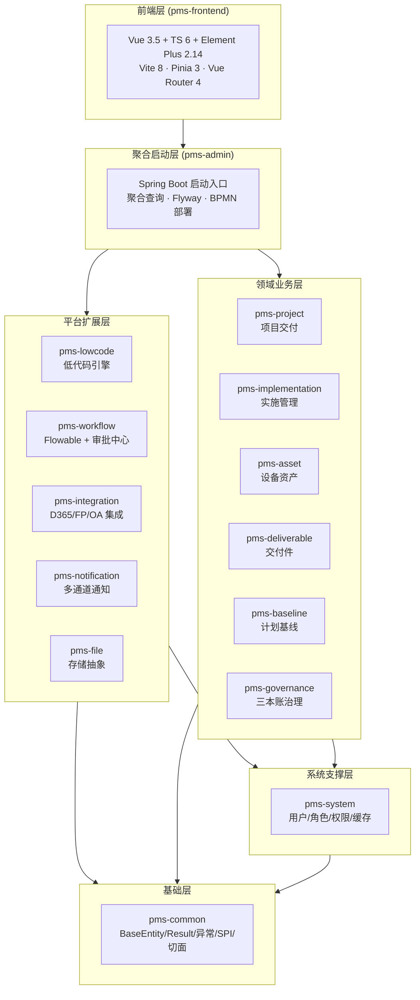
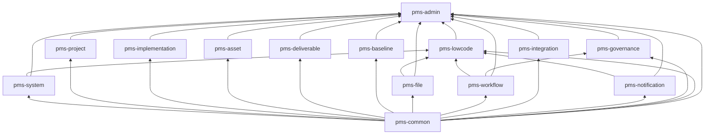
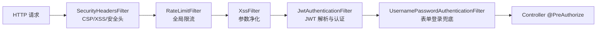
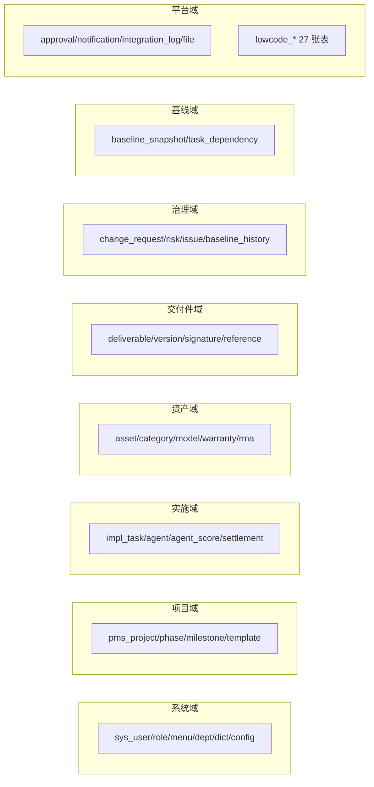
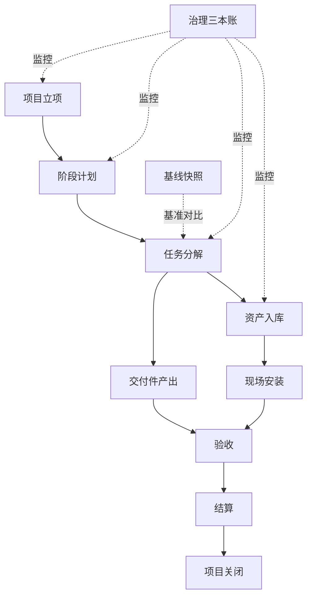
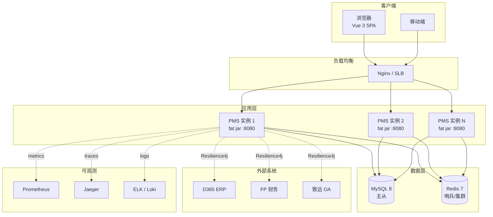

# 02 - HLD 概要设计说明书

> 网络设备工程项目交付管理平台（network-equipment-pms）高层设计说明书
> 版本：v1.0.0 · 状态：基线发布 · 维护：架构组

---

## 文档信息

### 1.1 文档目的

本文档是网络设备工程项目交付管理平台（以下简称"PMS 平台"）的高层设计说明书（High Level Design，HLD），面向项目经理、技术负责人、架构评审委员会与运维团队，对系统的整体架构、技术选型、数据组织、核心设计决策、接口契约、非功能性能力与部署运维方案进行概要性阐述，作为后续《详细设计说明书》（LLD）、《数据库设计文档》与各模块实现工作的纲领性输入。

本文档不展开到方法级签名、字段级类型与 SQL 细节，这部分内容在 LLD 与 DB 设计文档中详细描述；本文档关注的是分层、模块、领域、决策依据与系统级非功能性约束。

### 1.2 适用读者

| 角色 | 关注重点 |
|------|----------|
| 项目经理 | 模块划分、依赖关系、里程碑、风险点 |
| 架构师 | 分层架构、技术选型、核心设计决策、跨模块解耦策略 |
| 开发负责人 | 模块职责、SPI 接口、关键流程、接口契约 |
| 运维负责人 | 部署形态、Profile 分级、可观测性、外部集成 |
| 测试负责人 | 状态机、关键流程、非功能性指标 |

### 1.3 修订记录

| 版本 | 日期 | 修订人 | 说明 |
|------|------|--------|------|
| v1.0.0 | 2026-07-22 | 架构组 | 基线发布，覆盖 14 个后端模块 + 1 个前端模块 |

### 1.4 参考文档

- 《01-SRS-需求规格说明书》
- 《00-PRD-产品需求文档》
- 《03-LLD-详细设计说明书》
- 《04-DB-数据库设计文档》
- PMBOK 第 7 版项目管理实践
- Cisco PPDIOO 网络生命周期方法论
- Flowable 7.0.1 官方文档
- Spring Boot 3.2.5 参考文档

### 1.5 术语与缩略语

| 术语 | 全称 | 含义 |
|------|------|------|
| PMS | Project Management System | 项目管理系统（本平台） |
| PPDIOO | Prepare/Plan/Design/Implement/Operate/Optimize | Cisco 网络生命周期方法论 |
| HLD | High Level Design | 概要设计 |
| LLD | Low Level Design | 详细设计 |
| SPI | Service Provider Interface | 服务提供者接口（解耦机制） |
| CCB | Change Control Board | 变更控制委员会 |
| BPMN | Business Process Model and Notation | 业务流程建模标记法 |
| D365 | Microsoft Dynamics 365 | 微软 ERP 系统 |
| FP | Financial Platform | 财务平台 |
| OA | Office Automation | 协同办公系统（致远 OA） |
| RMA | Return Merchandise Authorization | 退换货授权 |
| SLA | Service Level Agreement | 服务等级协议 |
| Saga | — | 跨服务事务编排模式 |
| DAG | Directed Acyclic Graph | 有向无环图 |
| ER | Entity Relationship | 实体关系 |

---

## 2. 系统总体设计

### 2.1 系统定位与业务背景

PMS 平台是为网络设备工程项目交付场景量身打造的一体化管理平台，覆盖从项目立项、阶段计划、任务执行、设备资产、交付件管理、计划基线、风险治理到最终验收、结算关闭的全生命周期。平台同时内嵌一个完整的低代码能力底座，允许业务方在不动代码的前提下配置表单、列表、微流、规则、流程与连接器，从而支持网络割接、备件流转等场景化扩展。

平台以 PMBOK 三本账（变更请求、风险登记册、问题日志）作为治理主线，以 Cisco PPDIOO 方法论作为项目阶段编排主线，二者交叉形成"治理-工程"双轮驱动的项目交付模型。

### 2.2 系统总体目标

1. **统一项目交付主数据**：所有项目、阶段、任务、资产、交付件、基线、风险、问题均纳入同一平台，避免数据孤岛。
2. **流程驱动审批**：基于 Flowable 7.0.1 + 自建统一审批中心双轨机制，覆盖项目立项、资产调拨、最终验收、结算、CCB 变更等 5+ 类审批场景。
3. **配置即应用**：通过低代码平台实现"无需重新部署即可生成新业务页面与流程"。
4. **企业级集成**：与 D365（ERP）、FP（财务）、OA（协同）三套外部系统双向集成，全链路具备熔断、限流、重试、可观测能力。
5. **多终端触达**：Vue 3 前端 + WebSocket 实时推送 + 移动端断点适配，支持桌面、平板、手机多终端办公。

### 2.3 分层架构

PMS 平台采用六层分层架构。下层为上层提供服务，上层不感知下层实现细节；同层模块之间通过 SPI 接口或聚合层协作，禁止横向直接依赖。



各层职责说明：

| 层级 | 层名 | 包含模块 | 核心职责 |
|------|------|----------|----------|
| L6 | 前端层 | pms-frontend | SPA 单页应用，业务前台 + 低代码设计器 + 系统控制台 |
| L5 | 聚合启动层 | pms-admin | Spring Boot 唯一启动入口；跨模块聚合查询；Flyway 迁移；BPMN 流程部署；Actuator 健康检查 |
| L4 | 平台扩展层 | pms-lowcode / pms-workflow / pms-integration / pms-notification / pms-file | 提供低代码、工作流、外部集成、通知、文件存储等横向能力 |
| L3 | 领域业务层 | pms-project / pms-implementation / pms-asset / pms-deliverable / pms-baseline / pms-governance | 承载项目交付主流程的核心业务领域 |
| L2 | 系统支撑层 | pms-system | 用户、角色、菜单、字典、配置、权限、安全、缓存、操作日志 |
| L1 | 基础层 | pms-common | BaseEntity、Result、异常体系、SPI 接口、切面（限流/幂等/字段加密/链路追踪/Saga） |

### 2.4 模块清单与定位

PMS 平台后端共 14 个 Maven 模块，全部以 `com.dp.plat` 为基础包名，统一打包为可执行 fat jar 由 `pms-admin` 聚合启动。

| 序号 | 模块 | artifactId | 基础包 | 打包 | 层级 | 一句话职责 |
|------|------|-----------|--------|------|------|------------|
| 1 | 公共基础 | pms-common | com.dp.plat.common | jar | L1 | 横切关注点与 12 个 SPI 接口 |
| 2 | 系统中台 | pms-system | com.dp.plat.system | jar | L2 | 用户/角色/权限/JWT/缓存 |
| 3 | 项目交付 | pms-project | com.dp.plat.project | jar | L3 | 项目/阶段/里程碑/模板 |
| 4 | 实施管理 | pms-implementation | com.dp.plat.implementation | jar | L3 | 任务树/双轨进度/结算 |
| 5 | 设备资产 | pms-asset | com.dp.plat.asset | jar | L3 | 9 态资产/调拨/RMA/质保 |
| 6 | 交付件 | pms-deliverable | com.dp.plat.deliverable | jar | L3 | 7 态状态机/版本/签核 |
| 7 | 计划基线 | pms-baseline | com.dp.plat.baseline | jar | L3 | 任务依赖/基线快照/偏差监控 |
| 8 | 文件管理 | pms-file | com.dp.plat.file | jar | L4 | Local/OSS/MinIO + EXIF |
| 9 | 工作流 | pms-workflow | com.dp.plat.workflow | jar | L4 | Flowable + 统一审批中心 |
| 10 | 外部集成 | pms-integration | com.dp.plat.integration | jar | L4 | D365/FP/OA + Resilience4j |
| 11 | 通知中心 | pms-notification | com.dp.plat.notification | jar | L4 | 4 通道投递 + WebSocket |
| 12 | 项目治理 | pms-governance | com.dp.plat.governance | jar | L3 | 三本账 + CCB + 5×5 矩阵 |
| 13 | 低代码 | pms-lowcode | com.dp.plat.lowcode | jar | L4 | 实体/微流/规则/连接器/触发器 |
| 14 | 聚合启动 | pms-admin | com.dp.plat.admin | jar | L5 | Spring Boot 启动 + 聚合查询 |

前端独立为 `pms-frontend` 目录，使用 Vite 8 构建，与后端通过 `/api/*` REST + `/ws` WebSocket 通信。

### 2.5 模块依赖关系图

模块依赖遵循"上层依赖下层、同层不互依"原则，跨层模块协作通过 SPI 或聚合层完成。



依赖关系关键约束：

1. **pms-common 是所有模块的根依赖**，提供 `BaseEntity`、`Result`、异常体系、SPI 接口与切面基础设施。
2. **pms-admin 是顶层聚合模块**，被 `spring-boot-maven-plugin` 重新打包为可执行 fat jar，自身不被任何内部模块依赖。
3. **业务模块之间禁止横向依赖**：`pms-deliverable` 需要查询实施任务、资产、项目阶段等时，必须通过 `pms-admin` 的聚合控制器（`DeliverableRefEntityController`）完成，避免业务模块互相耦合。
4. **跨模块解耦通过 SPI**：12 个 SPI 接口定义在 `pms-common` 中，由各业务模块提供实现，调用方仅依赖接口不依赖实现模块。
5. **可选依赖通过 ObjectProvider**：`pms-governance` 注入 `WorkflowService` 时使用 `ObjectProvider<WorkflowService>`，工作流模块未加载时治理模块仍可独立运行。

### 2.6 跨模块 SPI 解耦机制

平台在 `pms-common` 中定义 12 个 SPI 接口，由各业务模块按需提供实现，调用方仅依赖接口。这种设计避免了上层模块对下层实现模块的直接依赖，支持模块按需装载与运行时降级。

| SPI 接口 | 提供方 | 消费方 | 用途 |
|----------|--------|--------|------|
| `ProjectApprovalTrigger` | pms-project | pms-workflow | 项目审批触发回调 |
| `ProjectStatusChecker` | pms-project | pms-baseline | 基线变更前校验项目状态 |
| `ApprovalTrigger` | pms-workflow | pms-project | 审批触发统一入口 |
| `ApprovalStatusChecker` | pms-workflow | pms-project | 审批状态查询 |
| `ApprovalPlanBatchCreator` | pms-workflow | pms-project | 审批计划批量创建 |
| `AssetStockChecker` | pms-asset | pms-implementation | 结算前校验资产库存 |
| `DeliverableFinalCheckSpi` | pms-deliverable | pms-project | 终验前交付件校验 |
| `TaskProgressProvider` | pms-implementation | pms-project | 项目进度聚合查询 |
| `BaselineChangeTrigger` | pms-baseline | pms-project | 基线变更触发项目重规划 |
| `NotificationSender` | pms-notification | 多个业务模块 | 统一通知发送 |
| `FileStorageSpi` | pms-file | 多个业务模块 | 文件存储抽象 |
| `IntegrationRetrySpi` | pms-integration | pms-workflow | 集成失败重试触发 |

SPI 实现通过 Spring `@Autowired(required=false)` 或 `ObjectProvider` 注入，未加载时优雅降级，保证模块独立可运行。

---

## 3. 技术架构

### 3.1 技术栈总览

#### 3.1.1 后端技术栈

| 维度 | 选型 | 版本 | 用途 |
|------|------|------|------|
| JDK | OpenJDK | 17 (LTS) | 运行时 |
| 框架 | Spring Boot | 3.2.5 | 应用框架 |
| Web | Spring MVC | 6.1.x (随 Spring Boot) | REST API |
| 安全 | Spring Security | 6.2.x (随 Spring Boot) | 认证授权 |
| ORM | MyBatis-Plus | 3.5.5 | 持久层 |
| 工作流 | Flowable | 7.0.1 | BPMN 引擎 |
| 缓存 | Redis | 7.x + Lettuce | 分布式缓存与 Pub/Sub |
| 数据库 | MySQL | 8.0.16 | 主库 |
| 连接池 | HikariCP | 5.x (随 Spring Boot) | 数据库连接池 |
| JSON | Jackson | 2.13.x (随 Spring Boot) + Fastjson 1.2.83 | 序列化 |
| Excel | Apache POI 5.2.0 + EasyExcel 3.1.1 | — | 导入导出 |
| 日志 | Logback + Logstash Encoder 7.4 | — | 结构化日志 |
| 模板 | FreeMarker | — | 通知模板渲染 |
| 规则引擎 | Aviator 5.4.3 + LiteFlow 2.15.0 + Groovy 3.0.19 | — | 低代码规则沙箱 |
| 弹性容错 | Resilience4j | 2.2.0 | 熔断/限流/重试/隔离 |
| 数据库迁移 | Flyway | 9.x (随 Spring Boot) | DDL 版本管理 |
| 可观测 | Micrometer + Prometheus + OpenTelemetry | — | 指标/追踪 |
| 测试 | JUnit 5 + Mockito + Testcontainers | — | 单元 + 集成测试 |

#### 3.1.2 前端技术栈

| 维度 | 选型 | 版本 | 用途 |
|------|------|------|------|
| 框架 | Vue | 3.5 | `<script setup>` SFC |
| 语言 | TypeScript | 6.0 | strict 模式 |
| 构建 | Vite | 8.1 | dev/build |
| 路由 | Vue Router | 4.6 | SPA 路由 |
| 状态 | Pinia | 3.0 | 状态管理 |
| UI | Element Plus | 2.14 | 组件库 |
| HTTP | Axios | 1.18 | REST 客户端 |
| 图编辑 | AntV X6 3 / G6 5 / bpmn-js 18 | — | 微流/实体/流程设计器 |
| 代码编辑 | Monaco Editor | 0.55 | 表达式编辑器 |
| 图表 | ECharts | 6 | 仪表盘 |
| Excel | SheetJS (xlsx) | 0.18 | 前端导入导出 |
| 安全 | DOMPurify | 3 | XSS 净化 |
| 测试 | Vitest 4 + Playwright 1.49 | — | 单元 + E2E |
| Lint | ESLint 9 + typescript-eslint | — | 代码规范 |

### 3.2 后端配置与启动

#### 3.2.1 启动类

`com.dp.plat.admin.PmsApplication` 作为唯一启动入口：

```java
@SpringBootApplication(scanBasePackages = "com.dp.plat")
@MapperScan({"com.dp.plat.**.mapper", "com.dp.plat.**.dao", "com.dp.plat.**.engine.ddl"})
@EnableScheduling
@EnableRetry
public class PmsApplication {
    public static void main(String[] args) {
        SpringApplication.run(PmsApplication.class, args);
    }
}
```

| 注解 | 作用 |
|------|------|
| `@SpringBootApplication(scanBasePackages = "com.dp.plat")` | 组件扫描覆盖 14 个内部模块 |
| `@MapperScan({"com.dp.plat.**.mapper", "com.dp.plat.**.dao", "com.dp.plat.**.engine.ddl"})` | MyBatis-Plus Mapper 扫描三条路径 |
| `@EnableScheduling` | 启用 Quartz / `@Scheduled` 定时任务（集成重试、质保扫描） |
| `@EnableRetry` | 启用 Spring Retry，配合外部集成失败重试 |

#### 3.2.2 Profile 分级

平台支持 4 套 Spring Profile，分别对应不同环境：

| Profile | 配置文件 | 用途 | 关键差异 |
|---------|----------|------|----------|
| 默认 | `application.yml` | 开发环境 | HikariCP min=5/max=20；Flyway 跳过 checksum；Swagger 启用；内置 JWT 密钥 |
| prod | `application-prod.yml` | 生产环境 | HikariCP min=10/max=50；JWT_SECRET 必须环境变量；关闭 Swagger；日志 INFO |
| mock | `application-mock.yml` | 本地联调 | 对接 mock-d365/mock-fp/mock-oa；集成日志 DEBUG |
| test | `application-test.yml`（test/resources） | 集成测试 | 端口随机；Testcontainers 动态注入；关闭外部调用与可观测性 |

### 3.3 安全架构

平台采用 Spring Security 6 + JWT 无状态会话 + RBAC 权限模型，安全过滤器链按顺序执行：



| 组件 | 所在模块 | 职责 |
|------|----------|------|
| SecurityConfig | pms-system | 过滤器链装配；STATELESS 会话；BCrypt 密码；`@EnableMethodSecurity` |
| JwtAuthenticationFilter | pms-system | 从 Authorization 头解析 JWT，构造 Authentication |
| RateLimitFilter | pms-common | 全局限流（基于 Redis + Lua） |
| XssFilter | pms-common | 参数级 XSS 净化 |
| SecurityHeadersFilter | pms-common | CSP、X-Frame-Options 等安全头注入 |
| IdempotentAspect | pms-common | 写操作幂等键校验（X-Idempotent-Key 头） |
| FieldEncryptAspect | pms-common | AES-256-GCM 字段级加密 |
| @PreAuthorize | 各 Controller | 方法级权限码校验 |

JWT 配置：`jwt.secret`（Base64 编码，prod 必须环境变量覆盖），`jwt.expiration = 86400000`（24 小时）。Redis 黑名单支持主动登出。

### 3.4 缓存架构

`pms-system` 的 `RedisConfig` 配置了多级 Redis 缓存：

| 命名缓存 | TTL | 用途 |
|----------|-----|------|
| sysDict | 60 min | 数据字典 |
| sysMenu | 60 min | 菜单树 |
| sysConfig | 60 min | 系统配置 |
| sysRole | 60 min | 角色与权限 |
| 默认 | 30 min + 0~5 min 随机抖动 | 通用 |

防雪崩策略：默认 TTL 加 0~5 分钟随机抖动；`disableCachingNullValues` 防穿透。

### 3.5 可观测性三件套

平台同时启用 Metrics、Tracing、Logging 三套可观测性能力，通过 `traceId` 关联：

| 能力 | 技术 | 端点 | 关键指标 |
|------|------|------|----------|
| Metrics | Micrometer + Prometheus | `/actuator/prometheus` | HTTP 请求直方图 + p50/p95/p99 + SLO（50/100/200/500ms/1/2/5s） |
| Tracing | OpenTelemetry OTLP gRPC → Jaeger | `localhost:4317` | traces 采样 10%，metrics/logs 关闭避免重复 |
| Logging | Logback + Logstash Encoder | 控制台 + JSON 文件 | MDC traceId/userId/username/requestUri/method；按天 + 100MB 滚动，保留 30 天，10GB 上限 |

Actuator 暴露端点：`health,info,metrics,prometheus,env,configprops,loggers,scheduledtasks,threaddump`；`health.show-details: when_authorized`。

### 3.6 健康检查双轨制

pms-admin 提供两个自定义健康指示器，与 Spring Boot 默认 `db` / `redis` 并存互补：

| 健康检查 | Bean 名 | 检查内容 |
|----------|---------|----------|
| pmsDatabase | pmsDatabaseHealthIndicator | `Connection.isValid(5)` + 查询 `pms_project` / `sys_user` 行数确认表结构可访问 |
| pmsRedis | pmsRedisHealthIndicator | `RedisConnection.ping()` 验证 Redis 可用性 |

---

## 4. 数据架构

### 4.1 数据库选型

- **主库**：MySQL 8.0.16（InnoDB 引擎，utf8mb4 字符集，utf8mb4_0900_ai_ci 排序规则）
- **缓存**：Redis 7.x（Lettuce 客户端）
- **外部数据源**：D365 / FP / OA（SQL Server / REST API），通过 `pms-integration` 适配
- **低代码动态数据源**：MySQL / PostgreSQL / SQL Server（通过 `LowCodeDataSource` 动态注册 HikariDataSource）

### 4.2 数据库设计原则

| 原则 | 说明 |
|------|------|
| 物理外键仅在强约束场景使用 | 多数业务表通过 `(biz_type, biz_id)` 弱关联，避免外键带来的级联锁与迁移复杂度 |
| 逻辑删除统一字段 | 所有继承 `BaseEntity` 的实体使用 `deleted` 字段（0/1，`@TableLogic`） |
| 审计字段统一填充 | `BaseEntity` 含 `id` / `createTime` / `updateTime` / `createBy` / `updateBy` / `deleted`，由 `MetaObjectHandler` 自动填充 |
| 主键策略 | `IdType.AUTO`（数据库自增），部分场景使用应用层 UUID |
| 乐观锁 | 高并发更新实体使用 `@Version`（如 `ChangeRequest` / `ApprovalRecord` / `ApprovalFieldPermission`） |
| JSON 字段 | 配置类、版本快照、模板变量等使用 TEXT 存储 JSON，通过 JacksonTypeHandler 序列化 |
| 命名规范 | 表名前缀 `pms_`（业务表）、`sys_`（系统表）、`pms_lowcode_`（低代码表）、`d365_`（外部集成表）、`act_`（Flowable 引擎表） |

### 4.3 数据域划分

平台数据按业务域划分为 8 个核心数据域：



### 4.4 数据流转

平台核心数据流自上而下贯穿"项目 → 阶段 → 任务 → 交付件 → 资产 → 验收 → 结算 → 关闭"，同时通过治理域横向监控：



### 4.5 数据生命周期

| 数据类型 | 创建时机 | 归档/清理策略 |
|----------|----------|--------------|
| 项目主数据 | 立项审批通过 | 项目关闭后归档，不删除 |
| 任务数据 | 阶段计划制定 | 跟随项目归档 |
| 交付件版本 | 每次提交 | 不可变历史，永久保留 |
| 资产数据 | 入库 | 设备退役后状态置 `DECOMMISSIONED`，保留历史 |
| 审批记录 | 提交审批 | 不可变历史（含多轮次），永久保留 |
| 通知 | 事件触发 | 不参与逻辑删除，永久审计留存 |
| 操作日志 | 任意写操作 | 永久保留（合规要求） |
| 集成日志 | 外部调用 | 永久保留（重试与审计依据） |
| 文件元数据 | 上传 | 跟随业务实体生命周期 |
| 低代码配置 | 设计器保存 | 版本快照不可变，旧版本 ARCHIVED |

---

## 5. 核心设计决策

本章阐述平台 8 个核心设计决策，每项决策记录背景、决策、依据与影响。

### 5.1 决策 D-01：采用 PPDIOO 方法论作为项目阶段编排主线

**背景**：网络设备工程项目交付遵循 Cisco PPDIOO（Prepare/Plan/Design/Implement/Operate/Optimize）网络生命周期方法论，需要平台对项目阶段进行规范化建模。

**决策**：在 `pms-project` 中建立 11 态项目状态机 + 4 态阶段状态机 + 5 态里程碑状态机，并预置 PPDIOO 12 节点里程碑模型。

**依据**：
- 状态机驱动确保阶段推进有据可依，避免跳跃式状态转换
- PPDIOO 12 节点里程碑模型覆盖网络设备交付典型节点，减少用户配置成本
- 4 类阶段退出闸门（DELIVERABLE/TASK/MILESTONE/APPROVAL）确保阶段交付质量

**影响**：
- 项目状态机：`PENDING/APPROVED/PLANNING/IN_PROGRESS/INITIAL_ACCEPTANCE/FINAL_ACCEPTANCE/CLOSING/COMPLETED/CLOSED/CANCELLED/REJECTED`
- 阶段状态机：`PLANNED/IN_PROGRESS/COMPLETED/SKIPPED`
- 里程碑状态机：`PLANNED/IN_PROGRESS/ACHIEVED/MISSED/SKIPPED`
- 阶段退出闸门强制校验：交付件齐全、任务完成率达标、里程碑达成、审批通过

### 5.2 决策 D-02：采用物化路径（Materialized Path）多层级项目模型

**背景**：项目可能包含子项目、孙项目，需要高效查询任意层级子树。

**决策**：`pms_project` 表使用 `project_path`（如 `/1/3/7/`）+ `depth`（层级深度）+ `parent_project_id`（直接父节点）三字段建模多层级树。

**依据**：
- 物化路径支持 `LIKE '/1/3/%'` 一次查询获取整棵子树，性能优于递归 CTE
- `depth` 字段支持按层级过滤与统计
- `parent_project_id` 支持直接父节点导航
- 模板深拷贝 12 步流程基于物化路径递归复制子树

**影响**：
- 查询子树性能 O(1) 数据库扫描
- 项目移动时需重算 `project_path`（限制场景，频率低）
- 配套提供 `SubProjectTree` 前端组件递归渲染

### 5.3 决策 D-03：采用 SPI 机制解耦跨模块依赖

**背景**：14 个模块之间存在大量跨模块调用（如审批触发项目回调、基线变更前校验项目状态），直接依赖会导致循环依赖与模块耦合。

**决策**：在 `pms-common` 中定义 12 个 SPI 接口，由各业务模块提供实现，调用方仅依赖接口。

**依据**：
- 接口隔离原则：调用方不感知实现模块
- 模块按需装载：实现模块未加载时调用方优雅降级
- 测试友好：可注入 Mock 实现单元测试
- 与 Spring `@Autowired(required=false)` / `ObjectProvider` 配合实现运行时解耦

**影响**：
- `pms-project` 不依赖 `pms-workflow`，通过 `ApprovalTrigger` SPI 触发审批
- `pms-governance` 通过 `ObjectProvider<WorkflowService>` 注入工作流，未加载时治理模块独立运行
- 12 个 SPI 接口成为平台扩展点，第三方可按需实现替换

### 5.4 决策 D-04：采用双轨进度（任务完成率 + 工时完成率）

**背景**：传统项目管理系统仅以任务完成数计算进度，无法反映工时投入与剩余工作量。

**决策**：`pms-implementation` 实现双轨进度汇总：
- **任务完成率** = 已完成任务数 / 总任务数
- **工时完成率** = 已投入工时 / 计划总工时

**依据**：
- 双轨进度更真实反映项目进展
- 任务完成率反映"做了多少"，工时完成率反映"投入多少"
- 两个指标偏离过大时预警（如任务完成 80% 但工时仅投入 30%，说明任务拆分过粗或估算偏差）

**影响**：
- 双轨进度同步递归 + 异步持久化两套机制
- 阶段退出闸门支持双阈值校验
- 前端项目工作区概览 Tab 同时展示两个进度

### 5.5 决策 D-05：采用 Saga 模式编排跨服务事务

**背景**：项目结算涉及任务完成确认、资产交付确认、发票生成、FP 推送、D365 同步多个步骤，跨越多个模块与外部系统，传统 2PC 不可行。

**决策**：在 `pms-implementation` 中实现结算 Saga 6 步编排，每步定义补偿动作。

**依据**：
- Saga 模式适用于长事务、跨服务、需最终一致性的场景
- 每步补偿动作可独立执行，失败时回滚已执行步骤
- 配合 `pms-integration` 的 Resilience4j 重试机制提高成功率

**影响**：
- 结算 Saga 6 步：任务完成校验 → 资产交付确认 → 发票生成 → FP 推送 → D365 同步 → 结算状态置完成
- 每步失败触发对应补偿（如 FP 推送失败回滚发票生成）
- Saga 编排状态持久化，支持断点续传

### 5.6 决策 D-06：采用 Flowable + 自建审批中心双轨机制

**背景**：业务方需要灵活配置审批流程（动态审批人、多级审批、字段脱敏），但 Flowable BPMN 流程定义修改门槛高、上线周期长。

**决策**：`pms-workflow` 实现 Flowable + 自建审批中心双轨：
- **自建表**（`pms_approval_record/node/history/field_permission`）承载审批流转主路径
- **Flowable 引擎**作为可选增强（启动 BPMN 实例、OA 镜像、流程图渲染）
- Flowable 引擎不可用时不阻断审批创建（best-effort）

**依据**：
- 双轨并存兼顾灵活性与流程引擎能力
- 自建表支持字段级脱敏（VISIBLE/MASKED/HIDDEN 三态）、超时调度、多轮次审批
- Flowable BPMN 流程定义可通过低代码流程设计器可视化编辑

**影响**：
- 审批记录复用原记录，退回后重新提交 `round+1`
- 字段脱敏按审批节点 + 业务实体 + 字段维度配置
- 审批超时调度扫描 `timeout_at` 触发升级
- OA 任务监听器（`OaTaskListener`）将 Flowable 任务事件镜像到致远 OA

### 5.7 决策 D-07：采用 JacksonTypeHandler 解决泛型擦除问题

**背景**：MyBatis-Plus 默认 JacksonTypeHandler 在泛型字段（如 `Map<String, Object>`）序列化时存在类型擦除问题，导致反序列化后字段类型丢失。

**决策**：在 `pms-common` 中提供自定义 JacksonTypeHandler 子类，通过 `Class` 显式声明泛型类型，避免擦除。

**依据**：
- MyBatis-Plus JacksonTypeHandler 默认使用 `Object.class`，反序列化时全部为 `LinkedHashMap`
- 自定义子类通过 `Class<T>` 构造参数显式声明目标类型
- 配合 Jackson `TypeReference` 处理复杂泛型

**影响**：
- 实体中 JSON 字段（如 `LowCodeForm.formConfig`、`ApprovalFieldPermission.maskPattern`）反序列化类型正确
- 减少业务代码手动类型转换

### 5.8 决策 D-08：采用物化路径任务树 + 任务依赖 DFS 循环检测

**背景**：项目任务数量大（数千至上万），存在前后依赖关系，需要高效查询任务树与检测循环依赖。

**决策**：
- 任务树采用物化路径（`task_path` + `depth` + `parent_task_id`）建模，与项目树一致
- 任务依赖关系独立存储（`task_dependency` 表），循环检测采用 DFS + 增量按需加载

**依据**：
- 物化路径支持 `LIKE '/1/3/%'` 一次查询子树
- DFS 检测循环依赖准确性高
- 增量按需加载避免全量任务图加载到内存（万级任务场景内存压力）
- 配合 `pms-baseline` 的基线快照，可对比计划与实际偏差

**影响**：
- 任务依赖修改时实时 DFS 检测，发现循环抛 `BusinessException`
- 前端 `DependencyGraph` 组件基于 AntV G6 v5 渲染 DAG，循环依赖高亮
- 基线偏差监控按三阈值（进度/成本/范围）触发审批

---

## 6. 接口设计概述

### 6.1 接口风格约定

平台所有对外接口均为 RESTful JSON API，遵循以下约定：

| 维度 | 约定 |
|------|------|
| 协议 | HTTP/HTTPS |
| 数据格式 | JSON（UTF-8） |
| 认证 | Bearer JWT（`Authorization: Bearer <token>`） |
| 幂等键 | 写操作支持 `X-Idempotent-Key` 头（UUID v4） |
| 响应信封 | `{ "code": 200, "message": "操作成功", "data": <T> }` |
| 分页响应 | `{ "records": [], "total": 100, "page": 1, "size": 10 }`（部分模块用 `current/size/pages`） |
| 错误响应 | `{ "code": 400/401/403/500, "message": "错误描述", "data": null }` |
| 时间格式 | ISO 8601（`yyyy-MM-dd'T'HH:mm:ss`） |
| 文件上传 | `multipart/form-data` |
| 字段命名 | 后端驼峰、数据库下划线、前端与后端严格对齐（如 `projectCode`） |

### 6.2 接口分组与路径前缀

平台 REST API 按模块分组，路径前缀与模块对应：

| 模块 | 路径前缀 | 主要端点数 |
|------|----------|-----------|
| 认证 | `/api/auth` | 3 |
| 系统管理 | `/api/system/*` | 60+ |
| 项目 | `/api/project/*` | 40+ |
| 项目阶段 | `/api/project/phase/*` | 10+ |
| 项目模板 | `/api/project/template/*` | 10+ |
| 实施任务 | `/api/implementation/task/*` | 20+ |
| 代理商 | `/api/implementation/agent/*` | 10+ |
| 结算 | `/api/implementation/settlement/*` | 10+ |
| 资产 | `/api/asset/*` | 30+ |
| 基线 | `/api/baseline/*` | 10+ |
| 交付件 | `/api/deliverable/*` | 20+ |
| 工作流 | `/api/workflow/*` | 20+ |
| 审批中心 | `/api/workflow/approval/*` | 15+ |
| 治理-变更 | `/api/governance/change-request/*` | 10+ |
| 治理-风险 | `/api/governance/risk/*` | 10+ |
| 治理-问题 | `/api/governance/issue/*` | 10+ |
| 通知 | `/api/notification/*` | 5+ |
| 集成-D365 | `/api/integration/d365/*` | 6 |
| 集成-FP | `/api/integration/fp/*` | 4 |
| 集成-OA | `/api/integration/oa/*` | 4 |
| 集成-日志 | `/api/integration/log/*` | 3 |
| 集成-健康 | `/api/integration/health` | 1 |
| 文件 | `/api/file/*` | 5+ |
| 低代码 | `/api/lowcode/*` | 200+ |
| 报表 | `/api/report/*` | 7 |
| WebSocket | `/ws`（STOMP 端点） | — |

### 6.3 鉴权与权限

- **认证**：JWT Bearer Token，24 小时过期，Redis 黑名单支持主动登出
- **授权**：Spring Security `@PreAuthorize` + RBAC 权限码（如 `project:project:add` / `governance:changeRequest:process`）
- **权限码命名约定**：`<模块>:<资源>:<动作>`（如 `lowcode:form:list`）
- **超级管理员**：权限码含 `*` 全量放行
- **低代码动态权限**：`lowcode:data:{entityCode}:{action}` 按实体粒度授权

### 6.4 关键接口契约示例

#### 6.4.1 项目立项审批

```
POST /api/project/{id}/submit-approval
Authorization: Bearer <token>
X-Idempotent-Key: <uuid>
Content-Type: application/json

Response:
{
  "code": 200,
  "message": "操作成功",
  "data": {
    "id": 123,
    "projectCode": "PRJ-2026-0001",
    "status": "APPROVED",
    "processInstanceId": "flowable-xxx"
  }
}
```

#### 6.4.2 任务双轨进度查询

```
GET /api/implementation/task/{taskId}/progress

Response:
{
  "code": 200,
  "data": {
    "taskCompletionRate": 0.75,
    "workHourCompletionRate": 0.60,
    "plannedWorkHours": 100,
    "actualWorkHours": 60,
    "completedSubTasks": 15,
    "totalSubTasks": 20
  }
}
```

#### 6.4.3 审批中心提交

```
POST /api/workflow/approval/submit
Authorization: Bearer <token>
X-Idempotent-Key: <uuid>
Content-Type: application/json

Body:
{
  "approvalType": "PROJECT",
  "businessId": 123,
  "businessCode": "PRJ-2026-0001",
  "projectId": 123,
  "title": "项目立项审批",
  "submitterId": 456,
  "submitterName": "张三",
  "nodes": [
    {"nodeName": "PM审核", "nodeOrder": 1, "approverId": 789},
    {"nodeName": "部门经理审核", "nodeOrder": 2, "approverRole": "DEPT_MANAGER"}
  ]
}
```

#### 6.4.4 通知多通道投递

```
POST /api/notification/send
Authorization: Bearer <token>
Content-Type: application/json

Body:
{
  "userId": 456,
  "title": "任务分派通知",
  "content": "您被分派了任务：网络设备安装",
  "category": "TASK",
  "bizType": "TASK_ASSIGNED",
  "bizId": 789,
  "channels": ["IN_APP", "WS", "EMAIL"]
}
```

### 6.5 WebSocket 接口

平台使用 STOMP over WebSocket 实现实时通知推送：

| 维度 | 配置 |
|------|------|
| 端点 | `/ws`（不启用 SockJS，前端原生 WebSocket） |
| 广播频道 | `/topic/notification/{userId}` |
| 应用目的地前缀 | `/app` |
| 心跳 | 10s（入站/出站） |
| 消息大小上限 | 64KB |
| 鉴权 | 握手阶段从 `Authorization: Bearer` 头或 `?token=` 查询参数解析 JWT，提取 `userId` 存入会话属性 |

跨实例广播：通过 Redis Pub/Sub 频道 `pms:notification:broadcast` 广播，各实例 `NotificationSubscriber` 订阅后推送到本地 STOMP 频道。

---

## 7. 非功能性设计

### 7.1 性能设计

| 指标 | 目标 | 设计措施 |
|------|------|----------|
| API p95 延迟 | < 500ms（读）/ < 1s（写） | HikariCP 连接池；Redis 缓存；MyBatis-Plus 分页；批量查询避免 N+1 |
| API p99 延迟 | < 2s | 同上 + 慢 SQL 监控（Druid 1.2.8） |
| 项目树查询 | < 200ms（万级项目） | 物化路径 LIKE 查询 |
| 任务树查询 | < 500ms（万级任务） | 物化路径 + 增量按需加载 |
| 仪表盘聚合 | < 1s | 内存分组 + 批量加载避免 N+1 |
| WebSocket 推送延迟 | < 1s | Redis Pub/Sub 跨实例广播 |

### 7.2 可用性设计

| 维度 | 目标 | 设计措施 |
|------|------|----------|
| 系统可用性 | 99.9% | 多实例部署；Redis 哨兵/集群；MySQL 主从 |
| 故障恢复 | < 5 分钟 | 健康检查双轨制；Resilience4j 熔断自恢复 |
| 数据持久性 | RPO = 0 | MySQL 主从同步；Flyway 不可逆迁移；逻辑删除 |
| 外部集成容错 | 单系统故障不影响主流程 | Resilience4j 熔断 + 降级；集成日志驱动重试 |

### 7.3 安全性设计

| 维度 | 措施 |
|------|------|
| 认证 | JWT Bearer Token + Redis 黑名单 |
| 授权 | RBAC 权限码 + `@PreAuthorize` + 低代码动态权限 |
| 传输安全 | HTTPS（生产强制）+ CSP 安全头 |
| 参数安全 | XssFilter 净化 + Bean Validation + 字段白名单 |
| 字段加密 | AES-256-GCM 字段级加密（敏感字段如连接器凭据） |
| 幂等性 | `X-Idempotent-Key` 头 + Redis 幂等键校验 |
| 限流 | RateLimitFilter 全局限流 + Resilience4j RateLimiter |
| 审计 | `@OperLog` 操作日志 + 登录日志 + 配置审计 AOP |
| 低代码沙箱 | Groovy SecureASTCustomizer + Aviator 独立实例 + 禁用危险特性 |
| SQL 注入防护 | MyBatis 参数化 + 字段名白名单 + 标识符正则 |
| DDL 安全 | `DdlExecutionService` 危险语句拦截 + 执行前备份 + 回滚机制 |

### 7.4 可扩展性设计

| 维度 | 措施 |
|------|------|
| 水平扩展 | 无状态会话（JWT）+ Redis 共享缓存 + WebSocket 跨实例广播 |
| 模块扩展 | 14 模块化 + SPI 接口 + ObjectProvider 可选依赖 |
| 业务扩展 | 低代码平台配置即应用（表单/列表/微流/规则/连接器/触发器） |
| 数据源扩展 | 低代码动态数据源（MySQL/PostgreSQL/SQL Server） |
| 流程扩展 | Flowable BPMN 可视化设计 + 低代码流程绑定 |
| 集成扩展 | `pms-integration` 适配器模式，新增外部系统仅需新增 Service 实现 |

### 7.5 可维护性设计

| 维度 | 措施 |
|------|------|
| 代码规范 | ESLint + Checkstyle；TypeScript strict 模式 |
| 模块边界 | 14 模块独立打包 + SPI 解耦 + 聚合层避免环依赖 |
| 配置外部化 | application.yml + 环境变量覆盖 + Profile 分级 |
| 日志规范 | MDC traceId/userId/username 关联；JSON 结构化便于 ELK 采集 |
| 可观测 | Metrics + Tracing + Logging 三件套 |
| 文档 | 知识库 16 篇 + HLD/LLD/DB 设计文档 |
| 测试 | JUnit 5 + Mockito 单元 + Testcontainers 集成 + Playwright E2E |
| 数据库迁移 | Flyway V1-V89 版本化迁移 + 幂等写法 |

### 7.6 兼容性设计

| 维度 | 措施 |
|------|------|
| 浏览器兼容 | Chrome 90+ / Edge 90+ / Safari 14+ / Firefox 88+ |
| 移动端适配 | 768px 断点；移动端组件（BottomSheet/MobileScanner/SwipeActions） |
| 数据库兼容 | MySQL 8 主库；低代码支持 PostgreSQL/SQL Server 方言 DDL |
| API 兼容 | 字段名严格对齐；历史接口标记 `@deprecated` 保留兼容 |
| PWA 离线 | Service Worker + manifest.webmanifest + 离线监听 |

---

## 8. 部署与运维

### 8.1 部署架构

PMS 平台采用单体 fat jar 部署，多实例水平扩展，外部依赖 MySQL + Redis：



### 8.2 构建与打包

#### 8.2.1 后端构建

```bash
# 完整构建（从根目录）
mvn clean package

# 跳过测试
mvn clean package -DskipTests

# 指定环境
mvn clean package -P prod

# 单模块构建
mvn clean package -pl pms-admin -am
```

`spring-boot-maven-plugin` 将 `pms-admin` 重新打包为可执行 fat jar，排除 Lombok 避免运行期依赖。

#### 8.2.2 前端构建

```bash
cd pms-frontend
npm install
npm run build       # 主应用，输出 dist/
npm run build:sdk    # 低代码组件 SDK，输出 dist-sdk/
```

主应用产物部署到 Nginx 静态目录，`/api` 反向代理到后端 8080；SDK 产物可被外部宿主引用。

### 8.3 环境变量配置

生产环境必须通过环境变量覆盖敏感配置：

| 环境变量 | 用途 | 默认值 |
|----------|------|--------|
| `SPRING_PROFILES_ACTIVE` | 激活 Profile | dev |
| `SPRING_DATASOURCE_URL` | MySQL 连接 URL | jdbc:mysql://localhost:3306/network_equipment_pms |
| `MYSQL_USER` | MySQL 用户名 | root |
| `MYSQL_PASSWORD` | MySQL 密码 | — |
| `REDIS_PASSWORD` | Redis 密码 | — |
| `JWT_SECRET` | JWT 签名密钥（Base64） | 内置（仅 dev） |
| `APP_ENCRYPT_KEY` | AES-256-GCM 字段加密密钥 | 内置（仅 dev） |
| `APP_CONNECTOR_ENCRYPT_KEY` | 低代码连接器凭据加密密钥 | 内置（仅 dev） |
| `LOWCODE_ENCRYPTION_KEY` | 低代码 AES 密钥 | 内置（仅 dev） |
| `PMS_FILE_LOCAL_BASE_DIR` | 本地文件存储根目录 | ./pms-files |
| `D365_BASE_URL` | D365 基础 URL | — |
| `D365_CLIENT_ID` / `D365_CLIENT_SECRET` | D365 OAuth2 凭据 | — |
| `FP_BASE_URL` / `FP_CLIENT_ID` / `FP_CLIENT_SECRET` | FP OAuth2 凭据 | — |
| `INTEGRATION_OA_BASE_URL` / `INTEGRATION_OA_CLIENT_ID` / `INTEGRATION_OA_CLIENT_SECRET` | OA OAuth2 凭据 | — |

生产环境（`application-prod.yml`）：
- `jwt.secret` 仅从 `JWT_SECRET` 读取，缺失快速失败
- 关闭 Swagger UI 与 api-docs
- 日志级别 root=INFO、`com.dp.plat`=INFO
- HikariCP min-idle=10 / max-pool=50

### 8.4 数据库迁移

平台使用 Flyway 管理 DDL 版本，迁移脚本位于 `pms-admin/src/main/resources/db/migration/`，共 89 个 `V*.sql` 文件（V1 — V89）。

| 配置项 | 值 | 说明 |
|--------|-----|------|
| `spring.flyway.enabled` | true | 启用 Flyway |
| `spring.flyway.locations` | classpath:db/migration | 脚本位置 |
| `spring.flyway.baseline-on-migrate` | true | 已有库基线迁移 |
| `spring.flyway.baseline-version` | 0 | 基线版本 |
| `spring.flyway.out-of-order` | true | 允许乱序补录 |
| `spring.flyway.validate-on-migrate` | false | 开发期容忍 checksum 变更 |
| `spring.flyway.clean-disabled` | true | 禁止 `flyway clean` 防误删 |

迁移脚本演进主线：
1. **V1 — V6**：系统/项目/资产/实施/集成五大领域基线建表
2. **V7 — V26**：流程实例 ID 关联、领域扩展、索引/权限/外键/版本字段补强
3. **V27 — V57**：低代码平台大规模建表（31 个脚本）
4. **V58 — V68**：演示数据种子与修复
5. **V69 — V89**：项目管理增强、交付件全生命周期、审批中心、网络割接工作区

幂等写法演进：早期使用 `DELIMITER` + 存储过程，后期改用 `PREPARE/EXECUTE` + `INFORMATION_SCHEMA` 查询，Flyway 兼容性更好。

### 8.5 BPMN 流程部署

Flowable 流程定义文件位于 `pms-admin/src/main/resources/processes/`，启动时由 Flowable 自动部署（`database-schema-update: true` 自动维护 `act_*` 表）。共 5 个 BPMN 文件：

| 文件 | process id | 用途 |
|------|-----------|------|
| `project-approval.bpmn20.xml` | projectApproval | 项目立项两级审批（PM → 部门经理） |
| `asset-transfer.bpmn20.xml` | assetTransfer | 资产转移两级审批（源 PM → 目标 PM） |
| `final-acceptance.bpmn20.xml` | finalAcceptance | 最终验收两级确认（客户 → PM） |
| `settlement-approval.bpmn20.xml` | settlementApproval | 结算两级审批（PM → 财务） |
| `network-cutover.bpmn20.xml` | demo_network_cutover | 网络割接全流程（含回退分支） |

通用特征：
- 前 4 个审批流程使用 `flowable:skipExpression="${assignee == initiator}"` 跳过自审
- 前 4 个流程挂载 `oaTaskListener` 镜像致远 OA
- 驳回走 `terminateEventDefinition`（终止结束事件）
- `network-cutover` 使用 candidateGroups 而非指派人

### 8.6 定时任务

平台通过 `@EnableScheduling` + `@Scheduled` 实现定时任务：

| 任务 | 模块 | 调度 | 用途 |
|------|------|------|------|
| 集成重试 | pms-integration | `fixedDelay = 300000`（5 分钟） | 扫描失败日志按指数退避重试 |
| 质保到期扫描 | pms-asset | 每日 | 90/60/30 天到期预警 |
| 审批超时调度 | pms-workflow | 每小时 | 扫描 `timeout_at` 触发升级 |
| 微流调试会话清理 | pms-lowcode | `@Scheduled` | 30 分钟无操作清理 |
| 流程 SLA 检查 | pms-lowcode | 每小时 | 双阶段 SLA 预警与升级 |
| 低代码导入任务 | pms-lowcode | 异步 `@Async` | Excel 异步导入 |

### 8.7 监控与告警

| 维度 | 工具 | 关键指标 |
|------|------|----------|
| 应用健康 | Actuator `/actuator/health` | pmsDatabase / pmsRedis / db / redis |
| HTTP 指标 | Micrometer + Prometheus | 请求量 / 错误率 / p50/p95/p99 / SLO |
| 业务指标 | Micrometer 自定义 | `lowcode_microflow_execution_total` 等 |
| JVM 指标 | Micrometer | 堆内存 / GC / 线程 |
| 链路追踪 | OpenTelemetry → Jaeger | 10% 采样，traceId 关联日志 |
| 日志聚合 | Logback JSON → ELK/Loki | MDC traceId/userId/username |
| 外部集成健康 | `/api/integration/health` | D365/FP/OA 三态聚合（HEALTHY/DEGRADED/DOWN） |

### 8.8 备份与恢复

| 数据类型 | 备份策略 | 恢复策略 |
|----------|----------|----------|
| MySQL 主库 | 每日全量 + binlog 增量 | 按时间点恢复 |
| Redis | RDB + AOF | 重放 |
| 文件存储 | 定期备份 `./pms-files` 目录 | 文件复制恢复 |
| 低代码 DDL | 执行前 `SHOW CREATE TABLE` 备份到 `pms_lowcode_ddl_backup` | `rollbackByBackupId` 按备份回滚 |
| 配置版本 | 每次发布生成不可变 JSON 快照 | `rollback` 用历史快照覆盖 |
| Flyway 脚本 | Git 版本控制 | 按版本号回滚（依赖幂等写法） |

### 8.9 升级与回滚

| 场景 | 策略 |
|------|------|
| 应用升级 | 蓝绿部署 / 滚动更新；fat jar 替换重启 |
| 数据库迁移 | Flyway 前向迁移；幂等写法支持重复执行 |
| 低代码配置回滚 | `LowCodeConfigVersionService.rollback` 用历史快照覆盖 |
| DDL 回滚 | `DdlExecutionService.rollbackLastDdl` / `rollbackByBackupId` |
| 流程定义回滚 | Flowable 流程版本管理，旧版本保留 |
| 灰度发布回滚 | `GrayReleaseService.rollbackGray` 状态置 ROLLED_BACK |

### 8.10 容灾设计

| 维度 | 措施 |
|------|------|
| 应用层 | 多实例无状态部署，Nginx 健康检查剔除故障实例 |
| 数据库 | MySQL 主从同步，故障切换到从库 |
| 缓存 | Redis 哨兵或集群模式，自动故障转移 |
| 外部集成 | Resilience4j 熔断 + 降级，单系统故障不影响主流程 |
| 消息投递 | 通知多通道并发投递，单通道失败仅记录日志不阻塞 |
| 集成日志 | 失败日志持久化，支持手动重试与定时调度重试 |

---

## 9. 附录

### 9.1 模块依赖关系矩阵

下表展示 14 个模块的依赖关系（行依赖列，√ 表示依赖）：

| 模块 \ 依赖 | common | system | project | implementation | asset | deliverable | baseline | file | workflow | integration | notification | governance | lowcode |
|-------------|--------|--------|---------|----------------|-------|-------------|----------|------|----------|-------------|--------------|------------|---------|
| system | √ | — | — | — | — | — | — | — | — | — | — | — | — |
| project | √ | √ | — | — | — | — | — | — | — | — | — | — | — |
| implementation | √ | √ | √ | — | — | — | — | — | — | — | — | — | — |
| asset | √ | √ | — | — | — | — | — | — | √ | — | — | — | — |
| deliverable | √ | √ | √ | — | — | — | — | √ | — | — | — | — | — |
| baseline | √ | √ | √ | √ | — | — | — | — | — | — | — | — | — |
| file | √ | — | — | — | — | — | — | — | — | — | — | — | — |
| workflow | √ | — | — | — | — | — | — | — | — | — | — | — | — |
| integration | √ | — | — | — | — | — | — | — | — | — | — | — | — |
| notification | √ | — | — | — | — | — | — | — | — | — | — | — | — |
| governance | √ | — | — | — | — | — | — | — | √ | — | — | — | — |
| lowcode | √ | √ | — | — | — | — | — | √ | √ | — | √ | — | — |
| admin | √ | √ | √ | √ | √ | √ | √ | √ | √ | √ | √ | √ | √ |

### 9.2 关键状态机索引

| 实体 | 状态数 | 状态列表 |
|------|--------|----------|
| 项目 | 11 | PENDING/APPROVED/PLANNING/IN_PROGRESS/INITIAL_ACCEPTANCE/FINAL_ACCEPTANCE/CLOSING/COMPLETED/CLOSED/CANCELLED/REJECTED |
| 项目阶段 | 4 | PLANNED/IN_PROGRESS/COMPLETED/SKIPPED |
| 里程碑 | 5 | PLANNED/IN_PROGRESS/ACHIEVED/MISSED/SKIPPED |
| 任务 | 7 | PENDING/ACCEPTED/IN_PROGRESS/REVIEW/COMPLETED/CONFIRMED/REJECTED |
| 资产 | 9 | ORDERED/IN_TRANSIT/RECEIVED/STAGED/INSTALLED/COMMISSIONED/IN_PRODUCTION/RMA/DECOMMISSIONED |
| 交付件 | 7 | DRAFT/SUBMITTED/REVIEWED/SIGNED/PUBLISHED/REFERENCED/ARCHIVED |
| 审批记录 | 5 | PENDING/APPROVED/REJECTED/WITHDRAWN/TIMEOUT |
| 变更请求 | 6 | SUBMITTED/UNDER_REVIEW/CCB_APPROVED/CCB_REJECTED/IMPLEMENTING/CLOSED |
| 风险 | 4 | OPEN/IN_PROGRESS/CLOSED/ESCALATED |
| 问题 | 4 | OPEN/IN_PROGRESS/RESOLVED/CLOSED |
| RMA | 6 | REQUESTED/APPROVED/IN_TRANSIT/RECEIVED/CLOSED/REJECTED |
| 低代码配置 | 3 | DRAFT/PUBLISHED/ARCHIVED |
| 集成日志 | 3 | SUCCESS/FAILED/PENDING |

### 9.3 外部集成清单

| 系统 | 集成方式 | 鉴权 | 用途 | 弹性保护 |
|------|----------|------|------|----------|
| D365 | REST API | OAuth2 client_credentials | 采购单/采购收货/资产序列号/发票同步 | CircuitBreaker + Bulkhead + Retry |
| FP | REST API + multipart | OAuth2 client_credentials | 结算推送/发票 OCR/支付回调 | CircuitBreaker + Bulkhead + Retry |
| 致远 OA | REST API | OAuth2 client_credentials | 待办推送/完成/转办同步 | CircuitBreaker + Bulkhead + Retry |

Resilience4j 四层保护（每个外部系统独立配置）：
- **CircuitBreaker**：计数滑动窗口 20，失败率 ≥50% 熔断，30s 后半开，半开 5 次试探
- **Bulkhead**：信号量隔离，最大并发 10，等待 5s
- **RateLimiter**：50 次/秒，等待 10s
- **Retry**：最多 3 次，1s 起步指数退避上限 16s，仅对 IOException/TimeoutException 重试

### 9.4 知识库索引

平台维护 16 篇模块知识库文档，作为设计文档的事实来源：

| 序号 | 文档 | 模块 |
|------|------|------|
| 1 | README.md | 项目模块索引 |
| 2 | pms-common.md | 公共基础 |
| 3 | pms-system.md | 系统中台 |
| 4 | pms-project.md | 项目交付 |
| 5 | pms-implementation.md | 实施管理 |
| 6 | pms-asset.md | 设备资产 |
| 7 | pms-deliverable.md | 交付件 |
| 8 | pms-baseline.md | 计划基线 |
| 9 | pms-file.md | 文件管理 |
| 10 | pms-workflow.md | 工作流 |
| 11 | pms-integration.md | 外部集成 |
| 12 | pms-notification.md | 通知中心 |
| 13 | pms-governance.md | 项目治理 |
| 14 | pms-lowcode.md | 低代码 |
| 15 | pms-admin.md | 聚合启动 |
| 16 | pms-frontend.md | 前端 |

### 9.5 风险与待办

| 风险 | 影响 | 缓解措施 |
|------|------|----------|
| 编号生成器并发风险 | 变更/风险/问题编号可能重复 | 建议加分布式锁或数据库唯一索引 |
| CCB 审批任务查找局限 | 审批人 ≠ 操作人场景找不到任务 | 改为按 processInstanceId 直接查询活动任务 |
| 协同编辑基于 HTTP 轮询 | 性能与实时性有限 | 预留 Yjs + y-websocket 升级点 |
| 低代码 Groovy/Aviator 沙箱非绝对安全 | 高级用户可能绕过 | 表达式来源做权限校验；沙箱持续加固 |
| Flowable 表与业务表混用风险 | 引擎升级影响 | 双轨机制，自建表为主路径，Flowable 仅增强 |

### 9.6 术语对照表（中英）

| 中文 | 英文 |
|------|------|
| 项目 | Project |
| 项目阶段 | Project Phase |
| 里程碑 | Milestone |
| 任务 | Task |
| 资产 | Asset |
| 交付件 | Deliverable |
| 基线 | Baseline |
| 变更请求 | Change Request |
| 风险登记册 | Risk Register |
| 问题日志 | Issue Log |
| 审批 | Approval |
| 通知 | Notification |
| 工作流 | Workflow |
| 集成 | Integration |
| 低代码 | Low-Code |
| 微流 | Microflow |
| 规则 | Rule |
| 连接器 | Connector |
| 触发器 | Trigger |
| 灰度发布 | Gray Release |
| 环境晋升 | Environment Promotion |

---

**文档结束**

本文档为 PMS 平台高层设计基线，后续变更须经架构评审委员会评审通过后方可修订。详细设计请参考《03-LLD-详细设计说明书》，数据库设计请参考《04-DB-数据库设计文档》。
