# 03 - LLD 详细设计说明书

> 网络设备工程项目交付管理平台（network-equipment-pms）详细设计说明书
> 版本：v1.0.0 · 状态：基线发布 · 维护：架构组

---

## 1. 文档信息

### 1.1 文档目的

本文档是网络设备工程项目交付管理平台（以下简称"PMS 平台"）的详细设计说明书（Low Level Design，LLD），面向开发工程师、测试工程师与代码评审人员，对平台核心业务流程、关键类设计、状态机定义、异常处理、并发控制与事务管理进行方法级与字段级阐述，作为编码实现、单元测试与代码评审的直接依据。

本文档与《02-HLD-概要设计说明书》配套使用：HLD 关注架构与决策，LLD 关注实现细节与交互时序。数据库表结构与字段定义详见《04-DB-数据库设计文档》。

### 1.2 适用读者

| 角色 | 关注重点 |
|------|----------|
| 开发工程师 | 类设计、方法签名、时序图、状态转换、异常处理 |
| 测试工程师 | 状态机覆盖、边界场景、异常路径 |
| 代码评审人员 | 设计模式、并发安全、事务边界 |
| 架构师 | 设计一致性、SPI 契约、降级策略 |

### 1.3 修订记录

| 版本 | 日期 | 修订人 | 说明 |
|------|------|--------|------|
| v1.0.0 | 2026-07-22 | 架构组 | 基线发布，覆盖 6 大业务流程 + 8 个关键类设计 + 13 个状态机 |

### 1.4 设计约定

- **包名前缀**：所有后端代码位于 `com.dp.plat.*` 包下
- **实体继承**：业务实体继承 `com.dp.plat.common.entity.BaseEntity`（含 `id`/`createTime`/`updateTime`/`createBy`/`updateBy`/`deleted`）
- **返回信封**：所有 Service 方法返回 `Result<T>`（含 `code`/`message`/`data`）
- **异常体系**：业务异常 `BusinessException`，集成异常 `IntegrationException`，安全异常 `SecurityException`
- **事务注解**：写操作使用 `@Transactional`，跨服务事务用 Saga 编排
- **幂等注解**：写操作 Controller 方法标注 `@Idempotent`，配合 `X-Idempotent-Key` 头
- **操作日志**：写操作 Controller 方法标注 `@OperLog(title="xxx", businessType=1/2/3)`
- **权限注解**：Controller 方法标注 `@PreAuthorize("hasAuthority('xxx')")`

---

## 2. 核心业务流程详细设计

本章详细描述平台 8 个核心业务流程的时序交互，每个流程通过 mermaid 时序图展示参与方、消息流与关键校验点。

### 2.1 流程 F-01：项目立项审批流程

**场景**：项目经理发起项目立项申请，触发两级审批（PM 审核 → 部门经理审核），审批通过后项目状态从 `PENDING` 流转到 `APPROVED`，并启动 Flowable 流程实例。

**参与方**：
- 前端（Vue 3）
- `ProjectController`（pms-project）
- `IProjectService` / `ProjectServiceImpl`
- `ApprovalTrigger` SPI（pms-workflow 实现）
- `WorkflowService` / `WorkflowServiceImpl`
- Flowable 引擎
- `OaTaskListener`（镜像致远 OA）
- `NotificationService`（通知提交人）

**时序图**：

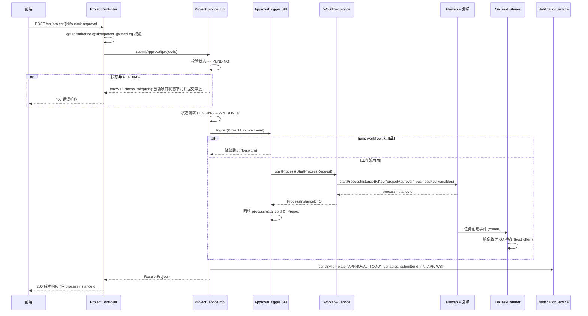
```mermaid
sequenceDiagram
    participant FE as 前端
    participant PC as ProjectController
    participant PS as ProjectServiceImpl
    participant AT as ApprovalTrigger SPI
    participant WS as WorkflowService
    participant FL as Flowable 引擎
    participant OA as OaTaskListener
    participant NS as NotificationService

    FE->>PC: POST /api/project/{id}/submit-approval
    PC->>PC: @PreAuthorize @Idempotent @OperLog 校验
    PC->>PS: submitApproval(projectId)
    PS->>PS: 校验状态 == PENDING
    alt 状态非 PENDING
        PS-->>PC: throw BusinessException("当前项目状态不允许提交审批")
        PC-->>FE: 400 错误响应
    end
    PS->>PS: 状态流转 PENDING → APPROVED
    PS->>AT: trigger(ProjectApprovalEvent)
    alt pms-workflow 未加载
        AT-->>PS: 降级跳过 (log.warn)
    else 工作流可用
        AT->>WS: startProcess(StartProcessRequest)
        WS->>FL: startProcessInstanceByKey("projectApproval", businessKey, variables)
        FL-->>WS: processInstanceId
        WS-->>AT: ProcessInstanceDTO
        AT->>AT: 回填 processInstanceId 到 Project
        FL->>OA: 任务创建事件 (create)
        OA->>OA: 镜像致远 OA 待办 (best-effort)
    end
    PS->>NS: sendByTemplate("APPROVAL_TODO", variables, submitterId, {IN_APP, WS})
    PS-->>PC: Result<Project>
    PC-->>FE: 200 成功响应 (含 processInstanceId)
```

**关键校验点**：
1. 项目状态必须为 `PENDING`，否则抛 `BusinessException`
2. `ApprovalTrigger` SPI 通过 `@Autowired(required=false)` 注入，未加载时降级
3. Flowable 启动失败 `try-catch` 包裹，`log.error` 但事务不回滚（best-effort）
4. `OaTaskListener` 镜像 OA 失败仅记日志，不阻断流程主事务
5. 通知发送通过 `sendByTemplate` 模板化，失败仅记日志

**补偿与降级**：
- Flowable 不可用：审批记录仍创建（自建表主路径），仅不启动 BPMN 实例
- OA 镜像失败：不影响审批流转，OA 待办可后续手动补推
- 通知发送失败：不影响审批主流程

### 2.2 流程 F-02：项目模板深拷贝流程

**场景**：用户从项目模板创建新项目，触发模板深拷贝 12 步流程，复制模板的 12 类关联数据到新项目。

**参与方**：
- 前端
- `ProjectController`
- `IProjectService` / `ProjectServiceImpl`
- `ProjectTemplateService`
- 12 个子 Service（阶段、里程碑、任务、交付件、资产、成员、配置等）

**时序图**：

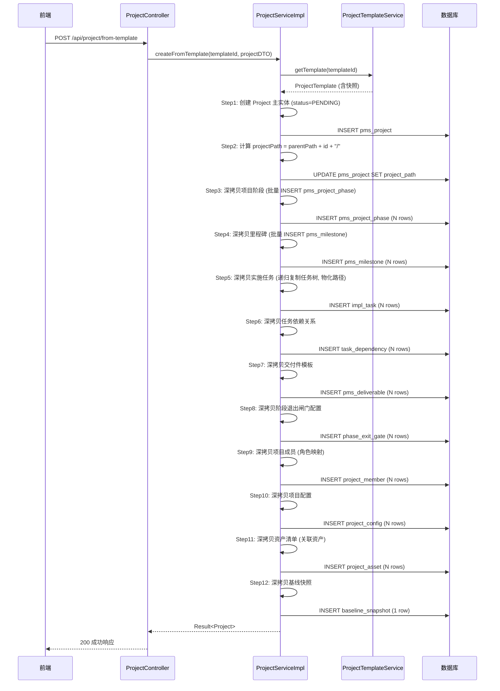
```mermaid
sequenceDiagram
    participant FE as 前端
    participant PC as ProjectController
    participant PS as ProjectServiceImpl
    participant TS as ProjectTemplateService
    participant DB as 数据库

    FE->>PC: POST /api/project/from-template
    PC->>PS: createFromTemplate(templateId, projectDTO)
    PS->>TS: getTemplate(templateId)
    TS-->>PS: ProjectTemplate (含快照)
    PS->>PS: Step1: 创建 Project 主实体 (status=PENDING)
    PS->>DB: INSERT pms_project
    PS->>PS: Step2: 计算 projectPath = parentPath + id + "/"
    PS->>DB: UPDATE pms_project SET project_path
    PS->>PS: Step3: 深拷贝项目阶段 (批量 INSERT pms_project_phase)
    PS->>DB: INSERT pms_project_phase (N rows)
    PS->>PS: Step4: 深拷贝里程碑 (批量 INSERT pms_milestone)
    PS->>DB: INSERT pms_milestone (N rows)
    PS->>PS: Step5: 深拷贝实施任务 (递归复制任务树, 物化路径)
    PS->>DB: INSERT impl_task (N rows)
    PS->>PS: Step6: 深拷贝任务依赖关系
    PS->>DB: INSERT task_dependency (N rows)
    PS->>PS: Step7: 深拷贝交付件模板
    PS->>DB: INSERT pms_deliverable (N rows)
    PS->>PS: Step8: 深拷贝阶段退出闸门配置
    PS->>DB: INSERT phase_exit_gate (N rows)
    PS->>PS: Step9: 深拷贝项目成员 (角色映射)
    PS->>DB: INSERT project_member (N rows)
    PS->>PS: Step10: 深拷贝项目配置
    PS->>DB: INSERT project_config (N rows)
    PS->>PS: Step11: 深拷贝资产清单 (关联资产)
    PS->>DB: INSERT project_asset (N rows)
    PS->>PS: Step12: 深拷贝基线快照
    PS->>DB: INSERT baseline_snapshot (1 row)
    PS-->>PC: Result<Project>
    PC-->>FE: 200 成功响应
```

**关键设计点**：
1. 12 步深拷贝在一个 `@Transactional` 事务中执行，保证原子性
2. 任务树深拷贝递归处理，物化路径 `taskPath` 重新计算
3. 模板快照为不可变 JSON，避免模板后续修改影响已创建项目
4. 成员角色映射支持按模板配置自动分派（如"项目经理"角色映射到创建人）

### 2.3 流程 F-03：任务双轨进度汇总流程

**场景**：项目工作区概览 Tab 查询项目进度，触发双轨进度汇总（任务完成率 + 工时完成率），同步递归 + 异步持久化两套机制。

**参与方**：
- 前端
- `ReportController`（pms-admin）
- `ReportService` / `ReportServiceImpl`
- `IImplTaskService`（pms-implementation）
- `TaskProgressProvider` SPI
- Redis 缓存

**时序图**：

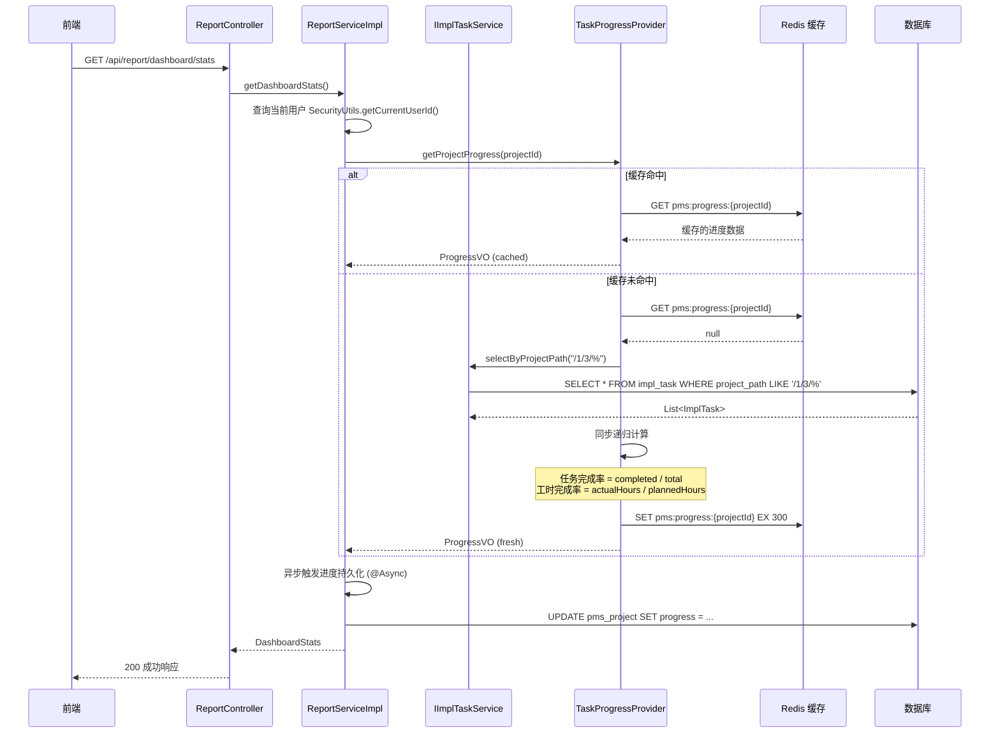
```mermaid
sequenceDiagram
    participant FE as 前端
    participant RC as ReportController
    participant RS as ReportServiceImpl
    participant TS as IImplTaskService
    participant TP as TaskProgressProvider
    participant Redis as Redis 缓存
    participant DB as 数据库

    FE->>RC: GET /api/report/dashboard/stats
    RC->>RS: getDashboardStats()
    RS->>RS: 查询当前用户 SecurityUtils.getCurrentUserId()
    RS->>TP: getProjectProgress(projectId)
    alt 缓存命中
        TP->>Redis: GET pms:progress:{projectId}
        Redis-->>TP: 缓存的进度数据
        TP-->>RS: ProgressVO (cached)
    else 缓存未命中
        TP->>Redis: GET pms:progress:{projectId}
        Redis-->>TP: null
        TP->>TS: selectByProjectPath("/1/3/%")
        TS->>DB: SELECT * FROM impl_task WHERE project_path LIKE '/1/3/%'
        DB-->>TS: List<ImplTask>
        TP->>TP: 同步递归计算
        Note over TP: 任务完成率 = completed / total<br/>工时完成率 = actualHours / plannedHours
        TP->>Redis: SET pms:progress:{projectId} EX 300
        TP-->>RS: ProgressVO (fresh)
    end
    RS->>RS: 异步触发进度持久化 (@Async)
    RS->>DB: UPDATE pms_project SET progress = ...
    RS-->>RC: DashboardStats
    RC-->>FE: 200 成功响应
```

**关键设计点**：
1. 双轨进度同步计算（任务完成率 + 工时完成率）
2. Redis 缓存 5 分钟 TTL，减少数据库查询
3. 异步持久化进度到 `pms_project` 表，避免阻塞主请求
4. 物化路径 `LIKE` 查询一次性获取整棵子树任务

### 2.4 流程 F-04：结算 Saga 6 步编排流程

**场景**：项目结算触发跨服务事务，6 步编排确保最终一致性，每步定义补偿动作。

**参与方**：
- 前端
- `SettlementController`（pms-implementation）
- `SettlementService` / `SettlementServiceImpl`
- `IImplTaskService`
- `IAssetService`
- `D365IntegrationService`（pms-integration）
- `FpIntegrationService`
- `ApprovalTrigger` SPI

**时序图**：

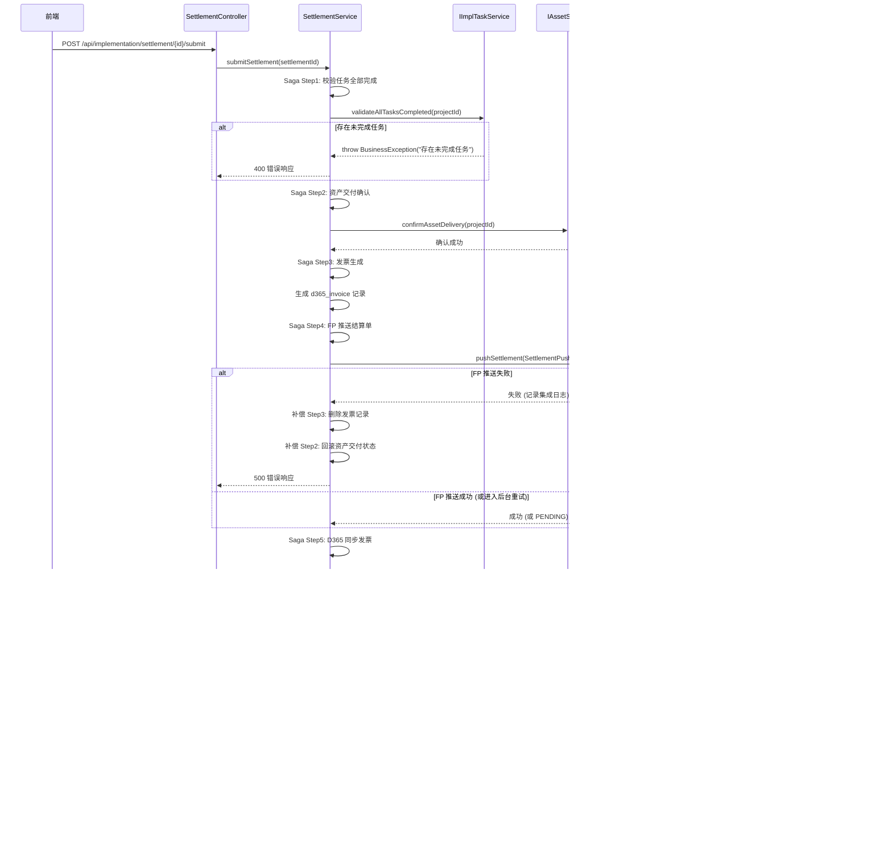
```mermaid
sequenceDiagram
    participant FE as 前端
    participant SC as SettlementController
    participant SS as SettlementService
    participant TS as IImplTaskService
    participant AS as IAssetService
    participant D365 as D365IntegrationService
    participant FP as FpIntegrationService
    participant AT as ApprovalTrigger

    FE->>SC: POST /api/implementation/settlement/{id}/submit
    SC->>SS: submitSettlement(settlementId)
    SS->>SS: Saga Step1: 校验任务全部完成
    SS->>TS: validateAllTasksCompleted(projectId)
    alt 存在未完成任务
        TS-->>SS: throw BusinessException("存在未完成任务")
        SS-->>SC: 400 错误响应
    end
    SS->>SS: Saga Step2: 资产交付确认
    SS->>AS: confirmAssetDelivery(projectId)
    AS-->>SS: 确认成功
    SS->>SS: Saga Step3: 发票生成
    SS->>SS: 生成 d365_invoice 记录
    SS->>SS: Saga Step4: FP 推送结算单
    SS->>FP: pushSettlement(SettlementPushRequest)
    alt FP 推送失败
        FP-->>SS: 失败 (记录集成日志)
        SS->>SS: 补偿 Step3: 删除发票记录
        SS->>SS: 补偿 Step2: 回滚资产交付状态
        SS-->>SC: 500 错误响应
    else FP 推送成功 (或进入后台重试)
        FP-->>SS: 成功 (或 PENDING)
    end
    SS->>SS: Saga Step5: D365 同步发票
    SS->>D365: syncInvoices()
    alt D365 同步失败
        D365-->>SS: 失败 (记录集成日志, 进入重试队列)
        Note over SS: D365 同步失败不阻断结算<br/>后台重试 + 集成日志驱动
    else D365 同步成功
        D365-->>SS: 成功
    end
    SS->>SS: Saga Step6: 结算状态置完成
    SS->>SS: 状态流转 SUBMITTED → APPROVED
    SS->>AT: trigger(SettlementApprovalEvent)
    SS-->>SC: Result<Settlement>
    SC-->>FE: 200 成功响应
```

**Saga 补偿策略**：

| 步骤 | 失败时补偿动作 |
|------|---------------|
| Step1: 任务完成校验 | 无（前置校验，无副作用） |
| Step2: 资产交付确认 | 回滚资产状态为 `INSTALLED` |
| Step3: 发票生成 | 删除 `d365_invoice` 记录 |
| Step4: FP 推送 | 进入后台重试队列（指数退避 1/2/4/8/16 分钟，最多 5 次） |
| Step5: D365 同步 | 不阻断，进入集成日志重试队列 |
| Step6: 结算状态置完成 | 无（终态） |

**关键设计点**：
1. D365/FP 外部集成失败不阻断结算主流程，进入后台重试队列
2. 集成日志（`pms_integration_log`）持久化失败原因与重试次数
3. Resilience4j 熔断器 OPEN 时 fallback 抛 `IntegrationException`
4. FP 推送支持后台指数退避重试（1/2/4/8/16 分钟，最多 5 次）

### 2.5 流程 F-05：CCB 变更请求审批流程

**场景**：变更请求提交后触发 CCB（变更控制委员会）审批工作流，审批通过时记录三维度基线变更审计。

**参与方**：
- 前端
- `ChangeRequestController`（pms-governance）
- `IChangeRequestService` / `ChangeRequestServiceImpl`
- `WorkflowService`（ObjectProvider 注入）
- `IBaselineHistoryService`
- `NotificationService`

**时序图**：

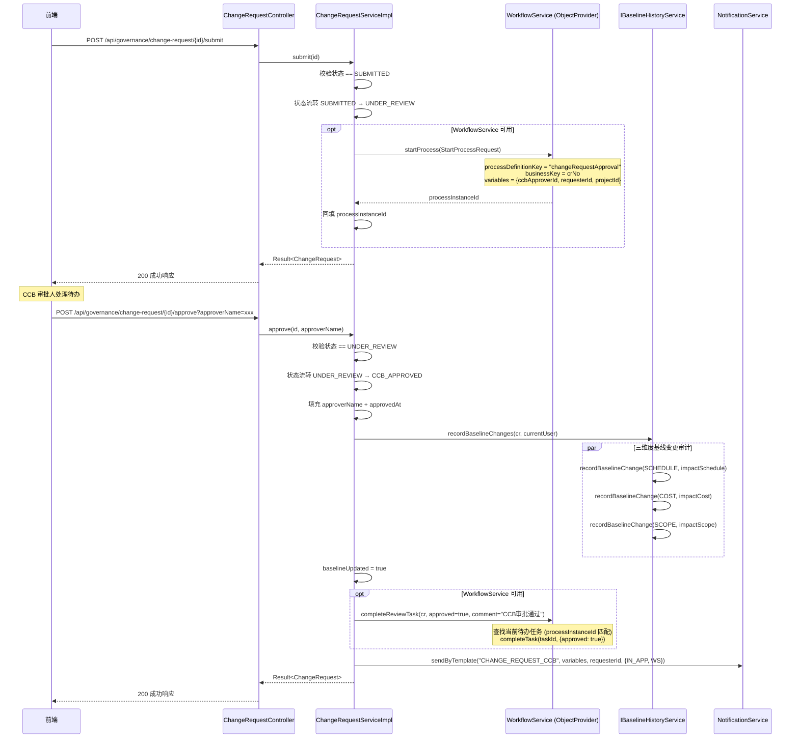
```mermaid
sequenceDiagram
    participant FE as 前端
    participant CRC as ChangeRequestController
    participant CRS as ChangeRequestServiceImpl
    participant WS as WorkflowService (ObjectProvider)
    participant BHS as IBaselineHistoryService
    participant NS as NotificationService

    FE->>CRC: POST /api/governance/change-request/{id}/submit
    CRC->>CRS: submit(id)
    CRS->>CRS: 校验状态 == SUBMITTED
    CRS->>CRS: 状态流转 SUBMITTED → UNDER_REVIEW
    opt WorkflowService 可用
        CRS->>WS: startProcess(StartProcessRequest)
        Note over WS: processDefinitionKey = "changeRequestApproval"<br/>businessKey = crNo<br/>variables = {ccbApproverId, requesterId, projectId}
        WS-->>CRS: processInstanceId
        CRS->>CRS: 回填 processInstanceId
    end
    CRS-->>CRC: Result<ChangeRequest>
    CRC-->>FE: 200 成功响应

    Note over FE: CCB 审批人处理待办
    FE->>CRC: POST /api/governance/change-request/{id}/approve?approverName=xxx
    CRC->>CRS: approve(id, approverName)
    CRS->>CRS: 校验状态 == UNDER_REVIEW
    CRS->>CRS: 状态流转 UNDER_REVIEW → CCB_APPROVED
    CRS->>CRS: 填充 approverName + approvedAt
    CRS->>BHS: recordBaselineChanges(cr, currentUser)
    par 三维度基线变更审计
        BHS->>BHS: recordBaselineChange(SCHEDULE, impactSchedule)
        BHS->>BHS: recordBaselineChange(COST, impactCost)
        BHS->>BHS: recordBaselineChange(SCOPE, impactScope)
    end
    CRS->>CRS: baselineUpdated = true
    opt WorkflowService 可用
        CRS->>WS: completeReviewTask(cr, approved=true, comment="CCB审批通过")
        Note over WS: 查找当前待办任务 (processInstanceId 匹配)<br/>completeTask(taskId, {approved: true})
    end
    CRS->>NS: sendByTemplate("CHANGE_REQUEST_CCB", variables, requesterId, {IN_APP, WS})
    CRS-->>CRC: Result<ChangeRequest>
    CRC-->>FE: 200 成功响应
```

**三维度基线变更审计**：
- `impactSchedule` → `BaselineHistory(changeType=SCHEDULE, fieldName=impactSchedule, oldValue="原进度基线", newValue=impactSchedule)`
- `impactCost` → `BaselineHistory(changeType=COST, fieldName=impactCost, ...)`
- `impactScope` → `BaselineHistory(changeType=SCOPE, fieldName=impactScope, ...)`
- 字段为空时跳过该维度（不记录审计）

**关键设计点**：
1. `WorkflowService` 通过 `ObjectProvider` 注入，未加载时降级（仅 `log.warn`）
2. 工作流 API 调用异常 `try-catch` 包裹，事务不回滚
3. `completeReviewTask` 在 `processInstanceId` 为空时直接 return
4. BPMN 流程使用 `flowable:skipExpression="${assignee == initiator}"` 跳过自审
5. 驳回路径使用 `terminateEventDefinition` 终止结束事件

### 2.6 流程 F-06：交付件全生命周期流转流程

**场景**：交付件从草稿到归档的 7 态状态机流转，含版本管理、签核管理、引用关系、终验校验。

**参与方**：
- 前端
- `DeliverableController`（pms-deliverable）
- `DeliverableService` / `DeliverableServiceImpl`
- `DeliverableVersionService`
- `DeliverableSignatureService`
- `DeliverableFinalCheckSpi`（终验校验 SPI）
- `NotificationService`

**时序图**：

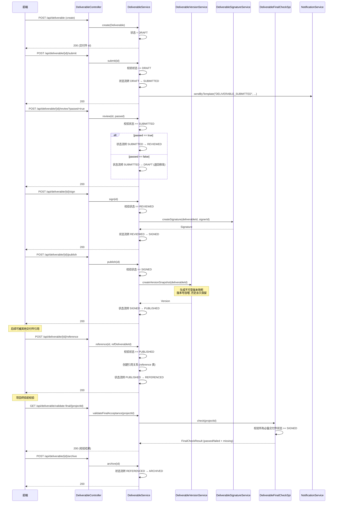
```mermaid
sequenceDiagram
    participant FE as 前端
    participant DC as DeliverableController
    participant DS as DeliverableService
    participant VS as DeliverableVersionService
    participant SS as DeliverableSignatureService
    participant FS as DeliverableFinalCheckSpi
    participant NS as NotificationService

    FE->>DC: POST /api/deliverable (create)
    DC->>DS: create(Deliverable)
    DS->>DS: 状态 = DRAFT
    DS-->>FE: 200 (交付件 id)

    FE->>DC: POST /api/deliverable/{id}/submit
    DC->>DS: submit(id)
    DS->>DS: 校验状态 == DRAFT
    DS->>DS: 状态流转 DRAFT → SUBMITTED
    DS->>NS: sendByTemplate("DELIVERABLE_SUBMITTED", ...)
    DS-->>FE: 200

    FE->>DC: POST /api/deliverable/{id}/review?passed=true
    DC->>DS: review(id, passed)
    DS->>DS: 校验状态 == SUBMITTED
    alt passed == true
        DS->>DS: 状态流转 SUBMITTED → REVIEWED
    else passed == false
        DS->>DS: 状态流转 SUBMITTED → DRAFT (退回修改)
    end
    DS-->>FE: 200

    FE->>DC: POST /api/deliverable/{id}/sign
    DC->>DS: sign(id)
    DS->>DS: 校验状态 == REVIEWED
    DS->>SS: createSignature(deliverableId, signerId)
    SS-->>DS: Signature
    DS->>DS: 状态流转 REVIEWED → SIGNED
    DS-->>FE: 200

    FE->>DC: POST /api/deliverable/{id}/publish
    DC->>DS: publish(id)
    DS->>DS: 校验状态 == SIGNED
    DS->>VS: createVersionSnapshot(deliverableId)
    Note over VS: 生成不可变版本快照<br/>版本号自增, 历史永久保留
    VS-->>DS: Version
    DS->>DS: 状态流转 SIGNED → PUBLISHED
    DS-->>FE: 200

    Note over FE: 后续可被其他交付件引用
    FE->>DC: POST /api/deliverable/{id}/reference
    DC->>DS: reference(id, refDeliverableId)
    DS->>DS: 校验状态 == PUBLISHED
    DS->>DS: 创建引用关系 (reference 表)
    DS->>DS: 状态流转 PUBLISHED → REFERENCED
    DS-->>FE: 200

    Note over FE: 项目终验前校验
    FE->>DC: GET /api/deliverable/validate-final/{projectId}
    DC->>DS: validateFinalAcceptance(projectId)
    DS->>FS: check(projectId)
    FS->>FS: 校验所有必备交付件状态 >= SIGNED
    FS-->>DS: FinalCheckResult (passed/failed + missing)
    DS-->>FE: 200 (校验结果)

    FE->>DC: POST /api/deliverable/{id}/archive
    DC->>DS: archive(id)
    DS->>DS: 状态流转 REFERENCED → ARCHIVED
    DS-->>FE: 200
```

**7 态状态机流转规则**：
- `DRAFT → SUBMITTED`：提交审核
- `SUBMITTED → REVIEWED`：审核通过
- `SUBMITTED → DRAFT`：审核退回（重新修改）
- `REVIEWED → SIGNED`：签核完成
- `SIGNED → PUBLISHED`：发布（生成不可变版本快照）
- `PUBLISHED → REFERENCED`：被其他交付件引用
- `REFERENCED → ARCHIVED`：归档

**关键设计点**：
1. 版本快照不可变，发布时生成永久历史记录
2. 签核管理记录签核人、签核时间、签核意见
3. `templateInherited` 标记标识从模板继承的交付件
4. 终验校验 SPI 由 `pms-project` 调用，校验所有必备交付件状态 ≥ `SIGNED`
5. 引用关系独立存储，支持交付件互相引用

### 2.7 流程 F-07：资产 RMA 6 步闭环流程

**场景**：资产出现故障后发起 RMA（退换货授权），经过 6 步闭环：申请 → 审批 → 发运 → 收货 → 关闭。

**参与方**：
- 前端
- `RmaController`（pms-asset）
- `IRmaService` / `RmaServiceImpl`
- `IAssetService`
- `WorkflowService`（Flowable 调拨审批）
- `NotificationService`

**时序图**：

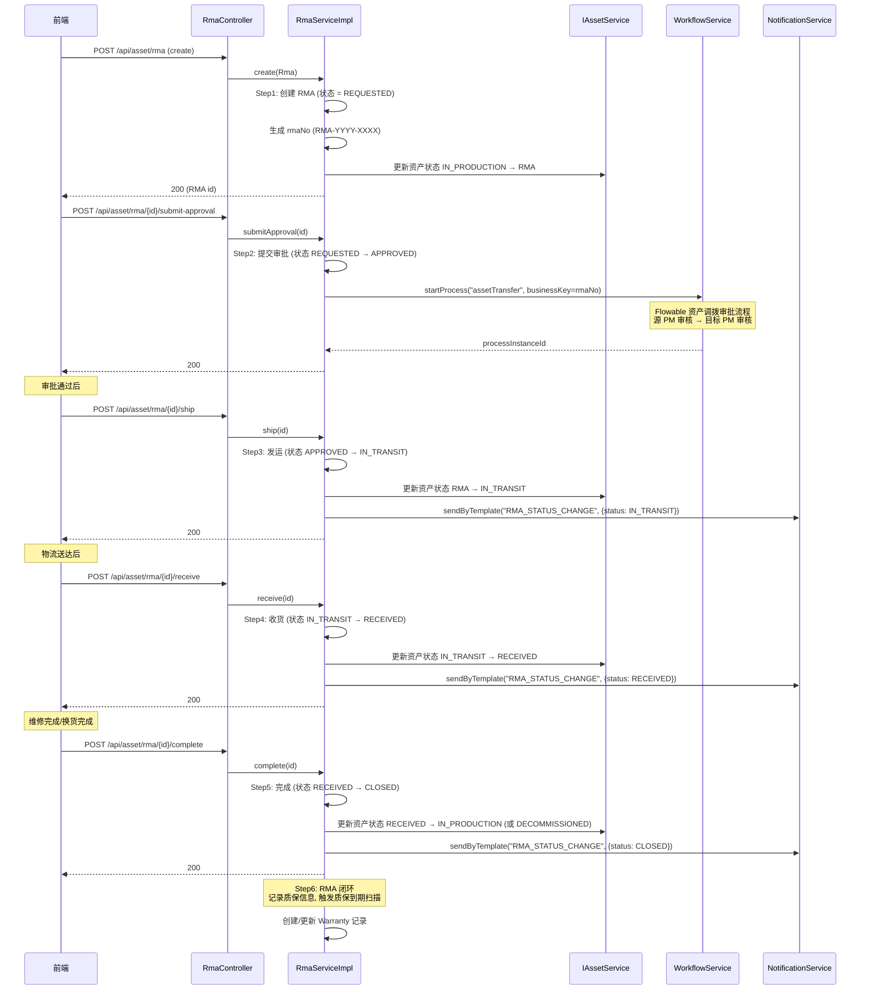
```mermaid
sequenceDiagram
    participant FE as 前端
    participant RC as RmaController
    participant RS as RmaServiceImpl
    participant AS as IAssetService
    participant WS as WorkflowService
    participant NS as NotificationService

    FE->>RC: POST /api/asset/rma (create)
    RC->>RS: create(Rma)
    RS->>RS: Step1: 创建 RMA (状态 = REQUESTED)
    RS->>RS: 生成 rmaNo (RMA-YYYY-XXXX)
    RS->>AS: 更新资产状态 IN_PRODUCTION → RMA
    RS-->>FE: 200 (RMA id)

    FE->>RC: POST /api/asset/rma/{id}/submit-approval
    RC->>RS: submitApproval(id)
    RS->>RS: Step2: 提交审批 (状态 REQUESTED → APPROVED)
    RS->>WS: startProcess("assetTransfer", businessKey=rmaNo)
    Note over WS: Flowable 资产调拨审批流程<br/>源 PM 审核 → 目标 PM 审核
    WS-->>RS: processInstanceId
    RS-->>FE: 200

    Note over FE: 审批通过后
    FE->>RC: POST /api/asset/rma/{id}/ship
    RC->>RS: ship(id)
    RS->>RS: Step3: 发运 (状态 APPROVED → IN_TRANSIT)
    RS->>AS: 更新资产状态 RMA → IN_TRANSIT
    RS->>NS: sendByTemplate("RMA_STATUS_CHANGE", {status: IN_TRANSIT})
    RS-->>FE: 200

    Note over FE: 物流送达后
    FE->>RC: POST /api/asset/rma/{id}/receive
    RC->>RS: receive(id)
    RS->>RS: Step4: 收货 (状态 IN_TRANSIT → RECEIVED)
    RS->>AS: 更新资产状态 IN_TRANSIT → RECEIVED
    RS->>NS: sendByTemplate("RMA_STATUS_CHANGE", {status: RECEIVED})
    RS-->>FE: 200

    Note over FE: 维修完成/换货完成
    FE->>RC: POST /api/asset/rma/{id}/complete
    RC->>RS: complete(id)
    RS->>RS: Step5: 完成 (状态 RECEIVED → CLOSED)
    RS->>AS: 更新资产状态 RECEIVED → IN_PRODUCTION (或 DECOMMISSIONED)
    RS->>NS: sendByTemplate("RMA_STATUS_CHANGE", {status: CLOSED})
    RS-->>FE: 200

    Note over RS: Step6: RMA 闭环<br/>记录质保信息, 触发质保到期扫描
    RS->>RS: 创建/更新 Warranty 记录
```

**6 态状态机**：`REQUESTED → APPROVED → IN_TRANSIT → RECEIVED → CLOSED`（+ `REJECTED` 驳回分支）

**关键设计点**：
1. RMA 与资产状态联动，每步流转同步更新资产状态
2. 调拨审批通过 Flowable BPMN 流程（`assetTransfer`）
3. 状态变更触发通知，使用 `RMA_STATUS_CHANGE` 模板
4. RMA 关闭后创建/更新质保记录，触发质保到期定时扫描

### 2.8 流程 F-08：通知多通道并发投递流程

**场景**：业务事件触发通知，通过 4 通道（IN_APP / WS / EMAIL / OA）并发投递，任一通道失败仅记日志不阻塞其他通道。

**参与方**：
- 业务模块（pms-project / pms-implementation / pms-asset 等）
- `INotificationService`（pms-notification）
- `NotificationServiceImpl`
- `NotificationTemplateEngine`
- `NotificationPublisher`（Redis Pub/Sub 发布）
- `NotificationSubscriber`（Redis 订阅 + STOMP 推送）
- Redis
- WebSocket / STOMP

**时序图**：

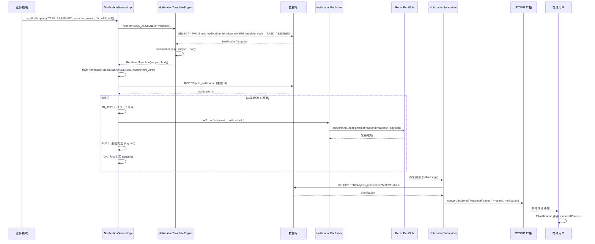
```mermaid
sequenceDiagram
    participant BIZ as 业务模块
    participant NS as NotificationServiceImpl
    participant TE as NotificationTemplateEngine
    participant DB as 数据库
    participant NP as NotificationPublisher
    participant Redis as Redis Pub/Sub
    participant NSub as NotificationSubscriber
    participant STOMP as STOMP 广播
    participant USER as 在线用户

    BIZ->>NS: sendByTemplate("TASK_ASSIGNED", variables, userId, {IN_APP, WS})
    NS->>TE: render("TASK_ASSIGNED", variables)
    TE->>DB: SELECT * FROM pms_notification_template WHERE template_code = 'TASK_ASSIGNED'
    DB-->>TE: NotificationTemplate
    TE->>TE: Freemarker 渲染 subject + body
    TE-->>NS: RenderedTemplate(subject, body)
    NS->>NS: 构造 Notification (readStatus=UNREAD, channel=IN_APP)
    NS->>DB: INSERT pms_notification (生成 id)
    DB-->>NS: notification.id

    par 并发投递 4 通道
        NS->>NS: IN_APP: 无操作 (已落库)
        NS->>NP: WS: publish(userId, notificationId)
        NP->>Redis: convertAndSend("pms:notification:broadcast", payload)
        Redis-->>NP: 发布成功
        NS->>NS: EMAIL: 占位实现 (log.info)
        NS->>NS: OA: 占位实现 (log.info)
    end

    Redis-->>NSub: 消息到达 (onMessage)
    NSub->>DB: SELECT * FROM pms_notification WHERE id = ?
    DB-->>NSub: Notification
    NSub->>STOMP: convertAndSend("/topic/notification/" + userId, notification)
    STOMP-->>USER: 实时推送通知
    USER->>USER: ElNotification 弹窗 + unreadCount++
```

**关键设计点**：
1. 4 通道并发投递（`CompletableFuture.runAsync`），任一通道失败仅记日志不阻塞
2. IN_APP / WS 通道先落库生成 `id`，供 WS 通道引用
3. EMAIL / OA 通道为占位实现，生产环境可接入 `EmailService` / `OaIntegrationService`
4. Redis Pub/Sub 跨实例广播，解决多实例部署推送一致性
5. STOMP 广播频道 `/topic/notification/{userId}`，JWT 握手鉴权
6. 模板引擎基于 Freemarker，每次渲染新建 `Configuration` 避免线程安全问题

---

## 3. 关键类设计

本章详细描述平台 8 个关键类的设计，包括类图、方法签名、关键字段与设计模式。

### 3.1 类 C-01：ProjectServiceImpl（项目服务实现）

**所在模块**：pms-project（`com.dp.plat.project.service.impl`）

**职责**：项目全生命周期管理，包括项目 CRUD、状态机推进、模板深拷贝、阶段退出闸门、终验流程。

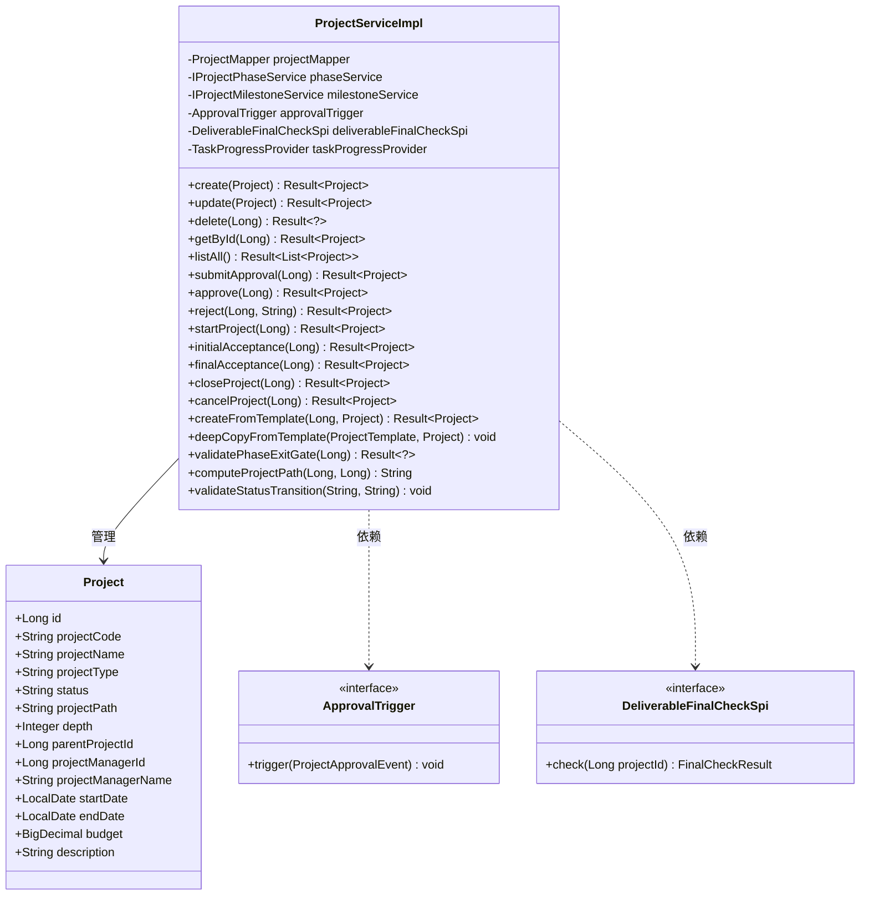
```mermaid
classDiagram
    class ProjectServiceImpl {
        -ProjectMapper projectMapper
        -IProjectPhaseService phaseService
        -IProjectMilestoneService milestoneService
        -ApprovalTrigger approvalTrigger
        -DeliverableFinalCheckSpi deliverableFinalCheckSpi
        -TaskProgressProvider taskProgressProvider
        +create(Project) Result~Project~
        +update(Project) Result~Project~
        +delete(Long) Result~?~
        +getById(Long) Result~Project~
        +listAll() Result~List~Project~~
        +submitApproval(Long) Result~Project~
        +approve(Long) Result~Project~
        +reject(Long, String) Result~Project~
        +startProject(Long) Result~Project~
        +initialAcceptance(Long) Result~Project~
        +finalAcceptance(Long) Result~Project~
        +closeProject(Long) Result~Project~
        +cancelProject(Long) Result~Project~
        +createFromTemplate(Long, Project) Result~Project~
        +deepCopyFromTemplate(ProjectTemplate, Project) void
        +validatePhaseExitGate(Long) Result~?~
        +computeProjectPath(Long, Long) String
        +validateStatusTransition(String, String) void
    }
    class Project {
        +Long id
        +String projectCode
        +String projectName
        +String projectType
        +String status
        +String projectPath
        +Integer depth
        +Long parentProjectId
        +Long projectManagerId
        +String projectManagerName
        +LocalDate startDate
        +LocalDate endDate
        +BigDecimal budget
        +String description
    }
    class ApprovalTrigger {
        <<interface>>
        +trigger(ProjectApprovalEvent) void
    }
    class DeliverableFinalCheckSpi {
        <<interface>>
        +check(Long projectId) FinalCheckResult
    }
    ProjectServiceImpl --> Project : 管理
    ProjectServiceImpl ..> ApprovalTrigger : 依赖
    ProjectServiceImpl ..> DeliverableFinalCheckSpi : 依赖
```

**关键方法设计**：

| 方法 | 行为 | 关键逻辑 |
|------|------|----------|
| `submitApproval(Long)` | 项目立项审批 | 状态校验 `PENDING`；流转到 `APPROVED`；触发 `ApprovalTrigger` SPI |
| `createFromTemplate(Long, Project)` | 从模板创建项目 | 12 步深拷贝（事务内）；计算 `projectPath`；递归复制任务树 |
| `validateStatusTransition(String, String)` | 状态转换校验 | 11 态状态机校验，非法转换抛 `BusinessException` |
| `computeProjectPath(Long, Long)` | 计算物化路径 | `parentPath + id + "/"` |
| `validatePhaseExitGate(Long)` | 阶段退出闸门 | 4 类关卡校验（DELIVERABLE/TASK/MILESTONE/APPROVAL） |
| `finalAcceptance(Long)` | 终验流程 | 调用 `DeliverableFinalCheckSpi` 校验必备交付件 |

**设计模式**：
- **状态机模式**：`validateStatusTransition` 封装状态转换规则
- **模板方法**：`deepCopyFromTemplate` 定义 12 步深拷贝骨架
- **SPI 解耦**：`ApprovalTrigger` / `DeliverableFinalCheckSpi` 接口隔离工作流与交付件模块

### 3.2 类 C-02：ApprovalCenterServiceImpl（统一审批中心实现）

**所在模块**：pms-workflow（`com.dp.plat.workflow.service.impl`）

**职责**：为 10 类业务对象（PROJECT/TASK/DELIVERABLE/RISK/ISSUE/CHANGE/RESOURCE/COST/PHASE_EXIT/BASELINE_CHANGE）提供统一审批流转。

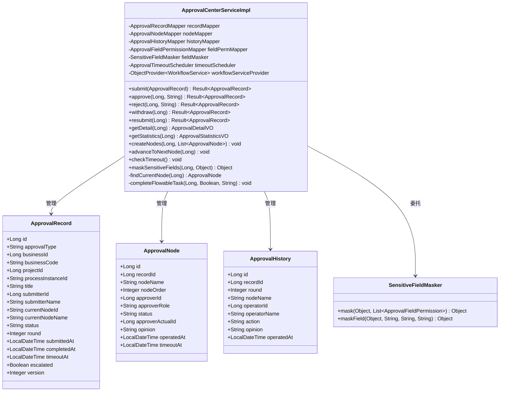
```mermaid
classDiagram
    class ApprovalCenterServiceImpl {
        -ApprovalRecordMapper recordMapper
        -ApprovalNodeMapper nodeMapper
        -ApprovalHistoryMapper historyMapper
        -ApprovalFieldPermissionMapper fieldPermMapper
        -SensitiveFieldMasker fieldMasker
        -ApprovalTimeoutScheduler timeoutScheduler
        -ObjectProvider~WorkflowService~ workflowServiceProvider
        +submit(ApprovalRecord) Result~ApprovalRecord~
        +approve(Long, String) Result~ApprovalRecord~
        +reject(Long, String) Result~ApprovalRecord~
        +withdraw(Long) Result~ApprovalRecord~
        +resubmit(Long) Result~ApprovalRecord~
        +getDetail(Long) ApprovalDetailVO
        +getStatistics(Long) ApprovalStatisticsVO
        +createNodes(Long, List~ApprovalNode~) void
        +advanceToNextNode(Long) void
        +checkTimeout() void
        +maskSensitiveFields(Long, Object) Object
        -findCurrentNode(Long) ApprovalNode
        -completeFlowableTask(Long, Boolean, String) void
    }
    class ApprovalRecord {
        +Long id
        +String approvalType
        +Long businessId
        +String businessCode
        +Long projectId
        +String processInstanceId
        +String title
        +Long submitterId
        +String submitterName
        +String currentNodeId
        +String currentNodeName
        +String status
        +Integer round
        +LocalDateTime submittedAt
        +LocalDateTime completedAt
        +LocalDateTime timeoutAt
        +Boolean escalated
        +Integer version
    }
    class ApprovalNode {
        +Long id
        +Long recordId
        +String nodeName
        +Integer nodeOrder
        +Long approverId
        +String approverRole
        +String status
        +Long approverActualId
        +String opinion
        +LocalDateTime operatedAt
        +LocalDateTime timeoutAt
    }
    class ApprovalHistory {
        +Long id
        +Long recordId
        +Integer round
        +String nodeName
        +Long operatorId
        +String operatorName
        +String action
        +String opinion
        +LocalDateTime operatedAt
    }
    class SensitiveFieldMasker {
        +mask(Object, List~ApprovalFieldPermission~) Object
        +maskField(Object, String, String, String) Object
    }
    ApprovalCenterServiceImpl --> ApprovalRecord : 管理
    ApprovalCenterServiceImpl --> ApprovalNode : 管理
    ApprovalCenterServiceImpl --> ApprovalHistory : 管理
    ApprovalCenterServiceImpl --> SensitiveFieldMasker : 委托
```

**关键方法设计**：

| 方法 | 行为 | 关键逻辑 |
|------|------|----------|
| `submit(ApprovalRecord)` | 提交审批 | 创建记录 + 节点；状态置 `PENDING`；best-effort 启动 Flowable |
| `approve(Long, String)` | 审批通过 | 当前节点 `APPROVED`；推进到下一节点；最后一节点则记录 `APPROVED` |
| `reject(Long, String)` | 审批驳回 | 当前节点 `REJECTED`；记录 `REJECTED`；完成 Flowable 任务（approved=false） |
| `withdraw(Long)` | 撤回审批 | 仅 `PENDING` 状态可撤回；状态置 `WITHDRAWN` |
| `resubmit(Long)` | 重新提交 | 退回后重新提交；`round+1`；复用原记录；状态回到 `PENDING` |
| `checkTimeout()` | 超时扫描 | 定时扫描 `timeout_at`；超时置 `TIMEOUT`；触发升级 |
| `maskSensitiveFields(Long, Object)` | 字段脱敏 | 按 `ApprovalFieldPermission` 配置脱敏（VISIBLE/MASKED/HIDDEN） |

**设计模式**：
- **责任链模式**：多节点审批按 `nodeOrder` 顺序流转
- **策略模式**：`SensitiveFieldMasker` 按 `maskPattern` 选择脱敏策略
- **best-effort 模式**：Flowable 不可用时不阻断审批创建

### 3.3 类 C-03：ChangeRequestServiceImpl（变更请求服务实现）

**所在模块**：pms-governance（`com.dp.plat.governance.change.service.impl`）

**职责**：变更请求全生命周期管理，含 CCB 审批工作流集成、三维度基线变更审计、编号生成。

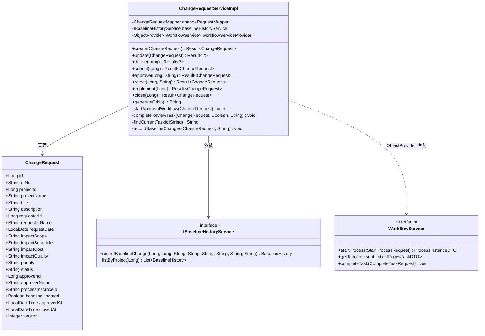
```mermaid
classDiagram
    class ChangeRequestServiceImpl {
        -ChangeRequestMapper changeRequestMapper
        -IBaselineHistoryService baselineHistoryService
        -ObjectProvider~WorkflowService~ workflowServiceProvider
        +create(ChangeRequest) Result~ChangeRequest~
        +update(ChangeRequest) Result~?~
        +delete(Long) Result~?~
        +submit(Long) Result~ChangeRequest~
        +approve(Long, String) Result~ChangeRequest~
        +reject(Long, String) Result~ChangeRequest~
        +implement(Long) Result~ChangeRequest~
        +close(Long) Result~ChangeRequest~
        +generateCrNo() String
        -startApprovalWorkflow(ChangeRequest) void
        -completeReviewTask(ChangeRequest, Boolean, String) void
        -findCurrentTaskId(String) String
        -recordBaselineChanges(ChangeRequest, String) void
    }
    class ChangeRequest {
        +Long id
        +String crNo
        +Long projectId
        +String projectName
        +String title
        +String description
        +Long requesterId
        +String requesterName
        +LocalDate requestDate
        +String impactScope
        +String impactSchedule
        +String impactCost
        +String impactQuality
        +String priority
        +String status
        +Long approverId
        +String approverName
        +String processInstanceId
        +Boolean baselineUpdated
        +LocalDateTime approvedAt
        +LocalDateTime closedAt
        +Integer version
    }
    class IBaselineHistoryService {
        <<interface>>
        +recordBaselineChange(Long, Long, String, String, String, String, String, String) BaselineHistory
        +listByProject(Long) List~BaselineHistory~
    }
    class WorkflowService {
        <<interface>>
        +startProcess(StartProcessRequest) ProcessInstanceDTO
        +getTodoTasks(int, int) IPage~TaskDTO~
        +completeTask(CompleteTaskRequest) void
    }
    ChangeRequestServiceImpl --> ChangeRequest : 管理
    ChangeRequestServiceImpl --> IBaselineHistoryService : 依赖
    ChangeRequestServiceImpl ..> WorkflowService : ObjectProvider 注入
```

**编号生成算法**：
```
prefix = "CR-" + year + "-"
count = this.count(LambdaQueryWrapper.likeRight(crNo, prefix))
sequence = count + 1
return prefix + String.format("%04d", sequence)
```

**已知风险**：编号生成存在并发风险（两个并发请求可能读到同一 `count` 值），建议加分布式锁或数据库唯一索引。

### 3.4 类 C-04：D365IntegrationServiceImpl（D365 集成服务实现）

**所在模块**：pms-integration（`com.dp.plat.integration.service.impl`）

**职责**：与 D365 ERP 系统双向集成，含 OAuth2 Token 管理、采购单/收货/资产序列号/发票同步、Resilience4j 弹性保护。

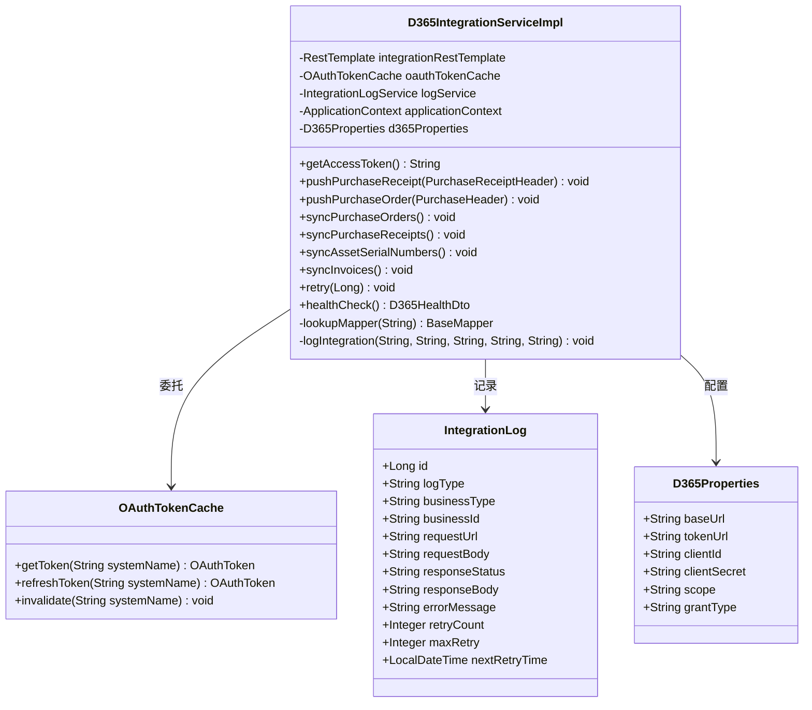
```mermaid
classDiagram
    class D365IntegrationServiceImpl {
        -RestTemplate integrationRestTemplate
        -OAuthTokenCache oauthTokenCache
        -IntegrationLogService logService
        -ApplicationContext applicationContext
        -D365Properties d365Properties
        +getAccessToken() String
        +pushPurchaseReceipt(PurchaseReceiptHeader) void
        +pushPurchaseOrder(PurchaseHeader) void
        +syncPurchaseOrders() void
        +syncPurchaseReceipts() void
        +syncAssetSerialNumbers() void
        +syncInvoices() void
        +retry(Long) void
        +healthCheck() D365HealthDto
        -lookupMapper(String) BaseMapper
        -logIntegration(String, String, String, String, String) void
    }
    class OAuthTokenCache {
        +getToken(String systemName) OAuthToken
        +refreshToken(String systemName) OAuthToken
        +invalidate(String systemName) void
    }
    class IntegrationLog {
        +Long id
        +String logType
        +String businessType
        +String businessId
        +String requestUrl
        +String requestBody
        +String responseStatus
        +String responseBody
        +String errorMessage
        +Integer retryCount
        +Integer maxRetry
        +LocalDateTime nextRetryTime
    }
    class D365Properties {
        +String baseUrl
        +String tokenUrl
        +String clientId
        +String clientSecret
        +String scope
        +String grantType
    }
    D365IntegrationServiceImpl --> OAuthTokenCache : 委托
    D365IntegrationServiceImpl --> IntegrationLog : 记录
    D365IntegrationServiceImpl --> D365Properties : 配置
```

**弹性保护**：
- `@CircuitBreaker(d365CircuitBreaker)` — 熔断器（计数滑动窗口 20，失败率 ≥50% 熔断，30s 后半开）
- `@Bulkhead(d365Bulkhead)` — 隔离舱（信号量隔离，最大并发 10）
- `@Retry(d365Retry)` — 重试（最多 3 次，1s 起步指数退避上限 16s）

**跨模块 Mapper 反射查找**：
```java
private BaseMapper lookupMapper(String mapperName) {
    try {
        return (BaseMapper) applicationContext.getBean(mapperName);
    } catch (BeansException e) {
        log.warn("Mapper not found: {}", mapperName);
        return null;
    }
}
```

用于更新 `pms_asset.serial_no`（`assetMapper`）与 `pms_settlement.invoice_no`（`settlementMapper`），避免 `pms-integration` 直接依赖 `pms-asset` / `pms-implementation`。

### 3.5 类 C-05：MicroflowEngine（微流引擎）

**所在模块**：pms-lowcode（`com.dp.plat.lowcode.engine.microflow`）

**职责**：解析微流定义 JSON，按 DAG 顺序遍历执行节点，支持 11 种节点类型、断点调试、轨迹记录。

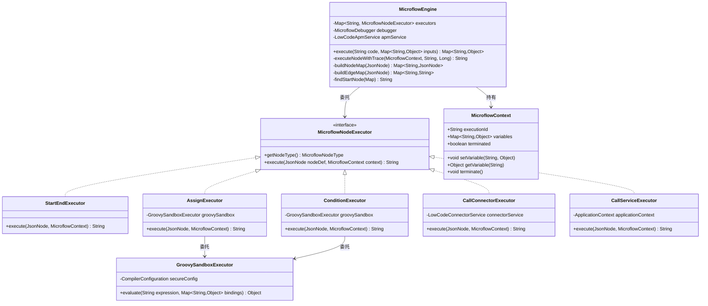
```mermaid
classDiagram
    class MicroflowEngine {
        -Map~String, MicroflowNodeExecutor~ executors
        -MicroflowDebugger debugger
        -LowCodeApmService apmService
        +execute(String code, Map~String,Object~ inputs) Map~String,Object~
        -executeNodeWithTrace(MicroflowContext, String, Long) String
        -buildNodeMap(JsonNode) Map~String,JsonNode~
        -buildEdgeMap(JsonNode) Map~String,String~
        -findStartNode(Map) String
    }
    class MicroflowNodeExecutor {
        <<interface>>
        +getNodeType() MicroflowNodeType
        +execute(JsonNode nodeDef, MicroflowContext context) String
    }
    class StartEndExecutor {
        +execute(JsonNode, MicroflowContext) String
    }
    class AssignExecutor {
        -GroovySandboxExecutor groovySandbox
        +execute(JsonNode, MicroflowContext) String
    }
    class ConditionExecutor {
        -GroovySandboxExecutor groovySandbox
        +execute(JsonNode, MicroflowContext) String
    }
    class CallConnectorExecutor {
        -LowCodeConnectorService connectorService
        +execute(JsonNode, MicroflowContext) String
    }
    class CallServiceExecutor {
        -ApplicationContext applicationContext
        +execute(JsonNode, MicroflowContext) String
    }
    class GroovySandboxExecutor {
        -CompilerConfiguration secureConfig
        +evaluate(String expression, Map~String,Object~ bindings) Object
    }
    class MicroflowContext {
        +String executionId
        +Map~String,Object~ variables
        +boolean terminated
        +void setVariable(String, Object)
        +Object getVariable(String)
        +void terminate()
    }
    MicroflowEngine --> MicroflowNodeExecutor : 委托
    MicroflowNodeExecutor <|.. StartEndExecutor
    MicroflowNodeExecutor <|.. AssignExecutor
    MicroflowNodeExecutor <|.. ConditionExecutor
    MicroflowNodeExecutor <|.. CallConnectorExecutor
    MicroflowNodeExecutor <|.. CallServiceExecutor
    AssignExecutor --> GroovySandboxExecutor : 委托
    ConditionExecutor --> GroovySandboxExecutor : 委托
    MicroflowEngine --> MicroflowContext : 持有
```

**11 种节点类型**：
- `START` / `END` — 开始/结束节点
- `ASSIGN` — Groovy 表达式赋值
- `CONDITION` — Groovy 布尔表达式条件分支
- `LOOP` — Groovy 布尔表达式循环
- `CALL_SERVICE` — 调用 Spring Bean 方法
- `CALL_MICROFLOW` — 调用另一微流
- `CALL_RULE` — 调用规则
- `CALL_CONNECTOR` — 调用连接器
- `THROW_EXCEPTION` — 抛出业务异常
- `RETURN` — 返回结果终止执行

**执行流程**：
1. 解析 `definition` JSON 构建 `nodeMap`（id→node）与 `edgeMap`（source→target）
2. 找 START 节点作为起始 `currentNodeId`
3. 循环执行：找执行器 → `executeNodeWithTrace` → 执行器返回 `nextNodeId` → 更新 `currentNodeId`
4. 终止条件：`currentNodeId` 为 null / `context.isTerminated()` / `safetyCounter` 超 1000

### 3.6 类 C-06：BaselineServiceImpl（基线服务实现）

**所在模块**：pms-baseline（`com.dp.plat.baseline.service.impl`）

**职责**：计划基线快照管理、单一活跃基线规则、任务依赖 DFS 循环检测、三阈值偏差监控。

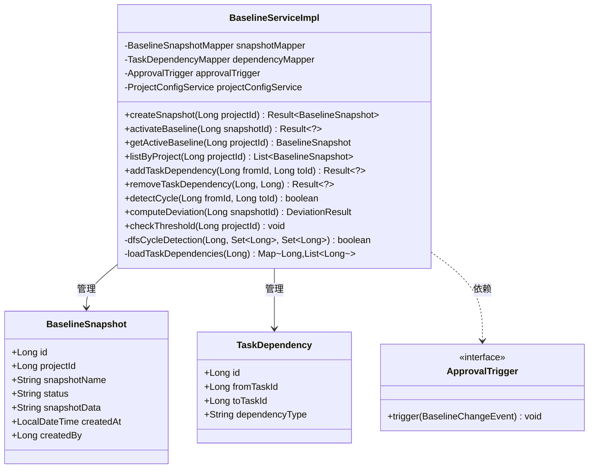
```mermaid
classDiagram
    class BaselineServiceImpl {
        -BaselineSnapshotMapper snapshotMapper
        -TaskDependencyMapper dependencyMapper
        -ApprovalTrigger approvalTrigger
        -ProjectConfigService projectConfigService
        +createSnapshot(Long projectId) Result~BaselineSnapshot~
        +activateBaseline(Long snapshotId) Result~?~
        +getActiveBaseline(Long projectId) BaselineSnapshot
        +listByProject(Long projectId) List~BaselineSnapshot~
        +addTaskDependency(Long fromId, Long toId) Result~?~
        +removeTaskDependency(Long, Long) Result~?~
        +detectCycle(Long fromId, Long toId) boolean
        +computeDeviation(Long snapshotId) DeviationResult
        +checkThreshold(Long projectId) void
        -dfsCycleDetection(Long, Set~Long~, Set~Long~) boolean
        -loadTaskDependencies(Long) Map~Long,List~Long~~
    }
    class BaselineSnapshot {
        +Long id
        +Long projectId
        +String snapshotName
        +String status
        +String snapshotData
        +LocalDateTime createdAt
        +Long createdBy
    }
    class TaskDependency {
        +Long id
        +Long fromTaskId
        +Long toTaskId
        +String dependencyType
    }
    class ApprovalTrigger {
        <<interface>>
        +trigger(BaselineChangeEvent) void
    }
    BaselineServiceImpl --> BaselineSnapshot : 管理
    BaselineServiceImpl --> TaskDependency : 管理
    BaselineServiceImpl ..> ApprovalTrigger : 依赖
```

**关键方法设计**：

| 方法 | 行为 | 关键逻辑 |
|------|------|----------|
| `createSnapshot(Long)` | 创建基线快照 | 全量序列化任务计划为 JSON；不可变 |
| `activateBaseline(Long)` | 激活基线 | 单一活跃基线规则（激活前先停用其他） |
| `addTaskDependency(Long, Long)` | 添加任务依赖 | 添加前调用 `detectCycle` 检测循环 |
| `detectCycle(Long, Long)` | 循环检测 | DFS + 增量按需加载依赖关系 |
| `computeDeviation(Long)` | 偏差计算 | 对比快照与当前计划，计算进度/成本/范围偏差 |
| `checkThreshold(Long)` | 阈值监控 | 三阈值（进度/成本/范围）任一超限则触发审批 |

**DFS 循环检测算法**：
```
detectCycle(fromId, toId):
    visited = new HashSet()
    recursionStack = new HashSet()
    return dfsCycleDetection(toId, visited, recursionStack)

dfsCycleDetection(nodeId, visited, recursionStack):
    if recursionStack.contains(nodeId): return true  // 发现环
    if visited.contains(nodeId): return false
    visited.add(nodeId)
    recursionStack.add(nodeId)
    dependencies = loadTaskDependencies(nodeId)  // 增量按需加载
    for each dep in dependencies:
        if dfsCycleDetection(dep, visited, recursionStack): return true
    recursionStack.remove(nodeId)
    return false
```

### 3.7 类 C-07：NotificationServiceImpl（通知服务实现）

**所在模块**：pms-notification（`com.dp.plat.notification.service.impl`）

**职责**：站内信管理、多通道并发投递、模板化发送。

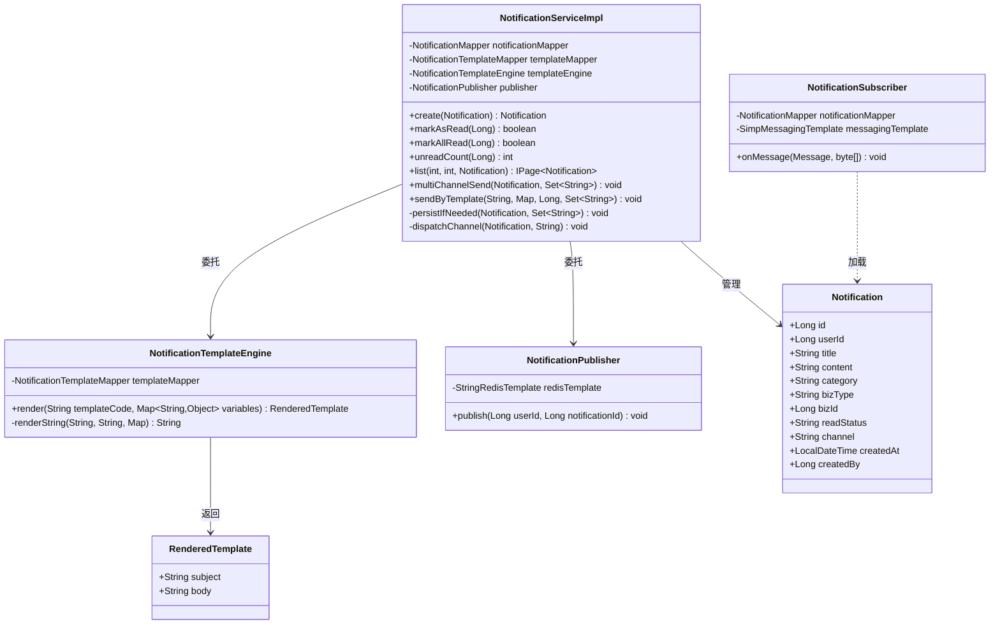
```mermaid
classDiagram
    class NotificationServiceImpl {
        -NotificationMapper notificationMapper
        -NotificationTemplateMapper templateMapper
        -NotificationTemplateEngine templateEngine
        -NotificationPublisher publisher
        +create(Notification) Notification
        +markAsRead(Long) boolean
        +markAllRead(Long) boolean
        +unreadCount(Long) int
        +list(int, int, Notification) IPage~Notification~
        +multiChannelSend(Notification, Set~String~) void
        +sendByTemplate(String, Map, Long, Set~String~) void
        -persistIfNeeded(Notification, Set~String~) void
        -dispatchChannel(Notification, String) void
    }
    class NotificationTemplateEngine {
        -NotificationTemplateMapper templateMapper
        +render(String templateCode, Map~String,Object~ variables) RenderedTemplate
        -renderString(String, String, Map) String
    }
    class NotificationPublisher {
        -StringRedisTemplate redisTemplate
        +publish(Long userId, Long notificationId) void
    }
    class NotificationSubscriber {
        -NotificationMapper notificationMapper
        -SimpMessagingTemplate messagingTemplate
        +onMessage(Message, byte[]) void
    }
    class Notification {
        +Long id
        +Long userId
        +String title
        +String content
        +String category
        +String bizType
        +Long bizId
        +String readStatus
        +String channel
        +LocalDateTime createdAt
        +Long createdBy
    }
    class RenderedTemplate {
        +String subject
        +String body
    }
    NotificationServiceImpl --> NotificationTemplateEngine : 委托
    NotificationServiceImpl --> NotificationPublisher : 委托
    NotificationServiceImpl --> Notification : 管理
    NotificationTemplateEngine --> RenderedTemplate : 返回
    NotificationSubscriber ..> Notification : 加载
```

**多通道投递并发模型**：
1. 前置校验：`channels` 为空直接返回
2. 同步落库：`IN_APP` / `WS` 通道先 `insert` 生成 `id`
3. 并发分发：每个 channel 创建 `CompletableFuture.runAsync`
4. 等待完成：`CompletableFuture.allOf(futures).join()`
5. 异常吞掉：每个任务内部 `try-catch`，`join` 不抛 `CompletionException`

### 3.8 类 C-08：ApprovalDispatcher（审批分发器）

**所在模块**：pms-workflow（`com.dp.plat.workflow.service`）

**职责**：监听 `ApprovalTriggerEvent` Spring 事件，异步分发到对应业务模块的审批触发回调。

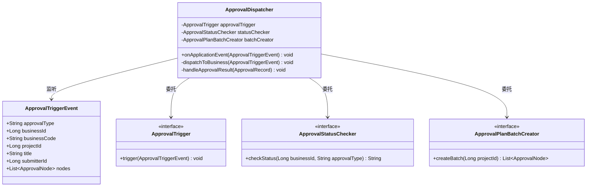
```mermaid
classDiagram
    class ApprovalDispatcher {
        -ApprovalTrigger approvalTrigger
        -ApprovalStatusChecker statusChecker
        -ApprovalPlanBatchCreator batchCreator
        +onApplicationEvent(ApprovalTriggerEvent) void
        -dispatchToBusiness(ApprovalTriggerEvent) void
        -handleApprovalResult(ApprovalRecord) void
    }
    class ApprovalTriggerEvent {
        +String approvalType
        +Long businessId
        +String businessCode
        +Long projectId
        +String title
        +Long submitterId
        +List~ApprovalNode~ nodes
    }
    class ApprovalTrigger {
        <<interface>>
        +trigger(ApprovalTriggerEvent) void
    }
    class ApprovalStatusChecker {
        <<interface>>
        +checkStatus(Long businessId, String approvalType) String
    }
    class ApprovalPlanBatchCreator {
        <<interface>>
        +createBatch(Long projectId) List~ApprovalNode~
    }
    ApprovalDispatcher --> ApprovalTriggerEvent : 监听
    ApprovalDispatcher --> ApprovalTrigger : 委托
    ApprovalDispatcher --> ApprovalStatusChecker : 委托
    ApprovalDispatcher --> ApprovalPlanBatchCreator : 委托
```

**异步分发设计**：
- `ApprovalDispatcher` 实现 `ApplicationListener<ApprovalTriggerEvent>`
- `@Async` 异步处理，避免阻塞业务主事务
- 业务模块发布 `ApprovalTriggerEvent` 事件后立即返回，审批中心异步处理

---

## 4. 状态机详细定义

本章详细定义平台 13 个核心状态机的状态、转换条件与守卫规则。

### 4.1 项目状态机（11 态）

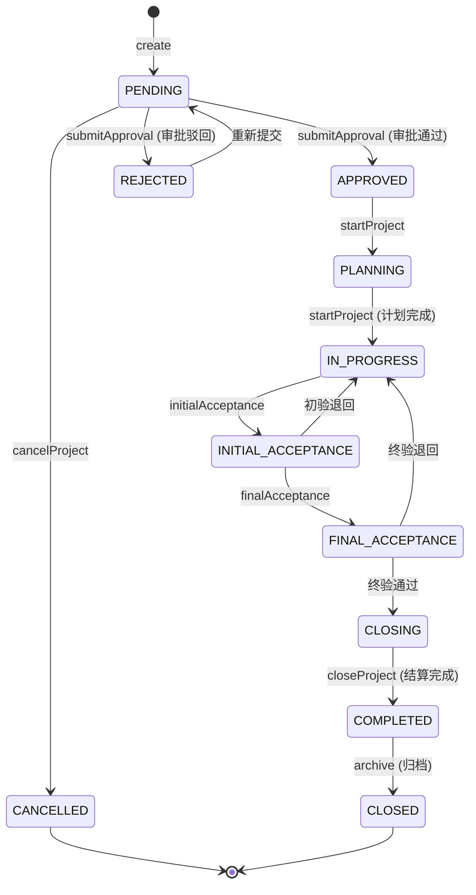
```mermaid
stateDiagram-v2
    [*] --> PENDING: create
    PENDING --> APPROVED: submitApproval (审批通过)
    PENDING --> REJECTED: submitApproval (审批驳回)
    PENDING --> CANCELLED: cancelProject
    APPROVED --> PLANNING: startProject
    PLANNING --> IN_PROGRESS: startProject (计划完成)
    IN_PROGRESS --> INITIAL_ACCEPTANCE: initialAcceptance
    INITIAL_ACCEPTANCE --> IN_PROGRESS: 初验退回
    INITIAL_ACCEPTANCE --> FINAL_ACCEPTANCE: finalAcceptance
    FINAL_ACCEPTANCE --> CLOSING: 终验通过
    FINAL_ACCEPTANCE --> IN_PROGRESS: 终验退回
    CLOSING --> COMPLETED: closeProject (结算完成)
    COMPLETED --> CLOSED: archive (归档)
    REJECTED --> PENDING: 重新提交
    CANCELLED --> [*]
    CLOSED --> [*]
```

| 状态 | 中文名 | 进入条件 | 退出条件 |
|------|--------|----------|----------|
| PENDING | 待审批 | create | submitApproval |
| APPROVED | 已审批 | submitApproval (通过) | startProject |
| PLANNING | 计划中 | startProject (初次) | startProject (计划完成) |
| IN_PROGRESS | 进行中 | startProject (计划完成) / 初验退回 / 终验退回 | initialAcceptance / cancelProject |
| INITIAL_ACCEPTANCE | 初验中 | initialAcceptance | 初验通过 / 初验退回 |
| FINAL_ACCEPTANCE | 终验中 | finalAcceptance | 终验通过 / 终验退回 |
| CLOSING | 关闭中 | 终验通过 | closeProject (结算完成) |
| COMPLETED | 已完成 | closeProject | archive |
| CLOSED | 已归档 | archive | — (终态) |
| CANCELLED | 已取消 | cancelProject | — (终态) |
| REJECTED | 已驳回 | submitApproval (驳回) | 重新提交 → PENDING |

**守卫规则**：
- 初验前必须所有阶段退出闸门通过
- 终验前必须 `DeliverableFinalCheckSpi` 校验通过
- 关闭前必须结算完成

### 4.2 任务状态机（7 态）

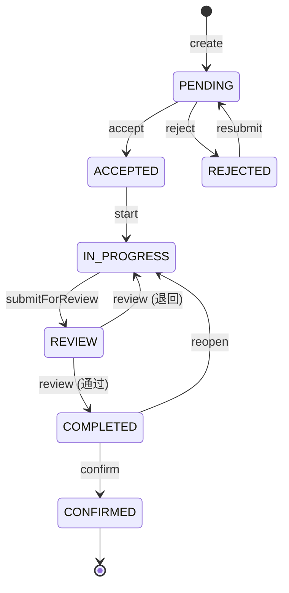
```mermaid
stateDiagram-v2
    [*] --> PENDING: create
    PENDING --> ACCEPTED: accept
    PENDING --> REJECTED: reject
    ACCEPTED --> IN_PROGRESS: start
    IN_PROGRESS --> REVIEW: submitForReview
    REVIEW --> COMPLETED: review (通过)
    REVIEW --> IN_PROGRESS: review (退回)
    COMPLETED --> CONFIRMED: confirm
    COMPLETED --> IN_PROGRESS: reopen
    REJECTED --> PENDING: resubmit
    CONFIRMED --> [*]
```

| 状态 | 中文名 | 进入条件 | 退出条件 |
|------|--------|----------|----------|
| PENDING | 待处理 | create / resubmit | accept / reject |
| ACCEPTED | 已接受 | accept | start |
| IN_PROGRESS | 进行中 | start / review 退回 | submitForReview |
| REVIEW | 待评审 | submitForReview | review (通过/退回) |
| COMPLETED | 已完成 | review (通过) | confirm / reopen |
| CONFIRMED | 已确认 | confirm | — (终态) |
| REJECTED | 已驳回 | reject | resubmit |

### 4.3 资产状态机（9 态）

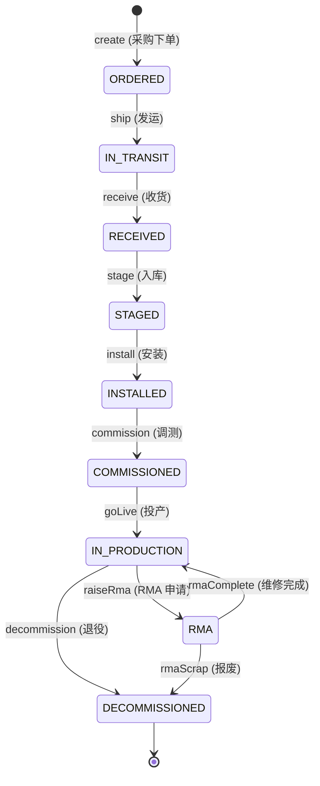
```mermaid
stateDiagram-v2
    [*] --> ORDERED: create (采购下单)
    ORDERED --> IN_TRANSIT: ship (发运)
    IN_TRANSIT --> RECEIVED: receive (收货)
    RECEIVED --> STAGED: stage (入库)
    STAGED --> INSTALLED: install (安装)
    INSTALLED --> COMMISSIONED: commission (调测)
    COMMISSIONED --> IN_PRODUCTION: goLive (投产)
    IN_PRODUCTION --> RMA: raiseRma (RMA 申请)
    RMA --> IN_PRODUCTION: rmaComplete (维修完成)
    IN_PRODUCTION --> DECOMMISSIONED: decommission (退役)
    RMA --> DECOMMISSIONED: rmaScrap (报废)
    DECOMMISSIONED --> [*]
```

| 状态 | 中文名 | 说明 |
|------|--------|------|
| ORDERED | 已下单 | 采购订单已创建 |
| IN_TRANSIT | 在途 | 已发运未到货 |
| RECEIVED | 已收货 | 到货验收完成 |
| STAGED | 已入库 | 入库到备件库 |
| INSTALLED | 已安装 | 现场安装完成 |
| COMMISSIONED | 已调测 | 调测测试通过 |
| IN_PRODUCTION | 投产中 | 业务运行中 |
| RMA | RMA 中 | 退换货流程中 |
| DECOMMISSIONED | 已退役 | 设备退役（终态） |

### 4.4 交付件状态机（7 态）

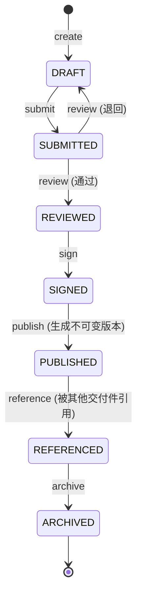
```mermaid
stateDiagram-v2
    [*] --> DRAFT: create
    DRAFT --> SUBMITTED: submit
    SUBMITTED --> REVIEWED: review (通过)
    SUBMITTED --> DRAFT: review (退回)
    REVIEWED --> SIGNED: sign
    SIGNED --> PUBLISHED: publish (生成不可变版本)
    PUBLISHED --> REFERENCED: reference (被其他交付件引用)
    REFERENCED --> ARCHIVED: archive
    ARCHIVED --> [*]
```

### 4.5 审批记录状态机（5 态）

```mermaid
stateDiagram-v2
    [*] --> PENDING: submit
    PENDING --> APPROVED: approve (全部节点通过)
    PENDING --> REJECTED: reject (任一节点驳回)
    PENDING --> WITHDRAWN: withdraw (提交人撤回)
    PENDING --> TIMEOUT: timeout (超时调度)
    REJECTED --> PENDING: resubmit (round+1)
    APPROVED --> [*]
    WITHDRAWN --> [*]
    TIMEOUT --> [*]
```

### 4.6 变更请求状态机（6 态）

```mermaid
stateDiagram-v2
    [*] --> SUBMITTED: create
    SUBMITTED --> UNDER_REVIEW: submit (启动 CCB 工作流)
    UNDER_REVIEW --> CCB_APPROVED: approve
    UNDER_REVIEW --> CCB_REJECTED: reject
    CCB_APPROVED --> IMPLEMENTING: implement
    IMPLEMENTING --> CLOSED: close
    CCB_REJECTED --> CLOSED: close
    any --> CLOSED: close (任意状态可关闭)
    CLOSED --> [*]
```

### 4.7 风险状态机（4 态）

```mermaid
stateDiagram-v2
    [*] --> OPEN: create
    OPEN --> IN_PROGRESS: 监控中
    OPEN --> ESCALATED: escalate (升级为变更请求)
    IN_PROGRESS --> CLOSED: markOccurred (转化为问题)
    IN_PROGRESS --> ESCALATED: escalate
    ESCALATED --> CLOSED: 关闭
    CLOSED --> [*]
```

### 4.8 问题状态机（4 态）

```mermaid
stateDiagram-v2
    [*] --> OPEN: create
    OPEN --> IN_PROGRESS: assign (自动转换)
    IN_PROGRESS --> RESOLVED: resolve
    RESOLVED --> CLOSED: close
    OPEN --> [*]: escalate (升级为变更请求, 问题状态不变)
```

### 4.9 RMA 状态机（6 态）

```mermaid
stateDiagram-v2
    [*] --> REQUESTED: create
    REQUESTED --> APPROVED: submitApproval (审批通过)
    REQUESTED --> REJECTED: submitApproval (审批驳回)
    APPROVED --> IN_TRANSIT: ship (发运)
    IN_TRANSIT --> RECEIVED: receive (收货)
    RECEIVED --> CLOSED: complete (维修完成)
    REJECTED --> [*]
    CLOSED --> [*]
```

### 4.10 低代码配置状态机（3 态）

```mermaid
stateDiagram-v2
    [*] --> DRAFT: create
    DRAFT --> PUBLISHED: publish (生成不可变版本快照)
    PUBLISHED --> ARCHIVED: archive
    PUBLISHED --> DRAFT: 编辑新版本 (旧版本保留)
    ARCHIVED --> [*]
```

### 4.11 集成日志状态机（3 态）

```mermaid
stateDiagram-v2
    [*] --> PENDING: 外部调用发起
    PENDING --> SUCCESS: 调用成功
    PENDING --> FAILED: 调用失败
    FAILED --> SUCCESS: retry (重试成功)
    FAILED --> FAILED: retry (重试失败, retryCount++)
    SUCCESS --> [*]
```

### 4.12 里程碑状态机（5 态）

```mermaid
stateDiagram-v2
    [*] --> PLANNED: create
    PLANNED --> IN_PROGRESS: start
    IN_PROGRESS --> ACHIEVED: achieve (达成)
    IN_PROGRESS --> MISSED: miss (逾期未达成)
    PLANNED --> SKIPPED: skip (跳过)
    ACHIEVED --> [*]
    MISSED --> [*]
    SKIPPED --> [*]
```

### 4.13 项目阶段状态机（4 态）

```mermaid
stateDiagram-v2
    [*] --> PLANNED: create
    PLANNED --> IN_PROGRESS: start
    IN_PROGRESS --> COMPLETED: complete (退出闸门通过)
    IN_PROGRESS --> SKIPPED: skip
    COMPLETED --> [*]
    SKIPPED --> [*]
```

---

## 5. 异常处理设计

### 5.1 异常体系架构

平台异常体系基于 `pms-common` 的 `com.dp.plat.common.exception` 包，统一继承自 `RuntimeException`，通过 `@RestControllerAdvice` 全局捕获并转换为 `Result<T>` 响应。

```mermaid
classDiagram
    class RuntimeException {
        <<Java 标准库>>
    }
    class BusinessException {
        +int code
        +String message
    }
    class IntegrationException {
        +String systemName
        +String errorCode
    }
    class SecurityException {
        +String reason
    }
    class DdlSecurityException {
        +String sql
    }
    class MicroflowExecutionException {
        +String microflowCode
        +String nodeId
    }
    RuntimeException <|-- BusinessException
    RuntimeException <|-- IntegrationException
    RuntimeException <|-- SecurityException
    RuntimeException <|-- DdlSecurityException
    RuntimeException <|-- MicroflowExecutionException
```

### 5.2 异常分类与处理策略

| 异常类 | 触发场景 | HTTP 状态码 | 响应 code | 处理策略 |
|--------|----------|-------------|-----------|----------|
| `BusinessException` | 业务规则校验失败（状态机非法转换、字段校验失败等） | 400 | 400 | 全局捕获，返回错误信息 |
| `IntegrationException` | 外部系统调用失败（D365/FP/OA） | 200 | 500 | 记录集成日志，进入重试队列 |
| `SecurityException` | 权限不足、JWT 过期、XSS 拦截 | 401/403 | 401/403 | 全局捕获，返回安全错误 |
| `DdlSecurityException` | 低代码 DDL 危险语句拦截 | 400 | 400 | 阻断 DDL 执行 |
| `MicroflowExecutionException` | 微流节点执行失败 | 500 | 500 | 记录执行轨迹，best-effort |
| `OptimisticLockingFailureException` | 乐观锁冲突（`@Version`） | 409 | 409 | 全局捕获，提示重试 |
| `MethodArgumentNotValidException` | Bean Validation 校验失败 | 400 | 400 | 全局捕获，返回字段级错误 |
| `NoHandlerFoundException` | 接口不存在 | 404 | 404 | 全局捕获 |
| `Exception`（兜底） | 未捕获异常 | 500 | 500 | 全局捕获，记录日志，返回"系统异常" |

### 5.3 全局异常处理器

`pms-common` 的 `GlobalExceptionHandler`（`@RestControllerAdvice`）按异常类型优先级捕获：

| 优先级 | 异常类型 | 处理方法 | 响应 |
|--------|----------|----------|------|
| 1 | `SecurityException` | `handleSecurityException` | 401/403 + 错误信息 |
| 2 | `BusinessException` | `handleBusinessException` | 200 + `Result.fail(code, message)` |
| 3 | `IntegrationException` | `handleIntegrationException` | 200 + `Result.fail(500, message)` |
| 4 | `MethodArgumentNotValidException` | `handleValidationException` | 400 + 字段级错误 |
| 5 | `OptimisticLockingFailureException` | `handleOptimisticLocking` | 409 + "数据已变更，请刷新重试" |
| 6 | `NoHandlerFoundException` | `handleNotFound` | 404 |
| 7 | `Exception` | `handleException` | 500 + "系统异常" |

### 5.4 外部集成异常处理

`pms-integration` 的异常处理采用"记录日志 + 重试 + 降级"三段式：

1. **记录日志**：所有外部调用落库 `pms_integration_log`，记录请求 URL、请求体、响应状态、响应体、错误信息、重试次数
2. **重试**：
   - Resilience4j `@Retry` 注解触发自动重试（最多 3 次，指数退避）
   - 手动重试：`POST /api/integration/log/{id}/retry`
   - 定时调度重试：`RetryServiceImpl.scheduledRetry()`（每 5 分钟扫描失败日志）
3. **降级**：
   - Resilience4j `@CircuitBreaker` OPEN 时 fallback 方法抛 `IntegrationException`
   - 健康检查方法不加注解，避免熔断器 OPEN 时健康端点无法恢复

### 5.5 工作流异常处理

`pms-workflow` 的异常处理采用 best-effort 策略：

- Flowable 启动失败 `try-catch` 包裹，`log.error` 但事务不回滚
- `OaTaskListener` 镜像 OA 失败仅记 ERROR 日志，不阻断流程主事务
- `processInstanceId` 缺失则跳过任务完成
- 审批超时调度失败仅记日志，不影响主审批流程

### 5.6 低代码异常处理

`pms-lowcode` 的异常处理采用沙箱 + best-effort：

- **Groovy 沙箱**：`SecureASTCustomizer` 拦截危险 AST 节点，抛 `GroovyRuntimeException`
- **Aviator 沙箱**：禁用危险特性 + 正则阻断危险引用
- **DDL 安全**：`DdlSecurityException` 阻断危险 DDL
- **微流执行**：`MicroflowExecutionException` 记录执行轨迹，best-effort
- **配置审计**：AOP 写审计日志异常被吞掉，不阻断主业务

### 5.7 异常响应示例

#### 5.7.1 业务异常

```json
{
  "code": 400,
  "message": "当前项目状态不允许提交审批",
  "data": null
}
```

#### 5.7.2 集成异常

```json
{
  "code": 500,
  "message": "D365 系统调用失败: 连接超时",
  "data": null
}
```

#### 5.7.3 字段校验异常

```json
{
  "code": 400,
  "message": "参数校验失败",
  "data": {
    "projectName": "项目名称不能为空",
    "budget": "预算金额必须大于 0"
  }
}
```

#### 5.7.4 乐观锁冲突

```json
{
  "code": 409,
  "message": "数据已被其他用户修改，请刷新后重试",
  "data": null
}
```

---

## 6. 并发控制与事务管理

### 6.1 事务边界设计

平台事务边界遵循"宽进严出"原则：读操作不开事务，写操作开事务，跨服务事务用 Saga。

| 场景 | 事务策略 | 注解 |
|------|----------|------|
| 单表 CRUD | 单库事务 | `@Transactional` |
| 多表关联写 | 单库事务 | `@Transactional` |
| 模板深拷贝 12 步 | 单库事务（保证原子性） | `@Transactional` |
| 审批提交 + Flowable 启动 | 主事务 + best-effort | `@Transactional` + `try-catch` |
| CCB 审批 + 基线审计 | 单库事务 | `@Transactional` |
| 结算 Saga 6 步 | Saga 编排（每步独立事务） | 每步 `@Transactional` |
| OA 任务镜像 | `REQUIRES_NEW` 事务隔离 | `@Transactional(propagation = REQUIRES_NEW)` |
| 通知多通道投递 | 无事务（best-effort） | 无 |
| 集成日志记录 | `REQUIRES_NEW` 事务 | `@Transactional(propagation = REQUIRES_NEW)` |

### 6.2 乐观锁机制

平台在高并发更新实体使用 MyBatis-Plus `@Version` 乐观锁：

| 实体 | 乐观锁字段 | 场景 |
|------|-----------|------|
| `ChangeRequest` | `version` | CCB 审批并发 |
| `ApprovalRecord` | `version` | 审批节点并发推进 |
| `ApprovalFieldPermission` | `version` | 字段权限配置并发 |
| `LowCodeEntity` | `version` | 实体设计并发保存 |
| `LowCodeForm` | `version` | 表单配置并发保存 |

**乐观锁工作原理**：
1. 更新时 MyBatis-Plus 自动附加 `WHERE version = ?` 条件
2. 更新成功后 `version + 1`
3. 并发更新冲突时影响行数为 0，抛 `OptimisticLockingFailureException`
4. 全局异常处理器返回 409 + "数据已变更，请刷新重试"

### 6.3 分布式锁机制

平台在以下场景使用 Redis 分布式锁：

| 场景 | 锁键 | TTL | 用途 |
|------|------|-----|------|
| OAuth2 Token 刷新 | `oauth:token:refresh:{system}` | 30s | 单飞刷新，避免多实例并发刷新 |
| 低代码编辑锁 | `lowcode:edit-lock:{configType}:{configId}` | 5min | 协同编辑互斥 |
| 幂等键校验 | `idempotent:{key}` | 24h | 写操作幂等 |

**OAuth2 Token 单飞刷新**：
- `TokenRefreshLock` 基于 Redis SETNX + Lua 解锁
- 首个获取锁的实例执行刷新，其他实例等待并读取缓存
- 避免多实例并发刷新导致 Token 端点雪崩

### 6.4 幂等性设计

平台写操作支持幂等性，通过 `X-Idempotent-Key` 头实现：

```mermaid
sequenceDiagram
    participant FE as 前端
    participant AS as IdempotentAspect
    participant Redis as Redis
    participant CTRL as Controller

    FE->>AS: POST /api/xxx (X-Idempotent-Key: uuid)
    AS->>Redis: SETNX idempotent:{uuid} EX 86400
    alt 键已存在
        Redis-->>AS: 0 (失败)
        AS-->>FE: 409 重复请求
    else 键不存在
        Redis-->>AS: 1 (成功)
        AS->>CTRL: proceed()
        CTRL-->>AS: Result
        AS-->>FE: 200 响应
    end
```

| 维度 | 设计 |
|------|------|
| 幂等键来源 | 前端 `crypto.randomUUID()` 生成 UUID v4 |
| 存储 | Redis SETNX（24h TTL） |
| 注解 | `@Idempotent`（标注在 Controller 方法） |
| 拦截器 | `IdempotentKeyInterceptor`（从请求头读取键写入 request attribute） |
| 切面 | `IdempotentAspect`（校验 Redis 是否存在） |
| 重复请求响应 | 409 + "请勿重复提交" |

### 6.5 限流设计

平台限流分两层：

| 层级 | 实现 | 范围 | 配置 |
|------|------|------|------|
| 全局限流 | `RateLimitFilter`（pms-common） | 所有 HTTP 请求 | 基于 Redis + Lua，默认 1000 QPS |
| 外部集成限流 | Resilience4j `RateLimiter` | D365/FP/OA 各自独立 | 50 次/秒，等待 10s |

### 6.6 并发集合与线程安全

| 场景 | 实现 | 线程安全策略 |
|------|------|--------------|
| 微流调试会话 | `ConcurrentHashMap<String, DebugSession>` | 并发哈希表 |
| 动态数据源缓存 | `ConcurrentHashMap<String, HikariDataSource>` | 并发哈希表 |
| 通知多通道投递 | `CompletableFuture.runAsync` | 异步任务，每个任务内部 `try-catch` |
| 规则集 WHEN 并行 | `CompletableFuture` | 并行执行，结果聚合为 Map |
| 模板引擎渲染 | 每次新建 `Configuration` | 避免共享可变模板加载器 |
| Aviator 沙箱 | 独立 `AviatorEvaluatorInstance` | 非全局单例，避免污染 |

### 6.7 死锁规避

| 场景 | 规避策略 |
|------|----------|
| 三账联动 | 单向无环依赖链（risk → issue → change request） |
| 循环依赖打破 | `@Lazy` 注入（如 `PromotionGateService` 与 `EnvironmentPromotionService`） |
| 资源排序 | 多资源操作按固定顺序加锁 |
| 超时设置 | 分布式锁 TTL + 等待超时 |
| Saga 补偿 | 每步定义补偿动作，失败时按逆序回滚 |

### 6.8 数据库连接池

HikariCP 配置：

| 环境 | min-idle | max-pool | connection-timeout | idle-timeout |
|------|----------|----------|--------------------|--------------| 
| dev | 5 | 20 | 30s | 10min |
| prod | 10 | 50 | 30s | 10min |

连接池监控：通过 Micrometer 暴露 `hikaricp.connections.active` / `hikaricp.connections.idle` / `hikaricp.connections.pending` 指标。

### 6.9 异步任务

| 场景 | 实现 | 线程池 |
|------|------|--------|
| 通知多通道投递 | `CompletableFuture.runAsync` | ForkJoinPool.commonPool |
| 低代码 Excel 导入 | `@Async` + 独立 `@Component` | SimpleAsyncTaskExecutor |
| 双轨进度持久化 | `@Async` | 默认线程池 |
| Spring 事件异步处理 | `@Async` + `@EnableAsync` | 默认线程池 |
| Quartz 定时任务 | `@Scheduled` + `@EnableScheduling` | Quartz 线程池（threadCount=5） |

**异步代理失效规避**：
`LowCodeImportAsyncProcessor` 独立为 `@Component` 承载 `@Async` 方法，避免同类自调用导致 Spring AOP 代理失效（`this.processImportAsync(...)` 不走代理，`@Async` 不生效）。

### 6.10 事务传播策略

| 传播策略 | 使用场景 | 说明 |
|----------|----------|------|
| `REQUIRED`（默认） | 主业务事务 | 当前有事务则加入，无则新建 |
| `REQUIRES_NEW` | OA 任务镜像、集成日志 | 独立新事务，不受主事务影响 |
| `SUPPORTS` | 查询方法 | 当前有事务则加入，无则非事务执行 |
| `NEVER` | 通知投递 | 强制非事务执行 |

**OA 镜像 `REQUIRES_NEW` 事务隔离**：
`OaTaskListener` 在 Flowable 任务 create/complete 事件中镜像致远 OA，使用 `REQUIRES_NEW` 事务隔离，确保 OA 镜像失败不影响 Flowable 主事务。

---

## 7. 附录

### 7.1 设计模式索引

| 模式 | 应用场景 |
|------|----------|
| 状态机模式 | 项目/任务/资产/交付件/审批/变更/风险/问题/RMA 等 13 个状态机 |
| SPI 模式 | 12 个跨模块 SPI 接口 |
| 模板方法 | 项目模板深拷贝 12 步、Saga 编排 6 步 |
| 责任链 | 多节点审批按 `nodeOrder` 顺序流转 |
| 策略模式 | `SensitiveFieldMasker` 按 `maskPattern` 选择脱敏策略 |
| 适配器模式 | `pms-integration` 三套外部系统适配器 |
| 工厂模式 | `DdlGeneratorFactory` 按方言选择 DDL 生成器 |
| 观察者模式 | `ApprovalTriggerEvent` Spring 事件 + `ApprovalDispatcher` 监听 |
| 代理模式 | `IdempotentAspect` / `FieldEncryptAspect` / `ConfigAuditAspect` AOP |
| 单例模式 | `AviatorEvaluatorInstance`（独立实例，非全局单例） |
| 建造者模式 | `Notification.builder()` / `ApprovalRecord.builder()` |
| record 模式 | `RenderedTemplate(subject, body)` Java 14+ record |

### 7.2 关键常量索引

| 常量 | 值 | 所在 |
|------|-----|------|
| 通知广播频道 | `pms:notification:broadcast` | `NotificationPublisher` |
| 幂等键头 | `X-Idempotent-Key` | `IdempotentKeyInterceptor` |
| 通道常量 | `IN_APP` / `WS` / `EMAIL` / `OA` | `NotificationServiceImpl` |
| 心跳间隔 | 10s | `WebSocketConfig` |
| 消息大小上限 | 64KB | `WebSocketConfig` |
| 微流安全计数器上限 | 1000 | `MicroflowEngine` |
| OAuth2 Token 缓存 TTL | 与外部系统 expires_in 一致 | `OAuthTokenCache` |
| 编辑锁 TTL | 5min | `EditLockService` |
| 调试会话超时 | 30min | `MicroflowDebugger` |
| 集成重试间隔 | 300000ms（5 分钟） | `IntegrationProperties` |
| 集成最大重试次数 | 3 | `IntegrationProperties` |
| 集成退避乘数 | 2 | `IntegrationProperties` |
| Redis 缓存默认 TTL | 30min + 0~5min 随机抖动 | `RedisConfig` |
| 系统命名缓存 TTL | 60min | `RedisConfig` |
| JWT 过期时间 | 86400000ms（24h） | `application.yml` |

### 7.3 SPI 接口清单

| SPI 接口 | 提供方 | 消费方 | 关键方法 |
|----------|--------|--------|----------|
| `ProjectApprovalTrigger` | pms-project | pms-workflow | `trigger(ProjectApprovalEvent)` |
| `ProjectStatusChecker` | pms-project | pms-baseline | `checkStatus(Long)` |
| `ApprovalTrigger` | pms-workflow | pms-project / pms-baseline | `trigger(ApprovalTriggerEvent)` |
| `ApprovalStatusChecker` | pms-workflow | pms-project | `checkStatus(Long, String)` |
| `ApprovalPlanBatchCreator` | pms-workflow | pms-project | `createBatch(Long)` |
| `AssetStockChecker` | pms-asset | pms-implementation | `checkStock(Long)` |
| `DeliverableFinalCheckSpi` | pms-deliverable | pms-project | `check(Long)` |
| `TaskProgressProvider` | pms-implementation | pms-project | `getProjectProgress(Long)` |
| `BaselineChangeTrigger` | pms-baseline | pms-project | `trigger(BaselineChangeEvent)` |
| `NotificationSender` | pms-notification | 多模块 | `send(Notification, Set)` |
| `FileStorageSpi` | pms-file | 多模块 | `upload(MultipartFile)` / `download(String)` |
| `IntegrationRetrySpi` | pms-integration | pms-workflow | `retry(Long)` |

### 7.4 状态机索引

| 状态机 | 状态数 | 模块 |
|--------|--------|------|
| 项目 | 11 | pms-project |
| 项目阶段 | 4 | pms-project |
| 里程碑 | 5 | pms-project |
| 任务 | 7 | pms-implementation |
| 资产 | 9 | pms-asset |
| 交付件 | 7 | pms-deliverable |
| 审批记录 | 5 | pms-workflow |
| 变更请求 | 6 | pms-governance |
| 风险 | 4 | pms-governance |
| 问题 | 4 | pms-governance |
| RMA | 6 | pms-asset |
| 低代码配置 | 3 | pms-lowcode |
| 集成日志 | 3 | pms-integration |

### 7.5 时序图索引

| 时序图 | 流程 |
|--------|------|
| F-01 | 项目立项审批流程 |
| F-02 | 项目模板深拷贝流程 |
| F-03 | 任务双轨进度汇总流程 |
| F-04 | 结算 Saga 6 步编排流程 |
| F-05 | CCB 变更请求审批流程 |
| F-06 | 交付件全生命周期流转流程 |
| F-07 | 资产 RMA 6 步闭环流程 |
| F-08 | 通知多通道并发投递流程 |

### 7.6 类图索引

| 类图 | 类名 | 模块 |
|------|------|------|
| C-01 | ProjectServiceImpl | pms-project |
| C-02 | ApprovalCenterServiceImpl | pms-workflow |
| C-03 | ChangeRequestServiceImpl | pms-governance |
| C-04 | D365IntegrationServiceImpl | pms-integration |
| C-05 | MicroflowEngine | pms-lowcode |
| C-06 | BaselineServiceImpl | pms-baseline |
| C-07 | NotificationServiceImpl | pms-notification |
| C-08 | ApprovalDispatcher | pms-workflow |

### 7.7 风险与限制

| 风险/限制 | 影响 | 缓解措施 |
|-----------|------|----------|
| 编号生成器并发风险 | 变更/风险/问题编号可能重复 | 建议加分布式锁或数据库唯一索引 |
| CCB 审批任务查找局限 | 审批人 ≠ 操作人场景找不到任务 | 改为按 processInstanceId 直接查询活动任务 |
| 协同编辑基于 HTTP 轮询 | 性能与实时性有限 | 预留 Yjs + y-websocket 升级点 |
| 低代码沙箱非绝对安全 | 高级用户可能绕过 | 表达式来源做权限校验 |
| 微流安全计数器上限 1000 | 复杂微流可能被截断 | 拆分微流或调高上限 |
| OAuth2 Token 缓存失效 | 短暂集成不可用 | 单飞刷新 + 失败告警 |
| 基线快照未精确对比 | `oldValue` 为固定占位 | 集成 pms-baseline 读取真实基线 |

### 7.8 术语对照

| 中文 | 英文 | 缩写 |
|------|------|------|
| 服务提供者接口 | Service Provider Interface | SPI |
| 变更控制委员会 | Change Control Board | CCB |
| 退换货授权 | Return Merchandise Authorization | RMA |
| 服务等级协议 | Service Level Agreement | SLA |
| 有向无环图 | Directed Acyclic Graph | DAG |
| 应用性能监控 | Application Performance Monitoring | APM |
| 数据定义语言 | Data Definition Language | DDL |
| 对象关系映射 | Object-Relational Mapping | ORM |
| 应用编程接口 | Application Programming Interface | API |

---

**文档结束**

本文档为 PMS 平台详细设计基线，覆盖 8 大业务流程时序图、8 个关键类设计、13 个状态机定义、异常处理体系、并发控制与事务管理。后续变更须经架构评审委员会评审通过后方可修订。
