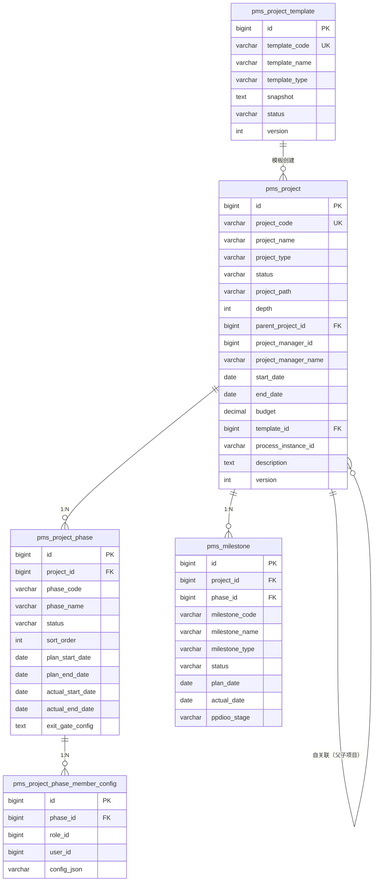
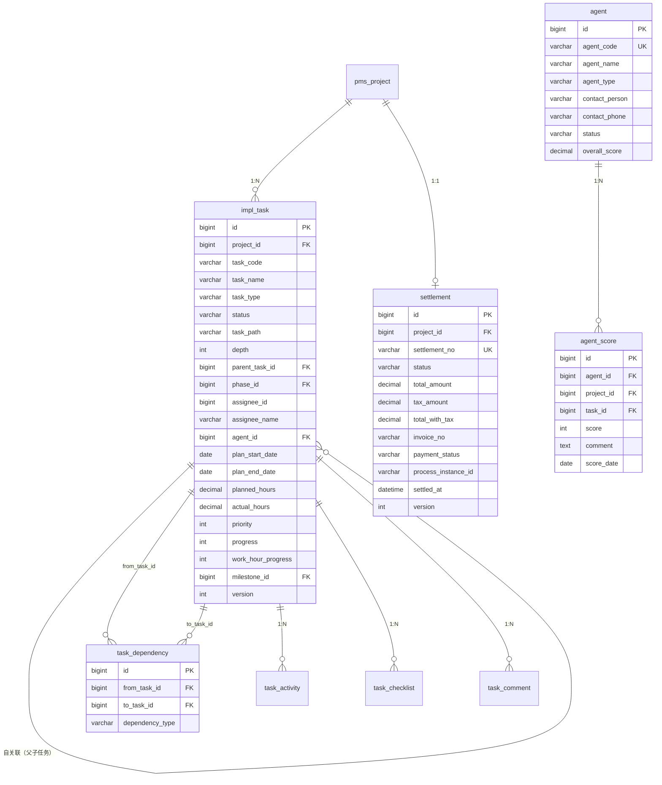
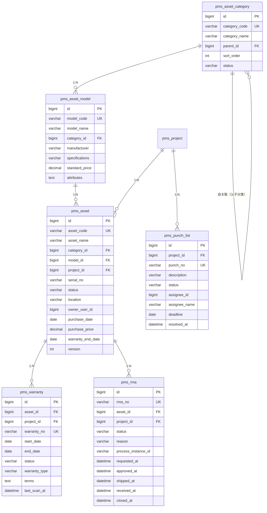
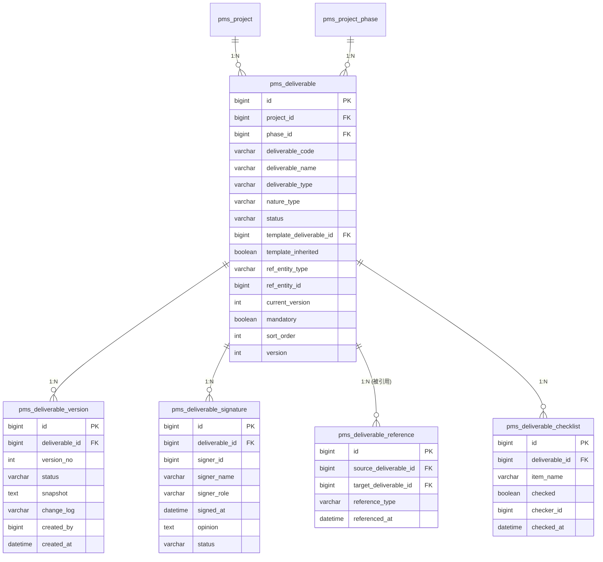
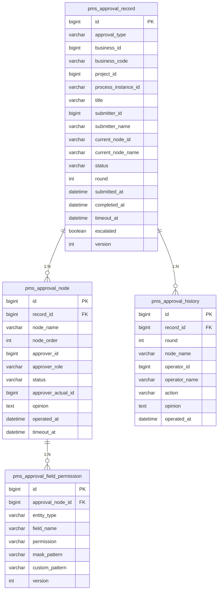
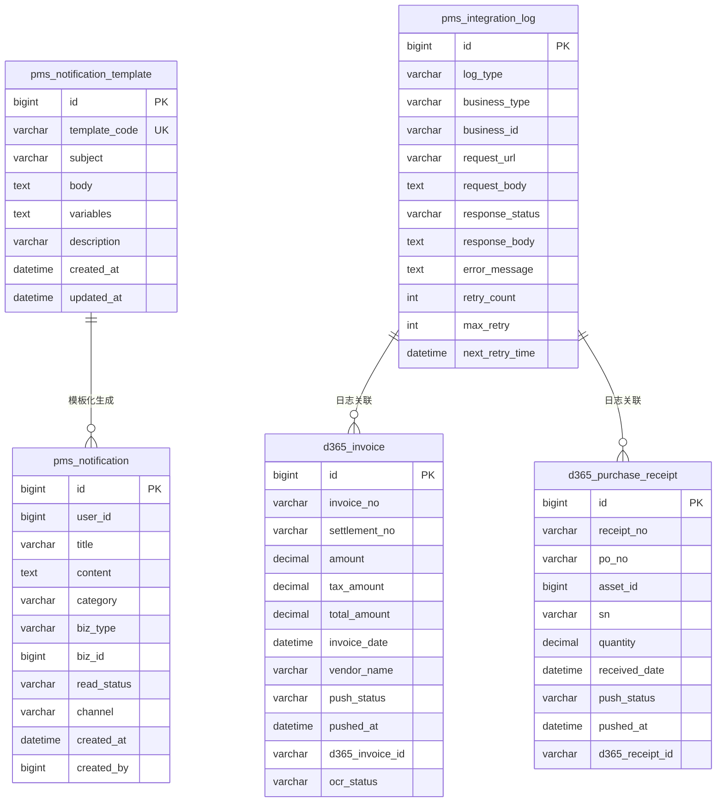
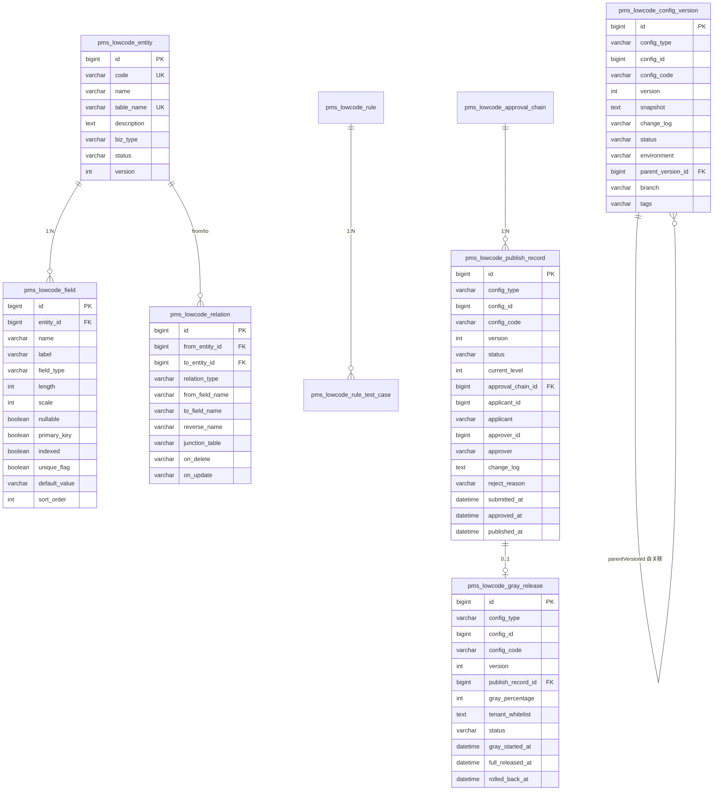
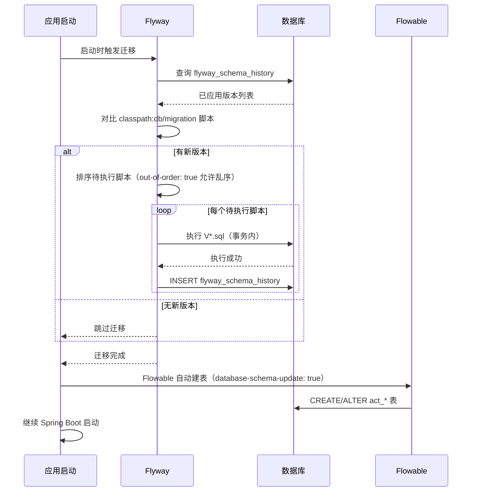

# 04 - DB 数据库设计文档

> 网络设备工程项目交付管理平台（network-equipment-pms）数据库设计文档
> 版本：v1.0.0 · 状态：基线发布 · 维护：架构组

---

## 1. 文档信息

### 1.1 文档目的

本文档是网络设备工程项目交付管理平台（以下简称"PMS 平台"）的数据库设计文档，面向数据库管理员、开发工程师与运维团队，对平台数据库的设计规范、ER 关系、表结构、JSON 字段结构、索引策略与 Flyway 迁移管理进行详细描述。

平台数据库由 MySQL 8.0.16 主库承载，采用 utf8mb4 字符集与 utf8mb4_0900_ai_ci 排序规则，通过 Flyway 管理 89 个版本化迁移脚本（V1 — V89）。

### 1.2 适用读者

| 角色 | 关注重点 |
|------|----------|
| DBA | 表结构、索引、迁移脚本、性能调优 |
| 开发工程师 | 字段定义、JSON 结构、命名规范 |
| 运维工程师 | 备份恢复、容量规划、监控指标 |
| 架构师 | ER 关系、设计规范、扩展性 |

### 1.3 修订记录

| 版本 | 日期 | 修订人 | 说明 |
|------|------|--------|------|
| v1.0.0 | 2026-07-22 | 架构组 | 基线发布，覆盖 8 个核心域 ER 图 + 35 张核心表 + JSON 字段结构 + 索引策略 + Flyway 迁移管理 |

### 1.4 数据库环境

| 维度 | 配置 |
|------|------|
| 数据库引擎 | MySQL 8.0.16（InnoDB） |
| 字符集 | utf8mb4 |
| 排序规则 | utf8mb4_0900_ai_ci |
| 连接池 | HikariCP（dev: min=5/max=20；prod: min=10/max=50） |
| 迁移工具 | Flyway 9.x（随 Spring Boot 3.2.5） |
| 连接 URL | `jdbc:mysql://localhost:3306/network_equipment_pms?useUnicode=true&characterEncoding=utf-8&useSSL=false&serverTimezone=Asia/Shanghai` |

---

## 2. 设计规范

### 2.1 命名规范

| 对象类型 | 命名规则 | 示例 |
|----------|----------|------|
| 表名 | 全小写下划线分隔，业务表前缀 `pms_`，系统表前缀 `sys_`，低代码表前缀 `pms_lowcode_`，外部集成表前缀 `d365_`，Flowable 引擎表前缀 `act_` | `pms_project` / `sys_user` / `pms_lowcode_entity` / `d365_invoice` |
| 字段名 | 全小写下划线分隔 | `project_code` / `create_time` |
| 主键 | 统一 `id`，BIGINT AUTO_INCREMENT | `id` |
| 外键字段 | `<表名单数>_id` | `project_id` / `user_id` |
| 索引名 | `idx_<表名简写>_<字段>` 或 `uk_<表名简写>_<字段>`（唯一索引） | `idx_project_status` / `uk_template_code` |
| 状态字段 | `status`，VARCHAR，存储状态枚举字符串 | `status` |
| 时间字段 | `*_at`（事件时间） / `*_time`（系统时间） | `created_at` / `create_time` |
| 布尔字段 | `is_*` 或 `*_flag` | `is_active` / `deleted` |
| 逻辑删除 | `deleted`，TINYINT（0=未删除，1=已删除） | `deleted` |
| 乐观锁 | `version`，INT | `version` |

### 2.2 公共字段规范

继承 `com.dp.plat.common.entity.BaseEntity` 的实体包含以下公共字段，由 `MetaObjectHandler` 自动填充：

| 字段 | 类型 | 说明 | 填充时机 |
|------|------|------|----------|
| `id` | BIGINT AUTO_INCREMENT | 主键 | INSERT |
| `create_time` | DATETIME | 创建时间 | INSERT |
| `update_time` | DATETIME | 更新时间 | INSERT / UPDATE |
| `create_by` | VARCHAR(64) | 创建人（用户名或 ID） | INSERT |
| `update_by` | VARCHAR(64) | 更新人 | UPDATE |
| `deleted` | TINYINT(1) DEFAULT 0 | 逻辑删除标记 | DELETE（置 1） |

部分实体（如 `Notification` / `NotificationTemplate` / `ApprovalNode` / `ApprovalHistory`）不继承 `BaseEntity`，使用独立审计字段。

### 2.3 数据类型规范

| 业务场景 | 推荐类型 | 说明 |
|----------|----------|------|
| 主键 | BIGINT AUTO_INCREMENT | 支持 64 位自增 |
| 金额 | DECIMAL(18,2) | 精度 18，小数 2 位 |
| 短字符串 | VARCHAR(64) / VARCHAR(200) | 名称、编码等 |
| 长字符串 | VARCHAR(500) / VARCHAR(2000) | 描述、意见等 |
| 大文本 | TEXT / LONGTEXT | JSON 配置、正文等 |
| 状态枚举 | VARCHAR(20) / VARCHAR(50) | 存储枚举字符串 |
| 时间 | DATETIME | 精确到秒 |
| 日期 | DATE | 仅日期 |
| 布尔 | TINYINT(1) 或 BOOLEAN | 0/1 |
| JSON | TEXT | 通过 JacksonTypeHandler 序列化 |

### 2.4 约束规范

| 约束类型 | 使用策略 |
|----------|----------|
| 主键约束 | 所有表必须有主键 `id` |
| 唯一约束 | 业务编码字段必须唯一（如 `project_code` / `template_code` / `cr_no`） |
| 非空约束 | 关键业务字段 NOT NULL（如 `project_id` / `status`） |
| 外键约束 | 仅在强约束场景使用，多数业务表通过 `(biz_type, biz_id)` 弱关联 |
| 默认值 | 状态字段提供默认值（如 `status DEFAULT 'PENDING'`） |

### 2.5 字符集与排序

| 配置项 | 值 | 说明 |
|--------|-----|------|
| `character_set_server` | utf8mb4 | 支持 emoji 与生僻字 |
| `collation_server` | utf8mb4_0900_ai_ci | 大小写不敏感，口音不敏感 |
| 建表默认 | `DEFAULT CHARSET=utf8mb4 COLLATE=utf8mb4_0900_ai_ci` | 所有表显式声明 |

---

## 3. ER 关系图

本章按 8 个核心数据域绘制 ER 关系图，展示实体之间的关联关系。

### 3.1 项目域 ER 图

项目域包含项目主表、项目阶段、里程碑、项目模板、阶段成员配置。



### 3.2 实施域 ER 图

实施域包含实施任务、任务依赖、代理商、代理商评分、结算。



### 3.3 资产域 ER 图

资产域包含资产、资产分类、资产型号、质保、RMA、Punch List。



### 3.4 交付件域 ER 图

交付件域包含交付件、版本、签核、引用、检查清单。



### 3.5 治理域 ER 图

治理域包含变更请求、基线变更历史、风险、问题。

```mermaid
erDiagram
    pms_project ||--o{ pms_change_request : "1:N"
    pms_project ||--o{ pms_risk : "1:N"
    pms_project ||--o{ pms_issue : "1:N"
    pms_change_request ||--o{ pms_baseline_history : "1:N"
    pms_risk ||--o| pms_issue : "markOccurred 转化"
    pms_risk ||--o| pms_change_request : "escalate 升级"
    pms_issue ||--o| pms_change_request : "escalate 升级"

    pms_change_request {
        bigint id PK
        varchar cr_no UK
        bigint project_id FK
        varchar project_name
        varchar title
        text description
        bigint requester_id
        varchar requester_name
        date request_date
        text impact_scope
        varchar impact_schedule
        varchar impact_cost
        varchar impact_quality
        varchar priority
        varchar status
        bigint approver_id
        varchar approver_name
        varchar process_instance_id
        boolean baseline_updated
        datetime approved_at
        datetime closed_at
        int version
    }
    pms_baseline_history {
        bigint id PK
        bigint project_id FK
        bigint change_request_id FK
        varchar cr_no
        varchar change_type
        varchar field_name
        text old_value
        text new_value
        text description
        datetime changed_at
        varchar changed_by
    }
    pms_risk {
        bigint id PK
        varchar risk_no UK
        bigint project_id FK
        text description
        varchar category
        int likelihood
        int impact
        int score
        varchar priority
        varchar mitigation
        text contingency_plan
        bigint owner_id
        varchar owner_name
        varchar status
        date review_date
        bigint source_issue_id
        datetime identified_at
        datetime closed_at
    }
    pms_issue {
        bigint id PK
        varchar issue_no UK
        bigint project_id FK
        text description
        bigint raised_by
        varchar raised_by_name
        bigint assignee_id
        varchar assignee_name
        varchar priority
        date target_resolve_date
        varchar status
        bigint source_risk_id
        varchar source_risk_no
        bigint source_change_id
        varchar source_cr_no
        datetime resolved_at
        datetime closed_at
        text resolution
    }
```



### 3.6 审批中心域 ER 图

审批中心域包含审批记录、审批节点、审批历史、字段权限。



### 3.7 通知与集成域 ER 图



### 3.8 低代码核心域 ER 图（部分）

低代码域包含 27 张表，以下展示核心配置与版本管理关系：



---

## 4. 表结构详细设计

本章详细描述平台 35 张核心表的字段定义，包括字段名、类型、约束、说明。

### 4.1 系统域表

#### 4.1.1 sys_user（用户表）

| 字段 | 类型 | 约束 | 说明 |
|------|------|------|------|
| `id` | BIGINT AUTO_INCREMENT | PK | 主键 |
| `username` | VARCHAR(64) | NOT NULL, UNIQUE | 用户名 |
| `password` | VARCHAR(128) | NOT NULL | 密码（BCrypt 加密） |
| `nickname` | VARCHAR(64) | | 昵称 |
| `email` | VARCHAR(128) | | 邮箱 |
| `phone` | VARCHAR(20) | | 手机号 |
| `avatar` | VARCHAR(255) | | 头像 URL |
| `dept_id` | BIGINT | | 部门 ID |
| `status` | VARCHAR(20) | DEFAULT 'ACTIVE' | 状态：ACTIVE/INACTIVE/LOCKED |
| `last_login_at` | DATETIME | | 最后登录时间 |
| `last_login_ip` | VARCHAR(50) | | 最后登录 IP |
| `password_changed_at` | DATETIME | | 密码修改时间 |
| `create_time` | DATETIME | | 创建时间 |
| `update_time` | DATETIME | | 更新时间 |
| `create_by` | VARCHAR(64) | | 创建人 |
| `update_by` | VARCHAR(64) | | 更新人 |
| `deleted` | TINYINT(1) | DEFAULT 0 | 逻辑删除 |

**索引**：
- `PRIMARY KEY (id)`
- `UNIQUE KEY uk_username (username)`
- `idx_dept_id (dept_id)`

#### 4.1.2 sys_role（角色表）

| 字段 | 类型 | 约束 | 说明 |
|------|------|------|------|
| `id` | BIGINT AUTO_INCREMENT | PK | 主键 |
| `role_code` | VARCHAR(64) | NOT NULL, UNIQUE | 角色编码 |
| `role_name` | VARCHAR(64) | NOT NULL | 角色名称 |
| `description` | VARCHAR(255) | | 描述 |
| `data_scope` | VARCHAR(20) | DEFAULT 'ALL' | 数据范围：ALL/DEPT/SELF |
| `status` | VARCHAR(20) | DEFAULT 'ACTIVE' | 状态 |
| 公共字段 | | | 见 2.2 |

**索引**：
- `PRIMARY KEY (id)`
- `UNIQUE KEY uk_role_code (role_code)`

#### 4.1.3 sys_menu（菜单表）

| 字段 | 类型 | 约束 | 说明 |
|------|------|------|------|
| `id` | BIGINT AUTO_INCREMENT | PK | 主键 |
| `parent_id` | BIGINT | DEFAULT 0 | 父菜单 ID |
| `menu_name` | VARCHAR(64) | NOT NULL | 菜单名称 |
| `menu_type` | VARCHAR(20) | NOT NULL | 类型：M(目录)/C(菜单)/F(按钮) |
| `path` | VARCHAR(200) | | 路由路径 |
| `component` | VARCHAR(255) | | 组件路径 |
| `perms` | VARCHAR(100) | | 权限标识 |
| `icon` | VARCHAR(100) | | 图标 |
| `sort_order` | INT | DEFAULT 0 | 排序 |
| `visible` | TINYINT(1) | DEFAULT 1 | 是否可见 |
| `status` | VARCHAR(20) | DEFAULT 'ACTIVE' | 状态 |
| 公共字段 | | | 见 2.2 |

**索引**：
- `PRIMARY KEY (id)`
- `idx_parent_id (parent_id)`

#### 4.1.4 sys_dict（数据字典表）

| 字段 | 类型 | 约束 | 说明 |
|------|------|------|------|
| `id` | BIGINT AUTO_INCREMENT | PK | 主键 |
| `dict_code` | VARCHAR(100) | NOT NULL, UNIQUE | 字典编码 |
| `dict_name` | VARCHAR(100) | NOT NULL | 字典名称 |
| `description` | VARCHAR(255) | | 描述 |
| `status` | VARCHAR(20) | DEFAULT 'ACTIVE' | 状态 |
| 公共字段 | | | 见 2.2 |

**索引**：
- `PRIMARY KEY (id)`
- `UNIQUE KEY uk_dict_code (dict_code)`

#### 4.1.5 sys_dict_item（字典项表）

| 字段 | 类型 | 约束 | 说明 |
|------|------|------|------|
| `id` | BIGINT AUTO_INCREMENT | PK | 主键 |
| `dict_id` | BIGINT | NOT NULL | 字典 ID |
| `item_value` | VARCHAR(100) | NOT NULL | 字典项值 |
| `item_text` | VARCHAR(200) | NOT NULL | 字典项文本 |
| `sort_order` | INT | DEFAULT 0 | 排序 |
| `status` | VARCHAR(20) | DEFAULT 'ACTIVE' | 状态 |
| 公共字段 | | | 见 2.2 |

**索引**：
- `PRIMARY KEY (id)`
- `idx_dict_id (dict_id)`

#### 4.1.6 sys_config（系统配置表）

| 字段 | 类型 | 约束 | 说明 |
|------|------|------|------|
| `id` | BIGINT AUTO_INCREMENT | PK | 主键 |
| `config_key` | VARCHAR(100) | NOT NULL, UNIQUE | 配置键 |
| `config_value` | TEXT | | 配置值 |
| `config_name` | VARCHAR(100) | | 配置名称 |
| `config_type` | VARCHAR(20) | | 类型：YAML/JSON/TEXT |
| `description` | VARCHAR(255) | | 描述 |
| `is_system` | TINYINT(1) | DEFAULT 0 | 是否系统内置 |
| 公共字段 | | | 见 2.2 |

**索引**：
- `PRIMARY KEY (id)`
- `UNIQUE KEY uk_config_key (config_key)`

#### 4.1.7 sys_oper_log（操作日志表）

| 字段 | 类型 | 约束 | 说明 |
|------|------|------|------|
| `id` | BIGINT AUTO_INCREMENT | PK | 主键 |
| `title` | VARCHAR(50) | | 模块标题 |
| `business_type` | INT | | 业务类型：1=新增/2=修改/3=删除 |
| `method` | VARCHAR(200) | | 方法名 |
| `request_method` | VARCHAR(10) | | HTTP 方法 |
| `request_url` | VARCHAR(255) | | 请求 URL |
| `request_param` | TEXT | | 请求参数 |
| `response_result` | TEXT | | 响应结果 |
| `oper_user_id` | BIGINT | | 操作人 ID |
| `oper_user_name` | VARCHAR(64) | | 操作人姓名 |
| `oper_ip` | VARCHAR(50) | | 操作 IP |
| `status` | INT | | 状态：0=正常/1=异常 |
| `error_msg` | TEXT | | 错误信息 |
| `oper_time` | DATETIME | | 操作时间 |
| `cost_time` | BIGINT | | 耗时（ms） |

**索引**：
- `PRIMARY KEY (id)`
- `idx_oper_user_id (oper_user_id)`
- `idx_oper_time (oper_time)`

#### 4.1.8 login_log（登录日志表）

| 字段 | 类型 | 约束 | 说明 |
|------|------|------|------|
| `id` | BIGINT AUTO_INCREMENT | PK | 主键 |
| `username` | VARCHAR(64) | | 登录账号 |
| `login_type` | VARCHAR(20) | | 登录类型：LOGIN/LOGOUT |
| `login_ip` | VARCHAR(50) | | 登录 IP |
| `login_location` | VARCHAR(255) | | 登录地点 |
| `browser` | VARCHAR(100) | | 浏览器 |
| `os` | VARCHAR(100) | | 操作系统 |
| `status` | INT | | 状态：0=成功/1=失败 |
| `msg` | VARCHAR(255) | | 消息 |
| `login_time` | DATETIME | | 登录时间 |

**索引**：
- `PRIMARY KEY (id)`
- `idx_username (username)`
- `idx_login_time (login_time)`

### 4.2 项目域表

#### 4.2.1 pms_project（项目表）

| 字段 | 类型 | 约束 | 说明 |
|------|------|------|------|
| `id` | BIGINT AUTO_INCREMENT | PK | 主键 |
| `project_code` | VARCHAR(64) | NOT NULL, UNIQUE | 项目编码 |
| `project_name` | VARCHAR(200) | NOT NULL | 项目名称 |
| `project_type` | VARCHAR(50) | | 项目类型 |
| `status` | VARCHAR(50) | DEFAULT 'PENDING' | 状态：11 态 |
| `project_path` | VARCHAR(500) | | 物化路径（如 `/1/3/7/`） |
| `depth` | INT | DEFAULT 1 | 层级深度 |
| `parent_project_id` | BIGINT | | 父项目 ID |
| `project_manager_id` | BIGINT | | 项目经理 ID |
| `project_manager_name` | VARCHAR(64) | | 项目经理姓名 |
| `customer_name` | VARCHAR(200) | | 客户名称 |
| `start_date` | DATE | | 计划开始日期 |
| `end_date` | DATE | | 计划结束日期 |
| `actual_start_date` | DATE | | 实际开始日期 |
| `actual_end_date` | DATE | | 实际结束日期 |
| `budget` | DECIMAL(18,2) | | 预算 |
| `actual_cost` | DECIMAL(18,2) | | 实际成本 |
| `progress` | INT | DEFAULT 0 | 任务完成率（0-100） |
| `work_hour_progress` | INT | DEFAULT 0 | 工时完成率（0-100） |
| `template_id` | BIGINT | | 创建来源模板 ID |
| `process_instance_id` | VARCHAR(64) | | Flowable 流程实例 ID |
| `description` | TEXT | | 项目描述 |
| `version` | INT | DEFAULT 0 | 乐观锁版本号 |
| 公共字段 | | | 见 2.2 |

**索引**：
- `PRIMARY KEY (id)`
- `UNIQUE KEY uk_project_code (project_code)`
- `idx_parent_project_id (parent_project_id)`
- `idx_project_path (project_path)` — 物化路径前缀查询
- `idx_project_status (status)`
- `idx_project_manager_id (project_manager_id)`

#### 4.2.2 pms_project_phase（项目阶段表）

| 字段 | 类型 | 约束 | 说明 |
|------|------|------|------|
| `id` | BIGINT AUTO_INCREMENT | PK | 主键 |
| `project_id` | BIGINT | NOT NULL | 项目 ID |
| `phase_code` | VARCHAR(64) | | 阶段编码 |
| `phase_name` | VARCHAR(100) | NOT NULL | 阶段名称 |
| `ppdioo_stage` | VARCHAR(20) | | PPDIOO 阶段：PREPARE/PLAN/DESIGN/IMPLEMENT/OPERATE/OPTIMIZE |
| `status` | VARCHAR(20) | DEFAULT 'PLANNED' | 状态：PLANNED/IN_PROGRESS/COMPLETED/SKIPPED |
| `sort_order` | INT | DEFAULT 0 | 排序 |
| `plan_start_date` | DATE | | 计划开始 |
| `plan_end_date` | DATE | | 计划结束 |
| `actual_start_date` | DATE | | 实际开始 |
| `actual_end_date` | DATE | | 实际结束 |
| `exit_gate_config` | TEXT | | 退出闸门配置（JSON） |
| `description` | TEXT | | 阶段描述 |
| 公共字段 | | | 见 2.2 |

**索引**：
- `PRIMARY KEY (id)`
- `idx_phase_project_id (project_id)`

#### 4.2.3 pms_milestone（里程碑表）

| 字段 | 类型 | 约束 | 说明 |
|------|------|------|------|
| `id` | BIGINT AUTO_INCREMENT | PK | 主键 |
| `project_id` | BIGINT | NOT NULL | 项目 ID |
| `phase_id` | BIGINT | | 阶段 ID |
| `milestone_code` | VARCHAR(64) | | 里程碑编码 |
| `milestone_name` | VARCHAR(200) | NOT NULL | 里程碑名称 |
| `milestone_type` | VARCHAR(50) | | 类型（V10 扩展） |
| `status` | VARCHAR(20) | DEFAULT 'PLANNED' | 状态：PLANNED/IN_PROGRESS/ACHIEVED/MISSED/SKIPPED |
| `plan_date` | DATE | | 计划达成日期 |
| `actual_date` | DATE | | 实际达成日期 |
| `ppdioo_node` | VARCHAR(50) | | PPDIOO 12 节点标识 |
| `description` | TEXT | | 描述 |
| 公共字段 | | | 见 2.2 |

**索引**：
- `PRIMARY KEY (id)`
- `idx_milestone_project_id (project_id)`
- `idx_milestone_phase_id (phase_id)`

#### 4.2.4 pms_project_template（项目模板表）

| 字段 | 类型 | 约束 | 说明 |
|------|------|------|------|
| `id` | BIGINT AUTO_INCREMENT | PK | 主键 |
| `template_code` | VARCHAR(64) | NOT NULL, UNIQUE | 模板编码 |
| `template_name` | VARCHAR(200) | NOT NULL | 模板名称 |
| `template_type` | VARCHAR(50) | | 模板类型 |
| `snapshot` | LONGTEXT | | 模板快照（JSON） |
| `status` | VARCHAR(20) | DEFAULT 'DRAFT' | 状态：DRAFT/PUBLISHED/ARCHIVED |
| `version` | INT | DEFAULT 1 | 版本号 |
| `description` | TEXT | | 描述 |
| 公共字段 | | | 见 2.2 |

**索引**：
- `PRIMARY KEY (id)`
- `UNIQUE KEY uk_template_code (template_code)`

### 4.3 实施域表

#### 4.3.1 impl_task（实施任务表）

| 字段 | 类型 | 约束 | 说明 |
|------|------|------|------|
| `id` | BIGINT AUTO_INCREMENT | PK | 主键 |
| `project_id` | BIGINT | NOT NULL | 项目 ID |
| `task_code` | VARCHAR(64) | | 任务编码 |
| `task_name` | VARCHAR(200) | NOT NULL | 任务名称 |
| `task_type` | VARCHAR(50) | | 类型：OEM/AGENT |
| `status` | VARCHAR(20) | DEFAULT 'PENDING' | 状态：7 态 |
| `task_path` | VARCHAR(500) | | 物化路径（如 `/1/3/7/`） |
| `depth` | INT | DEFAULT 1 | 层级深度 |
| `parent_task_id` | BIGINT | | 父任务 ID |
| `phase_id` | BIGINT | | 阶段 ID |
| `assignee_id` | BIGINT | | 责任人 ID |
| `assignee_name` | VARCHAR(64) | | 责任人姓名 |
| `agent_id` | BIGINT | | 代理商 ID |
| `plan_start_date` | DATE | | 计划开始 |
| `plan_end_date` | DATE | | 计划结束 |
| `actual_start_date` | DATE | | 实际开始 |
| `actual_end_date` | DATE | | 实际结束 |
| `planned_hours` | DECIMAL(10,2) | | 计划工时 |
| `actual_hours` | DECIMAL(10,2) | | 实际工时 |
| `priority` | INT | DEFAULT 3 | 优先级 1-5 |
| `progress` | INT | DEFAULT 0 | 任务完成率（0-100） |
| `work_hour_progress` | INT | DEFAULT 0 | 工时完成率（0-100） |
| `milestone_id` | BIGINT | | 关联里程碑 ID |
| `mandatory` | TINYINT(1) | DEFAULT 0 | 是否强制检查项 |
| `description` | TEXT | | 任务描述 |
| `version` | INT | DEFAULT 0 | 乐观锁版本号 |
| 公共字段 | | | 见 2.2 |

**索引**：
- `PRIMARY KEY (id)`
- `idx_task_project_id (project_id)`
- `idx_task_parent_task_id (parent_task_id)`
- `idx_task_path (task_path)` — 物化路径前缀查询
- `idx_task_status (status)`
- `idx_task_assignee_id (assignee_id)`
- `idx_task_phase_id (phase_id)`

#### 4.3.2 task_dependency（任务依赖表）

| 字段 | 类型 | 约束 | 说明 |
|------|------|------|------|
| `id` | BIGINT AUTO_INCREMENT | PK | 主键 |
| `from_task_id` | BIGINT | NOT NULL | 前置任务 ID |
| `to_task_id` | BIGINT | NOT NULL | 后置任务 ID |
| `dependency_type` | VARCHAR(20) | DEFAULT 'FINISH_TO_START' | 类型：FINISH_TO_START/START_TO_START/FINISH_TO_FINISH/START_TO_FINISH |
| 公共字段 | | | 见 2.2 |

**索引**：
- `PRIMARY KEY (id)`
- `idx_dependency_from (from_task_id)`
- `idx_dependency_to (to_task_id)`
- `UNIQUE KEY uk_from_to (from_task_id, to_task_id)` — 防止重复依赖

#### 4.3.3 agent（代理商表）

| 字段 | 类型 | 约束 | 说明 |
|------|------|------|------|
| `id` | BIGINT AUTO_INCREMENT | PK | 主键 |
| `agent_code` | VARCHAR(64) | NOT NULL, UNIQUE | 代理商编码 |
| `agent_name` | VARCHAR(200) | NOT NULL | 代理商名称 |
| `agent_type` | VARCHAR(50) | | 类型 |
| `contact_person` | VARCHAR(64) | | 联系人 |
| `contact_phone` | VARCHAR(20) | | 联系电话 |
| `contact_email` | VARCHAR(128) | | 联系邮箱 |
| `status` | VARCHAR(20) | DEFAULT 'ACTIVE' | 状态 |
| `overall_score` | DECIMAL(5,2) | DEFAULT 0 | 综合评分 |
| 公共字段 | | | 见 2.2 |

**索引**：
- `PRIMARY KEY (id)`
- `UNIQUE KEY uk_agent_code (agent_code)`

#### 4.3.4 settlement（结算表）

| 字段 | 类型 | 约束 | 说明 |
|------|------|------|------|
| `id` | BIGINT AUTO_INCREMENT | PK | 主键 |
| `project_id` | BIGINT | NOT NULL | 项目 ID |
| `settlement_no` | VARCHAR(64) | NOT NULL, UNIQUE | 结算单号 |
| `status` | VARCHAR(20) | DEFAULT 'PENDING' | 状态 |
| `total_amount` | DECIMAL(18,2) | | 结算金额（不含税） |
| `tax_amount` | DECIMAL(18,2) | | 税额 |
| `total_with_tax` | DECIMAL(18,2) | | 价税合计 |
| `invoice_no` | VARCHAR(64) | | 发票号 |
| `payment_status` | VARCHAR(20) | DEFAULT 'UNPAID' | 支付状态：UNPAID/PAID |
| `process_instance_id` | VARCHAR(64) | | Flowable 流程实例 ID |
| `settled_at` | DATETIME | | 结算时间 |
| `version` | INT | DEFAULT 0 | 乐观锁版本号 |
| 公共字段 | | | 见 2.2 |

**索引**：
- `PRIMARY KEY (id)`
- `UNIQUE KEY uk_settlement_no (settlement_no)`
- `idx_settlement_project_id (project_id)`

### 4.4 资产域表

#### 4.4.1 pms_asset（资产表）

| 字段 | 类型 | 约束 | 说明 |
|------|------|------|------|
| `id` | BIGINT AUTO_INCREMENT | PK | 主键 |
| `asset_code` | VARCHAR(64) | NOT NULL, UNIQUE | 资产编码 |
| `asset_name` | VARCHAR(200) | NOT NULL | 资产名称 |
| `category_id` | BIGINT | | 分类 ID |
| `model_id` | BIGINT | | 型号 ID |
| `project_id` | BIGINT | | 项目 ID |
| `serial_no` | VARCHAR(128) | | 序列号 |
| `status` | VARCHAR(20) | DEFAULT 'ORDERED' | 状态：9 态 |
| `location` | VARCHAR(200) | | 所在位置 |
| `owner_user_id` | BIGINT | | 责任人 ID |
| `purchase_date` | DATE | | 采购日期 |
| `purchase_price` | DECIMAL(18,2) | | 采购价格 |
| `warranty_end_date` | DATE | | 质保到期 |
| `install_date` | DATE | | 安装日期 |
| `commission_date` | DATE | | 调测日期 |
| `go_live_date` | DATE | | 投产日期 |
| `decommission_date` | DATE | | 退役日期 |
| `version` | INT | DEFAULT 0 | 乐观锁版本号 |
| 公共字段 | | | 见 2.2 |

**索引**：
- `PRIMARY KEY (id)`
- `UNIQUE KEY uk_asset_code (asset_code)`
- `idx_asset_category_id (category_id)`
- `idx_asset_model_id (model_id)`
- `idx_asset_project_id (project_id)`
- `idx_asset_status (status)`
- `idx_asset_serial_no (serial_no)`

#### 4.4.2 pms_asset_category（资产分类表）

| 字段 | 类型 | 约束 | 说明 |
|------|------|------|------|
| `id` | BIGINT AUTO_INCREMENT | PK | 主键 |
| `category_code` | VARCHAR(64) | NOT NULL, UNIQUE | 分类编码 |
| `category_name` | VARCHAR(100) | NOT NULL | 分类名称 |
| `parent_id` | BIGINT | DEFAULT 0 | 父分类 ID |
| `sort_order` | INT | DEFAULT 0 | 排序 |
| `status` | VARCHAR(20) | DEFAULT 'ACTIVE' | 状态 |
| 公共字段 | | | 见 2.2 |

**索引**：
- `PRIMARY KEY (id)`
- `UNIQUE KEY uk_category_code (category_code)`
- `idx_category_parent_id (parent_id)`

#### 4.4.3 pms_asset_model（资产型号表）

| 字段 | 类型 | 约束 | 说明 |
|------|------|------|------|
| `id` | BIGINT AUTO_INCREMENT | PK | 主键 |
| `model_code` | VARCHAR(64) | NOT NULL, UNIQUE | 型号编码 |
| `model_name` | VARCHAR(200) | NOT NULL | 型号名称 |
| `category_id` | BIGINT | | 分类 ID |
| `manufacturer` | VARCHAR(200) | | 制造商 |
| `specifications` | TEXT | | 规格参数 |
| `standard_price` | DECIMAL(18,2) | | 标准价格 |
| `attributes` | TEXT | | 扩展属性（JSON） |
| `status` | VARCHAR(20) | DEFAULT 'ACTIVE' | 状态 |
| 公共字段 | | | 见 2.2 |

**索引**：
- `PRIMARY KEY (id)`
- `UNIQUE KEY uk_model_code (model_code)`
- `idx_model_category_id (category_id)`

#### 4.4.4 pms_warranty（质保表）

| 字段 | 类型 | 约束 | 说明 |
|------|------|------|------|
| `id` | BIGINT AUTO_INCREMENT | PK | 主键 |
| `asset_id` | BIGINT | NOT NULL | 资产 ID |
| `project_id` | BIGINT | | 项目 ID |
| `warranty_no` | VARCHAR(64) | NOT NULL, UNIQUE | 质保单号 |
| `start_date` | DATE | NOT NULL | 质保开始 |
| `end_date` | DATE | NOT NULL | 质保结束 |
| `warranty_type` | VARCHAR(50) | | 质保类型 |
| `status` | VARCHAR(20) | DEFAULT 'ACTIVE' | 状态：ACTIVE/EXPIRED |
| `terms` | TEXT | | 质保条款 |
| `last_scan_at` | DATETIME | | 最后扫描时间 |
| 公共字段 | | | 见 2.2 |

**索引**：
- `PRIMARY KEY (id)`
- `UNIQUE KEY uk_warranty_no (warranty_no)`
- `idx_warranty_asset_id (asset_id)`
- `idx_warranty_end_date (end_date)` — 质保到期扫描

#### 4.4.5 pms_rma（RMA 表）

| 字段 | 类型 | 约束 | 说明 |
|------|------|------|------|
| `id` | BIGINT AUTO_INCREMENT | PK | 主键 |
| `rma_no` | VARCHAR(64) | NOT NULL, UNIQUE | RMA 单号 |
| `asset_id` | BIGINT | NOT NULL | 资产 ID |
| `project_id` | BIGINT | | 项目 ID |
| `status` | VARCHAR(20) | DEFAULT 'REQUESTED' | 状态：6 态 |
| `reason` | TEXT | | RMA 原因 |
| `process_instance_id` | VARCHAR(64) | | Flowable 流程实例 ID |
| `requested_at` | DATETIME | | 申请时间 |
| `approved_at` | DATETIME | | 审批时间 |
| `shipped_at` | DATETIME | | 发运时间 |
| `received_at` | DATETIME | | 收货时间 |
| `closed_at` | DATETIME | | 关闭时间 |
| 公共字段 | | | 见 2.2 |

**索引**：
- `PRIMARY KEY (id)`
- `UNIQUE KEY uk_rma_no (rma_no)`
- `idx_rma_asset_id (asset_id)`
- `idx_rma_project_id (project_id)`
- `idx_rma_status (status)`

#### 4.4.6 pms_punch_list（Punch List 表）

| 字段 | 类型 | 约束 | 说明 |
|------|------|------|------|
| `id` | BIGINT AUTO_INCREMENT | PK | 主键 |
| `project_id` | BIGINT | NOT NULL | 项目 ID |
| `punch_no` | VARCHAR(64) | NOT NULL, UNIQUE | Punch List 编号 |
| `description` | TEXT | NOT NULL | 问题描述 |
| `status` | VARCHAR(20) | DEFAULT 'OPEN' | 状态：OPEN/IN_PROGRESS/RESOLVED/CLOSED |
| `assignee_id` | BIGINT | | 处理人 ID |
| `assignee_name` | VARCHAR(64) | | 处理人姓名 |
| `deadline` | DATE | | 截止日期 |
| `resolved_at` | DATETIME | | 解决时间 |
| 公共字段 | | | 见 2.2 |

**索引**：
- `PRIMARY KEY (id)`
- `UNIQUE KEY uk_punch_no (punch_no)`
- `idx_punch_project_id (project_id)`
- `idx_punch_status (status)`

### 4.5 交付件域表

#### 4.5.1 pms_deliverable（交付件表）

| 字段 | 类型 | 约束 | 说明 |
|------|------|------|------|
| `id` | BIGINT AUTO_INCREMENT | PK | 主键 |
| `project_id` | BIGINT | NOT NULL | 项目 ID |
| `phase_id` | BIGINT | | 阶段 ID |
| `deliverable_code` | VARCHAR(64) | | 交付件编码 |
| `deliverable_name` | VARCHAR(200) | NOT NULL | 交付件名称 |
| `deliverable_type` | VARCHAR(50) | | 类型（V85 统一） |
| `nature_type` | VARCHAR(50) | | 性质分类（V86，字典驱动） |
| `status` | VARCHAR(20) | DEFAULT 'DRAFT' | 状态：7 态 |
| `template_deliverable_id` | BIGINT | | 模板交付件 ID |
| `template_inherited` | TINYINT(1) | DEFAULT 0 | 是否模板继承 |
| `ref_entity_type` | VARCHAR(50) | | 引用实体类型：TASK/ASSET/PHASE/PROJECT/DELIVERABLE/REPORT |
| `ref_entity_id` | BIGINT | | 引用实体 ID |
| `current_version` | INT | DEFAULT 1 | 当前版本号 |
| `mandatory` | TINYINT(1) | DEFAULT 0 | 是否必备 |
| `sort_order` | INT | DEFAULT 0 | 排序 |
| `version` | INT | DEFAULT 0 | 乐观锁版本号 |
| 公共字段 | | | 见 2.2 |

**索引**：
- `PRIMARY KEY (id)`
- `idx_deliverable_project_id (project_id)`
- `idx_deliverable_phase_id (phase_id)`
- `idx_deliverable_status (status)`
- `idx_deliverable_ref (ref_entity_type, ref_entity_id)` — 引用反查

#### 4.5.2 pms_deliverable_version（交付件版本表）

| 字段 | 类型 | 约束 | 说明 |
|------|------|------|------|
| `id` | BIGINT AUTO_INCREMENT | PK | 主键 |
| `deliverable_id` | BIGINT | NOT NULL | 交付件 ID |
| `version_no` | INT | NOT NULL | 版本号 |
| `status` | VARCHAR(20) | | 版本状态 |
| `snapshot` | LONGTEXT | | 版本快照（JSON，不可变） |
| `change_log` | TEXT | | 变更说明 |
| `created_by` | BIGINT | | 创建人 ID |
| `created_at` | DATETIME | | 创建时间 |

**索引**：
- `PRIMARY KEY (id)`
- `idx_version_deliverable_id (deliverable_id)`
- `idx_version_no (version_no)`

#### 4.5.3 pms_deliverable_signature（交付件签核表）

| 字段 | 类型 | 约束 | 说明 |
|------|------|------|------|
| `id` | BIGINT AUTO_INCREMENT | PK | 主键 |
| `deliverable_id` | BIGINT | NOT NULL | 交付件 ID |
| `signer_id` | BIGINT | NOT NULL | 签核人 ID |
| `signer_name` | VARCHAR(64) | | 签核人姓名 |
| `signer_role` | VARCHAR(50) | | 签核角色 |
| `signed_at` | DATETIME | | 签核时间 |
| `opinion` | TEXT | | 签核意见 |
| `status` | VARCHAR(20) | | 状态：PENDING/SIGNED/REJECTED |

**索引**：
- `PRIMARY KEY (id)`
- `idx_signature_deliverable_id (deliverable_id)`
- `idx_signature_signer_id (signer_id)`

#### 4.5.4 pms_deliverable_reference（交付件引用表）

| 字段 | 类型 | 约束 | 说明 |
|------|------|------|------|
| `id` | BIGINT AUTO_INCREMENT | PK | 主键 |
| `source_deliverable_id` | BIGINT | NOT NULL | 引用方交付件 ID |
| `target_deliverable_id` | BIGINT | NOT NULL | 被引用交付件 ID |
| `reference_type` | VARCHAR(50) | | 引用类型 |
| `referenced_at` | DATETIME | | 引用时间 |

**索引**：
- `PRIMARY KEY (id)`
- `idx_ref_source (source_deliverable_id)`
- `idx_ref_target (target_deliverable_id)`

### 4.6 治理域表

#### 4.6.1 pms_change_request（变更请求表）

| 字段 | 类型 | 约束 | 说明 |
|------|------|------|------|
| `id` | BIGINT AUTO_INCREMENT | PK | 主键 |
| `cr_no` | VARCHAR(50) | NOT NULL, UNIQUE | 变更单号 `CR-YYYY-XXXX` |
| `project_id` | BIGINT | NOT NULL | 项目 ID |
| `project_name` | VARCHAR(200) | | 项目名称（冗余） |
| `title` | VARCHAR(200) | NOT NULL | 变更标题 |
| `description` | VARCHAR(2000) | NOT NULL | 变更描述 |
| `requester_id` | BIGINT | | 请求人 ID |
| `requester_name` | VARCHAR(50) | | 请求人姓名 |
| `request_date` | DATE | | 请求日期 |
| `impact_scope` | VARCHAR(2000) | | 影响范围 |
| `impact_schedule` | VARCHAR(500) | | 进度影响 |
| `impact_cost` | VARCHAR(500) | | 成本影响 |
| `impact_quality` | VARCHAR(500) | | 质量影响 |
| `priority` | VARCHAR(20) | DEFAULT 'MEDIUM' | 优先级：LOW/MEDIUM/HIGH/CRITICAL |
| `status` | VARCHAR(50) | | 状态：6 态 |
| `approver_id` | BIGINT | | 审批人 ID |
| `approver_name` | VARCHAR(50) | | 审批人姓名 |
| `process_instance_id` | VARCHAR(64) | | Flowable 流程实例 ID |
| `baseline_updated` | TINYINT(1) | DEFAULT 0 | 基线是否已更新 |
| `approved_at` | DATETIME | | 审批时间 |
| `closed_at` | DATETIME | | 关闭时间 |
| `version` | INT | DEFAULT 0 | 乐观锁版本号 |
| 公共字段 | | | 见 2.2 |

**索引**：
- `PRIMARY KEY (id)`
- `UNIQUE KEY uk_cr_no (cr_no)`
- `idx_cr_project_id (project_id)`
- `idx_cr_status (status)`

#### 4.6.2 pms_baseline_history（基线变更历史表）

| 字段 | 类型 | 约束 | 说明 |
|------|------|------|------|
| `id` | BIGINT AUTO_INCREMENT | PK | 主键 |
| `project_id` | BIGINT | | 项目 ID |
| `change_request_id` | BIGINT | | 变更请求 ID |
| `cr_no` | VARCHAR(50) | | 变更单号（冗余） |
| `change_type` | VARCHAR(20) | | 类型：SCHEDULE/COST/SCOPE |
| `field_name` | VARCHAR(100) | | 变更字段名 |
| `old_value` | TEXT | | 旧值 |
| `new_value` | TEXT | | 新值 |
| `description` | TEXT | | 描述（自动拼接） |
| `changed_at` | DATETIME | | 变更时间 |
| `changed_by` | VARCHAR(64) | | 变更人 |
| 公共字段 | | | 见 2.2 |

**索引**：
- `PRIMARY KEY (id)`
- `idx_baseline_history_project_id (project_id)`
- `idx_baseline_history_cr_id (change_request_id)`

#### 4.6.3 pms_risk（风险表）

| 字段 | 类型 | 约束 | 说明 |
|------|------|------|------|
| `id` | BIGINT AUTO_INCREMENT | PK | 主键 |
| `risk_no` | VARCHAR(50) | NOT NULL, UNIQUE | 风险编号 `RISK-YYYY-XXXX` |
| `project_id` | BIGINT | NOT NULL | 项目 ID |
| `description` | VARCHAR(2000) | NOT NULL | 风险描述 |
| `category` | VARCHAR(50) | | 类别：TECHNICAL/EXTERNAL/ORGANIZATIONAL/PM |
| `likelihood` | INT | NOT NULL, 1-5 | 可能性 |
| `impact` | INT | NOT NULL, 1-5 | 影响 |
| `score` | INT | 1-25 | 评分（likelihood × impact） |
| `priority` | VARCHAR(20) | | 优先级：LOW/MEDIUM/HIGH |
| `mitigation` | VARCHAR(50) | | 缓解策略：AVOID/MITIGATE/TRANSFER/ACCEPT |
| `contingency_plan` | VARCHAR(2000) | | 应急预案 |
| `owner_id` | BIGINT | | 负责人 ID |
| `owner_name` | VARCHAR(50) | | 负责人姓名 |
| `status` | VARCHAR(50) | | 状态：4 态 |
| `review_date` | DATE | | 复审日期 |
| `source_issue_id` | BIGINT | | 来源问题 ID |
| `identified_at` | DATETIME | | 识别时间 |
| `closed_at` | DATETIME | | 关闭时间 |
| 公共字段 | | | 见 2.2 |

**索引**：
- `PRIMARY KEY (id)`
- `UNIQUE KEY uk_risk_no (risk_no)`
- `idx_risk_project_id (project_id)`
- `idx_risk_status (status)`
- `idx_risk_priority (priority)`

#### 4.6.4 pms_issue（问题表）

| 字段 | 类型 | 约束 | 说明 |
|------|------|------|------|
| `id` | BIGINT AUTO_INCREMENT | PK | 主键 |
| `issue_no` | VARCHAR(50) | NOT NULL, UNIQUE | 问题编号 `ISSUE-YYYY-XXXX` |
| `project_id` | BIGINT | NOT NULL | 项目 ID |
| `description` | VARCHAR(2000) | NOT NULL | 问题描述 |
| `raised_by` | BIGINT | | 提出人 ID |
| `raised_by_name` | VARCHAR(50) | | 提出人姓名 |
| `assignee_id` | BIGINT | | 处理人 ID |
| `assignee_name` | VARCHAR(50) | | 处理人姓名 |
| `priority` | VARCHAR(20) | DEFAULT 'MEDIUM' | 优先级 |
| `target_resolve_date` | DATE | | 目标解决日期 |
| `status` | VARCHAR(50) | | 状态：4 态 |
| `source_risk_id` | BIGINT | | 来源风险 ID |
| `source_risk_no` | VARCHAR(50) | | 来源风险编号 |
| `source_change_id` | BIGINT | | 来源变更 ID |
| `source_cr_no` | VARCHAR(50) | | 来源变更单号 |
| `resolved_at` | DATETIME | | 解决时间 |
| `closed_at` | DATETIME | | 关闭时间 |
| `resolution` | VARCHAR(2000) | | 解决方案 |
| 公共字段 | | | 见 2.2 |

**索引**：
- `PRIMARY KEY (id)`
- `UNIQUE KEY uk_issue_no (issue_no)`
- `idx_issue_project_id (project_id)`
- `idx_issue_status (status)`

### 4.7 审批中心域表

#### 4.7.1 pms_approval_record（审批记录表）

| 字段 | 类型 | 约束 | 说明 |
|------|------|------|------|
| `id` | BIGINT AUTO_INCREMENT | PK | 主键 |
| `approval_type` | VARCHAR(32) | NOT NULL | 审批类型：PROJECT/TASK/DELIVERABLE/RISK/ISSUE/CHANGE/RESOURCE/COST/PHASE_EXIT/BASELINE_CHANGE |
| `business_id` | BIGINT | NOT NULL | 业务对象 ID |
| `business_code` | VARCHAR(64) | | 业务编码（冗余） |
| `project_id` | BIGINT | | 项目维度 |
| `process_instance_id` | VARCHAR(64) | | Flowable 流程实例 ID |
| `title` | VARCHAR(200) | NOT NULL | 审批标题 |
| `submitter_id` | BIGINT | NOT NULL | 提交人 ID |
| `submitter_name` | VARCHAR(64) | | 提交人姓名 |
| `current_node_id` | VARCHAR(64) | | 当前节点 ID |
| `current_node_name` | VARCHAR(64) | | 当前节点名称 |
| `status` | VARCHAR(20) | DEFAULT 'PENDING' | 状态：5 态 |
| `round` | INT | DEFAULT 1 | 审批轮次 |
| `submitted_at` | DATETIME | | 提交时间 |
| `completed_at` | DATETIME | | 完成时间 |
| `timeout_at` | DATETIME | | 超时时间 |
| `escalated` | TINYINT(1) | DEFAULT 0 | 是否已升级 |
| `version` | INT | DEFAULT 0 | 乐观锁版本号 |
| 公共字段 | | | 见 2.2 |

**索引**：
- `PRIMARY KEY (id)`
- `idx_approval_type_business (approval_type, business_id)` — 业务反查
- `idx_approval_project_id (project_id)`
- `idx_approval_status (status)`
- `idx_approval_submitter (submitter_id)`
- `idx_approval_timeout (timeout_at)` — 超时扫描

#### 4.7.2 pms_approval_node（审批节点表）

| 字段 | 类型 | 约束 | 说明 |
|------|------|------|------|
| `id` | BIGINT AUTO_INCREMENT | PK | 主键 |
| `record_id` | BIGINT | NOT NULL | 审批记录 ID |
| `node_name` | VARCHAR(64) | NOT NULL | 节点名称 |
| `node_order` | INT | NOT NULL | 节点顺序（从 1 开始） |
| `approver_id` | BIGINT | | 指定审批人 ID |
| `approver_role` | VARCHAR(32) | | 审批角色 |
| `status` | VARCHAR(20) | DEFAULT 'PENDING' | 节点状态：PENDING/APPROVED/REJECTED |
| `approver_actual_id` | BIGINT | | 实际处理人 ID |
| `opinion` | VARCHAR(500) | | 审批意见 |
| `operated_at` | DATETIME | | 处理时间 |
| `timeout_at` | DATETIME | | 节点超时 |

**索引**：
- `PRIMARY KEY (id)`
- `idx_node_record_id (record_id)`
- `idx_node_approver_id (approver_id)`

#### 4.7.3 pms_approval_history（审批历史表）

| 字段 | 类型 | 约束 | 说明 |
|------|------|------|------|
| `id` | BIGINT AUTO_INCREMENT | PK | 主键 |
| `record_id` | BIGINT | NOT NULL | 审批记录 ID |
| `round` | INT | NOT NULL | 审批轮次 |
| `node_name` | VARCHAR(64) | NOT NULL | 节点名称 |
| `operator_id` | BIGINT | NOT NULL | 操作人 ID |
| `operator_name` | VARCHAR(64) | | 操作人姓名 |
| `action` | VARCHAR(20) | NOT NULL | 动作：SUBMIT/APPROVE/REJECT/WITHDRAW/RESUBMIT/ESCALATE/TIMEOUT |
| `opinion` | VARCHAR(500) | | 操作意见 |
| `operated_at` | DATETIME | | 操作时间 |

**索引**：
- `PRIMARY KEY (id)`
- `idx_history_record_id (record_id)`
- `idx_history_round (round)`

#### 4.7.4 pms_approval_field_permission（审批字段权限表）

| 字段 | 类型 | 约束 | 说明 |
|------|------|------|------|
| `id` | BIGINT AUTO_INCREMENT | PK | 主键 |
| `approval_node_id` | BIGINT | NOT NULL | 审批节点 ID |
| `entity_type` | VARCHAR(128) | NOT NULL | 业务实体类名 |
| `field_name` | VARCHAR(64) | NOT NULL | 字段名 |
| `permission` | VARCHAR(20) | DEFAULT 'VISIBLE' | 权限：VISIBLE/MASKED/HIDDEN |
| `mask_pattern` | VARCHAR(64) | | 脱敏规则：phone-mask/amount-mask/email-mask/custom |
| `custom_pattern` | VARCHAR(128) | | 自定义正则 |
| `version` | INT | DEFAULT 0 | 乐观锁版本号 |
| 公共字段 | | | 见 2.2 |

**索引**：
- `PRIMARY KEY (id)`
- `idx_field_perm_node (approval_node_id)`
- `idx_field_perm_entity (entity_type, field_name)`

### 4.8 通知与集成域表

#### 4.8.1 pms_notification（通知表）

| 字段 | 类型 | 约束 | 说明 |
|------|------|------|------|
| `id` | BIGINT AUTO_INCREMENT | PK | 主键 |
| `user_id` | BIGINT | NOT NULL | 接收人 ID |
| `title` | VARCHAR(200) | | 通知标题 |
| `content` | TEXT | | 通知正文 |
| `category` | VARCHAR(50) | | 业务分类：MILESTONE/TASK/APPROVAL/PUNCH_LIST/WARRANTY/RMA/SETTLEMENT |
| `biz_type` | VARCHAR(50) | | 业务类型（如 TASK_ASSIGNED） |
| `biz_id` | BIGINT | | 关联业务记录 ID |
| `read_status` | VARCHAR(20) | DEFAULT 'UNREAD' | 已读状态：UNREAD/READ |
| `channel` | VARCHAR(20) | DEFAULT 'IN_APP' | 投递通道：IN_APP/WS/EMAIL/OA |
| `created_at` | DATETIME | | 创建时间 |
| `created_by` | BIGINT | | 创建人 ID |

> 注：本表不继承 `BaseEntity`，使用独立审计字段，不参与逻辑删除。

**索引**：
- `PRIMARY KEY (id)`
- `idx_user_read (user_id, read_status)` — 未读数查询
- `idx_user_created (user_id, created_at)` — 分页列表查询
- `idx_pms_notification_user_read_created (user_id, read_status, created_at)` — 覆盖式复合索引（V23 补充）
- `idx_pms_notification_biz (biz_type, biz_id)` — 业务反查（V23 补充）

#### 4.8.2 pms_notification_template（通知模板表）

| 字段 | 类型 | 约束 | 说明 |
|------|------|------|------|
| `id` | BIGINT AUTO_INCREMENT | PK | 主键 |
| `template_code` | VARCHAR(100) | NOT NULL, UNIQUE | 模板编码 |
| `subject` | VARCHAR(500) | | 标题模板（含 `${var}` 占位符） |
| `body` | TEXT | | 正文模板 |
| `variables` | TEXT | | 变量定义（JSON 数组） |
| `description` | VARCHAR(500) | | 模板描述 |
| `created_at` | DATETIME | | 创建时间 |
| `updated_at` | DATETIME | | 更新时间 |

**索引**：
- `PRIMARY KEY (id)`
- `UNIQUE KEY uk_template_code (template_code)`

#### 4.8.3 pms_integration_log（集成日志表）

| 字段 | 类型 | 约束 | 说明 |
|------|------|------|------|
| `id` | BIGINT AUTO_INCREMENT | PK | 主键 |
| `log_type` | VARCHAR(20) | NOT NULL | 系统类型：D365/FP/OA/SMS/EHR |
| `business_type` | VARCHAR(50) | | 业务类型 |
| `business_id` | VARCHAR(64) | | 关联业务记录 ID |
| `request_url` | VARCHAR(500) | | 请求 URL |
| `request_body` | TEXT | | 请求体 JSON |
| `response_status` | VARCHAR(20) | | 响应状态：SUCCESS/FAILED/PENDING |
| `response_body` | TEXT | | 响应体 JSON |
| `error_message` | VARCHAR(1000) | | 错误信息（截断 1000 字符） |
| `retry_count` | INT | DEFAULT 0 | 当前重试次数 |
| `max_retry` | INT | DEFAULT 3 | 最大重试次数 |
| `next_retry_time` | DATETIME | | 下次重试时间 |
| 公共字段 | | | 见 2.2 |

**索引**：
- `PRIMARY KEY (id)`
- `idx_log_type_biz (log_type, business_type)`
- `idx_log_status (response_status)`
- `idx_log_next_retry (next_retry_time)` — 重试调度扫描

#### 4.8.4 d365_invoice（D365 发票表）

| 字段 | 类型 | 约束 | 说明 |
|------|------|------|------|
| `id` | BIGINT AUTO_INCREMENT | PK | 主键 |
| `invoice_no` | VARCHAR(64) | | 发票号 |
| `settlement_no` | VARCHAR(64) | | 关联结算单号 |
| `amount` | DECIMAL(18,2) | | 金额（不含税） |
| `tax_amount` | DECIMAL(18,2) | | 税额 |
| `total_amount` | DECIMAL(18,2) | | 价税合计 |
| `invoice_date` | DATETIME | | 发票日期 |
| `vendor_name` | VARCHAR(200) | | 供应商名称 |
| `push_status` | VARCHAR(20) | DEFAULT 'PENDING' | 推送状态：PENDING/PUSHED/FAILED |
| `pushed_at` | DATETIME | | 最后成功推送时间 |
| `d365_invoice_id` | VARCHAR(64) | | D365 返回的发票标识 |
| `ocr_status` | VARCHAR(20) | DEFAULT 'PENDING' | OCR 状态：PENDING/RECOGNIZED/FAILED |
| 公共字段 | | | 见 2.2 |

**索引**：
- `PRIMARY KEY (id)`
- `idx_invoice_no (invoice_no)`
- `idx_invoice_settlement_no (settlement_no)`
- `idx_invoice_push_status (push_status)`

#### 4.8.5 pms_attachment（附件表）

| 字段 | 类型 | 约束 | 说明 |
|------|------|------|------|
| `id` | BIGINT AUTO_INCREMENT | PK | 主键 |
| `biz_type` | VARCHAR(50) | NOT NULL | 业务类型 |
| `biz_id` | BIGINT | NOT NULL | 业务 ID |
| `file_name` | VARCHAR(255) | NOT NULL | 文件名 |
| `file_path` | VARCHAR(500) | NOT NULL | 存储路径 |
| `file_size` | BIGINT | | 文件大小（字节） |
| `file_type` | VARCHAR(50) | | 文件类型 |
| `storage_type` | VARCHAR(20) | DEFAULT 'LOCAL' | 存储类型：LOCAL/OSS/MINIO |
| `upload_user_id` | BIGINT | | 上传人 ID |
| `upload_user_name` | VARCHAR(64) | | 上传人姓名 |
| `gps_latitude` | DECIMAL(10,7) | | GPS 纬度（EXIF 解析） |
| `gps_longitude` | DECIMAL(10,7) | | GPS 经度（EXIF 解析） |
| `thumbnail_path` | VARCHAR(500) | | 缩略图路径 |
| 公共字段 | | | 见 2.2 |

**索引**：
- `PRIMARY KEY (id)`
- `idx_attachment_biz (biz_type, biz_id)` — 业务反查

### 4.9 低代码核心表

#### 4.9.1 pms_lowcode_entity（低代码实体表）

| 字段 | 类型 | 约束 | 说明 |
|------|------|------|------|
| `id` | BIGINT AUTO_INCREMENT | PK | 主键 |
| `code` | VARCHAR(100) | NOT NULL, UNIQUE, 正则 `^[a-zA-Z][a-zA-Z0-9_]*$` | 实体编码 |
| `name` | VARCHAR(200) | NOT NULL | 实体名称 |
| `table_name` | VARCHAR(100) | NOT NULL, UNIQUE, 正则 `^pms_lc_[a-z][a-z0-9_]*$` | 物理表名 |
| `description` | TEXT | | 描述 |
| `biz_type` | VARCHAR(50) | | 业务类型 |
| `status` | VARCHAR(20) | DEFAULT 'DRAFT' | 状态：DRAFT/PUBLISHED/ARCHIVED |
| `version` | INT | DEFAULT 0 | 乐观锁版本号 |
| 公共字段 | | | 见 2.2 |

**索引**：
- `PRIMARY KEY (id)`
- `UNIQUE KEY uk_code (code)`
- `UNIQUE KEY uk_table_name (table_name)`

#### 4.9.2 pms_lowcode_form（低代码表单配置表）

| 字段 | 类型 | 约束 | 说明 |
|------|------|------|------|
| `id` | BIGINT AUTO_INCREMENT | PK | 主键 |
| `code` | VARCHAR(100) | NOT NULL, UNIQUE | 表单编码 |
| `name` | VARCHAR(200) | NOT NULL | 表单名称 |
| `description` | TEXT | | 描述 |
| `form_config` | LONGTEXT | | 表单配置 JSON（fields + layout） |
| `events` | TEXT | | 事件配置 JSON（onLoad/onChange/onSubmit） |
| `version` | INT | DEFAULT 0 | 乐观锁版本号 |
| `status` | VARCHAR(20) | DEFAULT 'DRAFT' | 状态 |
| `biz_type` | VARCHAR(50) | | 业务类型 |
| 公共字段 | | | 见 2.2 |

**索引**：
- `PRIMARY KEY (id)`
- `UNIQUE KEY uk_form_code (code)`

#### 4.9.3 pms_lowcode_microflow（微流表）

| 字段 | 类型 | 约束 | 说明 |
|------|------|------|------|
| `id` | BIGINT AUTO_INCREMENT | PK | 主键 |
| `code` | VARCHAR(100) | NOT NULL, UNIQUE | 微流编码 |
| `name` | VARCHAR(200) | NOT NULL | 微流名称 |
| `description` | TEXT | | 描述 |
| `definition` | LONGTEXT | | 微流定义 JSON（nodes + edges） |
| `status` | VARCHAR(20) | DEFAULT 'DRAFT' | 状态 |
| `version` | INT | DEFAULT 0 | 乐观锁版本号 |
| `biz_type` | VARCHAR(50) | | 业务类型 |
| 公共字段 | | | 见 2.2 |

**索引**：
- `PRIMARY KEY (id)`
- `UNIQUE KEY uk_microflow_code (code)`

#### 4.9.4 pms_lowcode_config_version（配置版本表）

| 字段 | 类型 | 约束 | 说明 |
|------|------|------|------|
| `id` | BIGINT AUTO_INCREMENT | PK | 主键 |
| `config_type` | VARCHAR(50) | NOT NULL | 配置类型：FORM/LIST/TAB/RELATED_PAGE/ENTITY/MICROFLOW/RULE/CONNECTOR |
| `config_id` | BIGINT | NOT NULL | 配置 ID |
| `config_code` | VARCHAR(100) | | 配置编码 |
| `version` | INT | NOT NULL | 版本号 |
| `snapshot` | LONGTEXT | | 全量快照 JSON（不可变） |
| `change_log` | TEXT | | 变更说明 |
| `status` | VARCHAR(20) | DEFAULT 'ACTIVE' | 状态：ACTIVE/ARCHIVED |
| `environment` | VARCHAR(20) | DEFAULT 'DEV' | 环境：DEV/TEST/PROD |
| `parent_version_id` | BIGINT | | 父版本 ID（版本树分支） |
| `branch` | VARCHAR(50) | DEFAULT 'main' | 分支名 |
| `tags` | VARCHAR(500) | | 标签（逗号分隔） |
| 公共字段 | | | 见 2.2 |

**索引**：
- `PRIMARY KEY (id)`
- `idx_version_config (config_type, config_id)`
- `idx_version_environment (environment)`
- `idx_version_parent (parent_version_id)`

#### 4.9.5 pms_lowcode_publish_record（发布记录表）

| 字段 | 类型 | 约束 | 说明 |
|------|------|------|------|
| `id` | BIGINT AUTO_INCREMENT | PK | 主键 |
| `config_type` | VARCHAR(50) | NOT NULL | 配置类型 |
| `config_id` | BIGINT | NOT NULL | 配置 ID |
| `config_code` | VARCHAR(100) | | 配置编码 |
| `version` | INT | | 版本 |
| `status` | VARCHAR(20) | DEFAULT 'DRAFT' | 状态：DRAFT/SUBMITTED/APPROVING/APPROVED/REJECTED/PUBLISHED |
| `current_level` | INT | DEFAULT 0 | 当前审批级别 |
| `approval_chain_id` | BIGINT | | 审批链 ID |
| `applicant_id` | BIGINT | | 申请人 ID |
| `applicant` | VARCHAR(64) | | 申请人姓名 |
| `approver_id` | BIGINT | | 审批人 ID |
| `approver` | VARCHAR(64) | | 审批人姓名 |
| `change_log` | TEXT | | 变更说明 |
| `reject_reason` | TEXT | | 驳回原因 |
| `submitted_at` | DATETIME | | 提交时间 |
| `approved_at` | DATETIME | | 审批时间 |
| `published_at` | DATETIME | | 发布时间 |
| `create_by` | VARCHAR(64) | | 创建人 |

**索引**：
- `PRIMARY KEY (id)`
- `idx_publish_config (config_type, config_id)`
- `idx_publish_status (status)`

### 4.10 基线域表

#### 4.10.1 pms_baseline_snapshot（基线快照表）

| 字段 | 类型 | 约束 | 说明 |
|------|------|------|------|
| `id` | BIGINT AUTO_INCREMENT | PK | 主键 |
| `project_id` | BIGINT | NOT NULL | 项目 ID |
| `snapshot_name` | VARCHAR(200) | | 快照名称 |
| `status` | VARCHAR(20) | DEFAULT 'INACTIVE' | 状态：INACTIVE/ACTIVE |
| `snapshot_data` | LONGTEXT | | 快照数据（JSON，含任务计划） |
| `created_at` | DATETIME | | 创建时间 |
| `created_by` | BIGINT | | 创建人 ID |
| 公共字段 | | | 见 2.2 |

**索引**：
- `PRIMARY KEY (id)`
- `idx_baseline_project_id (project_id)`
- `idx_baseline_status (status)`

---

## 5. JSON 字段结构定义

本章详细定义平台关键 JSON 字段的结构，这些字段以 TEXT / LONGTEXT 存储，通过 JacksonTypeHandler 序列化。

### 5.1 项目阶段退出闸门配置（exit_gate_config）

存储于 `pms_project_phase.exit_gate_config`，定义阶段退出闸门 4 类条件。

```json
{
  "deliverableGate": {
    "enabled": true,
    "mandatoryDeliverables": [
      {"deliverableId": 101, "deliverableName": "网络拓扑设计文档", "mandatory": true},
      {"deliverableId": 102, "deliverableName": "IP 地址规划表", "mandatory": true}
    ]
  },
  "taskGate": {
    "enabled": true,
    "taskCompletionThreshold": 100,
    "workHourCompletionThreshold": 80
  },
  "milestoneGate": {
    "enabled": true,
    "requiredMilestones": [
      {"milestoneId": 201, "milestoneName": "设计评审完成"}
    ]
  },
  "approvalGate": {
    "enabled": true,
    "approvalType": "PHASE_EXIT",
    "approverRole": "PROJECT_MANAGER"
  }
}
```

### 5.2 项目模板快照（snapshot）

存储于 `pms_project_template.snapshot`，包含 12 类关联数据。

```json
{
  "project": {"projectType": "NETWORK_DELIVERY", "phases": [...], "milestones": [...]},
  "phases": [
    {"phaseCode": "PREPARE", "phaseName": "准备阶段", "ppdiooStage": "PREPARE", "sortOrder": 1}
  ],
  "milestones": [
    {"milestoneCode": "M001", "milestoneName": "需求确认", "ppdiooNode": "PREPARE_1", "planDate": "2026-08-01"}
  ],
  "tasks": [
    {"taskCode": "T001", "taskName": "现场勘察", "taskPath": "/", "depth": 1, "plannedHours": 8.0}
  ],
  "taskDependencies": [
    {"fromTaskCode": "T001", "toTaskCode": "T002", "dependencyType": "FINISH_TO_START"}
  ],
  "deliverables": [
    {"deliverableCode": "D001", "deliverableName": "勘察报告", "mandatory": true}
  ],
  "phaseExitGates": [...],
  "members": [
    {"roleCode": "PROJECT_MANAGER", "userId": null, "userName": null, "autoAssign": "CREATOR"}
  ],
  "config": {"budgetAlertThreshold": 0.9, "progressAlertThreshold": 0.7},
  "assets": [],
  "baselineSnapshot": {...}
}
```

### 5.3 审批节点配置（nodes）

`ApprovalCenterServiceImpl.submit` 接收的节点配置：

```json
[
  {
    "nodeName": "PM审核",
    "nodeOrder": 1,
    "approverId": 789,
    "approverRole": null,
    "timeoutAt": "2026-07-25T18:00:00",
    "fieldPermissions": [
      {
        "entityType": "Project",
        "fieldName": "budget",
        "permission": "MASKED",
        "maskPattern": "amount-mask"
      },
      {
        "entityType": "Project",
        "fieldName": "customerContactPhone",
        "permission": "MASKED",
        "maskPattern": "phone-mask"
      }
    ]
  },
  {
    "nodeName": "部门经理审核",
    "nodeOrder": 2,
    "approverId": null,
    "approverRole": "DEPT_MANAGER",
    "timeoutAt": "2026-07-27T18:00:00"
  }
]
```

### 5.4 通知模板变量（variables）

存储于 `pms_notification_template.variables`：

```json
[
  {"name": "projectName", "type": "string", "description": "项目名称"},
  {"name": "milestoneName", "type": "string", "description": "里程碑名称"},
  {"name": "planDate", "type": "date", "description": "计划日期"},
  {"name": "taskName", "type": "string", "description": "任务名称"},
  {"name": "planEndDate", "type": "date", "description": "计划结束日期"},
  {"name": "assetName", "type": "string", "description": "资产名称"},
  {"name": "assetCode", "type": "string", "description": "资产编码"},
  {"name": "warrantyEndDate", "type": "date", "description": "质保到期日期"},
  {"name": "rmaNo", "type": "string", "description": "RMA 单号"},
  {"name": "status", "type": "string", "description": "状态"},
  {"name": "settlementNo", "type": "string", "description": "结算单号"},
  {"name": "amount", "type": "number", "description": "金额"},
  {"name": "crNo", "type": "string", "description": "变更单号"},
  {"name": "title", "type": "string", "description": "标题"},
  {"name": "riskName", "type": "string", "description": "风险名称"},
  {"name": "level", "type": "string", "description": "级别"}
]
```

### 5.5 低代码表单配置（form_config）

存储于 `pms_lowcode_form.form_config`：

```json
{
  "title": "项目创建表单",
  "description": "用于创建新的网络设备交付项目",
  "labelWidth": "120px",
  "labelPosition": "right",
  "size": "default",
  "fields": [
    {
      "name": "projectName",
      "label": "项目名称",
      "type": "INPUT",
      "required": true,
      "maxLen": 200,
      "placeholder": "请输入项目名称"
    },
    {
      "name": "projectType",
      "label": "项目类型",
      "type": "SELECT",
      "required": true,
      "options": [
        {"label": "网络设备交付", "value": "NETWORK_DELIVERY"},
        {"label": "网络割接", "value": "NETWORK_CUTOVER"}
      ]
    },
    {
      "name": "budget",
      "label": "预算",
      "type": "NUMBER",
      "min": 0,
      "precision": 2
    },
    {
      "name": "attachment",
      "label": "附件",
      "type": "UPLOAD",
      "multiple": true,
      "accept": ".pdf,.doc,.docx"
    }
  ],
  "layout": {
    "type": "grid",
    "columns": 2,
    "gutter": 20
  }
}
```

### 5.6 微流定义（definition）

存储于 `pms_lowcode_microflow.definition`：

```json
{
  "nodes": [
    {"id": "node_1", "type": "START", "name": "开始", "x": 100, "y": 200},
    {
      "id": "node_2",
      "type": "ASSIGN",
      "name": "赋值",
      "properties": {
        "target": "result",
        "expression": "input.amount * 0.13"
      }
    },
    {
      "id": "node_3",
      "type": "CONDITION",
      "name": "条件判断",
      "properties": {
        "expression": "result > 1000"
      }
    },
    {
      "id": "node_4",
      "type": "CALL_CONNECTOR",
      "name": "调用连接器",
      "properties": {
        "connectorCode": "D365_PUSH",
        "operation": "pushSettlement",
        "inputMapping": {"settlementNo": "input.settlementNo"}
      }
    },
    {"id": "node_5", "type": "END", "name": "结束"}
  ],
  "edges": [
    {"source": "node_1", "target": "node_2"},
    {"source": "node_2", "target": "node_3"},
    {"source": "node_3", "target": "node_4", "condition": "true"},
    {"source": "node_3", "target": "node_5", "condition": "false"},
    {"source": "node_4", "target": "node_5"}
  ]
}
```

### 5.7 集成日志请求体（request_body）

D365 采购收货推送请求体示例：

```json
{
  "receiptNo": "PR-2026-0001",
  "poNo": "PO-2026-0001",
  "lines": [
    {
      "assetId": 101,
      "sn": "SN20260001",
      "quantity": 10.0,
      "receivedDate": "2026-07-22T10:00:00"
    }
  ]
}
```

### 5.8 附件 GPS 信息（EXIF 解析）

`pms_attachment` 的 `gps_latitude` / `gps_longitude` 由 `pms-file` 模块从图片 EXIF 解析，配合地理围栏 Haversine 校验：

```json
{
  "gpsLatitude": 31.230416,
  "gpsLongitude": 121.473701,
  "geoFence": {
    "centerLatitude": 31.230400,
    "centerLongitude": 121.473700,
    "radiusMeters": 500,
    "distance": 1.7,
    "withinFence": true
  }
}
```

---

## 6. 索引设计策略

### 6.1 索引设计原则

| 原则 | 说明 |
|------|------|
| 高频查询字段建索引 | 所有 `WHERE` / `JOIN` / `ORDER BY` 高频字段建索引 |
| 复合索引字段顺序 | 区分度高的字段在前，等值查询在前，范围查询在后 |
| 覆盖索引优先 | 高频查询字段组合建覆盖索引，避免回表 |
| 唯一索引保证业务约束 | 业务编码字段建唯一索引（如 `project_code` / `cr_no`） |
| 物化路径前缀索引 | `project_path` / `task_path` 字段支持 `LIKE '/1/3/%'` 前缀查询 |
| 避免过度索引 | 写多读少场景控制索引数量，避免影响写入性能 |
| 索引命名规范 | `idx_<表名简写>_<字段>` 或 `uk_<表名简写>_<字段>` |

### 6.2 核心索引清单

#### 6.2.1 系统域索引

| 表 | 索引名 | 字段 | 类型 | 用途 |
|----|--------|------|------|------|
| sys_user | uk_username | username | UNIQUE | 用户名唯一 |
| sys_user | idx_dept_id | dept_id | INDEX | 按部门查询 |
| sys_role | uk_role_code | role_code | UNIQUE | 角色编码唯一 |
| sys_menu | idx_parent_id | parent_id | INDEX | 菜单树查询 |
| sys_dict | uk_dict_code | dict_code | UNIQUE | 字典编码唯一 |
| sys_dict_item | idx_dict_id | dict_id | INDEX | 按字典查询项 |
| sys_config | uk_config_key | config_key | UNIQUE | 配置键唯一 |
| sys_oper_log | idx_oper_user_id | oper_user_id | INDEX | 按操作人查询 |
| sys_oper_log | idx_oper_time | oper_time | INDEX | 按时间查询 |

#### 6.2.2 项目域索引

| 表 | 索引名 | 字段 | 类型 | 用途 |
|----|--------|------|------|------|
| pms_project | uk_project_code | project_code | UNIQUE | 项目编码唯一 |
| pms_project | idx_parent_project_id | parent_project_id | INDEX | 父项目查询 |
| pms_project | idx_project_path | project_path | INDEX | 物化路径前缀查询 |
| pms_project | idx_project_status | status | INDEX | 按状态查询 |
| pms_project | idx_project_manager_id | project_manager_id | INDEX | 按项目经理查询 |
| pms_project_phase | idx_phase_project_id | project_id | INDEX | 按项目查询阶段 |
| pms_milestone | idx_milestone_project_id | project_id | INDEX | 按项目查询里程碑 |
| pms_project_template | uk_template_code | template_code | UNIQUE | 模板编码唯一 |

#### 6.2.3 实施域索引

| 表 | 索引名 | 字段 | 类型 | 用途 |
|----|--------|------|------|------|
| impl_task | idx_task_project_id | project_id | INDEX | 按项目查询任务 |
| impl_task | idx_task_parent_task_id | parent_task_id | INDEX | 父任务查询 |
| impl_task | idx_task_path | task_path | INDEX | 物化路径前缀查询 |
| impl_task | idx_task_status | status | INDEX | 按状态查询 |
| impl_task | idx_task_assignee_id | assignee_id | INDEX | 按责任人查询 |
| impl_task | idx_task_phase_id | phase_id | INDEX | 按阶段查询 |
| task_dependency | uk_from_to | (from_task_id, to_task_id) | UNIQUE | 防止重复依赖 |
| agent | uk_agent_code | agent_code | UNIQUE | 代理商编码唯一 |
| settlement | uk_settlement_no | settlement_no | UNIQUE | 结算单号唯一 |

#### 6.2.4 资产域索引

| 表 | 索引名 | 字段 | 类型 | 用途 |
|----|--------|------|------|------|
| pms_asset | uk_asset_code | asset_code | UNIQUE | 资产编码唯一 |
| pms_asset | idx_asset_category_id | category_id | INDEX | 按分类查询 |
| pms_asset | idx_asset_project_id | project_id | INDEX | 按项目查询 |
| pms_asset | idx_asset_status | status | INDEX | 按状态查询 |
| pms_asset | idx_asset_serial_no | serial_no | INDEX | 按序列号查询 |
| pms_warranty | uk_warranty_no | warranty_no | UNIQUE | 质保单号唯一 |
| pms_warranty | idx_warranty_end_date | end_date | INDEX | 质保到期扫描 |
| pms_rma | uk_rma_no | rma_no | UNIQUE | RMA 单号唯一 |

#### 6.2.5 审批中心域索引（V76 + V23 补充）

| 表 | 索引名 | 字段 | 类型 | 用途 |
|----|--------|------|------|------|
| pms_approval_record | idx_approval_type_business | (approval_type, business_id) | INDEX | 业务反查 |
| pms_approval_record | idx_approval_project_id | project_id | INDEX | 项目维度查询 |
| pms_approval_record | idx_approval_status | status | INDEX | 按状态查询 |
| pms_approval_record | idx_approval_submitter | submitter_id | INDEX | 按提交人查询 |
| pms_approval_record | idx_approval_timeout | timeout_at | INDEX | 超时扫描 |
| pms_approval_node | idx_node_record_id | record_id | INDEX | 按记录查询节点 |
| pms_approval_node | idx_node_approver_id | approver_id | INDEX | 按审批人查询 |
| pms_approval_history | idx_history_record_id | record_id | INDEX | 按记录查询历史 |

#### 6.2.6 通知域索引（V20 + V23 补充）

| 表 | 索引名 | 字段 | 类型 | 用途 |
|----|--------|------|------|------|
| pms_notification | idx_user_read | (user_id, read_status) | INDEX | 未读数查询 |
| pms_notification | idx_user_created | (user_id, created_at) | INDEX | 分页列表查询 |
| pms_notification | idx_pms_notification_user_read_created | (user_id, read_status, created_at) | INDEX | 覆盖式复合索引 |
| pms_notification | idx_pms_notification_biz | (biz_type, biz_id) | INDEX | 业务反查 |
| pms_notification_template | uk_template_code | template_code | UNIQUE | 模板编码唯一 |

#### 6.2.7 集成日志索引

| 表 | 索引名 | 字段 | 类型 | 用途 |
|----|--------|------|------|------|
| pms_integration_log | idx_log_type_biz | (log_type, business_type) | INDEX | 按系统与业务查询 |
| pms_integration_log | idx_log_status | response_status | INDEX | 按状态查询 |
| pms_integration_log | idx_log_next_retry | next_retry_time | INDEX | 重试调度扫描 |

### 6.3 索引优化策略

| 策略 | 说明 |
|------|------|
| 覆盖索引 | 高频查询字段组合建覆盖索引，避免回表（如 `pms_notification` 的 `idx_pms_notification_user_read_created`） |
| 前缀索引 | 物化路径字段 `project_path` / `task_path` 支持 `LIKE '/1/3/%'` 前缀查询 |
| 复合索引字段顺序 | 区分度高的字段在前（如 `(user_id, read_status, created_at)`，user_id 区分度最高） |
| 定期 ANALYZE TABLE | 优化器统计信息准确，避免执行计划走偏 |
| 慢查询监控 | Druid 1.2.8 慢 SQL 监控，阈值 1s |
| 索引使用率监控 | 通过 `sys.schema_unused_indexes` 视图定期清理无用索引 |

---

## 7. Flyway 迁移管理

### 7.1 Flyway 配置

平台使用 Flyway 管理数据库版本，配置位于 `pms-admin/src/main/resources/application.yml`：

| 配置项 | 值 | 说明 |
|--------|-----|------|
| `spring.flyway.enabled` | true | 启用 Flyway |
| `spring.flyway.locations` | classpath:db/migration | 脚本位置 |
| `spring.flyway.baseline-on-migrate` | true | 已有库基线迁移 |
| `spring.flyway.baseline-version` | 0 | 基线版本 |
| `spring.flyway.out-of-order` | true | 允许乱序补录 |
| `spring.flyway.validate-on-migrate` | false | 开发期容忍 checksum 变更 |
| `spring.flyway.placeholder-replacement` | false | 禁用占位符替换 |
| `spring.flyway.clean-disabled` | true | 禁止 `flyway clean` 防误删 |

### 7.2 迁移脚本规范

| 规范 | 说明 |
|------|------|
| 文件名 | `V<版本号>__<描述>.sql`（双下划线分隔版本号与描述） |
| 版本号 | 连续整数，从 V1 开始，当前至 V89 |
| 描述 | 简明扼要，下划线分隔单词 |
| 幂等写法 | ALTER 操作使用 `PREPARE/EXECUTE` + `INFORMATION_SCHEMA` 查询，确保可重复执行 |
| 字符集 | 显式声明 `DEFAULT CHARSET=utf8mb4 COLLATE=utf8mb4_0900_ai_ci` |
| 注释 | 关键 DDL 添加注释说明用途 |

### 7.3 迁移脚本演进历程

| 版本范围 | 主旨 | 脚本数 |
|----------|------|--------|
| V1 — V6 | 系统/项目/资产/实施/集成五大领域基线建表 | 6 |
| V7 — V26 | 流程实例 ID 关联、领域扩展、索引/权限/外键/版本字段补强 | 20 |
| V27 — V57 | 低代码平台大规模建表（实体、配置版本、微流、规则、流程绑定、触发器、连接器、组件、灰度发布、协作会话等） | 31 |
| V58 — V68 | 演示数据种子与低代码/业务修复 | 11 |
| V69 — V89 | 项目管理增强、交付件全生命周期、审批中心、网络割接工作区、交付件性质分类重构 | 21 |
| **合计** | | **89** |

### 7.4 关键迁移脚本说明

#### 7.4.1 V1__init_system_tables.sql（系统基线）

创建 `sys_dept` / `sys_user` / `sys_role` / `sys_menu` / `sys_dict` / `sys_dict_item` / `sys_config` 等核心系统表，预置超级管理员账号与基础菜单。

#### 7.4.2 V2__init_project_tables.sql（项目基线）

创建 `pms_project`（含 8 态状态机）、`pms_project_phase`、`pms_milestone` 等项目核心表。

#### 7.4.3 V23__add_core_indexes.sql（核心索引补充）

补充 `pms_notification` 的覆盖式复合索引 `idx_pms_notification_user_read_created` 与业务反查索引 `idx_pms_notification_biz`，以及其他核心表的性能优化索引。

#### 7.4.4 V25__add_foreign_keys.sql（外键约束）

补充强约束场景的物理外键，如 `pms_project_phase.project_id` → `pms_project.id`。

#### 7.4.5 V26__add_version_fields.sql（乐观锁字段）

为高并发更新实体添加 `version` 字段（如 `pms_change_request` / `pms_approval_record`）。

#### 7.4.6 V69__create_project_template_tables.sql（项目模板）

创建 `pms_project_template` 表，支持从模板创建项目，含模板快照字段。

#### 7.4.7 V74__create_baseline_snapshot.sql（基线快照）

创建 `pms_baseline_snapshot` 表，存储项目计划基线不可变快照，支持单一活跃基线规则。

#### 7.4.8 V75__deliverable_full_lifecycle.sql（交付件全生命周期）

创建交付件 7 态状态机（DRAFT/SUBMITTED/REVIEWED/SIGNED/PUBLISHED/REFERENCED/ARCHIVED）+ 版本/签名/引用表。

#### 7.4.9 V76__create_approval_center.sql（审批中心建表）

创建 `pms_approval_record` / `pms_approval_node` / `pms_approval_history` / `pms_approval_field_permission` 四张审批中心表，含审批类型、状态机、字段权限配置。

#### 7.4.10 V86__deliverable_nature_type_and_ref.sql（交付件性质分类重构）

将交付件类型重构为「性质分类」（数据字典驱动），新增 `ref_entity_type` / `ref_entity_id` / `template_inherited` 字段支持引用实体。

### 7.5 幂等写法示例

早期（V69）使用 `DELIMITER` + 存储过程：

```sql
DELIMITER $$
CREATE PROCEDURE add_column_if_not_exists()
BEGIN
    IF NOT EXISTS (SELECT 1 FROM information_schema.columns 
                   WHERE table_schema = DATABASE() 
                   AND table_name = 'pms_project' 
                   AND column_name = 'parent_project_id') THEN
        ALTER TABLE pms_project ADD COLUMN parent_project_id BIGINT;
    END IF;
END$$
DELIMITER ;
CALL add_column_if_not_exists();
DROP PROCEDURE IF EXISTS add_column_if_not_exists;
```

后期（V60、V86）改用 `PREPARE/EXECUTE` + `INFORMATION_SCHEMA` 查询，Flyway 兼容性更好：

```sql
SET @col_exists = (SELECT COUNT(*) FROM information_schema.columns 
                   WHERE table_schema = DATABASE() 
                   AND table_name = 'pms_deliverable' 
                   AND column_name = 'nature_type');
SET @sql = IF(@col_exists = 0, 
              'ALTER TABLE pms_deliverable ADD COLUMN nature_type VARCHAR(50)', 
              'SELECT 1');
PREPARE stmt FROM @sql;
EXECUTE stmt;
DEALLOCATE PREPARE stmt;
```

### 7.6 迁移回滚策略

| 场景 | 策略 |
|------|------|
| 开发环境 | 修改脚本后重启，Flyway 跳过 checksum 校验（`validate-on-migrate: false`） |
| 测试环境 | 通过 Testcontainers 重置数据库（`clean-disabled: false`） |
| 生产环境 | 不支持回滚（`clean-disabled: true`）；前向迁移，新增修复脚本（如 V87 修复 V86 问题） |
| 低代码 DDL 回滚 | `DdlExecutionService.rollbackLastDdl` / `rollbackByBackupId` 按备份回滚 |
| 配置版本回滚 | `LowCodeConfigVersionService.rollback` 用历史快照覆盖 |

### 7.7 多环境迁移管理

| 环境 | 迁移策略 |
|------|----------|
| 开发（dev） | `validate-on-migrate: false`，容忍脚本修改 |
| 测试（test） | Testcontainers 每次启动重建，`clean-disabled: false` |
| 生产（prod） | `validate-on-migrate: true`（建议），严格校验 checksum |
| Mock（mock） | 与开发一致，对接 mock 服务 |

### 7.8 迁移执行流程



---

## 8. 附录

### 8.1 表清单总览

| 序号 | 域 | 表名 | 用途 |
|------|-----|------|------|
| 1 | 系统 | sys_user | 用户 |
| 2 | 系统 | sys_role | 角色 |
| 3 | 系统 | sys_menu | 菜单 |
| 4 | 系统 | sys_dept | 部门 |
| 5 | 系统 | sys_dict | 数据字典 |
| 6 | 系统 | sys_dict_item | 字典项 |
| 7 | 系统 | sys_config | 系统配置 |
| 8 | 系统 | sys_oper_log | 操作日志 |
| 9 | 系统 | login_log | 登录日志 |
| 10 | 项目 | pms_project | 项目 |
| 11 | 项目 | pms_project_phase | 项目阶段 |
| 12 | 项目 | pms_milestone | 里程碑 |
| 13 | 项目 | pms_project_template | 项目模板 |
| 14 | 项目 | pms_project_phase_member_config | 阶段成员配置 |
| 15 | 实施 | impl_task | 实施任务 |
| 16 | 实施 | task_dependency | 任务依赖 |
| 17 | 实施 | task_activity | 任务活动 |
| 18 | 实施 | task_checklist | 任务清单 |
| 19 | 实施 | task_comment | 任务评论 |
| 20 | 实施 | agent | 代理商 |
| 21 | 实施 | agent_score | 代理商评分 |
| 22 | 实施 | settlement | 结算 |
| 23 | 资产 | pms_asset | 资产 |
| 24 | 资产 | pms_asset_category | 资产分类 |
| 25 | 资产 | pms_asset_model | 资产型号 |
| 26 | 资产 | pms_warranty | 质保 |
| 27 | 资产 | pms_rma | RMA |
| 28 | 资产 | pms_punch_list | Punch List |
| 29 | 交付件 | pms_deliverable | 交付件 |
| 30 | 交付件 | pms_deliverable_version | 交付件版本 |
| 31 | 交付件 | pms_deliverable_signature | 交付件签核 |
| 32 | 交付件 | pms_deliverable_reference | 交付件引用 |
| 33 | 交付件 | pms_deliverable_checklist | 交付件检查清单 |
| 34 | 治理 | pms_change_request | 变更请求 |
| 35 | 治理 | pms_baseline_history | 基线变更历史 |
| 36 | 治理 | pms_risk | 风险 |
| 37 | 治理 | pms_issue | 问题 |
| 38 | 审批 | pms_approval_record | 审批记录 |
| 39 | 审批 | pms_approval_node | 审批节点 |
| 40 | 审批 | pms_approval_history | 审批历史 |
| 41 | 审批 | pms_approval_field_permission | 审批字段权限 |
| 42 | 基线 | pms_baseline_snapshot | 基线快照 |
| 43 | 通知 | pms_notification | 通知 |
| 44 | 通知 | pms_notification_template | 通知模板 |
| 45 | 集成 | pms_integration_log | 集成日志 |
| 46 | 集成 | d365_invoice | D365 发票 |
| 47 | 集成 | d365_purchase_receipt | D365 采购收货 |
| 48 | 文件 | pms_attachment | 附件 |
| 49-75 | 低代码 | pms_lowcode_* | 27 张低代码表（实体/字段/关联/表单/列表/标签页/关联页/组件/模板/微流/规则/规则用例/连接器/触发器/流程绑定/数据源/配置版本/发布记录/审批链/灰度发布/协作会话/评论/编辑锁/配置审计/微流执行日志/触发器执行日志/流程SLA/导入任务/备份记录/DDL备份/DDL执行日志） |
| 76+ | Flowable | act_* | Flowable 引擎表（自动维护） |

### 8.2 命名规范索引

| 前缀 | 用途 | 示例 |
|------|------|------|
| `sys_` | 系统表 | sys_user / sys_role |
| `pms_` | 业务表 | pms_project / pms_asset |
| `pms_lowcode_` | 低代码表 | pms_lowcode_entity / pms_lowcode_form |
| `pms_lc_` | 低代码动态生成的物理表 | pms_lc_project_data |
| `d365_` | 外部集成表 | d365_invoice / d365_purchase_receipt |
| `act_` | Flowable 引擎表（自动维护） | act_ru_task / act_hi_taskinst |
| `impl_` | 实施域表（部分） | impl_task |
| `login_` | 登录日志 | login_log |

### 8.3 字段类型速查

| 业务场景 | MySQL 类型 | Java 类型 |
|----------|-----------|-----------|
| 主键 | BIGINT AUTO_INCREMENT | Long |
| 编码 | VARCHAR(64) | String |
| 名称 | VARCHAR(200) | String |
| 描述 | VARCHAR(2000) / TEXT | String |
| 大文本/JSON | TEXT / LONGTEXT | String |
| 状态 | VARCHAR(20) / VARCHAR(50) | String |
| 金额 | DECIMAL(18,2) | BigDecimal |
| 工时 | DECIMAL(10,2) | BigDecimal |
| 评分 | DECIMAL(5,2) | BigDecimal |
| GPS 坐标 | DECIMAL(10,7) | BigDecimal |
| 时间 | DATETIME | LocalDateTime |
| 日期 | DATE | LocalDate |
| 布尔 | TINYINT(1) | Boolean |
| 整数 | INT | Integer |
| 优先级 | INT | Integer |
| 评分 | INT | Integer |
| 物化路径 | VARCHAR(500) | String |

### 8.4 数据容量估算

基于 5 年业务量估算（单实例）：

| 表 | 预估行数 | 单行大小 | 总容量 |
|----|----------|----------|--------|
| pms_project | 10,000 | 1KB | 10MB |
| pms_project_phase | 100,000 | 2KB | 200MB |
| pms_milestone | 200,000 | 1KB | 200MB |
| impl_task | 1,000,000 | 2KB | 2GB |
| pms_asset | 500,000 | 1KB | 500MB |
| pms_deliverable | 200,000 | 1KB | 200MB |
| pms_deliverable_version | 500,000 | 5KB（含快照） | 2.5GB |
| pms_approval_record | 500,000 | 1KB | 500MB |
| pms_approval_history | 2,000,000 | 0.5KB | 1GB |
| pms_notification | 5,000,000 | 0.5KB | 2.5GB |
| pms_integration_log | 1,000,000 | 2KB | 2GB |
| sys_oper_log | 10,000,000 | 1KB | 10GB |
| pms_attachment | 1,000,000 | 0.5KB | 500MB |
| pms_lowcode_*（合计 27 张） | 100,000 | 5KB（含配置 JSON） | 500MB |
| **合计** | | | **约 22.6GB** |

建议：单实例 MySQL 配置 64GB 存储空间，预留 3 倍冗余。

### 8.5 数据库参数调优建议

| 参数 | 建议值 | 说明 |
|------|--------|------|
| `innodb_buffer_pool_size` | 物理内存的 60-70% | InnoDB 缓冲池 |
| `innodb_log_file_size` | 1GB | Redo log 文件大小 |
| `innodb_flush_log_at_trx_commit` | 1 | 每次事务提交刷盘（生产） |
| `innodb_flush_method` | O_DIRECT | 避免双缓冲 |
| `max_connections` | 500 | 最大连接数 |
| `innodb_io_capacity` | 2000 | SSD 建议 |
| `innodb_io_capacity_max` | 4000 | SSD 建议 |
| `query_cache_type` | OFF | MySQL 8 默认关闭 |
| `character_set_server` | utf8mb4 | 字符集 |
| `collation_server` | utf8mb4_0900_ai_ci | 排序规则 |

### 8.6 备份与恢复策略

| 数据类型 | 备份策略 | RPO | RTO |
|----------|----------|-----|-----|
| MySQL 主库 | 每日全量 + binlog 增量 | 0 | < 30 分钟 |
| Redis | RDB + AOF | < 1 分钟 | < 5 分钟 |
| 文件存储 | 定期 rsync 备份 | < 1 小时 | < 1 小时 |
| Flyway 脚本 | Git 版本控制 | 0 | < 5 分钟 |
| 低代码配置版本 | 不可变快照永久保留 | 0 | < 5 分钟 |

### 8.7 监控指标

| 指标 | 来源 | 告警阈值 |
|------|------|----------|
| 数据库连接数 | HikariCP / MySQL | > 80% max-pool |
| 慢 SQL 数量 | Druid | > 10 次/分钟 |
| 主从延迟 | MySQL | > 10 秒 |
| 磁盘使用率 | OS | > 80% |
| 表锁等待 | MySQL | > 5 次/分钟 |
| 死锁次数 | MySQL | > 0 |
| 缓存命中率 | Redis | < 90% |

### 8.8 数据安全策略

| 维度 | 措施 |
|------|------|
| 传输加密 | HTTPS（生产强制）+ MySQL SSL 连接 |
| 存储加密 | AES-256-GCM 字段级加密（敏感字段如连接器凭据） |
| 访问控制 | 数据库账号最小权限；应用层 RBAC |
| 审计 | 操作日志（`sys_oper_log`）+ 登录日志（`login_log`）+ 配置审计（`pms_lowcode_config_audit_log`） |
| 逻辑删除 | 所有业务表 `deleted` 字段，不物理删除 |
| 备份加密 | 备份文件加密存储 |
| 数据脱敏 | 审批字段权限 `VISIBLE/MASKED/HIDDEN` 三态 |
| SQL 注入防护 | MyBatis 参数化 + 字段白名单 + 标识符正则 |
| DDL 安全 | `DdlExecutionService` 危险语句拦截 + 执行前备份 |

### 8.9 术语对照表

| 中文 | 英文 | 缩写 |
|------|------|------|
| 主键 | Primary Key | PK |
| 外键 | Foreign Key | FK |
| 唯一键 | Unique Key | UK |
| 索引 | Index | idx |
| 数据定义语言 | Data Definition Language | DDL |
| 数据操作语言 | Data Manipulation Language | DML |
| 事务控制语言 | Transaction Control Language | TCL |
| 物化路径 | Materialized Path | — |
| 实体关系 | Entity Relationship | ER |
| 字符集 | Character Set | — |
| 排序规则 | Collation | — |
| 恢复点目标 | Recovery Point Objective | RPO |
| 恢复时间目标 | Recovery Time Objective | RTO |

---

**文档结束**

本文档为 PMS 平台数据库设计基线，覆盖 8 个核心域 ER 关系图、35+ 张核心表结构、JSON 字段结构定义、索引设计策略与 Flyway 迁移管理。后续变更须经架构评审委员会评审通过后方可修订。详细业务流程与时序图请参考《03-LLD-详细设计说明书》。
