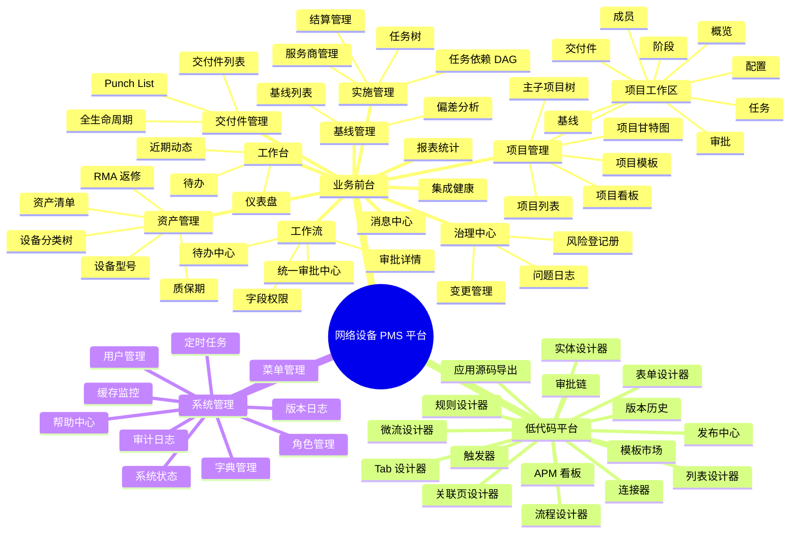

# 网络设备 PMS 平台 UI 设计文档

> **文档编号**：06-UI-UI设计文档
> **版本**：v1.0.0
> **维护团队**：网络设备 PMS 平台研发组
> **最后更新**：2026-07-22
> **关联文档**：`00-PRD`、`02-HLD`、`03-LLD`、`05-API-接口设计文档`

---

## 目录

- [1. 引言](#1-引言)
  - [1.1 编写目的](#11-编写目的)
  - [1.2 读者对象](#12-读者对象)
  - [1.3 文档范围](#13-文档范围)
  - [1.4 术语与缩写](#14-术语与缩写)
  - [1.5 参考标准](#15-参考标准)
- [2. 设计规范](#2-设计规范)
  - [2.1 设计原则](#21-设计原则)
  - [2.2 配色系统](#22-配色系统)
  - [2.3 字体系统](#23-字体系统)
  - [2.4 间距系统](#24-间距系统)
  - [2.5 圆角与阴影](#25-圆角与阴影)
  - [2.6 组件规范](#26-组件规范)
  - [2.7 图标系统](#27-图标系统)
  - [2.8 响应式断点](#28-响应式断点)
  - [2.9 动效规范](#29-动效规范)
- [3. 信息架构](#3-信息架构)
  - [3.1 全局信息架构](#31-全局信息架构)
  - [3.2 导航结构](#32-导航结构)
  - [3.3 路由层级](#33-路由层级)
- [4. 核心页面设计](#4-核心页面设计)
  - [4.1 登录页](#41-登录页)
  - [4.2 工作台/仪表盘](#42-工作台仪表盘)
  - [4.3 项目列表](#43-项目列表)
  - [4.4 项目工作区枢纽页](#44-项目工作区枢纽页)
  - [4.5 任务依赖 DAG](#45-任务依赖-dag)
  - [4.6 计划基线偏差分析](#46-计划基线偏差分析)
  - [4.7 交付件全生命周期](#47-交付件全生命周期)
  - [4.8 统一审批中心](#48-统一审批中心)
  - [4.9 风险登记册](#49-风险登记册)
  - [4.10 低代码实体设计器](#410-低代码实体设计器)
  - [4.11 低代码微流设计器](#411-低代码微流设计器)
  - [4.12 系统管理-用户管理](#412-系统管理-用户管理)
- [5. 交互规范](#5-交互规范)
  - [5.1 表单交互](#51-表单交互)
  - [5.2 列表交互](#52-列表交互)
  - [5.3 弹窗交互](#53-弹窗交互)
  - [5.4 反馈规范](#54-反馈规范)
  - [5.5 加载状态](#55-加载状态)
  - [5.6 空状态](#56-空状态)
  - [5.7 危险操作确认](#57-危险操作确认)
  - [5.8 拖拽与排序](#58-拖拽与排序)
- [6. 前端架构](#6-前端架构)
  - [6.1 技术栈](#61-技术栈)
  - [6.2 目录结构](#62-目录结构)
  - [6.3 Vue 3 SFC 与 Composition API 规范](#63-vue-3-sfc-与-composition-api-规范)
  - [6.4 状态管理 Pinia](#64-状态管理-pinia)
  - [6.5 Axios 请求封装与拦截器](#65-axios-请求封装与拦截器)
  - [6.6 路由与守卫](#66-路由与守卫)
  - [6.7 v-permission 权限指令](#67-v-permission-权限指令)
  - [6.8 useDict 字典钩子](#68-usedict-字典钩子)
  - [6.9 设计令牌](#69-设计令牌)
  - [6.10 低代码组件 SDK](#610-低代码组件-sdk)
- [7. 附录](#7-附录)
  - [附录 A：业务状态色速查](#附录-a业务状态色速查)
  - [附录 B：核心组件清单](#附录-b核心组件清单)
  - [附录 C：路由清单](#附录-c路由清单)
  - [修订记录](#修订记录)

---

## 1. 引言

### 1.1 编写目的

本文档定义网络设备工程项目管理系统（PMS，Project Management System）前端用户界面的设计规范、信息架构、核心页面布局与前端工程架构，旨在：

1. **统一视觉语言**：将配色、字体、间距、圆角、阴影、动效等设计要素收敛为可复用的设计令牌（Design Tokens），消除各页面"风格漂移"。
2. **沉淀交互模式**：为表单、列表、弹窗、加载、空状态、危险操作确认等高频交互场景提供一致的处理范式，降低用户学习成本。
3. **约束页面布局**：通过 ASCII 线框图与交互说明，明确 12 个核心页面的结构、关键组件与状态流转，作为前端工程师实现 `src/views/*` 的施工蓝图。
4. **规范工程实现**：约定 Vue 3 SFC + Composition API + Pinia + Axios 拦截器 + 路由守卫 + `v-permission` 指令 + `useDict` 字典钩子的落地方式，确保代码风格统一、可维护。
5. **桥接设计与开发**：设计令牌同时以 SCSS 变量与 `:root --pms-*` CSS 自定义属性两种形式存在，既支撑组件库内部样式，也允许运行时主题切换。

### 1.2 读者对象

| 角色 | 关注重点 |
|------|----------|
| UI/UX 设计师 | 配色系统、字体、间距、组件规范、页面线框图 |
| 前端开发工程师 | Vue 3 SFC 规范、Pinia store、Axios 拦截器、路由守卫、`v-permission`、`useDict`、设计令牌 |
| 后端开发工程师 | 字段命名对齐、状态枚举值、字典 dictType、权限码与按钮可见性映射 |
| 测试工程师 | 页面状态色映射、交互规范、空状态/加载态/错误态用例 |
| 产品经理 | 信息架构、导航结构、页面流转、业务状态机可视化 |
| 低代码平台用户 | 低代码设计器（实体/微流/流程/规则）交互模式 |

### 1.3 文档范围

本文档覆盖 `pms-frontend` 模块（Vue 3.5 + TypeScript 6 + Vite 8 + Element Plus 2.14 单页应用）的全部面向用户的浏览器交互，包括：

- **业务前台**：登录、工作台、项目列表、项目工作区枢纽页（8 Tab）、任务依赖 DAG、计划基线偏差、交付件全生命周期、统一审批中心、风险登记册等。
- **低代码平台前台**：实体设计器、微流设计器、BPMN 流程设计器、规则设计器、连接器配置、发布中心、版本历史、模板市场、APM 看板。
- **系统管理控制台**：用户 / 角色 / 菜单 / 字典 / 缓存 / 定时任务 / 审计日志 / 系统状态 / 集成健康。

文档共定义 **12 个核心页面**，每页提供 ASCII 布局图、交互说明、关键组件清单与状态色映射；并附 8 大交互规范、10 节前端工程架构说明。

### 1.4 术语与缩写

| 术语 | 全称 | 说明 |
|------|------|------|
| PMS | Project Management System | 网络设备工程项目管理系统 |
| SFC | Single File Component | Vue 单文件组件（`.vue`） |
| SPA | Single Page Application | 单页应用 |
| Pinia | — | Vue 3 官方推荐的状态管理库 |
| Element Plus | — | 基于 Vue 3 的桌面端组件库 |
| AntV X6/G6 | — | 蚂蚁集团开源的图编辑/图可视化引擎 |
| bpmn-js | — | BPMN 2.0 流程图编辑器内核 |
| Monaco | — | VS Code 同源代码编辑器 |
| PPDIOO | Prepare/Plan/Design/Implement/Operate/Optimize | Cisco 网络生命周期方法论 |
| DAG | Directed Acyclic Graph | 有向无环图（任务依赖关系） |
| RBAC | Role-Based Access Control | 基于角色的访问控制 |
| SDK | Software Development Kit | 低代码组件软件开发包 |
| PWA | Progressive Web App | 渐进式 Web 应用 |
| STOMP | Simple Text Oriented Messaging Protocol | 简单文本消息协议 |
| APM | Application Performance Monitoring | 应用性能监控 |
| Design Token | — | 设计令牌（设计变量的命名键值对） |

### 1.5 参考标准

- Element Plus 2.14 设计规范
- WCAG 2.1 AA 无障碍标准（对比度 ≥ 4.5:1）
- Google Material Design 3 间距与 elevation 参考
- Ant Design 5.x 表单与列表交互范式
- PMBOK 第 7 版 — 项目管理知识体系指南
- ISO/IEC 25010 — 软件产品质量模型

---

## 2. 设计规范

### 2.1 设计原则

平台 UI 设计遵循以下五条核心原则，所有页面与组件落地时均以此为评审准绳：

1. **一致性（Consistency）**：相同语义的元素在全局使用相同的颜色、字体、间距、组件形态。例如所有"危险操作"按钮统一为红色 `#F56C6C`，所有"成功状态"标签统一为绿色 `#67C23A`。
2. **反馈即时性（Immediate Feedback）**：用户任何操作（点击、提交、删除）均需在 200ms 内给出视觉反馈（loading、toast、按钮态变化）；耗时操作（> 500ms）必须显示进度指示器。
3. **层级清晰（Clear Hierarchy）**：通过字号、字重、颜色、留白建立信息层级。主标题 18px/600、次级标题 14px/600、正文 14px/400、辅助说明 12px/400。
4. **状态可感知（State Perceptibility）**：所有业务对象的状态（项目 11 态、任务 7 态、资产 9 态、交付件 7 态等）必须以颜色标签 + 文字双重编码，避免色盲用户无法识别。
5. **克制装饰（Restrained Decoration）**：摒弃多余阴影、渐变、动效；仅在需要引导视线或表达状态变化时使用动效。卡片阴影统一为 `0 2px 8px rgba(0,0,0,0.08)`。

### 2.2 配色系统

#### 2.2.1 主题色（Primary）

平台以 Element Plus 默认主题色 `#409EFF`（蓝色）作为主品牌色，覆盖主要按钮、链接、选中态、激活态、进度条等场景。

| 角色 | 色值 | 用途 |
|------|------|------|
| Primary | `#409EFF` | 主按钮、链接、Tab 激活、选中行、进度条 |
| Primary Hover | `#66B1FF` | 主按钮 hover |
| Primary Active | `#3A8EE6` | 主按钮 active |
| Primary Light-3 | `#79BBFF` | 浅色辅助 |
| Primary Light-5 | `#A0CFFF` | 信息提示背景 |
| Primary Light-7 | `#C6E2FF` | 选中行浅背景 |
| Primary Light-9 | `#ECF5FF` | 信息标签背景 |
| Primary Dark-2 | `#337ECC` | 文字链接 hover |

#### 2.2.2 功能色（Functional）

平台采用 5 色功能色体系，分别对应成功、警告、危险、信息、特殊提示：

| 角色 | 色值 | 语义 | 典型场景 |
|------|------|------|----------|
| Success | `#67C23A` | 成功 / 完成 / 正常 | 操作成功 toast、已完成项目标签、健康检查通过 |
| Warning | `#E6A23C` | 警告 / 待处理 / 临近到期 | 质保即将到期、任务临近截止、基线轻度偏差 |
| Danger | `#F56C6C` | 危险 / 失败 / 错误 / 删除 | 操作失败 toast、删除按钮、高风险风险、循环依赖报错 |
| Info | `#909399` | 中性 / 灰色 / 禁用 | 已关闭项目、已取消任务、辅助说明文字、禁用按钮 |
| Special | `#9B59B6` | 特殊提示 / 高优先级 | P0 优先级任务、CCB 审批中、紧急变更 |

#### 2.2.3 中性色（Neutral）

中性色用于文字、边框、背景、分隔线等基础视觉元素：

| 角色 | 色值 | 用途 |
|------|------|------|
| 文字主色 | `#303133` | 一级标题、正文主文字 |
| 文字常规 | `#606266` | 二级文字、表格内容 |
| 文字次要 | `#909399` | 三级文字、辅助说明、占位符 |
| 文字占位 | `#C0C4CC` | 输入框 placeholder、禁用文字 |
| 边框基色 | `#DCDFE6` | 默认边框 |
| 边框浅色 | `#E4E7ED` | 分隔线、卡片边框 |
| 边框更浅 | `#EBEEF5` | 表格行分隔线 |
| 背景基色 | `#F2F6FC` | 页面背景、卡片悬浮态 |
| 背景浅色 | `#F5F7FA` | 表格表头、侧边栏背景 |
| 背景白色 | `#FFFFFF` | 卡片背景、弹窗背景 |

#### 2.2.4 业务状态色映射

平台业务对象状态繁多，需统一映射到功能色 + 浅色背景的"标签"形态。下表为各核心状态机的状态色速查，所有页面渲染状态标签时必须严格遵循。

**项目状态机（11 态）**

| 状态值 | 中文 | 标签色 | 标签背景 | 说明 |
|--------|------|--------|----------|------|
| `DRAFT` | 草稿 | Info `#909399` | `#F4F4F5` | 新建未提交 |
| `PENDING_APPROVAL` | 待审批 | Warning `#E6A23C` | `#FDF6EC` | 提交审批中 |
| `APPROVED` | 已立项 | Primary `#409EFF` | `#ECF5FF` | 审批通过 |
| `IN_PROGRESS` | 进行中 | Primary `#409EFF` | `#ECF5FF` | 实施阶段 |
| `PAUSED` | 已暂停 | Warning `#E6A23C` | `#FDF6EC` | 主动暂停 |
| `COMPLETED` | 已完成 | Success `#67C23A` | `#F0F9EB` | 终验通过 |
| `CLOSED` | 已关闭 | Info `#909399` | `#F4F4F5` | 归档关闭 |
| `CANCELLED` | 已取消 | Info `#909399` | `#F4F4F5` | 取消立项 |
| `REJECTED` | 已驳回 | Danger `#F56C6C` | `#FEF0F0` | 审批驳回 |
| `TERMINATED` | 已终止 | Danger `#F56C6C` | `#FEF0F0` | 异常终止 |
| `ON_HOLD` | 挂起 | Warning `#E6A23C` | `#FDF6EC` | 资源等待 |

**阶段状态机（4 态）**

| 状态值 | 中文 | 标签色 | 标签背景 |
|--------|------|--------|----------|
| `NOT_STARTED` | 未开始 | Info `#909399` | `#F4F4F5` |
| `IN_PROGRESS` | 进行中 | Primary `#409EFF` | `#ECF5FF` |
| `COMPLETED` | 已完成 | Success `#67C23A` | `#F0F9EB` |
| `BLOCKED` | 阻塞 | Danger `#F56C6C` | `#FEF0F0` |

**任务状态机（7 态）**

| 状态值 | 中文 | 标签色 | 标签背景 |
|--------|------|--------|----------|
| `PENDING` | 待受理 | Info `#909399` | `#F4F4F5` |
| `ASSIGNED` | 已分配 | Primary `#409EFF` | `#ECF5FF` |
| `IN_PROGRESS` | 进行中 | Primary `#409EFF` | `#ECF5FF` |
| `COMPLETED` | 已完成 | Success `#67C23A` | `#F0F9EB` |
| `VERIFIED` | 已验证 | Success `#67C23A` | `#F0F9EB` |
| `REJECTED` | 已驳回 | Danger `#F56C6C` | `#FEF0F0` |
| `CANCELLED` | 已取消 | Info `#909399` | `#F4F4F5` |

**资产状态机（9 态）**

| 状态值 | 中文 | 标签色 | 标签背景 |
|--------|------|--------|----------|
| `IN_STOCK` | 在库 | Success `#67C23A` | `#F0F9EB` |
| `ALLOCATED` | 已分配 | Primary `#409EFF` | `#ECF5FF` |
| `IN_TRANSIT` | 调拨中 | Warning `#E6A23C` | `#FDF6EC` |
| `INSTALLED` | 已安装 | Primary `#409EFF` | `#ECF5FF` |
| `IN_REPAIR` | 维修中 | Warning `#E6A23C` | `#FDF6EC` |
| `SCRAPPED` | 已报废 | Danger `#F56C6C` | `#FEF0F0` |
| `LOST` | 丢失 | Danger `#F56C6C` | `#FEF0F0` |
| `RETIRED` | 退役 | Info `#909399` | `#F4F4F5` |
| `RESERVED` | 已预留 | Special `#9B59B6` | `#F3E8F9` |

**交付件状态机（7 态）**

| 状态值 | 中文 | 标签色 | 标签背景 |
|--------|------|--------|----------|
| `DRAFT` | 草稿 | Info `#909399` | `#F4F4F5` |
| `SUBMITTED` | 已提交 | Warning `#E6A23C` | `#FDF6EC` |
| `UNDER_REVIEW` | 审核中 | Primary `#409EFF` | `#ECF5FF` |
| `REVIEWED` | 已审核 | Primary `#409EFF` | `#ECF5FF` |
| `SIGNED` | 已签署 | Success `#67C23A` | `#F0F9EB` |
| `ARCHIVED` | 已归档 | Info `#909399` | `#F4F4F5` |
| `REJECTED` | 已驳回 | Danger `#F56C6C` | `#FEF0F0` |

**变更请求状态机（6 态）**

| 状态值 | 中文 | 标签色 | 标签背景 |
|--------|------|--------|----------|
| `SUBMITTED` | 已提交 | Warning `#E6A23C` | `#FDF6EC` |
| `UNDER_REVIEW` | 评审中 | Primary `#409EFF` | `#ECF5FF` |
| `CCB_APPROVED` | CCB 通过 | Success `#67C23A` | `#F0F9EB` |
| `CCB_REJECTED` | CCB 驳回 | Danger `#F56C6C` | `#FEF0F0` |
| `IMPLEMENTING` | 实施中 | Primary `#409EFF` | `#ECF5FF` |
| `CLOSED` | 已关闭 | Info `#909399` | `#F4F4F5` |

**风险状态机（4 态）**

| 状态值 | 中文 | 标签色 | 标签背景 |
|--------|------|--------|----------|
| `OPEN` | 打开 | Warning `#E6A23C` | `#FDF6EC` |
| `IN_PROGRESS` | 处理中 | Primary `#409EFF` | `#ECF5FF` |
| `CLOSED` | 已关闭 | Success `#67C23A` | `#F0F9EB` |
| `ESCALATED` | 已升级 | Danger `#F56C6C` | `#FEF0F0` |

**问题状态机（4 态）**

| 状态值 | 中文 | 标签色 | 标签背景 |
|--------|------|--------|----------|
| `OPEN` | 打开 | Danger `#F56C6C` | `#FEF0F0` |
| `IN_PROGRESS` | 处理中 | Primary `#409EFF` | `#ECF5FF` |
| `RESOLVED` | 已解决 | Success `#67C23A` | `#F0F9EB` |
| `CLOSED` | 已关闭 | Info `#909399` | `#F4F4F5` |

**风险优先级色（5×5 风险矩阵）**

| 优先级区间 | score | 标签色 | 标签背景 |
|-----------|-------|--------|----------|
| LOW | 1-6 | Success `#67C23A` | `#F0F9EB` |
| MEDIUM | 7-12 | Warning `#E6A23C` | `#FDF6EC` |
| HIGH | 13-25 | Danger `#F56C6C` | `#FEF0F0` |

**审批状态（5 态）**

| 状态值 | 中文 | 标签色 | 标签背景 |
|--------|------|--------|----------|
| `PENDING` | 待审批 | Warning `#E6A23C` | `#FDF6EC` |
| `APPROVED` | 已通过 | Success `#67C23A` | `#F0F9EB` |
| `REJECTED` | 已驳回 | Danger `#F56C6C` | `#FEF0F0` |
| `CANCELLED` | 已撤销 | Info `#909399` | `#F4F4F5` |
| `DELEGATED` | 已转办 | Primary `#409EFF` | `#ECF5FF` |

### 2.3 字体系统

平台字体系统遵循"统一字族 + 5 级字号 + 3 级字重"的极简约定。

#### 2.3.1 字族

```css
font-family: -apple-system, BlinkMacSystemFont, "Segoe UI", Roboto,
  "Helvetica Neue", "PingFang SC", "Hiragino Sans GB", "Microsoft YaHei",
  "微软雅黑", Arial, sans-serif;
```

代码与等宽场景（Monaco Editor、JSON 预览、SQL 展示）使用：

```css
font-family: "JetBrains Mono", "Fira Code", Consolas, "Courier New", monospace;
```

#### 2.3.2 字号层级

| 层级 | 字号 | 行高 | 字重 | 用途 |
|------|------|------|------|------|
| Display | 24px | 32px | 600 | 仪表盘大数字、登录页标题 |
| H1 | 20px | 28px | 600 | 页面主标题（页面顶栏） |
| H2 | 18px | 26px | 600 | 卡片标题、弹窗标题 |
| H3 | 16px | 24px | 600 | 区块标题、Tab 标题 |
| Body | 14px | 22px | 400 | 正文、表格、表单 |
| Caption | 12px | 20px | 400 | 辅助说明、时间戳、标签 |

#### 2.3.3 字重

平台仅使用 3 级字重，避免视觉杂乱：

- `400` Regular：正文默认
- `500` Medium：表格表头、按钮文字、强调正文
- `600` Semibold：标题、关键数字

### 2.4 间距系统

平台采用 **8 倍数基础栅格**，但保留 4px 作为最小步进，以适配紧凑型表格与表单。常用间距取值严格限定为以下 6 档：

| Token | 值 | 用途 |
|-------|----|------|
| `--pms-spacing-xs` | 4px | 图标与文字间距、标签内边距微调 |
| `--pms-spacing-sm` | 8px | 按钮内边距、表单项间距、卡片内边距 |
| `--pms-spacing-md` | 12px | 表单分组间距、列表项间距 |
| `--pms-spacing-lg` | 16px | 卡片间距、区块内边距、表格行高 |
| `--pms-spacing-xl` | 24px | 区块间距、卡片外边距 |
| `--pms-spacing-2xl` | 32px | 页面区块大间距、侧边栏宽度基准 |

**应用示例**：
- 表单 label 与控件间距：`12px`（`--pms-spacing-md`）
- 卡片内边距：`16px`（`--pms-spacing-lg`）
- 卡片之间间距：`24px`（`--pms-spacing-xl`）
- 表格单元格上下内边距：`8px`（`--pms-spacing-sm`）
- 页面顶栏高度：`56px`（7 × 8px）
- 侧边栏宽度：`210px`（折叠态 `64px`）

### 2.5 圆角与阴影

#### 2.5.1 圆角

| Token | 值 | 用途 |
|-------|----|------|
| `--pms-radius-sm` | 2px | 标签、小按钮 |
| `--pms-radius-md` | 4px | 按钮、输入框、下拉、表格单元格 |
| `--pms-radius-lg` | 8px | 卡片、弹窗、面板 |
| `--pms-radius-full` | 9999px | 圆形头像、圆形按钮、徽章 |

#### 2.5.2 阴影

平台仅使用 3 级阴影，避免视觉过载：

| Token | 值 | 用途 |
|-------|----|------|
| `--pms-shadow-sm` | `0 1px 4px rgba(0,0,0,0.04)` | 卡片默认态、下拉菜单 |
| `--pms-shadow-md` | `0 2px 8px rgba(0,0,0,0.08)` | 卡片 hover、悬浮面板 |
| `--pms-shadow-lg` | `0 4px 16px rgba(0,0,0,0.12)` | 弹窗、抽屉、Popover |

### 2.6 组件规范

平台基于 Element Plus 2.14，以下约定关键组件的统一形态。

#### 2.6.1 按钮

| 类型 | 场景 | 样式 |
|------|------|------|
| Primary | 主操作（保存、提交、审批通过） | 蓝底白字 `#409EFF` |
| Success | 完成类操作（标记完成、验收通过） | 绿底白字 `#67C23A` |
| Warning | 警告类操作（暂停、延期） | 橙底白字 `#E6A23C` |
| Danger | 危险操作（删除、终止、驳回） | 红底白字 `#F56C6C` |
| Default | 次要操作（取消、关闭、重置） | 白底蓝字 + 蓝边框 |
| Text | 链接型操作（查看详情、编辑） | 无边框蓝字 |

**尺寸**：默认 `medium`（高 36px）；表格内操作按钮用 `small`（高 32px）；弹窗底部按钮用 `medium`。

**约定**：每个页面/弹窗**有且仅有一个 Primary 按钮**，其余为 Default 或 Text。

#### 2.6.2 表单

- **label 位置**：默认顶部（`label-position="top"`），筛选项用左侧（`label-position="left"`）。
- **label 宽度**：左侧布局统一 `100px`，超长字段（如"项目描述"）改顶部布局。
- **必填标记**：红色 `*` 在 label 左侧。
- **校验提示**：字段下方红色文字，`12px`。
- **提交防抖**：表单提交按钮在请求未返回前 `loading=true` 禁用，避免重复提交。
- **未保存离开**：表单有未保存改动时，路由跳转/关闭弹窗触发 `ElMessageBox.confirm` 二次确认。

#### 2.6.3 表格

- **斑马纹**：开启 `stripe`，提升长表格可读性。
- **边框**：开启 `border`，单元格分隔清晰。
- **表头背景**：`#F5F7FA`，字重 500。
- **行高**：默认 `48px`，紧凑模式 `40px`。
- **空数据**：自定义 `EmptyState` 组件（图标 + 文案 + 操作按钮）。
- **操作列**：固定右侧（`fixed="right"`），按钮用 Text 类型，超过 3 个折叠为"更多"下拉。
- **分页**：右下角，默认 `[10, 20, 50, 100]`，默认 10 条/页，显示"共 X 条"。

#### 2.6.4 弹窗

| 类型 | 组件 | 用途 |
|------|------|------|
| 对话框 | `ElDialog` | 表单编辑、详情查看、确认操作 |
| 抽屉 | `ElDrawer` | 复杂表单、筛选面板、详情侧滑 |
| 消息提示 | `ElMessage` | 操作反馈（成功/失败/警告） |
| 确认框 | `ElMessageBox.confirm` | 危险操作二次确认 |
| 通知 | `ElNotification` | 异步通知（推送、任务完成） |

**对话框尺寸**：小 `480px`、中 `600px`、大 `800px`、超大 `1000px`。

#### 2.6.5 标签

业务状态统一使用 `ElTag` 渲染，配合状态色映射（见 2.2.4）：

```vue
<el-tag :type="statusConfig.type" effect="light" size="small">
  {{ statusConfig.label }}
</el-tag>
```

**约定**：`effect="light"`（浅色背景 + 实色文字），`size="small"`，圆角 `2px`。

#### 2.6.6 卡片

```vue
<el-card shadow="hover" :body-style="{ padding: '16px' }">
  <template #header>
    <div class="card-header">
      <span class="title">卡片标题</span>
      <el-button text>操作</el-button>
    </div>
  </template>
  <!-- 内容 -->
</el-card>
```

**约定**：`shadow="hover"`（默认无阴影，hover 显示），内边距 `16px`，圆角 `8px`。

### 2.7 图标系统

平台使用 `@element-plus/icons-vue` 2.3.2 作为主图标库，在 `main.ts` 中全局注册。常用图标约定如下：

| 业务场景 | 图标 | 名称 |
|----------|------|------|
| 新增 | ➕ | `Plus` |
| 编辑 | ✏️ | `Edit` |
| 删除 | 🗑️ | `Delete` |
| 查看 | 👁️ | `View` |
| 导出 | ⬇️ | `Download` |
| 导入 | ⬆️ | `Upload` |
| 搜索 | 🔍 | `Search` |
| 刷新 | 🔄 | `Refresh` |
| 筛选 | ⚙️ | `Filter` |
| 项目 | 📁 | `Folder` |
| 任务 | 📋 | `List` |
| 资产 | 💻 | `Monitor` |
| 风险 | ⚠️ | `Warning` |
| 审批 | ✓ | `CircleCheck` |
| 通知 | 🔔 | `Bell` |
| 用户 | 👤 | `User` |
| 设置 | ⚙️ | `Setting` |
| 仪表盘 | 📊 | `DataAnalysis` |

**尺寸约定**：按钮内图标 `16px`，导航图标 `18px`，状态图标 `14px`，配文字时图标与文字间距 `4px`。

### 2.8 响应式断点

平台主要面向桌面端（≥ 1280px），但需兼容主流笔记本（1366×768）与大屏（1920×1080 / 2560×1440）。响应式断点如下：

| 断点 | 宽度范围 | 布局策略 |
|------|----------|----------|
| `xs` | < 768px | 不支持（移动端访问提示"请在 PC 端使用"） |
| `sm` | 768px - 1023px | 侧边栏折叠，单列布局 |
| `md` | 1024px - 1279px | 侧边栏折叠，双列布局 |
| `lg` | 1280px - 1599px | 侧边栏展开（默认），双列布局 |
| `xl` | 1600px - 1919px | 侧边栏展开，三列布局，卡片栅格加密 |
| `2xl` | ≥ 1920px | 侧边栏展开，三列布局，最大内容宽度 `1600px` 居中 |

**栅格**：使用 Element Plus 的 `ElRow` / `ElCol`，默认 24 栅格。仪表盘卡片在 `lg` 用 `:span="6"`（4 列）、`xl` 用 `:span="6"`（4 列），表格页用 `:span="24"` 单列。

### 2.9 动效规范

#### 2.9.1 过渡曲线

平台统一使用以下过渡曲线，避免动效混乱：

| Token | 值 | 用途 |
|-------|----|------|
| `--pms-ease-out` | `cubic-bezier(0.16, 1, 0.3, 1)` | 入场（淡入、上滑） |
| `--pms-ease-in` | `cubic-bezier(0.7, 0, 0.84, 0)` | 离场（淡出、下滑） |
| `--pms-ease-in-out` | `cubic-bezier(0.65, 0, 0.35, 1)` | 状态切换 |

#### 2.9.2 路由切换动画

`App.vue` 中通过 `<router-view v-slot>` + `<transition>` 实现三种路由切换动画：

| 动画名 | 触发场景 | 效果 |
|--------|----------|------|
| `fade-slide-up` | 默认路由切换 | 淡入 + 从下向上滑入 12px |
| `slide-fade-x` | 项目工作区 Tab 切换 | 横向滑动 + 淡入（向右进入） |
| `fade-scale` | 弹窗型页面（详情抽屉） | 淡入 + 轻微缩放（0.96 → 1） |

动画时长统一 `250ms`，由 `meta.transitionName` 控制。

#### 2.9.3 微交互

- 按钮 hover：背景色加深，过渡 `150ms ease-out`
- 卡片 hover：阴影从 `sm` 升级到 `md`，过渡 `200ms ease-out`
- 表格行 hover：背景 `#F5F7FA`，过渡 `100ms`
- 标签出现：淡入 + 轻微缩放，`200ms ease-out`
- Loading：旋转图标 `600ms` 线性无限循环

---

## 3. 信息架构

### 3.1 全局信息架构

平台信息架构以"业务前台 + 低代码平台 + 系统管理"三足鼎立组织，顶层菜单按业务域分组。下图用 mermaid mindmap 描述全局信息架构：



### 3.2 导航结构

平台采用"顶部导航栏 + 左侧菜单栏 + 多标签页"的三栏经典布局：

```
┌─────────────────────────────────────────────────────────────────┐
│  顶部导航栏（56px）                                              │
│  [Logo] 网络设备 PMS    [全局搜索]    [通知🔔] [用户头像▾]        │
├─────────┬───────────────────────────────────────────────────────┤
│         │  多标签页栏（40px，可拖拽排序）                          │
│         │  [工作台 ×] [项目列表 ×] [项目工作区 ×] [+]              │
│ 侧边菜单 ├───────────────────────────────────────────────────────┤
│ （210px │                                                       │
│  折叠    │                                                       │
│  64px）  │            路由出口 <router-view>                      │
│         │                                                       │
│  📊 工作 │            （页面内容区，背景 #F2F6FC）                  │
│  📁 项目 │                                                       │
│  📋 实施 │                                                       │
│  💻 资产 │                                                       │
│  📦 交付 │                                                       │
│  📐 基线 │                                                       │
│  ⚠️ 治理 │                                                       │
│  ✓ 审批 │                                                       │
│  📊 报表 │                                                       │
│  🔧 低代码│                                                       │
│  ⚙️ 系统 │                                                       │
└─────────┴───────────────────────────────────────────────────────┘
```

**侧边菜单**：由 `src/config/menu.ts` 静态配置 + 后端 `GET /api/system/menu` 动态权限过滤后渲染。菜单项支持 `meta.perms` 权限码控制可见性。

**多标签页**：由 Pinia `tags` store 管理，支持拖拽排序、右键关闭（关闭其他/关闭右侧/全部关闭）、`visitedViews` 持久化到 `sessionStorage`。

**全局搜索**：顶部搜索框支持项目编号、项目名称、任务名称、资产 SN 快速检索，回车跳转对应详情页。

**通知铃铛**：显示未读站内通知数量徽章，点击下拉显示最近 5 条，"查看全部"跳转消息中心。

**用户头像下拉**：个人信息、修改密码、切换角色（多角色用户）、退出登录。

### 3.3 路由层级

平台路由配置位于 `src/router/index.ts`，采用 `createWebHistory` + 懒加载（`() => import(...)`）。路由层级与菜单层级一一对应，关键约定：

- 顶级路径：`/dashboard`、`/project`、`/implementation`、`/asset`、`/deliverable`、`/baseline`、`/governance`、`/workflow`、`/report`、`/notification`、`/lowcode`、`/system`
- 详情页：`/path/:id` 形式，如 `/project/workspace/:id`、`/implementation/task/detail/:id`
- 工作区枢纽页：`/project/workspace/:id`，内部 8 Tab 通过子路由或 Tab 组件切换
- 兜底路由：`/:pathMatch(.*)*` 重定向到 `/dashboard`

路由 `meta` 字段约定：

```typescript
interface RouteMeta {
  title: string;            // 页面标题（显示在标签页、浏览器标题）
  icon?: string;            // 菜单图标名
  hidden?: boolean;         // 是否在菜单隐藏（详情页）
  requiresAuth?: boolean;   // 是否需要登录（默认 true）
  perms?: string[];         // 访问所需权限码（路由守卫校验）
  transitionName?: string;  // 路由切换动画名
  keepAlive?: boolean;      // 是否缓存组件实例
}
```

---

## 4. 核心页面设计

本章定义 12 个核心页面的 ASCII 布局图、交互说明与关键组件。所有页面遵循第 2 章设计规范与第 5 章交互规范。

### 4.1 登录页

**路由**：`/login`
**布局**：居中卡片式，左侧品牌展示区 + 右侧登录表单区（≥ 992px 双栏，< 992px 单栏隐藏品牌区）。

```
┌─────────────────────────────────────────────────────────────────┐
│                                                                 │
│  ┌───────────────────────────┬───────────────────────────────┐  │
│  │                           │                               │  │
│  │   品牌展示区              │     登录表单区                  │  │
│  │                           │                               │  │
│  │   [Logo 大图]             │     网络设备 PMS 平台           │  │
│  │                           │     Network Equipment PMS      │  │
│  │   网络设备工程项目管理      │                               │  │
│  │   管理系统                 │     ┌─────────────────────┐    │  │
│  │                           │     │ 👤 用户名            │    │  │
│  │   "PPDIOO 方法论驱动       │     └─────────────────────┘    │  │
│  │    网络工程全生命周期"     │     ┌─────────────────────┐    │  │
│  │                           │     │ 🔒 密码              │    │  │
│  │   [配图：网络拓扑插画]     │     └─────────────────────┘    │  │
│  │                           │     ┌──────────┐ ☑ 记住我      │  │
│  │                           │     │ 验证码    │ 忘记密码？    │  │
│  │                           │     └──────────┘               │  │
│  │                           │                               │  │
│  │                           │     [        登 录        ]    │  │
│  │                           │                               │  │
│  └───────────────────────────┴───────────────────────────────┘  │
│                                                                 │
│   Copyright © 2026 网络设备 PMS 平台  |  v1.0.0                  │
└─────────────────────────────────────────────────────────────────┘
```

**交互说明**：

1. 用户名/密码输入框支持回车提交。
2. 登录按钮请求 `POST /api/auth/login`，成功后 `localStorage.setItem('pms_token', token)`，跳转 `/dashboard`。
3. 连续 5 次失败（后端 `@RateLimit` 触发 429）显示验证码输入框。
4. "记住我"勾选后用户名缓存到 `localStorage`（不缓存密码）。
5. 密码输入框右侧"小眼睛"图标切换明文/密文。
6. 登录请求期间按钮 `loading=true` 禁用，避免重复提交。

**关键组件**：`LoginForm`（含单元测试 `__tests__/index.test.ts`）、`BrandPanel`、`ElForm`、`ElInput`、`ElButton`、`ElCheckbox`。

**状态色**：登录失败 `ElMessage.error` 红色提示；登录成功 `ElMessage.success` 绿色提示后跳转。

### 4.2 工作台/仪表盘

**路由**：`/dashboard`
**布局**：8 指标卡 + 项目趋势图 + 待办列表 + 近期动态，瀑布式上下排列。

```
┌─────────────────────────────────────────────────────────────────┐
│  工作台                                          [刷新] [导出]   │
├─────────────────────────────────────────────────────────────────┤
│  ┌────────┐ ┌────────┐ ┌────────┐ ┌────────┐                   │
│  │📁 项目 │ │⚡ 进行中│ │💻 在库 │ │⏰ 待办 │                   │
│  │  总数  │ │  项目  │ │  资产 │ │  数量 │                   │
│  │  128   │ │   42   │ │ 1,568 │ │   17  │                   │
│  │ ▲ 12%  │ │ ▼ 3%   │ │ ▲ 8%  │ │ ▲ 5   │                   │
│  └────────┘ └────────┘ └────────┘ └────────┘                   │
│  ┌────────┐ ┌────────┐ ┌────────┐ ┌────────┐                   │
│  │📦 月交付│ │🆕 月新 │ │🆕 月新 │ │⚠️ 预警 │                   │
│  │  项目  │ │  项目  │ │  资产 │ │  数量 │                   │
│  │   15   │ │   22   │ │  340  │ │   6   │                   │
│  └────────┘ └────────┘ └────────┘ └────────┘                   │
├─────────────────────────────────────────────────────────────────┤
│  ┌─────────────────────────┬─────────────────────────────────┐ │
│  │ 📈 项目趋势（近 6 月）   │ 📋 待办事项（TOP 5）            │ │
│  │                         │                                 │ │
│  │   ╭─╮                   │  🔴 [P0] 设备调拨审批  今天到期 │ │
│  │  ╱   ╲   ╭─╮           │  🟠 [P1] 终验报告审核  明天到期 │ │
│  │ ╱     ╲ ╱   ╲   ╭─╮    │  🟡 [P2] 阶段闸门确认  3 天后  │ │
│  │        ╲     ╲ ╱   ╲   │  🔵 [P3] 任务进度更新  5 天后  │ │
│  │                ╲     ╲  │  ⚪ [P4] 文档归档     7 天后  │ │
│  │ 1月 2月 3月 4月 5月 6月 │                                 │ │
│  │ ● 发起 ● 完成            │  [查看全部 →]                   │ │
│  └─────────────────────────┴─────────────────────────────────┘ │
├─────────────────────────────────────────────────────────────────┤
│  📢 近期动态                                                    │
│  ┌─────────────────────────────────────────────────────────┐   │
│  │ 👤 张三 提交了 项目「华东区5G核心网升级」的立项审批    2分钟前│   │
│  │ 👤 李四 完成了 任务「核心交换机配置」                  1小时前│   │
│  │ 🔔 系统 资产「SN-AX001234」质保将在 30 天后到期        2小时前│   │
│  │ 👤 王五 创建了 变更请求「CR-2026-0018」                3小时前│   │
│  │ 👤 赵六 审批通过了 交付件「网络拓扑设计文档 v2」       5小时前│   │
│  └─────────────────────────────────────────────────────────┘   │
└─────────────────────────────────────────────────────────────────┘
```

**交互说明**：

1. 8 指标卡来自 `GET /api/report/dashboard-summary`：totalProjects / ongoingProjects / inStockAssets / todoCount / monthlyDelivered / monthlyNewProjects / monthlyNewAssets / alertCount。每张卡片显示数值 + 同比箭头（▲ 绿色上升 / ▼ 红色下降）。
2. 项目趋势图用 ECharts 6 折线图，双线对比"发起数"与"完成数"，悬停显示 tooltip。
3. 待办列表来自 `GET /api/report/todo`，按优先级排序，点击行跳转对应审批/任务详情。
4. 近期动态来自 `GET /api/report/recent-activities`，聚合操作日志与登录日志，时间倒序。
5. "刷新"按钮重新拉取所有数据；"导出"将仪表盘快照导出为 PNG。
6. 指标卡 hover 阴影从 `sm` 升级到 `md`，光标变手型，点击跳转对应模块列表。

**关键组件**：`StatCard`（指标卡）、`ProjectTrendChart`（ECharts 折线）、`TodoList`、`ActivityFeed`、`ElCard`、`ElRow`/`ElCol`。

**状态色**：预警数量 `alertCount > 0` 时卡片角标红色徽章；待办优先级 P0 红、P1 橙、P2 黄、P3 蓝、P4 灰。

### 4.3 项目列表

**路由**：`/project/list`
**布局**：顶部筛选栏 + 操作按钮栏 + 数据表格 + 分页。

```
┌─────────────────────────────────────────────────────────────────┐
│  项目管理                                      [+ 新建项目]     │
├─────────────────────────────────────────────────────────────────┤
│  筛选：[项目编号____] [项目名称____] [状态▾] [类型▾] [PM▾]      │
│        [日期范围________]                  [搜索] [重置]        │
├─────────────────────────────────────────────────────────────────┤
│  [批量审批] [批量导出] [列设置]              共 128 条          │
├──┬──────────┬────────────┬──────┬────┬──────┬───────┬──────────┤
│☐ │ 项目编号 │ 项目名称    │ 状态 │类型│ PM   │ 进度  │ 操作     │
├──┼──────────┼────────────┼──────┼────┼──────┼───────┼──────────┤
│☐ │PRJ-2026  │华东区5G核心│ 进行 │网络│ 张三 │ 65%   │详情 编辑 │
│  │ -0001    │网升级      │ 中   │升级│      │█████░ │审批 删除│
├──┼──────────┼────────────┼──────┼────┼──────┼───────┼──────────┤
│☐ │PRJ-2026  │华南区承载网│ 已立 │新建│ 李四 │ 10%   │详情 编辑 │
│  │ -0002    │扩容        │ 项   │    │      │█░░░░░ │审批 删除│
├──┼──────────┼────────────┼──────┼────┼──────┼───────┼──────────┤
│☐ │PRJ-2026  │华北区数据中心│ 已完 │搬迁│ 王五 │ 100%  │详情 归档│
│  │ -0003    │搬迁        │ 成   │    │      │██████ │         │
└──┴──────────┴────────────┴──────┴────┴──────┴───────┴──────────┘
                                          [< 1 2 3 ... 13 >] 10/页
```

**交互说明**：

1. 筛选栏支持多条件组合查询，提交 `GET /api/project` 携带分页与筛选参数。
2. "新建项目"打开 `ElDialog` 表单，提交 `POST /api/project`（携带 `@Idempotent` 幂等键）。
3. 表格行点击"详情"跳转 `/project/workspace/:id`；"编辑"打开弹窗 `PUT /api/project/{id}`。
4. "审批"按钮仅 `DRAFT` 状态显示，触发 `POST /api/project/{id}/submit` 提交审批。
5. "删除"为危险操作，`ElMessageBox.confirm` 二次确认后 `DELETE /api/project/{id}`。
6. 进度列用 `ElProgress` 条形进度条，颜色随进度变化（< 50% 蓝、50-99% 蓝、100% 绿）。
7. 状态列按 2.2.4 项目状态色映射渲染 `ElTag`。
8. 批量勾选后"批量审批"对选中 `DRAFT` 项目批量提交；"批量导出"调用 `GET /api/project/export` 流式下载 Excel。
9. "列设置"打开抽屉，用户可自定义显示列、列顺序、列宽，配置缓存到 `localStorage`。

**关键组件**：`ProjectFilter`、`ProjectTable`、`ProjectFormDialog`、`ElTable`、`ElPagination`、`ElProgress`、`ElTag`、`ElCheckbox`。

### 4.4 项目工作区枢纽页

**路由**：`/project/workspace/:id`
**布局**：顶部项目信息头 + 8 Tab 内容区，是整个项目管理的枢纽。

```
┌─────────────────────────────────────────────────────────────────┐
│  ← 返回   PRJ-2026-0001 华东区5G核心网升级                      │
│           [进行中] [网络升级]  PM: 张三  进度: 65% ████░         │
│           计划: 2026-01-15 ~ 2026-06-30   [⋯ 更多操作]          │
├─────────────────────────────────────────────────────────────────┤
│  [概览] [阶段] [任务] [交付件] [基线] [审批] [成员] [配置]       │
├─────────────────────────────────────────────────────────────────┤
│                                                                 │
│  ┌─── 概览 Tab ──────────────────────────────────────────────┐  │
│  │                                                            │  │
│  │  ┌────────────┐ ┌────────────┐ ┌────────────┐ ┌─────────┐│  │
│  │  │阶段进度    │ │任务完成率  │ │交付件签署  │ │预算执行 ││  │
│  │  │ 4/6 完成   │ │ 42/65 65%  │ │ 12/18 67% │ │ ¥320万 ││  │
│  │  └────────────┘ └────────────┘ └────────────┘ └─────────┘│  │
│  │                                                            │  │
│  │  ┌─ 项目基本信息 ────────┬─ 关键里程碑 ──────────────────┐ │  │
│  │  │ 项目编号: PRJ-2026...│ ✅ 立项审批     2026-01-15     │ │  │
│  │  │ 项目类型: 网络升级   │ ✅ 方案设计评审  2026-02-20     │ │  │
│  │  │ 客户:     XX 电信    │ ✅ 设备到货     2026-03-10     │ │  │
│  │  │ 项目经理: 张三       │ 🔄 割接上线     2026-05-15 进行 │ │  │
│  │  │ 计划开始: 2026-01-15 │ ⏳ 终验         2026-06-20 待   │ │  │
│  │  │ 计划结束: 2026-06-30 │ ⏳ 项目关闭     2026-06-30 待   │ │  │
│  │  └──────────────────────┴────────────────────────────────┘ │  │
│  │                                                            │  │
│  │  ┌─ 近期活动 ────────────────────────────────────────────┐ │  │
│  │  │ 👤 张三 创建了阶段「实施部署」        2026-03-15 14:30 │ │  │
│  │  │ 👤 李四 完成了任务「交换机配置」      2026-03-14 16:20 │ │  │
│  │  │ 📦 王五 上传了交付件「割接方案 v2」   2026-03-13 10:15 │ │  │
│  │  └────────────────────────────────────────────────────────┘ │  │
│  └────────────────────────────────────────────────────────────┘  │
└─────────────────────────────────────────────────────────────────┘
```

**8 Tab 说明**：

| Tab | 内容 | 数据来源 |
|-----|------|----------|
| 概览 | 项目基本信息 + 4 指标卡 + 关键里程碑 + 近期活动 | `GET /api/project/{id}` + 多接口聚合 |
| 阶段 | 阶段列表 + 阶段退出闸门编辑器（`PhaseExitGateEditor`） | `GET /api/project/phase/project/{id}` |
| 任务 | 任务树（`TaskTree` 递归渲染 `taskPath`）+ 任务依赖图入口 | `GET /api/implementation/task/tree?projectId=` |
| 交付件 | 交付件列表 + 全生命周期视图入口 | `GET /api/deliverable?projectId=` |
| 基线 | 基线列表 + 偏差分析入口 | `GET /api/baseline?projectId=` |
| 审批 | 项目相关审批记录列表 | `GET /api/approval-center?businessId=` |
| 成员 | 项目成员列表 + 角色分配 | `GET /api/project/member?projectId=` |
| 配置 | 项目级配置项（`ProjectConfig`） | `GET /api/project/config/{id}` |

**交互说明**：

1. 顶部信息头展示项目编号、名称、状态标签、类型、PM、进度条、计划周期，"更多操作"下拉含"关闭项目""取消项目""导出项目档案"等。
2. Tab 切换使用 `slide-fade-x` 横向滑动动画，状态由 URL query `?tab=` 同步（支持浏览器前进后退）。
3. 概览 Tab 的 4 指标卡点击跳转对应 Tab。
4. 阶段 Tab 中阶段卡片显示进度，点击展开退出闸门条件（DELIVERABLE/MILESTONE/TASK/APPROVAL 4 类）。
5. 任务 Tab 默认显示树形列表，可切换到"依赖图视图"跳转 `/implementation/task/dependency/:projectId`。
6. 交付件 Tab 每行显示状态标签（7 态），点击跳转 `/deliverable/detail/:id`。
7. 审批 Tab 显示该项目关联的所有审批记录（立项审批、阶段闸门、变更审批、终验审批等），状态色按 2.2.4 审批状态映射。
8. 成员 Tab 支持添加/移除成员、分配项目角色（项目经理、技术负责人、实施工程师等）。
9. 配置 Tab 编辑项目级配置（是否启用基线监控、偏差阈值、提醒规则等）。

**关键组件**：`ProjectWorkspaceLayout`、`ProjectHeader`、`ProjectOverview`、`PhaseList`、`PhaseExitGateEditor`、`TaskTree`、`DeliverableList`、`BaselineList`、`ApprovalList`、`ProjectMemberList`、`ProjectConfigForm`、`ElTabs`、`ElTabPane`。

### 4.5 任务依赖 DAG

**路由**：`/implementation/task/dependency/:projectId`
**布局**：全屏图编辑画布 + 右侧节点详情面板 + 顶部工具栏。

```
┌─────────────────────────────────────────────────────────────────┐
│  任务依赖关系图 - PRJ-2026-0001     [自动布局] [导出PNG] [全屏]  │
│        [FS ▾] [显示标签 ▾] [缩放: 100% - +]   🔍 搜索任务        │
├──────────────────────────────────────────────┬──────────────────┤
│                                              │  节点详情        │
│        ┌─────────┐                          │                  │
│        │ T1 现场勘│                          │  T3 交换机配置   │
│        │ 测 ✅    │                          │  [进行中]        │
│        └────┬────┘                          │                  │
│             │ FS                             │  编号: T-0003    │
│             ▼                                │  负责人: 李四    │
│        ┌─────────┐    FS    ┌─────────┐     │  计划: 03-10~03-20│
│        │ T2 方案设│────────▶│ T3 交换机│     │  实际: 03-11~    │
│        │ 计 ✅    │         │ 配置 🔄  │     │  进度: 60%       │
│        └─────────┘         └────┬────┘     │  前置: T2(FF)    │
│                                  │          │  后置: T4(FS)    │
│                                  ▼          │                  │
│                             ┌─────────┐     │  [编辑] [删除]   │
│                             │ T4 割接 │     │  [查看详情]      │
│                             │ 上线 ⏳  │     │                  │
│                             └─────────┘     │                  │
│                                              │                  │
│   图例: ✅已完成 🔵进行中 ⏳待开始 ⚠️阻塞    │                  │
│         FS=完成-开始 FF=完成-完成            │                  │
│         SS=开始-开始 SF=开始-完成            │                  │
├──────────────────────────────────────────────┴──────────────────┤
│  ⚠️ 检测到循环依赖: T3 → T4 → T3  [查看路径] [自动修复]         │
└─────────────────────────────────────────────────────────────────┘
```

**交互说明**：

1. 使用 AntV G6 5 渲染 DAG，节点为圆角矩形，按状态着色（已完成绿、进行中蓝、待开始灰、阻塞红）。
2. 节点间连线标注依赖类型（FS/FF/SS/SF），鼠标悬停高亮关联路径。
3. 点击节点右侧面板显示详情，支持编辑依赖关系。
4. 拖拽节点可调整位置，"自动布局"按钮触发 Dagre 层次布局算法重排。
5. 创建依赖：从源节点右侧锚点拖拽到目标节点左侧锚点，弹窗选择依赖类型。
6. 后端 `POST /api/implementation/task-dependency` 时执行 DFS 循环检测，若检测到返回 `code=1006 CycleDetectedException`，底部红色提示条显示循环路径。
7. "导出 PNG"将画布导出为图片；"全屏"进入沉浸模式。
8. 顶部"FS ▾"下拉可过滤显示特定依赖类型；"显示标签 ▾"控制连线标签显隐。
9. 缩放控件支持滚轮缩放 + 拖拽平移，缩放范围 25%-400%。

**关键组件**：`DependencyGraph`（AntV G6 封装）、`NodeDetailPanel`、`DependencyTypeDialog`、`CycleDetectorBanner`、`ElToolbar`、`ElSlider`。

**状态色**：节点边框按任务状态色（见 2.2.4 任务状态机）；循环依赖提示条红色 `#F56C6C` 背景。

### 4.6 计划基线偏差分析

**路由**：`/baseline/diff/:baselineId`
**布局**：顶部基线信息头 + 三阈值偏差汇总卡 + 偏差明细表格 + 趋势图。

```
┌─────────────────────────────────────────────────────────────────┐
│  ← 返回  基线 BL-2026-0001 v1.0  PRJ-2026-0001                  │
│           快照时间: 2026-01-20  快照人: 张三  状态: [已批准]    │
├─────────────────────────────────────────────────────────────────┤
│  ┌── 天数偏差 ──────┐ ┌── 百分比偏差 ────┐ ┌── 任务数偏差 ────┐ │
│  │   +5 天          │ │    +8.2%         │ │   3 / 65          │ │
│  │   🟡 轻度偏差    │ │   🟡 轻度偏差    │ │   🟢 正常         │ │
│  │   阈值: ±7天     │ │   阈值: ±10%     │ │   阈值: ±5 个     │ │
│  └──────────────────┘ └──────────────────┘ └──────────────────┘ │
├─────────────────────────────────────────────────────────────────┤
│  📈 偏差趋势（近 4 周）                                         │
│  ┌────────────────────────────────────────────────────────────┐ │
│  │   +10│         ╭╮                                          │ │
│  │    +5│      ╭─╯╰╮    ╭─                                    │ │
│  │     0├──────╯    ╰──╯  ───── 基准                          │ │
│  │    -5│                                                    │ │
│  │      └──────────────────────────────                       │ │
│  │       W1   W2   W3   W4                                    │ │
│  └────────────────────────────────────────────────────────────┘ │
├─────────────────────────────────────────────────────────────────┤
│  偏差明细                                                       │
│  ┌──────────┬──────────┬──────────┬──────┬──────┬────────────┐  │
│  │ 任务     │ 基线计划 │ 当前实际 │ 偏差 │ 状态 │ 触发阈值    │  │
│  ├──────────┼──────────┼──────────┼──────┼──────┼────────────┤  │
│  │ T3 交换机│ 03-10~20 │ 03-11~25 │ +5天 │ 🟡   │ 天数阈值    │  │
│  │ 配置     │          │          │      │      │             │  │
│  │ T5 链路  │ 03-25~30 │ 03-28~   │ +3天 │ 🟢   │ —           │  │
│  │ 测试     │          │ 04-01    │      │      │             │  │
│  │ T7 文档  │ 04-05~10 │ 04-05~12 │ +2天 │ 🟢   │ —           │  │
│  │ 归档     │          │          │      │      │             │  │
│  └──────────┴──────────┴──────────┴──────┴──────┴────────────┘  │
└─────────────────────────────────────────────────────────────────┘
```

**交互说明**：

1. 三阈值偏差汇总卡分别展示天数偏差、百分比偏差、任务数偏差，每张卡显示当前值 + 阈值 + 状态色（绿正常 / 黄轻度 / 红严重）。三阈值任一触发即整体标红。
2. 偏差趋势图用 ECharts 折线，横轴为周，纵轴为天数偏差，基准线为 0，超出阈值区域用红色背景带。
3. 偏差明细表格按偏差绝对值降序，状态列 🟢 正常 / 🟡 轻度 / 🔴 严重。
4. 行点击展开任务详情抽屉，显示基线快照与当前实际对比（开始/结束/工期/负责人）。
5. 顶部"导出偏差报告"生成 PDF，含三阈值汇总、趋势图、明细表。
6. 严重偏差任务行右侧显示"创建变更请求"按钮，跳转 `/change-request` 并预填关联任务与偏差数据。

**关键组件**：`BaselineHeader`、`DeviationSummaryCard`、`DeviationTrendChart`（ECharts）、`BaselineDiffTable`、`TaskDiffDrawer`、`ElTable`、`ElTag`。

**状态色**：偏差 🟢 `< 轻度阈值`、🟡 `轻度 ~ 严重阈值`、🔴 `> 严重阈值`。

### 4.7 交付件全生命周期

**路由**：`/deliverable/lifecycle`
**布局**：左侧交付件列表 + 右侧生命周期状态流转图 + 签名/版本面板。

```
┌─────────────────────────────────────────────────────────────────┐
│  交付件全生命周期                              [+ 新建交付件]    │
├──────────────────────────┬──────────────────────────────────────┤
│  交付件列表              │  网络拓扑设计文档 v2                  │
│  🔍 [搜索____]           │  [已签署]  归属: PRJ-2026-0001        │
│  ┌────────────────────┐  │                                       │
│  │ 📄 网络拓扑设计 v2 │◀─│  生命周期流转:                        │
│  │    [已签署] 67%    │  │  草稿 → 已提交 → 审核中 → 已审核      │
│  ├────────────────────┤  │   │       │        │        │        │
│  │ 📄 割接方案 v1     │  │   ↓       ↓        ↓        ↓        │
│  │    [审核中] 43%    │  │  ┌──┐  ┌──┐  ┌──┐  ┌──┐  ┌──┐       │
│  ├────────────────────┤  │  │草│→│提│→│审│→│审│→│签│       │
│  │ 📄 验收报告 v1     │  │  │稿│  │交│  │核│  │核│  │署│       │
│  │    [草稿] 0%       │  │  └──┘  └──┘  └──┘  └──┘  └──┘       │
│  ├────────────────────┤  │                       ↓        ↓     │
│  │ 📄 设备清单 v3     │  │                    ┌──┐  ┌──┐        │
│  │    [已归档] 100%   │  │                    │驳│  │归│        │
│  └────────────────────┘  │                    │回│  │档│        │
│                          │                    └──┘  └──┘        │
│                          │                                       │
│                          │  ┌─ 版本历史 ──────────────────────┐ │
│                          │  │ v2.0 当前  签署  张三 2026-03-15│ │
│                          │  │ v1.0 历史  归档  李四 2026-02-20│ │
│                          │  └──────────────────────────────────┘ │
│                          │                                       │
│                          │  ┌─ 签名信息 ──────────────────────┐ │
│                          │  │ 签名人: 张三 (技术负责人)        │ │
│                          │  │ 签名时间: 2026-03-15 14:30       │ │
│                          │  │ 签名哈希: a1b2c3d4...            │ │
│                          │  │ [验签] [下载签名版]              │ │
│                          │  └──────────────────────────────────┘ │
└──────────────────────────┴──────────────────────────────────────┘
```

**交互说明**：

1. 左侧列表展示项目下所有交付件，按状态分组排序，每项显示名称、状态标签（7 态）、完成度百分比。
2. 点击列表项右侧面板展示该交付件的全生命周期流转图，当前状态节点高亮，已走过的路径实线、未走的虚线。
3. 生命周期 7 态：DRAFT → SUBMITTED → UNDER_REVIEW → REVIEWED → SIGNED → ARCHIVED；REJECTED 为分支态。
4. 版本历史面板列出所有版本（v1.0/v2.0...），当前版本高亮，历史版本可"查看""下载""对比"。
5. 签名信息显示签名人、签名时间、签名哈希，"验签"调用后端校验签名完整性，"下载签名版"下载带数字签名的 PDF。
6. 顶部"+ 新建交付件"打开弹窗，选择交付件类型（来自 `loadDeliverableTypes` 字典，含兜底常量）、关联项目、引用实体（TASK/ASSET/PHASE 等，通过 `DeliverableRefEntityController` 查询）。
7. 状态推进通过右键菜单或操作按钮触发（草稿→提交、审核中→通过/驳回等），调用对应 `POST /api/deliverable/{id}/{action}`。
8. 字典兜底：`translateDeliverableType` 在字典加载失败时降级到内置常量，避免页面空白。

**关键组件**：`DeliverableList`、`DeliverableStatusFlow`（状态流转图）、`DeliverableVersionList`、`SignaturePanel`、`DeliverableFormDialog`、`RefEntitySelector`。

**状态色**：交付件 7 态按 2.2.4 映射；当前状态节点高亮蓝色边框，已走过节点绿色填充。

### 4.8 统一审批中心

**路由**：`/workflow/approval-center`
**布局**：左侧审批类型筛选 + 顶部 Tab（待办/已办/我发起）+ 审批列表 + 详情抽屉。

```
┌─────────────────────────────────────────────────────────────────┐
│  统一审批中心                                                   │
├──────────────┬──────────────────────────────────────────────────┤
│ 审批类型     │  [待办(17)] [已办(128)] [我发起(45)]  🔍 [搜索]   │
│              ├──────────────────────────────────────────────────┤
│ ▼ 全部       │  ┌────────────────────────────────────────────┐  │
│   项目立项   │  │ 📋 项目立项审批  PRJ-2026-0001             │  │
│   阶段闸门   │  │    发起人: 张三   发起时间: 2026-03-15     │  │
│   变更请求   │  │    [待审批]  优先级: P0  截止: 今天 18:00  │  │
│   资产调拨   │  │    摘要: 华东区5G核心网升级项目立项申请... │  │
│   终验      │  │                          [通过] [驳回] [转办]│  │
│   交付件审核 │  └────────────────────────────────────────────┘  │
│   结算审批   │  ┌────────────────────────────────────────────┐  │
│   低代码发布 │  │ 📋 变更请求审批  CR-2026-0018              │  │
│              │  │    发起人: 王五   发起时间: 2026-03-14     │  │
│ 优先级       │  │    [待审批]  优先级: P1  截止: 明天 18:00  │  │
│ □ P0 紧急    │  │    摘要: 核心交换机型号变更 CCB 审批...    │  │
│ □ P1 高      │  │                          [通过] [驳回] [转办]│  │
│ □ P2 中      │  └────────────────────────────────────────────┘  │
│ □ P3 低      │  ┌────────────────────────────────────────────┐  │
│ □ P4 普通    │  │ 📋 资产调拨审批  TR-2026-0023              │  │
│              │  │    发起人: 李四   发起时间: 2026-03-13     │  │
│ 状态         │  │    [待审批]  优先级: P2  截止: 3 天后      │  │
│ □ 待审批     │  └────────────────────────────────────────────┘  │
│ □ 已通过     │                                                  │
│ □ 已驳回     │  [< 1 2 3 ... 6 >] 20/页                        │
└──────────────┴──────────────────────────────────────────────────┘
```

**点击审批卡片右侧抽屉展开详情**：

```
┌─ 网络拓扑设计文档 v2 审批详情 ─────────────────┐
│                                                │
│  审批类型: 交付件审核                          │
│  发起人: 王五    发起时间: 2026-03-13 10:15    │
│  当前状态: [待审批]  当前节点: 技术负责人审核  │
│                                                │
│  ┌─ 审批时间线 ─────────────────────────────┐ │
│  │ ● 发起        王五    03-13 10:15        │ │
│  │ ● 项目经理审核 张三 通过 03-13 14:20     │ │
│  │ ◉ 技术负责人审核 (当前) 李四 待处理      │ │
│  │ ○ 总工程师审核 待                        │ │
│  └──────────────────────────────────────────┘ │
│                                                │
│  ┌─ 申请内容（字段脱敏后） ─────────────────┐ │
│  │ 交付件名称: 网络拓扑设计文档 v2          │ │
│  │ 文档类型:  设计文档                      │ │
│  │ 关联项目:  PRJ-2026-0001 华东区5G升级    │ │
│  │ 版本: v2.0                               │ │
│  │ 预算金额: ****.00 (已脱敏)               │ │
│  │ 联系电话: 138****5678 (已脱敏)           │ │
│  │ 机密字段: (隐藏)                         │ │
│  └──────────────────────────────────────────┘ │
│                                                │
│  审批意见: [____________________________]      │
│            [____________________________]      │
│                                                │
│  [通过] [驳回] [转办] [加签] [撤回]            │
└────────────────────────────────────────────────┘
```

**交互说明**：

1. 左侧树形筛选按审批类型（10 种 `ApprovalType`：项目立项/阶段闸门/变更请求/资产调拨/终验/交付件审核/结算审批/低代码发布 等）+ 优先级 + 状态三维度过滤。
2. 顶部 Tab 切换"待办/已办/我发起"，对应不同查询接口。
3. 审批卡片点击右侧 `ElDrawer` 展开详情，含审批时间线（`ApprovalTimeline`）+ 申请内容（`SensitiveFieldDisplay` 脱敏渲染）+ 审批意见输入 + 操作按钮。
4. 字段脱敏由 `ApprovalFieldPermission` 配置三态：`VISIBLE` 原值、`MASKED` 按 `maskPattern` 脱敏、`HIDDEN` 字段不显示。`SensitiveFieldDisplay` 组件根据当前审批节点权限渲染。
5. 操作按钮：通过 `POST /api/approval-center/{id}/approve`、驳回 `/reject`、转办 `/delegate`、加签 `/countersign`、撤回 `/cancel`。
6. 审批时间线展示多轮次审批历史（`ApprovalHistory`），已通过节点绿色、当前节点蓝色脉冲、未到达节点灰色。
7. 待办数量徽章实时更新（WebSocket 推送 `/topic/approval` 通知）。
8. 超时未审批的卡片右上角红色"超时"角标。

**关键组件**：`ApprovalCenterLayout`、`ApprovalFilter`、`ApprovalCard`、`ApprovalTimeline`、`SensitiveFieldDisplay`、`ApprovalHistory`、`ElDrawer`、`ElTimeline`、`ElInput`（审批意见）。

**状态色**：审批 5 态按 2.2.4 映射；优先级 P0 红、P1 橙、P2 黄、P3 蓝、P4 灰；超时角标红。

### 4.9 风险登记册

**路由**：`/risk`
**布局**：顶部统计卡 + 5×5 风险矩阵 + 风险列表 + 详情弹窗。

```
┌─────────────────────────────────────────────────────────────────┐
│  风险登记册                                  [+ 登记风险]        │
├─────────────────────────────────────────────────────────────────┤
│  ┌─ HIGH 13-25 ──┐ ┌─ MEDIUM 7-12 ──┐ ┌─ LOW 1-6 ───┐         │
│  │   3 个 🔴     │ │    8 个 🟡      │ │   12 个 🟢  │         │
│  │ 需立即处理    │ │  需制定应对     │ │  常规监控   │         │
│  └───────────────┘ └─────────────────┘ └──────────────┘         │
├─────────────────────────────────────────────────────────────────┤
│  5×5 风险矩阵                                                   │
│        影响 →                                                  │
│   5 │ 🟡  │ 🟡  │ 🔴  │ 🔴  │ 🔴  │  ← 高影响                   │
│   4 │ 🟢  │ 🟡  │ 🟡  │ 🔴  │ 🔴  │                              │
│  L 3 │ 🟢  │ 🟢  │ 🟡  │ 🟡  │ 🔴  │                              │
│   2 │ 🟢  │ 🟢  │ 🟢  │ 🟡  │ 🟡  │                              │
│   1 │ 🟢  │ 🟢  │ 🟢  │ 🟢  │ 🟡  │  ← 低影响                   │
│     └─────────────────────────────────                          │
│       1      2      3      4      5                             │
│       低 ←──────── 概率 ────────→ 高                            │
│   🟢LOW(1-6)  🟡MEDIUM(7-12)  🔴HIGH(13-25)                    │
├─────────────────────────────────────────────────────────────────┤
│  风险列表                                                       │
│  ┌──────┬──────────────┬────┬────┬────┬──────┬──────┬─────────┐ │
│  │ 编号 │ 风险描述     │概率│影响│得分│优先级│ 状态 │ 操作    │ │
│  ├──────┼──────────────┼────┼────┼────┼──────┼──────┼─────────┤ │
│  │R-001 │核心交换机供货│ 4  │ 5  │ 20 │🔴HIGH│ 打开 │详情 处理│ │
│  │      │延迟          │    │    │    │      │      │升级 关闭│ │
│  ├──────┼──────────────┼────┼────┼────┼──────┼──────┼─────────┤ │
│  │R-002 │割接窗口冲突  │ 3  │ 4  │ 12 │🟡MED │处理中│详情 处理│ │
│  │      │              │    │    │    │      │      │升级 关闭│ │
│  └──────┴──────────────┴────┴────┴────┴──────┴──────┴─────────┘ │
└─────────────────────────────────────────────────────────────────┘
```

**交互说明**：

1. 顶部三色统计卡展示 HIGH/MEDIUM/LOW 三档风险数量，点击过滤列表。
2. 5×5 风险矩阵热力图：横轴概率 1-5，纵轴影响 1-5，每格颜色按 `score=probability*impact` 分档（1-6 绿、7-12 黄、13-25 红）。点击格子筛选该得分区间的风险。
3. 风险列表展示所有风险，含编号、描述、概率、影响、得分、优先级标签、状态标签、操作按钮。
4. "登记风险"弹窗填写：描述、概率(1-5)、影响(1-5)、责任人、应对策略、触发条件、预案。
5. "处理"按钮推进风险状态（OPEN→IN_PROGRESS→CLOSED）；"升级"将风险升级为变更请求（`POST /api/governance/risk/{id}/escalate` 触发 `Risk.escalate→CR` 三账联动）。
6. 风险详情弹窗显示完整信息 + 关联问题（`Risk.markOccurred→Issue` 联动生成的）+ 关联变更请求（升级生成的）。
7. 矩阵格子悬停 tooltip 显示该格的风险数量与简要列表。

**关键组件**：`RiskSummaryCards`、`RiskMatrix`（5×5 热力图）、`RiskList`、`RiskFormDialog`、`RiskDetailDialog`、`ElTable`、`ElTag`。

**状态色**：风险 4 态按 2.2.4 映射；优先级 HIGH 红、MEDIUM 黄、LOW 绿。

### 4.10 低代码实体设计器

**路由**：`/lowcode/entity-designer`
**布局**：左侧实体树 + 中间 X6 画布（ER 关系图）+ 右侧属性面板 + 底部字段列表。

```
┌─────────────────────────────────────────────────────────────────┐
│  实体设计器                                  [保存] [发布]      │
├──────────┬──────────────────────────────────────┬───────────────┤
│ 实体树   │  ER 关系画布 (AntV X6)              │  属性面板      │
│          │                                      │               │
│ ▼ 业务域 │     ┌─────────────┐                  │  实体: 客户   │
│   📁 客户│     │   客户       │                  │  ─────────    │
│   📁 订单│     │  ─────────── │                  │  实体编码:    │
│   📁 产品│     │  id    PK    │                  │  customer     │
│          │     │  name        │──┐               │  显示名: 客户 │
│ + 新建   │     │  phone       │  │ 1:N           │  表名:        │
│          │     │  email       │  │               │  lowcode_     │
│          │     └─────────────┘  │               │  customer     │
│          │                       ▼               │  描述:        │
│          │     ┌─────────────┐                  │  __________   │
│          │     │   订单       │                  │               │
│          │     │  ─────────── │                  │  字段列表:    │
│          │     │  id    PK    │                  │  ┌─────────┐  │
│          │     │  customer_id │                  │  │id  PK   │  │
│          │     │  amount      │                  │  │name  文本│  │
│          │     │  order_date  │                  │  │phone 电话│  │
│          │     └─────────────┘                  │  │email 邮箱│  │
│          │                                      │  └─────────┘  │
│          │                                      │  [+ 添加字段] │
│          │  [+ 添加实体]  [自动布局]  [缩放]    │               │
├──────────┴──────────────────────────────────────┴───────────────┤
│  字段列表（当前实体: 客户）                                     │
│  ┌──────┬──────────┬──────┬──────┬──────┬──────┬──────────────┐ │
│  │ 字段名│ 显示名   │ 类型 │ 必填 │ 唯一 │ 默认 │ 操作         │ │
│  ├──────┼──────────┼──────┼──────┼──────┼──────┼──────────────┤ │
│  │ id    │ 主键     │ LONG │ ✓    │ ✓    │ —    │ 编辑 删除    │ │
│  │ name  │ 客户名称 │ TEXT │ ✓    │      │ —    │ 编辑 删除    │ │
│  │ phone │ 联系电话 │ PHONE│      │      │ —    │ 编辑 删除    │ │
│  └──────┴──────────┴──────┴──────┴──────┴──────┴──────────────┘ │
└─────────────────────────────────────────────────────────────────┘
```

**交互说明**：

1. 左侧实体树按业务域分组，支持拖拽排序、右键菜单（新建实体/复制/删除/导出）。
2. 中间画布用 AntV X6 3 渲染 ER 关系图，实体为表格节点（表名 + 字段列表），关系为连线（1:1 / 1:N / N:N），连线标注基数。
3. 点击实体节点右侧属性面板显示实体元数据（编码、显示名、表名、描述），底部字段列表显示该实体所有字段。
4. 字段类型支持：TEXT/LONG/DECIMAL/DATE/DATETIME/BOOLEAN/PHONE/EMAIL/ENUM/REF（关联其他实体）。
5. 拖拽实体节点右下角锚点到另一实体左侧锚点创建关系，弹窗选择关系类型与外键字段。
6. "添加字段"弹窗配置字段名、显示名、类型、必填、唯一、默认值、校验规则、字典关联。
7. "保存"将设计保存为草稿（`ConfigVersion` 不可变快照）；"发布"提交发布流水线（submit→approve→publish + 灰度发布）。
8. 画布支持缩放（滚轮）、平移（拖拽空白）、框选、撤销/重做（`useUndoRedo` composable）。
9. 编辑锁：进入设计器时通过 `lowcode-edit-lock` API 获取 Redis SETNX 锁，防止多人并发编辑冲突。

**关键组件**：`EntityTree`、`EntityCanvas`（X6 封装）、`EntityPropertyPanel`、`FieldListTable`、`FieldFormDialog`、`RelationDialog`、`useUndoRedo`、`useEditLock`。

### 4.11 低代码微流设计器

**路由**：`/lowcode/microflow-designer`
**布局**：左侧节点面板 + 中间 X6 画布（DAG 流程图）+ 右侧节点配置面板 + 顶部工具栏。

```
┌─────────────────────────────────────────────────────────────────┐
│  微流设计器 - 订单审批微流          [试运行] [保存] [发布]       │
├──────────┬──────────────────────────────────┬───────────────────┤
│ 节点面板 │  微流画布 (AntV X6)              │ 节点配置          │
│          │                                  │                   │
│ ── 流程  │     ┌──────┐                    │ 节点: 条件分支    │
│  ▢ 开始  │     │ 开始  │                    │ 类型: CONDITION   │
│  ▢ 结束  │     └───┬──┘                    │ ─────────────     │
│          │         │                        │ 条件表达式:       │
│ ── 逻辑  │         ▼                        │ ┌──────────────┐ │
│  ◇ 条件  │     ┌──────┐    true    ┌──────┐│ │ amount > 1000│ │
│  ⟲ 循环  │     │ 条件  │───────────▶│ 调用  ││ └──────────────┘ │
│          │     │ 分支  │            │ 服务  ││                   │
│ ── 调用  │     └───┬──┘            └───┬──┘│ 分支:              │
│  ⚙ 调服务│         │ false             │   │  ✓ true  → 调用服务│
│  ⚙ 调微流│         ▼                   ▼   │  ✗ false → 赋值    │
│  ⚙ 调规则│     ┌──────┐            ┌──────┐│                   │
│  ⚙ 调连接│     │ 赋值  │            │ 结束  ││ 输入参数:          │
│          │     └───┬──┘            └──────┘│ ┌──────────────┐  │
│ ── 异常  │         │                       │ │ amount       │  │
│  ⚠ 抛异常│         ▼                       │ │ ↑ 订单金额   │  │
│  ↩ 返回  │     ┌──────┐                    │ └──────────────┘  │
│          │     │ 结束  │                    │                   │
│          │     └──────┘                    │ [删除节点]        │
├──────────┴──────────────────────────────────┴───────────────────┤
│  试运行日志                                                     │
│  ┌────────────────────────────────────────────────────────────┐ │
│  │ 14:30:01 [开始] 节点执行                                   │ │
│  │ 14:30:01 [条件分支] 评估 amount > 1000 = true             │ │
│  │ 14:30:02 [调用服务] 调用 orderService.approve()           │ │
│  │ 14:30:02 [调用服务] 返回 { success: true }                │ │
│  │ 14:30:02 [结束] 微流执行完成                              │ │
│  └────────────────────────────────────────────────────────────┘ │
└─────────────────────────────────────────────────────────────────┘
```

**交互说明**：

1. 左侧节点面板列出 11 种节点类型（START/END/ASSIGN/CONDITION/LOOP/CALL_SERVICE/CALL_MICROFLOW/CALL_RULE/CALL_CONNECTOR/THROW_EXCEPTION/RETURN），拖拽到画布添加节点。
2. 中间画布用 AntV X6 3 渲染 DAG，节点按类型显示不同图标与颜色（开始/结束椭圆、条件菱形、调用矩形、异常六边形）。
3. 节点间连线表示执行顺序，CONDITION 节点有 true/false 两条出边。
4. 点击节点右侧面板配置节点参数：CONDITION 配置表达式、CALL_SERVICE 配置服务名与方法、CALL_CONNECTOR 配置连接器与参数映射、ASSIGN 配置变量赋值。
5. "试运行"输入测试数据后执行微流，底部日志面板实时显示每个节点执行高亮与日志（节点边框闪烁绿色表示正在执行）。
6. 表达式编辑使用 Monaco Editor 0.55，支持语法高亮、自动补全（Aviator/Groovy 语法）。
7. "保存"存草稿，"发布"提交发布流水线，灰度发布支持 `grayPercentage` 与 `tenantWhitelist`。
8. 节点执行高亮：试运行时当前执行节点边框蓝色脉冲，已执行节点绿色边框，异常节点红色边框。

**关键组件**：`MicroflowNodePanel`、`MicroflowCanvas`（X6 + `@antv/x6-vue-shape` 的 `MicroflowNode`）、`NodeConfigPanel`、`CodeEditor`（Monaco）、`TrialRunLogPanel`、`useUndoRedo`、`useEditLock`。

### 4.12 系统管理-用户管理

**路由**：`/system/user`
**布局**：左侧部门树 + 右侧用户列表 + 用户编辑弹窗。

```
┌─────────────────────────────────────────────────────────────────┐
│  用户管理                                      [+ 新建用户]     │
├──────────────┬──────────────────────────────────────────────────┤
│ 部门树       │  筛选: [用户名___] [姓名___] [状态▾] [搜索][重置]│
│              ├──────────────────────────────────────────────────┤
│ ▼ 集团总部   │  ┌──┬──────┬──────┬──────┬────┬──────┬─────────┐ │
│   ▼ 华东区   │  │ID│ 用户名│ 姓名 │ 部门 │状态│ 角色 │ 操作    │ │
│     · 上海   │  ├──┼──────┼──────┼──────┼────┼──────┼─────────┤ │
│     · 江苏   │  │ 1│admin │ 超管 │ 总部 │启用│超管  │编辑 重置│ │
│   ▼ 华南区   │  │  │      │      │      │ 🟢 │      │密码 删除│ │
│     · 广州   │  ├──┼──────┼──────┼──────┼────┼──────┼─────────┤ │
│     · 深圳   │  │ 2│zhang │ 张三 │ 上海 │启用│PM    │编辑 重置│ │
│   ▼ 华北区   │  │  │san   │      │      │ 🟢 │      │密码 删除│ │
│     · 北京   │  ├──┼──────┼──────┼──────┼────┼──────┼─────────┤ │
│              │  │ 3│li.si │ 李四 │ 广州 │禁用│工程师 │编辑 启用│ │
│ [+ 新建部门] │  │  │      │      │      │ 🔴 │      │         │ │
│              │  └──┴──────┴──────┴──────┴────┴──────┴─────────┘ │
│              │                          [< 1 2 3 >] 10/页       │
└──────────────┴──────────────────────────────────────────────────┘
```

**点击"编辑"弹出用户编辑弹窗**：

```
┌─ 编辑用户 ─────────────────────────────────────┐
│                                                │
│  基本信息                                      │
│  用户名:    [zhangsan__________] (只读)        │
│  姓名:      [张三______________]               │
│  邮箱:      [zhangsan@example.com]             │
│  手机号:    [13812345678_______]               │
│  部门:      [上海分公司 ▾]                      │
│  岗位:      [项目经理 ▾]                        │
│  状态:      ◉ 启用  ○ 禁用                     │
│                                                │
│  角色分配                                      │
│  ☑ 项目管理员 (project:*)                      │
│  ☑ 实施工程师 (implementation:*)               │
│  ☐ 资产管理员 (asset:*)                        │
│  ☐ 系统管理员 (system:*)                       │
│                                                │
│  数据权限                                      │
│  数据范围: [本部门 ▾]  (ALL/本部门/本部门及下级)│
│                                                │
│                  [取消]  [保存]                 │
└────────────────────────────────────────────────┘
```

**交互说明**：

1. 左侧部门树支持展开/折叠，点击部门过滤右侧用户列表；"+ 新建部门"打开弹窗维护部门树。
2. 用户列表展示用户名、姓名、部门、状态、角色、操作按钮，支持分页与筛选。
3. 状态列：启用 🟢 绿色 / 禁用 🔴 红色标签。
4. "新建用户"弹窗填写基本信息 + 角色分配 + 数据权限；"编辑"复用同一弹窗。
5. 手机号字段后端 `@FieldEncrypt` 加密存储，前端展示已解密；编辑时显示原值。
6. "重置密码"二次确认后 `POST /api/system/user/{id}/reset-password`，新密码短信通知用户。
7. 角色分配多选框列出所有角色，勾选后保存时提交 `PUT /api/system/user/{id}/roles`。
8. 数据权限下拉：ALL（全部）/ 本部门 / 本部门及下级 / 仅本人，对应后端 `@DataScope` 注解的 SQL 过滤。
9. 禁用用户后该用户 token 立即失效（无法登录），列表中显示禁用样式（灰色文字）。
10. 用户名搜索支持 `@提及补全`（`searchUsers` API，用于任务评论 @人）。

**关键组件**：`DeptTree`、`UserFilter`、`UserTable`、`UserFormDialog`、`RoleAssignPanel`、`ElTree`、`ElTable`、`ElDialog`、`ElCheckbox`、`ElSwitch`。

**状态色**：启用绿 / 禁用红；角色标签按角色类型不同色（管理员红、PM 蓝、工程师绿、查看者灰）。

---

## 5. 交互规范

### 5.1 表单交互

#### 5.1.1 表单布局

- **单列表单**：默认布局，label 顶部对齐，输入框宽度 100%，适用于弹窗、抽屉。
- **双列表单**：筛选栏、高级搜索，label 左对齐宽度 100px，输入框宽度 200px。
- **分组表单**：复杂表单按业务逻辑分组，每组用 `ElDivider` 或卡片标题分隔，组间距 24px。

#### 5.1.2 校验规则

- **必填校验**：`required: true, message: 'XXX不能为空', trigger: 'blur'`。
- **格式校验**：手机号 `/^1[3-9]\d{9}$/`、邮箱标准正则、身份证 18 位正则。
- **长度校验**：`min`/`max` 字符数限制，超长显示计数器。
- **异步校验**：用户名重名、项目编号唯一性等，blur 时调用后端校验接口。
- **联动校验**：A 字段变化触发 B 字段必填性或可选项变化（如选"省"联动"市"）。
- **校验时机**：blur 时单字段校验，submit 时全表单校验，未通过滚动定位到第一个错误字段。

#### 5.1.3 提交流程

1. 点击提交按钮 → 按钮立即 `loading=true` 禁用。
2. 全表单校验通过 → 调用 API（携带 `X-Idempotent-Key`）。
3. 成功 → `ElMessage.success('保存成功')` → 关闭弹窗/跳转 → 刷新列表。
4. 失败 → `ElMessage.error(后端 message)` → 按钮恢复可点 → 保留已填数据。
5. 网络异常 → `ElMessage.error('网络异常，请稍后重试')` → 按钮恢复。
6. 401 → 清 token → 跳登录页。

#### 5.1.4 未保存离开

表单存在未保存改动（`dirty=true`）时，以下场景触发二次确认：

- 路由跳转（`router.beforeRouteLeave`）
- 关闭弹窗（`ElDialog` 的 `before-close`）
- 关闭浏览器标签页（`beforeunload` 事件）

确认框文案："您有未保存的修改，确定要离开吗？离开后修改将丢失。"

### 5.2 列表交互

#### 5.2.1 筛选与搜索

- **即时搜索**：输入框回车或点击"搜索"按钮触发查询；输入时不实时查询（避免频繁请求）。
- **重置**：清空所有筛选条件并重新查询。
- **高级搜索**：复杂筛选折叠为"高级搜索"抽屉，避免顶部栏过长。
- **筛选状态记忆**：筛选条件缓存到 `sessionStorage`，返回列表时恢复。

#### 5.2.2 选择与批量操作

- **单选**：点击行选中（`highlight-current-row`），右侧显示操作按钮。
- **多选**：首列复选框，表头全选；选中行数显示在操作栏"已选 X 项"。
- **跨页选择**：默认不跨页（切换页码清空选择）；如需跨页，勾选"跨页保留选择"。
- **批量操作**：选中后顶部显示批量操作按钮（批量删除/批量审批/批量导出），无权限按钮置灰。

#### 5.2.3 排序与分页

- **排序**：列头点击切换升序/降序/不排序，多列排序按住 Shift 点击。
- **分页**：右下角分页器，默认 10/页，可切换 10/20/50/100。页码变化触发查询并滚动到顶部。

#### 5.2.4 行操作

- 操作列固定右侧，按钮用 Text 类型。
- 操作按钮 ≤ 3 个直接展示；> 3 个折叠为"更多"下拉（`ElDropdown`）。
- 危险操作（删除、终止）按钮红色文字，点击二次确认。

### 5.3 弹窗交互

#### 5.3.1 弹窗尺寸

| 尺寸 | 宽度 | 用途 |
|------|------|------|
| small | 480px | 简单确认、单字段编辑 |
| medium | 600px | 标准表单（5-10 字段） |
| large | 800px | 复杂表单（10-20 字段）、详情 |
| xlarge | 1000px | 多 Tab 表单、复杂配置 |
| full | 90vw × 90vh | 全屏弹窗（设计器预览） |

#### 5.3.2 弹窗行为

- **打开**：从中心淡入 + 轻微缩放（0.96 → 1），时长 250ms。
- **关闭**：点击遮罩 / ESC / 关闭按钮 / 取消按钮均可关闭；表单有改动时二次确认。
- **底部按钮**：左对齐，主操作（保存/确定）Primary，次要操作（取消）Default，危险操作（删除）Danger。
- **加载**：弹窗内提交时整体 `v-loading`，遮罩弹窗防止误操作。

#### 5.3.3 抽屉

复杂表单、筛选面板、详情侧滑使用 `ElDrawer`：

- 宽度：右侧抽屉默认 `480px`，复杂场景 `720px`。
- 行为：从右侧滑入，遮罩可点击关闭，ESC 关闭。
- 内部滚动：内容超长时抽屉内部滚动，底部按钮固定。

### 5.4 反馈规范

#### 5.4.1 操作反馈

| 场景 | 组件 | 时长 | 位置 |
|------|------|------|------|
| 操作成功 | `ElMessage.success` | 3s | 顶部居中 |
| 操作失败 | `ElMessage.error` | 5s | 顶部居中 |
| 警告提示 | `ElMessage.warning` | 3s | 顶部居中 |
| 普通信息 | `ElMessage.info` | 3s | 顶部居中 |
| 异步通知 | `ElNotification` | 4.5s | 右上角 |
| 危险确认 | `ElMessageBox.confirm` | 模态 | 屏幕居中 |

#### 5.4.2 文案规范

- 成功："保存成功" / "删除成功" / "审批已通过"（动词 + 成功）
- 失败："保存失败：项目名称已存在"（动词 + 失败 + 具体原因）
- 确认："确定删除该项目吗？删除后不可恢复。"（动作 + 对象 + 后果）
- 加载："数据加载中..." / "正在提交..."（进行时态 + 省略号）

#### 5.4.3 字段级反馈

- 校验错误：字段下方红色文字，输入框红色边框，抖动动画 200ms。
- 校验通过：输入框绿色边框（可选，仅关键字段）。
- 异步校验中：输入框右侧 loading 图标。

### 5.5 加载状态

#### 5.5.1 全局加载

- **路由切换**：顶部进度条（NProgress 风格），蓝色 `#409EFF`，加载完成淡出。
- **页面初始**：骨架屏（Skeleton）占位，避免白屏；数据返回后淡入真实内容。

#### 5.5.2 局部加载

- **表格加载**：`ElTable` 的 `v-loading` 遮罩，覆盖表格区域，显示"加载中..."。
- **卡片加载**：`ElCard` 内 `v-loading`，或骨架屏。
- **按钮加载**：按钮内 `loading` 图标 + 文字变灰，禁用点击。
- **图表加载**：ECharts 显示 `loading` 组件，或自定义遮罩。

#### 5.5.3 加载时长约定

- < 200ms：不显示 loading（避免闪烁）。
- 200ms - 1s：显示局部 loading。
- > 1s：显示骨架屏或全局 loading + 文案。

### 5.6 空状态

#### 5.6.1 空状态组件

```vue
<EmptyState
  image="empty-project"
  title="暂无项目"
  description="点击下方按钮创建第一个项目"
>
  <el-button type="primary" @click="handleCreate">新建项目</el-button>
</EmptyState>
```

#### 5.6.2 空状态场景

| 场景 | 图标 | 标题 | 描述 | 操作 |
|------|------|------|------|------|
| 列表无数据 | 空盒子 | 暂无数据 | — | — |
| 项目列表空 | 文件夹 | 暂无项目 | 点击下方按钮创建第一个项目 | 新建项目 |
| 搜索无结果 | 放大镜 | 未找到匹配结果 | 尝试调整筛选条件 | 清空筛选 |
| 任务列表空 | 任务 | 暂无任务 | 该项目下还没有创建任务 | 新建任务 |
| 通知空 | 铃铛 | 暂无通知 | 您已处理所有通知 | — |
| 错误状态 | 错误图标 | 加载失败 | 请检查网络后重试 | 重新加载 |

### 5.7 危险操作确认

所有不可逆操作（删除、终止、取消、驳回、撤销）必须二次确认：

```typescript
async function handleDelete(row) {
  try {
    await ElMessageBox.confirm(
      `确定删除项目「${row.projectName}」吗？删除后不可恢复。`,
      '危险操作确认',
      {
        confirmButtonText: '确定删除',
        cancelButtonText: '取消',
        type: 'warning',
        confirmButtonClass: 'el-button--danger',
      }
    );
    await delProject(row.id);
    ElMessage.success('删除成功');
    loadList();
  } catch (e) {
    if (e !== 'cancel') ElMessage.error('删除失败');
  }
}
```

**约定**：
- 确认框 `type: 'warning'`，确认按钮红色（`el-button--danger`）。
- 文案必须包含操作对象名称与后果说明。
- 批量删除显示数量："确定删除选中的 5 个项目吗？"
- 极度危险操作（如清空数据库、重置系统）需输入确认文字（如输入"DELETE"才能确认）。

### 5.8 拖拽与排序

#### 5.8.1 列表拖拽排序

- 使用 `vuedraggable` 或原生 HTML5 拖拽 API。
- 拖拽手柄：行左侧 `⋮⋮` 图标，鼠标悬停显示 `cursor: move`。
- 拖拽中：行半透明 + 占位虚线框。
- 拖拽结束：调用 `PUT /api/xxx/sort` 批量更新排序字段。

#### 5.8.2 多标签页拖拽

- `tags` store 的 `visitedViews` 支持拖拽排序。
- 拖拽时标签轻微缩放 + 阴影，目标位置高亮蓝色竖线。
- 拖拽结束持久化顺序到 `sessionStorage`。

#### 5.8.3 树形拖拽

- 部门树、菜单树、任务树支持拖拽调整层级。
- 拖拽到节点上方/内部/下方分别表示"之前/作为子节点/之后"。
- 拖拽中显示目标位置预览（蓝色高亮线）。
- 拖拽结束调用后端更新 `parentId` 与 `sort`，循环依赖检测失败时回滚位置并提示。

---

## 6. 前端架构

### 6.1 技术栈

| 维度 | 选型 | 版本 |
|------|------|------|
| 框架 | Vue 3（`<script setup>` + Composition API） | 3.5.39 |
| 语言 | TypeScript（`strict: true`） | 6.0.2 |
| 构建 | Vite | 8.1.1 |
| 路由 | Vue Router | 4.6.4 |
| 状态管理 | Pinia | 3.0.4 |
| UI 组件库 | Element Plus + Icons | 2.14.2 / 2.3.2 |
| HTTP 客户端 | Axios | 1.18.1 |
| 图编辑 | AntV X6 / G6 | 3.1.7 / 5.1.1 |
| 流程图 | bpmn-js + properties-panel + camunda-bpmn-moddle + diagram-js | 18.21 / 5.60 / 7.0.1 / 15.22 |
| 代码编辑器 | Monaco Editor + `@guolao/vue-monaco-editor` | 0.55.1 / 1.6.0 |
| 图表 | ECharts | 6.1.0 |
| Excel | SheetJS (xlsx) | 0.18.5 |
| 安全 | DOMPurify | 3.4.11 |
| 二维码 | jsqr | 1.4.0 |
| 差异对比 | jsondiffpatch | 0.7.6 |
| 单元测试 | Vitest + `@vue/test-utils` + jsdom | 4.1.9 / 2.4.11 / 29.1.1 |
| E2E 测试 | Playwright | 1.49.0 |
| Lint | ESLint + eslint-plugin-vue + typescript-eslint | 9.14 / 9.30 / 8.13 |
| 样式 | Sass | 1.101.0 |

### 6.2 目录结构

```
pms-frontend/
├── public/                 # 静态资源（favicon、PWA manifest、Service Worker）
├── e2e/                    # Playwright E2E 用例（dashboard / login / lowcode / project）
├── src/
│   ├── api/                # API 封装层（按业务模块拆分，约 55 个文件）
│   ├── components/         # 公共组件（含低代码设计器 / Widget / 业务组件）
│   ├── composables/        # Composition API 复用逻辑（useUndoRedo / useEditLock 等）
│   ├── config/             # 静态菜单配置（menu.ts）
│   ├── directives/         # 自定义指令（v-debounce / v-permission / 路由 loading）
│   ├── layouts/            # 布局壳子（DefaultLayout.vue）
│   ├── router/             # Vue Router 配置（index.ts）
│   ├── sdk/                # 低代码组件 SDK 公共入口（独立打包）
│   ├── stores/             # Pinia 状态管理（app / user / tags / websocket）
│   ├── styles/             # 全局样式与设计令牌（SCSS）
│   ├── types/              # TypeScript 全局类型声明（api / bpmn / declarations）
│   ├── utils/              # 工具类（request.ts：Axios 封装 + 数据校验集成）
│   ├── validators/         # 数据集成校验对象（前端镜像后端 @Valid）
│   ├── views/              # 页面视图（按业务模块分目录）
│   ├── App.vue             # 根组件（路由切换动画 + PWA 更新提示）
│   ├── main.ts             # 应用入口
│   ├── style.css           # 全局基础样式
│   └── vite-env.d.ts       # Vite 类型声明
├── index.html
├── package.json
├── vite.config.ts          # 主应用构建配置
├── vite.config.lib.ts      # 低代码组件 SDK 库模式构建配置
├── tsconfig.json / tsconfig.app.json / tsconfig.node.json
├── vitest.config.ts
├── playwright.config.ts    # baseURL :3000
└── eslint.config.js
```

### 6.3 Vue 3 SFC 与 Composition API 规范

#### 6.3.1 SFC 结构约定

平台所有 `.vue` 文件统一采用 `<script setup lang="ts">` 语法，结构顺序：

```vue
<template>
  <!-- 模板 -->
</template>

<script setup lang="ts">
// 1. 导入
import { ref, reactive, computed, onMounted } from 'vue';
import { ElMessage, ElMessageBox } from 'element-plus';
import type { FormInstance } from 'element-plus';
import { getProjectList, createProject } from '@/api/project';
import type { Project, ProjectQueryParams } from '@/types/api/project';

// 2. Props 与 Emits
const props = defineProps<{
  projectId: number;
  readonly?: boolean;
}>();

const emit = defineEmits<{
  (e: 'success', data: Project): void;
  (e: 'cancel'): void;
}>();

// 3. 响应式状态
const loading = ref(false);
const formRef = ref<FormInstance>();
const formData = reactive<Project>({
  projectName: '',
  projectType: '',
});

// 4. 计算属性
const isEdit = computed(() => !!props.projectId);

// 5. 方法
async function handleSubmit() {
  if (!formRef.value) return;
  await formRef.value.validate();
  loading.value = true;
  try {
    const result = isEdit.value
      ? await updateProject(formData)
      : await createProject(formData);
    ElMessage.success('保存成功');
    emit('success', result);
  } finally {
    loading.value = false;
  }
}

// 6. 生命周期
onMounted(() => {
  if (isEdit.value) loadDetail();
});
</script>

<style lang="scss" scoped>
.project-form {
  padding: 16px;
}
</style>
```

#### 6.3.2 命名约定

- **组件名**：PascalCase，如 `ProjectList.vue`、`DeliverableStatusFlow.vue`。
- **props/emits**：camelCase，如 `projectId`、`handleSuccess`。
- **模板中组件**：PascalCase，如 `<ProjectList />`。
- **事件**：kebab-case 监听，如 `@success="handleSuccess"`。
- **CSS 类**：kebab-case + BEM，如 `.project-form__header`。

#### 6.3.3 组合式函数（Composables）

跨组件复用的逻辑封装为 `useXxx` composable，放在 `src/composables/`：

```typescript
// src/composables/useDict.ts
export function useDict(dictType: string) {
  const items = ref<DictItem[]>([]);
  const loading = ref(false);
  const dictMap = computed(() =>
    Object.fromEntries(items.value.map(i => [i.value, i.label]))
  );

  async function load() {
    loading.value = true;
    try {
      items.value = await getDictItems(dictType);
    } catch (e) {
      // 兜底常量
      items.value = FALLBACK_DICTS[dictType] ?? [];
    } finally {
      loading.value = false;
    }
  }

  function translate(value: string): string {
    return dictMap.value[value] ?? value;
  }

  return { items, loading, dictMap, load, translate };
}
```

### 6.4 状态管理 Pinia

平台使用 Pinia 3 管理全局状态，4 个 store 各司其职：

#### 6.4.1 user store

```typescript
// src/stores/user.ts
export const useUserStore = defineStore('user', () => {
  const token = ref<string>(localStorage.getItem('pms_token') || '');
  const userInfo = ref<UserInfo | null>(null);
  const permissions = ref<string[]>([]);

  function setToken(t: string) {
    token.value = t;
    localStorage.setItem('pms_token', t);
  }

  function clearToken() {
    token.value = '';
    localStorage.removeItem('pms_token');
  }

  async function fetchUserInfo() {
    const data = await getUserInfo();
    userInfo.value = data;
    permissions.value = data.permissions ?? [];
  }

  function hasPermission(perm: string): boolean {
    if (permissions.value.includes('*')) return true;
    return permissions.value.includes(perm);
  }

  function hasAnyPermission(perms: string[]): boolean {
    return perms.some(p => hasPermission(p));
  }

  return {
    token, userInfo, permissions,
    setToken, clearToken, fetchUserInfo,
    hasPermission, hasAnyPermission,
  };
});
```

#### 6.4.2 app store

```typescript
// src/stores/app.ts
export const useAppStore = defineStore('app', () => {
  const sidebarCollapsed = ref(false);

  function toggleSidebar() {
    sidebarCollapsed.value = !sidebarCollapsed.value;
  }

  return { sidebarCollapsed, toggleSidebar };
});
```

#### 6.4.3 tags store

```typescript
// src/stores/tags.ts
export const useTagsStore = defineStore('tags', () => {
  const visitedViews = ref<TagView[]>([]);

  function addView(view: TagView) {
    if (visitedViews.value.some(v => v.path === view.path)) return;
    visitedViews.value.push(view);
  }

  function removeView(path: string) {
    const idx = visitedViews.value.findIndex(v => v.path === path);
    if (idx > -1) visitedViews.value.splice(idx, 1);
  }

  function reorderViews(from: number, to: number) {
    const [moved] = visitedViews.value.splice(from, 1);
    visitedViews.value.splice(to, 0, moved);
  }

  return { visitedViews, addView, removeView, reorderViews };
});
```

#### 6.4.4 websocket store

```typescript
// src/stores/websocket.ts
export const useWebSocketStore = defineStore('websocket', () => {
  const ws = ref<WebSocket | null>(null);
  const connected = ref(false);
  const messages = ref<WsMessage[]>([]);
  let reconnectTimer: number | null = null;

  function connect() {
    const token = useUserStore().token;
    if (!token) return;
    const protocol = location.protocol === 'https:' ? 'wss:' : 'ws:';
    ws.value = new WebSocket(`${protocol}//${location.host}/ws?token=${token}`);

    ws.value.onopen = () => { connected.value = true; };
    ws.value.onclose = () => {
      connected.value = false;
      scheduleReconnect();
    };
    ws.value.onmessage = (event) => {
      const msg = JSON.parse(event.data);
      messages.value.push(msg);
      handleNotification(msg);
    };
  }

  function scheduleReconnect() {
    if (reconnectTimer) return;
    reconnectTimer = window.setTimeout(() => {
      reconnectTimer = null;
      connect();
    }, 5000); // 5 秒重连
  }

  return { ws, connected, messages, connect };
});
```

### 6.5 Axios 请求封装与拦截器

所有 API 调用统一通过 `src/utils/request.ts` 的 `get / post / put / del` helper，封装在 `service` Axios 实例上。

#### 6.5.1 Axios 实例配置

```typescript
// src/utils/request.ts
import axios from 'axios';

const service = axios.create({
  baseURL: '',                  // 依赖 Vite dev-server 代理 /api → http://localhost:8080
  timeout: 30000,
});

export const TOKEN_KEY = 'pms_token';
export const IDEMPOTENT_KEY_HEADER = 'X-Idempotent-Key';
export const VALIDATOR_ENABLED = true;
```

#### 6.5.2 请求拦截器

```typescript
service.interceptors.request.use(
  (config) => {
    // 1. JWT 注入
    const token = localStorage.getItem(TOKEN_KEY);
    if (token) {
      config.headers.Authorization = `Bearer ${token}`;
    }

    // 2. 幂等键（写操作）
    if (['post', 'put', 'delete', 'patch'].includes(config.method || '')) {
      const idempotentKey =
        crypto.randomUUID?.() || generateUuidV4();
      config.headers[IDEMPOTENT_KEY_HEADER] = idempotentKey;
    }

    // 3. 数据集成校验
    if (VALIDATOR_ENABLED && !config.skipValidate) {
      const validator = getRequestValidator(config.url, config.method);
      if (validator && config.data) {
        const result = validator(config.data);
        if (!result.valid) {
          ElMessage.error(result.errors[0]);
          return Promise.reject(new Error('Validation failed'));
        }
        config.data = result.normalized;
      }
    }

    return config;
  },
  (error) => Promise.reject(error)
);
```

#### 6.5.3 响应拦截器

```typescript
service.interceptors.response.use(
  (response) => {
    const result = response.data as ApiResult;

    // 文件下载（blob）直接返回
    if (response.config.responseType === 'blob') {
      return response;
    }

    // 剥离外层信封，返回 data
    if (result.code === 200) {
      return result.data;
    }

    // 业务错误
    if (result.code === 401) {
      useUserStore().clearToken();
      router.push('/login');
      return Promise.reject(result);
    }

    if (!response.config.silent) {
      ElMessage.error(result.message || '操作失败');
    }
    return Promise.reject(result);
  },
  (error) => {
    if (error.response?.status === 401) {
      useUserStore().clearToken();
      router.push('/login');
    } else if (!error.config?.silent) {
      ElMessage.error('网络异常，请稍后重试');
    }
    return Promise.reject(error);
  }
);
```

#### 6.5.4 Helper 函数

```typescript
export function get<T>(url: string, params?: object, config?: AxiosRequestConfig): Promise<T> {
  return service.get(url, { params, ...config });
}

export function post<T>(url: string, data?: object, config?: AxiosRequestConfig): Promise<T> {
  return service.post(url, data, config);
}

export function put<T>(url: string, data?: object, config?: AxiosRequestConfig): Promise<T> {
  return service.put(url, data, config);
}

export function del<T>(url: string, params?: object, config?: AxiosRequestConfig): Promise<T> {
  return service.delete(url, { params, ...config });
}
```

#### 6.5.5 API 文件示例

```typescript
// src/api/project.ts
import { get, post, put, del } from '@/utils/request';
import type { Project, ProjectQueryParams, PageResult } from '@/types/api/project';

export function getProjectList(params: ProjectQueryParams) {
  return get<PageResult<Project>>('/api/project', params);
}

export function getProjectDetail(id: number) {
  return get<Project>(`/api/project/${id}`);
}

export function createProject(data: Partial<Project>) {
  return post<Project>('/api/project', data);
}

export function updateProject(data: Project) {
  return put<Project>(`/api/project/${data.id}`, data);
}

export function deleteProject(id: number) {
  return del<void>(`/api/project/${id}`);
}

export function submitProjectApproval(id: number) {
  return post<Project>(`/api/project/${id}/submit`);
}
```

### 6.6 路由与守卫

#### 6.6.1 路由配置

```typescript
// src/router/index.ts
import { createRouter, createWebHistory, type RouteRecordRaw } from 'vue-router';

const routes: RouteRecordRaw[] = [
  {
    path: '/login',
    component: () => import('@/views/login/index.vue'),
    meta: { title: '登录', requiresAuth: false, transitionName: 'fade-scale' },
  },
  {
    path: '/',
    component: () => import('@/layouts/DefaultLayout.vue'),
    redirect: '/dashboard',
    children: [
      {
        path: 'dashboard',
        name: 'Dashboard',
        component: () => import('@/views/dashboard/index.vue'),
        meta: { title: '工作台', icon: 'DataAnalysis', transitionName: 'fade-slide-up' },
      },
      {
        path: 'project/workspace/:id',
        name: 'ProjectWorkspace',
        component: () => import('@/views/project/workspace/index.vue'),
        meta: {
          title: '项目工作区',
          hidden: true,
          perms: ['project:project:list'],
          transitionName: 'slide-fade-x',
        },
      },
      // ... 其他路由
    ],
  },
  {
    path: '/:pathMatch(.*)*',
    redirect: '/dashboard',
  },
];

const router = createRouter({
  history: createWebHistory(),
  routes,
});
```

#### 6.6.2 路由守卫三段式

路由守卫执行三段式校验：token 校验 → 低代码权限校验 → `meta.perms` 权限校验。

```typescript
router.beforeEach(async (to, from, next) => {
  // 设置页面标题
  document.title = to.meta.title ? `${to.meta.title} - 网络设备 PMS` : '网络设备 PMS';

  // 第 1 段：token 校验
  const userStore = useUserStore();
  if (to.meta.requiresAuth !== false) {
    if (!userStore.token) {
      next({ path: '/login', query: { redirect: to.fullPath } });
      return;
    }
    // 首次进入拉取用户信息
    if (!userStore.userInfo) {
      try {
        await userStore.fetchUserInfo();
      } catch {
        userStore.clearToken();
        next('/login');
        return;
      }
    }
  }

  // 第 2 段：低代码权限校验（动态路由）
  if (to.meta.lowcodePermission && !userStore.hasPermission(to.meta.lowcodePermission)) {
    next('/403');
    return;
  }

  // 第 3 段：meta.perms 权限校验
  if (to.meta.perms && to.meta.perms.length > 0) {
    const hasAny = userStore.hasAnyPermission(to.meta.perms);
    if (!hasAny) {
      next('/403');
      return;
    }
  }

  // 多标签页记录
  if (to.meta.title && to.meta.requiresAuth !== false) {
    useTagsStore().addView({
      path: to.fullPath,
      title: to.meta.title as string,
      name: to.name as string,
    });
  }

  next();
});

export default router;
```

#### 6.6.3 路由懒加载

除登录页外所有页面均采用 `() => import('@/views/...')` 懒加载，Vite 自动按路由分包，首屏仅加载 Dashboard 与公共依赖。

#### 6.6.4 路由切换动画

`App.vue` 中通过 `<router-view v-slot>` + `<transition>` 实现动画，`transitionName` 来自 `meta`：

```vue
<router-view v-slot="{ Component, route }">
  <transition :name="route.meta.transitionName || 'fade-slide-up'" mode="out-in">
    <keep-alive :include="cachedViews">
      <component :is="Component" :key="route.path" />
    </keep-alive>
  </transition>
</router-view>
```

三种动画：
- `fade-slide-up`：默认，淡入 + 上滑 12px，250ms
- `slide-fade-x`：项目工作区 Tab 切换，横向滑动 + 淡入
- `fade-scale`：弹窗型页面，淡入 + 轻微缩放（0.96 → 1）

### 6.7 v-permission 权限指令

#### 6.7.1 指令定义

```typescript
// src/directives/permission.ts
import type { Directive, DirectiveBinding } from 'vue';
import { useUserStore } from '@/stores/user';

export const permission: Directive = {
  mounted(el: HTMLElement, binding: DirectiveBinding) {
    const { value } = binding;
    const userStore = useUserStore();

    if (!value) return;

    const perms = Array.isArray(value) ? value : [value];
    const hasAny = userStore.hasAnyPermission(perms);

    if (!hasAny) {
      el.parentNode?.removeChild(el);
    }
  },
};
```

#### 6.7.2 注册

```typescript
// src/main.ts
import { permission } from '@/directives/permission';
app.directive('permission', permission);
```

#### 6.7.3 使用示例

```vue
<!-- 单权限码：仅有该权限才显示按钮 -->
<el-button v-permission="'project:project:add'" type="primary" @click="handleCreate">
  新建项目
</el-button>

<!-- 多权限码：满足任一即显示 -->
<el-button
  v-permission="['project:project:edit', 'project:project:process']"
  @click="handleEdit"
>
  编辑
</el-button>

<!-- 超级管理员通配 -->
<!-- permissions 包含 '*' 的用户视为超管，hasPermission('*') 返回 true -->
```

#### 6.7.4 约定

- `v-permission` 用于**元素级**权限控制（按钮、链接、菜单项）。
- 路由级权限由路由守卫 `meta.perms` 控制。
- 菜单项权限由 `meta.perms` 在渲染时过滤。
- 删除操作按钮建议同时叠加 `v-permission="'xxx:remove'"` 与后端 `@PreAuthorize` 双重校验。

### 6.8 useDict 字典钩子

#### 6.8.1 设计动机

平台采用"字典驱动 + 兜底常量"模式：业务状态、类型、分类等枚举值优先从后端 `GET /api/system/dict/items/{dictType}` 动态加载，支持运维期调整；当字典接口异常时降级到前端内置常量，避免页面空白。

#### 6.8.2 useDict 实现

```typescript
// src/composables/useDict.ts
import { ref, computed } from 'vue';
import { getDictItems } from '@/api/system';
import type { DictItem } from '@/types/api/system';

const cache = new Map<string, DictItem[]>();

const FALLBACK_DICTS: Record<string, DictItem[]> = {
  deliverable_type: [
    { value: 'DESIGN_DOC', label: '设计文档' },
    { value: 'ACCEPTANCE_REPORT', label: '验收报告' },
    { value: 'TOPOLOGY', label: '网络拓扑' },
    // ... 兜底常量
  ],
  project_type: [
    { value: 'NETWORK_UPGRADE', label: '网络升级' },
    { value: 'NEW_BUILD', label: '新建' },
    { value: 'RELOCATION', label: '搬迁' },
  ],
};

export function useDict(dictType: string) {
  const items = ref<DictItem[]>(cache.get(dictType) ?? []);
  const loading = ref(false);

  const dictMap = computed(() =>
    Object.fromEntries(items.value.map(i => [i.value, i.label]))
  );

  async function load(force = false) {
    if (!force && cache.has(dictType)) {
      items.value = cache.get(dictType)!;
      return;
    }
    loading.value = true;
    try {
      const data = await getDictItems(dictType);
      cache.set(dictType, data);
      items.value = data;
    } catch (e) {
      // 降级到兜底常量
      const fallback = FALLBACK_DICTS[dictType] ?? [];
      cache.set(dictType, fallback);
      items.value = fallback;
    } finally {
      loading.value = false;
    }
  }

  function translate(value: string): string {
    return dictMap.value[value] ?? value;
  }

  function getTagType(value: string): string {
    // 可结合业务状态色映射返回 ElTag type
    return STATUS_TAG_TYPE[dictType]?.[value] ?? '';
  }

  return { items, loading, dictMap, load, translate, getTagType };
}
```

#### 6.8.3 使用示例

```vue
<script setup lang="ts">
import { useDict } from '@/composables/useDict';
import { onMounted } from 'vue';

const { items: deliverableTypes, load: loadTypes, translate: translateType } =
  useDict('deliverable_type');

onMounted(() => loadTypes());
</script>

<template>
  <el-select v-model="form.type" placeholder="请选择交付件类型">
    <el-option
      v-for="item in deliverableTypes"
      :key="item.value"
      :label="item.label"
      :value="item.value"
    />
  </el-select>

  <el-table-column label="类型">
    <template #default="{ row }">
      {{ translateType(row.type) }}
    </template>
  </el-table-column>
</template>
```

#### 6.8.4 模块级缓存与异常降级

- **缓存**：`cache` Map 模块级单例，同字典类型只请求一次，跨组件共享。
- **降级**：接口异常时使用 `FALLBACK_DICTS` 内置常量，保证页面可用。
- **强制刷新**：`load(true)` 跳过缓存重新拉取，用于字典管理页编辑后刷新。

### 6.9 设计令牌

设计令牌集中定义在 `src/styles/design-tokens.scss`，同时以 SCSS 变量与 `:root --pms-*` CSS 自定义属性两种形式存在。

#### 6.9.1 SCSS 变量定义

```scss
// src/styles/design-tokens.scss

// ===== 配色 =====
$pms-color-primary: #409EFF;
$pms-color-success: #67C23A;
$pms-color-warning: #E6A23C;
$pms-color-danger: #F56C6C;
$pms-color-info: #909399;
$pms-color-special: #9B59B6;

$pms-color-text-primary: #303133;
$pms-color-text-regular: #606266;
$pms-color-text-secondary: #909399;
$pms-color-text-placeholder: #C0C4CC;

$pms-color-border-base: #DCDFE6;
$pms-color-border-light: #E4E7ED;
$pms-color-border-lighter: #EBEEF5;

$pms-color-bg-base: #F2F6FC;
$pms-color-bg-light: #F5F7FA;
$pms-color-bg-white: #FFFFFF;

// ===== 字体 =====
$pms-font-size-display: 24px;
$pms-font-size-h1: 20px;
$pms-font-size-h2: 18px;
$pms-font-size-h3: 16px;
$pms-font-size-body: 14px;
$pms-font-size-caption: 12px;

$pms-font-weight-regular: 400;
$pms-font-weight-medium: 500;
$pms-font-weight-semibold: 600;

// ===== 间距 =====
$pms-spacing-xs: 4px;
$pms-spacing-sm: 8px;
$pms-spacing-md: 12px;
$pms-spacing-lg: 16px;
$pms-spacing-xl: 24px;
$pms-spacing-2xl: 32px;

// ===== 圆角 =====
$pms-radius-sm: 2px;
$pms-radius-md: 4px;
$pms-radius-lg: 8px;
$pms-radius-full: 9999px;

// ===== 阴影 =====
$pms-shadow-sm: 0 1px 4px rgba(0, 0, 0, 0.04);
$pms-shadow-md: 0 2px 8px rgba(0, 0, 0, 0.08);
$pms-shadow-lg: 0 4px 16px rgba(0, 0, 0, 0.12);

// ===== 过渡 =====
$pms-ease-out: cubic-bezier(0.16, 1, 0.3, 1);
$pms-ease-in: cubic-bezier(0.7, 0, 0.84, 0);
$pms-ease-in-out: cubic-bezier(0.65, 0, 0.35, 1);
$pms-duration-fast: 150ms;
$pms-duration-base: 200ms;
$pms-duration-slow: 250ms;
```

#### 6.9.2 CSS 自定义属性

```scss
// 同步到 :root，支持运行时主题切换
:root {
  --pms-color-primary: #{$pms-color-primary};
  --pms-color-success: #{$pms-color-success};
  --pms-color-warning: #{$pms-color-warning};
  --pms-color-danger: #{$pms-color-danger};
  --pms-color-info: #{$pms-color-info};

  --pms-spacing-xs: #{$pms-spacing-xs};
  --pms-spacing-sm: #{$pms-spacing-sm};
  --pms-spacing-md: #{$pms-spacing-md};
  --pms-spacing-lg: #{$pms-spacing-lg};
  --pms-spacing-xl: #{$pms-spacing-xl};
  --pms-spacing-2xl: #{$pms-spacing-2xl};

  --pms-radius-sm: #{$pms-radius-sm};
  --pms-radius-md: #{$pms-radius-md};
  --pms-radius-lg: #{$pms-radius-lg};

  --pms-shadow-sm: #{$pms-shadow-sm};
  --pms-shadow-md: #{$pms-shadow-md};
  --pms-shadow-lg: #{$pms-shadow-lg};

  --pms-duration-fast: #{$pms-duration-fast};
  --pms-duration-base: #{$pms-duration-base};
  --pms-duration-slow: #{$pms-duration-slow};
}
```

#### 6.9.3 暗色主题（预留）

```scss
// 预留暗色主题切换，通过 data-theme 属性覆盖
[data-theme='dark'] {
  --pms-color-text-primary: #E5EAF3;
  --pms-color-text-regular: #CFD3DC;
  --pms-color-bg-base: #141414;
  --pms-color-bg-light: #1D1E1F;
  --pms-color-bg-white: #1D1E1F;
  --pms-color-border-base: #4C4D4F;
}
```

### 6.10 低代码组件 SDK

#### 6.10.1 定位

平台借鉴 Power Apps PCF / ToolJet Component SDK 模式，将低代码渲染器（表单、列表、Tab、关联页、Widget 组件）打包为独立的 `pms-lowcode-sdk`，可在主应用之外被宿主引用。

#### 6.10.2 构建配置

```typescript
// vite.config.lib.ts
import { defineConfig } from 'vite';
import vue from '@vitejs/plugin-vue';

export default defineConfig({
  plugins: [vue()],
  build: {
    lib: {
      entry: 'src/sdk/index.ts',
      name: 'PmsLowcodeSdk',
      fileName: (format) => `pms-lowcode-sdk.${format}.js`,
      formats: ['es', 'umd'],
    },
    rollupOptions: {
      external: ['vue', 'element-plus', 'monaco-editor'],
      output: {
        globals: {
          vue: 'Vue',
          'element-plus': 'ElementPlus',
          'monaco-editor': 'monaco',
        },
      },
    },
  },
});
```

- **双格式**：ES（`pms-lowcode-sdk.es.js`）+ UMD（`pms-lowcode-sdk.umd.js`）。
- **外部化**：`vue` / `element-plus` / `monaco-editor` 作为外部依赖，避免重复打包。
- **产物**：输出到 `dist-sdk/`。

#### 6.10.3 15 个内置 Widget

| Widget | 用途 |
|--------|------|
| `AddressPicker` | 省市区地址选择 |
| `BarcodeInput` | 条码/二维码扫描输入 |
| `ChartPreview` | ECharts 图表预览 |
| `CodeEditor` | Monaco 代码编辑器 |
| `ColorPicker` | 颜色选择器 |
| `DateRangePicker` | 日期范围选择 |
| `DeptSelector` | 部门树选择 |
| `DictSelect` | 字典下拉 |
| `FileUploader` | 文件上传 |
| `NumberRangeInput` | 数字范围输入 |
| `QrcodeDisplay` | 二维码展示 |
| `RichTextEditor` | 富文本编辑器（DOMPurify 净化） |
| `SignaturePad` | 手写签名 |
| `TreeSelect` | 树形选择 |
| `UserSelector` | 用户选择（含 @提及） |

#### 6.10.4 SDK 入口

```typescript
// src/sdk/index.ts
export { default as FormRenderer } from './FormRenderer.vue';
export { default as ListRenderer } from './ListRenderer.vue';
export { default as TabRenderer } from './TabRenderer.vue';
export { default as RelatedPageRenderer } from './RelatedPageRenderer.vue';

// Widget 组件
export { default as AddressPicker } from './widgets/AddressPicker.vue';
export { default as BarcodeInput } from './widgets/BarcodeInput.vue';
export { default as ChartPreview } from './widgets/ChartPreview.vue';
export { default as CodeEditor } from './widgets/CodeEditor.vue';
export { default as ColorPicker } from './widgets/ColorPicker.vue';
export { default as DateRangePicker } from './widgets/DateRangePicker.vue';
export { default as DeptSelector } from './widgets/DeptSelector.vue';
export { default as DictSelect } from './widgets/DictSelect.vue';
export { default as FileUploader } from './widgets/FileUploader.vue';
export { default as NumberRangeInput } from './widgets/NumberRangeInput.vue';
export { default as QrcodeDisplay } from './widgets/QrcodeDisplay.vue';
export { default as RichTextEditor } from './widgets/RichTextEditor.vue';
export { default as SignaturePad } from './widgets/SignaturePad.vue';
export { default as TreeSelect } from './widgets/TreeSelect.vue';
export { default as UserSelector } from './widgets/UserSelector.vue';

// 类型与工具
export type * from './types';
export { useLowcodeRender } from './composables/useLowcodeRender';
```

---

## 7. 附录

### 附录 A：业务状态色速查

下表汇总平台全部状态机的状态色映射，供开发时快速查阅。

| 业务对象 | 状态值 | 中文 | 标签色 | 背景色 |
|----------|--------|------|--------|--------|
| 项目 | `DRAFT` | 草稿 | `#909399` | `#F4F4F5` |
| 项目 | `PENDING_APPROVAL` | 待审批 | `#E6A23C` | `#FDF6EC` |
| 项目 | `APPROVED` | 已立项 | `#409EFF` | `#ECF5FF` |
| 项目 | `IN_PROGRESS` | 进行中 | `#409EFF` | `#ECF5FF` |
| 项目 | `PAUSED` | 已暂停 | `#E6A23C` | `#FDF6EC` |
| 项目 | `COMPLETED` | 已完成 | `#67C23A` | `#F0F9EB` |
| 项目 | `CLOSED` | 已关闭 | `#909399` | `#F4F4F5` |
| 项目 | `CANCELLED` | 已取消 | `#909399` | `#F4F4F5` |
| 项目 | `REJECTED` | 已驳回 | `#F56C6C` | `#FEF0F0` |
| 项目 | `TERMINATED` | 已终止 | `#F56C6C` | `#FEF0F0` |
| 项目 | `ON_HOLD` | 挂起 | `#E6A23C` | `#FDF6EC` |
| 阶段 | `NOT_STARTED` | 未开始 | `#909399` | `#F4F4F5` |
| 阶段 | `IN_PROGRESS` | 进行中 | `#409EFF` | `#ECF5FF` |
| 阶段 | `COMPLETED` | 已完成 | `#67C23A` | `#F0F9EB` |
| 阶段 | `BLOCKED` | 阻塞 | `#F56C6C` | `#FEF0F0` |
| 任务 | `PENDING` | 待受理 | `#909399` | `#F4F4F5` |
| 任务 | `ASSIGNED` | 已分配 | `#409EFF` | `#ECF5FF` |
| 任务 | `IN_PROGRESS` | 进行中 | `#409EFF` | `#ECF5FF` |
| 任务 | `COMPLETED` | 已完成 | `#67C23A` | `#F0F9EB` |
| 任务 | `VERIFIED` | 已验证 | `#67C23A` | `#F0F9EB` |
| 任务 | `REJECTED` | 已驳回 | `#F56C6C` | `#FEF0F0` |
| 任务 | `CANCELLED` | 已取消 | `#909399` | `#F4F4F5` |
| 资产 | `IN_STOCK` | 在库 | `#67C23A` | `#F0F9EB` |
| 资产 | `ALLOCATED` | 已分配 | `#409EFF` | `#ECF5FF` |
| 资产 | `IN_TRANSIT` | 调拨中 | `#E6A23C` | `#FDF6EC` |
| 资产 | `INSTALLED` | 已安装 | `#409EFF` | `#ECF5FF` |
| 资产 | `IN_REPAIR` | 维修中 | `#E6A23C` | `#FDF6EC` |
| 资产 | `SCRAPPED` | 已报废 | `#F56C6C` | `#FEF0F0` |
| 资产 | `LOST` | 丢失 | `#F56C6C` | `#FEF0F0` |
| 资产 | `RETIRED` | 退役 | `#909399` | `#F4F4F5` |
| 资产 | `RESERVED` | 已预留 | `#9B59B6` | `#F3E8F9` |
| 交付件 | `DRAFT` | 草稿 | `#909399` | `#F4F4F5` |
| 交付件 | `SUBMITTED` | 已提交 | `#E6A23C` | `#FDF6EC` |
| 交付件 | `UNDER_REVIEW` | 审核中 | `#409EFF` | `#ECF5FF` |
| 交付件 | `REVIEWED` | 已审核 | `#409EFF` | `#ECF5FF` |
| 交付件 | `SIGNED` | 已签署 | `#67C23A` | `#F0F9EB` |
| 交付件 | `ARCHIVED` | 已归档 | `#909399` | `#F4F4F5` |
| 交付件 | `REJECTED` | 已驳回 | `#F56C6C` | `#FEF0F0` |
| 变更请求 | `SUBMITTED` | 已提交 | `#E6A23C` | `#FDF6EC` |
| 变更请求 | `UNDER_REVIEW` | 评审中 | `#409EFF` | `#ECF5FF` |
| 变更请求 | `CCB_APPROVED` | CCB 通过 | `#67C23A` | `#F0F9EB` |
| 变更请求 | `CCB_REJECTED` | CCB 驳回 | `#F56C6C` | `#FEF0F0` |
| 变更请求 | `IMPLEMENTING` | 实施中 | `#409EFF` | `#ECF5FF` |
| 变更请求 | `CLOSED` | 已关闭 | `#909399` | `#F4F4F5` |
| 风险 | `OPEN` | 打开 | `#E6A23C` | `#FDF6EC` |
| 风险 | `IN_PROGRESS` | 处理中 | `#409EFF` | `#ECF5FF` |
| 风险 | `CLOSED` | 已关闭 | `#67C23A` | `#F0F9EB` |
| 风险 | `ESCALATED` | 已升级 | `#F56C6C` | `#FEF0F0` |
| 问题 | `OPEN` | 打开 | `#F56C6C` | `#FEF0F0` |
| 问题 | `IN_PROGRESS` | 处理中 | `#409EFF` | `#ECF5FF` |
| 问题 | `RESOLVED` | 已解决 | `#67C23A` | `#F0F9EB` |
| 问题 | `CLOSED` | 已关闭 | `#909399` | `#F4F4F5` |
| 审批 | `PENDING` | 待审批 | `#E6A23C` | `#FDF6EC` |
| 审批 | `APPROVED` | 已通过 | `#67C23A` | `#F0F9EB` |
| 审批 | `REJECTED` | 已驳回 | `#F56C6C` | `#FEF0F0` |
| 审批 | `CANCELLED` | 已撤销 | `#909399` | `#F4F4F5` |
| 审批 | `DELEGATED` | 已转办 | `#409EFF` | `#ECF5FF` |
| 风险优先级 | `LOW` (1-6) | 低 | `#67C23A` | `#F0F9EB` |
| 风险优先级 | `MEDIUM` (7-12) | 中 | `#E6A23C` | `#FDF6EC` |
| 风险优先级 | `HIGH` (13-25) | 高 | `#F56C6C` | `#FEF0F0` |
| 待办优先级 | `P0` | 紧急 | `#F56C6C` | `#FEF0F0` |
| 待办优先级 | `P1` | 高 | `#E6A23C` | `#FDF6EC` |
| 待办优先级 | `P2` | 中 | `#E6A23C` | `#FDF6EC` |
| 待办优先级 | `P3` | 低 | `#409EFF` | `#ECF5FF` |
| 待办优先级 | `P4` | 普通 | `#909399` | `#F4F4F5` |

### 附录 B：核心组件清单

| 组件 | 路径 | 用途 |
|------|------|------|
| `DefaultLayout` | `layouts/` | 三栏布局壳子（顶栏+侧栏+标签页+内容区） |
| `EmptyState` | `components/` | 空状态占位 |
| `StatCard` | `components/` | 仪表盘指标卡 |
| `ProjectHeader` | `views/project/workspace/` | 项目工作区信息头 |
| `ProjectOverview` | `views/project/overview/` | 项目概览 Tab |
| `PhaseExitGateEditor` | `views/phase/` | 阶段退出闸门编辑器 |
| `TaskTree` | `views/task/` | 任务树递归渲染 |
| `DependencyGraph` | `views/task/dependency/` | AntV G6 任务依赖 DAG |
| `DeliverableStatusFlow` | `views/deliverable/` | 交付件 7 态生命周期流转图 |
| `DeliverableVersionList` | `views/deliverable/` | 交付件版本历史 |
| `BaselineDiffTable` | `views/baseline/` | 基线偏差分析表 |
| `ApprovalTimeline` | `views/workflow/` | 审批时间线 |
| `SensitiveFieldDisplay` | `views/workflow/` | 字段脱敏渲染 |
| `RiskMatrix` | `views/risk/` | 5×5 风险矩阵热力图 |
| `EntityCanvas` | `views/lowcode/entity-designer/` | X6 实体关系画布 |
| `MicroflowCanvas` | `views/lowcode/microflow-designer/` | X6 微流画布 |
| `CodeEditor` | `components/` | Monaco 代码编辑器 |
| `ExcelImportExport` | `components/` | Excel 导入导出 |
| `JsonTreeDiff` | `components/` | JSON 差异对比 |
| `DeptTree` | `components/` | 部门树 |
| `UserSelector` | `components/` | 用户选择器 |
| `FileUploader` | `components/` | 文件上传 |

### 附录 C：路由清单

下表列出平台核心路由（节选），完整路由见 `src/router/index.ts`。

| 路由路径 | 页面 | 模块 |
|----------|------|------|
| `/login` | 登录页 | 认证 |
| `/dashboard` | 工作台/仪表盘 | 报表 |
| `/project/list` | 项目列表 | 项目 |
| `/project/workspace/:id` | 项目工作区枢纽页（8 Tab） | 项目 |
| `/project/kanban` | 项目看板 | 项目 |
| `/project/tree` | 主子项目树 | 项目 |
| `/project/:id/gantt` | 项目甘特图 | 实施 |
| `/project/template` | 项目模板 | 项目 |
| `/project/phase/:projectId` | 阶段管理 | 项目 |
| `/implementation/task/list` | 任务树列表 | 实施 |
| `/implementation/task/detail/:id` | 任务详情 | 实施 |
| `/implementation/task/dependency/:projectId` | 任务依赖 DAG | 实施 |
| `/implementation/agent` | 服务商管理 | 实施 |
| `/implementation/settlement` | 结算管理 | 实施 |
| `/asset/category` | 设备分类树 | 资产 |
| `/asset/model` | 设备型号 | 资产 |
| `/asset/list` | 资产清单 | 资产 |
| `/baseline/list` | 计划基线管理 | 基线 |
| `/baseline/diff/:baselineId` | 基线偏差分析 | 基线 |
| `/workflow/todo` | 待办中心 | 工作流 |
| `/workflow/approval-center` | 统一审批中心 | 审批中心 |
| `/workflow/approval-detail/:id` | 审批详情 | 审批中心 |
| `/workflow/approval-history/:recordId` | 审批历史 | 审批中心 |
| `/workflow/field-perm` | 字段权限配置 | 审批中心 |
| `/deliverable` | 交付件列表 | 交付件 |
| `/deliverable/lifecycle` | 交付件全生命周期 | 交付件 |
| `/deliverable/detail/:id` | 交付件详情 | 交付件 |
| `/punch-list` | Punch List | 交付件 |
| `/rma` | RMA 返修工单 | 资产 |
| `/warranty` | 质保期管理 | 资产 |
| `/risk` | 风险登记册 | 治理 |
| `/change-request` | 变更管理 | 治理 |
| `/issue` | 问题日志 | 治理 |
| `/report` | 报表统计 | 报表 |
| `/notification` | 消息中心 | 通知 |
| `/integration-health` | 集成健康检查 | 集成 |
| `/system/user` | 用户管理 | 系统 |
| `/system/role` | 角色管理 | 系统 |
| `/system/menu` | 菜单管理 | 系统 |
| `/system/dict` | 字典管理 | 系统 |
| `/system/cache` | 缓存监控 | 系统 |
| `/system/schedule` | 定时任务 | 系统 |
| `/system/audit` | 审计日志 | 系统 |
| `/system-status` | 系统状态 | 系统 |
| `/lowcode/entity-designer` | 实体设计器 | 低代码 |
| `/lowcode/form-designer` | 表单设计器 | 低代码 |
| `/lowcode/list-designer` | 列表设计器 | 低代码 |
| `/lowcode/tab-designer` | Tab 设计器 | 低代码 |
| `/lowcode/microflow-designer` | 微流设计器 | 低代码 |
| `/lowcode/rule-designer` | 规则设计器 | 低代码 |
| `/lowcode/process-designer` | BPMN 流程设计器 | 低代码 |
| `/lowcode/trigger-list` | 触发器 | 低代码 |
| `/lowcode/connector-designer` | 连接器配置 | 低代码 |
| `/lowcode/publish-center` | 发布中心 | 低代码 |
| `/lowcode/version-history` | 版本历史 | 低代码 |
| `/lowcode/template-market` | 模板市场 | 低代码 |
| `/lowcode/apm-dashboard` | APM 看板 | 低代码 |
| `/:pathMatch(.*)*` | 兜底（重定向 `/dashboard`） | — |

---

## 修订记录

| 版本 | 日期 | 修订人 | 修订内容 |
|------|------|--------|----------|
| v1.0.0 | 2026-07-22 | 网络设备 PMS 平台研发组 | 首版发布，包含引言、设计规范、信息架构、12 个核心页面设计、8 大交互规范、10 节前端架构、3 个附录 |

---

> **文档结束**
> 本文档基于 `network-equipment-pms` 项目知识库（16 篇）编写，所有页面、组件、路由均源自 `pms-frontend` 模块真实实现，未编造端点或页面。如需了解后端 API 契约，请参阅 `05-API-接口设计文档`。