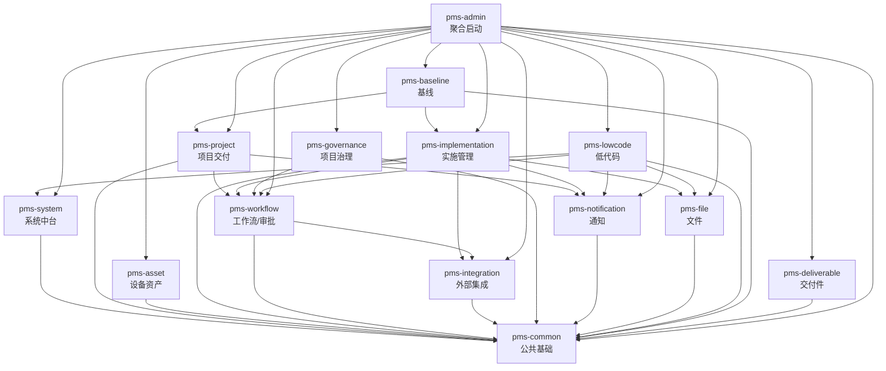

# Network Equipment PMS 模块知识库索引

> 本目录收录 network-equipment-pms 项目全部功能模块的详细知识库文档，按功能模块进行划分。
> 每篇文档独立成文，涵盖模块定位、包结构、核心实体模型、状态机、SPI 机制、Service 层与 API 端点、模块依赖关系及关键技术点。

## 项目概览

Network Equipment PMS（网络设备项目管理 系统）是一个基于 Spring Boot 3 + Vue 3 的网络设备工程项目交付管理平台，覆盖项目立项、计划、设计、实施、验收、运维的全生命周期（PPDIOO 方法论），并集成设备资产管理、交付件管理、工作流审批、外部系统对接、低代码扩展等能力。

- **后端**：14 个 Maven 模块，Java 17，Spring Boot 3，MyBatis-Plus，Flowable 7，Shiro/Spring Security，Redis，Flyway
- **前端**：1 个 Vue 3 + Vite + TypeScript + Element Plus 应用
- **数据库**：MySQL（主库），SQL Server（MES/SAP/D365 集成）

## 模块清单与导航

### 后端模块（14 个）

| # | 模块 | 职责 | 文档 |
|---|------|------|------|
| 1 | pms-common | 公共基础模块：横切基础设施（加密/限流/幂等/XSS/链路追踪/Saga）、12 个 SPI 接口、统一返回与异常体系 | [pms-common.md](./pms-common.md) |
| 2 | pms-system | 系统管理中台：用户/角色/菜单/字典/配置/日志，JWT 认证，RBAC 权限，Redis 缓存 | [pms-system.md](./pms-system.md) |
| 3 | pms-project | 项目交付管理领域：项目/阶段/里程碑/模板/终验，11 态状态机，物化路径树，PPDIOO 方法论 | [pms-project.md](./pms-project.md) |
| 4 | pms-implementation | 实施管理领域：实施任务/任务树/进度汇总/检查项/结算，7 态状态机，双轨进度，结算 Saga | [pms-implementation.md](./pms-implementation.md) |
| 5 | pms-asset | 设备资产管理领域：资产/分类/生命周期/调拨/RMA/质保，9 态状态机，Flowable 调拨审批 | [pms-asset.md](./pms-asset.md) |
| 6 | pms-deliverable | 交付件管理领域：交付件/版本/签名/引用，7 态状态机，类型字典驱动，实体引用机制，终验 SPI | [pms-deliverable.md](./pms-deliverable.md) |
| 7 | pms-baseline | 基线管理领域：任务依赖循环检测、计划基线快照、偏差监控（三阈值 OR 触发） | [pms-baseline.md](./pms-baseline.md) |
| 8 | pms-file | 文件管理领域：统一存储抽象（本地/OSS/MinIO）、EXIF GPS 解析、地理围栏校验、缩略图 | [pms-file.md](./pms-file.md) |
| 9 | pms-workflow | 工作流与统一审批中心：Flowable 7 集成、审批记录/节点/历史/字段权限、超时调度、OA 镜像 | [pms-workflow.md](./pms-workflow.md) |
| 10 | pms-integration | 外部系统集成：D365/FP/致远 OA 适配器、OAuth2 令牌缓存、Resilience4j 容错、集成日志 | [pms-integration.md](./pms-integration.md) |
| 11 | pms-notification | 通知管理领域：站内信/邮件/WebSocket/OA 四通道、Freemarker 模板引擎、Redis Pub/Sub 广播 | [pms-notification.md](./pms-notification.md) |
| 12 | pms-governance | 项目治理领域：变更请求/风险登记册/问题日志三本账、CCB 审批、5×5 风险矩阵、三账联动 | [pms-governance.md](./pms-governance.md) |
| 13 | pms-lowcode | 低代码平台：可视化实体建模、微流引擎、规则引擎、连接器、触发器、版本管理、协同编辑、应用导出 | [pms-lowcode.md](./pms-lowcode.md) |
| 14 | pms-admin | 聚合启动模块：统一启动入口、聚合控制器、Flyway 数据库迁移（V1-V86）、BPMN 流程定义 | [pms-admin.md](./pms-admin.md) |

### 前端模块（1 个）

| # | 模块 | 职责 | 文档 |
|---|------|------|------|
| 15 | pms-frontend | Vue 3 前端应用：30+ 页面模块、55+ API 封装、字典驱动兜底机制、Pinia 状态管理、低代码设计器 | [pms-frontend.md](./pms-frontend.md) |

## 模块依赖关系图

## 分层架构说明

### 基础层
- **pms-common**：最底层依赖，被所有模块依赖。提供 BaseEntity、Result、异常体系、SPI 接口、横切组件（加密/限流/幂等/XSS/链路追踪/Saga/重试）。

### 系统支撑层
- **pms-system**：系统管理中台，依赖 pms-common。提供认证授权、字典、配置、日志等基础服务。
- **pms-file**：文件存储，依赖 pms-common。提供统一存储抽象。
- **pms-notification**：通知服务，依赖 pms-common。提供多通道通知能力。
- **pms-integration**：外部集成，依赖 pms-common。提供 D365/FP/OA 适配器与容错机制。

### 领域业务层
- **pms-project**：项目交付管理核心，依赖 pms-common/pms-workflow/pms-notification。
- **pms-implementation**：实施管理，依赖 pms-common/pms-workflow/pms-integration/pms-notification/pms-file。
- **pms-asset**：设备资产管理，依赖 pms-common。
- **pms-deliverable**：交付件管理，仅依赖 pms-common（最干净的业务模块）。
- **pms-baseline**：基线管理，依赖 pms-common/pms-implementation/pms-project。
- **pms-governance**：项目治理，依赖 pms-common/pms-workflow。

### 平台扩展层
- **pms-workflow**：工作流引擎 + 统一审批中心，依赖 pms-common/pms-integration。
- **pms-lowcode**：低代码平台，依赖 pms-common/pms-system/pms-workflow/pms-notification/pms-file。

### 聚合启动层
- **pms-admin**：聚合所有模块，提供统一启动入口、Flyway 迁移、BPMN 流程定义、跨模块聚合控制器。

### 前端层
- **pms-frontend**：Vue 3 前端应用，对接所有后端 API。

## 跨模块解耦机制（SPI）

项目通过 SPI（Service Provider Interface）机制解耦跨模块依赖，避免循环依赖。pms-common 中定义了 12 个 SPI 接口，由各业务模块实现：

| SPI 接口 | 实现模块 | 消费模块 | 用途 |
|----------|----------|----------|------|
| MandatoryDeliverableValidator | pms-deliverable | pms-project | 终验时校验必需交付件 |
| DeliverableBatchCreator | pms-deliverable | pms-project | 模板深拷贝时批量创建交付件 |
| BusinessFileStorage | pms-file | pms-deliverable 等 | 业务文件存储抽象 |
| TaskBatchCreator | pms-implementation | pms-project | 模板深拷贝时批量创建任务 |
| TaskCompletionChecker | pms-implementation | pms-project | 阶段退出闸门校验任务完成率 |
| ProjectConfigProvider | pms-project | pms-workflow | 审批超时策略读取 |
| BusinessDataLoader | pms-project | pms-workflow | 审批中心加载业务数据 |
| ApprovalTrigger | pms-baseline | pms-workflow | 触发审批流程 |
| ApprovalStatusChecker | pms-project | pms-workflow | 校验审批状态 |
| ApprovalPlanBatchCreator | pms-project | pms-workflow | 模板深拷贝审批计划 |
| DependencyBatchCreator | pms-baseline | pms-project | 模板深拷贝任务依赖 |
| ProjectPhaseLookup | pms-project | pms-deliverable 等 | 阶段信息查询 |

## 已知技术债

| 编号 | 描述 | 状态 |
|------|------|------|
| TD-P8-001 | pms-project ↔ pms-workflow 循环依赖 | 部分修复（通过 SPI 解耦，pom 仍声明依赖） |
| TD-P8-009 | 基线增量加载 DFS 性能 | 待优化 |
| TD-P8-011 | 交付件终验校验技术债 | 已修复（简化为 mandatory 校验） |
| TD-P8-012 | 交付件类型硬编码 | 已修复（字典驱动） |

## 阅读建议

- **新成员入门**：建议按 `pms-common` → `pms-system` → `pms-project` → `pms-admin` 顺序阅读，建立整体认知。
- **业务开发**：根据所属功能模块直接查阅对应文档，重点关注「核心实体模型」「状态机」「Service 层与 API 端点」章节。
- **架构演进**：关注各文档的「模块依赖关系」与「关键技术点」章节，以及 SPI 解耦机制。
- **前端开发**：查阅 `pms-frontend.md`，重点关注「页面模块划分」「API 封装层」「字典机制」章节。

## 文档统计

| 指标 | 数值 |
|------|------|
| 模块文档数 | 15 篇 |
| 总行数 | 8699 行 |
| 总字节数 | 约 650 KB |
| 最大文档 | pms-project.md（995 行） |
| 最小文档 | pms-admin.md（322 行） |

---

> 文档生成日期：2026-07-22
> 文档维护：基于源码静态分析自动整理，如代码发生变更请同步更新对应文档。
