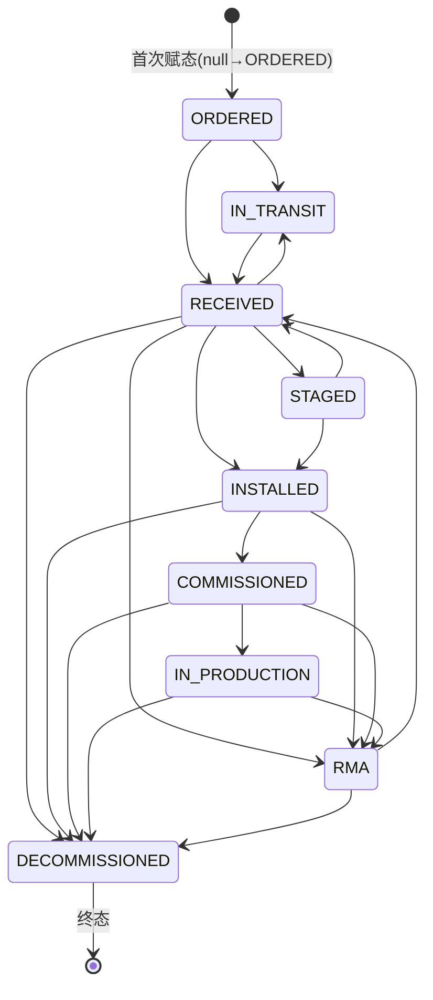

# pms-asset 模块知识库

> 本文基于 `network-equipment-pms/pms-asset` 模块源码（`com.dp.plat.asset`）整理，记录设备资产管理领域的实体模型、状态机、分类树、生命周期日志、调拨审批流程、RMA 闭环与质保定时扫描等核心机制。

## 模块概述

`pms-asset` 是网络设备 PMS 平台的**设备资产管理领域模块**，负责网络设备的资产登记、型号与分类维护、生命周期跟踪、跨项目调拨审批、RMA 返修闭环以及质保到期预警。

- **Maven 坐标**：`com.dp.plat:pms-asset:1.0.0-SNAPSHOT`，父工程为 `com.dp.plat:network-equipment-pms`。
- **artifactId / name**：`pms-asset`，description 为 `Equipment asset management domain`。
- **基础包名**：`com.dp.plat.asset`，包说明（`package-info.java`）定位为 *"Equipment asset management domain module — network equipment asset registration, tracking and lifecycle management"*。
- **技术栈**：Spring Boot + MyBatis-Plus + Jakarta Validation + Flowable 7.x（经 `pms-workflow` 间接集成）+ EasyExcel；与 `pms-notification`、`pms-file`、`pms-project` 协同。
- **核心职责**：
  1. 设备实例（`Asset`）登记、分配、归还、回收；
  2. 设备分类树（`AssetCategory`）与型号（`AssetModel`）维护；
  3. 9 态资产状态机及其合法性校验（`AssetStateTransitionValidator`）；
  4. 生命周期日志（`AssetLifecycleLog`）留痕；
  5. 跨项目调拨审批（`AssetTransfer` + Flowable `assetTransfer` 流程）；
  6. RMA 返修 6 步闭环（`Rma`）；
  7. 质保记录（`Warranty`）与每日到期扫描预警（`WarrantyExpiryScheduler`）。

## 包结构

`com.dp.plat.asset` 下的子包组织如下：

| 子包 | 主要内容 |
|------|----------|
| `entity` | 领域实体：`Asset`、`AssetCategory`、`AssetModel`、`AssetLifecycleLog`、`AssetTransfer`、`AssetAllocation` |
| `enums` | `AssetStatus`（9 态状态枚举） |
| `dto` | `AssetImportDTO`、`AssetExportDTO`（Excel 导入导出） |
| `mapper` | MyBatis-Plus Mapper：`AssetMapper`、`AssetCategoryMapper`、`AssetModelMapper`、`AssetTransferMapper`、`AssetLifecycleLogMapper`、`AssetAllocationMapper`（均继承 `BaseMapper`，无自定义 SQL） |
| `service` | 接口 `IAssetService`、`IAssetCategoryService`、`IAssetModelService`、`IAssetTransferService` 与状态机校验器 `AssetStateTransitionValidator` |
| `service.impl` | 上述接口的实现类 |
| `controller` | `AssetController`、`AssetCategoryController`、`AssetModelController`、`AssetTransferController` |
| `listener` | `FinalAcceptanceApprovedEventListener`（监听项目终验通过事件，自动回收设备） |
| `rma` | RMA 子域：`entity/Rma`、`dto/RmaKpiDto`、`mapper/RmaMapper`、`service/IRmaService`、`service/impl/RmaServiceImpl`、`controller/RmaController` |
| `warranty` | 质保子域：`entity/Warranty`、`mapper/WarrantyMapper`、`service/IWarrantyService`、`service/impl/WarrantyServiceImpl`、`controller/WarrantyController`、`schedule/WarrantyExpiryScheduler` |

所有实体均继承 `com.dp.plat.common.entity.BaseEntity`，公共字段为：`id`（`IdType.AUTO`）、`createTime`、`updateTime`、`createBy`、`updateBy`、`deleted`（`@TableLogic` 逻辑删除）。

## 核心实体模型

### 1. Asset — 设备资产实例（`pms_asset`）

| 字段 | 类型 | 说明 |
|------|------|------|
| `serialNo` | String(100) | 设备序列号（非空） |
| `modelId` | Long | 设备型号 ID（非空，关联 `pms_asset_model`） |
| `categoryId` | Long | 设备分类 ID（非空，关联 `pms_asset_category`） |
| `assetName` | String(200) | 设备名称（非空，亦用作资产编号） |
| `status` | String(30) | 资产状态（取 `AssetStatus` 枚举名，非空） |
| `warehouse` | String(100) | 仓库名称 |
| `location` | String(200) | 库位 |
| `projectId` | Long | 当前所属项目 ID（可空） |
| `inboundTime` / `outboundTime` | LocalDateTime | 入库 / 出库时间 |
| `remarks` | String(500) | 备注 |
| `macAddress` | String(100) | MAC 地址 |
| `managementIp` | String(50) | 管理 IP |
| `hostname` | String(100) | 主机名 |
| `dataCenter` | String(100) | 数据中心 |
| `rack` | String(50) | 机柜 |
| `startU` / `endU` | Integer | 机柜起始/结束 U 位（≥1） |
| `imei` | String(50) | IMEI |
| `poNo` | String(100) | PO 编号 |
| `invoiceNo` | String(100) | 发票号 |
| `warrantyContractNo` | String(100) | 保修合同号 |
| `version` | Integer | 乐观锁版本号（`@Version`，并发更新冲突检测） |

> 关系：`Asset` → `AssetModel`（多对一）、`Asset` → `AssetCategory`（多对一）、`Asset` → `Project`（多对一，可空）。

### 2. AssetCategory — 设备分类（`pms_asset_category`）

| 字段 | 类型 | 说明 |
|------|------|------|
| `parentId` | Long | 父分类 ID（根节点为 `0`） |
| `categoryName` | String | 分类名称 |
| `categoryCode` | String | 分类编码 |
| `sortOrder` | Integer | 排序序号 |
| `status` | Integer | `1`=启用，`0`=禁用 |
| `children` | List | 子分类（`@TableField(exist=false)`，非持久化） |

采用**邻接表（parentId）**结构组织树，根节点 `parentId == 0L`（创建时 null 默认置 0）。

### 3. AssetModel — 设备型号（`pms_asset_model`）

| 字段 | 类型 | 说明 |
|------|------|------|
| `categoryId` | Long | 所属分类 ID |
| `modelName` / `modelCode` | String | 型号名称 / 编码 |
| `brand` | String | 品牌 |
| `specParams` | String | 规格参数（JSON 字符串） |
| `standardPrice` | BigDecimal | 标准价格 |
| `unit` | String | 单位（台/套/个） |
| `status` | Integer | `1`=启用，`0`=禁用 |

### 4. AssetLifecycleLog — 生命周期日志（`pms_asset_lifecycle_log`）

| 字段 | 类型 | 说明 |
|------|------|------|
| `assetId` | Long | 关联资产 ID |
| `actionType` | String | 动作类型：`INBOUND`/`ALLOCATE`/`TRANSFER`/`RETURN`/`SCRAP` |
| `fromProjectId` | Long | 原项目 ID |
| `toProjectId` | Long | 目标项目 ID |
| `operatorId` / `operatorName` | Long/String | 操作人 |
| `actionTime` | LocalDateTime | 操作时间 |
| `remarks` | String | 备注 |

### 5. AssetTransfer — 调拨申请（`pms_asset_transfer`）

| 字段 | 类型 | 说明 |
|------|------|------|
| `assetId` | Long | 调拨设备 ID |
| `fromProjectId` / `toProjectId` | Long | 源 / 目标项目 |
| `transferReason` | String | 调拨原因 |
| `status` | String | `PENDING`/`APPROVED`/`REJECTED` |
| `applyUserId` / `applyUserName` / `applyTime` | — | 申请人信息 |
| `approveUserId` / `approveUserName` / `approveTime` / `approveOpinion` | — | 审批人信息与意见 |
| `processInstanceId` | String | Flowable 流程实例 ID |

### 6. AssetAllocation — 分配记录（`pms_asset_allocation`）

| 字段 | 类型 | 说明 |
|------|------|------|
| `assetId` / `projectId` / `modelId` | Long | 关联键 |
| `quantity` | Integer | 数量 |
| `allocateTime` / `allocateUserId` / `allocateUserName` | — | 分配信息 |
| `status` | String | `ACTIVE`/`RETURNED` |
| `returnTime` | LocalDateTime | 归还时间 |

### 7. Rma — RMA 返修单（`pms_rma`）

| 字段 | 类型 | 说明 |
|------|------|------|
| `rmaNo` | String(50) | RMA 单号，格式 `RMA-YYYY-XXXX`（非空） |
| `assetId` | Long | 关联资产（非空） |
| `sn` | String(100) | 登记时快照序列号 |
| `faultDescription` | String(2000) | 故障描述（非空） |
| `faultPhotos` | String | 故障照片附件 ID（逗号分隔，预留） |
| `ticketStatus` | String(50) | 工单状态：`REGISTERED`/`WARRANTY_CHECKED`/`RMA_ISSUED`/`RETURNING`/`INSPECTED`/`CLOSED` |
| `warrantyStatus` | String(50) | `IN_WARRANTY`/`OUT_OF_WARRANTY` |
| `projectId` | Long | 登记时资产所属项目 |
| `registeredAt` / `warrantyCheckedAt` / `rmaIssuedAt` / `returningAt` / `inspectedAt` / `closedAt` | LocalDateTime | 各阶段时间戳 |
| `registerUserId` / `registerUserName` | — | 登记人 |
| `resolution` | String(2000) | 维修处理结果 |
| `inspectorNotes` | String(2000) | 检验备注 |

### 8. Warranty — 质保记录（`pms_warranty`）

| 字段 | 类型 | 说明 |
|------|------|------|
| `assetId` | Long | 关联资产（非空） |
| `startDate` / `endDate` | LocalDate | 质保起止日期（非空） |
| `durationMonths` | Integer | 质保月数（≥1，非空） |
| `slaLevel` | String(20) | SLA 等级：`BASIC`/`PREMIUM`/`PLATINUM` |
| `contractNo` | String(100) | 合同编号 |
| `projectId` | Long | 关联项目 |
| `notes` | String(2000) | 备注 |

## 资产状态机

### 状态枚举

`com.dp.plat.asset.enums.AssetStatus` 定义 9 个状态，`sortOrder` 反映标准正向生命周期顺序：

| 枚举值 | 描述 | sortOrder |
|--------|------|-----------|
| `ORDERED` | 已下单 | 1 |
| `IN_TRANSIT` | 运输中 | 2 |
| `RECEIVED` | 已收货 | 3 |
| `STAGED` | 已暂存 | 4 |
| `INSTALLED` | 已安装 | 5 |
| `COMMISSIONED` | 已调试 | 6 |
| `IN_PRODUCTION` | 已投产 | 7 |
| `RMA` | 返修中 | 8 |
| `DECOMMISSIONED` | 已退役 | 9 |

> ⚠️ **代码注释与实现的不一致**：`Asset` 实体类与 `status` 字段的 Javadoc 中遗留了旧的 4 态说明（`IN_STOCK`/`ALLOCATED`/`IN_TRANSIT`/`SCRAPPED`），该注释已**过时**。实际状态机由 `AssetStatus` 枚举驱动；`AssetServiceImpl` 中保留 `STATUS_ALLOCATED` 常量仅用于对未迁移历史数据的兼容查询（`returnByProject`、`recycleByProject`）。新增数据应使用 9 态枚举值。

### 流转规则

`AssetStateTransitionValidator`（`@Component`）以 `EnumMap<AssetStatus, Set<AssetStatus>>` 维护合法迁移矩阵：

| 当前状态 | 可迁移至 |
|----------|----------|
| `ORDERED` | `IN_TRANSIT`, `RECEIVED` |
| `IN_TRANSIT` | `RECEIVED` |
| `RECEIVED` | `STAGED`, `IN_TRANSIT`, `INSTALLED`, `RMA`, `DECOMMISSIONED` |
| `STAGED` | `INSTALLED`, `RECEIVED` |
| `INSTALLED` | `COMMISSIONED`, `RMA`, `DECOMMISSIONED` |
| `COMMISSIONED` | `IN_PRODUCTION`, `RMA`, `DECOMMISSIONED` |
| `IN_PRODUCTION` | `RMA`, `DECOMMISSIONED` |
| `RMA` | `RECEIVED`, `DECOMMISSIONED` |
| `DECOMMISSIONED` | （终态，无后续迁移） |

**特殊判定**（`canTransition` 方法）：
- `to == null` → 非法；
- `from == null`（资产首次赋状态）→ 始终合法；
- `from == to`（同态 no-op）→ 合法。

`validate(from, to)` 在非法迁移时抛出 `BusinessException`，提示信息包含合法目标集合，例如：`非法状态迁移: IN_PRODUCTION → RECEIVED，合法路径: IN_PRODUCTION → [RMA, DECOMMISSIONED]`。

### 状态图



### 业务方法对状态机的使用

| 方法 | 触发的状态迁移 |
|------|----------------|
| `AssetServiceImpl.inbound` | `current → RECEIVED` |
| `AssetServiceImpl.allocate` | 仅允许 `RECEIVED`/`STAGED` → `INSTALLED`（先业务校验再 `validate`） |
| `AssetServiceImpl.returnAsset` | `current → RECEIVED` |
| `AssetTransferServiceImpl.apply` | `current → IN_TRANSIT` |
| `AssetTransferServiceImpl.approve` | `IN_TRANSIT → RECEIVED`（落入目标项目） |
| `AssetTransferServiceImpl.reject` | `IN_TRANSIT → RECEIVED`（还原至源项目） |
| `RmaServiceImpl.inspect` | 按维修结果：`SCRAP`/报废 → `DECOMMISSIONED`；原 `INSTALLED` → `COMMISSIONED`；其余 → `IN_PRODUCTION` |

每次状态迁移成功后，`AssetServiceImpl` 会通过 `BusinessMetrics.registerAssetStatusGauge(status, count)` 更新 Prometheus 资产状态分布 Gauge（best-effort，采集失败不影响业务）。

## 资产分类树

`AssetCategoryServiceImpl` 提供基于 `parentId` 邻接表的树形管理：

- **`getTree()`**：一次性加载全部分类（按 `sortOrder`、`id` 升序），按 `parentId` 分组（null 归为 `0L`），递归绑定 `children`，返回 `parentId == 0L` 的根节点列表。
- **`create(category)`**：`parentId` 为空时默认 `0L`，`status` 默认 `1`，`sortOrder` 默认 `0`。
- **`update(category)`**：要求 `id` 非空。
- **`delete(id)`**：删除前校验是否存在子分类（`parentId == id` 的记录数 > 0 时抛 `BusinessException("存在子分类，无法删除")`），即**禁止带子节点删除**，但未校验分类下是否仍有设备引用。

分类与型号为**一对多**关系：`AssetModel.categoryId → AssetCategory.id`，`AssetModelServiceImpl.create` 强制 `categoryId` 非空。

## 生命周期日志

`AssetLifecycleLog` 以追加方式记录每台设备的关键动作，`actionType` 取值：

| actionType | 含义 | 记录来源 |
|------------|------|----------|
| `INBOUND` | 入库 | `AssetServiceImpl.inbound` |
| `ALLOCATE` | 分配至项目 | `AssetServiceImpl.allocate` |
| `TRANSFER` | 调拨（审批通过 / 被驳回） | `AssetTransferServiceImpl.approve` / `reject` |
| `RETURN` | 归还入库 | `AssetServiceImpl.returnAsset` |
| `SCRAP` | 报废（枚举预留，当前代码未直接写入） | — |

每条日志包含 `fromProjectId`/`toProjectId`、操作人（取自 `SecurityUtils.getCurrentUserId()/getCurrentUsername()`）、`actionTime` 与 `remarks`。

查询接口 `getLifecycleLog(assetId)` 按 `actionTime` 升序、`id` 升序返回完整轨迹，对应 `GET /api/asset/{id}/lifecycle`。

## 调拨审批流程（Flowable 集成）

### 流程定义

调拨审批通过 `pms-workflow` 模块（基于 **Flowable 7.x** 引擎）驱动，流程定义文件位于 `pms-admin/src/main/resources/processes/asset-transfer.bpmn20.xml`：

- **流程 Key**：`assetTransfer`（代码常量 `PROCESS_KEY_ASSET_TRANSFER`），流程名「资产转移流程」。
- **节点序列**：
  1. `startEvent`（开始）
  2. `fromPmReview`（源 PM 审核，`assignee=${fromPmUserId}`）
  3. `fromPmDecisionGateway`（排他网关，条件 `${approved}`）
  4. `toPmReview`（目标 PM 审核，`assignee=${toPmUserId}`）
  5. `toPmDecisionGateway`（排他网关，条件 `${approved}`）
  6. `endEvent`（结束） / `rejectedEnd`（驳回终止，`terminateEventDefinition`）
- **SkipExpression**：`${assignee == initiator}`——当任务办理人即流程发起人时自动跳过该审核节点（避免自审）。
- **OA 集成**：两个审核任务均挂载 `OaTaskListener`（`delegateExpression="${oaTaskListener}"`），在任务 `create`/`complete` 事件中镜像同步至**致远 OA**。

### Service 层编排

`AssetTransferServiceImpl` 通过注入 `WorkflowService`（`pms-workflow` 对 Flowable 的封装，提供 `startProcess`、`completeTask`、`getTodoTasks`）编排：

1. **`apply(transfer)`**（`@Transactional`）：
   - 校验 `assetId`、`toProjectId` 非空，`fromProjectId` 缺省取资产当前 `projectId`；
   - `stateValidator.validate(current, IN_TRANSIT)`，将资产置 `IN_TRANSIT`；
   - 调拨单置 `PENDING`，记录申请人/申请时间；
   - `startTransferWorkflow`：以 `businessKey = transferId` 启动流程，传入流程变量 `fromProjectId`/`toProjectId`/`assetId`，回写 `processInstanceId`；流程启动失败仅 `log.error`，**不阻断调拨创建**。

2. **`approve(transferId, opinion)`**：
   - 校验当前状态为 `PENDING`，置 `APPROVED`，记录审批信息；
   - 资产 `IN_TRANSIT → RECEIVED`，`projectId` 切换为 `toProjectId`，写 `TRANSFER` 生命周期日志（备注「设备调拨审批通过」）；
   - `completeTransferTask`：通过 `getTodoTasks` 分页（`TODO_QUERY_SIZE=200`）查找当前用户与该 `processInstanceId` 匹配的待办任务，调用 `completeTask` 完成并附带评论。

3. **`reject(transferId, opinion)`**：
   - 置 `REJECTED`，资产 `IN_TRANSIT → RECEIVED` 还原至 `fromProjectId`，写 `TRANSFER` 日志（备注「设备调拨申请被驳回」），完成审批任务。

### API 端点

`AssetTransferController`（`/api/asset/transfer`）：

| 方法 | 路径 | 权限 | 说明 |
|------|------|------|------|
| POST | `/apply` | `asset:transfer:apply` | 提交调拨申请 |
| POST | `/{id}/approve` | `asset:transfer:approve` | 审批通过 |
| POST | `/{id}/reject` | `asset:transfer:approve` | 审批驳回 |
| GET | `/list` | — | 分页查询（支持 status/assetId/fromProjectId/toProjectId 过滤） |

## RMA 流程（6 步闭环）

`RmaServiceImpl` 实现 RMA（Return Merchandise Authorization）退货返修的 6 步闭环，工单状态 `ticketStatus` 流转：

```
REGISTERED → WARRANTY_CHECKED → RMA_ISSUED → RETURNING → INSPECTED → CLOSED
```

对应业务语义为：**登记 → 质保核验 → 签发 RMA → 返修运输 → 检验 → 关闭**。

### 各步实现

| 步骤 | 方法 | 前置状态校验 | 关键动作 |
|------|------|--------------|----------|
| 1 登记 | `create(rma)` | — | `generateRmaNo()` 生成 `RMA-YYYY-XXXX`（按年前缀计数 +1，四位补零）；置 `REGISTERED`、`registeredAt`、登记人；快照 `sn`/`projectId`（缺失时回查资产） |
| 2 质保核验 | `checkWarranty(id)` | `REGISTERED` | 调 `IWarrantyService.isInWarranty(assetId, today)` 判定（**可选依赖**，模块缺失时默认 `IN_WARRANTY`）；置 `WARRANTY_CHECKED`、`warrantyCheckedAt` |
| 3 签发 | `issueRma(id)` | `REGISTERED` 或 `WARRANTY_CHECKED` | 置 `RMA_ISSUED`、`rmaIssuedAt` |
| 4 返修运输 | `markReturning(id)` | `RMA_ISSUED` | 置 `RETURNING`、`returningAt` |
| 5 检验 | `inspect(id, notes)` | `RETURNING` | 置 `INSPECTED`、`inspectedAt`、`inspectorNotes`；并按维修结果 `resolution` 更新资产状态（见下） |
| 6 关闭 | `close(id)` | `INSPECTED` | 置 `CLOSED`、`closedAt` |

### 检验后资产状态联动（`determineInspectTarget`）

- `resolution` 含 `SCRAP` 或 `报废`（大小写不敏感）→ 资产 `DECOMMISSIONED`；
- 否则若资产原状态为 `INSTALLED` → `COMMISSIONED`；
- 否则 → `IN_PRODUCTION`。

状态变更前仍经 `AssetStateTransitionValidator.validate` 校验合法性。

### 通知与 KPI

- **状态变更通知**：除 `create` 外，每步成功后 `sendStatusChangeNotification` 向登记人（`registerUserId`）发送站内信 + WebSocket（`channels = {IN_APP, WS}`，`category = RMA`，`bizType = RMA_STATUS_CHANGE`）；通知失败仅记录日志，**不回滚状态迁移**。
- **KPI 计算**（`kpi(start, end)`，返回 `RmaKpiDto`）：
  - `totalCount`：区间内登记数；
  - `closedCount`：区间内关闭数；
  - `mttrHours`：已关闭单的 `registeredAt → closedAt` 平均小时数（`BigDecimal`，两位小数）；
  - `firstPassRate`：`closedCount / inspectedCount × 100`（首次通过率，`inspectedCount` 含 `INSPECTED` 与 `CLOSED`）。

### 故障照片

通过 `pms-file` 的 `IAttachmentService` 管理，`bizType = "RMA"`，提供上传（`POST /{id}/photos`）、列表（`GET /{id}/photos`）、单张删除（`DELETE /photos/{attachmentId}`）。

### API 端点

`RmaController`（`/api/asset/rma`）：

| 方法 | 路径 | 权限 | 说明 |
|------|------|------|------|
| POST | `` | `asset:rma:add` | 登记 RMA |
| POST | `/{id}/check-warranty` | `asset:rma:process` | 质保核验 |
| POST | `/{id}/issue` | `asset:rma:process` | 签发 |
| POST | `/{id}/returning` | `asset:rma:process` | 标记返修运输 |
| POST | `/{id}/inspect` | `asset:rma:process` | 检验（带 notes 参数） |
| POST | `/{id}/close` | `asset:rma:close` | 关闭 |
| GET | `/list` | `asset:rma:list` | 分页（ticketStatus/assetId 过滤） |
| GET | `/{id}` | `asset:rma:list` | 详情 |
| GET | `/by-project/{projectId}` | `asset:rma:list` | 按项目列表 |
| GET | `/by-asset/{assetId}` | `asset:rma:list` | 按资产列表 |
| GET | `/kpi` | `asset:rma:list` | KPI（startDate/endDate） |
| POST | `/{id}/photos` | `asset:rma:process` | 上传故障照片 |
| GET | `/{id}/photos` | `asset:rma:list` | 照片列表 |
| DELETE | `/photos/{attachmentId}` | `asset:rma:remove` | 删除照片 |

## 质保管理（定时扫描机制）

### 质保初始化

`WarrantyServiceImpl.initWarrantyForProject(projectId, finalAcceptanceDate, durationMonths)`：
- `durationMonths` 为空或 ≤0 时默认 `12`（`DEFAULT_DURATION_MONTHS`）；
- 质保起始 = `finalAcceptanceDate + 1 天`，结束 = 起始 + `durationMonths` 月；
- 遍历项目下所有资产，**跳过已有质保记录的资产**，逐条创建 `Warranty`。
- `isInWarranty(assetId, date)`：取该资产最新一条质保，判断 `startDate ≤ date ≤ endDate`（闭区间），无记录返回 `false`。

### 到期扫描定时任务

`WarrantyExpiryScheduler`（`@Component`）使用 **Spring `@Scheduled`**（注意：非 Quartz）：

```java
@Scheduled(cron = "0 0 3 * * ?")
public void scanExpiringWarranties()
```

- **执行时机**：每天 03:00。
- **扫描范围**：`warrantyService.listExpiringSoon(90)`，即 `endDate ∈ [今天, 今天+90天]`。
- **三档分级**（按剩余天数 `ChronoUnit.DAYS.between(today, endDate)`）：

| 档位 | 阈值 | bizType |
|------|------|---------|
| 紧急 | ≤30 天 | `WARRANTY_EXPIRE_30` |
| 临近 | ≤60 天 | `WARRANTY_EXPIRE_60` |
| 预告 | ≤90 天 | `WARRANTY_EXPIRE_90` |

- **责任人解析**（`resolveResponsibleUserId`）：优先 `warranty.projectId`，否则回查 `asset.projectId`，再取 `project.projectManagerId`；解析不到则跳过该条通知。
- **通知发送**：`IN_APP` + `WS` 双通道，`category = WARRANTY`，标题如「质保期到期预警（紧急）」，内容含资产序列号、到期日、剩余天数；发送失败 try-catch 吞掉，**不影响扫描主流程**。
- 每档扫描结果均以 `log.warn` 记录明细（资产 id、质保 id、项目 id、到期日）。

### API 端点

`WarrantyController`（`/api/asset/warranty`）：

| 方法 | 路径 | 权限 | 说明 |
|------|------|------|------|
| GET | `/list` | — | 分页（assetId/projectId/contractNo 过滤） |
| GET | `/{id}` | — | 详情 |
| POST | `` | `asset:warranty:add` | 新增 |
| PUT | `` | `asset:warranty:edit` | 修改 |
| DELETE | `/{id}` | `asset:warranty:remove` | 删除 |
| GET | `/by-asset/{assetId}` | — | 按资产列表 |
| GET | `/by-project/{projectId}` | — | 按项目列表 |
| GET | `/expiring-soon` | — | 即将到期（days 默认 30） |
| GET | `/in-warranty/{assetId}` | — | 指定日期是否在保（date 参数） |
| POST | `/init-for-project` | `asset:warranty:add` | 按项目批量初始化质保 |

## Service 层与 API 端点

### Service 接口一览

| 接口 | 实现类 | 核心方法 |
|------|--------|----------|
| `IAssetService` | `AssetServiceImpl` | `inbound`、`allocate`、`returnAsset`、`list`、`getLifecycleLog`、`returnByProject`、`recycleByProject`、`batchImport` |
| `IAssetCategoryService` | `AssetCategoryServiceImpl` | `getTree`、`create`、`update`、`delete` |
| `IAssetModelService` | `AssetModelServiceImpl` | `listByCategoryId`、`create`、`update`、`delete` |
| `IAssetTransferService` | `AssetTransferServiceImpl` | `apply`、`approve`、`reject`、`list` |
| `IRmaService` | `RmaServiceImpl` | `create`、`checkWarranty`、`issueRma`、`markReturning`、`inspect`、`close`、`listByProject`、`listByAsset`、`kpi`、`generateRmaNo` |
| `IWarrantyService` | `WarrantyServiceImpl` | `listByAsset`、`listByProject`、`listExpiringSoon`、`isInWarranty`、`initWarrantyForProject` |
| `AssetStateTransitionValidator` | （自身 `@Component`） | `canTransition`、`validate` |

### Asset 关键业务方法

- **`inbound(asset)`**：`current → RECEIVED`，补 `inboundTime`，写 `INBOUND` 日志，更新状态 Gauge。
- **`allocate(assetId, projectId)`**：仅 `RECEIVED`/`STAGED` 可分配；置 `INSTALLED`、设 `projectId`、补 `outboundTime`，创建 `ACTIVE` 的 `AssetAllocation` 记录，写 `ALLOCATE` 日志。
- **`returnAsset(assetId)`**：`current → RECEIVED`、清 `projectId`，将最近一条 `ACTIVE` 分配记录置 `RETURNED` 并补 `returnTime`，写 `RETURN` 日志。
- **`recycleByProject(projectId)`**：批量对项目下（兼容历史 `ALLOCATED` 状态）的设备逐台调用 `returnAsset`，返回回收数量。
- **`batchImport(file)`**：基于 `ExcelUtils.importWithValidation` 逐行校验（资产编号非空且批内唯一、库内不重复、序列号非空、`projectId` 存在、`status` 为合法 `AssetStatus` 枚举），合法行 `saveBatch` 持久化，非法行汇入 `ExcelImportResult` 错误列表；制造商信息因实体无独立列而写入 `remarks`。

### Controller 与 API 端点汇总

| Controller | 基础路径 | 主要端点 |
|------------|----------|----------|
| `AssetController` | `/api/asset` | `POST /inbound`、`POST /{id}/allocate`、`POST /{id}/return`、`GET /{id}`、`GET /list`、`PUT`、`DELETE /{id}`、`GET /{id}/lifecycle`、`POST /return-by-project/{projectId}`、`GET /template`、`GET /export`、`POST /import` |
| `AssetCategoryController` | `/api/asset/category` | `GET /tree`、`POST`、`PUT`、`DELETE /{id}` |
| `AssetModelController` | `/api/asset/model` | `GET /list`、`POST`、`PUT`、`DELETE /{id}` |
| `AssetTransferController` | `/api/asset/transfer` | `POST /apply`、`POST /{id}/approve`、`POST /{id}/reject`、`GET /list` |
| `RmaController` | `/api/asset/rma` | 见 RMA 章节 |
| `WarrantyController` | `/api/asset/warranty` | 见质保章节 |

### 安全与可观测性注解

- **权限**：`@PreAuthorize` 细粒度权限码，如 `asset:asset:add/list/edit/remove/allocate/return/import/export`、`asset:category:*`、`asset:model:*`、`asset:transfer:apply/approve`、`asset:rma:add/process/close/list/remove`、`asset:warranty:add/edit/remove`。
- **审计**：写操作标注 `@OperLog(title=..., businessType=1新增/2修改/3删除/5导入)`。
- **限流**：`@RateLimit`（按当前用户 ID 令牌桶，如入库 20/60s、删除 10/60s、导入 5/60s）。
- **幂等**：入库接口 `@Idempotent`。
- **监控**：状态迁移后更新 `BusinessMetrics` 资产状态 Gauge。

## 模块依赖关系

`pms-asset` 的 `pom.xml` 声明依赖：

```
pms-asset → pms-common
pms-asset → pms-project
pms-asset → pms-workflow
pms-asset → pms-notification
pms-asset → pms-file
```

各依赖的用途：

| 依赖模块 | 用途 |
|----------|------|
| `pms-common` | `BaseEntity`、`BusinessException`、`Result`、`SecurityUtils`、`ExcelUtils`/`ExcelImportResult`、`BusinessMetrics`、注解 `OperLog`/`Idempotent`/`RateLimit` |
| `pms-project` | `Project`/`ProjectMapper`（质保责任人解析、导入校验）、事件 `FinalAcceptanceApprovedEvent` |
| `pms-workflow` | `WorkflowService` 及 DTO（`StartProcessRequest`/`CompleteTaskRequest`/`ProcessInstanceDTO`/`TaskDTO`），承载调拨 Flowable 审批 |
| `pms-notification` | `INotificationService`/`Notification`，用于 RMA 状态变更与质保到期预警 |
| `pms-file` | `IAttachmentService`/`Attachment`，用于 RMA 故障照片管理 |

### 跨模块事件解耦

`FinalAcceptanceApprovedEventListener`（`@EventListener`）监听 `pms-project` 发出的 `FinalAcceptanceApprovedEvent`，调用 `assetService.recycleByProject(projectId)` 在项目终验通过后自动回收绑定的设备。该监听器**特意放在 `pms-asset` 模块**，使依赖方向为 `pms-asset → pms-project`，避免 `pms-project → pms-asset` 的反向依赖与循环依赖。

## 关键技术点

1. **9 态状态机 + 校验器**：状态合法性集中在 `AssetStateTransitionValidator`，以 `EnumMap`/`EnumSet` 表达迁移矩阵；`validate` 抛出携带合法路径提示的 `BusinessException`，业务方法在迁移前统一调用。

2. **MyBatis-Plus 约定**：全部 Mapper 为空接口继承 `BaseMapper`，Service 继承 `IService`/`ServiceImpl`，查询统一用 `LambdaQueryWrapper`；`Asset` 使用 `@Version` 乐观锁、`BaseEntity` 使用 `@TableLogic` 软删除与 `@TableField(fill=...)` 自动填充审计字段。

3. **Flowable 7.x 集成**：调拨审批通过 `pms-workflow` 的 `WorkflowService` 间接驱动 Flowable；BPMN 定义 `assetTransfer` 含双 PM 审核、`SkipExpression` 自审跳过、`terminateEventDefinition` 驳回终止、`OaTaskListener` 致远 OA 镜像。流程异常被捕获并降级，**不阻断业务创建**。

4. **Spring 事件解耦**：项目终验 → 设备回收通过 `FinalAcceptanceApprovedEvent` 异步解耦，规避模块循环依赖。

5. **可选依赖注入**：`RmaServiceImpl` 对 `IWarrantyService` 使用 `ObjectProvider<IWarrantyService>`，质保模块缺失时 RMA 质保核验默认按 `IN_WARRANTY` 处理，保证松耦合与可独立演进。

6. **Best-effort 副作用**：RMA 状态变更通知、质保到期通知、Prometheus Gauge 采集均以 try-catch 吞异常方式执行，确保监控/通知失败不会回滚核心业务事务。

7. **定时扫描**：质保到期扫描使用 Spring `@Scheduled(cron = "0 0 3 * * ?")`（每日 03:00），三档分级预警（30/60/90 天），通知接收人为项目 PM（`project.projectManagerId`）。

8. **Excel 导入导出**：基于 EasyExcel `@ExcelProperty`，`AssetImportDTO` 全字段为 String 以便逐行校验后再类型转换；导入强制批内唯一 + 库内不重复 + 状态枚举合法性；导出 `AssetExportDTO` 携带 18 列明细。

9. **状态与 RMA 联动**：RMA 检验阶段根据 `resolution` 反向驱动资产状态（报废→`DECOMMISSIONED`、修复合 `INSTALLED`→`COMMISSIONED`、其余→`IN_PRODUCTION`），形成「资产状态机 ↔ RMA 闭环」的双向集成。

10. **遗留兼容**：`Asset` 实体注释与 `AssetServiceImpl.STATUS_ALLOCATED` 常量保留对旧 4 态（`IN_STOCK`/`ALLOCATED`/`SCRAPPED`）历史数据的兼容查询；新增数据统一使用 9 态 `AssetStatus` 枚举。
