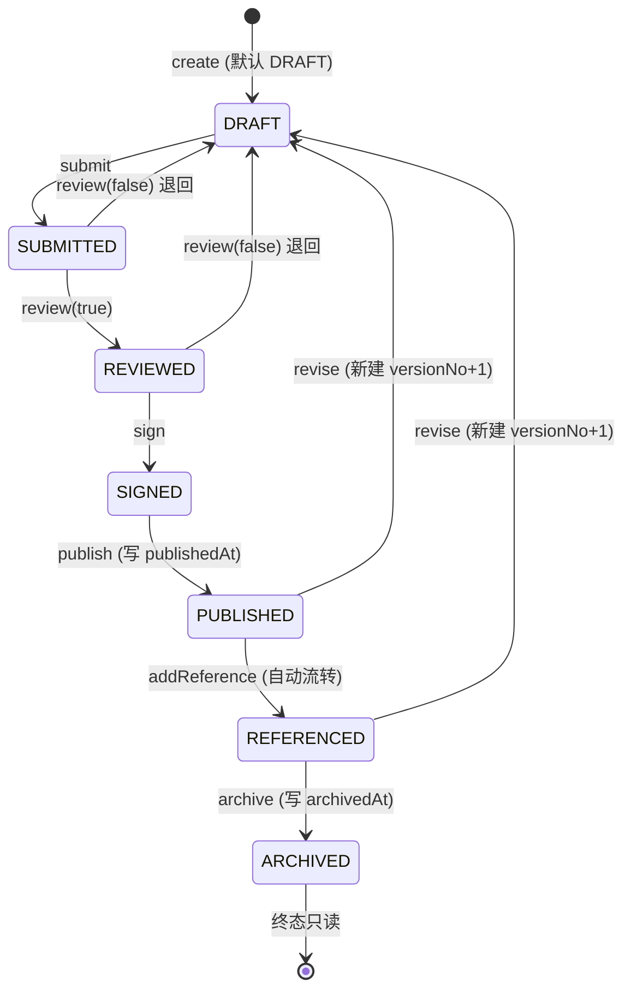

# pms-deliverable 模块知识库

> 源码路径：`/workspace/network-equipment-pms/pms-deliverable`
> 基础包名：`com.dp.plat.deliverable`
> 父项目：`com.dp.plat:network-equipment-pms:1.0.0-SNAPSHOT`
> 模块描述：交付件全生命周期模块 — 7 态状态机 + 版本/签名/引用（Story 5）

---

## 模块概述

`pms-deliverable` 是网络设备 PMS 平台的**项目交付件管理领域模块**，承担项目交付件从草稿到归档的全生命周期管理。它围绕「7 态状态机」核心抽象，叠加版本不可变历史、签核留痕、跨业务引用三大子能力，并通过 SPI 把「阶段退出终验校验」暴露给 `pms-project` 复用，是平台 Story 5 的核心交付。

- **Maven 坐标**：`com.dp.plat:pms-deliverable:1.0.0-SNAPSHOT`，父工程为 `com.dp.plat:network-equipment-pms`，父 pom 中位于 13 个子模块之列。
- **artifactId / name / description**：`pms-deliverable` / `pms-deliverable` / `交付件全生命周期模块 — 7 态状态机 + 版本/签名/引用（Story 5）`。
- **基础包名**：`com.dp.plat.deliverable`。
- **技术栈**：Spring Boot 3.2.5（spring-boot-starter-web + spring-boot-starter-validation）+ MyBatis-Plus 3.5.5（mybatis-plus-spring-boot3-starter）+ Lombok + Spring Security（`@PreAuthorize`）+ springdoc OpenAPI（`@Operation` / `@Tag`）。JDK 17。
- **核心职责**：
  1. 交付件（`Deliverable`）的 CRUD 与基础信息维护；
  2. 7 态状态机（`DRAFT → SUBMITTED → REVIEWED → SIGNED → PUBLISHED → REFERENCED → ARCHIVED`）及其合法性校验；
  3. 版本管理（`DeliverableVersion`，已发布版本不可变，修订新建 `versionNo+1` 记录）；
  4. 签名管理（`DeliverableSignature`，REVIEWED → SIGNED 阶段留痕，支持电子/印章/数字三类签名）；
  5. 引用关系管理（`DeliverableReference`，PUBLISHED → REFERENCED 流转触发）；
  6. 阶段必需交付件终验校验 SPI（`MandatoryDeliverableValidator`，供 `pms-project` 的 `validateExitGate` 跨模块复用）；
  7. 模板深拷贝 SPI（`DeliverableBatchCreator`，供 `pms-project` 创建项目时批量初始化交付件，避免直接依赖本模块）。
- **模块定位亮点**：本模块是整个 PMS 平台中**依赖最干净的领域模块** —— `pom.xml` 中除了 Spring Boot / MyBatis-Plus / 测试 starter 外，内部模块仅依赖 `pms-common`，无任何对 `pms-project`、`pms-asset` 等领域的反向依赖。所有跨模块协作均通过 `pms-common` 暴露的 SPI（`MandatoryDeliverableValidator` / `DeliverableBatchCreator`）+ `@Autowired(required=false)` 注入完成，依赖图无环。

---

## 包结构

`com.dp.plat.deliverable` 下的子包组织如下：

| 子包 | 主要内容 |
|------|----------|
| `controller` | `DeliverableController`（16 个 REST 端点：CRUD + 7 态状态机 + 版本/签名/引用 + 阶段校验） |
| `dto` | `MandatoryDeliverableValidationResult`（阶段终验校验返回结果，含 `allApproved` 标志 + 未满足项 `Item` 列表） |
| `entity` | 4 个领域实体：`Deliverable`（`pms_deliverable`）、`DeliverableVersion`（`pms_deliverable_version`）、`DeliverableSignature`（`pms_deliverable_signature`）、`DeliverableReference`（`pms_deliverable_reference`） |
| `enums` | `DeliverableStatus`（7 态状态机枚举，含 `allowedNextStates` / `isApproved` / `codeLabelMap`）、`DeliverableType`（**已 `@Deprecated`**，旧 8 类终验用途分类，仅保留兼容） |
| `exception` | `IllegalStateTransitionException`（继承 `BusinessException`，状态机非法流转异常，携带 `deliverableId` / `currentStatus` / `targetStatus` 三元组） |
| `mapper` | 4 个 MyBatis-Plus Mapper：`DeliverableMapper` / `DeliverableVersionMapper` / `DeliverableSignatureMapper` / `DeliverableReferenceMapper`，均仅继承 `BaseMapper<T>`，无自定义 SQL |
| `service` | 接口 `DeliverableService`（继承 MyBatis-Plus `IService<Deliverable>`） |
| `service.impl` | `DeliverableServiceImpl`（同时实现 `DeliverableService` 与 SPI `MandatoryDeliverableValidator`） |
| `spi` | `DeliverableBatchCreatorImpl`（实现 SPI `DeliverableBatchCreator`，模板深拷贝用） |

测试侧仅有一个测试类：`src/test/java/com/dp/plat/deliverable/service/DeliverableInitialUploadTest`，验证 `uploadInitialVersion` 走 `BusinessFileStorage` 上传文件 + 新建 v1 版本 + 更新根表 `filePath` 的链路。

所有实体均继承 `com.dp.plat.common.entity.BaseEntity`，公共字段为：`id`（`IdType.AUTO`）、`createTime`、`updateTime`、`createBy`、`updateBy`、`deleted`（`@TableLogic` 逻辑删除）。

---

## 核心实体模型

### 1. Deliverable — 交付件主实体（`pms_deliverable`）

| 字段 | 类型 | 说明 |
|------|------|------|
| `projectId` | Long | 项目ID（必填，由 `create` 校验非空） |
| `deliverableName` | String | 交付件名称（必填，由 `create` 校验非空 non-blank） |
| `deliverableType` | String | 交付件性质类型，见字典 `pms_deliverable_type`：`DOCUMENT` / `CODE` / `ENTITY_REF` / `MODEL` / `CONFIG` / `DATA` / `OTHER` |
| `filePath` | String | 文件路径（最新版本，由 `uploadInitialVersion` / `revise` 更新） |
| `status` | String | 状态（7 态），对应 `DeliverableStatus` 枚举名 |
| `phaseId` | Long | 所属阶段ID（终验交付件可为 null） |
| `currentVersion` | Integer | 当前版本号，从 1 开始；修订时 `+1` 并新建 `DeliverableVersion` 记录 |
| `mandatory` | Boolean | 是否必需交付件（影响阶段退出校验；`create` 默认 `false`） |
| `templateInherited` | Boolean | 是否模板预设（模板实例化创建 = `true`，过程新增 = `false`；`create` 默认 `false`） |
| `approverRole` | String | 签核角色 |
| `refEntityType` | String | 引用实体类型，见字典 `pms_deliverable_ref_entity_type`：`TASK` / `ASSET` / `PHASE` / `PROJECT` / `DELIVERABLE` / `REPORT`（仅 `deliverableType=ENTITY_REF` 时使用） |
| `refEntityId` | Long | 引用实体ID（仅 `deliverableType=ENTITY_REF` 时使用） |
| `publishedAt` | LocalDateTime | 发布时间（`SIGNED → PUBLISHED` 时由 `transition` 写入） |
| `archivedAt` | LocalDateTime | 归档时间（`REFERENCED → ARCHIVED` 时由 `transition` 写入） |

> **数据库演进**：`pms_deliverable` 表最早由 `V2__init_project_tables.sql` 创建（仅 6 列：`id` / `project_id` / `deliverable_name` / `deliverable_type` / `file_path` / `status`，初始 status 仅 `PENDING/SUBMITTED/CONFIRMED` 三态）。`V75__deliverable_full_lifecycle.sql`（Story 5）幂等扩展为 7 态字段（`phase_id` / `current_version` / `mandatory` / `approver_role` / `published_at` / `archived_at`）+ 索引 `idx_phase_mandatory` / `idx_project_status` + 状态值迁移（`PENDING→DRAFT`、`CONFIRMED→PUBLISHED`）。`V86__deliverable_nature_type_and_ref.sql` 再幂等新增 `template_inherited` / `ref_entity_type` / `ref_entity_id` 三列。
>
> **双实体警告**：`pms-project` 模块下另有 `com.dp.plat.project.entity.Deliverable`（同样映射 `pms_deliverable` 表），保留用于历史代码兼容。本模块 `com.dp.plat.deliverable.entity.Deliverable` 为**全生命周期的单一权威实体**（含 7 态字段 + 版本/签核时间戳），新代码应统一使用本模块实体。

### 2. DeliverableVersion — 交付件版本（不可变历史，`pms_deliverable_version`）

| 字段 | 类型 | 说明 |
|------|------|------|
| `deliverableId` | Long | 所属交付件ID |
| `versionNo` | Integer | 版本号 1, 2, 3...（同一交付件内唯一） |
| `filePath` | String | 该版本文件路径 |
| `fileChecksum` | String | 文件 SHA256 校验和（防篡改，业务层目前未强制填充） |
| `uploadedBy` | Long | 上传人ID（初始版本可空，由 `createBy` 审计字段兜底） |
| `uploadedAt` | LocalDateTime | 上传时间（`DEFAULT CURRENT_TIMESTAMP`） |
| `changeLog` | String | 版本变更说明（修订时由 `revise` 入参传入） |
| `status` | String | 该版本流转状态（`DRAFT` / `SUBMITTED` / `REVIEWED` / `SIGNED` / `PUBLISHED` / ...，独立于根表 status） |

> **不可变保证**：DB 通过 `UNIQUE KEY uk_deliverable_version (deliverable_id, version_no)` 防止版本号重复插入；业务层 `revise` 仅 `insert` 新记录、`updateById` 根表，从不 `update` 旧版本记录。已发布版本的 `file_path` 不允许覆盖，修订一律走 `revise` 新建 `versionNo+1`。

### 3. DeliverableSignature — 交付件签名记录（`pms_deliverable_signature`）

| 字段 | 类型 | 说明 |
|------|------|------|
| `deliverableId` | Long | 所属交付件ID |
| `versionNo` | Integer | 签名对应的版本号（为空时由 `addSignature` 取交付件 `currentVersion`） |
| `signerId` | Long | 签核人ID（必填） |
| `signerName` | String | 签核人姓名（冗余，便于审计展示） |
| `signerRole` | String | 签核角色 |
| `signatureType` | String | 签名类型：`ELECTRONIC`（电子，默认）/ `STAMP`（印章）/ `DIGITAL`（数字） |
| `signatureData` | String | 签名数据（证书指纹 / 印章图URL） |
| `signedAt` | LocalDateTime | 签核时间（为空时由 `addSignature` 取当前时间；DB `DEFAULT CURRENT_TIMESTAMP`） |

> 索引：`idx_deliverable_version (deliverable_id, version_no)` 支撑按交付件 + 版本号查询签名历史。

### 4. DeliverableReference — 交付件引用关系（`pms_deliverable_reference`）

| 字段 | 类型 | 说明 |
|------|------|------|
| `sourceDeliverableId` | Long | 被引用的交付件ID（源交付件，必填） |
| `targetDeliverableId` | Long | 引用方为交付件时填其 ID，否则 NULL |
| `referenceType` | String | 引用方业务类型：`TASK` / `PHASE` / `PROJECT` / `DELIVERABLE` / `REPORT`（注意：**不含 `ASSET`**，与 `refEntityType` 字典 6 项不完全对齐） |
| `referencedById` | Long | 引用方业务ID（必填） |
| `referencedByName` | String | 引用方名称（冗余） |

> 索引：`idx_source_deliverable (source_deliverable_id)` / `idx_ref_by (reference_type, referenced_by_id)` / `idx_target_deliverable (target_deliverable_id)`。

### 5. DeliverableChecklist — 终验交付件检查表（`pms_deliverable_checklist`，**已废弃**）

> **重要**：本实体位于 `pms-project` 模块的 `com.dp.plat.project.deliverable.entity` 包下，**不属于 `pms-deliverable` 模块**。但因其与交付件终验语义强相关，列于此处作为演进对照。
>
> 表 `pms_deliverable_checklist` 由 `V14__init_deliverable_checklist.sql` 创建，字段包括：`projectId` / `deliverableType`（旧 8 类终验类型）/ `required` / `uploaded` / `attachmentId` / `checkedAt` / `checkedBy`。实体类已标注 `@Deprecated`，注释明确「终验校验已改为直接查 `pms_deliverable` 表，本实体保留用于历史兼容，将在下版本删除」。

---

## 交付件类型体系

### 当前：7 类性质分类（数据字典驱动）

`pms_deliverable.deliverable_type` 字段不再硬编码枚举，改为引用字典 `pms_deliverable_type`（由 `V86__deliverable_nature_type_and_ref.sql` 注入 `sys_dict` / `sys_dict_item`，`dict_id=110`）。7 项性质分类按字典 `sort_order` 排序如下：

| 字典值 | 中文名 | sort_order | 用途说明 |
|--------|--------|------------|----------|
| `DOCUMENT` | 文档 | 1 | 文档类交付件（如竣工资料、测试报告、操作手册等通用文档） |
| `CODE` | 代码 | 2 | 代码类交付件（脚本、源码包） |
| `ENTITY_REF` | 实体引用 | 3 | 引用其他业务实体（任务/资产/阶段/项目/交付件/报告）的虚拟交付件，不直接承载文件 |
| `MODEL` | 模型 | 4 | 模型类交付件（架构图、数据模型） |
| `CONFIG` | 配置 | 5 | 配置文件类交付件 |
| `DATA` | 数据 | 6 | 数据集类交付件 |
| `OTHER` | 其他 | 7 | 兜底分类（`deliverable_type` 为 NULL 时默认归此） |

> **`ENTITY_REF` 的特殊性**：当 `deliverableType=ENTITY_REF` 时，`DeliverableServiceImpl.validateRefEntity` 强制要求 `refEntityType` 与 `refEntityId` 同时非空，且 `refEntityType` 必须为合法值（`TASK` / `ASSET` / `PHASE` / `PROJECT` / `DELIVERABLE` / `REPORT`）。实体存在性校验由前端选择器保证，后端只做字段完整性校验，避免跨模块依赖。

### 旧版：8 类终验用途分类（已 `@Deprecated`）

历史上有两套旧分类，均已被替换为性质分类：

1. **V2 初版的 4 类基础分类**：`DOCUMENT` / `CONFIG` / `REPORT` / `OTHER`（注释见 `V2__init_project_tables.sql` 行 133）。
2. **V85 统一为 8 类终验用途分类**：`AS_BUILT`（竣工资料）/ `TEST_REPORT`（测试报告）/ `ACCEPTANCE_CERT`（验收证书）/ `TRAINING_RECORD`（培训记录）/ `OPERATION_MANUAL`（操作手册）/ `ASSET_REGISTER`（资产清单）/ `WARRANTY_CERT`（质保证书）/ `SPARE_PARTS_LIST`（备件清单）/ `OTHER`（其他）。对应枚举类 `com.dp.plat.deliverable.enums.DeliverableType`（`@Deprecated`，保留兼容，将在下版本删除）。

### 类型体系演进链路

```
V2（4 类基础） ──V85──► 8 类终验用途 ──V86──► 7 类性质分类（字典驱动）
```

`V85__unify_deliverable_type.sql` 把旧 4 类映射为 8 类：`DOCUMENT/CONFIG/CODE/MODEL → OTHER`，`REPORT → TEST_REPORT`。
`V86__deliverable_nature_type_and_ref.sql` 反向迁移：把 8 类终验用途全部归为 `DOCUMENT`（因本质都是文档），`NULL` 归为 `OTHER`；同时把 `pms_deliverable_checklist` 表中的旧类型也同步迁移为 `DOCUMENT`，并新增字典 `pms_deliverable_type` 与 `pms_deliverable_ref_entity_type`。

### 终验校验语义的同步演进

- **旧逻辑**：终验校验依赖具体类型（按 `deliverable_type` 在 `pms_deliverable_checklist` 表逐项核对 `required` / `uploaded` 标记）。
- **新逻辑**：终验校验改为**只看 `mandatory` 标记**，不再依赖具体类型。任意性质的交付件只要 `mandatory=true` 且状态达到「已批准」（`PUBLISHED` / `REFERENCED` / `ARCHIVED`）即视为满足阶段退出条件。详见下文「终验校验 SPI」一节。

---

## 引用实体机制

### 双重引用语义

模块内存在两种「引用」语义，需注意区分：

| 维度 | 实体引用（`ref_entity_type` / `ref_entity_id`） | 引用关系（`DeliverableReference` 表） |
|------|--------------------------------------------------|---------------------------------------|
| 用途 | 标识一个**虚拟交付件**指向的具体业务对象（当 `deliverableType=ENTITY_REF` 时使用） | 记录一个**已发布交付件**被其他业务对象引用的关系 |
| 触发时机 | 创建/更新交付件时由 `validateRefEntity` 校验字段完整性 | `addReference` 调用时显式插入；并触发 `PUBLISHED → REFERENCED` 状态流转 |
| 字典 | `pms_deliverable_ref_entity_type`（6 项） | `referenceType` 字段（5 项，无 `ASSET`） |
| 方向 | 交付件 → 业务对象 | 业务对象 → 交付件 |

### `ref_entity_type` 6 种实体类型（字典 `pms_deliverable_ref_entity_type`，`dict_id=111`）

| 字典值 | 中文名 | sort_order |
|--------|--------|------------|
| `TASK` | 任务 | 1 |
| `ASSET` | 资产 | 2 |
| `PHASE` | 阶段 | 3 |
| `PROJECT` | 项目 | 4 |
| `DELIVERABLE` | 交付件 | 5 |
| `REPORT` | 报告 | 6 |

### 后端校验逻辑

`DeliverableServiceImpl.validateRefEntity`（私有方法，被 `create` 与 `updateBaseInfo` 复用）执行：

1. 仅当 `deliverableType=ENTITY_REF` 时触发校验，其他类型直接放行；
2. `refEntityType` 为空 → 抛 `BusinessException("实体引用类交付件必须指定引用实体类型（refEntityType）")`；
3. `refEntityId` 为空 → 抛 `BusinessException("实体引用类交付件必须指定引用实体ID（refEntityId）")`；
4. `refEntityType` 不在 6 种合法值内 → 抛 `BusinessException("不支持的引用实体类型：" + refType + "（合法值：TASK/ASSET/PHASE/PROJECT/DELIVERABLE/REPORT）")`。

`isValidRefEntityType` 采用字符串硬比较（非字典查询），避免运行时对 `sys_dict_item` 表的依赖。

---

## 7 态状态机

### 状态枚举

`com.dp.plat.deliverable.enums.DeliverableStatus` 定义 7 个状态（顺序即为生命周期顺序）：

| 枚举值 | 中文标签 | 说明 |
|--------|----------|------|
| `DRAFT` | 草稿 | 初始态 |
| `SUBMITTED` | 已提交 | 待审核 |
| `REVIEWED` | 已审核 | 待签核 |
| `SIGNED` | 已签核 | 待发布 |
| `PUBLISHED` | 已发布 | 版本固化，可被引用 |
| `REFERENCED` | 已引用 | 已被其他业务对象引用 |
| `ARCHIVED` | 已归档 | 终态，只读 |

枚举核心方法：

- `allowedNextStates()` —— 用 Java 17 switch 表达式返回每个状态允许流转的下一状态集合（`EnumSet<DeliverableStatus>`）。
- `canTransitionTo(target)` —— `target != null && allowedNextStates().contains(target)`。
- `code()` —— 返回 `name()`（与数据库列值一致）。
- `of(code)` —— 忽略大小写解析字符串为枚举，无法识别返回 `null`。
- `codeLabelMap()` —— 返回 `枚举名 → 中文标签` 的不可变 Map，供前端枚举展示。
- `label()` —— 返回中文标签。
- `isApproved()` —— `this == PUBLISHED || this == REFERENCED || this == ARCHIVED`，用于阶段退出校验判断「已批准」。

### 流转规则

| 当前状态 | 允许的下一状态 | 触发动作 |
|----------|----------------|----------|
| `DRAFT` | `SUBMITTED` | `submit` |
| `SUBMITTED` | `REVIEWED`（通过）/ `DRAFT`（退回） | `review(passed)` |
| `REVIEWED` | `SIGNED`（签核）/ `DRAFT`（退回） | `sign` / `review(false)` |
| `SIGNED` | `PUBLISHED` | `publish`（写入 `publishedAt`） |
| `PUBLISHED` | `REFERENCED`（被引用）/ `DRAFT`（**修订新建版本**，由 `revise` 处理，`transition` 显式拦截直接 `PUBLISHED → DRAFT`） | `addReference` / `revise` |
| `REFERENCED` | `ARCHIVED` | `archive`（写入 `archivedAt`） |
| `ARCHIVED` | （无，终态） | — |

### 状态图



### 校验与异常

`DeliverableServiceImpl.transition(id, toStatus)` 执行 5 步校验：

1. 加载交付件（`loadOrThrow`，不存在抛 `BusinessException("交付件不存在：id=" + id)`）；
2. `DeliverableStatus.of(current)` 解析当前状态，无法识别抛 `IllegalStateTransitionException(id, current, toStatus, "当前状态无法识别")`；
3. `DeliverableStatus.of(toStatus)` 解析目标状态，无法识别抛 `IllegalStateTransitionException(..., "目标状态无法识别")`；
4. **特殊拦截**：`PUBLISHED → DRAFT` 必须走 `revise` 接口（需提供新文件路径与变更说明），直接调用 `transition` 抛 `IllegalStateTransitionException(..., "PUBLISHED 修订请使用 revise 接口（需提供新文件路径与变更说明，将新建 versionNo+1 版本）")`；
5. `!current.canTransitionTo(target)` 抛 `IllegalStateTransitionException(id, current.code, target.code)`。

通过校验后写入新状态，并对以下两种状态写入副作用时间戳：

- `target == PUBLISHED` → `setPublishedAt(LocalDateTime.now())`；
- `target == ARCHIVED` → `setArchivedAt(LocalDateTime.now())`。

`IllegalStateTransitionException` 继承 `BusinessException`，由 `pms-common` 的全局异常处理器统一转换为失败响应，携带 `deliverableId` / `currentStatus` / `targetStatus` 三元组（通过 `@Getter` 暴露）。

### 便捷方法

`DeliverableService` 暴露 6 个语义化便捷方法（均委托给 `transition`）：

- `submit(id)` → `transition(id, "SUBMITTED")`
- `review(id, passed)` → `transition(id, passed ? "REVIEWED" : "DRAFT")`
- `sign(id)` → `transition(id, "SIGNED")`
- `publish(id)` → `transition(id, "PUBLISHED")`
- `archive(id)` → `transition(id, "ARCHIVED")`
- `revise(...)` —— **不走 `transition`**，独立实现修订新建版本逻辑（见「版本管理」一节）。

---

## templateInherited 标记

### 字段语义

`Deliverable.templateInherited`（DB 列 `template_inherited TINYINT(1) NOT NULL DEFAULT 0`，由 `V86` 新增）：

- `true` —— 模板预设：从项目模板深拷贝创建而来，代表「按模板要求应当交付的项」；
- `false` —— 过程新增：项目执行过程中由用户主动新建的交付件，代表「实际额外交付的项」。

### 双视图能力

`DeliverableService.list` 接受 `templateInherited` 过滤参数（可空），支撑前端两种视图：

- **模板配置视图**（`templateInherited=true`）：展示项目模板要求交付的所有项，用于对照检查模板覆盖度；
- **实际交付视图**（`templateInherited=false`）：展示项目执行中实际产生的交付件，用于跟踪真实交付进度；
- **全部视图**（`templateInherited=null`）：不过滤，展示所有交付件。

### 写入时机

- `DeliverableServiceImpl.create` —— `templateInherited` 为 null 时默认置 `false`（过程新增）；
- `DeliverableBatchCreatorImpl.batchCreateDeliverables` —— 模板深拷贝时**硬编码 `templateInherited(Boolean.TRUE)`**，与初始 `status=DRAFT` / `currentVersion=1` 一并设置，`mandatory` / `approverRole` / `deliverableType` / `deliverableName` / `phaseId` / `projectId` 来自 `TemplateSnapshot.DeliverableDef` 模板定义。

### 设计意图

该标记解决了「模板预设的应交付项」与「实际新交付项」混在一起无法区分的问题，让项目验收既能对照模板核对完整性，又能识别额外的过程交付，避免遗漏或重复登记。

---

## 版本管理

### 核心不变量

- **已发布版本不可变**：`pms_deliverable_version` 表的 `file_path` 一旦写入即不允许覆盖；修订一律新建 `versionNo+1` 记录。
- **版本号唯一**：DB `UNIQUE KEY uk_deliverable_version (deliverable_id, version_no)` 防止同交付件内版本号重复。
- **根表与版本表同步**：根表 `currentVersion` 始终指向最新版本号；`filePath` 始终指向最新版本文件路径。

### 初始版本上传 — `uploadInitialVersion`

签名：`DeliverableVersion uploadInitialVersion(Long deliverableId, MultipartFile file, String changeLog)`

适用条件：仅适用于**尚无版本记录的 DRAFT 交付件**。

流程：
1. 加载交付件，校验当前状态为 `DRAFT`，否则抛 `BusinessException("仅草稿状态交付件可上传初始版本，当前状态：" + status)`；
2. 查询 `pms_deliverable_version` 表，若已存在版本记录抛 `BusinessException("交付件已存在版本，请使用修订功能上传新版本")`；
3. 调用 `BusinessFileStorage.upload(file, "DELIVERABLE", deliverableId)` 跨模块存储文件（避免本模块直接依赖 `pms-file`），返回 `StoredBusinessFile`（含 `attachmentId` / `accessPath` / `uploadedBy`）；
4. 构建 `DeliverableVersion`（`versionNo=1` / `filePath=stored.accessPath` / `uploadedBy=stored.uploadedBy` / `uploadedAt=now` / `changeLog` 为空时默认"初始版本" / `status=DRAFT`），`insert` 入库；
5. 同步更新根表：`filePath=stored.accessPath` / `currentVersion=1` / `status=DRAFT`；
6. **失败回滚**：若上述步骤抛 `RuntimeException`，调用 `businessFileStorage.delete(stored.getAttachmentId())` 清理已上传文件，避免孤儿附件。

### 修订新建版本 — `revise`

签名：`DeliverableVersion revise(Long deliverableId, String filePath, String changeLog, Long uploadedBy)`

适用条件：仅 `PUBLISHED` 或 `REFERENCED` 状态可修订（其他状态抛 `BusinessException("仅 PUBLISHED 或 REFERENCED 状态的交付件可修订，当前状态：" + status)`），且必须提供 `filePath`。

事务边界：`@Transactional(rollbackFor = Exception.class)`，保证「新建版本记录 + 更新根表」单事务原子性（设计文档 §4.5 事务边界）。

流程（4 步，严格对齐设计 §3.4 行 421-425）：
1. 加载交付件，校验当前状态为 `PUBLISHED` 或 `REFERENCED`；校验 `filePath` 非空；
2. 计算 `newVersionNo = (currentVersion == null ? 0 : currentVersion) + 1`；
3. 新建 `DeliverableVersion` 记录（`versionNo=newVersionNo` / `filePath` / `uploadedBy` / `uploadedAt=now` / `changeLog` / `status=DRAFT`），`insert` 入库（**旧版本记录保留不变**）；
4. 更新根表：`currentVersion=newVersionNo` / `status=DRAFT` / `filePath=新文件`（旧版本历史不受影响）。

> **修订绕过状态机**：`revise` 直接将根表 `status` 置为 `DRAFT`，不调用 `transition`。这是因为修订是「新建版本」而非「状态流转」，且 `PUBLISHED → DRAFT` 在 `transition` 中被显式拦截强制走 `revise`。`REFERENCED` 状态在 `allowedNextStates` 中仅含 `ARCHIVED`，但 `revise` 仍允许其修订 —— 这是合理的，因为修订新建版本绕过了状态机校验。

### 版本查询

- `listVersions(deliverableId)` —— 按 `versionNo` 倒序返回所有版本（最新在前）；
- `getVersion(deliverableId, versionNo)` —— 精确查询指定版本记录（不存在返回 `null`）。

---

## 签名管理

### 业务定位

`DeliverableSignature` 记录 `REVIEWED → SIGNED` 流转时的签核动作，对应 7 态状态机的 SIGNED 阶段。支持三种签名类型：

| signatureType | 含义 | signatureData 内容 |
|---------------|------|---------------------|
| `ELECTRONIC` | 电子签名（默认） | 电子签名标识 |
| `STAMP` | 印章签名 | 印章图 URL |
| `DIGITAL` | 数字签名 | 证书指纹 |

### `addSignature` 流程

签名：`DeliverableSignature addSignature(DeliverableSignature signature)`

1. 校验 `signature` 非空、`deliverableId` 非空、`signerId` 非空（均抛 `BusinessException`）；
2. `loadOrThrow` 加载交付件（不存在抛 `BusinessException`）；
3. `versionNo` 为空时取交付件 `currentVersion`（仍为 null 时取 `1`）；
4. `signatureType` 为空时默认 `ELECTRONIC`；
5. `signedAt` 为空时取 `LocalDateTime.now()`；
6. `insert` 入库，记录日志 `新增交付件签名：deliverableId={} versionNo={} signerId={}`。

> **注意**：`addSignature` 本身不触发 `REVIEWED → SIGNED` 状态流转，需调用方先调用 `sign(id)` 走状态机，再调用 `addSignature` 留痕（或反之，由调用方决定顺序）。Controller 端 `POST /api/deliverable/{id}/signatures` 与 `POST /api/deliverable/{id}/sign` 共享同一权限码 `project:deliverable:sign`。

### 签名查询

`listSignatures(deliverableId)` —— 按 `signedAt` 倒序返回签名列表。

---

## 引用关系管理

### 业务定位

`DeliverableReference` 记录 `PUBLISHED` 状态交付件被其他业务对象（`TASK` / `PHASE` / `PROJECT` / `DELIVERABLE` / `REPORT`）引用的关系，对应 7 态状态机的 `PUBLISHED → REFERENCED` 流转。

### `addReference` 流程

签名：`DeliverableReference addReference(DeliverableReference reference)`

1. 校验 `reference` 非空、`sourceDeliverableId` 非空、`referenceType` 非空 non-blank、`referencedById` 非空（均抛 `BusinessException`）；
2. `loadOrThrow` 加载源交付件；
3. 校验源交付件状态为 `PUBLISHED` 或 `REFERENCED`（仅已发布交付件可被引用），否则抛 `BusinessException("仅 PUBLISHED 或 REFERENCED 状态的交付件可被引用，当前状态：" + status)`；
4. `insert` 引用关系记录；
5. **自动状态流转**：若源交付件为 `PUBLISHED`，则更新为 `REFERENCED`（`PUBLISHED → REFERENCED` 是合法转换），记录日志 `交付件被引用后状态流转：id={} PUBLISHED → REFERENCED`。若源已为 `REFERENCED`，则不再重复流转。

### 引用查询

`listReferences(deliverableId)` —— 按 `createTime` 倒序返回引用关系列表。

### 设计要点

- 引用方业务类型 `referenceType` 仅有 5 项（`TASK` / `PHASE` / `PROJECT` / `DELIVERABLE` / `REPORT`），**不含 `ASSET`**，与 `refEntityType` 字典的 6 项不完全对齐（资产引用交付件的场景由 `ENTITY_REF` 类交付件反向表达，而非 `DeliverableReference`）。
- `targetDeliverableId` 仅在引用方为 `DELIVERABLE` 类型时填写，其他类型为 `NULL`，用于支撑「交付件间互相引用」的图结构查询。

---

## 终验校验 SPI（MandatoryDeliverableValidator）

### SPI 定义

接口位于 `pms-common`：`com.dp.plat.common.spi.MandatoryDeliverableValidator`

```java
public interface MandatoryDeliverableValidator {
    List<DeliverableViolation> findMandatoryDeliverableViolations(Long phaseId);
}
```

配套 DTO `com.dp.plat.common.dto.DeliverableViolation`（字段：`deliverableId` / `deliverableName` / `expectedStatus` / `actualStatus` / `approved`），与 `PhaseExitGateViolation`（`pms-project` 的 `DELIVERABLE` 类型）字段对齐，便于转换。

### 实现 — `DeliverableServiceImpl`

`DeliverableServiceImpl` 同时 `implements MandatoryDeliverableValidator`，注册为 Spring Bean（`@Service`）。`findMandatoryDeliverableViolations(phaseId)` 实现委托给本类的 `validateMandatoryDeliverables(phaseId)`，并将返回的 `MandatoryDeliverableValidationResult.Item` 列表转换为 `DeliverableViolation` 列表：

- `phaseId` 为空时直接返回 `Collections.emptyList()`（防御性处理，SPI 调用方 `advancePhase` 已在前面校验过 phase 非空）；
- 调用 `((DeliverableService) this).validateMandatoryDeliverables(phaseId)`（强制类型转换避免与方法名冲突）；
- `result` 或 `result.items` 为 null 时返回空列表；
- 否则将每个 `Item` 映射为 `DeliverableViolation`（`deliverableId` / `deliverableName` / `expectedStatus` / `actualStatus` / `approved` 五字段对齐）。

### 核心校验逻辑 — `validateMandatoryDeliverables`

签名：`MandatoryDeliverableValidationResult validateMandatoryDeliverables(Long phaseId)`

3 步实现：
1. 校验 `phaseId` 非空，否则抛 `BusinessException("阶段ID不能为空")`；
2. 查询阶段下所有 `mandatory=true` 的交付件（`LambdaQueryWrapper` + `eq(phaseId)` + `eq(mandatory, TRUE)`，依赖 V75 索引 `idx_phase_mandatory`）；
3. 过滤出 status 未达到「已批准」（即 `DeliverableStatus.of(status) == null || !status.isApproved()`）的条目，映射为 `MandatoryDeliverableValidationResult.Item`（含 `deliverableId` / `deliverableName` / `mandatory=true` / `expectedStatus="PUBLISHED"` / `actualStatus` / `approved`），收集为 `unmet` 列表；
4. `allApproved = unmet.isEmpty()`，构建并返回 `MandatoryDeliverableValidationResult { allApproved, items: unmet }`。

> **`isApproved` 集合判断语义**：`PUBLISHED || REFERENCED || ARCHIVED` 三态任一即视为已批准。当配置 `requiredStatus=PUBLISHED` 而交付件已流转到 `REFERENCED` 或 `ARCHIVED`（均为已批准状态，比 `PUBLISHED` 更靠后）时，按设计应通过 —— 这是 SPI 与 `pms-project` 内联精确匹配逻辑的关键差异点（见下文技术债）。

### 跨模块调用方 — `pms-project`

`pms-project` 的 `ProjectPhaseServiceImpl.validateExitGate` 在 `DELIVERABLE` 分支：

1. 通过 `@Autowired(required = false)` 注入 `MandatoryDeliverableValidator mandatoryDeliverableValidator`；
2. 若 SPI bean 存在（即 `pms-deliverable` 模块已加载），优先走 SPI 路径：调用 `findMandatoryDeliverableViolations(phaseId)`，将返回的 `DeliverableViolation` 列表转换为 `PhaseExitGateViolation`（`gateType="DELIVERABLE"` / `message="必需交付件未达到已批准状态"` / `businessId` / `businessName` / `expectedStatus` / `actualStatus`）；
3. 若 SPI bean 不存在（`pms-deliverable` 未加载），fallback 到本类内联逻辑（基于 `PhaseExitGate.requiredDeliverables` 显式列表 + 已批准集合判断）。

这一设计让 `pms-project` 无需直接依赖 `pms-deliverable`（避免模块依赖环），同时复用本模块已实现的集合判断逻辑，避免两套并行校验。

### 独立 REST 端点

`GET /api/deliverable/phase/{phaseId}/validate` 直接暴露 `validateMandatoryDeliverables` 逻辑，供前端在阶段推进前主动查询校验结果（与 `advancePhase` 失败时的 `PhaseExitGateFailedException` violations 被动展示对齐）。

### 已知技术债（见 Story 5 验收报告）

- **TD-P8-011（已修复）**：`validateExitGate` 内联逻辑曾按 `req.getRequiredStatus().equals(d.getStatus())` 精确匹配，与设计「已批准集合」语义不符，已通过 SPI 复用 + fallback 集合判断修复。
- **TD-P8-012（部分修复）**：SPI 已被 `validateExitGate` 复用，但前端 `validateMandatoryDeliverables` API 封装存在但**无任何视图组件调用**，设计 §9.1 要求的「project/detail (阶段 Tab)」展示缺失。

---

## Service 层与 API 端点

### `DeliverableService` 接口

继承 `com.baomidou.mybatisplus.extension.service.IService<Deliverable>`，按职责分 6 组方法：

| 分组 | 方法 | 说明 |
|------|------|------|
| CRUD | `list(projectId, phaseId, status, templateInherited)` | 多条件过滤查询（参数均可空），按 id 倒序 |
| CRUD | `create(deliverable)` | 新建，默认 `status=DRAFT` / `currentVersion=1` / `mandatory=false` / `templateInherited=false`；若提供 `filePath` 则同步创建 v1 版本记录 |
| CRUD | `updateBaseInfo(id, patch)` | 更新基础信息，保护项目/阶段归属与生命周期状态（`validatePhaseOwnership` + `validateRefEntity`） |
| CRUD | `uploadInitialVersion(deliverableId, file, changeLog)` | 上传初始文件并创建 v1 版本（仅 DRAFT + 无版本记录时可用） |
| 状态机 | `transition(id, toStatus)` | 通用状态流转（5 步校验 + 时间戳副作用） |
| 状态机 | `submit` / `review(passed)` / `sign` / `publish` / `archive` | 5 个语义化便捷方法，均委托 `transition` |
| 版本 | `revise(deliverableId, filePath, changeLog, uploadedBy)` | 修订新建版本（4 步，单事务） |
| 版本 | `listVersions(deliverableId)` / `getVersion(deliverableId, versionNo)` | 版本查询 |
| 终验 | `validateMandatoryDeliverables(phaseId)` | 阶段必需交付件校验（3 步，按 `mandatory` 标志 + `isApproved` 集合判断） |
| 签名 | `listSignatures(deliverableId)` / `addSignature(signature)` | 签名查询与新增 |
| 引用 | `listReferences(deliverableId)` / `addReference(reference)` | 引用关系查询与新增（含自动 `PUBLISHED → REFERENCED` 流转） |

### 跨模块依赖注入

`DeliverableServiceImpl` 通过构造器注入（`@RequiredArgsConstructor`）以下依赖：

| 依赖 | 来源 | 用途 |
|------|------|------|
| `DeliverableVersionMapper` | 本模块 | 版本记录 CRUD |
| `DeliverableSignatureMapper` | 本模块 | 签名记录 CRUD |
| `DeliverableReferenceMapper` | 本模块 | 引用关系 CRUD |
| `BusinessFileStorage` | `pms-common` SPI | 跨模块文件存储（避免直接依赖 `pms-file`），`uploadInitialVersion` 调用 |
| `ProjectPhaseLookup` | `pms-common` SPI | 阶段归属查询（`findProjectId(phaseId)`），`validatePhaseOwnership` 调用 |

### REST 端点（`/api/deliverable`）

`DeliverableController` 共 16 个端点，按职责分 6 组：

#### CRUD（5 个）

| Method | Path | 权限码 | 说明 |
|--------|------|--------|------|
| GET | `/list` | — | 查询列表（`projectId` / `phaseId` / `status` / `templateInherited` 可选） |
| GET | `/{id}` | — | 查询详情 |
| POST | `/` | `project:deliverable:add` | 新建（默认 DRAFT，若提供 filePath 则同步创建 v1） |
| POST | `/{id}/upload`（multipart） | `project:deliverable:upload` | 上传初始文件并创建 v1 版本 |
| PUT | `/{id}` | `project:deliverable:edit` | 更新基础信息（不允许直接修改 status） |
| DELETE | `/{id}` | `project:deliverable:remove` | 删除（仅 DRAFT 状态建议删除） |

#### 7 态状态机（5 个）

| Method | Path | 权限码 | 说明 |
|--------|------|--------|------|
| POST | `/{id}/submit` | `project:deliverable:submit` | 提交：DRAFT → SUBMITTED |
| POST | `/{id}/review?passed=` | `project:deliverable:review` | 审核：SUBMITTED → REVIEWED/DRAFT |
| POST | `/{id}/sign` | `project:deliverable:sign` | 签核：REVIEWED → SIGNED |
| POST | `/{id}/publish` | `project:deliverable:publish` | 发布：SIGNED → PUBLISHED（写 publishedAt） |
| POST | `/{id}/archive` | `project:deliverable:archive` | 归档：REFERENCED → ARCHIVED（写 archivedAt） |

#### 版本管理（3 个）

| Method | Path | 权限码 | 说明 |
|--------|------|--------|------|
| GET | `/{id}/versions` | — | 查询版本历史（按 versionNo 倒序） |
| POST | `/{id}/revise` | `project:deliverable:revise` | 修订：新建版本不覆盖旧版本 |
| GET | `/{id}/versions/{versionNo}` | — | 查询指定版本记录 |

#### 签名管理（2 个）

| Method | Path | 权限码 | 说明 |
|--------|------|--------|------|
| GET | `/{id}/signatures` | — | 查询签名记录（按 signedAt 倒序） |
| POST | `/{id}/signatures` | `project:deliverable:sign` | 新增签名记录 |

#### 引用管理（2 个）

| Method | Path | 权限码 | 说明 |
|--------|------|--------|------|
| GET | `/{id}/references` | — | 查询被引用记录（按 createTime 倒序） |
| POST | `/{id}/references` | `project:deliverable:publish` | 新增引用关系（PUBLISHED → REFERENCED） |

#### 阶段退出校验（1 个）

| Method | Path | 权限码 | 说明 |
|--------|------|--------|------|
| GET | `/phase/{phaseId}/validate` | — | 阶段必需交付件校验 |

### 横切特性

- 所有写操作均标注 `@OperLog(title=..., businessType=...)`（来自 `pms-common`），1=新增 / 2=修改 / 3=删除，进入操作日志审计流；
- 所有写操作均通过 `@PreAuthorize("hasAuthority('...')")` 做 Spring Security 权限码校验（设计文档原文标注 Shiro `@RequiresPermissions`，但本项目未引入 Shiro，统一采用 Spring Security，权限码不变）；
- 所有端点均通过 `@Operation`（springdoc OpenAPI）生成 API 文档，分组 `@Tag(name = "交付件全生命周期管理")`；
- 权限码初始化见 `V84__align_deliverable_permissions.sql`：`project:deliverable:upload` 与 `project:deliverable:revise` 两个新增权限点会自动继承自 `project:deliverable:add` 的角色授权。

---

## 模块依赖关系

### Maven 依赖

`pms-deliverable/pom.xml` 声明的依赖：

| 依赖 | 类型 | 用途 |
|------|------|------|
| `com.dp.plat:pms-common` | 内部 jar | 唯一的内部模块依赖，提供 `BaseEntity` / `BusinessException` / `Result` / `@OperLog` / SPI 接口 / DTO 契约 |
| `org.springframework.boot:spring-boot-starter-web` | 第三方 | REST 控制器、`MultipartFile` |
| `org.springframework.boot:spring-boot-starter-validation` | 第三方 | `@Valid` / `jakarta.validation` |
| `com.baomidou:mybatis-plus-spring-boot3-starter` | 第三方 | `BaseMapper` / `IService` / `ServiceImpl` / `LambdaQueryWrapper` |
| `org.springframework.boot:spring-boot-starter-test` | 第三方 test | JUnit 5 + Mockito + `MockMultipartFile` |

> **依赖图位置**：本模块位于依赖图的**叶子层**，仅依赖 `pms-common`，不被任何其他领域模块依赖。所有反向协作（`pms-project` 调用本模块的终验校验 / 模板深拷贝）均通过 `pms-common` 暴露的 SPI + `@Autowired(required=false)` 注入完成，依赖图无环。这是整个 PMS 平台中**依赖最干净的领域模块**。

### 实现的 SPI（向 `pms-common` 注册）

| SPI 接口 | 实现类 | 调用方 | 用途 |
|----------|--------|--------|------|
| `MandatoryDeliverableValidator` | `DeliverableServiceImpl` | `pms-project` 的 `ProjectPhaseServiceImpl.validateExitGate` | 阶段退出时复用本模块的 `validateMandatoryDeliverables` 集合判断逻辑 |
| `DeliverableBatchCreator` | `DeliverableBatchCreatorImpl` | `pms-project` 的模板深拷贝流程（TD-P8-003） | 创建项目时批量初始化交付件，避免 `pms-project` 直接依赖本模块 |

### 消费的 SPI（从 `pms-common` 注入）

| SPI 接口 | 注入字段 | 用途 |
|----------|---------|------|
| `BusinessFileStorage` | `DeliverableServiceImpl.businessFileStorage` | `uploadInitialVersion` 调用，跨模块文件存储，避免直接依赖 `pms-file` |
| `ProjectPhaseLookup` | `DeliverableServiceImpl.projectPhaseLookup` | `validatePhaseOwnership` 调用 `findProjectId(phaseId)`，校验阶段归属当前项目，避免直接依赖 `pms-project` |

### 与其他模块的关系

- **`pms-common`** —— 直接依赖，提供基础设施与 SPI 契约；
- **`pms-project`** —— 反向协作（通过 SPI），是本模块终验校验与模板深拷贝的调用方；`pms-project` 模块下保留旧 `com.dp.plat.project.entity.Deliverable`（同样映射 `pms_deliverable` 表）用于历史代码兼容，新代码应使用本模块的 `com.dp.plat.deliverable.entity.Deliverable`；
- **`pms-file`** —— 间接协作（通过 `BusinessFileStorage` SPI），由 `pms-admin` 或其他启动模块提供实现，本模块不直接依赖；
- **`pms-admin`** —— 启动模块，负责打包本模块 + 提供 SPI 实现 + 执行数据库迁移（V14 / V75 / V84 / V85 / V86）。

---

## 关键技术点

### 1. 7 态状态机 + `allowedNextStates` 自描述流转规则

`DeliverableStatus` 枚举把状态流转规则内聚到枚举本身（`allowedNextStates()` 用 Java 17 switch 表达式返回 `EnumSet`），`transition` 方法只需调用 `canTransitionTo` 即可完成校验。这种设计让流转规则与状态定义同处一文件，避免散落在多个 Service 方法中难以维护。

### 2. 修订新建版本绕过状态机

`PUBLISHED → DRAFT` 在 `transition` 中被显式拦截（强制走 `revise`），而 `revise` 直接 `setStatus(DRAFT)` 不调用 `transition`。这是因为修订是「新建版本」语义，需要提供新文件路径与变更说明，与普通状态流转的入参不同。`REFERENCED` 状态在 `allowedNextStates` 中仅含 `ARCHIVED`，但 `revise` 仍允许其修订 —— 这是合理的特例，绕过状态机校验。

### 3. 版本不可变的三重保证

- **DB 层**：`UNIQUE KEY uk_deliverable_version (deliverable_id, version_no)` 防止版本号重复插入；
- **业务层**：`revise` 仅 `insert` 新记录、`updateById` 根表，从不 `update` 旧版本记录；
- **注释契约**：`DeliverableVersion` 类注释明确「已发布版本的 file_path 不允许覆盖；修订时新建 versionNo + 1 的记录，旧版本保留不变」。

### 4. SPI 双向解耦

本模块同时扮演 SPI 提供者（`MandatoryDeliverableValidator` / `DeliverableBatchCreator`）与 SPI 消费者（`BusinessFileStorage` / `ProjectPhaseLookup`）角色，所有跨模块协作通过 `pms-common` 的 SPI 接口完成，配合 `@Autowired(required=false)` 实现模块可插拔：若本模块未加载，`pms-project` 的 `validateExitGate` fallback 到内联逻辑，模板深拷贝跳过交付件深拷贝并 `log.warn`。

### 5. `validateRefEntity` 字段完整性校验

仅当 `deliverableType=ENTITY_REF` 时触发，校验 `refEntityType` + `refEntityId` 同时非空且 `refEntityType` 为 6 种合法值之一。实体存在性校验由前端选择器保证，后端只做字段完整性校验，避免跨模块依赖（不调用 `pms-implementation` 查任务、`pms-asset` 查资产等）。

### 6. `validatePhaseOwnership` 防止跨项目挂错阶段

`create` 与 `updateBaseInfo` 均调用 `validatePhaseOwnership(projectId, phaseId)`：通过 `ProjectPhaseLookup.findProjectId(phaseId)` 查询阶段所属项目，若阶段不存在或所属项目与 `projectId` 不一致，抛 `BusinessException`。这一校验防止交付件被错误挂到其他项目的阶段下。

### 7. `uploadInitialVersion` 失败回滚

`uploadInitialVersion` 在 `BusinessFileStorage.upload` 成功但后续 DB 操作失败时，调用 `businessFileStorage.delete(stored.getAttachmentId())` 清理已上传文件，避免孤儿附件。这是跨模块文件存储事务一致性的关键补偿模式（非分布式事务，但显著降低孤儿率）。

### 8. 双实体映射同一张表

`pms_deliverable` 表同时被 `com.dp.plat.deliverable.entity.Deliverable`（本模块，权威）与 `com.dp.plat.project.entity.Deliverable`（`pms-project`，历史兼容）映射。新代码应统一使用本模块实体，旧实体将在下版本删除。这种过渡期双实体共存模式是模块拆分重构的典型手法，需配合明确的「单一权威」注释引导。

### 9. 类型体系字典驱动 + 旧枚举 `@Deprecated`

`deliverable_type` 字段不再硬编码枚举，改为引用字典 `pms_deliverable_type`，新增性质类型只需注入字典项，无需改代码。旧枚举 `DeliverableType`（8 类终验用途）标注 `@Deprecated` 保留兼容，注释明确「将在下版本删除」。终验校验改为只看 `mandatory` 标记，不再依赖具体类型，解耦了类型体系与终验逻辑。

### 10. 权限码与设计文档对齐

Controller 权限码（`project:deliverable:add` / `:submit` / `:review` / `:sign` / `:publish` / `:archive` / `:upload` / `:revise` / `:edit` / `:remove`）与设计 §5.6 完全对齐，由 `V84__align_deliverable_permissions.sql` 初始化菜单与角色授权。设计文档原文标注 Shiro `@RequiresPermissions`，但本项目未引入 Shiro，统一采用 Spring Security `@PreAuthorize`，权限码保持不变（与 `pms-baseline` 模块一致）。

---

## 参考文件清单

### 后端（pms-deliverable 模块）

| 文件 | 用途 |
|------|------|
| `controller/DeliverableController.java` | 16 个 REST 端点（CRUD + 7 态状态机 + 版本/签名/引用 + 阶段校验） |
| `service/DeliverableService.java` | 服务接口（继承 `IService<Deliverable>`，6 组方法） |
| `service/impl/DeliverableServiceImpl.java` | 服务实现 + `MandatoryDeliverableValidator` SPI 实现 |
| `spi/DeliverableBatchCreatorImpl.java` | `DeliverableBatchCreator` SPI 实现（模板深拷贝） |
| `entity/Deliverable.java` | 交付件实体（7 态字段 + 版本/签核时间戳） |
| `entity/DeliverableVersion.java` | 版本记录（不可变） |
| `entity/DeliverableSignature.java` | 签名记录 |
| `entity/DeliverableReference.java` | 引用关系 |
| `enums/DeliverableStatus.java` | 7 态枚举 + `allowedNextStates` + `isApproved` |
| `enums/DeliverableType.java` | 旧 8 类终验用途枚举（`@Deprecated`） |
| `dto/MandatoryDeliverableValidationResult.java` | 阶段校验结果（`allApproved` + `items`） |
| `exception/IllegalStateTransitionException.java` | 非法状态流转异常 |
| `mapper/*.java` | 4 个 MyBatis-Plus Mapper（仅继承 `BaseMapper`，无自定义 SQL） |

### 数据库迁移（pms-admin）

| 文件 | 用途 |
|------|------|
| `V2__init_project_tables.sql` | 创建 `pms_deliverable` 初版（4 类基础分类 + 3 态状态） |
| `V14__init_deliverable_checklist.sql` | 创建 `pms_deliverable_checklist`（旧终验检查表，已 `@Deprecated`） |
| `V75__deliverable_full_lifecycle.sql` | Story 5：扩展 7 态字段 + 3 新表（version/signature/reference） |
| `V84__align_deliverable_permissions.sql` | 对齐 `upload` / `revise` 权限菜单与角色授权 |
| `V85__unify_deliverable_type.sql` | 统一为 8 类终验用途分类 |
| `V86__deliverable_nature_type_and_ref.sql` | 重构为 7 类性质分类（字典驱动）+ `template_inherited` / `ref_entity_type` / `ref_entity_id` 字段 |

### 跨模块

| 文件 | 用途 |
|------|------|
| `pms-common/.../spi/MandatoryDeliverableValidator.java` | 终验校验 SPI 接口 |
| `pms-common/.../spi/DeliverableBatchCreator.java` | 模板深拷贝 SPI 接口 |
| `pms-common/.../spi/BusinessFileStorage.java` | 跨模块文件存储 SPI 接口 |
| `pms-common/.../spi/ProjectPhaseLookup.java` | 阶段归属查询 SPI 接口 |
| `pms-common/.../dto/DeliverableViolation.java` | 终验违规项 DTO（SPI 配套） |
| `pms-project/.../service/impl/ProjectPhaseServiceImpl.java` | SPI 调用方（`validateExitGate` DELIVERABLE 分支） |
| `pms-project/.../entity/Deliverable.java` | 旧实体（`@TableName("pms_deliverable")`，历史兼容） |
| `pms-project/.../deliverable/entity/DeliverableChecklist.java` | 旧终验检查表实体（`@Deprecated`） |
