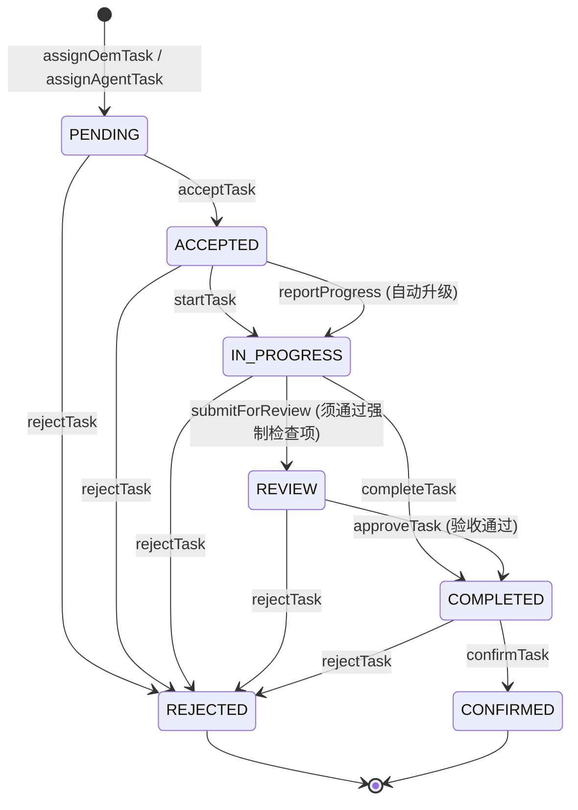
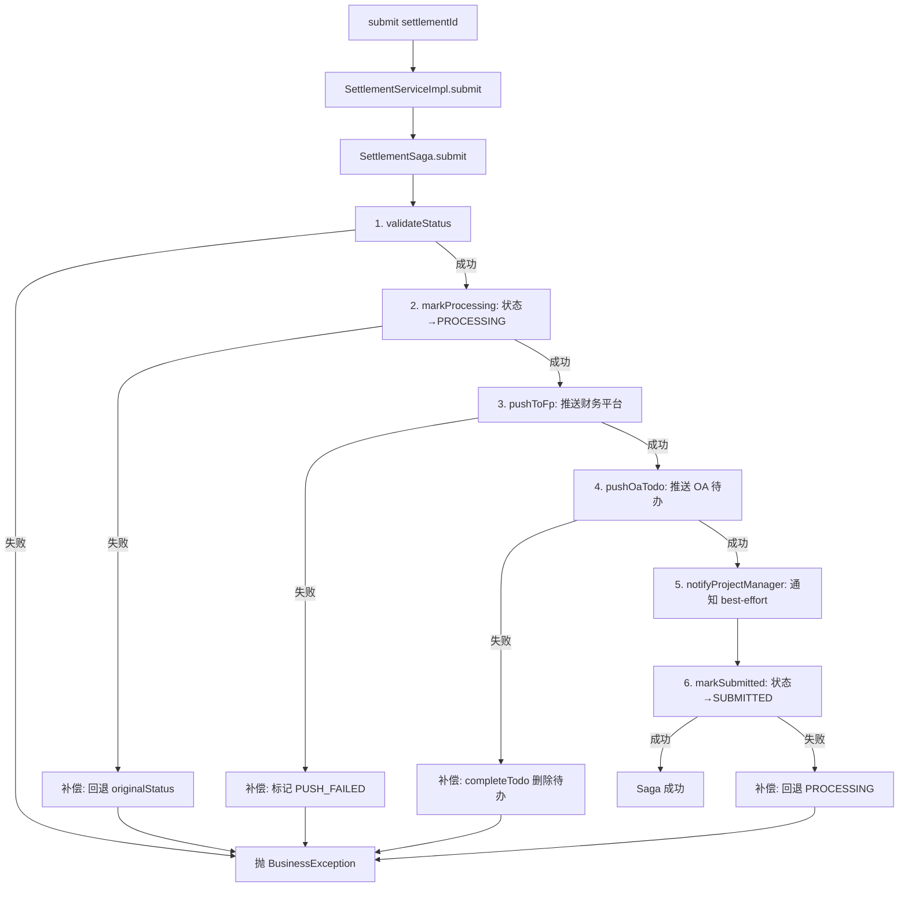

# pms-implementation 模块知识库

> 本文基于 `network-equipment-pms/pms-implementation` 模块源码（`com.dp.plat.implementation`）整理，记录实施管理领域的实体模型、7 态任务状态机、物化路径任务树、双轨进度汇总、强制检查项闸门、结算 Saga 编排、SPI 扩展点等核心机制。

## 模块概述

`pms-implementation` 是网络设备 PMS 平台的**实施管理领域模块**，负责设备到货后的现场实施任务管理，覆盖原厂（OEM）工程师实施与代理商（Agent）实施两条业务线，并延伸到任务层级、进度汇总、强制检查项、任务活动与评论、代理商评价、结算单提交等完整能力。

- **Maven 坐标**：`com.dp.plat:pms-implementation:1.0.0-SNAPSHOT`，父工程为 `com.dp.plat:network-equipment-pms`。
- **artifactId / name**：`pms-implementation`，description 为 `Implementation management domain (OEM + agent)`。
- **基础包名**：`com.dp.plat.implementation`，包说明（`package-info.java`）定位为 *"Implementation management domain module (OEM + agent)"*。
- **核心定位**：实施域的"任务中枢" —— 接收 `pms-project` 通过 SPI 下发的模板深拷贝任务，对接 `pms-workflow` 编排结算审批流程，调用 `pms-integration` 推送 FP/OA，借助 `pms-notification` 投递消息、`pms-file` 存储进度照片。

## 包结构

```
com.dp.plat.implementation
├── advice/                         # 模块级异常处理（TaskExceptionHandler）
├── controller/                     # 8 个 REST 控制器
├── dto/                            # 4 个数据传输对象
├── entity/                         # 9 个实体（@TableName 持久化）
├── exception/                      # 业务异常（TaskChecklistRequiredException）
├── mapper/                         # 9 个 MyBatis-Plus Mapper
├── saga/                           # 结算 Saga 编排（SettlementSaga + Context）
├── service/                        # 9 个 Service 接口 + NotificationService
│   └── impl/                       # 10 个 Service 实现
├── spi/                            # 2 个跨模块 SPI 实现
└── package-info.java               # 模块包说明
```

各包职责说明：

| 包 | 主要类型 | 职责 |
|----|----------|------|
| `advice` | `TaskExceptionHandler` | 模块级 `@RestControllerAdvice`，将 `TaskChecklistRequiredException` 转换为 HTTP 200 + 结构化失败响应 |
| `controller` | 8 个 `@RestController` | 暴露实施任务、进度、结算、代理商、评价、检查项、活动、评论的 REST API |
| `dto` | `TaskProgressVO`、`TaskReviewResult`、`SettlementCreateRequest`、`SettlementExportDTO` | 视图/请求/导出对象 |
| `entity` | 9 个 `@TableName` 实体 | 持久化模型（含 `@Version` 乐观锁字段） |
| `exception` | `TaskChecklistRequiredException` | 强制检查项未完成时抛出，携带未勾选列表与原状态 |
| `mapper` | 9 个 `BaseMapper` 子接口 | MyBatis-Plus 标准 CRUD + 个别自定义 SQL |
| `saga` | `SettlementSaga`、`SettlementSagaContext` | 结算单提交的 6 步 Saga 编排与补偿 |
| `service` / `service.impl` | 9 个 `I*Service` + `NotificationService` + 10 个实现 | 业务逻辑层 |
| `spi` | `TaskBatchCreatorImpl`、`TaskCompletionCheckerImpl` | 向 `pms-project` 暴露的跨模块扩展点 |

## 核心实体模型

模块共 9 个持久化实体，全部继承 `com.dp.plat.common.entity.BaseEntity`（含 id、createTime、updateTime、deleted 等公共字段）。

### 实体清单

| 实体 | 表名 | 中文含义 | 乐观锁 | 关键关系 |
|------|------|----------|--------|----------|
| `ImplTask` | `pms_impl_task` | 实施任务（核心） | `@Version` | 自关联 `parentTaskId`（物化路径任务树） |
| `ImplProgress` | `pms_impl_progress` | 实施进度日志 | — | N:1 → `ImplTask` |
| `TaskChecklist` | `pms_task_checklist` | 任务检查项 | `@Version` | N:1 → `ImplTask` |
| `TaskActivity` | `pms_task_activity` | 任务活动记录（追加型） | `@Version` | N:1 → `ImplTask` |
| `TaskComment` | `pms_task_comment` | 任务评论（二级回复） | `@Version` | N:1 → `ImplTask`，自关联 `parentCommentId` |
| `Agent` | `pms_agent` | 代理商/合作伙伴 | — | 1:N → `AgentScore`、`Settlement` |
| `AgentScore` | `pms_agent_score` | 代理商评价 | — | N:1 → `Agent`、`ImplTask` |
| `Settlement` | `pms_settlement` | 代理商结算单 | `@Version` | N:1 → `ImplTask`、`Agent`、`Project` |
| `SettlementDetail` | `pms_settlement_detail` | 结算明细行 | — | N:1 → `Settlement` |

### ImplTask 字段详解（核心实体）

`ImplTask` 是模块中枢，字段按职责分组如下：

**业务关键字段**

| 字段 | 类型 | 校验 | 说明 |
|------|------|------|------|
| `projectId` | `Long` | `@NotNull` | 所属项目ID |
| `milestoneId` | `Long` | — | 关联里程碑 |
| `phaseId` | `Long` | — | 关联项目阶段ID（`pms_project_phase.id`） |
| `taskName` | `String` | `@NotBlank` `@Size(max=200)` | 任务名称 |
| `taskType` | `String` | `@NotBlank` `@Size(max=20)` | `OEM` / `AGENT` |
| `agentId` | `Long` | — | 代理商ID（AGENT 类型使用） |
| `engineerId` | `Long` | — | OEM 工程师用户ID |
| `engineerName` | `String` | `@Size(max=50)` | 工程师姓名 |
| `planStartDate` / `planEndDate` | `LocalDate` | — | 计划开始/结束 |
| `actualStartDate` / `actualEndDate` | `LocalDate` | — | 实际开始/结束 |
| `status` | `String` | `@Size(max=50)` | 任务状态（7 态） |
| `progress` | `Integer` | `@Min(0)` `@Max(100)` | 进度百分比 0-100 |
| `workDescription` | `String` | `@Size(max=2000)` | 工作描述 |
| `acceptOpinion` / `acceptUserId` / `acceptUserName` / `acceptTime` | — | — | 验收/驳回意见与操作人 |

**服务执行字段（OEM/Agent 通用）**

| 字段 | 类型 | 说明 |
|------|------|------|
| `customerContact` | `String` | 客户联系人（≤100） |
| `serviceAddress` | `String` | 服务地址（≤500） |
| `serviceType` | `String` | `SITE_SURVEY`/`INSTALL`/`DEBUG`/`MAINTENANCE` |
| `sopSteps` | `String` | 标准作业步骤（长文本） |
| `materialList` | `String` | 所需物料清单（长文本） |
| `plannedHours` | `Integer` | 计划工时（**进度汇总权重**） |
| `skillLevel` | `String` | `JUNIOR`/`SENIOR`/`EXPERT` |
| `safetyPpe` | `String` | 安全要求：`PPE`/`LOTO`/`PERMIT` |
| `evidenceCheckpoints` | `String` | 证据检查点定义（长文本） |
| `signOffRequired` | `Boolean` | 是否需要正式签收（默认 `true`） |

**任务层级与汇总字段（V67 扩展）**

| 字段 | 类型 | 默认值 | 说明 |
|------|------|--------|------|
| `parentTaskId` | `Long` | `null` | 父任务ID（NULL=顶层） |
| `taskPath` | `String` | `"/"` | 物化路径，格式 `/12/45/78/` |
| `depth` | `Integer` | `0` | 层级深度（0=顶层） |
| `priority` | `String` | `"MEDIUM"` | `LOW`/`MEDIUM`/`HIGH`/`CRITICAL` |
| `actualHours` | `BigDecimal` | — | 实际工时 |
| `remainingHours` | `BigDecimal` | — | 剩余工时 |
| `taskWeight` | `BigDecimal` | `BigDecimal.ONE` | 自定义汇总权重 |
| `version` | `Integer` | — | `@Version` 乐观锁 |

### 其他实体要点

- **ImplProgress**：`taskId` + `progressPercent`（0-100）+ `workLog` + `photoUrls`（逗号分隔）+ `reportUserId/reportUserName/reportTime`。
- **TaskChecklist**：`taskId` + `title`（≤128）+ `description`（≤500）+ `mandatory`（默认 `false`）+ `checked`（默认 `false`）+ `checkedBy/checkedAt` + `sortOrder`（默认 0）。
- **TaskActivity**：追加型活动记录，`activityType` 取值 `CREATE`/`UPDATE`/`STATUS_CHANGE`/`SUBMIT_REVIEW`/`APPROVE`/`REJECT`/`CHECKLIST_CHECK`/`COMMENT`/`PROGRESS_CHANGE`/`ASSIGN`/`MOVE`，`metadata` 为 JSON 字符串（如 old_value/new_value）。
- **TaskComment**：`taskId` + `userId/userName` + `content` + `parentCommentId`（NULL=顶级评论，非 NULL=二级回复）。
- **Agent**：`agentName`/`agentCode`/`contactPerson`/`contactPhone`/`qualification`/`status`（1=启用 0=禁用）/`overallScore`（0-10 综合分）/`certLevel`（`SELECT`/`PREMIER`/`SILVER`/`GOLD`）/`ccieCount`/`specializations`（JSON 文本）/`certExpiryDate`。
- **AgentScore**：3 维度评分（`responseSpeedScore`/`constructionQualityScore`/`documentCompletenessScore`，0-10）+ `overallScore`（3 维度平均）+ `comment` + `evaluatorId/evaluatorName/evaluateTime`。
- **Settlement**：`taskId` + `agentId` + `projectId` + `settlementNo`（`ST`+yyyyMMddHHmmss+4位随机）+ `totalAmount`/`taxRate`（默认 13.00）/`taxAmount`/`totalWithTax` + `status`（`PENDING`/`APPROVED`/`REJECTED`/`PUSHED`）+ `pushStatus`（`SUCCESS`/`FAILED`）+ `pushTime`/`pushResponse` + `processInstanceId`（工作流实例ID）。
- **SettlementDetail**：`settlementId` + `itemName`（≤200）+ `workQuantity` + `unit`（≤20）+ `unitPrice` + `amount` + `remarks`（≤500）。

## 任务状态机

### 状态枚举（7 态）

`ImplTaskServiceImpl` 中以 `public static final String` 形式定义状态常量：

| 状态 | 常量 | 含义 | 进入条件 |
|------|------|------|----------|
| `PENDING` | `STATUS_PENDING` | 待接单 | `assignOemTask` / `assignAgentTask` 新建任务 |
| `ACCEPTED` | `STATUS_ACCEPTED` | 已接单 | `acceptTask` 从 `PENDING` 流转 |
| `IN_PROGRESS` | `STATUS_IN_PROGRESS` | 进行中 | `startTask` 从 `ACCEPTED` 流转；或 `reportProgress` 时自动从 `ACCEPTED` 升级 |
| `REVIEW` | `STATUS_REVIEW` | 评审中 | `submitForReview` 从 `IN_PROGRESS` 流转（须通过强制检查项闸门） |
| `COMPLETED` | `STATUS_COMPLETED` | 已完成 | `completeTask` 从 `IN_PROGRESS` 流转；或 `approveTask` 从 `REVIEW` 验收通过 |
| `CONFIRMED` | `STATUS_CONFIRMED` | 已确认 | `confirmTask` 从 `COMPLETED` 流转 |
| `REJECTED` | `STATUS_REJECTED` | 已驳回 | `rejectTask` 流转（任意状态可驳回） |

> 注意：实体字段注释列出的是 `PENDING, ACCEPTED, IN_PROGRESS, COMPLETED, CONFIRMED, REJECTED` 6 个原始态；V67 协作扩展新增了 `REVIEW` 评审中状态，构成完整的 7 态机。`TaskProgressVO.completedSubtasks` 在统计已完成数时将 `COMPLETED` 与 `CONFIRMED` 都视为已完成。

### 流转规则

`ImplTaskServiceImpl` 的各方法严格校验前置状态，否则抛 `BusinessException`：

| 方法 | 前置状态 | 目标状态 | 副作用 |
|------|----------|----------|--------|
| `assignOemTask` / `assignAgentTask`（新建分支） | — | `PENDING` | `progress=0`，发派工/委派通知 |
| `acceptTask` | `PENDING` | `ACCEPTED` | 设置 `actualStartDate` |
| `startTask` | `ACCEPTED` | `IN_PROGRESS` | 若 `actualStartDate` 为空则补填 |
| `reportProgress` | `ACCEPTED`/`IN_PROGRESS` | 自动升级到 `IN_PROGRESS` | 写进度日志，更新 `progress`，异步触发 `taskRollupService.recalculateProgress` |
| `completeTask` | `IN_PROGRESS` | `COMPLETED` | `progress=100`，设置 `actualEndDate`，异步触发汇总 |
| `submitForReview` | `IN_PROGRESS` | `REVIEW` | **强制检查项闸门校验**，未通过抛 `TaskChecklistRequiredException` |
| `approveTask` | `REVIEW` | `COMPLETED` | `progress=100`，记录验收人，异步触发汇总 |
| `confirmTask` | `COMPLETED` | `CONFIRMED` | 记录验收意见与验收人 |
| `rejectTask` | 任意 | `REJECTED` | 记录驳回意见与操作人 |

### 状态流转图



## 物化路径任务树

### 设计

`ImplTask` 采用**物化路径（Materialized Path）**模型表示任务层级，由 3 个字段协同：

- `parentTaskId`：直接父任务ID，`null` 表示顶层任务。
- `taskPath`：物化路径字符串，格式 `/<id>/<id>/<id>/`，例如 `/12/45/78/` 表示从根 12 → 45 → 78。默认值 `"/"`（未设置）。
- `depth`：层级深度，0=顶层，子任务 = 父 depth + 1。
- `taskWeight`：自定义汇总权重（`BigDecimal.ONE`，配置 `task.rollup.weight.field=TASK_WEIGHT` 时启用）。

**路径约定**（与 `TaskBatchCreatorImpl`、`moveTask` 一致）：
- 顶层任务：`/<id>/`
- 子任务：`<父taskPath><id>/`

### 查询模式

**子树查询**（`getTaskSubtree`）使用 MyBatis-Plus `likeRight` 前缀匹配：

```java
this.list(new LambdaQueryWrapper<ImplTask>()
        .likeRight(ImplTask::getTaskPath, path)  // LIKE 'path%'
        .orderByAsc(ImplTask::getDepth)
        .orderByAsc(ImplTask::getId));
```

返回结果含自身及所有后代，按 `depth` 升序便于层级展示。

**直接子任务查询**（`buildProgressVO`、`TaskRollupServiceImpl`）：

```java
new LambdaQueryWrapper<ImplTask>()
        .eq(ImplTask::getParentTaskId, taskId)
```

### 移动任务（`moveTask`）

`moveTask(Long taskId, Long newParentId)` 在单事务内完成：

1. **环路校验**：若 `newParentId == taskId` 抛 *"不能将任务移动到自身下"*；若新父任务的 `taskPath` 以当前任务路径为前缀（说明新父是当前任务的后代），抛 *"不能将任务移动到其自身或子任务下（避免环路）"*。
2. **计算新路径与深度**：
   - `newParentId == null`（提升为顶层）：`newTaskPath = "/" + taskId + "/"`，`newDepth = 0`。
   - 否则：`newTaskPath = newParentPath + taskId + "/"`，`newDepth = parent.depth + 1`。
3. **更新被移动任务自身**：写回 `parentTaskId`、`taskPath`、`depth`。
4. **批量更新所有后代**：通过 `likeRight(oldTaskPath)` 查询后代（排除自身），对每个后代：
   - 前缀替换：`descPath = newTaskPath + descPath.substring(oldTaskPath.length())`
   - 深度平移：`desc.depth += (newDepth - oldDepth)`

### SPI 深拷贝与路径回填

`TaskBatchCreatorImpl.batchCreateTasks`（详见后文 SPI 章节）在模板深拷贝时采用**两阶段创建**策略处理路径：

- 第一遍：插入全部任务（`parentTaskId=null`、`taskPath="/"`、`depth=0`），构建 `taskName → taskId` 映射。
- 第二遍：根据 `TaskDef.parentTaskName` 回填 `parentTaskId`、`taskPath`、`depth`，与 `moveTask` 路径约定完全一致。

## 双轨进度汇总

模块采用**同步递归 + 异步持久化**双轨设计，分别服务于"读"与"写"两类场景。

### 同步递归计算（`ImplTaskServiceImpl.buildProgressVO`）

`getTaskProgress(taskId)` 同步递归构建 `TaskProgressVO`，用于 API 实时返回，**不写库**：

```
rolledUpProgress = Σ(子任务 rolledUpProgress × weight) / Σ(weight)
weight = plannedHours（缺省 1）
无子任务时 rolledUpProgress = selfProgress
```

返回结构 `TaskProgressVO`：

| 字段 | 类型 | 说明 |
|------|------|------|
| `taskId` / `taskName` | — | 任务标识 |
| `selfProgress` | `Integer` | 任务自身填报进度 |
| `rolledUpProgress` | `Integer` | 加权汇总进度 |
| `totalSubtasks` | `Integer` | 子任务总数（递归） |
| `completedSubtasks` | `Integer` | 已完成子任务数（`COMPLETED`/`CONFIRMED` 计入） |
| `status` | `String` | 任务状态 |
| `children` | `List<TaskProgressVO>` | 直接子任务的进度视图（递归） |

权重解析方法 `resolveRollupWeight`：优先 `plannedHours`，为空或非正时返回 1。

### 异步持久化（`TaskRollupServiceImpl.recalculateProgress`）

`reportProgress`、`completeTask`、`approveTask` 等写操作完成后，会调用 `taskRollupService.recalculateProgress(taskId)` 异步向上回溯祖先链路，将汇总值持久化到 `pms_impl_task.progress` 字段。

**关键设计**：

- **`@Async` + `@Retryable`** 同时标注（TD-P8-007 修复）：异步调度后在线程内执行重试，最多 3 次，间隔 1 秒、倍数 2（指数退避）。
  ```java
  @Async
  @Retryable(maxAttempts = 3, backoff = @Backoff(delay = 1000, multiplier = 2), retryFor = Exception.class)
  @Override
  public void recalculateProgress(Long taskId) { ... }
  ```
- **向上回溯算法**：从 `taskId` 开始，逐层向上对每个祖先查询直接子任务，执行加权平均，仅在汇总值变化时写库（减少无意义写）。
- **`@Recover` 终失败回调**：3 次重试均失败后调用 `recover(Exception e, Long taskId)`，仅记录 `ERROR` 日志（含 taskId、异常类型、消息与堆栈），不进行额外通知；后续可扩展为接入消息队列或告警。
- **权重公式**：`rolledUp = Σ(child.progress × weight) / Σ(weight)`，`weight = plannedHours`（缺省 `DEFAULT_WEIGHT=1`），结果 `Math.round` 四舍五入为整数百分比。
- **叶子节点**：无子任务时跳过自身进度更新，仅作为权重来源参与父任务汇总。

### 双轨协作关系

| 维度 | 同步递归（buildProgressVO） | 异步持久化（recalculateProgress） |
|------|------------------------------|------------------------------------|
| 触发 | `GET /{id}/progress` | `reportProgress` / `completeTask` / `approveTask` 写后 |
| 目的 | 实时返回完整子树进度 VO | 将汇总值落地到 `pms_impl_task.progress` |
| 一致性 | 总是最新（基于子任务当前 progress 计算） | 最终一致（异步、有重试延迟） |
| 写库 | 否 | 是（仅变化时写） |
| 失败处理 | 抛 `BusinessException` 给调用方 | 重试 3 次后 `@Recover` 记日志 |
| 用途 | API 响应、前端展示 | 列表查询、报表、阶段完成率校验 |

## 强制检查项闸门

### 实体与标记

`TaskChecklist.mandatory=true` 标识强制检查项，`checked` 字段记录是否已勾选。`toggleCheck` 接口在勾选时记录 `checkedBy`/`checkedAt`，取消勾选时清空这两个字段。

### 闸门逻辑（`submitForReview`）

`IImplTaskService.submitForReview(Long taskId, Long operatorId)` 实现强制检查项闸门：

1. 加载任务，校验状态必须为 `IN_PROGRESS`（否则抛 *"当前任务状态不允许提交评审"*）。
2. 查询该任务所有 `mandatory=true` 的检查项。
3. 过滤出 `checked != true` 的条目，得到 `uncheckedMandatory` 列表。
4. **若 `uncheckedMandatory` 非空 → 拦截状态流转**：抛出 `TaskChecklistRequiredException(uncheckedMandatory, task.getStatus())`，任务**保持原状态**（`IN_PROGRESS`）。
5. 若全部强制检查项已勾选 → 更新任务状态为 `REVIEW`，返回 `TaskReviewResult{success=true, taskStatus=REVIEW}`。

### 异常与响应结构

`TaskChecklistRequiredException` 携带：

- `uncheckedMandatoryItems`：未勾选的强制检查项列表。
- `taskStatus`：当前任务状态（提交评审被拦截时保持原状态）。
- 常量 `ERROR_CODE = "TASK_CHECKLIST_REQUIRED"`、`ERROR_MESSAGE = "存在未完成的强制检查项"`。

`TaskExceptionHandler`（`@Order(HIGHEST_PRECEDENCE)` 的 `@RestControllerAdvice`）将其转换为：

- **HTTP 200** + `Result.ok(result)`，其中 `result` 为 `TaskReviewResult`：
  - `success = false`
  - `errorCode = "TASK_CHECKLIST_REQUIRED"`
  - `errorMessage = "存在未完成的强制检查项"`
  - `uncheckedMandatoryItems = [...]`
  - `taskStatus = <原状态>`

> 设计要求 `code=200 + data.success=false`，便于前端按业务结果分支处理（而非依赖 HTTP 状态码）。

### 检查项 CRUD（`TaskChecklistController`）

| 端点 | 方法 | 权限 | 说明 |
|------|------|------|------|
| `GET /api/implementation/task/checklist/{taskId}` | list | — | 查询任务检查项（按 sortOrder 升序） |
| `POST /api/implementation/task/checklist` | create | `project:task:edit` | 新增检查项 |
| `PUT /api/implementation/task/checklist` | update | `project:task:edit` | 更新（仅可编辑字段，保留勾选状态） |
| `POST /api/implementation/task/checklist/{id}/check?checked=` | toggleCheck | `project:task:edit` | 勾选/取消勾选 |
| `DELETE /api/implementation/task/checklist/{id}` | delete | `project:task:edit` | 逻辑删除 |

## 结算 Saga

### 概述

结算单提交流程采用 **Saga 编排模式**（基于 `pms-common` 的 `SagaCoordinator`），由 `SettlementSaga` 编排 6 个步骤，任一步骤失败时按反向顺序执行已成功步骤的补偿动作。

`SettlementServiceImpl.submit(settlementId)` 加载结算单后委托给 `settlementSaga.submit(settlement)`，根据 `SagaResult` 决定是否抛 `BusinessException`。

### Saga 上下文（`SettlementSagaContext`）

继承 `com.dp.plat.common.saga.SagaContext`，在步骤间传递：

| 字段 | 说明 |
|------|------|
| `settlement` | 结算单实体，步骤中直接修改其状态字段并持久化 |
| `originalStatus` | Saga 开始前的原始状态，用于校验与异常回退 |
| `oaBusinessKey` | OA 待办的业务键（结算单号），补偿时用于调用 `completeTodo` |
| `fpPushError` | FP 推送失败时的错误信息，补偿时写入 `pushResponse` |

### 6 步编排流程

| # | 步骤名 | 动作 | 补偿动作 |
|---|--------|------|----------|
| 1 | `validateStatus` | 校验状态为 `DRAFT`/`PENDING`，否则抛 *"当前结算单状态不允许提交"* | 无（校验步骤） |
| 2 | `markProcessing` | 更新状态为 `PROCESSING` | `compensateMarkProcessing`：回退为 `originalStatus` |
| 3 | `pushToFp` | 构建 `SettlementPushRequest`（含明细 + 代理商名），调用 `FpIntegrationService.pushSettlement`；成功记 `PUSH_SUCCESS` + `pushResponse` + `pushTime` | `compensatePushToFp`：标记 `PUSH_FAILED`，`pushResponse="Saga 补偿: <reason>"` |
| 4 | `pushOaTodo` | 构建 `OaTodoRequest`（标题/内容/businessKey=settlementNo/businessType=`SETTLEMENT_SUBMITTED`/processInstanceId），调用 `OaIntegrationService.pushTodo` | `compensatePushOaTodo`：调用 `oaIntegrationService.completeTodo(businessKey)`（幂等，对已完成待办为 no-op） |
| 5 | `notifyProjectManager` | 构建 `Notification`（category=`SETTLEMENT`、bizType=`SETTLEMENT_SUBMITTED`、bizId=settlement.id），通过 `INotificationService.multiChannelSend` 投递 `IN_APP`+`WS` 通道 | 无（best-effort，失败仅记日志不阻断） |
| 6 | `markSubmitted` | 更新状态为 `SUBMITTED` | `compensateMarkSubmitted`：回退为 `PROCESSING` |

### 关键设计要点

- **事务边界**：每个步骤的 DB 写操作独立提交（MyBatis-Plus mapper 无外层事务时自动提交单条语句），`submit` 方法本身**不加** `@Transactional`，避免跨步骤大事务导致补偿无法生效。
- **幂等性**：所有补偿动作设计为幂等 —— 状态回退重复设置相同值无副作用；`completeTodo` 对已完成待办为 no-op。补偿可能被多次调用（人工重试场景）。
- **FP 推送与对账**：`FpIntegrationService.pushSettlement` 内置 Resilience4j 熔断/隔离/重试保护，并在同步失败后调度后台指数退避重试。Saga 在同步失败时即补偿本地状态；若后台重试后续成功，需由对账任务修正 `pushStatus`。
- **通知 best-effort**：步骤 5 通知失败仅记 `ERROR` 日志，不抛异常、不触发补偿，避免通知抖动影响主流程。
- **Saga 名称**：`SAGA_NAME = "SettlementSubmit"`，用于日志标识。
- **状态常量**：`STATUS_DRAFT`/`STATUS_PENDING`/`STATUS_PROCESSING`/`STATUS_SUBMITTED`，FP 推送 `PUSH_SUCCESS`/`PUSH_FAILED`。

### 流程图



### 与审批流的关系

`SettlementServiceImpl.createSettlement` 在创建结算单时同步启动 `settlementApproval` 工作流（`pms-workflow` 的 `WorkflowService.startProcess`），将 `processInstanceId` 回写到结算单。`approve` / `reject` 通过 `ISettlementService` 直接流转结算单状态并推送 FP（非 Saga 路径）；`submit` 走 Saga 编排用于"提交至 FP + OA 待办 + 通知"的复合场景。

## SPI 机制

模块向 `pms-project` 暴露 2 个 SPI 实现，避免 `pms-project` 直接依赖 `pms-implementation`（保持依赖单向）。

### 1. TaskBatchCreatorImpl（模板深拷贝）

- **实现接口**：`com.dp.plat.common.spi.TaskBatchCreator`
- **方法**：`batchCreateTasks(Long projectId, Long phaseId, List<TaskDef> taskDefs)`
- **场景**：TD-P8-003 模板深拷贝。`pms-project` 从模板创建项目时，通过 SPI 跨模块调用本实现，批量插入任务记录到 `pms_impl_task`。
- **默认值**：`status=PENDING`、`priority=MEDIUM`、`progress=0`、`signOffRequired=true`、`taskWeight=BigDecimal.ONE`。
- **两阶段创建**：
  1. 第一遍：插入全部任务（`parentTaskId=null`、`taskPath="/"`、`depth=0`），构建 `taskName → taskId` 映射。
  2. 第二遍：根据 `TaskDef.parentTaskName` 回填 `parentTaskId`、`taskPath`、`depth`。顶层任务 `taskPath = "/<id>/"`；子任务 `taskPath = parentPath + childId + "/"`，`depth = parent.depth + 1`。
- **容错**：若父任务名未找到，记 `WARN` 日志并跳过父任务关联（不阻断整体创建）。

### 2. TaskCompletionCheckerImpl（阶段任务完成率校验）

- **实现接口**：`com.dp.plat.common.spi.TaskCompletionChecker`
- **方法**：`findUncompletedTasks(Long phaseId) → List<TaskCompletionViolation>`
- **场景**：TD-P8-005。供 `pms-project` 的 `validateExitGate` TASK 分支跨模块查询阶段下未完成任务。
- **判定逻辑**：查询 `pms_impl_task` 中 `phaseId = ?` 且 `status != COMPLETED` 的任务，返回违规列表。空列表表示该阶段无任务或全部已完成。
- **违规结构**：`TaskCompletionViolation{taskId, taskName, expectedStatus="COMPLETED", actualStatus}`。

## Service 层与 API 端点

### Service 接口清单

| 接口 | 实现 | 关键方法 |
|------|------|----------|
| `IImplTaskService` | `ImplTaskServiceImpl` | `assignOemTask`、`assignAgentTask`、`acceptTask`、`startTask`、`reportProgress`、`completeTask`、`confirmTask`、`rejectTask`、`getByProjectId`、`list`、`submitForReview`、`approveTask`、`moveTask`、`getTaskSubtree`、`getTaskProgress` |
| `ITaskRollupService` | `TaskRollupServiceImpl` | `recalculateProgress`（`@Async` + `@Retryable`） |
| `ISettlementService` | `SettlementServiceImpl` | `createSettlement`、`approve`、`reject`、`submit`、`list` |
| `ITaskChecklistService` | `TaskChecklistServiceImpl` | `listByTaskId`、`create`、`update`、`delete`、`toggleCheck` |
| `ITaskActivityService` | `TaskActivityServiceImpl` | `listByTaskId`、`record` |
| `ITaskCommentService` | `TaskCommentServiceImpl` | `listByTaskId`、`create`、`delete` |
| `IAgentService` | `AgentServiceImpl` | `getScore`、`list` |
| `IAgentScoreService` | `AgentScoreServiceImpl` | `evaluate`、`listByAgentId` |
| `IImplProgressService` | `ImplProgressServiceImpl` | `listByTaskId`、`create` |
| `NotificationService` | `NotificationServiceImpl` | `notifyUser`（委托 `pms-notification` 的 `INotificationService.multiChannelSend`） |

### 关键方法说明

- **`IImplTaskService.getByProjectId(Long projectId)`**：按项目ID查询任务列表，按 `createTime` 倒序，对应 `GET /api/implementation/task/project/{projectId}`。
- **`IImplTaskService.list(int page, int size, ImplTask filters)`**：分页查询，支持 `projectId`/`taskType`/`status`/`agentId`/`engineerId`/`taskName`（like）过滤。
- **`ISettlementService.createSettlement`**：从明细计算 `totalAmount`（`workQuantity × unitPrice`），按 `taxRate`（默认 13.00）算 `taxAmount` 与 `totalWithTax`，生成 `settlementNo`，状态置 `PENDING`，记业务指标 `BusinessMetrics.recordSettlementAmount`，并启动 `settlementApproval` 工作流。
- **`IAgentScoreService.evaluate`**：3 维度均值算 `overallScore`，保存后**重算** `Agent.overallScore`（所有评价 `overallScore` 的平均）。
- **`IAgentService.getScore`**：返回代理商综合分（含 `avgResponseSpeed`/`avgConstructionQuality`/`avgDocumentCompleteness`/`overallScore`/`evaluationCount`）。

### REST API 端点

#### ImplTaskController（`/api/implementation/task`）

| 方法 | 路径 | 权限 | 说明 |
|------|------|------|------|
| POST | `/oem/assign` | `implementation:implTask:add` | 派工 OEM 任务 |
| POST | `/agent/assign` | `implementation:implTask:add` | 委派 Agent 任务 |
| POST | `/{id}/accept` | `implementation:implTask:edit` | 接单 |
| POST | `/{id}/start` | `implementation:implTask:edit` | 开始 |
| POST | `/{id}/progress` | `implementation:implTask:edit` | 上报进度 |
| POST | `/{id}/complete` | `implementation:implTask:edit` | 完成 |
| POST | `/{id}/confirm` | `implementation:implTask:confirm` | 确认 |
| POST | `/{id}/reject` | `implementation:implTask:confirm` | 驳回 |
| GET | `/{id}` | `implementation:implTask:list` | 详情 |
| GET | `/list` | `implementation:implTask:list` | 分页查询 |
| GET | `/project/{projectId}` | `implementation:implTask:list` | 按项目查询 |
| GET | `/{id}/subtree` | `implementation:implTask:list` | 子树查询 |
| POST | `/{id}/move` | `project:task:move` | 移动任务 |
| POST | `/{id}/submit-review` | `project:task:complete` | 提交评审 |
| POST | `/{id}/approve` | `project:task:approve` | 验收通过 |
| GET | `/{id}/progress` | `implementation:implTask:list` | 任务进度（含子任务汇总） |

#### ImplProgressController（`/api/impl/progress`）

| 方法 | 路径 | 权限 | 说明 |
|------|------|------|------|
| GET | `/task/{taskId}` | — | 按任务查进度日志 |
| POST | `` | `implementation:implProgress:add` | 新建进度日志 |
| POST | `/{id}/photos` | `implementation:implProgress:edit` | 上传实施照片（bizType=`IMPL_PROGRESS`） |
| GET | `/{id}/photos` | — | 列出实施照片 |
| DELETE | `/photos/{attachmentId}` | `implementation:implProgress:remove` | 删除单张照片 |

#### SettlementController（`/api/impl/settlement`）

| 方法 | 路径 | 权限 | 附加注解 | 说明 |
|------|------|------|----------|------|
| POST | `` | `implementation:settlement:add` | `@RateLimit` + `@Idempotent` | 创建结算单（含明细） |
| POST | `/{id}/approve` | `implementation:settlement:approve` | `@RateLimit` + `@Idempotent` | 审批通过 |
| POST | `/{id}/reject` | `implementation:settlement:approve` | `@RateLimit` | 驳回 |
| GET | `/{id}` | `implementation:settlement:list` | — | 详情 |
| GET | `/list` | `implementation:settlement:list` | — | 分页查询 |
| GET | `/export` | `implementation:settlement:export` | — | 导出 Excel（`SettlementExportDTO`） |

#### AgentController（`/api/impl/agent`）与 AgentScoreController（`/api/impl/agent/score`）

| 方法 | 路径 | 权限 | 说明 |
|------|------|------|------|
| GET | `/api/impl/agent/list` | `implementation:agent:list` | 分页查询代理商 |
| GET | `/api/impl/agent/{id}` | `implementation:agent:list` | 详情 |
| POST | `/api/impl/agent` | `implementation:agent:add` | 新增 |
| PUT | `/api/impl/agent` | `implementation:agent:edit` | 更新 |
| DELETE | `/api/impl/agent/{id}` | `implementation:agent:remove` | 删除 |
| GET | `/api/impl/agent/{id}/scores` | `implementation:agent:list` | 平均分 |
| POST | `/api/impl/agent/score/evaluate` | `implementation:agentScore:add` | 评价代理商 |
| GET | `/api/impl/agent/score/agent/{agentId}` | — | 按代理商查评价列表 |

#### TaskActivityController（`/api/implementation/task/activity`，只读）

| 方法 | 路径 | 说明 |
|------|------|------|
| GET | `/{taskId}` | 查询任务活动记录（按时间倒序） |

#### TaskCommentController（`/api/implementation/task/comment`）

| 方法 | 路径 | 权限 | 说明 |
|------|------|------|------|
| GET | `/{taskId}` | — | 查询评论（按时间正序） |
| POST | `` | `project:task:edit` | 新增评论 |
| DELETE | `/{id}` | `project:task:edit` | 删除评论 |

## 模块依赖关系

### Maven 依赖（`pom.xml`）

| 依赖 | 用途 |
|------|------|
| `pms-common` | 基础设施：`BaseEntity`、`BusinessException`、`SecurityUtils`、`Result`、`SagaCoordinator`、SPI 接口、`BusinessMetrics`、`ExcelUtils`、注解（`@OperLog`/`@RateLimit`/`@Idempotent`） |
| `pms-workflow` | `WorkflowService`、`StartProcessRequest`、`ProcessInstanceDTO`：结算审批流程启动 |
| `pms-integration` | `FpIntegrationService`、`OaIntegrationService`、FP/OA 模型（`SettlementPushRequest`/`FpResponse`/`OaTodoRequest`）：结算 Saga 调用 |
| `pms-notification` | `INotificationService`、`Notification`：派工/审批/提交通知多通道投递 |
| `pms-file` | `IAttachmentService`、`Attachment`：实施进度照片上传与管理 |
| `spring-retry` | `@Retryable`/`@Backoff`/`@Recover`：`TaskRollupServiceImpl` 异步重试 |
| `spring-boot-starter-test`（test） | 测试支持 |

### 调用关系图

```mermaid
flowchart LR
    subgraph upstream[上游调用方]
        PP[pms-project]
    end
    subgraph impl[pms-implementation]
        SPI[spi: TaskBatchCreator / TaskCompletionChecker]
        TS[ImplTaskService]
        SS[SettlementService]
        SAGA[SettlementSaga]
        RS[TaskRollupService]
        NS[NotificationService impl]
    end
    subgraph downstream[下游被依赖模块]
        PW[pms-workflow]
        PI[pms-integration]
        PN[pms-notification]
        PF[pms-file]
        PC[pms-common]
    end

    PP -->|SPI 调用| SPI
    SPI --> TS
    TS -->|@Async 触发| RS
    TS -->|notifyUser| NS
    SS -->|submit| SAGA
    SS -->|startProcess| PW
    SAGA -->|pushSettlement| PI
    SAGA -->|pushTodo / completeTodo| PI
    SAGA -->|multiChannelSend| PN
    SS -->|multiChannelSend| PN
    NS -->|multiChannelSend| PN
    ImplProgressController -->|upload| PF
    RS --> PC
    TS --> PC
```

### 反向依赖

`pms-implementation` 的 `ImplTaskMapper.selectTaskNameById` 提供自定义 SQL（`SELECT task_name FROM pms_impl_task WHERE id = ? AND deleted = 0`），供 `pms-baseline` 循环依赖检测拼装闭环路径使用（跨模块只读查询）。

## 关键技术点

### 1. 乐观锁并发控制

`ImplTask`、`TaskChecklist`、`Settlement`、`TaskActivity`、`TaskComment` 均使用 MyBatis-Plus `@Version` 字段（`private Integer version`），并发更新冲突时由框架抛出乐观锁异常，配合 `@Transactional(rollbackFor = Exception.class)` 保证写操作原子性。

### 2. 异步重试进度汇总

`TaskRollupServiceImpl.recalculateProgress` 同时标注 `@Async` 与 `@Retryable`：

```java
@Async
@Retryable(maxAttempts = 3, backoff = @Backoff(delay = 1000, multiplier = 2), retryFor = Exception.class)
@Override
public void recalculateProgress(Long taskId) { ... }

@Recover
public void recover(Exception e, Long taskId) { ... }
```

Spring 代理顺序确保先异步调度、后在异步线程内执行重试逻辑；3 次失败后由 `@Recover` 记录最终错误日志（TD-P8-007 修复）。

### 3. Saga 编排与补偿

`SettlementSaga` 基于 `pms-common` 的 `SagaCoordinator`，每个 `SagaStep` 由 `of(name, action)` 或 `of(name, action, compensate)` 构造。`submit` 方法不加 `@Transactional`，每步 DB 写独立提交，确保补偿能看到中间状态；所有补偿动作幂等。

### 4. 强制检查项闸门与结构化失败响应

`TaskChecklistRequiredException` 携带未勾选列表与原状态，由 `TaskExceptionHandler`（`@Order(HIGHEST_PRECEDENCE)`）转换为 HTTP 200 + `Result.ok(TaskReviewResult{success=false, errorCode="TASK_CHECKLIST_REQUIRED"})`，前端按业务结果分支处理而非依赖 HTTP 状态码。

### 5. 物化路径任务树与环路校验

`moveTask` 通过 `taskPath.startsWith(oldTaskPath)` 检测环路（新父是当前任务的后代时拒绝），移动后批量前缀替换后代路径 + depth 平移。`getTaskSubtree` 使用 `likeRight` 前缀匹配（`LIKE 'path%'`）高效查询子树。

### 6. 结算单号生成

`generateSettlementNo()` 生成规则：`"ST" + yyyyMMddHHmmss + 4位随机数(0-9999, 左补零)`，例如 `ST20260722143052-0042`，保证全局唯一性与可读性。

### 7. 业务指标埋点

`SettlementServiceImpl.createSettlement` 调用 `BusinessMetrics.recordSettlementAmount(totalAmount, "CNY")` 记录结算金额分布（Settlement 无币种字段，默认 CNY），用于运营监控。

### 8. 接口防护三件套

`SettlementController` 创建/审批端点叠加：
- `@RateLimit`：令牌桶限流，按 `SecurityUtils.getCurrentUserId()` 限流，容量 10、每 60 秒补充 10 个令牌。
- `@Idempotent`：幂等控制，防止重复提交。
- `@PreAuthorize`：Spring Security 权限校验。
- `@OperLog`：操作日志记录（businessType: 1=新增、2=修改、3=删除、4=导出）。

### 9. 通知委托模式

`NotificationServiceImpl`（bean 名 `implementationNotificationServiceImpl`）将实施域的简单通知调用 `notifyUser(userId, title, content)` 转换为 `pms-notification` 的多通道投递（`IN_APP` + `WS`），统一进入消息中心并被实时推送，避免实施域直接管理通知基础设施。

### 10. 模板深拷贝两阶段创建

`TaskBatchCreatorImpl` 通过 `taskName → taskId` 映射解决"父任务ID在插入前未知"的问题：第一遍全部插入（路径留空），第二遍按 `parentTaskName` 回填父子关系与物化路径，避免循环依赖与多次扫表。
