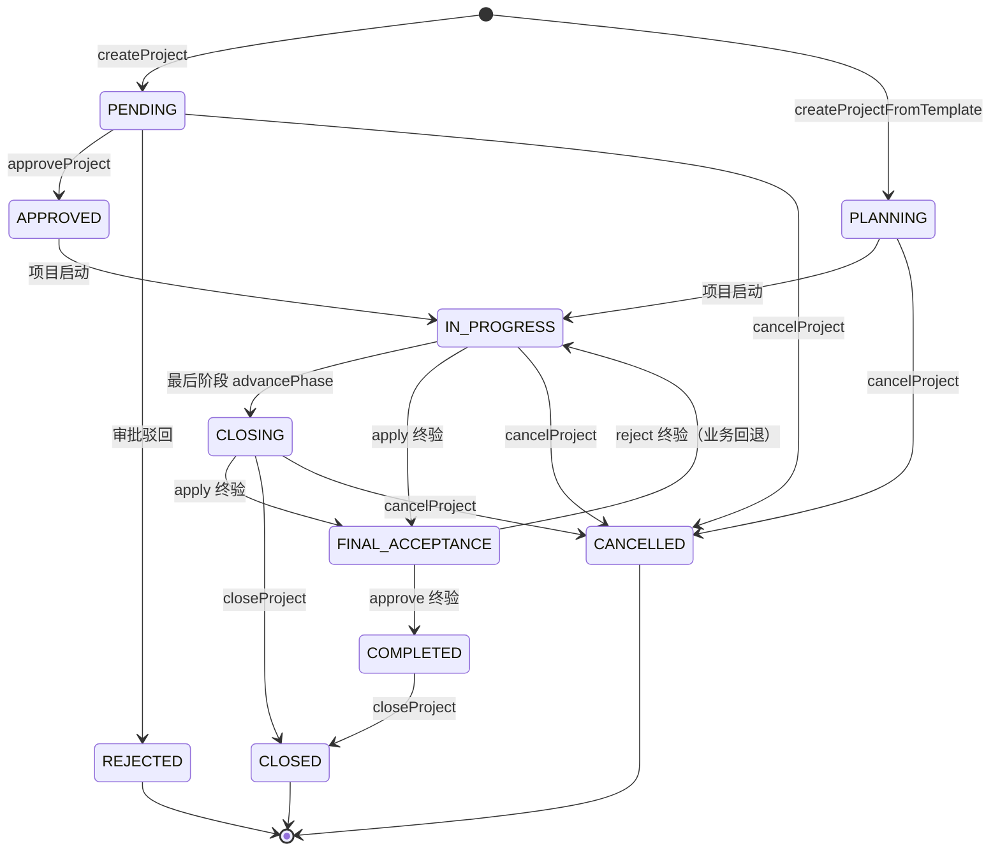
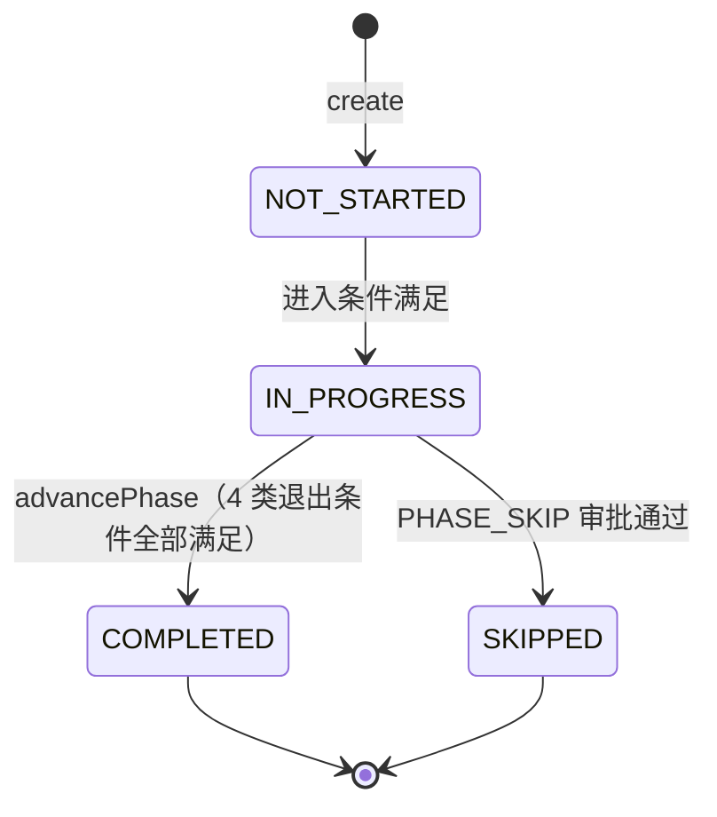
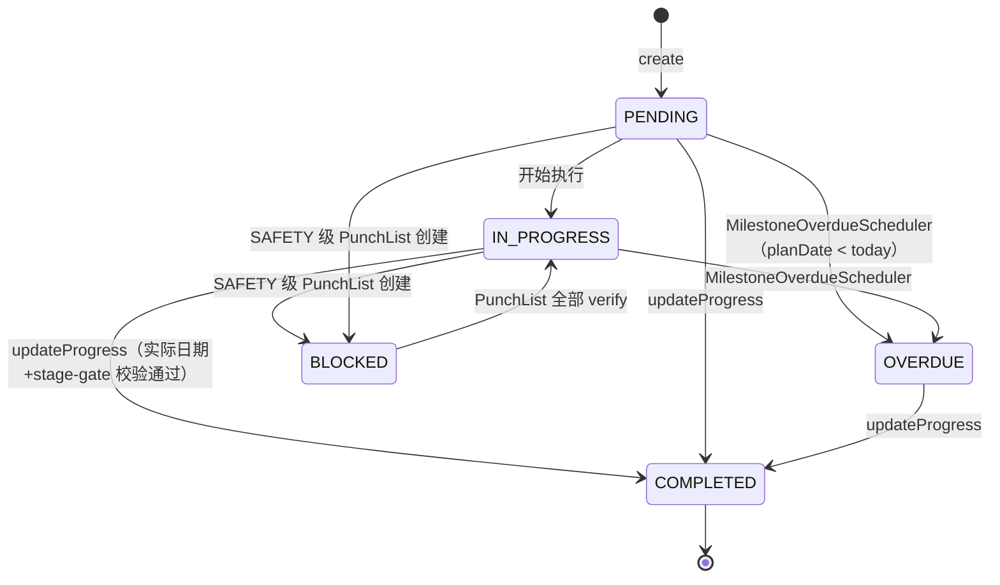
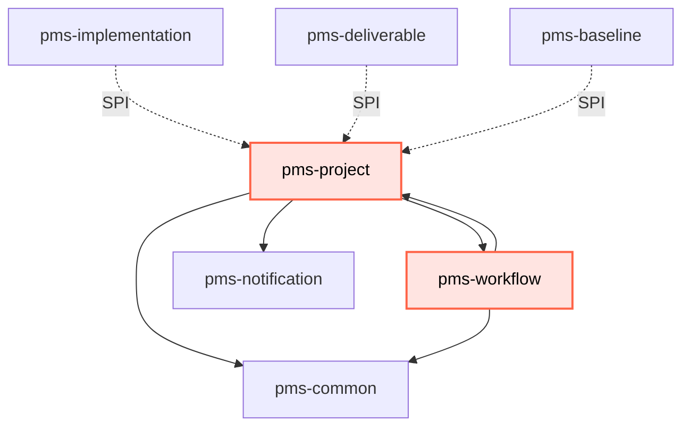

# pms-project 模块知识库

> 本文基于 `network-equipment-pms/pms-project` 模块源码（`com.dp.plat.project`）整理，记录项目交付管理领域的实体模型、11 态项目状态机、阶段/里程碑状态机、PPDIOO 方法论、物化路径主子项目树、模板深拷贝 12 步流程、阶段退出闸门、终验流程、多层级配置体系、SPI 扩展点等核心机制。

## 模块概述

`pms-project` 是网络设备 PMS 平台的**项目交付管理领域模块**，定位为整个 PMS 体系的"业务骨架"——承载项目立项、模板实例化、阶段推进、里程碑管控、终验归档、主子项目汇总等核心能力，并通过 SPI 端口向 `pms-implementation`、`pms-deliverable`、`pms-baseline`、`pms-workflow` 等下游模块下发任务与校验请求。

- **Maven 坐标**：`com.dp.plat:pms-project:1.0.0-SNAPSHOT`，父工程为 `com.dp.plat:network-equipment-pms`。
- **artifactId / name**：`pms-project`，description 为 `Project delivery management domain`。
- **基础包名**：`com.dp.plat.project`，包说明（`package-info.java`）定位为 *"Project delivery management domain module — Contains entities, services and controllers related to network equipment project delivery lifecycle management."*
- **核心定位**：
  - **项目骨架中枢** — 通过 `ProjectTemplate` + `ProjectTemplateVersion` 快照机制驱动项目实例化，深拷贝阶段/里程碑/任务/交付件/依赖/审批计划 6 类子结构。
  - **状态机管控** — 维护 11 态项目状态机、4 态阶段状态机、5 态里程碑状态机，并通过 `PhaseExitGate` 4 类退出条件守卫阶段推进。
  - **PPDIOO 方法论落地** — 以 Cisco PPDIOO 网络生命周期方法论（Prepare/Plan/Design/Implement/Operate）组织 12 节点里程碑模型。
  - **主子项目汇总** — 物化路径 `project_path` + 递归 CTE 实现无限嵌套主子项目结构与加权平均进度汇总。
  - **SPI 解耦枢纽** — 实现 3 个 SPI（`BusinessDataLoader`、`ProjectConfigProvider`、`ProjectPhaseLookup`）向基础设施模块暴露项目数据，消费 4 个 SPI（`TaskBatchCreator`、`DeliverableBatchCreator`、`DependencyBatchCreator`、`ApprovalPlanBatchCreator`、`MandatoryDeliverableValidator`、`TaskCompletionChecker`、`ApprovalStatusChecker`）调用下游能力。

## 包结构

```
com.dp.plat.project
├── controller/                     # 8 个 REST 控制器（项目/阶段/模板/里程碑/终验/成员/配置/里程碑看板）
├── dao/                            # 4 个 Mapper（ProjectPhaseMapper、ProjectConfigMapper、ProjectTemplateMapper、ProjectTemplateVersionMapper）
├── deliverable/                    # 终验交付物清单（已 @Deprecated，保留历史兼容）
│   ├── controller/                 # DeliverableChecklistController
│   ├── entity/                     # DeliverableChecklist
│   ├── enums/                      # DeliverableType（8 类标准交付物，已 @Deprecated）
│   ├── mapper/                     # DeliverableChecklistMapper
│   └── service/                    # IDeliverableChecklistService
├── dto/                            # 7 个数据传输对象
├── entity/                         # 9 个核心实体（@TableName 持久化）
├── enums/                          # 2 个枚举（MilestoneType、PpdiooPhase）
├── event/                          # 领域事件（FinalAcceptanceApprovedEvent）
├── exception/                      # 3 个异常类 + 模块级异常处理器
├── mapper/                         # 6 个 MyBatis-Plus Mapper
├── punchlist/                      # Punch List 缺陷管理子模块
│   ├── controller/                 # PunchListController
│   ├── entity/                     # PunchList
│   ├── mapper/                     # PunchListMapper
│   └── service/                    # IPunchListService
├── schedule/                       # 定时任务（MilestoneOverdueScheduler）
├── service/                        # 6 个 Service 接口 + ProjectConfigService
│   └── impl/                       # 6 个 Service 实现
├── spi/                            # 3 个跨模块 SPI 实现
└── package-info.java               # 模块包说明
```

各包职责说明：

| 包 | 主要类型 | 职责 |
|----|----------|------|
| `controller` | 8 个 `@RestController` | 暴露项目/阶段/模板/里程碑/终验/成员/配置/里程碑看板的 REST API |
| `dao` | 4 个 `BaseMapper` 子接口 | 阶段、配置、模板、模板版本的持久化（与 `mapper` 包区分，仅承载模板与阶段相关 Mapper） |
| `deliverable` | 5 个类 | 终验交付物清单子模块（已 `@Deprecated`，终验校验改为直接查 `pms_deliverable` 表） |
| `dto` | 7 个 DTO | 树节点、模板创建请求、阶段退出校验结果/违规项、里程碑导入/分组、子项目关闭结果/未关闭项 |
| `entity` | 9 个 `@TableName` 实体 | 项目、阶段、里程碑、模板、模板版本、配置、成员、终验、交付件、交付计划 |
| `enums` | `MilestoneType`、`PpdiooPhase` | 12 节点里程碑类型枚举（绑定 PPDIOO 阶段）+ 5 阶段 PPDIOO 枚举 |
| `event` | `FinalAcceptanceApprovedEvent` | 终验审批通过领域事件，供资产模块等监听回收设备 |
| `exception` | `PhaseExitGateFailedException`、`SubprojectNotClosedException`、`ProjectExceptionHandler` | 阶段退出/子项目未关闭异常及模块级异常处理器（HTTP 200 + 结构化失败响应） |
| `mapper` | 6 个 `BaseMapper` 子接口 | 项目、里程碑、终验、交付件、成员、交付计划的持久化 |
| `punchlist` | 4 个类 | Punch List 缺陷子模块（安全级缺陷阻塞里程碑） |
| `schedule` | `MilestoneOverdueScheduler` | 每日 02:00 扫描过期里程碑并推送延期通知 |
| `service` / `service.impl` | 6 个 `I*Service` + `ProjectConfigService` + 6 个实现 | 业务逻辑层 |
| `spi` | `ProjectBusinessDataLoader`、`ProjectConfigProviderImpl`、`ProjectPhaseLookupImpl` | 向 `pms-workflow` 等基础设施模块暴露的跨模块扩展点 |

## 核心实体模型

模块共 9 个核心持久化实体，全部继承 `com.dp.plat.common.entity.BaseEntity`（含 `id`、`createTime`、`updateTime`、`createBy`、`updateBy`、`deleted` 公共字段，`@TableLogic` 软删除）。

### 实体清单

| 实体 | 表名 | 中文含义 | 乐观锁 | 关键关系 |
|------|------|----------|--------|----------|
| `Project` | `pms_project` | 项目（核心） | `@Version` | 自关联 `parentProjectId`（物化路径主子项目树） |
| `ProjectPhase` | `pms_project_phase` | 项目阶段 | — | N:1 → `Project`；JSON 字段 `entryCriteria`、`exitCriteria` |
| `Milestone` | `pms_milestone` | 项目里程碑 | — | N:1 → `Project`；`ppdiooPhase` 标识所属 PPDIOO 阶段 |
| `ProjectTemplate` | `pms_project_template` | 项目模板 | — | 1:N → `ProjectTemplateVersion` |
| `ProjectTemplateVersion` | `pms_project_template_version` | 模板版本快照 | — | N:1 → `ProjectTemplate`；JSON 字段 `snapshotJson` |
| `ProjectConfig` | `pms_project_config` | 多层级配置 | — | 可选关联 `Project`、`ProjectTemplate`（双 NULL = 系统默认） |
| `ProjectMember` | `pms_project_member` | 项目成员 | — | N:1 → `Project` |
| `FinalAcceptance` | `pms_final_acceptance` | 终验记录 | — | N:1 → `Project` |
| `Deliverable` | `pms_deliverable` | 项目交付件（终验校验依赖） | — | N:1 → `Project`、可选 `ProjectPhase` |
| `DeliveryPlan` | `pms_delivery_plan` | 交付计划 | — | N:1 → `Project` |
| `PunchList` | `pms_punch_list` | Punch List 缺陷 | — | N:1 → `Project`、可选 `Milestone` |
| `DeliverableChecklist` | `pms_deliverable_checklist` | 终验交付物清单（`@Deprecated`） | — | N:1 → `Project` |

### Project 字段详解（核心实体）

`Project` 是模块中枢，继承 `BaseEntity`，使用 `@Version` 乐观锁。字段按职责分组如下：

**业务基础字段**

| 字段 | 类型 | 校验 | 说明 |
|------|------|------|------|
| `projectCode` | `String` | `@NotBlank` `@Size(max=50)` | 项目编号（格式 `PMS-YYYY-XXXX`，审批通过时生成） |
| `projectName` | `String` | `@NotBlank` `@Size(max=200)` | 项目名称 |
| `projectType` | `String` | `@NotBlank` `@Size(max=50)` | 项目类型（`NETWORK_DEVICE` / `SECURITY` / `DATACENTER` 等） |
| `status` | `String` | `@Size(max=50)` | 项目状态（11 态，详见状态机章节） |
| `customerName` | `String` | `@NotBlank` `@Size(max=200)` | 客户名称 |
| `customerContact` | `String` | `@Size(max=100)` | 客户联系人 |
| `customerPhone` | `String` | `@Size(max=50)` | 客户电话 |
| `contractNo` | `String` | `@Size(max=100)` | 合同编号 |
| `contractAmount` | `BigDecimal` | `@DecimalMin("0")` | 合同金额 |
| `planStartDate` / `planEndDate` | `LocalDate` | — | 计划开始/结束日期 |
| `actualStartDate` / `actualEndDate` | `LocalDate` | — | 实际开始/结束日期 |
| `projectManagerId` | `Long` | — | 项目经理用户ID |
| `projectManagerName` | `String` | `@Size(max=50)` | 项目经理姓名 |
| `description` | `String` | `@Size(max=2000)` | 项目描述 |
| `progress` | `Integer` | `@Min(0)` `@Max(100)` | 进度百分比 0-100 |
| `priority` | `String` | `@Size(max=20)` | 优先级（`HIGH` / `NORMAL` / `LOW`） |
| `processInstanceId` | `String` | — | 审批流程实例ID（Flowable） |
| `version` | `Integer` | `@Version` | 乐观锁版本号 |

**Phase 1 扩展字段（V65 迁移）**

| 字段 | 类型 | 说明 |
|------|------|------|
| `parentProjectId` | `Long` | 父项目ID（NULL=顶层），邻接表模型 |
| `projectPath` | `String` | 物化路径 `/1/5/`，用于祖先/后代查询 |
| `depth` | `Integer` | 深度冗余（0=顶层） |
| `weight` | `BigDecimal` | 自定义汇总权重，默认 `1.00` |
| `templateId` | `Long` | 来源模板ID |
| `templateVersion` | `String` | 模板版本快照（如 `v1.0.0`） |
| `currentPhaseId` | `Long` | 当前阶段ID |
| `projectObjective` | `String` | 项目目标 |
| `projectScope` | `String` | 项目范围 |

### ProjectPhase 字段详解

| 字段 | 类型 | 说明 |
|------|------|------|
| `projectId` | `Long` | 所属项目ID |
| `templatePhaseId` | `Long` | 来源模板阶段ID（追溯用） |
| `phaseName` | `String` | 阶段名称 |
| `phaseCode` | `String` | 阶段编码（`PREPARE` / `PLAN` / `DESIGN` / `IMPLEMENT` / `OPERATE` 或自定义） |
| `sortOrder` | `Integer` | 排序序号 |
| `entryCriteria` | `PhaseCriteria` | 进入条件（JSON，`requirePreviousPhaseComplete` / `requireApproval`） |
| `exitCriteria` | `PhaseExitGate` | 退出条件（JSON，4 类条件，详见阶段退出闸门章节） |
| `status` | `String` | 阶段状态（4 态：`NOT_STARTED` / `IN_PROGRESS` / `COMPLETED` / `SKIPPED`） |
| `plannedStartDate` / `plannedEndDate` | `LocalDate` | 计划开始/结束 |
| `actualStartDate` / `actualEndDate` | `LocalDate` | 实际开始/结束 |

> **注**：`ProjectPhase` 使用 `@TableName(autoResultMap = true)`，确保 `@TableField(typeHandler=...)` 在 `BaseMapper` 方法中生效。`entryCriteria` 与 `exitCriteria` 通过 `JsonTypeHandlers.PhaseCriteriaHandler` / `JsonTypeHandlers.PhaseExitGateHandler` 与 MySQL JSON 列互转。

### Milestone 字段详解

| 字段 | 类型 | 说明 |
|------|------|------|
| `projectId` | `Long` | 所属项目ID |
| `milestoneName` | `String` | 里程碑名称 |
| `milestoneType` | `String` | 里程碑类型（12 节点枚举，详见 PPDIOO 章节） |
| `ppdiooPhase` | `String` | PPDIOO 阶段（`PREPARE` / `PLAN` / `DESIGN` / `IMPLEMENT` / `OPERATE`） |
| `planDate` | `LocalDate` | 计划完成日期 |
| `actualDate` | `LocalDate` | 实际完成日期 |
| `status` | `String` | 状态（5 态：`PENDING` / `IN_PROGRESS` / `COMPLETED` / `OVERDUE` / `BLOCKED`） |
| `description` | `String` | 描述 |
| `sortOrder` | `Integer` | 排序序号（强制 stage-gate 推进顺序 1-12） |

### ProjectTemplate / ProjectTemplateVersion 字段详解

**ProjectTemplate**

| 字段 | 类型 | 说明 |
|------|------|------|
| `templateCode` | `String` | 模板编码 |
| `templateName` | `String` | 模板名称 |
| `category` | `String` | 类别（`IMPLEMENT` / `MAINTENANCE` / `CONSULTING`） |
| `description` | `String` | 描述 |
| `status` | `String` | 状态（`DRAFT` / `PUBLISHED` / `DEPRECATED`） |

**ProjectTemplateVersion**

| 字段 | 类型 | 说明 |
|------|------|------|
| `templateId` | `Long` | 模板ID |
| `version` | `String` | 语义化版本（如 `v1.0.0`） |
| `snapshotJson` | `TemplateSnapshot` | 模板内容快照（JSON，含 phases/tasks/milestones/deliverables/dependencies/approvalPlans/assigneeRules 7 类定义） |
| `changeLog` | `String` | 版本变更说明 |
| `status` | `String` | 状态（`DRAFT` / `PUBLISHED` / `ARCHIVED`） |
| `publishedAt` | `LocalDateTime` | 发布时间 |
| `publishedBy` | `Long` | 发布人 |

> **版本快照策略**：模板内容以 JSON 文档存入 `snapshot_json`。创建项目时反序列化并深拷贝到项目相关表，保证存量项目不受模板后续修改影响。`ProjectTemplateVersion` 同样开启 `autoResultMap = true`，`snapshotJson` 通过 `JsonTypeHandlers.TemplateSnapshotHandler` 序列化。

### ProjectConfig 字段详解

| 字段 | 类型 | 说明 |
|------|------|------|
| `projectId` | `Long` | 项目ID（NULL = 系统级默认） |
| `templateId` | `Long` | 模板ID（NULL = 非模板配置） |
| `configKey` | `String` | 配置键 |
| `configValue` | `String` | 配置值 |
| `description` | `String` | 描述 |

### FinalAcceptance 字段详解

| 字段 | 类型 | 说明 |
|------|------|------|
| `projectId` | `Long` | 所属项目ID |
| `applyTime` | `LocalDateTime` | 申请时间 |
| `applyUserId` / `applyUserName` | `Long` / `String` | 申请人 |
| `status` | `String` | 状态（`PENDING` / `APPROVED` / `REJECTED`） |
| `acceptanceReport` | `String` | 验收报告 |
| `acceptanceOpinion` | `String` | 验收意见 |
| `acceptUserId` / `acceptUserName` | `Long` / `String` | 验收人 |
| `acceptTime` | `LocalDateTime` | 验收时间 |

### PunchList 字段详解

| 字段 | 类型 | 说明 |
|------|------|------|
| `projectId` | `Long` | 所属项目ID（`@NotNull`） |
| `milestoneId` | `Long` | 关联里程碑ID |
| `severity` | `String` | 严重等级（`SAFETY` / `FUNCTIONAL` / `COSMETIC`，`@NotBlank`） |
| `title` | `String` | 缺陷标题（`@NotBlank` `@Size(max=200)`） |
| `description` | `String` | 缺陷描述（`@Size(max=2000)`） |
| `walkdownStage` | `String` | 走查阶段（`PRE_PUNCH` / `FORMAL`） |
| `assigneeId` / `assigneeName` | `Long` / `String` | 处理人 |
| `deadline` | `LocalDate` | 处理截止日 |
| `status` | `String` | 状态（`OPEN` / `RESOLVED` / `VERIFIED`） |
| `resolvedAt` / `verifiedAt` | `LocalDateTime` | 解决/验证时间 |
| `verifiedBy` / `verifiedByName` | `Long` / `String` | 验证人 |
| `attachmentIds` | `String` | 逗号分隔附件ID |

### Deliverable 字段详解（终验校验依赖）

| 字段 | 类型 | 说明 |
|------|------|------|
| `projectId` | `Long` | 所属项目ID |
| `deliverableName` | `String` | 交付件名称 |
| `deliverableType` | `String` | 性质类型（字典 `pms_deliverable_type`：`DOCUMENT` / `CODE` / `ENTITY_REF` / `MODEL` / `CONFIG` / `DATA` / `OTHER`） |
| `filePath` | `String` | 文件路径 |
| `status` | `String` | 状态（7 态：`DRAFT` / `SUBMITTED` / `REVIEWED` / `SIGNED` / `PUBLISHED` / `REFERENCED` / `ARCHIVED`） |
| `phaseId` | `Long` | 所属阶段ID（终验交付件可为 null） |
| `currentVersion` | `Integer` | 当前版本号，从 1 开始 |
| `mandatory` | `Boolean` | 是否必需交付件（影响阶段退出与终验校验） |
| `templateInherited` | `Boolean` | 是否模板预设（模板实例化 = true，过程新增 = false） |
| `approverRole` | `String` | 签核角色 |
| `refEntityType` / `refEntityId` | `String` / `Long` | 引用实体类型与ID |

## 项目状态机

### 状态枚举

`Project.status` 字段为字符串，未定义独立枚举类，状态值散落于多个 Service 实现的常量中。综合 `Project.java` 实体注释、`ProjectServiceImpl`、`ProjectTemplateServiceImpl`、`FinalAcceptanceServiceImpl` 的代码常量，共 **11 态**：

| # | 状态值 | 中文名 | 设置位置 | 说明 |
|---|--------|--------|----------|------|
| 1 | `PENDING` | 待审批 | `ProjectServiceImpl.STATUS_PENDING` | 项目创建后初始状态，等待审批立项 |
| 2 | `APPROVED` | 已立项 | `ProjectServiceImpl.STATUS_APPROVED` | 审批通过，生成项目编号 |
| 3 | `PLANNING` | 规划中 | `ProjectTemplateServiceImpl.createProjectFromTemplate` | 从模板创建项目的初始状态 |
| 4 | `IN_PROGRESS` | 进行中 | 实体注释 | 项目执行中（设计文档原称 `EXECUTING`） |
| 5 | `INITIAL_ACCEPTANCE` | 初验中 | 实体注释 | 初步验收阶段 |
| 6 | `FINAL_ACCEPTANCE` | 终验中 | 实体注释 | 终验申请审批中 |
| 7 | `CLOSING` | 收尾中 | `ProjectServiceImpl.STATUS_CLOSING` | 所有阶段完成，等待关闭审批 |
| 8 | `COMPLETED` | 已完成 | `FinalAcceptanceServiceImpl.PROJECT_COMPLETED` | 终验审批通过，项目归档 |
| 9 | `CLOSED` | 已关闭 | `ProjectServiceImpl.STATUS_CLOSED` | 主项目关闭（含子项目校验） |
| 10 | `CANCELLED` | 已取消 | `ProjectServiceImpl.STATUS_CANCELLED` | 项目取消 |
| 11 | `REJECTED` | 已驳回 | 实体注释 | 审批驳回 |

### 流转规则

| 当前状态 | 触发动作 | 下一状态 | 实现方法 |
|----------|----------|----------|----------|
| （无） | `createProject` | `PENDING` | `ProjectServiceImpl.createProject` — 创建后启动 `projectApproval` 流程 |
| （无） | `createProjectFromTemplate` | `PLANNING` | `ProjectTemplateServiceImpl.createProjectFromTemplate` — 设置 `templateId` / `templateVersion` / `depth=0` / `weight=1.00` |
| `PENDING` | `approveProject` | `APPROVED` | `ProjectServiceImpl.approveProject` — 生成 `PMS-YYYY-XXXX` 编号，完成审批任务 |
| `PLANNING` / `APPROVED` | 项目启动 | `IN_PROGRESS` | （由 `pms-workflow` 审批通过后流转，本模块未直接实现） |
| `IN_PROGRESS` | 最后阶段 `advancePhase` 完成 | `CLOSING` | `ProjectPhaseServiceImpl.advancePhase` → `updateProjectStatusToClosing` |
| `CLOSING` / 任意 | `apply` 终验 | `FINAL_ACCEPTANCE` | `FinalAcceptanceServiceImpl.apply` — 校验里程碑/Punch List/必需交付件后创建终验记录 |
| `FINAL_ACCEPTANCE` | `approve` 终验 | `COMPLETED` | `FinalAcceptanceServiceImpl.approve` — 发布 `FinalAcceptanceApprovedEvent` |
| `FINAL_ACCEPTANCE` | `reject` 终验 | （回退至终验前状态） | `FinalAcceptanceServiceImpl.reject` — 仅更新终验记录状态，不强制改项目状态 |
| `CLOSING` / `COMPLETED` | `closeProject` | `CLOSED` | `ProjectServiceImpl.closeProject` — 递归校验所有子项目为 `CLOSED` / `CANCELLED` |
| 任意 | `cancelProject` | `CANCELLED` | `ProjectServiceImpl.cancelProject` — 直接置 `CANCELLED` |
| `PENDING` | 审批驳回 | `REJECTED` | （由 `pms-workflow` 审批回调设置，本模块未直接实现） |

### 状态机 Mermaid 图



> **注**：设计文档 §3.1 原定义 6 态（`PLANNING` / `EXECUTING` / `CLOSING` / `CLOSED` / `SUSPENDED` / `CANCELLED`），实际实现扩展为 11 态，新增 `PENDING` / `APPROVED` / `IN_PROGRESS` / `INITIAL_ACCEPTANCE` / `FINAL_ACCEPTANCE` / `COMPLETED` / `REJECTED`，并保留 `CLOSING` / `CLOSED` / `CANCELLED`。`SUSPENDED`（暂停）状态在设计文档中定义但实际未实现。

## 阶段与里程碑状态机

### 阶段状态机（4 态）

`ProjectPhase.status` 字段共 **4 态**：

| # | 状态值 | 中文 | 说明 |
|---|--------|------|------|
| 1 | `NOT_STARTED` | 未开始 | 阶段创建后默认状态 |
| 2 | `IN_PROGRESS` | 进行中 | 阶段已激活（前一阶段推进后激活，或首个阶段） |
| 3 | `COMPLETED` | 已完成 | 退出条件全部满足后由 `advancePhase` 设置 |
| 4 | `SKIPPED` | 已跳过 | 审批跳过（设计文档定义，需 `PHASE_SKIP` 审批通过） |



**关键约束**：`advancePhase` 仅允许在 `IN_PROGRESS` 状态下推进，否则抛 `BusinessException("当前阶段状态不允许推进，必须为 IN_PROGRESS")`。推进成功后当前阶段置 `COMPLETED` 并设置 `actualEndDate`，同时激活下一阶段为 `IN_PROGRESS` 并设置 `actualStartDate`；若无下一阶段，则项目状态置 `CLOSING`。

### 里程碑状态机（5 态）

`Milestone.status` 字段共 **5 态**：

| # | 状态值 | 中文 | 设置位置 |
|---|--------|------|----------|
| 1 | `PENDING` | 待开始 | `MilestoneServiceImpl.STATUS_PENDING`（创建默认） |
| 2 | `IN_PROGRESS` | 进行中 | （外部设置） |
| 3 | `COMPLETED` | 已完成 | `MilestoneServiceImpl.STATUS_COMPLETED`（`updateProgress` 设置） |
| 4 | `OVERDUE` | 已逾期 | `MilestoneOverdueScheduler.STATUS_OVERDUE`（定时任务每日 02:00 扫描） |
| 5 | `BLOCKED` | 已阻塞 | `PunchListServiceImpl.MILESTONE_BLOCKED`（安全级 Punch List 阻塞） |



**Stage-gate 校验**（`MilestoneServiceImpl.validateStageGate`）：
- **通用规则**：标记 `COMPLETED` 前，同项目内所有 `sortOrder` 小于当前里程碑的里程碑必须为 `COMPLETED`，否则抛 `BusinessException("前置里程碑 X 未完成，无法跳过")`。
- **特殊规则**：`FINAL_ACCEPTANCE` 里程碑额外要求 `SAT` 与 `UAT` 两个里程碑均为 `COMPLETED`。

## PPDIOO 方法论与里程碑模型

### PPDIOO 5 阶段

模块采用 Cisco PPDIOO（Prepare, Plan, Design, Implement, Operate, Optimize）网络生命周期方法论，取其中 5 个阶段作为里程碑分组维度，由 `com.dp.plat.project.enums.PpdiooPhase` 枚举定义：

| 枚举值 | 中文名 | 说明 |
|--------|--------|------|
| `PREPARE` | 准备 | 准备阶段 |
| `PLAN` | 规划 | 规划阶段 |
| `DESIGN` | 设计 | 设计阶段 |
| `IMPLEMENT` | 实施 | 实施阶段 |
| `OPERATE` | 运维 | 运维阶段 |

> **注**：完整 PPDIOO 含 6 阶段（含 Optimize 优化），本模块仅取 5 阶段用于里程碑分组。`PpdiooPhase` 也作为 `ProjectPhase.phaseCode` 的标准取值。

### 12 节点里程碑模型

`com.dp.plat.project.enums.MilestoneType` 枚举定义 12 个标准里程碑类型，每个绑定一个 PPDIOO 阶段并通过 `sortOrder` 强制推进顺序：

| # | 枚举值 | 中文名 | PPDIOO 阶段 | sortOrder |
|---|--------|--------|-------------|-----------|
| 1 | `SITE_SURVEY` | 现场勘察 | `PREPARE` | 1 |
| 2 | `NETWORK_DESIGN` | 网络设计 | `PLAN` | 2 |
| 3 | `PROCUREMENT` | 设备采购 | `PLAN` | 3 |
| 4 | `STAGING` | 预配置 | `DESIGN` | 4 |
| 5 | `FAT` | 工厂验收测试 | `DESIGN` | 5 |
| 6 | `ARRIVAL` | 设备到货 | `IMPLEMENT` | 6 |
| 7 | `INSTALLATION` | 现场安装 | `IMPLEMENT` | 7 |
| 8 | `TESTING` | 系统测试 | `IMPLEMENT` | 8 |
| 9 | `COMMISSIONING` | 系统调测 | `IMPLEMENT` | 9 |
| 10 | `SAT` | 现场验收测试 | `IMPLEMENT` | 10 |
| 11 | `UAT` | 用户验收测试 | `OPERATE` | 11 |
| 12 | `FINAL_ACCEPTANCE` | 终验 | `OPERATE` | 12 |

**PPDIOO 阶段 × 里程碑分布矩阵**：

| PPDIOO 阶段 | 里程碑节点 | 节点数 |
|-------------|-----------|--------|
| `PREPARE` | `SITE_SURVEY` | 1 |
| `PLAN` | `NETWORK_DESIGN`、`PROCUREMENT` | 2 |
| `DESIGN` | `STAGING`、`FAT` | 2 |
| `IMPLEMENT` | `ARRIVAL`、`INSTALLATION`、`TESTING`、`COMMISSIONING`、`SAT` | 5 |
| `OPERATE` | `UAT`、`FINAL_ACCEPTANCE` | 2 |
| **合计** | | **12** |

**`MilestoneType` 关键方法**：
- `fromName(String name)` — 大小写不敏感解析，空白或未知返回 `null`（不抛异常）。
- `getPpdiooPhase()` — 返回所属 PPDIOO 阶段枚举。
- `getSortOrder()` — 返回 1-12 的推进顺序号。

**里程碑与 PPDIOO 阶段的自动绑定**：`MilestoneServiceImpl.createMilestone` 与 `ProjectTemplateServiceImpl.deepCopyMilestones` 在创建里程碑时，若未显式传入 `ppdiooPhase`，则通过 `MilestoneType.fromName(milestoneType).getPpdiooPhase().name()` 自动推导；`sortOrder` 同理自动填充。

### PPDIOO 看板 API

`MilestoneDashboardController` 暴露 `GET /api/project/milestones/dashboard?projectId=` 端点，按 PPDIOO 阶段分组返回里程碑列表（`MilestoneGroupDto`）。实现 `IMilestoneService.dashboardByPpdiooPhase`：
1. 查询项目所有里程碑，按 `sortOrder` 升序。
2. 遍历 `PpdiooPhase.values()`（5 阶段），过滤对应里程碑构造分组。
3. 未匹配任何 PPDIOO 阶段的里程碑归入 `UNKNOWN` / "未分类" 兜底分组。

## 物化路径树（project_path 设计）

### 设计模型

`Project` 同时维护邻接表（`parentProjectId`）与物化路径（`projectPath` + `depth`）两种模型，兼顾单点更新与祖先/后代查询：

| 字段 | 类型 | 用途 |
|------|------|------|
| `parentProjectId` | `Long` | 邻接表，便于单点更新父子关系 |
| `projectPath` | `String` | 物化路径如 `/1/5/`，便于 `LIKE` 祖先/后代查询 |
| `depth` | `Integer` | 深度冗余（0=顶层），用于排序与展示 |
| `weight` | `BigDecimal` | 自定义汇总权重，默认 `1.00`，用于加权平均进度 |

### 路径生成规则

`ProjectServiceImpl.createSubproject(parentId, subproject)` 实现：
1. 先 `save(subproject)` 获得自增 ID。
2. 计算父路径：`parentPath = parent.getProjectPath()`（若父路径为空则回退为 `"/" + parent.getId() + "/"`，兼容历史数据）。
3. 拼接子路径：`subproject.setProjectPath(parentPath + subproject.getId() + "/")`。
4. 计算深度：`subproject.setDepth(parent.getDepth() != null ? parent.getDepth() + 1 : 1)`。
5. `updateById(subproject)` 回填路径与深度。

`ProjectTemplateServiceImpl.createProjectFromTemplate` 创建顶层项目时：`project.setProjectPath("/" + project.getId() + "/")`、`project.setDepth(0)`、`project.setWeight(new BigDecimal("1.00"))`。

### 查询模式

**主子项目树（递归邻接表）**：`ProjectServiceImpl.getProjectTree(id)` → `buildTreeNode(project)` 递归查询 `parentProjectId = project.getId()` 的子项目，构造 `ProjectTreeNode` 树。

> **设计权衡**：`buildTreeNode` 注释说明"采用 parentProjectId 邻接表逐层查询，兼容历史数据（projectPath 未填充时仍可工作）。任务树深度通常较小，N+1 查询成本可接受；超大树的批量化优化留待后续迭代"。

**子孙项目收集（递归邻接表）**：`ProjectServiceImpl.collectAllDescendants(rootId)` 递归收集所有子孙项目，用于 `closeProject` 子项目状态校验。

**加权平均进度（递归 CTE）**：`ProjectMapper.calculateAggregatedProgress(rootProjectId)` 使用 MySQL 8.0+ `WITH RECURSIVE` 语法：

```sql
WITH RECURSIVE project_tree AS (
  SELECT id, parent_project_id, progress, weight, project_path
  FROM pms_project WHERE id = #{rootProjectId}
  UNION ALL
  SELECT p.id, p.parent_project_id, p.progress, p.weight, p.project_path
  FROM pms_project p
  JOIN project_tree t ON p.parent_project_id = t.id
  WHERE p.deleted = 0
)
SELECT
  SUM(CASE WHEN parent_project_id IS NULL THEN 0 ELSE progress * weight END) /
  NULLIF(SUM(CASE WHEN parent_project_id IS NULL THEN 0 ELSE weight END), 0) AS aggregated_progress
FROM project_tree
```

- 锚点：根项目本身（`id = rootProjectId`）。
- 递归：按 `parent_project_id` 自连接，过滤未删除子项目（`deleted = 0`）。
- 加权平均：`Σ(progress × weight) / Σ(weight)`，根项目（`parent_project_id IS NULL`）不计入分子分母，故仅统计子孙项目进度。
- 无子孙时 `NULLIF` 返回 `NULL`，由 `getProjectProgress` service 回退到项目自身进度。

> **设计建议（未实现）**：`closeProject` 注释指出"设计文档 §2.5 建议 `project_path LIKE '/<id>/%'` 单查询优化；createSubproject 已为新建子项目回填 path，path 完备时可直接 `likeRight` 切换为单查询"。当前为保证历史数据正确性采用递归遍历。

### 进度汇总端点

`GET /api/project/{id}/progress` 返回：
```json
{
  "projectId": 1001,
  "projectName": "XX 省网络设备实施主项目",
  "ownProgress": 60,
  "aggregatedProgress": 75
}
```

`aggregatedProgress` 为递归 CTE 计算的子孙项目加权平均进度（无子孙时回退到 `ownProgress`）。

## 项目模板机制

### 模板与版本模型

- **`ProjectTemplate`** — 模板元信息（编码、名称、类别、状态）。状态机：`DRAFT` → `PUBLISHED` → `DEPRECATED`。仅 `DRAFT` 状态可编辑/删除。
- **`ProjectTemplateVersion`** — 模板版本快照，承载 `TemplateSnapshot` JSON 文档。状态机：`DRAFT` → `PUBLISHED` → `ARCHIVED`。每个模板可有多个版本，但只有一个 `PUBLISHED` 状态的最新版本可被用于创建项目。

### TemplateSnapshot 结构

`TemplateSnapshot` 是模板内容的完整快照，含 7 类定义：

| 字段 | 类型 | 说明 |
|------|------|------|
| `phases` | `List<PhaseDef>` | 阶段定义（`phaseCode` / `phaseName` / `sortOrder` / `entryCriteria` / `exitCriteria`） |
| `tasks` | `List<TaskDef>` | 任务定义（含父子层级，通过 `parentTaskName` 名称引用） |
| `milestones` | `List<MilestoneDef>` | 里程碑定义（`milestoneName` / `milestoneType` / `phaseCode` / `sortOrder`） |
| `deliverables` | `List<DeliverableDef>` | 交付件定义（`deliverableName` / `deliverableType` / `phaseCode` / `mandatory` / `approverRole`） |
| `dependencies` | `List<DependencyDef>` | 任务依赖定义（`predecessorTaskName` / `successorTaskName` / `dependencyType` FS/FF/SS/SF / `lagDays`） |
| `approvalPlans` | `List<ApprovalPlanDef>` | 审批计划定义（`approvalType` / `triggerPhaseCode` / `approverRoles`） |
| `assigneeRules` | `List<AssigneeRule>` | 分配规则（`taskNamePattern` / `role`，自动分配任务给角色） |

### 模板深拷贝 12 步流程

`ProjectTemplateServiceImpl.createProjectFromTemplate(ProjectCreateFromTemplateDTO dto)` 实现 12 步深拷贝：

| 步骤 | 操作 | 实现细节 |
|------|------|----------|
| 1 | 校验模板版本存在且已发布 | `versionMapper.selectById(dto.getVersionId())`，状态必须为 `PUBLISHED`；校验 `snapshotJson` 非空；校验模板存在 |
| 2 | 创建项目（顶层项目） | 设置 `status=PLANNING`、`templateId`、`templateVersion`、`projectObjective`、`projectScope`、`parentProjectId=null`、`depth=0`、`weight=1.00`；`projectMapper.insert(project)` |
| 3 | 设置物化路径 | 依赖自增主键：`project.setProjectPath("/" + project.getId() + "/")`；`projectMapper.updateById(project)` |
| 4 | 深拷贝阶段 + 构建 `phaseCode → phaseId` 映射 | 遍历 `snapshot.getPhases()`，逐个 `phaseMapper.insert(phase)`，状态置 `NOT_STARTED`；构建 `phaseCodeToIdMap` 供后续 tasks/deliverables/approvalPlans 解析 `phaseCode` |
| 5 | 初始化成员 | 遍历 `dto.getMembers()`，`memberMapper.insert(member)` |
| 6 | 应用配置覆盖 | 遍历 `dto.getConfigOverrides()`，`configMapper.insert(config)`，设置 `projectId` + `templateId` |
| 7 | 设置当前阶段为第一个阶段 | 查询 `sortOrder` 最小的阶段，`project.setCurrentPhaseId(firstPhase.getId())`；`projectMapper.updateById(project)` |
| 8 | 深拷贝里程碑（同模块） | `deepCopyMilestones(projectId, snapshot.getMilestones(), phaseCodeToIdMap)` — 直接调用 `MilestoneMapper`；`ppdiooPhase` 通过 `MilestoneType.fromName(type).getPpdiooPhase().name()` 推导；`sortOrder` 缺省时从枚举取 |
| 9 | 深拷贝任务（跨模块 SPI：pms-implementation） | `deepCopyTasks(projectId, snapshot.getTasks(), phaseCodeToIdMap)` — 按 `phaseCode` 分组调用 `TaskBatchCreator.batchCreateTasks(projectId, phaseId, taskDefs)`；SPI 未加载时 `log.warn` 跳过 |
| 10 | 深拷贝交付件（跨模块 SPI：pms-deliverable） | `deepCopyDeliverables(projectId, snapshot.getDeliverables(), phaseCodeToIdMap)` — 按 `phaseCode` 分组调用 `DeliverableBatchCreator.batchCreateDeliverables(projectId, phaseId, deliverableDefs)`；SPI 未加载时跳过 |
| 11 | 深拷贝任务依赖（跨模块 SPI：pms-baseline） | `deepCopyDependencies(projectId, snapshot.getDependencies())` — 调用 `DependencyBatchCreator.batchCreateDependencies(projectId, dependencyDefs)`；实现自行解析 `predecessorTaskName` / `successorTaskName` 为任务 ID |
| 12 | 深拷贝审批计划（跨模块 SPI：pms-workflow） | `deepCopyApprovalPlans(projectId, snapshot.getApprovalPlans(), phaseCodeToIdMap)` — 调用 `ApprovalPlanBatchCreator.batchCreateApprovalPlans(projectId, phaseCodeToIdMap, approvalPlanDefs)`；仅注册计划，不立即创建审批记录 |

**SPI 容错策略**：4 个跨模块 SPI（`TaskBatchCreator` / `DeliverableBatchCreator` / `DependencyBatchCreator` / `ApprovalPlanBatchCreator`）均通过 `@Autowired(required = false)` 注入。模块未加载时 bean 为 null，深拷贝流程跳过对应步骤并 `log.warn`，不阻断主流程（避免在精简部署下锁死模板实例化）。

### 模板版本发布流程

`publishVersion(templateId, version, snapshot, changeLog)`：
1. 校验模板存在且非 `DEPRECATED`。
2. 校验版本号在同模板下唯一（`versionMapper.selectCount` 查重）。
3. 创建 `ProjectTemplateVersion` 记录，状态 `PUBLISHED`，记录 `publishedAt`。
4. 更新模板状态为 `PUBLISHED`。

`getPublishedVersion(templateId)` — 取最新 `PUBLISHED` 状态版本（按 `publishedAt` 降序 `LIMIT 1`）。

### 模板与实例关系

- `Project.templateId` + `Project.templateVersion` 记录项目来源模板与版本快照，便于追溯。
- 项目创建后与模板解耦：模板后续修改/发版不影响已创建项目（深拷贝保证快照隔离）。
- `ProjectConfig` 通过 `projectId` + `templateId` 双键支持项目级覆盖模板级配置。

## 阶段退出闸门

### PhaseExitGate 4 类退出条件

`com.dp.plat.common.dto.PhaseExitGate` 定义 4 类结构化退出条件，作为 `ProjectPhase.exitCriteria` JSON 字段持久化：

| 类别 | 字段 | 子结构 | 校验逻辑 |
|------|------|--------|----------|
| **DELIVERABLE** | `requiredDeliverables` | `RequiredDeliverable{deliverableId, deliverableName, requiredStatus}` | 必需交付件状态校验。优先走 `MandatoryDeliverableValidator` SPI（TD-P8-012），fallback 内联集合判断（TD-P8-011）：`requiredStatus` 属于已批准集合 `{PUBLISHED, REFERENCED, ARCHIVED}` 时按集合判断，否则精确匹配 |
| **MILESTONE** | `requiredMilestones` | `RequiredMilestone{milestoneId, mustReached}` | `mustReached=true` 时里程碑状态须为 `COMPLETED` |
| **TASK** | `requiredTasks` | `RequiredTask{phaseId, allCompleted}` | `allCompleted=true` 时通过 `TaskCompletionChecker` SPI 查询阶段下未完成任务（TD-P8-005）。SPI 未加载时跳过校验（仅 `log.warn`） |
| **APPROVAL** | `requiredApprovals` | `RequiredApproval{approvalType, mustApproved}` | `mustApproved=true` 时通过 `ApprovalStatusChecker` SPI 查询项目+审批类型下未通过审批（TD-P8-005）。SPI 未加载时跳过校验 |

### 校验流程

`ProjectPhaseServiceImpl.validateExitGate(ProjectPhase phase)`：
1. 加载 `phase.getExitCriteria()`，为 null 直接返回空违规列表（未配置退出条件即通过）。
2. **DELIVERABLE 分支**：
   - 若 `MandatoryDeliverableValidator` SPI 存在，调用 `findMandatoryDeliverableViolations(phaseId)` 复用 `pms-deliverable` 的集合判断逻辑，将 `DeliverableViolation` 转为 `PhaseExitGateViolation`（`gateType=DELIVERABLE`）。
   - 若 SPI 不存在，fallback 内联逻辑：遍历 `requiredDeliverables`，按 `requiredStatus` 是否属于已批准集合决定集合判断或精确匹配。
3. **MILESTONE 分支**：遍历 `requiredMilestones`，跳过 `mustReached != true` 项；查询里程碑，状态非 `COMPLETED` 即记违规。
4. **TASK 分支**：遍历 `requiredTasks`，跳过 `allCompleted != true` 项；SPI 未注入则 `log.warn` 跳过；否则调用 `findUncompletedTasks(phaseId)` 收集违规。
5. **APPROVAL 分支**：遍历 `requiredApprovals`，跳过 `mustApproved != true` 项；SPI 未注入则 `log.warn` 跳过；否则调用 `findApprovalViolations(projectId, approvalType, mustApproved)` 收集违规。

### 违规响应结构

任一退出条件未满足时，`advancePhase` 抛 `PhaseExitGateFailedException`（继承 `BusinessException`），携带 `List<PhaseExitGateViolation>`。`ProjectExceptionHandler`（`@Order(HIGHEST_PRECEDENCE)`）将其转换为 HTTP 200 + 结构化失败响应：

```json
{
  "code": 200,
  "data": {
    "success": false,
    "errorCode": "PHASE_EXIT_GATE_FAILED",
    "errorMessage": "当前阶段退出条件未满足",
    "violations": [
      {
        "gateType": "DELIVERABLE",
        "message": "必需交付件未达到已批准状态",
        "businessId": 101,
        "businessName": "网络设计书",
        "expectedStatus": "已批准（PUBLISHED/REFERENCED/ARCHIVED）",
        "actualStatus": "DRAFT"
      }
    ]
  }
}
```

`PhaseExitGateViolation` 字段：`gateType`（`DELIVERABLE` / `TASK` / `MILESTONE` / `APPROVAL`）、`message`、`businessId`、`businessName`、`expectedStatus`、`actualStatus`。

## 终验流程

### 终验前置校验

`FinalAcceptanceServiceImpl.apply(projectId, report)` 在创建终验申请前执行 4 项校验：

| # | 校验项 | 失败提示 | 实现细节 |
|---|--------|----------|----------|
| 1 | 项目存在 | "项目不存在" | `projectMapper.selectById(projectId)` |
| 2 | 所有里程碑已完成 | "项目暂无里程碑，无法申请终验" / "存在未完成的里程碑，无法申请终验" | `milestoneService.list` 查询项目所有里程碑，全部须为 `COMPLETED` |
| 3 | 所有 Punch List 已验证 | "存在未验证的 Punch List 项，无法申请终验" | `punchListService.isAllVerified(projectId)` |
| 4 | 所有必需交付件已就绪 | "终验交付物未就绪，缺失: X、Y" | 查询 `pms_deliverable` 表，遍历 `mandatory=true` 的交付件，状态须达 `PUBLISHED` / `REFERENCED` / `ARCHIVED`（`isDeliverableReady`） |
| 5 | 无重复待审批申请 | "该项目已有待审批的终验申请" | 查询 `FinalAcceptance` 表 `projectId + status=PENDING` 是否已存在 |

> **关键设计（TD-P8-012）**：终验校验**只看 `mandatory` 标记**，不再依赖具体交付件类型。必需交付件由项目模板配置并通过模板实例化创建到 `pms_deliverable` 表。`DeliverableChecklist` 实体与 `DeliverableType` 枚举已 `@Deprecated`，保留用于历史兼容。

### 终验审批流转

| 操作 | 状态流转 | 副作用 |
|------|----------|--------|
| `apply` | （无）→ `PENDING` | 记录 `applyTime` / `applyUserId` / `applyUserName` / `acceptanceReport` |
| `approve` | `PENDING` → `APPROVED` | 记录 `acceptanceOpinion` / `acceptUserId` / `acceptUserName` / `acceptTime`；项目状态置 `COMPLETED`；发布 `FinalAcceptanceApprovedEvent` |
| `reject` | `PENDING` → `REJECTED` | 记录 `acceptanceOpinion` / `acceptUserId` / `acceptUserName` / `acceptTime` |

### FinalAcceptanceApprovedEvent 领域事件

终验审批通过后，`FinalAcceptanceServiceImpl.approve` 通过 `ApplicationEventPublisher.publishEvent(new FinalAcceptanceApprovedEvent(this, projectId))` 发布领域事件。监听方（如资产模块）可监听此事件执行跨域动作（如回收项目绑定设备）。

> **未实现项**：`apply` 方法注释含 `TODO: integrate workflow module to start the final acceptance approval workflow once pms-workflow is ready`，终验审批流程的 Flowable 集成尚未完成，当前为直接调用 `approve` / `reject` 同步流转。

### 终验 API 端点

| 方法 | 路径 | 权限 | 说明 |
|------|------|------|------|
| POST | `/api/project/acceptance/apply` | `project:finalAcceptance:apply` | 申请终验 |
| POST | `/api/project/acceptance/{id}/approve` | `project:finalAcceptance:approve` | 审批通过终验 |
| POST | `/api/project/acceptance/{id}/reject` | `project:finalAcceptance:approve` | 驳回终验申请 |
| GET | `/api/project/acceptance/{projectId}` | — | 根据项目ID查询终验记录 |

## 多层级配置体系

### 配置层级

`ProjectConfig` 通过 `projectId` + `templateId` 双键支持 **3 级配置**，优先级从高到低：

| 层级 | projectId | templateId | 说明 |
|------|-----------|------------|------|
| 项目级（最高） | `= 项目ID` | `IS NOT NULL` 或 `IS NULL` | 项目特定配置，覆盖模板级与系统默认 |
| 模板级 | `IS NULL` | `= 模板ID` | 模板默认配置，覆盖系统默认 |
| 系统默认（最低） | `IS NULL` | `IS NULL` | 全局默认配置 |

### 读取逻辑

`ProjectConfigService.get(projectId, templateId, key)`：
1. 一次性查询所有候选配置（按 `configKey` + 三层级 OR 条件）：
   ```sql
   WHERE config_key = #{key}
     AND (
       (project_id IS NULL AND template_id IS NULL)                       -- 系统默认
       OR (project_id IS NULL AND template_id = #{templateId})            -- 模板级
       OR (project_id = #{projectId})                                     -- 项目级
     )
   ```
2. 内存中按优先级筛选：项目级 > 模板级 > 系统默认。
3. 返回首个非 null 值。

`getAllForProject(projectId, templateId)` — 反向填充：先填系统默认，再模板级覆盖，最后项目级覆盖，得到合并后的配置 Map。

### 便捷方法

- `getInt(projectId, templateId, key)` — 转为 int，null 返回 0。
- `getBoolean(projectId, templateId, key)` — 转为 boolean，`"true"` 忽略大小写为 true。

### 配置应用场景

- 基线偏差阈值：`baseline.variance.days.threshold` / `baseline.variance.percent.threshold`（由 `pms-baseline` 通过 `ProjectConfigProvider` SPI 读取）。
- 审批超时策略：由 `pms-workflow` 的 `ApprovalTimeoutScheduler` 通过 `ProjectConfigProvider` SPI 读取。
- 阶段退出条件开关、任务汇总权重模式等。

## SPI 机制

### 实现的 SPI（向其他模块暴露能力）

| SPI 接口 | 实现类 | 位置 | 消费方 | 说明 |
|----------|--------|------|--------|------|
| `BusinessDataLoader` | `ProjectBusinessDataLoader` | `spi/` | `pms-workflow` 审批中心 | 加载 `PROJECT` 类型审批的业务字段（项目编号、名称、客户、合同等）用于脱敏展示。`SUPPORTED_TYPE = "PROJECT"`。原 `pms-workflow` 直接依赖 `pms-project` 形成双向依赖环，下沉到 `pms-common` 接口 + 本实现打破环依赖（TD-P8-001） |
| `ProjectConfigProvider` | `ProjectConfigProviderImpl` | `spi/` | `pms-workflow` 等基础设施模块 | 桥接到 `ProjectConfigService.get`，使基础设施模块无需直接依赖 `pms-project` 即可读取项目级配置 |
| `ProjectPhaseLookup` | `ProjectPhaseLookupImpl` | `spi/` | `pms-workflow` 等 | 通过 `phaseId` 反查 `projectId`，供审批中心等模块定位阶段所属项目 |

### 消费的 SPI（调用其他模块能力）

| SPI 接口 | 提供方 | 注入方式 | 消费场景 | 未加载行为 |
|----------|--------|----------|----------|------------|
| `TaskBatchCreator` | `pms-implementation` | `@Autowired(required=false)` | 模板深拷贝第 9 步：批量创建任务到 `pms_impl_task` 表 | `log.warn` 跳过任务深拷贝 |
| `DeliverableBatchCreator` | `pms-deliverable` | `@Autowired(required=false)` | 模板深拷贝第 10 步：批量创建交付件到 `pms_deliverable` 表 | `log.warn` 跳过交付件深拷贝 |
| `DependencyBatchCreator` | `pms-baseline` | `@Autowired(required=false)` | 模板深拷贝第 11 步：批量创建任务依赖到 `pms_task_dependency` 表 | `log.warn` 跳过依赖深拷贝 |
| `ApprovalPlanBatchCreator` | `pms-workflow` | `@Autowired(required=false)` | 模板深拷贝第 12 步：注册审批计划（不立即创建审批记录） | `log.warn` 跳过审批计划注册 |
| `MandatoryDeliverableValidator` | `pms-deliverable` | `@Autowired(required=false)` | 阶段退出 DELIVERABLE 分支：复用 `validateMandatoryDeliverables` 集合判断逻辑 | fallback 到本类内联集合判断（TD-P8-011 已修复） |
| `TaskCompletionChecker` | `pms-implementation` | `@Autowired(required=false)` | 阶段退出 TASK 分支：查询阶段下未完成任务 | `log.warn` 跳过 TASK 校验，避免无任务数据时锁死阶段推进 |
| `ApprovalStatusChecker` | `pms-workflow` | `@Autowired(required=false)` | 阶段退出 APPROVAL 分支：查询项目+审批类型下未通过审批 | `log.warn` 跳过 APPROVAL 校验 |

### SPI 设计原则

1. **接口下沉 `pms-common`**：所有 SPI 接口定义在 `com.dp.plat.common.spi` 包，避免模块间直接编译依赖。
2. **`@Autowired(required=false)` 容错**：消费方均以可选注入方式获取 SPI bean，模块未加载时跳过对应逻辑并 `log.warn`，保证精简部署可用。
3. **`@Component` 自动注册**：实现方通过 Spring `@Component` 自动注册为 Bean，消费方通过 Spring 自动注入收集。
4. **方法签名规避冲突**：如 `MandatoryDeliverableValidator.findMandatoryDeliverableViolations` 刻意不同于 `DeliverableService.validateMandatoryDeliverables`，避免 Java 方法签名冲突，同时返回简化的 `DeliverableViolation` 列表便于跨模块传递。

## Service 层与 API 端点

### Service 接口与实现

| Service 接口 | 实现类 | 继承 | 核心方法 |
|--------------|--------|------|----------|
| `IProjectService` | `ProjectServiceImpl` | `ServiceImpl<ProjectMapper, Project>` | `createProject` / `getProjectById` / `listProjects` / `updateProject` / `deleteProject` / `approveProject` / `dashboard` / `generateProjectCode` / `getProjectTree` / `createSubproject` / `closeProject` / `cancelProject` / `getProjectProgress` |
| `IProjectTemplateService` | `ProjectTemplateServiceImpl` | — | `page` / `getById` / `create` / `update` / `delete` / `listVersions` / `publishVersion` / `getPublishedVersion` / `createProjectFromTemplate` |
| `IProjectPhaseService` | `ProjectPhaseServiceImpl` | — | `listByProjectId` / `getById` / `create` / `update` / `delete` / `batchCreate` / `advancePhase` |
| `IMilestoneService` | `MilestoneServiceImpl` | `ServiceImpl<MilestoneMapper, Milestone>` | `createMilestone` / `updateMilestone` / `deleteMilestone` / `listByProjectId` / `updateProgress` / `recalculateProjectProgress` / `dashboardByPpdiooPhase` / `batchImport` |
| `IFinalAcceptanceService` | `FinalAcceptanceServiceImpl` | `ServiceImpl<FinalAcceptanceMapper, FinalAcceptance>` | `apply` / `approve` / `reject` / `getByProjectId` |
| `IProjectMemberService` | `ProjectMemberServiceImpl` | — | `listByProjectId` / `create` / `update` / `delete` / `deleteByProjectId` / `batchCreate` |
| `ProjectConfigService`（具体类） | — | — | `get` / `getInt` / `getBoolean` / `getAllForProject` |
| `IPunchListService` | `PunchListServiceImpl` | `ServiceImpl<PunchListMapper, PunchList>` | `create` / `update` / `delete` / `getById` / `listByProject` / `listByMilestone` / `resolve` / `verify` / `isAllVerified` |
| `IDeliverableChecklistService`（`@Deprecated`） | — | `IService<DeliverableChecklist>` | `create` / `update` / `delete` / `getById` / `listByProject` / `initChecklist` / `markUploaded` / `cancelUploaded` |

### Controller 与 API 端点

#### ProjectController（`/api/project`）

| 方法 | 路径 | 权限 | 限流 | 说明 |
|------|------|------|------|------|
| POST | `/api/project` | `project:project:add` | 10/60s + `@Idempotent` | 创建项目 |
| GET | `/api/project/{id}` | `project:project:list` | — | 根据ID查询项目 |
| GET | `/api/project/list` | `project:project:list` | — | 分页查询项目列表 |
| PUT | `/api/project` | `project:project:edit` | 30/60s + `@Idempotent` | 更新项目 |
| DELETE | `/api/project/{id}` | `project:project:remove` | 10/60s | 删除项目 |
| POST | `/api/project/{id}/approve` | `project:project:approve` | 10/60s | 审批立项项目 |
| GET | `/api/project/dashboard` | `project:project:list` | — | 获取项目仪表盘数据 |
| GET | `/api/project/{id}/tree` | `project:project:list` | — | 主子项目树（递归） |
| POST | `/api/project/{id}/subproject` | `project:subproject:manage` | 10/60s + `@Idempotent` | 创建子项目 |
| POST | `/api/project/{id}/close` | `project:close` | 5/60s | 关闭主项目（含子项目校验） |
| POST | `/api/project/{id}/cancel` | `project:close` | 5/60s | 取消项目 |
| GET | `/api/project/{id}/progress` | `project:project:list` | — | 项目进度汇总（含子项目） |

#### ProjectPhaseController（`/api/project/phase`）

| 方法 | 路径 | 权限 | 说明 |
|------|------|------|------|
| GET | `/api/project/phase/project/{projectId}` | — | 查询项目所有阶段 |
| GET | `/api/project/phase/{id}` | — | 查询阶段详情 |
| POST | `/api/project/phase` | `project:phase:advance` | 新增阶段 |
| PUT | `/api/project/phase` | `project:phase:advance` | 更新阶段 |
| DELETE | `/api/project/phase/{id}` | `project:phase:advance` | 删除阶段 |
| POST | `/api/project/phase/{phaseId}/advance` | `project:phase:advance` | 推进阶段（含 4 类退出条件校验），10/60s 限流 |

#### ProjectTemplateController（`/api/project/template`）

| 方法 | 路径 | 权限 | 说明 |
|------|------|------|------|
| GET | `/api/project/template/list` | `project:template:list` | 分页查询模板 |
| GET | `/api/project/template/{id}` | `project:template:list` | 查询模板详情 |
| POST | `/api/project/template` | `project:template:add` | 创建模板 |
| PUT | `/api/project/template` | `project:template:add` | 更新模板（仅 DRAFT） |
| DELETE | `/api/project/template/{id}` | `project:template:add` | 删除模板（仅 DRAFT） |
| GET | `/api/project/template/{id}/versions` | `project:template:list` | 查询模板版本列表 |
| POST | `/api/project/template/{id}/publish` | `project:template:publish` | 发布新版本 |
| GET | `/api/project/template/{id}/published-version` | `project:template:list` | 获取已发布版本 |
| POST | `/api/project/template/create-project` | `project:template:use` | 从模板创建项目（深拷贝 12 步） |

#### MilestoneController（`/api/project/milestone`）

| 方法 | 路径 | 权限 | 说明 |
|------|------|------|------|
| POST | `/api/project/milestone` | `project:milestone:add` | 创建里程碑 |
| PUT | `/api/project/milestone` | `project:milestone:edit` | 更新里程碑 |
| DELETE | `/api/project/milestone/{id}` | `project:milestone:remove` | 删除里程碑 |
| GET | `/api/project/milestone/project/{projectId}` | — | 根据项目ID查询里程碑列表 |
| POST | `/api/project/milestone/{id}/progress` | `project:milestone:edit` | 更新里程碑进度 |
| GET | `/api/project/milestone/template` | — | 下载里程碑导入模板 |
| POST | `/api/project/milestone/import` | `project:milestone:import` | 批量导入里程碑 |

#### MilestoneDashboardController（`/api/project/milestones`）

| 方法 | 路径 | 说明 |
|------|------|------|
| GET | `/api/project/milestones/dashboard` | 按 PPDIOO 阶段分组的里程碑看板 |

> **注**：里程碑 CRUD 控制器使用单数 `/api/project/milestone`，看板控制器使用复数 `/api/project/milestones` 以区分资源路径。

#### FinalAcceptanceController（`/api/project/acceptance`）

见终验流程章节。

#### ProjectMemberController（`/api/project/member`）

| 方法 | 路径 | 权限 | 说明 |
|------|------|------|------|
| GET | `/api/project/member/project/{projectId}` | — | 查询项目成员列表 |
| POST | `/api/project/member` | `project:subproject:manage` | 新增成员 |
| PUT | `/api/project/member` | `project:subproject:manage` | 更新成员 |
| DELETE | `/api/project/member/{id}` | `project:subproject:manage` | 删除成员 |

#### ProjectConfigController（`/api/project/config`）

| 方法 | 路径 | 权限 | 说明 |
|------|------|------|------|
| GET | `/api/project/config/{projectId}` | — | 读取项目合并配置 |
| PUT | `/api/project/config/{projectId}` | `workflow:approval:config` | 批量更新项目级配置 |

> **注**：`ProjectConfigController` 当前为简化实现，`getAllForProject` 中 `templateId` 通过 TODO 标注需从 `ProjectService` 获取，`update` 实现略。

#### PunchListController（`/api/project/punch-list`）

| 方法 | 路径 | 权限 | 说明 |
|------|------|------|------|
| GET | `/api/project/punch-list/list` | — | 分页查询 Punch List |
| POST | `/api/project/punch-list` | `project:punchList:add` | 创建 Punch List 项 |
| PUT | `/api/project/punch-list` | `project:punchList:edit` | 更新 Punch List 项 |
| DELETE | `/api/project/punch-list/{id}` | `project:punchList:remove` | 删除 Punch List 项 |
| GET | `/api/project/punch-list/{id}` | — | 查询 Punch List 项 |
| GET | `/api/project/punch-list/project/{projectId}` | — | 根据项目ID查询 |
| GET | `/api/project/punch-list/milestone/{milestoneId}` | — | 根据里程碑ID查询 |
| POST | `/api/project/punch-list/{id}/resolve` | `project:punchList:resolve` | 标记已解决 |
| POST | `/api/project/punch-list/{id}/verify` | `project:punchList:verify` | 验证 Punch List 项 |
| GET | `/api/project/punch-list/project/{projectId}/all-verified` | — | 校验项目所有项是否已验证 |

#### DeliverableChecklistController（`/api/project/deliverable-checklist`，`@Deprecated`）

8 个端点：CRUD + `initChecklist` + `markUploaded` + `cancelUploaded` + `listByProject`。

## 模块依赖关系

### Maven 依赖

`pms-project/pom.xml` 声明的内部模块依赖：

| 依赖 | 用途 |
|------|------|
| `pms-common` | `BaseEntity` / `Result` / `BusinessException` / `BusinessMetrics` / `SecurityUtils` / `ExcelUtils` / SPI 接口 / `PhaseExitGate` / `TemplateSnapshot` 等 DTO / `JsonTypeHandlers` |
| `pms-workflow` | `WorkflowService`（项目审批流程启动与任务完成） / `StartProcessRequest` / `CompleteTaskRequest` / `ProcessInstanceDTO` / `TaskDTO` |
| `pms-notification` | `INotificationService` / `Notification`（里程碑延期通知、Punch List 截止通知） |

### 依赖关系图



### 循环依赖说明（TD-P8-001）

**`pms-project` ↔ `pms-workflow` 形成双向依赖环**：

- **`pms-project → pms-workflow`**：`ProjectServiceImpl` 在 `createProject` 时调用 `WorkflowService.startProcess` 启动 `projectApproval` 流程，在 `approveProject` 时调用 `WorkflowService.completeTask` 完成审批任务。
- **`pms-workflow → pms-project`**：`pms-workflow` 的审批中心（Story 6）需要读取 `ProjectConfigService` 获取审批超时策略；同时需要加载项目业务数据用于脱敏展示。

**已采取的解耦措施**：
1. **`BusinessDataLoader` SPI 下沉 `pms-common`**（已实施）：原 `pms-workflow` 直接依赖 `pms-project` 加载项目数据形成双向依赖环，现下沉到 `pms-common` 接口 + `ProjectBusinessDataLoader` 实现打破环依赖。`pms-project` 实现 `BusinessDataLoader` 并通过 Spring 自动注入供 `pms-workflow` 消费。
2. **`ProjectConfigProvider` SPI**（已实施）：`pms-project` 实现 `ProjectConfigProvider` 桥接 `ProjectConfigService`，`pms-workflow` 通过 SPI 注入读取配置，无需直接依赖 `pms-project`。
3. **`ApprovalStatusChecker` SPI**（已实施）：阶段退出 APPROVAL 分支通过 SPI 跨模块校验审批状态，`pms-project` 通过 `@Autowired(required=false)` 注入，保持解耦语义。

**Maven 构建影响**：
- Maven 在 `pom.xml` 层面会报循环依赖错误，但实际构建通过的原因是 `pms-admin` 聚合模块统一打包，子模块之间通过 `pms-admin` 的 classpath 间接共享。
- `mvn -pl pms-project package` 单独构建会失败。
- 在 IDE 中可能出现编译顺序告警。

**未完成的修复**：`pms-project/pom.xml` 仍声明对 `pms-workflow` 的依赖（用于 `WorkflowService` 调用），未来可通过 `@EventListener` 异步解耦（ProjectService 发布 `ProjectCreatedEvent`，由 `pms-workflow` 监听启动流程）从根本上消除循环。

### 与其他模块的关系

| 模块 | 关系类型 | 交互方式 |
|------|----------|----------|
| `pms-common` | 编译依赖 | 继承 `BaseEntity`、复用 `Result` / `BusinessException` / `JsonTypeHandlers` / `ExcelUtils` / `SecurityUtils` / `BusinessMetrics` / SPI 接口 / 共享 DTO |
| `pms-workflow` | 编译依赖（循环） | `ProjectServiceImpl` 调用 `WorkflowService` 启动/完成审批流程；通过 `ApprovalStatusChecker` / `ApprovalPlanBatchCreator` SPI 解耦部分交互 |
| `pms-notification` | 编译依赖 | `MilestoneOverdueScheduler` / `PunchListServiceImpl` 调用 `INotificationService.multiChannelSend` 推送延期/截止通知（`IN_APP` + `WS` 双通道） |
| `pms-implementation` | SPI 解耦 | 通过 `TaskBatchCreator`（模板深拷贝）/ `TaskCompletionChecker`（阶段退出 TASK 校验）SPI 交互，无编译依赖 |
| `pms-deliverable` | SPI 解耦 | 通过 `DeliverableBatchCreator`（模板深拷贝）/ `MandatoryDeliverableValidator`（阶段退出 DELIVERABLE 校验）SPI 交互，无编译依赖 |
| `pms-baseline` | SPI 解耦 | 通过 `DependencyBatchCreator`（模板深拷贝）SPI 交互，无编译依赖 |
| `pms-asset` | 事件解耦 | `FinalAcceptanceApprovedEvent` 由资产模块监听，触发项目绑定设备回收，无编译依赖 |
| `pms-admin` | 聚合 | `pms-admin` 聚合所有模块统一打包，提供 classpath 共享 |

## 关键技术点

### 1. JSON 字段持久化

模块大量使用 MySQL JSON 列存储结构化数据，通过 `JsonTypeHandlers` 自定义 JacksonTypeHandler 子类实现 JSON ↔ POJO 互转：

| 实体 | 字段 | TypeHandler | 类型 |
|------|------|-------------|------|
| `ProjectPhase` | `entryCriteria` | `JsonTypeHandlers.PhaseCriteriaHandler` | `PhaseCriteria` |
| `ProjectPhase` | `exitCriteria` | `JsonTypeHandlers.PhaseExitGateHandler` | `PhaseExitGate` |
| `ProjectTemplateVersion` | `snapshotJson` | `JsonTypeHandlers.TemplateSnapshotHandler` | `TemplateSnapshot` |

**关键约束**：实体必须开启 `@TableName(autoResultMap = true)`，否则 `@TableField(typeHandler=...)` 在 `BaseMapper` 方法中不生效（`ProjectPhase` 与 `ProjectTemplateVersion` 均已开启）。

### 2. 乐观锁并发控制

`Project` 实体使用 MyBatis-Plus `@Version` 乐观锁（`version` 字段），并发更新冲突时抛 `OptimisticLockerException`。`ProjectPhaseServiceImpl.updateProjectCurrentPhase` 通过局部更新（仅设置 `currentPhaseId`）规避乐观锁校验，避免阶段推进时与项目其他更新冲突。

### 3. 模块级异常处理器

`ProjectExceptionHandler`（`@Order(HIGHEST_PRECEDENCE)`）优先于 `pms-common` 的 `GlobalExceptionHandler` 命中，将模块自定义异常转换为 HTTP 200 + 结构化失败响应：

| 异常 | 响应 DTO | errorCode | 场景 |
|------|----------|-----------|------|
| `PhaseExitGateFailedException` | `PhaseExitGateResult` | `PHASE_EXIT_GATE_FAILED` | 阶段退出条件未满足，携带 `violations` 列表 |
| `SubprojectNotClosedException` | `SubprojectCloseResult` | `SUBPROJECT_NOT_CLOSED` | 关闭主项目时存在未关闭子项目，携带 `uncompletedSubProjects` 列表 |

**设计意图**：前端响应拦截器按 `code=200` 判断 HTTP 成功，按 `data.success` 判断业务结果，便于细粒度错误展示。

### 4. 里程碑 Stage-gate 推进校验

`MilestoneServiceImpl.validateStageGate` 在标记里程碑 `COMPLETED` 前校验：
- **通用规则**：同项目内所有 `sortOrder` 小于当前里程碑的里程碑必须为 `COMPLETED`。
- **特殊规则**：`FINAL_ACCEPTANCE` 里程碑额外要求 `SAT` 与 `UAT` 均为 `COMPLETED`。

### 5. 里程碑延期定时扫描

`MilestoneOverdueScheduler` 每日 02:00（`@Scheduled(cron = "0 0 2 * * ?")`）扫描 `planDate < today` 且状态非 `COMPLETED` / `OVERDUE` 的里程碑：
1. 置状态为 `OVERDUE`。
2. 查询项目经理 `projectManagerId`。
3. 通过 `INotificationService.multiChannelSend` 推送 `MILESTONE_OVERDUE` 通知（`IN_APP` + `WS` 双通道）。
4. 通知失败 try-catch 隔离，不影响里程碑状态更新。

### 6. Punch List 安全级阻塞

`PunchListServiceImpl.create` 在创建 `severity=SAFETY` 的 Punch List 项时，若关联里程碑存在且状态非 `COMPLETED` / `BLOCKED`，则置里程碑为 `BLOCKED`，阻断里程碑推进。`isAllVerified(projectId)` 用于终验前置校验。

### 7. 项目编号生成

`ProjectServiceImpl.generateProjectCode` 生成 `PMS-YYYY-XXXX` 格式编号：
1. 取当前年份 `PMS-{year}-`。
2. `count` 查询 `projectCode likeRight 'PMS-{year}-'` 的项目数。
3. 序号 = count + 1，格式化为 4 位（`%04d`）。

> **潜在并发问题**：基于 count 的序号生成在并发创建时可能产生重复编号，生产环境应考虑数据库序列或分布式锁。

### 8. 里程碑 Excel 批量导入

`MilestoneServiceImpl.batchImport(MultipartFile file)` 通过 `ExcelUtils.importWithValidation` 实现：
1. 逐行校验：`projectId` 非空且项目存在、`milestoneType` 在 12 节点枚举内、`planDate` / `actualDate` 格式为 `yyyy-MM-dd`、`status` 非空。
2. 校验通过行转为 `Milestone` 实体（`ppdiooPhase` / `sortOrder` 自动从枚举推导）。
3. `saveBatch` 批量持久化。
4. 返回 `ExcelImportResult<MilestoneImportDTO>` 含成功与失败列表。

### 9. 项目进度自动重算

`MilestoneServiceImpl.updateMilestone` / `deleteMilestone` / `updateProgress` 在里程碑状态或实际日期变更后，调用 `recalculateProjectProgress(projectId)`：
- 进度 = 已完成里程碑数 × 100 / 里程碑总数（整数除法）。
- 更新 `Project.progress` 字段。

### 10. SPI 容错与精简部署

模块通过 7 个 `@Autowired(required=false)` SPI 注入点支持精简部署：
- 仅部署 `pms-project` + `pms-common` 时，模板深拷贝仅完成阶段/里程碑/成员/配置（步骤 1-8），任务/交付件/依赖/审批计划深拷贝跳过。
- 阶段退出校验仅完成 MILESTONE 分支（本模块内联），DELIVERABLE fallback 内联判断，TASK / APPROVAL 跳过。
- 所有跳过操作均 `log.warn` 记录，便于排查。

---

**文档路径**：`/workspace/network-equipment-pms/docs/knowledge/pms-project.md`
**最后更新**：2026-07-22
**关联文档**：
- 设计文档：`docs/superpowers/specs/2026-07-17-project-management-enhancement-design.md`
- 模块依赖关系：`docs/superpowers/architecture/module-dependencies.md`
- 技术债清单：`docs/superpowers/acceptance/technical-debt.md`
- 关联模块知识库：`pms-common.md` / `pms-implementation.md` / `pms-system.md` / `pms-asset.md`
