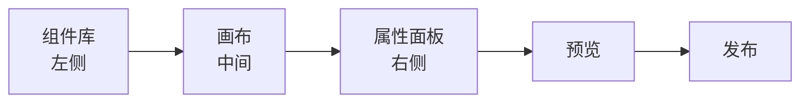
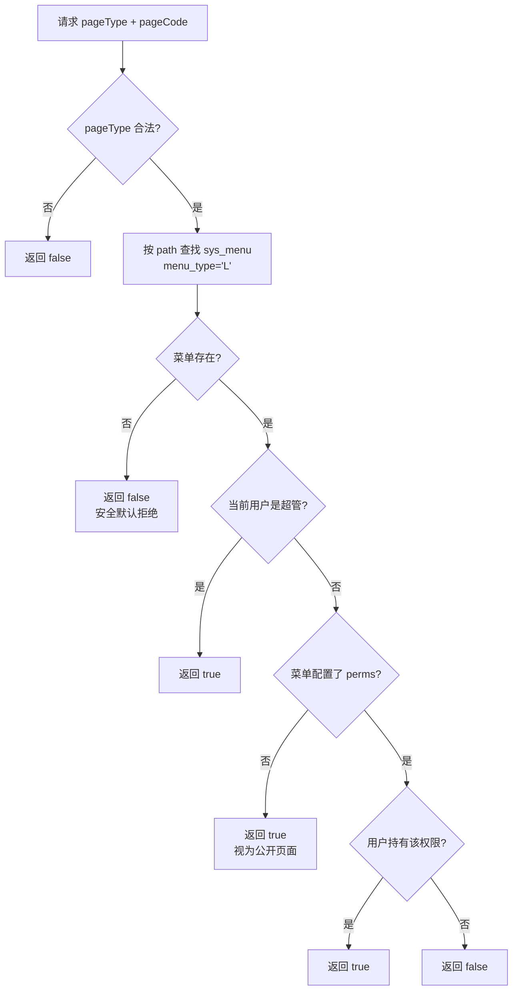
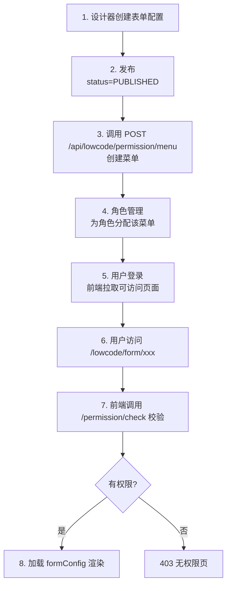

# 低代码使用指南

> 网络设备工程项目管理系统（network-equipment-pms）低代码模块使用指南。
> 涵盖 4 种页面类型设计器、Schema 规范、模板复用、路由权限与最佳实践。

## 目录

1. [低代码模块概述](#1-低代码模块概述)
2. [设计器使用](#2-设计器使用)
3. [Schema 规范](#3-schema-规范)
4. [模板复用](#4-模板复用)
5. [路由与权限](#5-路由与权限)
6. [最佳实践](#6-最佳实践)
7. [限制与注意事项](#7-限制与注意事项)

---

## 1. 低代码模块概述

### 1.1 模块定位

低代码模块（pms-lowcode）提供可视化页面设计能力，让业务人员与开发人员在不写代码（或少写代码）的情况下，快速搭建项目/资产/结算等业务页面。

### 1.2 四种页面类型

| 页面类型 | 标识 | 设计器 | 渲染器 | 典型场景 |
|----------|------|--------|--------|----------|
| 表单 | `form` | 表单设计器 | `LowCodeFormRenderer` | 项目创建、资产入库、结算录入 |
| 列表 | `list` | 列表设计器 | `LowCodeListRenderer` | 项目列表、资产清单、结算列表 |
| 标签页 | `tab` | 标签页设计器 | `LowCodeTabRenderer` | 项目详情多 Tab、资产详情多 Tab |
| 关联页 | `related-page` | 关联页设计器 | `LowCodeRelatedPageRenderer` | 项目概览聚合视图、资产总览 |

### 1.3 核心概念

| 概念 | 说明 |
|------|------|
| 配置（Config） | 设计器产出的 JSON，存储在 `lowcode_form` / `lowcode_list` / `lowcode_tab` / `lowcode_related_page` 表 |
| 编码（code） | 配置唯一标识，用于路由与权限标识 |
| 状态（status） | `DRAFT`（草稿）/ `PUBLISHED`（已发布）/ `ARCHIVED`（已归档），仅 `PUBLISHED` 可被路由访问 |
| 版本（version） | 每次发布自增，支持版本回溯 |
| 业务类型（bizType） | `PROJECT` / `ASSET` / `SETTLEMENT` 等，用于分类与模板归类 |

### 1.4 数据模型

| 表 | 实体 | 说明 |
|----|------|------|
| `lowcode_form` | `LowCodeForm` | 表单配置：code、name、formConfig（JSON） |
| `lowcode_list` | `LowCodeList` | 列表配置：code、name、listConfig（JSON） |
| `lowcode_tab` | `LowCodeTab` | 标签页配置：code、name、tabConfig（JSON） |
| `lowcode_related_page` | `LowCodeRelatedPage` | 关联页配置：code、name、relatedConfig（JSON） |
| `sys_menu` | `SysMenu` | 菜单（`menu_type='L'` 标识低代码页面），path 与 perms 关联配置 |

### 1.5 后端模块结构

```
pms-lowcode/src/main/java/com/dp/plat/lowcode/
├── controller/
│   ├── LowCodeFormController.java          # 表单 CRUD + 发布/归档/导入导出
│   ├── LowCodeListController.java          # 列表 CRUD
│   ├── LowCodeTabController.java           # 标签页 CRUD
│   ├── LowCodeRelatedPageController.java   # 关联页 CRUD
│   └── LowCodePermissionController.java    # 权限校验 + 菜单创建
├── dto/
│   ├── CreateLowCodeMenuRequest.java       # 创建低代码菜单请求
│   ├── LowCodeConfigQuery.java             # 配置查询条件
│   └── LowCodePageVO.java                  # 可访问页面 VO
├── entity/                                 # 实体（LowCodeForm 等）
├── schema/                                 # Schema 规范文档（Java 常量）
├── service/                                # Service 接口与实现
├── mapper/                                 # MyBatis Mapper
└── init/
    └── LowCodeTemplateInitializer.java     # 模板初始化器
```

---

## 2. 设计器使用

### 2.1 表单设计器

#### 2.1.1 界面布局



| 区域 | 功能 |
|------|------|
| 组件库（左） | 拖拽字段类型到画布：input/textarea/number/select/date 等 18 种 |
| 画布（中） | 可视化排列字段，调整栅格宽度（span）、布局（grid/tabs/collapse） |
| 属性面板（右） | 编辑选中字段的属性：label、prop、required、rules、props 等 |
| 预览 | 实时预览表单渲染效果（与运行时一致） |
| 发布 | 校验 Schema → 状态置 PUBLISHED → version+1 |

#### 2.1.2 组件库（18 种字段类型）

详见 [§3.1 FieldType](#31-formconfig-表单配置)。

#### 2.1.3 操作流程

1. 进入「低代码 → 表单设计器」
2. 点击「新建」填写 code、name、bizType
3. 从左侧组件库拖拽字段到画布
4. 在右侧属性面板配置字段属性
5. 设置布局（grid / tabs / collapse）
6. 点击「预览」验证效果
7. 点击「发布」生效（状态变 PUBLISHED）
8. 通过 `POST /api/lowcode/permission/menu` 创建菜单，前端可访问

### 2.2 列表设计器

#### 2.2.1 界面布局

| 区域 | 功能 |
|------|------|
| 列定义 | 配置表格列：prop、label、width、type、formatter、dictCode |
| 筛选项 | 配置搜索栏：input/select/date/daterange/cascader |
| 操作按钮 | 行操作（编辑/删除/查看）+ 工具栏（新增/导出） |
| 分页 | 配置 pageSize、pageSizes |
| 数据源 | 配置 searchApi、method |

#### 2.2.2 字典翻译

列表的 `type=dict` 列会按 `dictCode` 查询字典 label：

```json
{
  "id": "col_3",
  "prop": "status",
  "label": "状态",
  "type": "dict",
  "dictCode": "project_status"
}
```

字典数据来源：`sys_dict_type` + `sys_dict_data` 表，前端缓存到 Redis。

### 2.3 标签页设计器

#### 2.3.1 用途

在主实体详情页中通过 Tab 切换不同视角。每个 Tab 项可引用其他低代码页面（form/list/related-page）或自定义页面。

#### 2.3.2 关键配置

| 配置 | 说明 |
|------|------|
| `pageType` | 引用页面类型：form/list/related-page/custom |
| `pageCode` | 引用的低代码配置编码（form/list/related-page 必填） |
| `pageUrl` | 自定义页面 URL（pageType=custom 时使用） |
| `props` | 传递给子页面的参数（支持模板变量 `${route.params.id}`） |
| `visible` | 显示条件表达式（基于 row/context/route/user） |
| `lazy` | 懒加载（首次激活才渲染） |

### 2.4 关联页设计器

#### 2.4.1 用途

在主实体详情页中**聚合展示多个关联内容区块**。与标签页的差异：

| 维度 | 标签页（Tab） | 关联页（RelatedPage） |
|------|--------------|----------------------|
| 视图模式 | 通过 Tab 切换不同视角 | 多区块聚合视图（一屏展示） |
| 布局 | el-tabs | grid / tabs / collapse |
| 典型场景 | 项目详情多 Tab | 项目概览：信息+指标+里程碑+团队 |

#### 2.4.2 区块类型

| SectionType | 渲染器 | 说明 |
|-------------|--------|------|
| `form` | `LowCodeFormRenderer` | 嵌入表单 |
| `list` | `LowCodeListRenderer` | 嵌入列表 |
| `tab` | `LowCodeTabRenderer` | 嵌入标签页 |
| `custom` | iframe / router-view | 自定义页面 |

---

## 3. Schema 规范

本节定义每种页面类型的 JSON Schema 完整字段说明。Java 常量定义见 `com.dp.plat.lowcode.schema.*` 包。

### 3.1 FormConfig（表单配置）

来源：`com.dp.plat.lowcode.schema.FormConfigSchema`

#### 3.1.1 顶层结构

```json
{
  "title": "表单标题",
  "description": "表单描述",
  "labelWidth": 100,
  "labelPosition": "right",
  "size": "default",
  "fields": [ /* FieldConfig */ ],
  "layout": { /* LayoutConfig */ }
}
```

| 字段 | 类型 | 必填 | 说明 |
|------|------|------|------|
| `title` | string | 否 | 表单标题 |
| `description` | string | 否 | 表单描述 |
| `labelWidth` | number \| "auto" | 否 | 标签宽度（px 或 auto） |
| `labelPosition` | string | 否 | 标签位置：`left` / `right` / `top` |
| `size` | string | 否 | 尺寸：`large` / `default` / `small` |
| `fields` | FieldConfig[] | 是 | 字段定义列表 |
| `layout` | LayoutConfig | 否 | 布局配置 |

#### 3.1.2 FieldConfig 字段定义

```json
{
  "id": "field_1",
  "type": "input",
  "label": "字段标签",
  "prop": "fieldName",
  "placeholder": "请输入",
  "defaultValue": "",
  "required": false,
  "disabled": false,
  "readonly": false,
  "hidden": false,
  "clearable": true,
  "span": 24,
  "rules": [
    { "pattern": "^\\d+$", "message": "只能输入数字", "trigger": "blur" }
  ],
  "props": { /* 类型特定属性 */ },
  "events": { "change": "onFieldChange" }
}
```

| 字段 | 类型 | 必填 | 说明 |
|------|------|------|------|
| `id` | string | 是 | 字段唯一标识（前端生成，自动递增） |
| `type` | string | 是 | 字段类型（见下表） |
| `label` | string | 是 | 显示标签 |
| `prop` | string | 是 | 数据字段名（绑定到 modelValue 的 key） |
| `placeholder` | string | 否 | 占位提示 |
| `defaultValue` | any | 否 | 默认值 |
| `required` | boolean | 否 | 是否必填（自动合并为 required 规则） |
| `disabled` | boolean | 否 | 是否禁用 |
| `readonly` | boolean | 否 | 是否只读 |
| `hidden` | boolean | 否 | 是否隐藏（渲染时跳过） |
| `clearable` | boolean | 否 | 是否可清空 |
| `span` | number | 否 | 栅格宽度（1-24，默认 24） |
| `rules` | array | 否 | 自定义校验规则（el-form rules 格式） |
| `props` | object | 否 | 类型特定属性 |
| `events` | object | 否 | 事件回调名（前端约定） |

#### 3.1.3 FieldType 字段类型（18 种）

| type | 说明 | props 关键字段 |
|------|------|----------------|
| `input` | 单行文本 | maxlength, showWordLimit, prefixIcon, suffixIcon |
| `textarea` | 多行文本 | rows, maxlength, showWordLimit, autosize |
| `number` | 数字 | min, max, step, precision, controlsPosition |
| `password` | 密码 | showPassword, maxlength |
| `select` | 下拉选择 | options:[{label,value}], multiple, filterable, collapseTags |
| `radio` | 单选 | options:[{label,value}] |
| `checkbox` | 多选 | options:[{label,value}], min, max |
| `date` | 日期 | format, valueFormat, disabledDate |
| `datetime` | 日期时间 | format, valueFormat |
| `daterange` | 日期范围 | format, valueFormat, startPlaceholder, endPlaceholder |
| `switch` | 开关 | activeText, inactiveText, activeValue, inactiveValue |
| `rate` | 评分 | max, allowHalf, showText, texts:[] |
| `slider` | 滑块 | min, max, step, showInput, range |
| `cascader` | 级联选择 | options:[{value,label,children}], props:{multiple,checkStrictly} |
| `upload` | 文件上传 | action, limit, accept, multiple, listType, headers |
| `divider` | 分隔线（布局） | direction, contentPosition, borderStyle |
| `title` | 标题（布局） | level |
| `custom` | 自定义组件 | componentName（由渲染器注册表解析） |

#### 3.1.4 LayoutConfig 布局配置

```json
{
  "type": "grid",
  "gutter": 16,
  "tabs": [
    { "title": "基本信息", "fields": ["field_1", "field_2"] }
  ],
  "collapse": [
    { "title": "基本信息", "fields": ["field_1", "field_2"], "name": "g1" }
  ]
}
```

| 字段 | 说明 |
|------|------|
| `type` | 布局类型：`grid` / `tabs` / `collapse` |
| `gutter` | 栅格间距（grid 模式） |
| `tabs` | tabs 模式：[{title, fields:[fieldId]}] |
| `collapse` | collapse 模式：[{title, fields:[fieldId], name}] |

#### 3.1.5 校验规则（rules）

遵循 Element Plus el-form rules 格式：

```json
"rules": [
  { "required": true, "message": "不能为空", "trigger": "blur" },
  { "pattern": "^1[3-9]\\d{9}$", "message": "手机号格式错误", "trigger": "blur" },
  { "min": 2, "max": 50, "message": "长度 2-50", "trigger": "blur" }
]
```

`field.required=true` 会被渲染器自动合并为 required 规则。

#### 3.1.6 完整示例（项目创建表单）

```json
{
  "title": "项目创建",
  "labelWidth": 110,
  "labelPosition": "right",
  "size": "default",
  "fields": [
    {
      "id": "field_1",
      "type": "input",
      "label": "项目编号",
      "prop": "projectCode",
      "placeholder": "请输入项目编号",
      "required": true,
      "clearable": true,
      "span": 12,
      "props": { "maxlength": 32, "showWordLimit": true }
    },
    {
      "id": "field_2",
      "type": "select",
      "label": "项目类型",
      "prop": "projectType",
      "required": true,
      "clearable": true,
      "span": 12,
      "defaultValue": "NETWORK_DEVICE",
      "props": {
        "options": [
          { "label": "网络设备", "value": "NETWORK_DEVICE" },
          { "label": "安全", "value": "SECURITY" },
          { "label": "数据中心", "value": "DATACENTER" }
        ],
        "multiple": false,
        "filterable": true
      }
    },
    {
      "id": "field_3",
      "type": "date",
      "label": "计划开始日期",
      "prop": "planStartDate",
      "required": true,
      "span": 12,
      "props": { "format": "YYYY-MM-DD", "valueFormat": "YYYY-MM-DD" }
    },
    {
      "id": "field_4",
      "type": "number",
      "label": "合同金额(元)",
      "prop": "contractAmount",
      "span": 12,
      "props": { "min": 0, "precision": 2, "step": 1000, "controlsPosition": "right" }
    },
    {
      "id": "field_5",
      "type": "textarea",
      "label": "项目描述",
      "prop": "description",
      "span": 24,
      "props": { "rows": 4, "maxlength": 500, "showWordLimit": true }
    }
  ],
  "layout": { "type": "grid", "gutter": 16 }
}
```

### 3.2 ListConfig（列表配置）

来源：`com.dp.plat.lowcode.schema.ListConfigSchema`

#### 3.2.1 顶层结构

```json
{
  "title": "列表标题",
  "description": "列表描述",
  "searchApi": "/api/project/list",
  "method": "GET",
  "pageSize": 20,
  "pageSizes": [10, 20, 50, 100],
  "layout": "table",
  "stripe": true,
  "border": true,
  "showSelection": true,
  "showIndex": true,
  "showPagination": true,
  "columns": [ /* ColumnConfig */ ],
  "filters": [ /* FilterConfig */ ],
  "operations": [ /* OperationConfig */ ],
  "toolbar": [ /* OperationConfig */ ],
  "export": { /* ExportConfig */ }
}
```

| 字段 | 类型 | 必填 | 说明 |
|------|------|------|------|
| `title` / `description` | string | 否 | 标题/描述 |
| `searchApi` | string | 是 | 列表数据查询 API |
| `method` | string | 否 | 请求方法：`GET` / `POST`（默认 GET） |
| `pageSize` | number | 否 | 默认每页条数（默认 20） |
| `pageSizes` | number[] | 否 | 每页条数可选项 |
| `layout` | string | 否 | 列表布局：`table` / `card`（默认 table） |
| `stripe` / `border` | boolean | 否 | 斑马纹 / 边框 |
| `showSelection` / `showIndex` / `showPagination` | boolean | 否 | 多选列 / 序号列 / 分页 |
| `columns` | ColumnConfig[] | 是 | 列定义 |
| `filters` | FilterConfig[] | 否 | 筛选项 |
| `operations` | OperationConfig[] | 否 | 行操作按钮 |
| `toolbar` | OperationConfig[] | 否 | 工具栏按钮 |
| `export` | ExportConfig | 否 | 导出配置 |

#### 3.2.2 ColumnConfig 列定义

```json
{
  "id": "col_1",
  "prop": "projectCode",
  "label": "项目编号",
  "width": 150,
  "minWidth": 100,
  "fixed": false,
  "sortable": false,
  "align": "left",
  "type": "text",
  "formatter": "dateFormat:YYYY-MM-DD",
  "dictCode": "project_status",
  "imageWidth": 60,
  "imageHeight": 60,
  "linkUrl": "/project/detail/{id}",
  "tagType": "primary",
  "hidden": false,
  "editable": false
}
```

| 字段 | 说明 |
|------|------|
| `id` | 列唯一标识 |
| `prop` | 数据字段名 |
| `label` | 列标题 |
| `width` / `minWidth` | 列宽 / 最小列宽（px） |
| `fixed` | 固定列：`left` / `right` / `false` |
| `sortable` | 是否可排序 |
| `align` | 对齐：`left` / `center` / `right` |
| `type` | 列类型（见下表） |
| `formatter` | 格式化器（按 `:` 分隔） |
| `dictCode` | 字典编码（type=dict 时） |
| `imageWidth` / `imageHeight` | 图片宽高（type=image 时） |
| `linkUrl` | 链接跳转地址（type=link 时，`{prop}` 占位） |
| `tagType` | el-tag 类型（type=tag 时） |
| `hidden` | 是否隐藏列 |
| `editable` | 是否可编辑（预留） |

#### 3.2.3 ColumnType 列类型（10 种）

| type | 说明 | 显示效果 |
|------|------|----------|
| `text` | 文本 | 直接显示 |
| `image` | 图片 | el-image 缩略图 |
| `tag` | 标签 | el-tag |
| `date` | 日期 | YYYY-MM-DD |
| `datetime` | 日期时间 | YYYY-MM-DD HH:mm:ss |
| `currency` | 货币 | 千分位 + ¥ |
| `percent` | 百分比 | 值 × 100 + % |
| `link` | 链接 | router.push 到 linkUrl |
| `dict` | 字典翻译 | 按 dictCode 查 label |
| `custom` | 自定义 | 具名插槽（slot 名为 prop） |

#### 3.2.4 FilterConfig 筛选项

```json
{
  "id": "filter_1",
  "prop": "status",
  "label": "状态",
  "type": "select",
  "placeholder": "请选择",
  "options": [{ "label": "进行中", "value": "IN_PROGRESS" }],
  "dictCode": "project_status",
  "defaultValue": "",
  "span": 6,
  "clearable": true,
  "multiple": false
}
```

#### 3.2.5 FilterType 筛选类型（5 种）

| type | 组件 |
|------|------|
| `input` | el-input |
| `select` | el-select |
| `date` | el-date-picker (date) |
| `daterange` | el-date-picker (daterange) |
| `cascader` | el-cascader |

#### 3.2.6 OperationConfig 操作按钮

```json
{
  "id": "op_1",
  "label": "编辑",
  "type": "primary",
  "icon": "Edit",
  "action": "edit",
  "url": "/project/edit/{id}",
  "api": "/api/project/{id}",
  "method": "DELETE",
  "confirm": "确认删除？",
  "permission": "project:update",
  "visible": "row.status === 'DRAFT'"
}
```

| 字段 | 说明 |
|------|------|
| `id` | 操作唯一标识 |
| `label` | 按钮文本 |
| `type` | 按钮类型：`primary`/`success`/`warning`/`danger`/`info`/`text` |
| `icon` | Element Plus 图标名 |
| `action` | 动作类型：`create`/`edit`/`view`/`delete`/`custom` |
| `url` | 跳转地址（action=edit/view/create 时，`{prop}` 占位） |
| `api` | 调用接口（action=delete/custom 时，`{prop}` 占位） |
| `method` | 接口方法（action=delete/custom 时） |
| `confirm` | 二次确认提示（非空时弹出 confirm） |
| `permission` | 权限标识（v-permission 校验，不通过则隐藏） |
| `visible` | 显示条件表达式（对 row 求值） |

#### 3.2.7 ActionType 动作类型

| action | 说明 | 适用位置 |
|--------|------|----------|
| `create` | 新建：跳转到 url | 工具栏 |
| `edit` | 编辑：跳转到 url（带 {id}） | 行操作 |
| `view` | 查看：跳转到 url（带 {id}） | 行操作 |
| `delete` | 删除：调用 api（带 {id}），刷新列表 | 行操作 |
| `custom` | 自定义：emit operation-click 事件 | 行操作/工具栏 |

#### 3.2.8 ExportConfig 导出配置

```json
{
  "enabled": true,
  "api": "/api/project/export",
  "fileName": "项目列表",
  "withFilter": true
}
```

#### 3.2.9 完整示例（项目列表）

```json
{
  "title": "项目列表",
  "searchApi": "/api/project",
  "method": "GET",
  "pageSize": 20,
  "pageSizes": [10, 20, 50, 100],
  "layout": "table",
  "stripe": true,
  "border": true,
  "showSelection": true,
  "showIndex": true,
  "showPagination": true,
  "columns": [
    { "id": "col_1", "prop": "projectCode", "label": "项目编号", "width": 150, "type": "text" },
    { "id": "col_2", "prop": "projectName", "label": "项目名称", "minWidth": 200, "type": "text" },
    { "id": "col_3", "prop": "status", "label": "状态", "width": 100, "type": "dict", "dictCode": "project_status" },
    { "id": "col_4", "prop": "contractAmount", "label": "合同金额", "width": 120, "type": "currency", "align": "right" },
    { "id": "col_5", "prop": "createTime", "label": "创建时间", "width": 180, "type": "datetime" }
  ],
  "filters": [
    { "id": "filter_1", "prop": "projectCode", "label": "项目编号", "type": "input", "span": 6 },
    { "id": "filter_2", "prop": "status", "label": "状态", "type": "select", "dictCode": "project_status", "span": 6 }
  ],
  "operations": [
    { "id": "op_1", "label": "编辑", "type": "primary", "icon": "Edit", "action": "edit", "url": "/project/edit/{id}", "permission": "project:update" },
    { "id": "op_2", "label": "删除", "type": "danger", "icon": "Delete", "action": "delete", "api": "/api/project/{id}", "method": "DELETE", "confirm": "确认删除？", "permission": "project:delete" }
  ],
  "toolbar": [
    { "id": "op_t1", "label": "新增", "type": "primary", "icon": "Plus", "action": "create", "url": "/project/create", "permission": "project:create" }
  ],
  "export": { "enabled": true, "api": "/api/project/export", "fileName": "项目列表", "withFilter": true }
}
```

### 3.3 TabConfig（标签页配置）

来源：`com.dp.plat.lowcode.schema.TabConfigSchema`

#### 3.3.1 顶层结构

```json
{
  "title": "标签页标题",
  "description": "标签页描述",
  "type": "border-card",
  "tabPosition": "top",
  "closable": false,
  "addable": false,
  "editable": false,
  "tabs": [ /* TabItemConfig */ ]
}
```

| 字段 | 说明 |
|------|------|
| `type` | el-tabs type：`card` / `border-card` / `plain`（默认 border-card） |
| `tabPosition` | 标签位置：`top` / `right` / `bottom` / `left` |
| `closable` / `addable` / `editable` | el-tabs 属性 |
| `tabs` | 标签项列表 |

#### 3.3.2 TabItemConfig 标签项

```json
{
  "id": "tab_1",
  "title": "基本信息",
  "name": "basic",
  "lazy": true,
  "disabled": false,
  "icon": "Document",
  "pageCode": "project_basic_form",
  "pageType": "form",
  "pageUrl": "/project/{id}/basic",
  "props": {
    "projectId": "${route.params.id}",
    "mode": "view"
  },
  "visible": "row.status === 'IN_PROGRESS'"
}
```

| 字段 | 必填 | 说明 |
|------|------|------|
| `id` | 是 | 标签项唯一标识 |
| `title` | 是 | 标签显示文本 |
| `name` | 是 | 标签标识（v-model 绑定，必填且唯一） |
| `lazy` | 否 | 懒加载（首次激活才渲染） |
| `disabled` | 否 | 是否禁用 |
| `icon` | 否 | Element Plus 图标名 |
| `pageType` | 是 | 引用页面类型：`form`/`list`/`related-page`/`custom` |
| `pageCode` | 视情况 | 引用低代码配置编码（form/list/related-page 必填） |
| `pageUrl` | 视情况 | 自定义页面 URL（pageType=custom 时，`{prop}` 占位） |
| `props` | 否 | 传递给子页面的参数（支持模板变量） |
| `visible` | 否 | 显示条件表达式 |

#### 3.3.3 PageType 页面类型

| pageType | 渲染器 | 必填字段 |
|----------|--------|----------|
| `form` | `LowCodeFormRenderer` | pageCode |
| `list` | `LowCodeListRenderer` | pageCode |
| `related-page` | `LowCodeRelatedPageRenderer` | pageCode |
| `custom` | iframe / router-view | pageUrl |

#### 3.3.4 props 模板变量

`props` 中字符串值若包含 `${...}` 会被渲染器解析：

| 变量 | 来源 |
|------|------|
| `${route.params.id}` | 当前路由参数（vue-router useRoute） |
| `${route.query.code}` | 当前路由 query 参数 |
| `${row.fieldName}` | 上下文数据 row 对象的字段 |
| `${context.fieldName}` | 上下文 context 对象的字段 |
| `${user.userId}` | 当前登录用户 ID |

非字符串值（number/boolean/object/array）原样透传。

#### 3.3.5 visible 显示条件

表达式在渲染器中以 `new Function('row', 'context', 'route', 'user', 'return (' + expr + ')')` 形式编译执行。返回假值则该标签项不渲染。出于安全考虑，禁用 `eval` 与访问 `window`。

#### 3.3.6 完整示例（项目详情标签页）

```json
{
  "title": "项目详情",
  "type": "border-card",
  "tabPosition": "top",
  "tabs": [
    {
      "id": "tab_1",
      "title": "基本信息",
      "name": "basic",
      "pageType": "form",
      "pageCode": "project_basic_form",
      "lazy": true,
      "props": { "projectId": "${route.params.id}" }
    },
    {
      "id": "tab_2",
      "title": "资产清单",
      "name": "assets",
      "pageType": "list",
      "pageCode": "project_asset_list",
      "lazy": true
    },
    {
      "id": "tab_3",
      "title": "结算",
      "name": "settlement",
      "pageType": "related-page",
      "pageCode": "project_settlement_related",
      "lazy": true,
      "visible": "row.status === 'COMPLETED' || row.status === 'IN_PROGRESS'"
    }
  ]
}
```

### 3.4 RelatedPageConfig（关联页配置）

来源：`com.dp.plat.lowcode.schema.RelatedPageConfigSchema`

#### 3.4.1 顶层结构

```json
{
  "title": "关联页标题",
  "description": "关联页描述",
  "mainEntity": "project",
  "sections": [ /* SectionConfig */ ],
  "layout": "grid",
  "gutter": 16
}
```

| 字段 | 说明 |
|------|------|
| `mainEntity` | 主实体类型：`project` / `asset` / `settlement` |
| `sections` | 区块定义列表 |
| `layout` | 布局：`grid` / `tabs` / `collapse` |
| `gutter` | 栅格间距（grid 模式，默认 16） |

#### 3.4.2 SectionConfig 区块定义

```json
{
  "id": "section_1",
  "title": "项目信息",
  "type": "form",
  "pageCode": "project_basic_form",
  "pageUrl": "/project/{id}",
  "span": 24,
  "order": 1,
  "visible": "row.status !== 'DRAFT'",
  "props": { "projectId": "${route.params.id}" }
}
```

| 字段 | 说明 |
|------|------|
| `id` | 区块唯一标识 |
| `title` | 区块标题（grid 模式为 card header，tabs/collapse 模式为 tab/collapse 标题） |
| `type` | 区块类型：`form`/`list`/`tab`/`custom` |
| `pageCode` | 引用低代码配置编码（form/list/tab 必填） |
| `pageUrl` | 自定义页面 URL（type=custom 时） |
| `span` | 栅格宽度 1-24（grid 模式，默认 24，设 12 实现一行两区块） |
| `order` | 排序号（升序，默认 100） |
| `visible` | 显示条件表达式 |
| `props` | 传递给子页面的参数（规则同 TabConfig） |

#### 3.4.3 SectionType 区块类型

| type | 渲染器 |
|------|--------|
| `form` | `LowCodeFormRenderer` |
| `list` | `LowCodeListRenderer` |
| `tab` | `LowCodeTabRenderer` |
| `custom` | iframe / router-view |

#### 3.4.4 完整示例（项目概览关联页）

```json
{
  "title": "项目概览",
  "mainEntity": "project",
  "layout": "grid",
  "gutter": 16,
  "sections": [
    {
      "id": "section_1",
      "title": "项目信息",
      "type": "form",
      "pageCode": "project_basic_form",
      "span": 24,
      "order": 1,
      "props": { "projectId": "${route.params.id}" }
    },
    {
      "id": "section_2",
      "title": "关键指标",
      "type": "list",
      "pageCode": "project_kpi_list",
      "span": 24,
      "order": 2
    },
    {
      "id": "section_3",
      "title": "里程碑",
      "type": "list",
      "pageCode": "project_milestone_list",
      "span": 12,
      "order": 3
    },
    {
      "id": "section_4",
      "title": "团队信息",
      "type": "list",
      "pageCode": "project_team_list",
      "span": 12,
      "order": 4
    }
  ]
}
```

---

## 4. 模板复用

### 4.1 导入导出

每种页面类型支持 JSON 导入导出，便于跨环境迁移与团队复用。

#### 4.1.1 导出

```bash
curl -X GET https://pms.example.com/api/lowcode/form/project_create/export \
  -H 'Authorization: Bearer <token>' \
  -o project-create.json
```

返回 `form-<code>.json` 文件，内容为完整配置（含 formConfig）。

#### 4.1.2 导入

```bash
curl -X POST https://pms.example.com/api/lowcode/form/import \
  -H 'Authorization: Bearer <token>' \
  -H 'Content-Type: application/json' \
  --data-binary @project-create.json
```

导入会创建新记录（code 冲突时报错），状态默认 DRAFT，需手动发布。

### 4.2 预置模板（10 个）

项目在 `pms-lowcode/src/main/resources/lowcode-templates/` 预置 10 个模板，由 `LowCodeTemplateInitializer` 在应用启动时自动初始化（仅首次）。

#### 4.2.1 表单模板（3 个）

| 模板文件 | code | 用途 |
|----------|------|------|
| `form/project-create.template.json` | `tpl_project_create` | 项目创建表单（项目编号、名称、类型、客户、起止日期、预算） |
| `form/asset-inbound.template.json` | `tpl_asset_inbound` | 资产入库表单 |
| `form/settlement-create.template.json` | `tpl_settlement_create` | 结算创建表单 |

#### 4.2.2 列表模板（3 个）

| 模板文件 | code | 用途 |
|----------|------|------|
| `list/project-list.template.json` | `tpl_project_list` | 项目列表（含筛选、行操作、工具栏、导出） |
| `list/asset-list.template.json` | `tpl_asset_list` | 资产清单列表 |
| `list/settlement-list.template.json` | `tpl_settlement_list` | 结算列表 |

#### 4.2.3 关联页模板（2 个）

| 模板文件 | code | 用途 |
|----------|------|------|
| `related-page/project-overview.template.json` | `tpl_project_overview` | 项目概览（信息 + 指标 + 里程碑 + 团队） |
| `related-page/asset-overview.template.json` | `tpl_asset_overview` | 资产总览 |

#### 4.2.4 标签页模板（2 个）

| 模板文件 | code | 用途 |
|----------|------|------|
| `tab/project-detail-tabs.template.json` | `tpl_project_detail_tabs` | 项目详情多 Tab（基本/资产/结算） |
| `tab/asset-detail-tabs.template.json` | `tpl_asset_detail_tabs` | 资产详情多 Tab |

### 4.3 模板使用流程

1. 进入「低代码 → 表单/列表/标签页/关联页设计器」
2. 点击「从模板新建」
3. 选择模板（如 `tpl_project_create`）
4. 系统复制模板配置生成新记录（code 需用户填写，避免冲突）
5. 在设计器中按需修改
6. 发布

### 4.4 自定义模板

团队可将自己设计的配置作为模板沉淀：

1. 设计并发布一个高质量配置
2. 导出 JSON
3. 放入 `pms-lowcode/src/main/resources/lowcode-templates/<pageType>/` 目录
4. 在 `LowCodeTemplateInitializer` 注册（如需自动初始化）
5. 团队成员即可「从模板新建」

---

## 5. 路由与权限

### 5.1 动态路由

低代码页面统一通过动态路由访问：

```
/lowcode/:pageType/:pageCode
```

示例：

| URL | 含义 |
|-----|------|
| `/lowcode/form/project_create_form` | 访问 code 为 `project_create_form` 的表单 |
| `/lowcode/list/project_list` | 访问 code 为 `project_list` 的列表 |
| `/lowcode/tab/project_detail_tabs` | 访问 code 为 `project_detail_tabs` 的标签页 |
| `/lowcode/related-page/project_overview` | 访问 code 为 `project_overview` 的关联页 |

支持的 pageType：`form` / `list` / `tab` / `related-page`（其他值拒绝访问）。

### 5.2 权限校验

#### 5.2.1 校验接口

`GET /api/lowcode/permission/check`：

```bash
curl 'https://pms.example.com/api/lowcode/permission/check?pageType=form&pageCode=project_create_form' \
  -H 'Authorization: Bearer <token>'
```

响应：

```json
{
  "code": 200,
  "message": "操作成功",
  "data": true
}
```

#### 5.2.2 校验逻辑

来源：`LowCodePermissionController.checkPermission`



**安全默认**：未注册菜单的低代码页面**拒绝访问**（返回 false）。

### 5.3 创建低代码菜单

#### 5.3.1 接口

`POST /api/lowcode/permission/menu`（需 `lowcode:menu:create` 权限）：

```bash
curl -X POST https://pms.example.com/api/lowcode/permission/menu \
  -H 'Authorization: Bearer <token>' \
  -H 'Content-Type: application/json' \
  -d '{
    "menuName": "项目创建表单",
    "pageType": "form",
    "pageCode": "project_create_form",
    "permission": "",
    "parentId": 100,
    "icon": "Document",
    "sortOrder": 1
  }'
```

#### 5.3.2 请求体（CreateLowCodeMenuRequest）

| 字段 | 类型 | 必填 | 校验 | 说明 |
|------|------|------|------|------|
| `menuName` | string | 是 | 长度 ≤ 50 | 菜单名称（sys_menu.menu_name） |
| `pageType` | string | 是 | `form`/`list`/`tab`/`related-page` | 页面类型 |
| `pageCode` | string | 是 | 长度 ≤ 64 | 低代码配置编码 |
| `permission` | string | 否 | 长度 ≤ 100 | 自定义权限标识，留空则自动生成 |
| `parentId` | long | 否 | — | 上级菜单 ID（0 表示顶级） |
| `icon` | string | 否 | 长度 ≤ 100 | 图标 |
| `sortOrder` | integer | 否 | — | 排序号 |

#### 5.3.3 后端处理

1. 校验低代码配置存在（`configExists`）
2. 构建 path：`/lowcode/{pageType}/{pageCode}`
3. 构建 permission：用户提供的值，或默认 `lowcode:page:{pageType}:{pageCode}`
4. 校验 path 唯一（同 menu_type='L'）
5. 校验 permission 唯一（全表）
6. 创建 `sys_menu` 记录（menu_type='L'，component=null，visible='0'）

#### 5.3.4 响应

```json
{
  "code": 200,
  "message": "操作成功",
  "data": 1001
}
```

`data` 为新菜单 ID。创建后需在「角色管理」为对应角色分配该菜单，用户才能看到。

### 5.4 获取可访问页面

`GET /api/lowcode/permission/pages`：

```bash
curl https://pms.example.com/api/lowcode/permission/pages \
  -H 'Authorization: Bearer <token>'
```

响应（`List<LowCodePageVO>`）：

```json
{
  "code": 200,
  "message": "操作成功",
  "data": [
    {
      "menuId": 1001,
      "menuName": "项目创建表单",
      "pageType": "form",
      "pageCode": "project_create_form",
      "permission": "lowcode:page:form:project_create_form",
      "path": "/lowcode/form/project_create_form",
      "icon": "Document",
      "sortOrder": 1
    }
  ]
}
```

**逻辑**：
- 超管：查询全部 `menu_type='L'` 的菜单
- 普通用户：仅返回授权菜单中的低代码页面（`listMenusByUserId` 过滤）

### 5.5 权限标识格式

```
lowcode:page:{pageType}:{pageCode}
```

示例：

| pageType | pageCode | permission |
|----------|----------|------------|
| form | project_create_form | `lowcode:page:form:project_create_form` |
| list | project_list | `lowcode:page:list:project_list` |
| tab | project_detail_tabs | `lowcode:page:tab:project_detail_tabs` |
| related-page | project_overview | `lowcode:page:related-page:project_overview` |

> 自定义权限标识（创建菜单时指定）会覆盖默认格式，但需保证在 `sys_menu.perms` 中唯一。

### 5.6 完整接入流程



---

## 6. 最佳实践

### 6.1 场景一：快速搭建项目创建表单

**需求**：业务部门需要一个新的项目立项表单，含项目编号、名称、类型、客户、起止日期、预算。

**步骤**：
1. 进入「表单设计器」→「从模板新建」→ 选 `tpl_project_create`
2. 修改 code 为 `project_create_form_v2`，调整字段（如增加「项目优先级」number 字段）
3. 设置布局为 grid，gutter=16
4. 预览验证
5. 发布
6. 调用 `POST /api/lowcode/permission/menu` 创建菜单，挂到「项目管理」父菜单下
7. 角色管理中为「项目经理」角色分配该菜单

**收益**：无需写代码，10 分钟完成表单上线。

### 6.2 场景二：项目列表带筛选与导出

**需求**：项目列表需按编号/状态/类型筛选，支持导出 Excel。

**步骤**：
1. 列表设计器 → 从模板 `tpl_project_list` 新建
2. 配置 columns：projectCode、projectName、status（type=dict, dictCode=project_status）、contractAmount（type=currency）
3. 配置 filters：projectCode（input）、status（select, dictCode=project_status）、projectType（select）
4. 配置 operations：编辑（action=edit）、删除（action=delete, confirm）
5. 配置 toolbar：新增（action=create）
6. 配置 export：enabled=true, api=/api/project/export
7. 发布并创建菜单

### 6.3 场景三：项目详情多 Tab 视图

**需求**：项目详情页需展示基本信息、资产清单、结算、里程碑多个 Tab，且「结算」Tab 仅在项目状态为 IN_PROGRESS/COMPLETED 时显示。

**步骤**：
1. 先确保 4 个子页面已配置：`project_basic_form`、`project_asset_list`、`project_settlement_related`、`project_milestone_list`
2. 标签页设计器新建，配置 4 个 TabItem：
   - basic → pageType=form, pageCode=project_basic_form, lazy=true
   - assets → pageType=list, pageCode=project_asset_list, lazy=true
   - settlement → pageType=related-page, pageCode=project_settlement_related, lazy=true, visible=`row.status === 'IN_PROGRESS' || row.status === 'COMPLETED'`
   - milestone → pageType=list, pageCode=project_milestone_list, lazy=true
3. 配置 props：`{ "projectId": "${route.params.id}" }` 传递项目 ID
4. 发布

### 6.4 场景四：项目概览聚合视图

**需求**：管理层需一屏查看项目信息、关键指标、里程碑、团队。

**步骤**：
1. 关联页设计器新建，mainEntity=project，layout=grid
2. 配置 4 个 section：
   - section_1：项目信息（type=form, pageCode=project_basic_form, span=24, order=1）
   - section_2：关键指标（type=list, pageCode=project_kpi_list, span=24, order=2）
   - section_3：里程碑（type=list, pageCode=project_milestone_list, span=12, order=3）
   - section_4：团队（type=list, pageCode=project_team_list, span=12, order=4）
3. 发布

**效果**：里程碑与团队一行两列展示，其余单列。

### 6.5 场景五：跨环境迁移配置

**需求**：在测试环境调试好的低代码配置，需迁移到生产。

**步骤**：
1. 测试环境：`GET /api/lowcode/form/project_create_form/export` 导出 JSON
2. 审核 JSON 内容（确认 searchApi、permission 指向生产正确的接口）
3. 生产环境：`POST /api/lowcode/form/import` 导入
4. 生产环境：发布（status=PUBLISHED）
5. 生产环境：`POST /api/lowcode/permission/menu` 创建菜单（若已存在则跳过）
6. 生产环境：角色管理分配菜单

> **注意**：导入的配置状态为 DRAFT，必须手动发布后才生效。导入不会自动创建菜单，需单独调用菜单创建接口。

### 6.6 场景六：条件显示与参数透传

**需求**：关联页中「结算」区块仅在项目状态非 DRAFT 时显示，且需把项目 ID 透传给子页面。

**配置**：

```json
{
  "id": "section_settlement",
  "title": "结算",
  "type": "related-page",
  "pageCode": "project_settlement_related",
  "span": 24,
  "order": 5,
  "visible": "row.status !== 'DRAFT'",
  "props": {
    "projectId": "${route.params.id}",
    "mode": "${row.status === 'COMPLETED' ? 'view' : 'edit'}"
  }
}
```

**说明**：
- `visible` 表达式基于 `row`（当前实体行数据）求值
- `props` 中 `${route.params.id}` 从路由参数取项目 ID
- `props` 中 `${row.status === 'COMPLETED' ? 'edit' : 'view'}` 根据状态动态决定子页面模式

---

## 7. 限制与注意事项

### 7.1 设计器限制

| 限制 | 说明 |
|------|------|
| 字段数量 | 单表单建议 ≤ 50 个字段，过多影响渲染性能 |
| 列数量 | 单列表建议 ≤ 20 列，过多影响表格横向滚动 |
| Tab 数量 | 单标签页建议 ≤ 10 个 Tab |
| Section 数量 | 单关联页建议 ≤ 8 个区块 |
| 嵌套层级 | 关联页可嵌套标签页，但不建议超过 2 层嵌套 |

### 7.2 Schema 限制

| 限制 | 说明 |
|------|------|
| `visible` 表达式 | 禁用 `eval` 与访问 `window`，仅可访问 `row`/`context`/`route`/`user` |
| `props` 模板变量 | 仅支持 `${...}` 简单取值，不支持复杂表达式 |
| `searchApi` | 必须是后端已存在的接口，需返回 `Result<IPage<T>>` 格式 |
| `linkUrl` / `url` | `{prop}` 占位符会被替换为对应字段值 |
| 自定义组件 | `type=custom` 需前端渲染器注册表已注册 `componentName` |

### 7.3 权限限制

| 限制 | 说明 |
|------|------|
| 未注册菜单 | 安全默认拒绝访问（即使配置已发布） |
| menu_type | 低代码菜单固定 `menu_type='L'`，不可与其他类型混用 |
| path 唯一 | 同一 pageType+pageCode 只能创建一个菜单 |
| permission 唯一 | 权限标识在 sys_menu 全表唯一 |
| 配置必须已发布 | 创建菜单时校验配置存在（`configExists`），DRAFT 状态的配置无法创建菜单 |

### 7.4 性能注意事项

| 场景 | 建议 |
|------|------|
| 大数据量列表 | 后端 searchApi 必须分页，避免一次性返回全部 |
| 懒加载 | Tab 与 Section 默认 `lazy=true`，避免首屏渲染所有子页面 |
| 字典缓存 | 字典数据前端缓存到 Redis，避免每次渲染查库 |
| 关联页嵌套 | 避免关联页嵌套关联页，渲染开销指数增长 |
| 频繁切换 Tab | lazy=true 的 Tab 切换后会保留 DOM，避免重复请求 |

### 7.5 安全注意事项

| 风险 | 防护 |
|------|------|
| 越权访问 | 未注册菜单的页面拒绝访问；超管直通；按 sys_menu.perms 校验 |
| XSS | `visible` 表达式禁用 `eval`/`window`；字段值经前端转义 |
| 任意接口调用 | `searchApi` 应在后端做权限校验，低代码前端不绕过后端鉴权 |
| 配置篡改 | 写操作需对应权限（`lowcode:form:add` 等）+ `@OperLog` 审计 |
| 模板注入 | 导入 JSON 需校验 Schema 格式，避免恶意配置 |

### 7.6 版本与状态

| 状态 | 可见性 | 可编辑 | 路由可访问 |
|------|--------|--------|-----------|
| DRAFT | 仅创建者 | ✅ | ❌ |
| PUBLISHED | 所有有权限用户 | ✅（生成新版本） | ✅ |
| ARCHIVED | 仅查看 | ❌ | ❌ |

- 发布后修改会生成新版本，旧版本保留可回溯
- 归档后不可编辑、不可访问，需重新发布才能恢复
- 删除配置需确认无菜单引用

### 7.7 兼容性

| 组件 | 版本要求 |
|------|----------|
| 前端 Vue | 3.x |
| 前端 Element Plus | 与 Schema 中 el-* 组件一致 |
| 后端 Spring Boot | 3.2.5+ |
| MyBatis-Plus | 3.5.x |
| 浏览器 | Chrome 90+ / Edge 90+ / Firefox 88+ / Safari 14+ |

---

## 相关文件

| 文件 | 说明 |
|------|------|
| `pms-lowcode/.../schema/FormConfigSchema.java` | 表单 Schema 规范 |
| `pms-lowcode/.../schema/ListConfigSchema.java` | 列表 Schema 规范 |
| `pms-lowcode/.../schema/TabConfigSchema.java` | 标签页 Schema 规范 |
| `pms-lowcode/.../schema/RelatedPageConfigSchema.java` | 关联页 Schema 规范 |
| `pms-lowcode/.../controller/LowCodeFormController.java` | 表单 CRUD + 导入导出 |
| `pms-lowcode/.../controller/LowCodeListController.java` | 列表 CRUD |
| `pms-lowcode/.../controller/LowCodeTabController.java` | 标签页 CRUD |
| `pms-lowcode/.../controller/LowCodeRelatedPageController.java` | 关联页 CRUD |
| `pms-lowcode/.../controller/LowCodePermissionController.java` | 权限校验 + 菜单创建 |
| `pms-lowcode/.../dto/CreateLowCodeMenuRequest.java` | 创建菜单请求 DTO |
| `pms-lowcode/.../init/LowCodeTemplateInitializer.java` | 模板初始化器 |
| `pms-lowcode/src/main/resources/lowcode-templates/` | 10 个预置模板 |

> **相关文档**：[部署指南](./deployment.md) | [运维手册](./operations.md) | [故障排查手册](./troubleshooting.md) | [API 规范](./api-spec.md)
