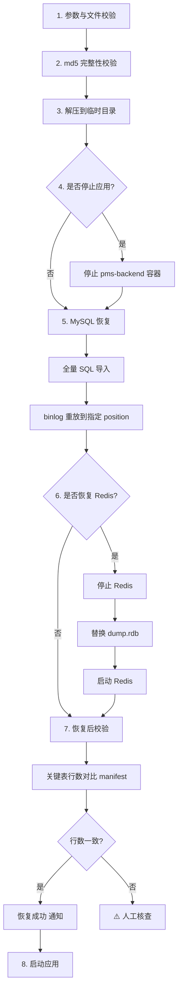
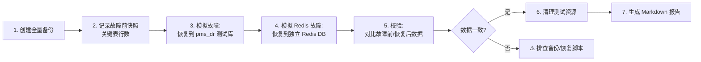
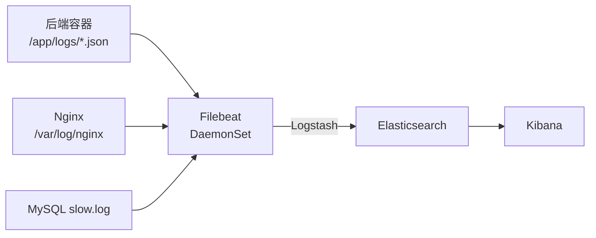
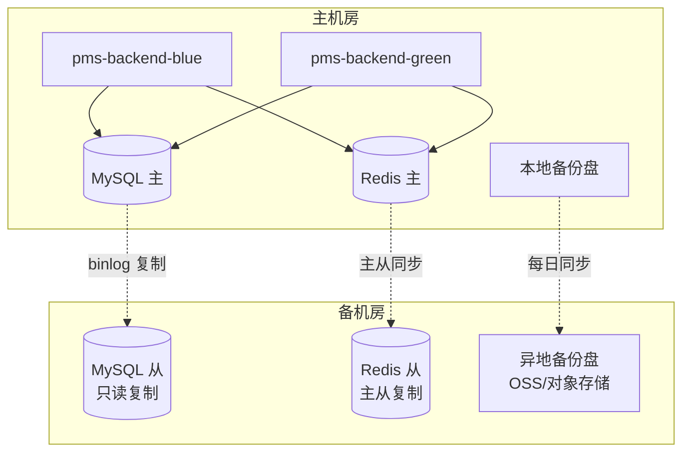

# 运维手册

> 网络设备工程项目管理系统（network-equipment-pms）生产运维手册。
> 涵盖日常巡检、备份恢复、日志管理、监控告警、容量规划、安全运维与 DR 灾备。

## 目录

1. [日常运维任务清单](#1-日常运维任务清单)
2. [备份恢复](#2-备份恢复)
3. [日志管理](#3-日志管理)
4. [监控告警](#4-监控告警)
5. [容量规划](#5-容量规划)
6. [安全运维](#6-安全运维)
7. [DR 灾备方案](#7-dr-灾备方案)

---

## 1. 日常运维任务清单

### 1.1 巡检项与频率

| 频率 | 巡检项 | 检查方式 | 责任人模板 | 异常处理 |
|------|--------|----------|-----------|----------|
| 每日 09:00 | 应用健康 | `./scripts/health-check.sh` | 运维 A | 失败项逐项排查，详见 [故障排查手册](./troubleshooting.md) |
| 每日 09:00 | 容器状态 | `docker ps --format '{{.Names}}\t{{.Status}}'` | 运维 A | 异常退出容器查日志后重启 |
| 每日 09:00 | 磁盘空间 | `df -h` | 运维 A | >85% 触发清理（日志/备份/Docker） |
| 每日 09:00 | 备份任务 | 检查 `/data/backups/pms/backup_*.log` 末尾状态 | 运维 B | 失败重跑 `./scripts/backup.sh` |
| 每日 09:00 | 告警历史 | Grafana → Alerting → Alert history | 运维 A | 评估是否有未恢复告警 |
| 每周一 10:00 | 备份完整性 | 抽样恢复测试（`./scripts/dr-drill.sh`） | 运维 B | 恢复失败排查备份脚本 |
| 每周一 10:00 | 慢 SQL 排查 | Grafana → PMS-SlowSQL 仪表盘 | DBA | Top10 慢 SQL 加索引或优化 |
| 每周一 10:00 | 容量趋势 | Grafana → 资源使用趋势面板 | 运维 A | 增长过快规划扩容 |
| 每月 1 日 | 安全补丁 | `yum check-update` / Docker 镜像 CVE 扫描 | 安全 C | 评估后安排补丁窗口 |
| 每月 1 日 | 密钥轮换评估 | 审查 JWT_SECRET / APP_ENCRYPT_KEY / OAuth secret | 安全 C | 按轮换策略执行 |
| 每季度 | DR 演练 | `./scripts/dr-drill.sh`（隔离环境） | 运维 B | 修复演练暴露的问题 |
| 每季度 | 容量复盘 | 评估 CPU/内存/磁盘/带宽 | 架构 D | 规划下季度扩容 |

### 1.2 巡检脚本

```bash
#!/bin/bash
# /opt/pms/scripts/daily-inspect.sh — 每日巡检（可加入 crontab）
set -e
echo "===== PMS 每日巡检 $(date '+%F %T') ====="

echo "--- 1. 容器状态 ---"
docker ps --format 'table {{.Names}}\t{{.Status}}' | grep -E 'pms-|NAMES'

echo "--- 2. 应用健康 ---"
/opt/pms/scripts/health-check.sh || echo "❌ 健康检查失败"

echo "--- 3. 蓝绿状态 ---"
cat /var/lib/pms/active-env 2>/dev/null || echo "状态文件缺失"

echo "--- 4. 磁盘空间 ---"
df -h | grep -E 'Filesystem|/$|/data|/var/lib/docker'

echo "--- 5. 备份最近状态 ---"
ls -lt /data/backups/pms/backup_*.log 2>/dev/null | head -1
tail -5 "$(ls -t /data/backups/pms/backup_*.log 2>/dev/null | head -1)" 2>/dev/null

echo "--- 6. 告警未恢复 ---"
curl -s http://localhost:9093/api/v2/alerts | jq '[.[] | select(.status.state=="active")] | length'

echo "===== 巡检结束 ====="
```

### 1.3 责任人模板

| 角色 | 姓名 | 联系方式 | 职责 |
|------|------|----------|------|
| 运维 A（主） | ______ | ______ | 日常巡检、容器管理、部署执行 |
| 运维 B（备） | ______ | ______ | 备份恢复、DR 演练 |
| 安全 C | ______ | ______ | 补丁、密钥、漏洞 |
| 架构 D | ______ | ______ | 容量规划、架构优化 |
| DBA | ______ | ______ | 数据库性能、慢 SQL |

---

## 2. 备份恢复

### 2.1 备份脚本（backup.sh）

`scripts/backup.sh` 同时备份 MySQL 全量 + binlog + Redis RDB，支持 Docker 与直连两种模式。

#### 2.1.1 用法

```bash
# 全量备份（默认）
./scripts/backup.sh

# 增量备份（仅 binlog + Redis）
./scripts/backup.sh --type incremental

# 全量备份（显式）
./scripts/backup.sh --type full

# Docker 模式（通过 docker exec 调用容器内命令）
USE_DOCKER=true MYSQL_CONTAINER=pms-mysql REDIS_CONTAINER=pms-redis ./scripts/backup.sh
```

#### 2.1.2 关键参数（环境变量）

| 变量 | 默认值 | 说明 |
|------|--------|------|
| `BACKUP_DIR` | `/data/backups/pms` | 备份根目录 |
| `BACKUP_TYPE` | `full` | 备份类型：full / incremental |
| `MYSQL_HOST` / `MYSQL_PORT` | `127.0.0.1` / `3306` | MySQL 连接 |
| `MYSQL_USER` / `MYSQL_PASSWORD` | `root` / （空） | MySQL 账号 |
| `MYSQL_DATABASE` | `pms` | 数据库名 |
| `REDIS_HOST` / `REDIS_PORT` | `127.0.0.1` / `6379` | Redis 连接 |
| `REDIS_PASSWORD` | （空） | Redis 密码 |
| `USE_DOCKER` | `false` | 是否通过 docker exec 调用容器 |
| `MYSQL_CONTAINER` / `REDIS_CONTAINER` | `pms-mysql` / `pms-redis` | 容器名（USE_DOCKER=true 时） |
| `RETENTION_DAYS` | `30` | 保留天数（实际清理由 backup-cleanup.sh 执行） |
| `MIN_DISK_FREE_MB` | `2048` | 备份前最低可用磁盘 MB，不足则中止 |
| `WEBHOOK_URL` | （空） | 通知 webhook |

#### 2.1.3 备份产物结构

```
/data/backups/pms/pms_20260706_103000/
├── mysql_full.sql.gz          # mysqldump 全量（gzip 压缩）
├── mysql_binlog_000123.binlog # binlog 增量
├── redis_dump.rdb             # Redis RDB 快照
├── manifest.json              # 备份元数据（版本、时间、checksum、表行数）
└── backup_pms_20260706_103000.tar.gz  # 打包归档（含 md5）
```

`manifest.json` 示例：

```json
{
  "backupName": "pms_20260706_103000",
  "type": "full",
  "createdAt": "2026-07-06T10:30:00+08:00",
  "mysql": {
    "database": "pms",
    "dumpFile": "mysql_full.sql.gz",
    "binlogFile": "mysql_binlog_000123.binlog",
    "binlogPosition": 12345,
    "tableCounts": { "pms_project": 1280, "pms_asset": 15680, "sys_user": 42 }
  },
  "redis": { "rdbFile": "redis_dump.rdb", "keyCount": 15234 },
  "checksum": "a1b2c3d4..."
}
```

### 2.2 恢复脚本（restore.sh）

#### 2.2.1 用法

```bash
# 从归档恢复（交互确认）
./scripts/restore.sh /data/backups/pms/pms_20260706_103000.tar.gz

# 跳过确认（脚本化）
./scripts/restore.sh /data/backups/pms/pms_20260706_103000.tar.gz --yes

# 仅恢复 MySQL（跳过 Redis）
./scripts/restore.sh <backup.tar.gz> --skip-redis

# 仅恢复 Redis（跳过 MySQL）
./scripts/restore.sh <backup.tar.gz> --skip-mysql
```

#### 2.2.2 恢复流程



#### 2.2.3 关键参数

| 变量 | 默认值 | 说明 |
|------|--------|------|
| `BACKUP_DIR` | `/data/backups/pms` | 备份目录（用于查找归档） |
| `BACKEND_CONTAINER` | `pms-backend` | 应用容器名（恢复前停止） |
| `MYSQL_CONTAINER` / `REDIS_CONTAINER` | `pms-mysql` / `pms-redis` | 基础设施容器 |
| `USE_DOCKER` | `false` | 是否通过 docker exec |
| `MYSQL_*` / `REDIS_*` | 同 backup.sh | 连接参数 |

> **警告**：恢复操作会覆盖现有数据，务必先停应用避免数据冲突，且在维护窗口执行。生产恢复前务必在测试环境演练。

### 2.3 备份策略

| 维度 | 策略 | 说明 |
|------|------|------|
| 频率 | 每日 02:00 全量 + 每小时增量 | 全量 mysqldump + binlog；增量仅 binlog + Redis |
| 保留期 | 30 天 | 由 `backup-cleanup.sh` 执行，保留每周一与每月 1 号 |
| 存储位置 | 本地 `/data/backups/pms` + 异地 OSS | 异地同步防止机房故障 |
| 加密 | tar.gz 整包 AES 加密（可选） | 敏感行业建议加密后上传异地 |
| 校验 | md5 + 恢复演练 | 每周抽样恢复，校验表行数 |

#### crontab 配置示例

```bash
# 编辑 crontab
crontab -e

# PMS 备份计划
SHELL=/bin/bash
PATH=/usr/local/bin:/usr/bin:/bin
PMS_DIR=/opt/pms

# 每日 02:00 全量备份
0 2 * * * cd $PMS_DIR && USE_DOCKER=true ./scripts/backup.sh --type full >> /data/backups/pms/cron.log 2>&1

# 每小时整点增量备份（仅 binlog + Redis）
0 * * * * cd $PMS_DIR && USE_DOCKER=true ./scripts/backup.sh --type incremental >> /data/backups/pms/cron.log 2>&1

# 每日 03:30 清理过期备份
30 3 * * * cd $PMS_DIR && ./scripts/backup-cleanup.sh >> /data/backups/pms/cleanup.log 2>&1

# 每日 04:00 异地同步到 OSS（示例，按实际 OSS 工具调整）
0 4 * * * ossutil cp -r /data/backups/pms oss://pms-backup/$(date +\%F)/ --update >> /data/backups/pms/oss-sync.log 2>&1

# 每周一 05:00 DR 演练（隔离测试库）
0 5 * * 1 cd $PMS_DIR && DR_ENV=test ./scripts/dr-drill.sh >> /data/backups/pms/dr-drill.log 2>&1
```

### 2.4 恢复演练（dr-drill.sh）

`scripts/dr-drill.sh` 在**隔离测试环境**执行端到端 DR 演练，绝不触碰生产库。

#### 2.4.1 用法

```bash
# 默认在测试环境执行
DR_ENV=test ./scripts/dr-drill.sh

# 自定义测试库后缀（默认 _dr）
DR_ENV=test MYSQL_DATABASE=pms ./scripts/dr-drill.sh

# 跳过用户确认（CI 用）
DR_ENV=test ./scripts/dr-drill.sh --yes
```

#### 2.4.2 演练流程



#### 2.4.3 安全约束

- 仅在 `DR_ENV=test` 时允许实际恢复操作
- 使用独立测试库后缀 `_dr`，绝不触碰生产库
- 所有破坏性操作需用户确认（除非 `--yes`）

#### 2.4.4 演练报告

脚本生成 Markdown 报告至 `/tmp/dr_drill_<timestamp>/report.md`，包含：

- 备份元数据（时间、大小、checksum）
- 故障前关键表行数
- 恢复后关键表行数
- 一致性校验结果
- 总耗时

### 2.5 备份清理（backup-cleanup.sh）

#### 2.5.1 保留策略

| 策略 | 说明 |
|------|------|
| 最近 N 天全保留 | `KEEP_RECENT_DAYS=7`，7 天内不论星期全保留 |
| 每周一保留 | 周备份，用于月内回溯 |
| 每月 1 号保留 | 月备份，长期归档 |
| 超期清理 | 超过 `RETENTION_DAYS=30` 且不符合上述条件的删除 |

#### 2.5.2 用法

```bash
# 默认清理（30 天保留，7 天全保留）
./scripts/backup-cleanup.sh

# 自定义保留期
RETENTION_DAYS=60 KEEP_RECENT_DAYS=14 ./scripts/backup-cleanup.sh

# 演练模式（只打印不删除）
./scripts/backup-cleanup.sh --dry-run
```

#### 2.5.3 安全检查

- 清理前校验至少有一个近期备份（避免误删所有备份）
- `--dry-run` 模式只打印不删除
- 删除前记录日志到 `cleanup_<timestamp>.log`

### 2.6 异地备份同步

| 方案 | 工具 | 频率 | 说明 |
|------|------|------|------|
| 阿里云 OSS | `ossutil` | 每日 04:00 | `ossutil cp -r /data/backups/pms oss://pms-backup/$(date +%F)/` |
| AWS S3 | `aws s3 sync` | 每日 04:00 | `aws s3 sync /data/backups/pms s3://pms-backup/$(date +%F)/` |
| rsync 远程 | `rsync` | 每小时 | `rsync -avz /data/backups/pms/ backup@remote:/data/pms-backup/` |

> 异地备份建议启用服务端加密（SSE）或客户端 AES 加密，密钥与备份分开存储。

---

## 3. 日志管理

### 3.1 日志路径

| 组件 | 路径 | 说明 |
|------|------|------|
| 后端应用 | 容器内 `/app/logs/` | 业务日志，由 logback-spring.xml 输出 |
| 后端 stdout | `docker logs pms-backend-blue` | 容器标准输出，含启动日志 |
| Docker 容器日志 | `/var/lib/docker/containers/<id>/<id>-json.log` | Docker json 驱动 |
| Nginx 访问 | `/var/log/nginx/access.log` | 宿主 nginx |
| Nginx 错误 | `/var/log/nginx/error.log` | 宿主 nginx |
| 前端 Nginx | `docker logs pms-frontend` | 容器内 `/var/log/nginx/` |
| MySQL | `docker exec pms-mysql cat /var/lib/mysql/<host>.err` | 错误日志 |
| MySQL 慢查询 | `docker exec pms-mysql cat /var/lib/mysql/slow.log` | 需开启 slow_query_log |
| Redis | `docker logs pms-redis` | 容器标准输出 |
| 备份脚本 | `/data/backups/pms/backup_*.log` | 每次备份一个日志 |
| 巡检脚本 | `/var/log/pms-inspect.log`（自定义） | 巡检输出 |

### 3.2 日志格式（JSON 结构化）

后端使用 Logback（`pms-admin/src/main/resources/logback-spring.xml`）输出 JSON 结构化日志，便于 ELK / Loki 解析：

```json
{
  "timestamp": "2026-07-06T10:30:00.123+08:00",
  "level": "INFO",
  "logger": "com.dp.plat.project.controller.ProjectController",
  "thread": "http-nio-8080-exec-1",
  "traceId": "a1b2c3d4e5f6",
  "spanId": "abcdef123456",
  "userId": 1001,
  "username": "zhangsan",
  "message": "项目创建成功 projectId=1280",
  "context": {
    "requestUri": "/api/project",
    "method": "POST",
    "remoteIp": "10.0.0.1"
  }
}
```

关键字段：
- `traceId` / `spanId`：与 Jaeger 链路追踪关联
- `userId` / `username`：由 `UserContextFilter` 注入 MDC
- `context`：由 `TraceIdFilter` 注入请求上下文

### 3.3 日志收集方案

#### 3.3.1 ELK（Elasticsearch + Logstash + Kibana）



`filebeat.yml` 示例：

```yaml
filebeat.inputs:
  - type: container
    paths:
      - '/var/lib/docker/containers/*/*.log'
    processors:
      - decode_json_fields:
          fields: ['message']
          target: ''
    containers.ids:
      - pms-backend-blue
      - pms-backend-green

  - type: log
    paths:
      - /var/log/nginx/*.log
    fields:
      source: nginx

output.logstash:
  hosts: ['logstash:5044']
```

#### 3.3.2 Loki + Promtail（轻量替代）

```yaml
# promtail-config.yml
server:
  http_listen_port: 9080

positions:
  filename: /tmp/positions.yaml

clients:
  - url: http://loki:3100/loki/api/v1/push

scrape_configs:
  - job_name: pms-backend
    docker_sd_configs:
      - host: unix:///var/run/docker.sock
        filters:
          - name: name
            values: ['pms-backend-blue', 'pms-backend-green']
    pipeline_stages:
      - json:
          expressions:
            level: level
            traceId: traceId
            logger: logger
      - labels:
          level:
          logger:

  - job_name: nginx
    static_configs:
      - targets: [localhost]
        labels:
          job: nginx
          __path__: /var/log/nginx/*.log
```

Grafana 中添加 Loki 数据源即可查询。

### 3.4 日志归档与清理

| 日志类型 | 归档策略 | 保留期 | 清理方式 |
|----------|----------|--------|----------|
| 后端应用日志 | 按日滚动 + gzip | 30 天 | logback `SizeAndTimeBasedRollingPolicy` |
| Docker 容器日志 | json 驱动 | 7 天 | logrotate 或 docker daemon 配置 |
| Nginx 访问日志 | 按日滚动 | 30 天 | logrotate |
| MySQL binlog | 自动 expire | 7 天 | `expire_logs_days=7` |
| MySQL 慢查询 | 按大小滚动 | 30 天 | logrotate |
| 备份脚本日志 | 不滚动 | 30 天 | `backup-cleanup.sh` 一并清理 |

#### Docker 日志轮转（daemon.json）

```json
// /etc/docker/daemon.json
{
  "log-driver": "json-file",
  "log-opts": {
    "max-size": "100m",
    "max-file": "5"
  }
}
```

修改后重启 Docker：`sudo systemctl restart docker`。

#### logrotate 示例（Nginx）

```conf
# /etc/logrotate.d/nginx
/var/log/nginx/*.log {
    daily
    rotate 30
    compress
    delaycompress
    missingok
    notifempty
    postrotate
        if [ -f /var/run/nginx.pid ]; then
            kill -USR1 `cat /var/run/nginx.pid`
        fi
    endscript
}
```

---

## 4. 监控告警

### 4.1 Prometheus 抓取配置

`deploy/prometheus/prometheus.yml`：

```yaml
global:
  scrape_interval: 15s
  evaluation_interval: 15s
  external_labels:
    application: pms

alerting:
  alertmanagers:
    - static_configs:
        - targets: ['alertmanager:9093']

rule_files:
  - /etc/prometheus/rules/*.yml

scrape_configs:
  - job_name: 'pms-app'
    metrics_path: '/actuator/prometheus'
    static_configs:
      - targets: ['backend:8080']
        labels:
          application: pms
  - job_name: 'node'
    static_configs:
      - targets: ['node-exporter:9100']
```

> **蓝绿部署注意**：Prometheus 抓取 `backend:8080`（Docker DNS）。蓝绿模式下需确保 `backend` 服务名指向活跃容器，或改为抓取两个端口。生产推荐部署 [node-exporter](https://github.com/prometheus/node_exporter) 监控宿主机指标。

后端通过 `spring-boot-starter-actuator` + `micrometer-registry-prometheus` 暴露 `/actuator/prometheus`，关键指标：

| 指标前缀 | 来源 | 说明 |
|----------|------|------|
| `http_server_requests_seconds` | Micrometer | HTTP 请求 QPS / 延迟 / 错误率 |
| `jvm_*` | Micrometer | JVM 堆 / GC / 线程 |
| `hikaricp_*` | Micrometer | 数据库连接池 |
| `resilience4j_circuitbreaker_*` | Resilience4j | 熔断器状态 |
| `pms_slow_sql_total` | SlowSqlInterceptor | 慢 SQL 计数（warn/error 阈值） |
| `pms_integration_*` | BusinessMetrics | D365/FP/OA 集成指标 |
| `pms_schedule_*` | BusinessMetrics | 定时任务指标 |
| `pms_settlement_*` | BusinessMetrics | 结算业务指标 |

### 4.2 Grafana 仪表盘

Grafana 通过 provisioning 自动加载，配置见 `deploy/grafana/provisioning/dashboards/dashboards.yaml`：

```yaml
apiVersion: 1
providers:
  - name: 'PMS Dashboards'
    orgId: 1
    folder: 'PMS'
    type: file
    disableDeletion: false
    updateIntervalSeconds: 30
    allowUiUpdates: true
    options:
      path: /var/lib/grafana/dashboards
```

数据源（`deploy/grafana/provisioning/datasources/datasources.yaml`）：

```yaml
apiVersion: 1
datasources:
  - name: Prometheus
    type: prometheus
    access: proxy
    url: http://prometheus:9090
    isDefault: true
    jsonData:
      timeInterval: 15s
      httpMethod: POST
```

5 个预置仪表盘（位于 `deploy/grafana/dashboards/`）：

| 仪表盘文件 | 名称 | 主要面板 | 适用场景 |
|-----------|------|----------|----------|
| `api-overview.json` | API 总览 | QPS、P95/P99 延迟、错误率、状态码分布、Top10 慢接口 | 接口性能监控 |
| `jvm.json` | JVM 监控 | 堆内存、GC 次数/耗时、线程状态、CPU、类加载数 | JVM 健康与调优 |
| `business-metrics.json` | 业务指标 | 项目/资产/结算计数、结算金额、慢 SQL 速率、定时任务失败率 | 业务运营监控 |
| `integration-health.json` | 集成健康 | D365/FP/OA 调用成功率、延迟、熔断器状态、集成健康检查 | 外部集成监控 |
| `schedule-tasks.json` | 定时任务 | 任务执行次数、失败率、耗时分布、当前运行任务 | 调度任务监控 |

**访问方式**：浏览器打开 `http://<grafana-host>:3000`，账号 `admin` / 密码见 `.env` 的 `GRAFANA_ADMIN_PASSWORD`，进入 `PMS` 文件夹查看仪表盘。

### 4.3 Alertmanager 告警规则

告警规则分两层：Prometheus rules（`deploy/prometheus/rules/`）+ Grafana Managed rules（`deploy/grafana/alerting/rules.yaml`）。

#### 4.3.1 Prometheus 告警规则

| 规则文件 | 告警名 | 触发条件 | 持续 | 级别 |
|----------|--------|----------|------|------|
| `api-alerts.yml` | `APIErrorRateHigh` | 5xx 错误率 > 5% | 5m | critical |
| `api-alerts.yml` | `APIHighLatencyP95` | P95 延迟 > 2s | 10m | warning |
| `api-alerts.yml` | `APIRequestRateDrop` | QPS < 0.1 | 15m | warning |
| `jvm-alerts.yml` | `JVMHeapHigh` | 堆使用率 > 85% | 5m | warning |
| `jvm-alerts.yml` | `JVMHeapCritical` | 堆使用率 > 95% | 2m | critical |
| `jvm-alerts.yml` | `JVMHighGC` | GC 频率 > 5/s | 5m | warning |
| `jvm-alerts.yml` | `JVMThreadsBlocked` | 阻塞线程 > 10 | 5m | warning |
| `jvm-alerts.yml` | `JVMProcessCPUPercentHigh` | 进程 CPU > 90% | 10m | warning |
| `business-alerts.yml` | `SlowSqlError` | >5s 慢 SQL 速率 > 0 | 2m | critical |
| `business-alerts.yml` | `SlowSqlWarn` | >1s 慢 SQL 速率 > 1/s | 5m | warning |
| `business-alerts.yml` | `ScheduleTaskFailure` | 定时任务失败速率 > 0 | 5m | warning |
| `business-alerts.yml` | `BusinessSettlementAnomaly` | 1h 无结算记录 | 2h | info |
| `integration-alerts.yml` | `CircuitBreakerOpen` | 熔断器 open | 1m | critical |
| `integration-alerts.yml` | `IntegrationFailure` | 集成失败率 > 0.5/s | 5m | critical |
| `integration-alerts.yml` | `IntegrationHealthDown` | 集成健康检查 down | 2m | critical |
| `integration-alerts.yml` | `IntegrationLatencyHigh` | 集成 P95 > 5s | 5m | warning |

#### 4.3.2 Alertmanager 路由

`deploy/alertmanager/alertmanager.yml`：

```yaml
global:
  resolve_timeout: 5m

route:
  group_by: ['alertname', 'application']
  group_wait: 30s
  group_interval: 5m
  repeat_interval: 4h
  receiver: 'default'
  routes:
    - matchers:
        - severity = critical
      receiver: 'default'
      group_wait: 10s
      repeat_interval: 1h

receivers:
  - name: 'default'
    webhook_configs:
      - url: 'http://backend:8080/api/ops/alert/webhook'
        send_resolved: true
        max_alerts: 0

inhibit_rules:
  - source_matchers:
      - severity = critical
    target_matchers:
      - severity = warning
    equal: ['alertname', 'application']
```

**默认行为**：告警通过 webhook 推送到后端 `/api/ops/alert/webhook`，由后端转发到邮件/钉钉/企业微信。critical 告警 10s 内推送、1h 重复；warning 被 critical 抑制（相同 alertname + application）。

### 4.4 告警通知渠道配置

后端 `OpsAlertController` 接收 Alertmanager webhook 后分发到多渠道。配置通过 `application.yml` 或环境变量：

#### 4.4.1 邮件

```yaml
# application-prod.yml 追加
spring:
  mail:
    host: smtp.example.com
    port: 465
    username: alert@example.com
    password: ${MAIL_PASSWORD}
    properties:
      mail.smtp.ssl.enable: true
      mail.smtp.auth: true

app:
  alert:
    mail:
      enabled: true
      to: [ops@example.com, dev@example.com]
      cc: [lead@example.com]
```

#### 4.4.2 钉钉

```yaml
app:
  alert:
    dingtalk:
      enabled: true
      webhook: https://oapi.dingtalk.com/robot/send?access_token=xxx
      secret: ${DINGTALK_SECRET}    # 加签密钥
      at-all: false                  # critical 告警可设 true
      at-mobiles: [13800138000]
```

#### 4.4.3 企业微信

```yaml
app:
  alert:
    wechat:
      enabled: true
      webhook: https://qyapi.weixin.qq.com/cgi-bin/webhook/send?key=xxx
      mentioned-list: [ops-team]
```

#### 4.4.4 通知分级建议

| 级别 | 通知渠道 | 响应时效 |
|------|----------|----------|
| critical | 钉钉/企业微信 @全员 + 电话 | 15 分钟内响应 |
| warning | 钉钉/企业微信 @值班人 | 1 小时内响应 |
| info | 邮件 | 工作日处理 |

---

## 5. 容量规划

### 5.1 CPU 估算

| 因素 | 估算方法 |
|------|----------|
| 并发用户数 | 业务峰值在线用户 × 0.3（并发比） |
| 单请求 CPU | 平均 50ms × 1 核 = 0.05 核秒 |
| 峰值 QPS | 并发用户 / 平均请求耗时 |
| 所需核心数 | 峰值 QPS × 0.05 × 1.5（余量） |

**示例**：500 在线用户，峰值并发 150，平均请求 200ms，峰值 QPS = 150/0.2 = 750 → CPU = 750 × 0.05 × 1.5 ≈ 56 核秒/s → 8 核服务器（含 DB + Redis + 应用）。

### 5.2 内存估算

| 组件 | 估算 |
|------|------|
| JVM 堆 | 2~4G（按业务对象数量） |
| Metaspace | 256M |
| 堆外 + 线程 | 1G |
| MySQL innodb_buffer_pool | 物理内存 50~60% |
| Redis maxmemory | 业务缓存总量 × 1.5 |
| 系统预留 | 2G |

**示例**：8G 内存服务器 → JVM 2G + MySQL 3G + Redis 1G + 系统 2G。

### 5.3 磁盘估算

| 数据类型 | 增长率（示例） | 1 年容量 |
|----------|---------------|----------|
| 业务数据（项目/资产/工作流） | 50 MB/天 | ~18 GB |
| binlog | 100 MB/天 | ~36 GB |
| Redis RDB + AOF | 50 MB/天 | ~18 GB |
| 应用日志 | 200 MB/天 | ~73 GB |
| 备份（全量+增量） | 500 MB/天 | ~180 GB |
| Docker 镜像层 | 一次性 3 GB | 3 GB |

**示例**：1 年 ≈ 330 GB，建议初始 500 GB SSD，预留 50% 余量。

### 5.4 带宽估算

| 场景 | 单次大小 | 频率 | 带宽 |
|------|----------|------|------|
| API 请求/响应 | 5 KB | 100 QPS | 4 Mbps |
| 文件上传 | 5 MB | 10 次/分钟 | 6.7 Mbps |
| 前端首屏 | 2 MB | 50 用户/分钟 | 13 Mbps |
| Prometheus 抓取 | 200 KB | 4 次/分钟 | 0.1 Mbps |
| 备份异地同步 | 平均 | 每日 | 突发 100 Mbps |

**示例**：峰值带宽 ≈ 25 Mbps，建议 100 Mbps 专线或按量付费带宽。

### 5.5 容量告警阈值

| 指标 | warning | critical | 行动 |
|------|---------|----------|------|
| CPU 使用率 | 70% 持续 10m | 90% 持续 5m | 扩容或优化 |
| 内存使用率 | 80% 持续 10m | 90% 持续 5m | 扩容 |
| 磁盘使用率 | 75% | 85% | 清理或扩容 |
| MySQL 连接数 | 80% pool | 95% pool | 调大连接池 |
| Redis 内存 | 70% maxmemory | 85% maxmemory | 调大 maxmemory 或清理 |

---

## 6. 安全运维

### 6.1 密钥轮换策略

| 密钥 | 轮换频率 | 轮换影响 | 轮换步骤 |
|------|----------|----------|----------|
| `MYSQL_ROOT_PASSWORD` | 季度 | 无（仅运维） | 1. 改 MySQL 2. 改 .env 3. 重启应用 |
| `MYSQL_PASSWORD` | 季度 | 短暂连接失败 | 1. 改 MySQL 2. 改 .env 3. 滚动重启 |
| `REDIS_PASSWORD` | 季度 | 缓存失效重建 | 1. 改 Redis 2. 改 .env 3. 重启应用 |
| `JWT_SECRET` | 半年 | 所有 Token 失效，用户重新登录 | 1. 改 .env 2. 重启应用 3. 通知用户 |
| `APP_ENCRYPT_KEY` | **不轮换** | 历史加密数据不可解密 | ⚠️ 配置后不可更改，如必须轮换需先解密再加密 |
| `GRAFANA_ADMIN_PASSWORD` | 季度 | 需重新登录 | `grafana-cli admin reset-admin-password` |
| OAuth client_secret（D365/FP/OA） | 按外部系统策略 | 集成短暂失败 | 协调外部系统同步更换 |
| SSH 私钥（CI/CD） | 年度 | CI 部署失败 | 1. 生成新密钥 2. 更新 GitHub Secret 3. 更新 authorized_keys |

> **警告**：`APP_ENCRYPT_KEY` 用于 AES-256-GCM 字段级加密（如手机号、身份证），配置后**绝不可更改**，否则历史加密数据无法解密。如必须轮换，需编写迁移脚本先解密旧数据再用新密钥加密。

### 6.2 漏洞修复与补丁管理

#### 6.2.1 OS 补丁

```bash
# 检查可用更新
sudo yum check-update            # CentOS
sudo apt list --upgradable       # Ubuntu

# 安装安全补丁（仅安全更新）
sudo yum update --security       # CentOS
sudo unattended-upgrade --dry-run # Ubuntu

# 重启（内核补丁需要）
sudo needs-restarting -r         # CentOS 判断是否需重启
```

#### 6.2.2 Docker 镜像 CVE 扫描

```bash
# 使用 trivy 扫描镜像
trivy image ghcr.io/org/network-equipment-pms/pms-backend:v1.2.3

# 扫描基础镜像
trivy image mysql:8.0.36
trivy image redis:7.2-alpine
trivy image eclipse-temurin:17-jre-jammy

# 仅显示 HIGH/CRITICAL
trivy image --severity HIGH,CRITICAL ghcr.io/org/network-equipment-pms/pms-backend:v1.2.3
```

#### 6.2.3 补丁窗口

| 类型 | 窗口 | 影响 | 回滚 |
|------|------|------|------|
| OS 安全补丁 | 每月第 2 周六 02:00-04:00 | 应用重启 | 保留旧内核可回滚 |
| Docker 升级 | 季度第 1 周六 02:00-06:00 | 全部容器重启 | 降级 Docker 包 |
| 基础镜像升级 | 季度 | 重建镜像 + 蓝绿部署 | 回滚到旧 tag |
| 应用依赖 CVE | 视严重程度 | 紧急热修复 | 蓝绿回滚 |

### 6.3 访问控制

| 资源 | 访问方式 | 审计 |
|------|----------|------|
| 生产服务器 SSH | 跳板机 + 2FA | 操作日志审计 |
| MySQL | 仅应用容器 + 跳板机 | 开启 audit log |
| Redis | 仅应用容器 + 跳板机 | `CONFIG` 命令禁用 |
| Grafana | SSO + RBAC | 登录与操作日志 |
| GitHub Secrets | 仅 CI | Actions 日志 |
| 镜像仓库 | 服务账号 + 2FA | 推送日志 |

### 6.4 安全基线检查清单

- [ ] 所有容器以非 root 运行（backend UID 1000，frontend UID 1001）
- [ ] Docker 网络隔离（pms-network 仅内部通信）
- [ ] MySQL/Redis 端口不对外暴露
- [ ] Nginx 启用 TLS 1.2/1.3，禁用旧协议
- [ ] 安全响应头（X-Frame-Options / X-Content-Type-Options / HSTS）
- [ ] 文件上传校验（类型、大小、内容）
- [ ] SQL 注入防护（MyBatis 参数化 + SlowSqlInterceptor 监控）
- [ ] XSS 过滤（XssFilter）
- [ ] CSRF 防护（JWT Bearer，无 cookie 会话）
- [ ] 限流（@RateLimit + RateLimitFilter）
- [ ] 操作日志（@OperLog 审计）
- [ ] 字段加密（@FieldEncrypt AES-256-GCM）

---

## 7. DR 灾备方案

### 7.1 RTO / RPO 目标

| 指标 | 目标 | 实现方式 |
|------|------|----------|
| RPO（数据丢失容忍） | ≤ 1 小时 | 每小时增量备份 + binlog |
| RTO（恢复时间目标） | ≤ 4 小时 | 备份归档 + 自动化恢复脚本 + DR 演练 |

### 7.2 灾备架构



### 7.3 主备切换流程

#### 7.3.1 数据库主从切换

```bash
# 1. 确认主库不可用
mysqladmin -h pms-db-01 -uroot -p ping  # 无响应

# 2. 在备库执行提升为主
ssh backup@pms-db-02
mysql -uroot -p <<EOF
STOP SLAVE;
RESET MASTER;
SET GLOBAL read_only=OFF;
EOF

# 3. 更新应用 .env 指向备库
sed -i 's/SPRING_DATASOURCE_URL=.*mysql:\/\/pms-db-01/SPRING_DATASOURCE_URL=jdbc:mysql:\/\/pms-db-02/' /opt/pms/.env

# 4. 重启应用（蓝绿）
./scripts/deploy.sh
```

#### 7.3.2 Redis 主从切换

```bash
# 1. 确认主 Redis 不可用
redis-cli -h pms-redis-01 -a $REDIS_PASSWORD PING  # 无响应

# 2. 在备 Redis 提升为主
ssh backup@pms-redis-02
redis-cli -a $REDIS_PASSWORD SLAVEOF NO ONE

# 3. 更新应用 .env
sed -i 's/SPRING_DATA_REDIS_HOST=pms-redis-01/SPRING_DATA_REDIS_HOST=pms-redis-02/' /opt/pms/.env

# 4. 重启应用
./scripts/deploy.sh
```

#### 7.3.3 整机房故障切换

```bash
# 1. 切换 DNS 到备机房
# 2. 备机房启动完整栈
cd /opt/pms-dr
docker compose -f docker-compose.infra.yml -f docker-compose.app.yml up -d
# 3. 验证健康
./scripts/health-check.sh
# 4. 通知用户
```

### 7.4 DR 演练计划

| 频率 | 演练内容 | 参与角色 | 通过标准 |
|------|----------|----------|----------|
| 每周 | 备份恢复演练（`dr-drill.sh`） | 运维 B | 数据一致，报告生成 |
| 每月 | 数据库主从切换 | DBA + 运维 A | 切换 < 30 分钟，应用无数据丢失 |
| 每季度 | 整机房故障切换 | 全员 | RTO < 4 小时，RPO < 1 小时 |
| 每年 | 全链路混沌工程 | 全员 + 架构 | 满足 RTO/RPO，发现并修复单点 |

### 7.5 DR 演练报告模板

`dr-drill.sh` 自动生成报告，关键内容：

```markdown
# PMS DR 演练报告

## 演练信息
- 演练时间：2026-07-06 05:00:00
- 演练环境：test
- 执行人：运维 B
- 备份文件：pms_20260706_020000.tar.gz (1.2 GB)

## 演练步骤
1. ✅ 创建全量备份（耗时 4m32s）
2. ✅ 记录故障前快照（pms_project=1280, pms_asset=15680, sys_user=42）
3. ✅ 恢复到 pms_dr 测试库（耗时 8m15s）
4. ✅ 恢复 Redis 到独立 DB（耗时 1m20s）
5. ✅ 数据一致性校验
6. ✅ 清理测试资源

## 校验结果
| 表名 | 故障前 | 恢复后 | 一致 |
|------|--------|--------|------|
| pms_project | 1280 | 1280 | ✅ |
| pms_asset | 15680 | 15680 | ✅ |
| sys_user | 42 | 42 | ✅ |

## RTO 评估
- 备份+恢复总耗时：13m47s
- 预计生产恢复耗时（含应用重启）：~25 分钟
- 满足 RTO ≤ 4 小时目标：✅

## RPO 评估
- 最近备份时间：2026-07-06 02:00:00
- 演练时间：2026-07-06 05:00:00
- 数据丢失窗口：≤ 3 小时（每小时增量备份）
- 满足 RPO ≤ 1 小时目标：❌（需调整为 30 分钟增量）

## 改进项
- [ ] 增量备份频率从 1 小时调整为 30 分钟
```

### 7.6 应急联系人

| 角色 | 姓名 | 手机 | 邮箱 | 职责 |
|------|------|------|------|------|
| 运维负责人 | ______ | ______ | ______ | 一线响应、决策 |
| DBA | ______ | ______ | ______ | 数据库恢复 |
| 架构师 | ______ | ______ | ______ | 架构决策 |
| 安全负责人 | ______ | ______ | ______ | 安全事件 |
| 业务负责人 | ______ | ______ | ______ | 业务影响评估 |
| 厂商支持 | ______ | ______ | ______ | 第三方系统 |

---

## 相关文件

| 文件 | 说明 |
|------|------|
| `scripts/backup.sh` | 备份脚本（MySQL + binlog + Redis） |
| `scripts/restore.sh` | 恢复脚本 |
| `scripts/dr-drill.sh` | DR 演练脚本 |
| `scripts/backup-cleanup.sh` | 备份清理脚本 |
| `scripts/health-check.sh` | 综合健康检查 |
| `deploy/prometheus/prometheus.yml` | Prometheus 抓取配置 |
| `deploy/prometheus/rules/*.yml` | Prometheus 告警规则 |
| `deploy/grafana/dashboards/*.json` | Grafana 仪表盘 |
| `deploy/grafana/alerting/rules.yaml` | Grafana 托管告警规则 |
| `deploy/alertmanager/alertmanager.yml` | Alertmanager 路由 |
| `pms-admin/src/main/resources/logback-spring.xml` | 后端日志配置 |

> **相关文档**：[部署指南](./deployment.md) | [故障排查手册](./troubleshooting.md) | [API 规范](./api-spec.md) | [低代码使用指南](./lowcode-guide.md)
