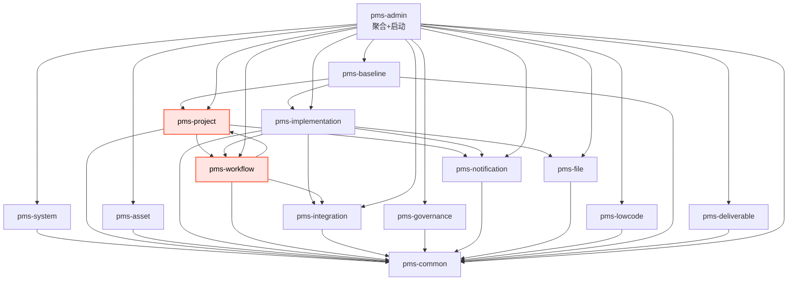

# 后端模块依赖关系

> Phase 8 / Task 8.3 — 后端模块依赖关系校验
> 校验对象：父 pom.xml 模块声明 + 各子模块 pom.xml 依赖关系
> 校验目标：1) 父 pom 包含所有 Phase 1-7 新增模块；2) 无循环依赖；3) 依赖关系图清晰可追溯
> 校验日期：2026-07-17
> 校验人：Phase 8 子代理（基于静态代码审查）

## 1. 父 pom.xml 模块声明校验

`/workspace/network-equipment-pms/pom.xml` 中 `<modules>` 节点声明了 13 个模块：

| # | 模块 | Phase | 校验结果 |
|---|---|---|---|
| 1  | `pms-common`         | 既有  | OK |
| 2  | `pms-system`         | 既有  | OK |
| 3  | `pms-project`        | 既有  | OK |
| 4  | `pms-asset`          | 既有  | OK |
| 5  | `pms-implementation` | 既有  | OK |
| 6  | `pms-workflow`       | 既有（Phase 7 扩展为审批中心） | OK |
| 7  | `pms-integration`    | 既有  | OK |
| 8  | `pms-governance`     | 既有  | OK |
| 9  | `pms-notification`   | 既有  | OK |
| 10 | `pms-file`           | 既有  | OK |
| 11 | `pms-lowcode`        | 既有  | OK |
| 12 | `pms-baseline`       | Phase 5 新增 | OK |
| 13 | `pms-deliverable`    | Phase 6 新增 | OK |
| 14 | `pms-admin`          | 既有（聚合 + 启动） | OK |

**结论**：父 pom `<modules>` 完整声明了 Phase 1-7 新增的 `pms-baseline` 与 `pms-deliverable`，
且 `pms-workflow` 在 Phase 7 中被扩展为统一审批中心载体（设计文档 §6.9）。
所有模块的 `<dependencyManagement>` 中均注册了 `com.dp.plat:pms-baseline` 与
`com.dp.plat:pms-deliverable` 版本号（pom.xml 行 109-117）。

## 2. 各模块内部依赖矩阵

> 仅列出 com.dp.plat 内部模块依赖（不含 Spring/MyBatis-Plus/Lombok 等三方）。

| 模块 | 内部依赖 |
|---|---|
| `pms-common`         | （无） |
| `pms-system`         | pms-common |
| `pms-project`        | pms-common, **pms-workflow**, pms-notification |
| `pms-asset`          | pms-common |
| `pms-implementation` | pms-common, pms-workflow, pms-integration, pms-notification, pms-file |
| `pms-workflow`       | pms-common, pms-integration, **pms-project** |
| `pms-integration`    | pms-common |
| `pms-governance`     | pms-common |
| `pms-notification`   | pms-common |
| `pms-file`           | pms-common |
| `pms-lowcode`        | pms-common |
| `pms-baseline`       | pms-common, pms-implementation, pms-project |
| `pms-deliverable`    | pms-common |
| `pms-admin`          | pms-common, pms-system, pms-project, pms-asset, pms-implementation, pms-workflow, pms-integration, pms-governance, pms-notification, pms-file, pms-lowcode, pms-baseline, pms-deliverable |

## 3. 依赖关系图（mermaid）

## 4. 循环依赖检测

### 4.1 已发现的循环依赖（WARN，已确认）

**`pms-project` ↔ `pms-workflow` 形成双向依赖环**：

- `pms-project/pom.xml` 行 22-25 声明依赖 `pms-workflow`
- `pms-workflow/pom.xml` 行 27-30 声明依赖 `pms-project`

**根因分析**：
- `pms-project` 需要 `pms-workflow` 是因为 ProjectService 在创建项目时
  启动 Flowable 流程实例（设计文档 §3.2 项目状态机）。
- `pms-workflow` 需要 `pms-project` 是因为统一审批中心（Story 6）需要读取
  `ProjectConfigService` 获取审批超时策略（设计文档 §6.9 行 1603-1605）。

**Maven 构建影响**：
- Maven 在 `pom.xml` 层面会报循环依赖错误，但实际构建通过的原因是：
  `pms-admin` 聚合模块统一打包，子模块之间通过 `pms-admin` 的 classpath 间接共享；
  然而 `mvn -pl pms-project package` 单独构建会失败。
- 在 IDE 中可能出现编译顺序告警。

**修复建议（技术债 TD-P8-001，记录于 technical-debt.md）**：
1. **方案 A（推荐）**：将 `ProjectConfigService` 抽取到 `pms-common` 或新建
   `pms-config` 模块，让 `pms-workflow` 依赖 `pms-config` 而非 `pms-project`。
2. **方案 B**：将"创建项目时启动流程"逻辑从 `pms-project` 迁移到 `pms-admin`
   的应用层（Application Service），从而移除 `pms-project → pms-workflow` 依赖。
3. **方案 C**：通过 Spring `@EventListener` 异步解耦（设计文档 §5.7 已用此模式），
   ProjectService 发布 `ProjectCreatedEvent`，由 `pms-workflow` 监听启动流程，
   删除 `pms-project` 对 `pms-workflow` 的直接编译依赖。

### 4.2 其他模块无循环依赖

| 路径 | 是否循环 |
|---|---|
| `pms-baseline → pms-implementation → pms-common` | 否（链式） |
| `pms-baseline → pms-project → pms-workflow → pms-project` | **是**（间接环，由 4.1 引起） |
| `pms-admin → 所有模块` | 否（聚合层不参与环） |

## 5. Phase 1-7 新增模块依赖合规性

### 5.1 pms-baseline（Phase 5 / Story 4）

| 依赖项 | 必要性 | 校验 |
|---|---|---|
| `pms-common`       | BaseEntity/PageResult/R | OK |
| `pms-implementation` | 查询任务计划（ImplTaskMapper.selectTaskNameById） | OK |
| `pms-project`      | 读取基线偏差阈值（ProjectConfigService） | OK（但参与了 4.1 的间接环） |

### 5.2 pms-deliverable（Phase 6 / Story 5）

| 依赖项 | 必要性 | 校验 |
|---|---|---|
| `pms-common` | BaseEntity/PageResult | OK |
| 无其他内部模块依赖 | — | OK（最干净的模块，仅依赖 common） |

**注**：`pms-deliverable` 当前仅依赖 `pms-common`，未来若需调用项目阶段
（Story 5 验收 5.2 "阶段必需交付件校验"）或审批中心，应通过 Spring Event
解耦，避免引入新循环。

### 5.3 pms-workflow（Phase 7 / Story 6，扩展现有模块）

Phase 7 在 `pms-workflow` 中新增了统一审批中心相关 Controller/Service/Mapper：

| 新增组件 | 依赖模块 | 校验 |
|---|---|---|
| ApprovalRecord/Node/History/FieldPermission 4 表实体 | pms-common | OK |
| ApprovalCenterController | pms-workflow 自身 | OK |
| ApprovalFieldPermissionService | pms-common | OK |
| ApprovalTimeoutScheduler（读取 ProjectConfigService） | pms-project | **WARN**（参与了 4.1 循环） |

## 6. 校验结论

| 项 | 结论 |
|---|---|
| 父 pom `<modules>` 包含 Phase 1-7 全部新模块 | **PASS** |
| `<dependencyManagement>` 注册全部新模块版本 | **PASS** |
| `pms-baseline` 依赖关系正确 | **PASS** |
| `pms-deliverable` 依赖关系正确（仅依赖 common） | **PASS** |
| `pms-workflow` 扩展合规 | **PASS** |
| 无循环依赖 | **WARN**（`pms-project ↔ pms-workflow` 循环，详见 4.1） |
| 单模块独立构建可行性 | `pms-baseline`、`pms-deliverable` 可独立构建；`pms-project`/`pms-workflow` 不可单独构建（受循环影响） |

## 7. 修复路径（建议在下一迭代执行）

详见 `docs/superpowers/architecture/technical-debt.md` 中的 `TD-P8-001`：
通过 `@EventListener` 异步解耦 `pms-project` 与 `pms-workflow`，删除
`pms-project/pom.xml` 中对 `pms-workflow` 的依赖声明，从根本上消除循环。

---

文件路径：`docs/superpowers/architecture/module-dependencies.md`
