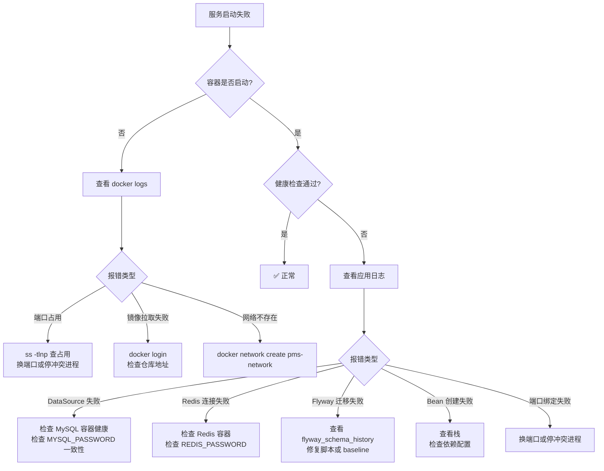
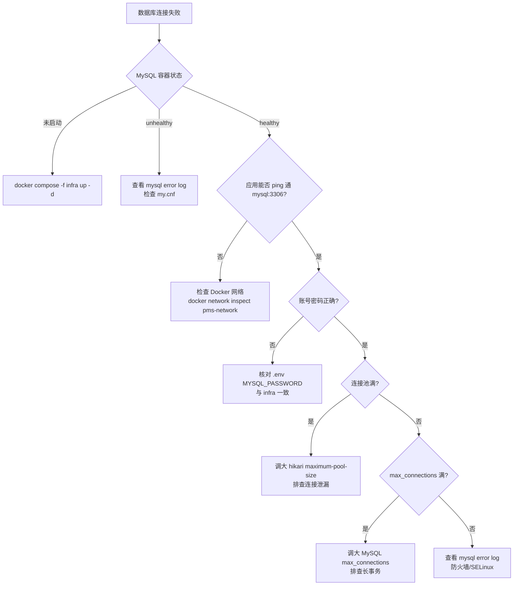
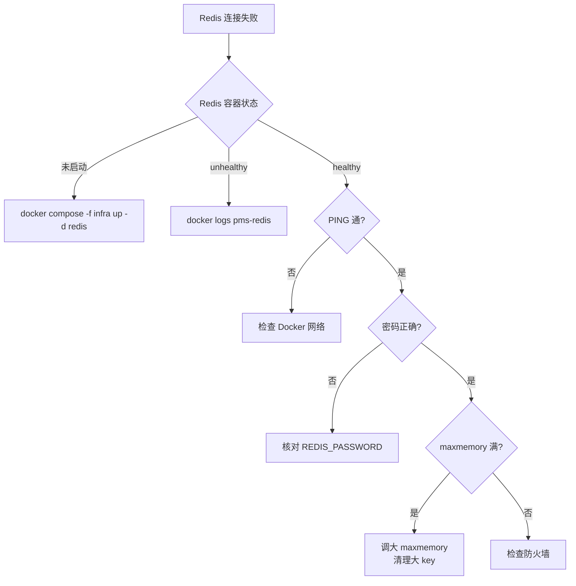
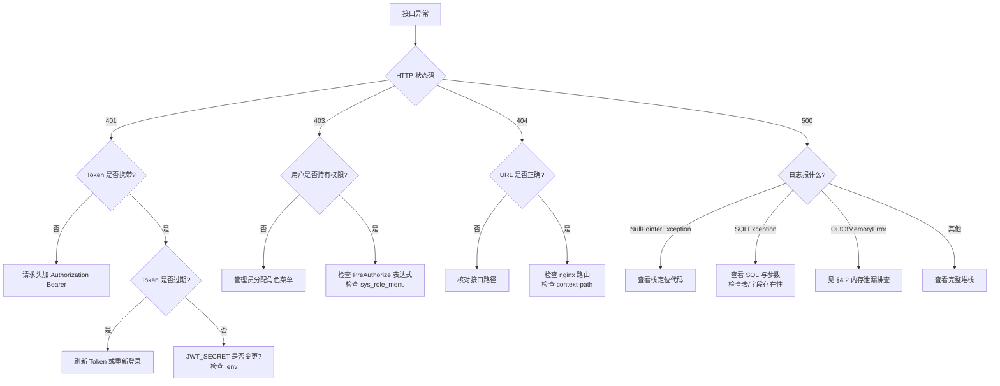
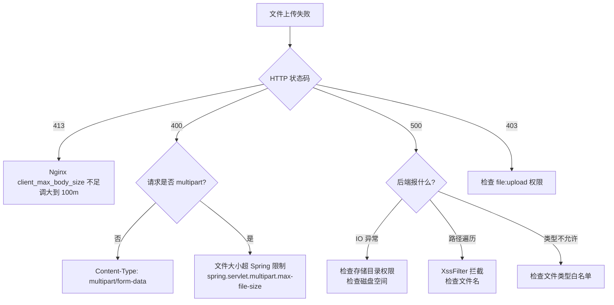
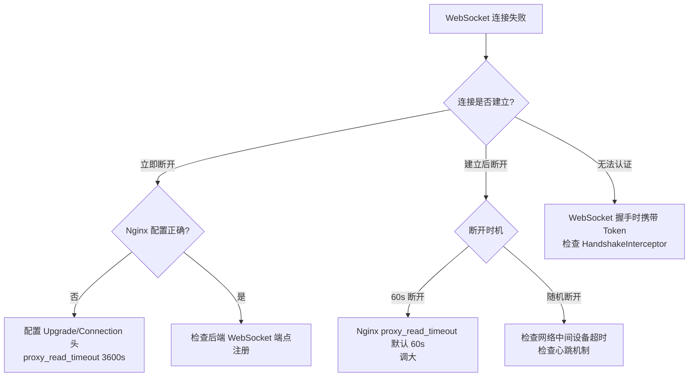
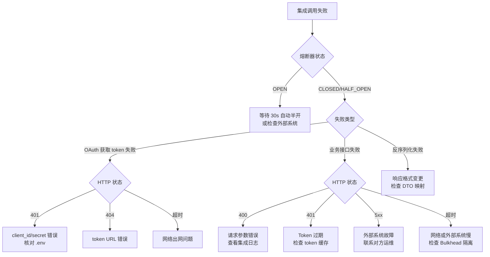
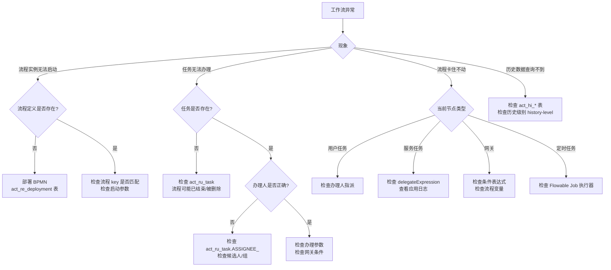

# 故障排查手册

> 网络设备工程项目管理系统（network-equipment-pms）生产故障排查手册。
> 涵盖 FAQ、错误码对照表、故障树、性能问题排查与日志关键字索引。

## 目录

1. [FAQ（常见问题）](#1-faq常见问题)
2. [错误码对照表](#2-错误码对照表)
3. [故障树](#3-故障树)
4. [性能问题排查](#4-性能问题排查)
5. [日志关键字索引](#5-日志关键字索引)

---

## 1. FAQ（常见问题）

### Q1：服务启动失败，日志报 `Failed to configure a DataSource`

**原因**：Spring Boot 启动时无法连接 MySQL。

**排查**：
```bash
docker logs pms-backend-blue 2>&1 | grep -A 5 "DataSource"
# 检查环境变量
docker exec pms-backend-blue env | grep -E "MYSQL|SPRING_DATASOURCE"
# 检查 MySQL 容器
docker exec pms-mysql mysql -uroot -p"$MYSQL_ROOT_PASSWORD" -e "SELECT 1"
```

**解决**：确认 `SPRING_DATASOURCE_URL` 指向 `mysql:3306`（容器间 DNS），且 `MYSQL_PASSWORD` 与 `docker-compose.infra.yml` 一致。

### Q2：启动报 `RedisConnectionFailureException`

**原因**：无法连接 Redis。

**排查**：
```bash
docker exec pms-redis redis-cli -a "$REDIS_PASSWORD" PING
docker exec pms-backend-blue nc -zv redis 6379
```

**解决**：检查 `SPRING_REDIS_PASSWORD` 与 `docker-compose.infra.yml` 的 `REDIS_PASSWORD` 一致；确认 backend 与 redis 在同一 Docker 网络。

### Q3：登录返回 401，提示 "Token 无效"

**原因**：JWT Token 签名验证失败，通常是 `JWT_SECRET` 变更。

**解决**：`JWT_SECRET` 轮换会使所有已签发 Token 失效，用户需重新登录。如非主动轮换，检查 `.env` 的 `JWT_SECRET` 是否被误改。

### Q4：接口返回 403 Forbidden

**原因**：用户无对应权限。

**排查**：检查 `@PreAuthorize` 注解要求的权限标识，与用户角色持有的权限对比（`sys_role_menu` 关联）。

**解决**：在系统管理 → 角色管理 中为用户角色分配对应菜单/权限。

### Q5：接口返回 429 Too Many Requests

**原因**：触发 `@RateLimit` 限流。

**排查**：响应头 `Retry-After` 给出建议重试秒数。

**解决**：客户端按 `Retry-After` 退避重试；如为误限，调整 `@RateLimit` 的 `permits` 与 `window` 参数。

### Q6：接口返回 409 Conflict，提示 "数据已被其他用户修改"

**原因**：MyBatis-Plus 乐观锁检测到 `version` 不匹配（更新影响行数为 0）。

**解决**：前端刷新数据后重试提交。频繁冲突需检查是否存在并发编辑同一记录。

### Q7：接口返回 503，提示 "集成服务暂不可用"

**原因**：D365/FP/OA 集成调用失败，且 Resilience4j 熔断器已 OPEN。

**排查**：
```bash
# 查看熔断器状态
curl -s http://localhost:8080/actuator/metrics/resilience4j.circuitbreaker.states | jq .
# Grafana → PMS-Integration-Health 仪表盘
```

**解决**：等待外部系统恢复，熔断器 30s 后自动转半开试探。若外部系统持续不可用，联系对应系统负责人。

### Q8：文件上传失败，返回 413 Request Entity Too Large

**原因**：Nginx `client_max_body_size` 限制。

**解决**：调整边缘 nginx 与前端 nginx.conf 的 `client_max_body_size`（默认建议 100m），`nginx -s reload`。

### Q9：WebSocket 连接立即断开

**原因**：Nginx 未配置 WebSocket 升级头，或 `proxy_read_timeout` 过短。

**解决**：确认 nginx.conf 的 `/ws` location 配置了 `proxy_set_header Upgrade $http_upgrade` 与 `Connection "upgrade"`，`proxy_read_timeout 3600s`。

### Q10：工作流任务无法推进

**原因**：Flowable 引擎异常，可能是流程定义错误或任务指派问题。

**排查**：
```bash
# 查看流程实例
docker exec pms-mysql mysql -uroot -p"$MYSQL_PASSWORD" pms \
  -e "SELECT * FROM act_ru_task WHERE PROC_INST_ID_='<instanceId>'"
```

**解决**：检查流程定义 BPMN 是否正确；任务办理人是否正确指派；查看应用日志 `Flowable` 关键字。

### Q11：定时任务不执行

**原因**：Spring `@Scheduled` 任务未启用，或任务异常中断。

**排查**：
```bash
curl -s http://localhost:8080/actuator/scheduledtasks | jq .
# Grafana → PMS-Schedule-Tasks 仪表盘
```

**解决**：确认主启动类有 `@EnableScheduling`；查看 `pms_schedule_failure_total` 指标；检查任务日志。

### Q12：Grafana 仪表盘无数据

**原因**：Prometheus 未抓取到指标。

**排查**：
```bash
# 1. 检查抓取目标
curl -s http://localhost:9090/api/v1/targets | jq '.data.activeTargets[] | {job:.labels.job, health}'
# 2. 检查 actuator 暴露
curl -s http://localhost:8080/actuator/prometheus | head
# 3. 检查网络
docker exec pms-prometheus nc -zv backend 8080
```

**解决**：确认 `application.yml` 的 `management.endpoints.web.exposure.include` 含 `prometheus`；确认 Prometheus 与 backend 在同一网络。

### Q13：Alertmanager 告警未通知

**原因**：webhook 不可达，或告警被抑制。

**排查**：
```bash
# 查看 Alertmanager 收到的告警
curl -s http://localhost:9093/api/v2/alerts | jq '.[] | {alertname:.labels.alertname, state:.status.state}'
# 检查 webhook 端点
curl -s http://localhost:8080/api/ops/alert/webhook -X POST -d '{}' -H 'Content-Type: application/json'
```

**解决**：确认 `alertmanager.yml` 的 webhook URL 指向 `backend:8080`；检查 inhibit_rules 是否误抑制。

### Q14：备份脚本失败，提示 "磁盘空间不足"

**原因**：可用磁盘 < `MIN_DISK_FREE_MB`（默认 2048MB）。

**解决**：执行 `./scripts/backup-cleanup.sh` 清理过期备份；`docker system prune -af` 清理 Docker 资源；扩容磁盘。

### Q15：恢复后表行数不一致

**原因**：binlog 重放 position 不正确，或恢复期间有写入。

**解决**：恢复前务必停止应用；检查 `manifest.json` 的 `binlogPosition`；对比 `SHOW MASTER STATUS` 与恢复点。

### Q16：蓝绿部署后 nginx 502

**原因**：新环境健康检查通过但 nginx upstream 指向错误端口。

**排查**：
```bash
cat /etc/nginx/conf.d/pms-upstream.conf
curl -s http://127.0.0.1:<active_port>/actuator/health
```

**解决**：确认 `NGINX_UPSTREAM_NAME` 与 nginx.conf 的 `proxy_pass` 一致；手动 reload `sudo nginx -s reload`。

### Q17：容器频繁重启（OOMKilled）

**原因**：JVM 堆超过容器内存限制。

**排查**：
```bash
docker inspect pms-backend-blue --format='{{.State.OOMKilled}}'
docker inspect pms-backend-blue --format='{{.HostConfig.Memory}}'
```

**解决**：调大容器内存限制，或调小 `-Xmx`；检查内存泄漏（见 [§4.2](#42-内存泄漏排查)）。

### Q18：慢 SQL 大量出现

**原因**：缺少索引或 SQL 写法低效。

**排查**：
```bash
# 慢查询日志
docker exec pms-mysql cat /var/lib/mysql/slow.log | tail -100
# Grafana → PMS-Business-Metrics → SlowSQL 面板
```

**解决**：用 `EXPLAIN` 分析执行计划；添加合适索引；避免 `SELECT *` 与大表 LIKE 前缀模糊。

### Q19：D365/FP/OA 集成 OAuth 获取 token 失败

**原因**：client_id/secret 错误或过期，token 端点不可达。

**排查**：
```bash
# 手动获取 token
curl -s -X POST https://d365.example.com/oauth2/token \
  -d "grant_type=client_credentials" \
  -d "client_id=$D365_OAUTH_CLIENT_ID" \
  -d "client_secret=$D365_OAUTH_CLIENT_SECRET" | jq .
```

**解决**：核对 `.env` 的 OAuth 凭据；联系外部系统确认账号状态；检查网络出网。

### Q20：字段加密数据解密失败，返回乱码

**原因**：`APP_ENCRYPT_KEY` 被更改，历史加密数据无法解密。

**解决**：`APP_ENCRYPT_KEY` 配置后**绝不可更改**。如已误改，需从备份恢复数据库，或编写迁移脚本用旧密钥解密后用新密钥重新加密。

---

## 2. 错误码对照表

### 2.1 业务错误码（Result.code）

来源：`com.dp.plat.common.result.ResultCode`

| code | 枚举名 | HTTP 状态 | 含义 | 处理建议 |
|------|--------|-----------|------|----------|
| 200 | SUCCESS | 200 | 操作成功 | — |
| 400 | PARAM_ERROR | 400 | 参数校验错误 | 检查请求体/参数，按 message 修正 |
| 401 | UNAUTHORIZED | 401 | 未认证或认证已过期 | 重新登录获取 Token |
| 403 | FORBIDDEN | 403 | 无权限访问 | 联系管理员分配权限 |
| 404 | NOT_FOUND | 404 | 资源不存在 | 检查 URL 或资源 ID |
| 405 | METHOD_NOT_ALLOWED | 405 | 请求方法不支持 | 改用正确的 HTTP 方法 |
| 408 | REQUEST_TIMEOUT | 408 | 请求超时 | 重试；排查网络与服务负载 |
| 409 | CONFLICT | 409 | 数据冲突（乐观锁） | 刷新数据后重试 |
| 429 | TOO_MANY_REQUESTS | 429 | 请求过于频繁 | 按 `Retry-After` 头退避重试 |
| 500 | ERROR / INTERNAL_SERVER_ERROR | 500 | 服务器内部错误 | 查看日志，联系运维 |
| 503 | SERVICE_UNAVAILABLE / INTEGRATION_FAILURE | 503 | 服务不可用 / 集成失败 | 等待恢复；检查熔断器状态 |
| 1001 | BUSINESS_ERROR | 200 | 业务异常（HTTP 200，业务失败） | 按 message 处理业务逻辑 |
| 1002 | TOKEN_INVALID | 401 | Token 无效 | 重新登录 |
| 1003 | TOKEN_EXPIRED | 401 | Token 已过期 | 刷新 Token 或重新登录 |
| 1004 | ACCOUNT_LOCKED | 200 | 账号已被锁定 | 联系管理员解锁 |
| 1005 | ACCOUNT_DISABLED | 200 | 账号已被禁用 | 联系管理员启用 |
| 1006 | USERNAME_OR_PASSWORD_ERROR | 200 | 用户名或密码错误 | 检查凭据 |

> **注意**：业务异常（1001~1006）通常返回 HTTP 200，业务码在 `Result.code` 字段中区分。客户端需同时检查 HTTP 状态与 `Result.code`。

### 2.2 HTTP 状态码速查

| HTTP | 含义 | 后端触发场景 |
|------|------|--------------|
| 200 | 成功 | 正常业务响应（含业务失败 code=1001） |
| 400 | 参数错误 | `@Valid` 校验失败、`ConstraintViolationException` |
| 401 | 未认证 | Token 缺失/无效/过期 |
| 403 | 无权限 | `@PreAuthorize` 不通过 |
| 404 | 资源不存在 | 路径错误或资源 ID 不存在 |
| 405 | 方法不支持 | GET/POST/PUT/DELETE 用错 |
| 409 | 冲突 | 乐观锁冲突 |
| 429 | 限流 | `@RateLimit` 触发，含 `Retry-After` 头 |
| 500 | 服务器错误 | 未捕获异常 |
| 503 | 集成不可用 | `IntegrationException` / 熔断器 OPEN |

### 2.3 异常类对照

| 异常类 | HTTP | Result.code | 触发场景 | Handler |
|--------|------|-------------|----------|---------|
| `BusinessException` | 200 | 自定义 | 业务校验失败 | `GlobalExceptionHandler.handleBusinessException` |
| `IntegrationException` | 503 | 503 | D365/FP/OA 调用失败/熔断 | `handleIntegrationException` |
| `RateLimitExceededException` | 429 | 429 | `@RateLimit` 超限 | `handleRateLimitExceededException` |
| `MethodArgumentNotValidException` | 400 | 400 | `@Valid` RequestBody 校验失败 | `handleMethodArgumentNotValidException` |
| `BindException` | 400 | 400 | 表单参数绑定失败 | `handleBindException` |
| `ConstraintViolationException` | 400 | 400 | `@Validated` + `@RequestParam`/`@PathVariable` 校验失败 | `handleConstraintViolationException` |
| `AccessDeniedException` | 403 | 403 | `@PreAuthorize` 不通过 | `handleAccessDeniedException` |
| `OptimisticLockingFailureException` | 409 | 409 | MyBatis-Plus 乐观锁冲突 | `handleOptimisticLock` |
| `HttpRequestMethodNotSupportedException` | 405 | 405 | HTTP 方法不支持 | `handleHttpRequestMethodNotSupportedException` |
| `Exception`（兜底） | 500 | 500 | 未捕获异常 | `handleException` |

---

## 3. 故障树

### 3.1 服务启动失败



### 3.2 数据库连接失败



### 3.3 Redis 连接失败



### 3.4 接口 401/403/404/500



### 3.5 文件上传失败



### 3.6 WebSocket 连接失败



### 3.7 D365/FP/OA 集成失败



### 3.8 工作流引擎异常



---

## 4. 性能问题排查

### 4.1 慢 SQL 定位

#### 4.1.1 SlowSqlInterceptor

项目通过 `com.dp.plat.common.mybatis.SlowSqlInterceptor` 拦截所有 SQL，按阈值记录：

- `threshold=warn`（1s）：记录 WARN 日志，计数 `pms_slow_sql_total{threshold="warn"}`
- `threshold=error`（5s）：记录 ERROR 日志，计数 `pms_slow_sql_total{threshold="error"}`

```bash
# 查看慢 SQL 日志
docker logs pms-backend-blue 2>&1 | grep "SlowSql" | tail -50

# Prometheus 查询慢 SQL 速率
curl -s 'http://localhost:9090/api/v1/query?query=rate(pms_slow_sql_total[5m])' | jq .
```

#### 4.1.2 Grafana 定位

1. 打开 Grafana → `PMS` 文件夹 → `business-metrics` 仪表盘
2. 查看 `SlowSQL` 面板，定位 error/warn 速率
3. 结合 Jaeger 链路追踪，找到具体 SQL（trace 中含 SQL 文本）

#### 4.1.3 MySQL 慢查询日志

```bash
# 开启慢查询（如未开启）
docker exec pms-mysql mysql -uroot -p -e \
  "SET GLOBAL slow_query_log=ON; SET GLOBAL long_query_time=1;"

# 查看慢查询
docker exec pms-mysql cat /var/lib/mysql/slow.log | tail -100

# 用 mysqldumpslow 分析
docker exec pms-mysql mysqldumpslow -s t -t 10 /var/lib/mysql/slow.log
```

#### 4.1.4 优化步骤

```sql
-- 1. EXPLAIN 分析执行计划
EXPLAIN SELECT * FROM pms_project WHERE project_code = 'P2026001';

-- 2. 检查索引
SHOW INDEX FROM pms_project;

-- 3. 检查表大小
SELECT table_name, table_rows, data_length/1024/1024 AS data_mb
FROM information_schema.tables WHERE table_schema='pms';

-- 4. 添加索引（如缺）
ALTER TABLE pms_project ADD INDEX idx_project_code (project_code);
```

### 4.2 内存泄漏排查

#### 4.2.1 识别 OOM

```bash
# 容器是否 OOMKilled
docker inspect pms-backend-blue --format='{{.State.OOMKilled}}'

# 查看堆转储（Dockerfile 已配置 -XX:+HeapDumpOnOutOfMemoryError）
docker exec pms-backend-blue ls -lh /app/logs/
# 期望：java_pid*.hprof
```

#### 4.2.2 实时内存分析

```bash
# 1. 查看堆使用趋势（Grafana → JVM 仪表盘）
# 堆使用持续上涨不回落 = 疑似泄漏

# 2. jmap dump 堆（需进容器）
docker exec -u 0 pms-backend-blue jmap -dump:format=b,file=/app/logs/heap.hprof 1

# 3. 下载到本地用 MAT/VisualVM 分析
docker cp pms-backend-blue:/app/logs/heap.hprof .

# 4. 找到支配树（Dominator Tree）最大的对象
```

#### 4.2.3 常见内存泄漏点

| 泄漏点 | 现象 | 排查 |
|--------|------|------|
| ThreadLocal 未清理 | 线程池线程复用后内存涨 | 检查 `UserContextFilter` / `TraceIdFilter` 的 `remove()` |
| 静态集合无限增长 | 堆持续上涨 | 检查 `static Map/List` 缓存，加大小限制 |
| 连接未关闭 | HikariCP 连接数涨 | 检查 `try-with-resources` 或 `finally` close |
| 大对象缓存 | 老年代持续增长 | 检查 Redis vs 本地缓存，大对象改 Redis |
| MyBatis 一级缓存 | SqlSession 生命周期错误 | 检查是否在循环中调用 mapper |

### 4.3 CPU 飙高排查

```bash
# 1. 找到 CPU 高的 Java 进程
docker stats pms-backend-blue

# 2. 找到 CPU 高的线程
docker exec -u 0 pms-backend-blue top -H -p 1
# 记录 TID（十进制）

# 3. 转为十六进制
printf '%x\n' <TID>

# 4. jstack 抓栈，定位该线程
docker exec -u 0 pms-backend-blue jstack 1 | grep -A 30 '<hex_tid>'

# 5. Grafana → JVM 仪表盘查看 GC/CPU 趋势
```

常见 CPU 高原因：
- 频繁 Full GC（查看 `jvm_gc_pause_seconds_count`）
- 死循环 / 复杂正则
- 大数据量内存排序
- 加密/压缩计算密集

### 4.4 接口超时排查

```bash
# 1. Grafana → API-Overview → P95/P99 延迟面板
# 2. 定位慢接口
curl -s 'http://localhost:9090/api/v1/query?query=histogram_quantile(0.95,sum(rate(http_server_requests_seconds_bucket[5m]))by(le,uri))' | jq .

# 3. Jaeger 查看链路
# 浏览器打开 http://localhost:16686
# 按 Service=pms + 时间范围查询，找到耗时 span

# 4. 分段定位：DB / Redis / 集成 / 业务计算
```

| 耗时段 | 排查方向 |
|--------|----------|
| DB 慢 | 慢 SQL（见 §4.1） |
| Redis 慢 | 大 key / 网络 / `--slowlog-log-slower-than` |
| 集成慢 | 外部系统 / 熔断器 / Bulkhead 等待 |
| 业务计算 | 复杂循环 / 大数据量处理 |
| 锁等待 | synchronized / 数据库行锁 |

---

## 5. 日志关键字索引

### 5.1 ERROR 级关键字

| 关键字 | 含义 | 排查方向 |
|--------|------|----------|
| `OutOfMemoryError` | JVM OOM | 见 [§4.2](#42-内存泄漏排查) |
| `StackOverflowError` | 栈溢出 | 检查递归深度 |
| `Cannot get a connection` | HikariCP 连接耗尽 | 调大连接池 / 排查泄漏 |
| `Communications link failure` | MySQL 连接断开 | 检查 MySQL 健康 / `wait_timeout` |
| `RedisConnectionFailureException` | Redis 连接失败 | 检查 Redis 容器 |
| `IntegrationException` | 集成调用失败 | 检查 D365/FP/OA + 熔断器 |
| `CircuitBreakerOpen` | 熔断器开启 | 外部系统恢复后自动半开 |
| `FlywayMigrationException` | Flyway 迁移失败 | 检查迁移脚本 / checksum |
| `SQLException` | SQL 异常 | 检查 SQL 语法 / 表字段 |
| `NullPointerException` | 空指针 | 查看栈定位代码 |
| `SlowSql ERROR` | >5s 慢 SQL | 见 [§4.1](#41-慢-sql-定位) |

### 5.2 WARN 级关键字

| 关键字 | 含义 | 处理 |
|--------|------|------|
| `Business exception on` | 业务异常 | 按 message 处理 |
| `Rate limit exceeded on` | 限流触发 | 客户端退避重试 |
| `Access denied` | 权限拒绝 | 检查权限分配 |
| `乐观锁冲突` | 乐观锁冲突 | 提示用户刷新重试 |
| `Parameter validation failed` | 参数校验失败 | 修正请求参数 |
| `SlowSql WARN` | >1s 慢 SQL | 关注趋势，优化 SQL |
| `GC pause` | GC 暂停 | 关注频率与耗时 |
| `Connection leaked` | 连接泄漏警告 | 排查未关闭的连接 |

### 5.3 异常类名索引

| 异常类 | 包路径 | 触发场景 | 处理 |
|--------|--------|----------|------|
| `BusinessException` | `com.dp.plat.common.exception` | 业务校验失败 | 按 message 处理 |
| `IntegrationException` | `com.dp.plat.common.exception` | 集成调用失败 | 检查外部系统 + 熔断 |
| `RateLimitExceededException` | `com.dp.plat.common.exception` | 限流 | 退避重试 |
| `OptimisticLockingFailureException` | `org.springframework.dao` | 乐观锁冲突 | 刷新重试 |
| `AccessDeniedException` | `org.springframework.security` | 权限不足 | 分配权限 |
| `MethodArgumentNotValidException` | `org.springframework.web` | 参数校验失败 | 修正参数 |
| `ConstraintViolationException` | `jakarta.validation` | 参数约束违反 | 修正参数 |
| `HttpRequestMethodNotSupportedException` | `org.springframework.web` | HTTP 方法不支持 | 改用正确方法 |
| `CommunicationsException` | `com.mysql.cj` | MySQL 连接异常 | 检查 MySQL |
| `RedisConnectionFailureException` | `org.springframework.data.redis` | Redis 连接失败 | 检查 Redis |
| `FlowableException` | `org.flowable` | 工作流异常 | 检查流程定义 |
| `JsonProcessingException` | `com.fasterxml.jackson` | JSON 反序列化失败 | 检查请求体格式 |

### 5.4 日志检索命令速查

```bash
# 后端 ERROR 日志（最近 1 小时）
docker logs --since 1h pms-backend-blue 2>&1 | grep ERROR

# 按 traceId 检索全链路
docker logs pms-backend-blue 2>&1 | grep "a1b2c3d4e5f6"

# 按用户检索
docker logs pms-backend-blue 2>&1 | grep '"username":"zhangsan"'

# 慢 SQL
docker logs pms-backend-blue 2>&1 | grep "SlowSql" | tail -50

# 集成失败
docker logs pms-backend-blue 2>&1 | grep "IntegrationException" | tail -50

# 启动失败
docker logs pms-backend-blue 2>&1 | grep -E "APPLICATION FAILED TO START|Error starting ApplicationContext"

# Flyway
docker logs pms-backend-blue 2>&1 | grep -i flyway

# GC
docker logs pms-backend-blue 2>&1 | grep -i "GC pause"

# Nginx 错误
sudo tail -100 /var/log/nginx/error.log

# MySQL 错误
docker exec pms-mysql tail -100 /var/lib/mysql/$(hostname).err
```

### 5.5 Jaeger 链路追踪

通过 OpenTelemetry 上报至 Jaeger（OTLP gRPC `jaeger:4317`，采样率 10% 可调）。

```bash
# 查看服务
curl -s http://localhost:16686/api/services | jq .

# 查找指定 trace
# 浏览器：http://localhost:16686/trace/<traceId>
```

链路中关键 span：
- `http.server.requests`：HTTP 入口
- `sql` / `MyBatis`：数据库操作
- `redis`：缓存操作
- `integration.d365` / `integration.fp` / `integration.oa`：外部集成
- `flowable`：工作流操作

> **提示**：生产采样率默认 10%（`OTEL_TRACES_SAMPLER_ARG=0.1`），排查问题时可临时调高到 1.0（100%），但会增加 Jaeger 存储压力。调整方式：修改 `OTEL_TRACES_SAMPLER_ARG` 环境变量后重启应用。

---

## 相关文件

| 文件 | 说明 |
|------|------|
| `pms-common/.../exception/GlobalExceptionHandler.java` | 全局异常处理 |
| `pms-common/.../result/ResultCode.java` | 错误码枚举 |
| `pms-common/.../mybatis/SlowSqlInterceptor.java` | 慢 SQL 拦截器 |
| `pms-common/.../filter/RateLimitFilter.java` | 限流过滤器 |
| `pms-common/.../trace/TraceIdFilter.java` | 链路追踪过滤器 |
| `deploy/prometheus/rules/*.yml` | 告警规则 |
| `deploy/grafana/dashboards/*.json` | 监控仪表盘 |
| `scripts/health-check.sh` | 健康检查脚本 |
| `pms-admin/src/main/resources/logback-spring.xml` | 日志配置 |

> **相关文档**：[部署指南](./deployment.md) | [运维手册](./operations.md) | [API 规范](./api-spec.md) | [低代码使用指南](./lowcode-guide.md)
