# FP API 架构文档

> 本文档详细描述 pms-ext-fp 模块中 FPApi 工具类的整体架构，包括 Token 缓存机制、HTTP 客户端选择、限流模式与连接池管理。

---

## 1. 架构概述

FPApi 是 pms-ext-fp 模块的核心工具类，封装了对 FP（财务平台）的 REST API 调用。它是一个 Spring 组件（`@Component("fpApi")`），实现 `DisposableBean` 以在容器销毁时回收线程池与连接池资源。

```mermaid
graph TB
    subgraph 调用方
        BIZ[业务模块<br/>PMS-struts 等]
    end
    
    subgraph FPApi 核心层
        CONFIG[配置管理<br/>initConfig / getConfig]
        TOKEN[Token 管理<br/>getToken / clearToken]
        AUTH[认证注入<br/>initAuthorization]
        PUSH[数据推送<br/>pushData / pushSingleData / pushListData]
        POST[发票查验<br/>postElectronicInvoice]
    end
    
    subgraph HTTP 客户端层 三选一
        HUTOOL[requestWithHutool<br/>Hutool HttpRequest]
        POOL[requestWithPool<br/>Apache HttpClient 连接池]
        OKHTTP[requestWithOkHttp<br/>OkHttp 连接池 默认]
    end
    
    subgraph 限流与并发层
        SCHED[scheduler<br/>单线程调度池]
        FIXED[fixedExecutor<br/>10 线程固定池]
    end
    
    subgraph FP 平台
        FP[FP 财务平台<br/>REST API]
    end
    
    BIZ --> CONFIG
    BIZ --> POST
    BIZ --> PUSH
    CONFIG --> TOKEN
    TOKEN --> AUTH
    POST --> PUSH
    PUSH --> AUTH
    AUTH --> HTTP 客户端层
    PUSH --> 限流与并发层
    限流与并发层 --> HTTP 客户端层
    HTTP 客户端层 --> FP
```

### 1.1 关键设计决策

| 决策点 | 选择 | 理由 |
|--------|------|------|
| HTTP 客户端 | OkHttp（默认）/ Apache HttpClient / Hutool | 三套实现并存，通过切换 `request()` 方法体选择，当前默认使用 OkHttp |
| Token 缓存 | `volatile` + `ReentrantReadWriteLock` | 读多写少场景，读锁并发检查、写锁互斥刷新 |
| 限流模式 | 调度池 + 固定线程池 | `MINUTE`/`MULTIPLE`/`SINGLE` 三种模式适配不同业务场景 |
| 配置注入 | 反射 + Supplier/Function | 支持静态 Map、Supplier 动态供应、Function 按 key 查询三种配置来源 |
| 生命周期 | `DisposableBean` | Spring 容器关闭时回收线程池与连接池，避免资源泄漏 |

---

## 2. Token 缓存机制

### 2.1 数据结构

```java
// 缓存的 Token（volatile 保证可见性）
private static volatile TokenResponse cachedToken;

// 读写锁（公平模式）
private static final ReentrantReadWriteLock lock = new ReentrantReadWriteLock(true);
```

### 2.2 Token 获取流程

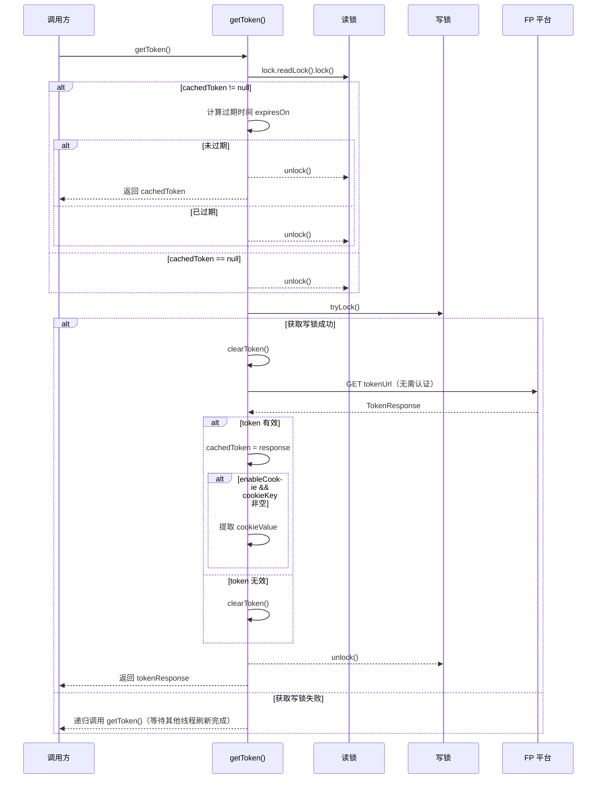

### 2.3 过期时间计算逻辑

Token 过期时间的计算有三种来源，按优先级依次尝试：

| 优先级 | 字段来源 | 计算方式 | 说明 |
|--------|----------|----------|------|
| 1 | `expiresOn` | 直接使用（秒级时间戳） | FP 平台直接返回的过期时间戳 |
| 2 | `expiresIn` + `timestamp` | `timestamp/1000 + expiresIn` | expiresIn 为有效期秒数 |
| 3 | `expireTime` | 解析为日期后取毫秒时间戳/1000 | 字符串日期格式 |
| 4 | 兜底默认 | `timestamp/1000 + 1800` | 默认 30 分钟有效期 |

> **注意**：当 `expiresOn` 为空时，会根据可用字段计算并回填到 `cachedToken`，避免重复计算。

### 2.4 Cookie 联动

当配置 `enableCookie=true` 且 `cookieKey` 非空时，Token 获取成功后会从响应头的 `Set-Cookie` 中提取指定 cookie 值，缓存在 `cookieValue` 字段中，供后续请求的认证注入使用。

---

## 3. HTTP 客户端架构

FPApi 提供三种 HTTP 客户端实现，通过 `request()` 方法统一入口，当前默认使用 OkHttp：

```java
public static <T extends Response<E>, E> T request(String method, String url, Request<T> request, 
        boolean isForm, boolean needAuth, Map<String, Object> options) {
    // 当前默认使用 OkHttp 实现
    return requestWithOkHttp(method, url, request, isForm, needAuth, options);
    // 备选实现（已注释）：
    // return requestWithHutool(method, url, request, isForm, needAuth, options);
    // return requestWithPool(method, url, request, isForm, needAuth, options);
}
```

### 3.1 三种实现对比

| 特性 | requestWithHutool | requestWithPool | requestWithOkHttp（默认） |
|------|-------------------|-----------------|--------------------------|
| 底层库 | Hutool HttpRequest | Apache HttpClient | OkHttp |
| 连接池 | 无（每次新建 HttpURLConnection） | PoolingHttpClientConnectionManager | ConnectionPool + Dispatcher |
| HTTP/2 | 不支持 | 不支持 | 支持 |
| 表单构建 | Hutool 内置 | MultipartBodyBuilder.buildHttp() | MultipartBodyBuilder.buildOkHttp() |
| 超时配置 | setConnectionTimeout(10s) | RequestConfig（连接10s/读取60s） | connectTimeout(10s)/readTimeout(60s) |
| 性能 | 低（无连接复用） | 中（连接池复用） | 高（连接池 + HTTP/2） |

### 3.2 通用请求流程

三种实现共享相同的处理逻辑骨架：

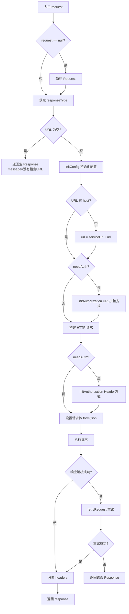

### 3.3 重试机制

`retryRequest()` 在响应解析失败或异常时触发：

1. 调用 `clearToken()` 清除缓存的 Token（可能是 Token 过期导致）
2. 检查配置 `enableRetry`（默认 false）和 `options.retried`（避免无限递归）
3. 若启用重试且未重试过，设置 `retried=true` 后递归调用 `request()`
4. 否则返回空 Response，message 为"响应内容为空！"

---

## 4. 连接池管理

### 4.1 Apache HttpClient 连接池（HttpClientPool）

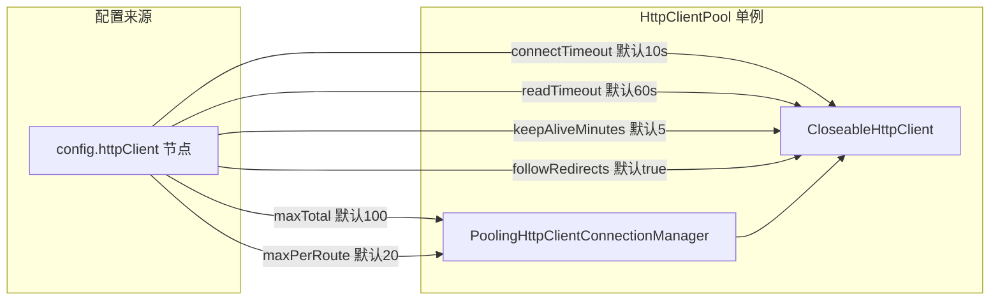

**关键配置项**（从 `config.httpClient` 节点读取）：

| 配置项 | 默认值 | 说明 |
|--------|--------|------|
| `maxTotal` | 100 | 连接池最大总连接数 |
| `maxPerRoute` | 20 | 每个路由（host）最大连接数 |
| `connectTimeout` | 10000ms | 连接建立超时 |
| `readTimeout` | 60000ms | 响应读取超时 |
| `keepAliveMinutes` | 5 | 连接保活时间（分钟） |
| `followRedirects` | true | 是否自动跟随重定向 |

### 4.2 OkHttp 连接池（OkHttpPool）

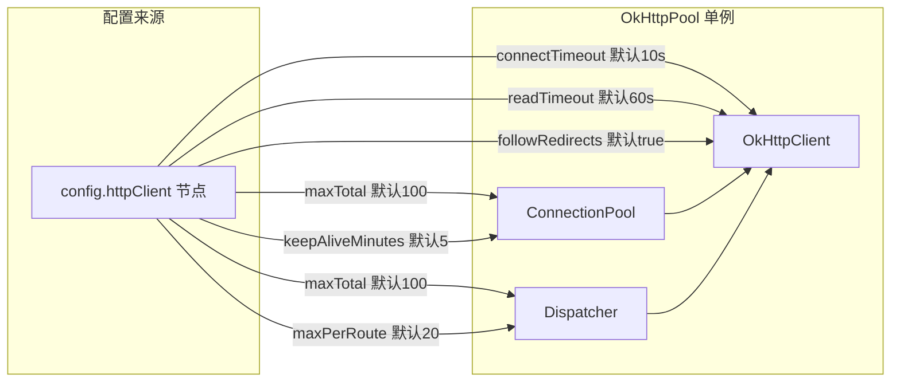

**OkHttp 与 Apache HttpClient 配置映射差异**：

| 配置项 | Apache HttpClient | OkHttp | 说明 |
|--------|-------------------|--------|------|
| 最大连接数 | `connManager.setMaxTotal(maxTotal)` | `ConnectionPool(maxTotal, keepAlive)` | OkHttp 的 maxIdleConnections 是空闲连接数，非总数 |
| 每路由连接数 | `setDefaultMaxPerRoute(maxPerRoute)` | `dispatcher.setMaxRequestsPerHost(maxPerRoute)` | OkHttp 通过 Dispatcher 控制 |
| 总并发数 | 无独立配置 | `dispatcher.setMaxRequests(maxTotal)` | OkHttp 独有 |

> **注意**：OkHttp 的 `ConnectionPool` 第一个参数是 `maxIdleConnections`（最大空闲连接数），并非总连接数。严格限制总连接数需配合 `Dispatcher` 配置。代码中已通过 `dispatcher.setMaxRequests(maxTotal)` 进行近似控制。

### 4.3 连接池生命周期

连接池在首次调用 `get()`/`getHttpClient()` 时懒加载初始化（双重检查锁定单例），在 `FPApi.destroy()` 时关闭：

```java
@Override
public void destroy() throws Exception {
    scheduler.shutdownNow();      // 回收调度线程池
    fixedExecutor.shutdownNow();  // 回收并发线程池
    HttpClientPool.close();       // 关闭 Apache HttpClient 连接池
    OkHttpPool.close();           // 关闭 OkHttp 连接池
}
```

---

## 5. 限流机制

### 5.1 三种限流模式

FPApi 通过 `limitType` 参数控制批量请求的发送策略：

| 模式 | 常量 | 行为 | 适用场景 |
|------|------|------|----------|
| 单次模式 | `SINGLE` | 逐个同步发送，无限流 | 请求数量少、无频率限制 |
| 分钟模式 | `MINUTE` | 通过调度池按固定延迟发送 | 严格频率限制（如每分钟 N 次） |
| 多并发模式 | `MULTIPLE` | 通过固定线程池并发发送，保持顺序 | 高吞吐、允许并发 |

### 5.2 MINUTE 模式（调度池限流）

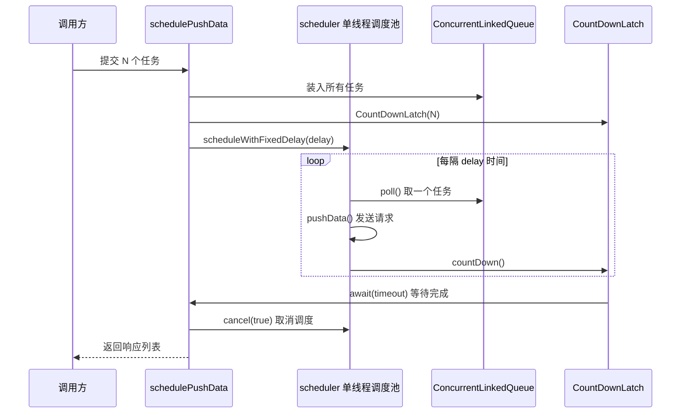

**延迟计算**：
- `splitToList=true`（List 提交）：`delay=1`，单位 `MINUTES`，每分钟发送一批
- `splitToList=false`（单条提交）：`delay=60/rateLimit`，单位 `SECONDS`，按 rateLimit 次/分钟计算间隔

**超时计算**：`delay * list.size() * 20`（放大 20 倍），且至少 30 秒。

### 5.3 MULTIPLE 模式（线程池并发）

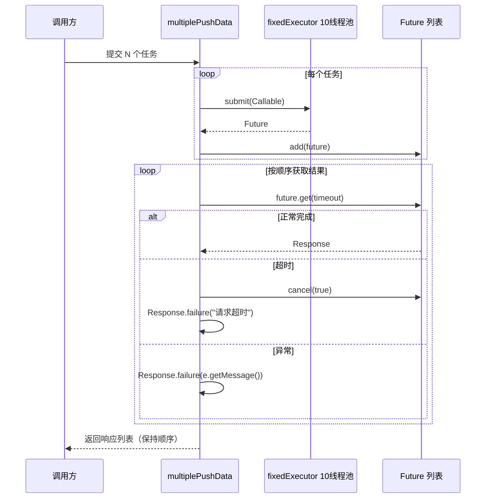

**关键特性**：
- 使用 `fixedExecutor`（10 线程固定池）并发提交
- 通过 `Future` 列表保持响应顺序与请求顺序一致
- 异常包装为 `Response.failure()`，避免 `ExecutionException` 外泄
- `RejectedExecutionException`（队列满）返回"当前系统繁忙，请稍候再试！"

### 5.4 数据拆分逻辑

`pushData()` 根据 `splitToList` 参数决定是否将列表拆分为子列表：

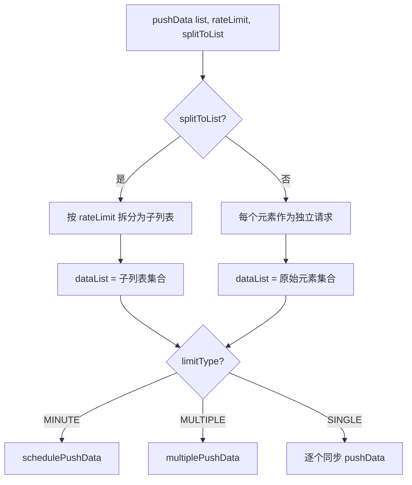

---

## 6. 认证注入架构

### 6.1 四种认证方式

FPApi 支持四种认证方式，由配置 `authType` 决定：

| authType | 认证方式 | 注入位置 | 适用场景 |
|----------|----------|----------|----------|
| `bearer` | Bearer Token | form 字段 / Header | OAuth2 Bearer |
| `header` | Header | 请求头 `authKey` | 自定义 Header 认证 |
| `query` | URL Query | URL 拼接参数 | Query 参数认证 |
| `cookie` | Cookie | Cookie 头 | Cookie 会话认证 |

### 6.2 认证注入方法重载

`initAuthorization` 针对不同 HTTP 客户端有四个重载：

| 方法签名 | 适用客户端 | 说明 |
|----------|------------|------|
| `initAuthorization(HttpRequest)` | Hutool | 通过 Hutool API 设置 form/header/cookie |
| `initAuthorization(String url, URI)` | 通用 URL | 返回拼接了 query 参数的 URL |
| `initAuthorization(HttpRequestBase)` | Apache HttpClient | 通过 HttpRequestBase 设置 header/cookie |
| `initAuthorization(okhttp3.Request.Builder)` | OkHttp | 通过 Request.Builder 设置 header/cookie |

> **注意**：`initAuthorization(Request<?>)` 方法已标记 `@Deprecated`，认证逻辑已内联到各 HTTP 客户端实现中。

### 6.3 Cookie 处理

当 `enableCookie=true` 时：
1. Token 获取阶段从响应头提取 `cookieKey` 对应的值，缓存到 `cookieValue`
2. 请求阶段，若 `cookieKey` 与 `authKey` 不同，额外注入 `cookieKey=cookieValue` 的 Cookie
3. `initCookie()` 方法负责合并已有 Cookie 与新 Cookie，避免重复

---

## 7. 线程模型

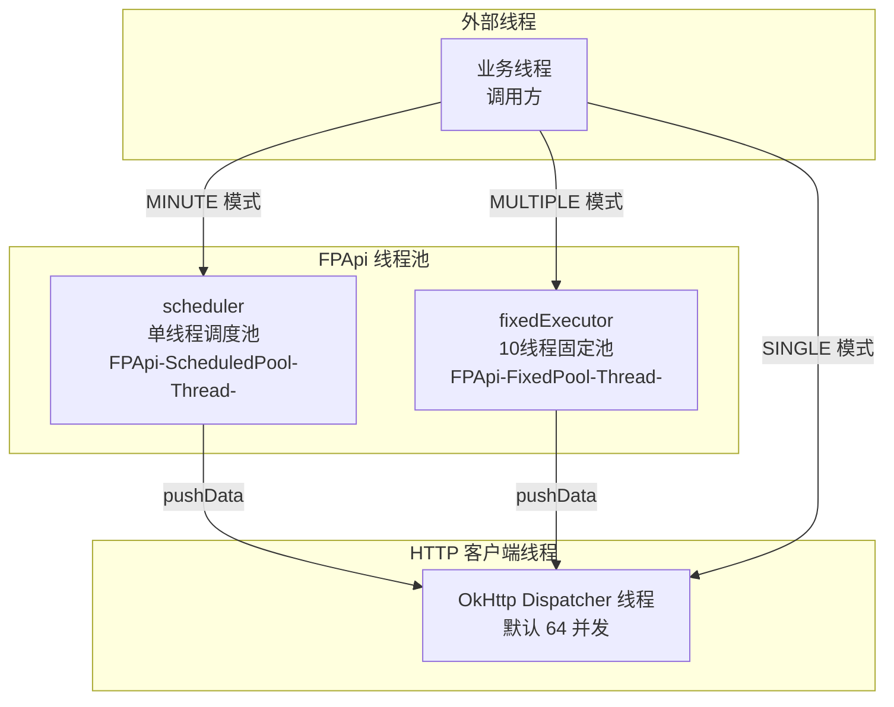

| 线程池 | 类型 | 核心线程数 | 用途 | 关闭方式 |
|--------|------|-----------|------|----------|
| `scheduler` | `newSingleThreadScheduledExecutor` | 1 | MINUTE 模式定时调度 | `shutdownNow()` |
| `fixedExecutor` | `newFixedThreadPool(10)` | 10 | MULTIPLE 模式并发推送 | `shutdownNow()` |

> **注意**：两个线程池均为 `static` 全局共享，线程名通过 `CustomizableThreadFactory` 自定义为 `FPApi-ScheduledPool-Thread-` 和 `FPApi-FixedPool-Thread-` 前缀，便于线程 dump 排查。

---

## 8. 配置体系

### 8.1 三种配置来源

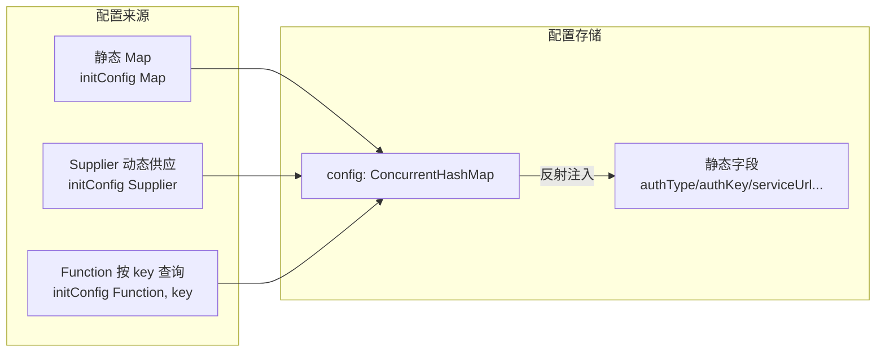

### 8.2 配置字段清单

通过反射将 `config` Map 中的值注入到 FPApi 的静态 String 字段：

| 字段名 | 用途 | 默认值 |
|--------|------|--------|
| `authType` | 认证类型（bearer/header/query/cookie） | - |
| `authKey` | 认证键名 | - |
| `authValue` | 认证值 | - |
| `enableCookie` | 是否启用 Cookie | - |
| `cookieKey` | Cookie 键名 | - |
| `cookieValue` | Cookie 值（运行时生成） | - |
| `appId` | 应用 ID | - |
| `clientSecret` | 客户端密钥 | - |
| `clientId` | 客户端 ID | - |
| `resource` | 资源标识 | - |
| `grantType` | 授权类型 | - |
| `serviceUrl` | FP 服务基础地址 | - |
| `tokenUrl` | Token 获取地址 | - |
| `archiveUrl` | 发票归档地址 | - |
| `ssoUrl` | SSO 地址 | - |

### 8.3 配置初始化流程

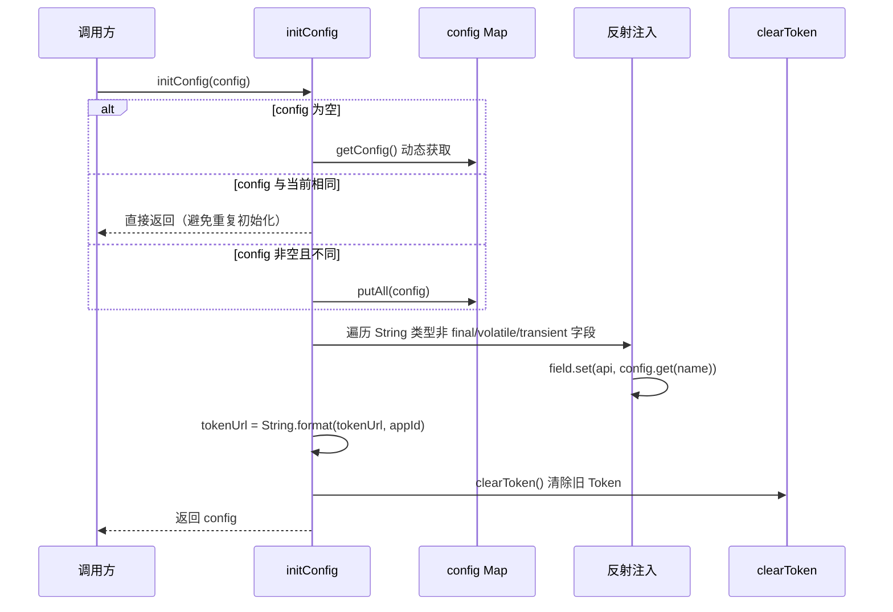

> **注意**：`initConfig` 会清除已缓存的 Token，确保配置变更后使用新配置重新获取 Token。`tokenUrl` 支持 `%s` 占位符，会用 `appId` 进行格式化。

---

## 9. 与其他模块的关系

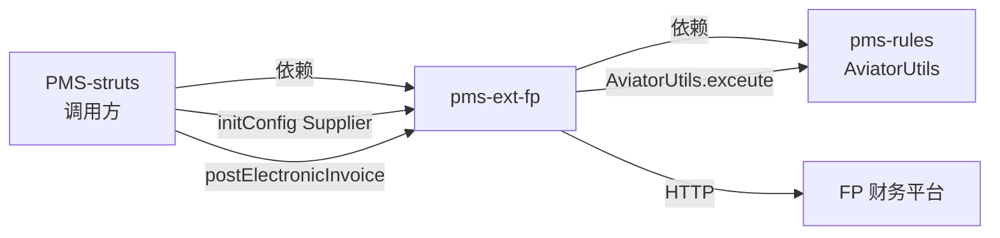

- **PMS-struts**：作为调用方，通过 `FPApi.initConfig(Supplier)` 注入动态配置，调用 `postElectronicInvoice` 推送发票
- **pms-rules**：提供 `AviatorUtils` 表达式引擎，供 `InvoiceUtil` 进行发票类型/状态判断
- **FP 财务平台**：通过 REST API 交互，Token 认证 + multipart/form-data 表单提交

---

## 10. 已知问题与注意事项

1. **pom.xml 拼写错误**：`<project.build.name>${project.name}}</project.build.name>` 多了一个 `}`（第 13 行），不影响构建但属性值包含多余字符
2. **递归获取 Token**：`getToken()` 在写锁获取失败时递归调用自身，高并发下可能栈溢出
3. **sanitizeValue 未实现**：`sanitizeValue()` 方法标注 TODO，目前仅做 null 检查，未进行特殊字符转义
4. **OkHttp maxIdleConnections 语义**：`ConnectionPool` 第一个参数是最大空闲连接数而非总连接数，与 Apache HttpClient 的 `maxTotal` 语义不同
5. **containsChinese 未使用**：`containsChinese()` 方法已实现但未被调用
6. **日志级别**：`log()` 方法默认读取 `config.debug`，`log(format, false, ...)` 中 `isDebug=false` 时输出 INFO 级别
