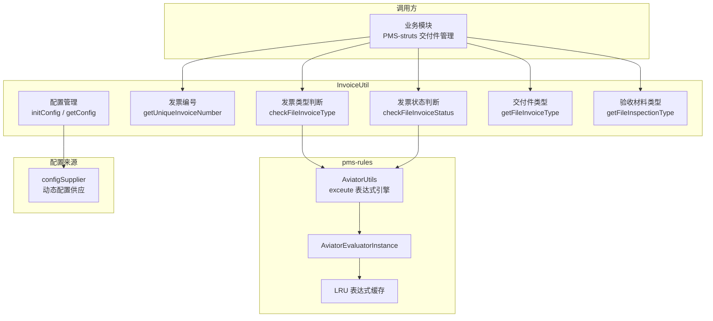
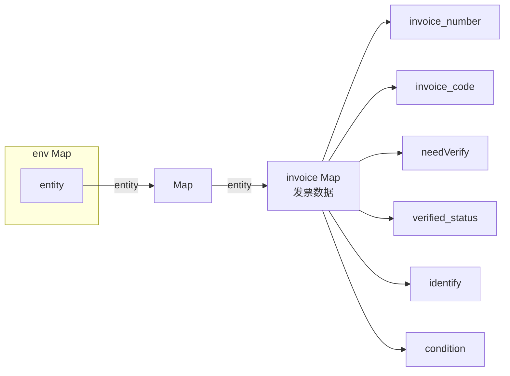
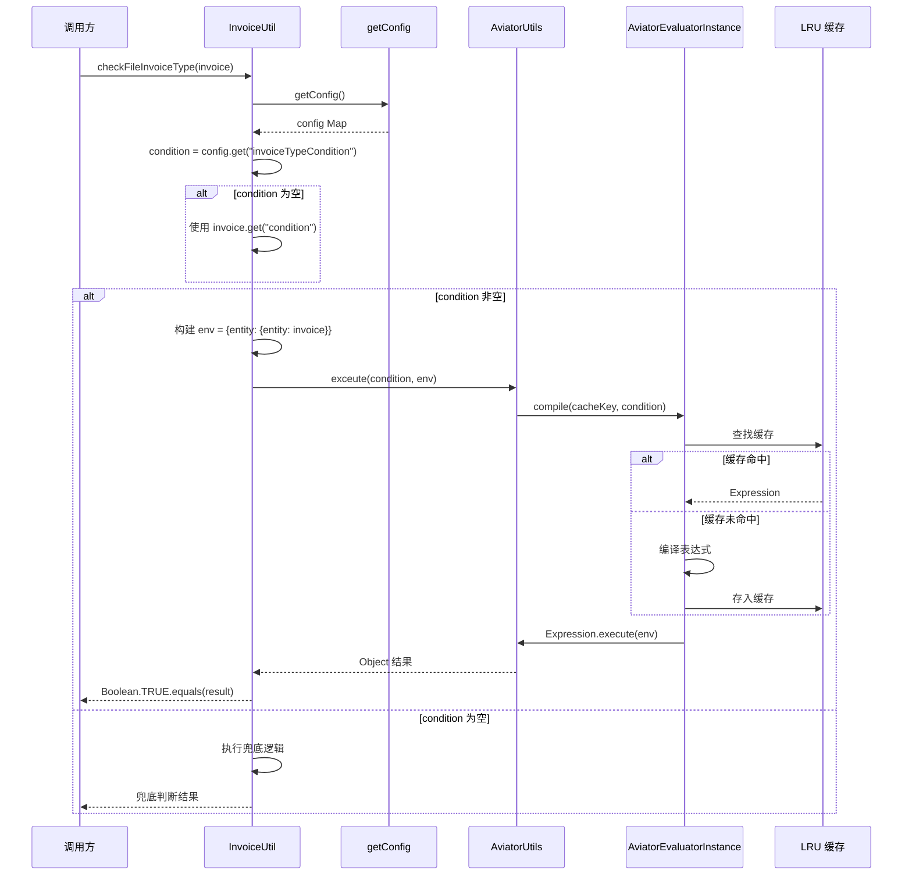
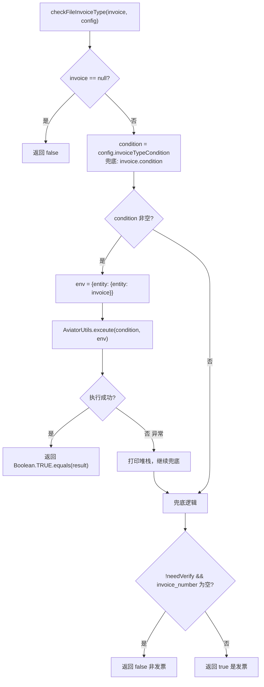
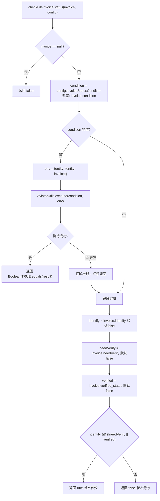
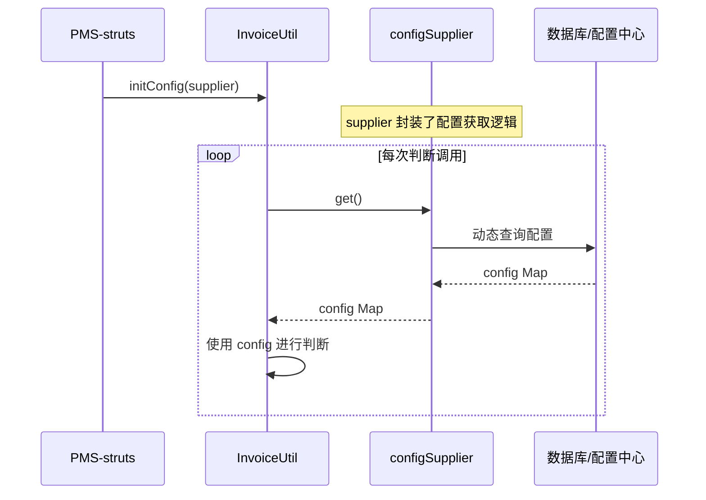
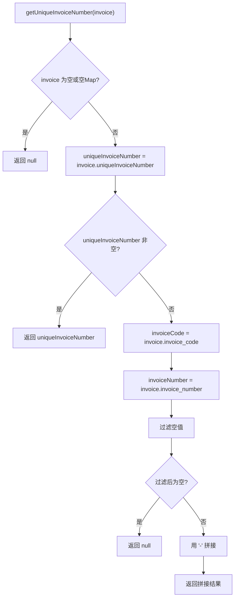
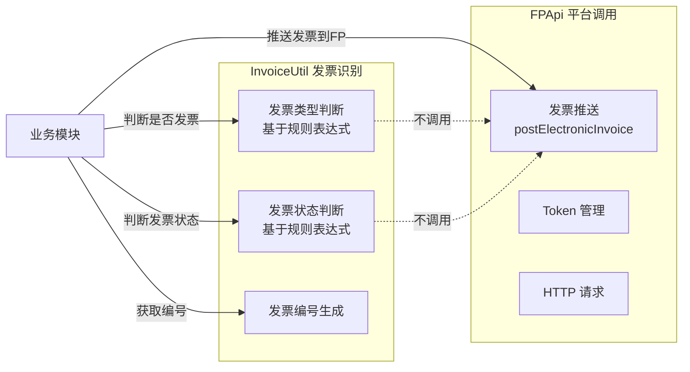

# 发票识别架构文档

> 本文档详细描述 pms-ext-fp 模块中 InvoiceUtil 工具类的发票识别架构，包括与 pms-rules 模块 AviatorUtils 表达式引擎的集成方式、规则配置机制和判断逻辑。

---

## 1. 架构概述

InvoiceUtil 是 pms-ext-fp 模块的发票识别工具类，负责判断交付件是否属于发票类型、发票状态是否有效，以及获取发票唯一编号。它通过 pms-rules 模块提供的 AviatorUtils 表达式引擎实现可配置的规则判断。



---

## 2. 与 AviatorUtils 的集成

### 2.1 依赖关系

pms-ext-fp 通过 Maven 依赖 pms-rules 模块，使用其中的 `AviatorUtils.exceute()` 方法（注意：方法名拼写为 `exceute`，非 `execute`）：

```xml
<!-- pom.xml -->
<dependency>
    <groupId>com.dp.plat</groupId>
    <artifactId>pms-rules</artifactId>
    <version>${project.version}</version>
</dependency>
```

```java
// InvoiceUtil.java 中的调用
import com.dp.plat.rules.util.AviatorUtils;

Boolean.TRUE.equals(AviatorUtils.exceute(condition, env));
```

### 2.2 表达式执行环境

InvoiceUtil 在调用 AviatorUtils 时，构建的执行环境（env）结构如下：

```java
Map<String, Object> env = new HashMap<String, Object>();
env.put("entity", Collections.singletonMap("entity", invoice));
```



> **注意**：env 结构为 `entity.entity.<字段名>`，这是嵌套的 Map 结构。表达式中访问发票字段需使用 `entity.entity.invoice_number` 这样的路径。

### 2.3 表达式求值流程



---

## 3. 规则配置机制

### 3.1 配置项清单

InvoiceUtil 通过 `configSupplier` 动态获取配置，关键配置项：

| 配置项 | 用途 | 使用方法 | 默认兜底逻辑 |
|--------|------|----------|-------------|
| `invoiceTypeCondition` | 发票类型判断的 Aviator 表达式 | `checkFileInvoiceType` | 见 3.2 节 |
| `invoiceStatusCondition` | 发票状态判断的 Aviator 表达式 | `checkFileInvoiceStatus` | 见 3.3 节 |
| `invoiceType` | 交付件发票原件类型 | `getFileInvoiceType` | 返回 defaultValue |
| `inspectionType` | 交付件验收材料类型 | `getFileInspectionType` | 返回 defaultValue |

### 3.2 发票类型判断（checkFileInvoiceType）



**兜底逻辑说明**：
- 当 `needVerify=false` 且 `invoice_number` 为空时，判定为非发票（返回 false）
- 其他情况判定为发票（返回 true）

**表达式示例**：
```aviator
// 通过业务类型字段判断
entity.entity.businessType == '1' || entity.entity.businessType == '2'

// 通过发票号码非空判断
entity.entity.invoice_number != nil && string.length(entity.entity.invoice_number) > 0
```

### 3.3 发票状态判断（checkFileInvoiceStatus）



**兜底逻辑说明**：
- `identify=true`（已识别）且（`needVerify=false` 或 `verified_status=true`）时，状态有效
- 即：已识别且（无需验证 或 已验证通过）

**表达式示例**：
```aviator
// 已识别且已验证
entity.entity.identify == true && entity.entity.verified_status == true

// 已识别且无需验证
entity.entity.identify == true && entity.entity.needVerify == false
```

---

## 4. 配置供应机制

### 4.1 configSupplier 模式

InvoiceUtil 采用 `Supplier<Map<String, Object>>` 动态配置供应模式，而非静态配置：

```java
private static Supplier<Map<String, Object>> configSupplier;

public synchronized static void initConfig(Supplier<Map<String, Object>> configSupplier) {
    InvoiceUtil.configSupplier = configSupplier;
}

public static Map<String, Object> getConfig() {
    try {
        return configSupplier.get();
    } catch (Exception e) {
        return Collections.emptyMap();
    }
}
```



### 4.2 配置初始化

`initConfig` 方法使用 `synchronized` 保证线程安全，由调用方（通常是 PMS-struts）在系统启动时调用一次：

```java
// PMS-struts 中的初始化示例
InvoiceUtil.initConfig(() -> {
    // 从数据库或配置文件动态获取
    Map<String, Object> config = new HashMap<>();
    config.put("invoiceTypeCondition", "entity.entity.invoice_number != nil");
    config.put("invoiceStatusCondition", "entity.entity.identify == true");
    config.put("invoiceType", "01");
    config.put("inspectionType", "02");
    return config;
});
```

### 4.3 异常容错

`getConfig()` 方法捕获所有异常并返回空 Map，确保配置供应失败不会导致业务中断：

```java
public static Map<String, Object> getConfig() {
    try {
        return configSupplier.get();
    } catch (Exception e) {
        return Collections.emptyMap();  // 容错：返回空配置
    }
}
```

> **影响**：当配置供应失败时，`checkFileInvoiceType` 和 `checkFileInvoiceStatus` 会走兜底逻辑（无表达式），`getFileInvoiceType` 和 `getFileInspectionType` 会返回 defaultValue。

---

## 5. 发票唯一编号生成

### 5.1 getUniqueInvoiceNumber 逻辑



**编号生成规则**：

| 场景 | invoice_code | invoice_number | 结果 |
|------|-------------|----------------|------|
| 两者都有 | `310000000` | `12345678` | `310000000-12345678` |
| 只有号码 | null | `12345678` | `12345678` |
| 只有代码 | `310000000` | null | `310000000` |
| 都没有 | null | null | null |
| 已有唯一编号 | - | - | 直接返回 `uniqueInvoiceNumber` |

> **注意**：字段名使用下划线风格（`invoice_code`、`invoice_number`、`uniqueInvoiceNumber` 混用），与 ElectronicInvoiceModel 中的驼峰风格（`invoiceCode`、`invoiceNumber`）不同。这是因为 InvoiceUtil 操作的是 Map 结构（来自数据库或接口的原始数据），而非 Model 对象。

---

## 6. 交付件类型获取

### 6.1 getFileInvoiceType / getFileInspectionType

这两个方法用于获取交付件的分类类型，支持泛型返回：

```java
public static <T> T getFileInvoiceType(T defalutValue) {
    return getFileInvoiceType(getConfig(), defalutValue);
}

public static <T> T getFileInvoiceType(Map<String, Object> config, T defalutValue) {
    return (T) MapUtils.getObject(config, "invoiceType", defalutValue);
}
```

| 方法 | 配置项 | 用途 | 默认值 |
|------|--------|------|--------|
| `getFileInvoiceType` | `invoiceType` | 交付件发票原件类型 | 由调用方传入的 defaultValue |
| `getFileInspectionType` | `inspectionType` | 交付件验收材料类型 | 由调用方传入的 defaultValue |

> **注意**：方法参数名 `defalutValue` 存在拼写错误（应为 `defaultValue`），但属于内部实现，不影响功能。

---

## 7. 与 FPApi 的协作

InvoiceUtil 与 FPApi 是模块内两个独立的工具类，职责分离：



| 维度 | InvoiceUtil | FPApi |
|------|-------------|-------|
| 职责 | 本地发票识别与判断 | 远程 FP 平台 API 调用 |
| 依赖 | pms-rules (AviatorUtils) | OkHttp/Apache HttpClient/Hutool |
| 配置 | configSupplier (Supplier) | config Map (Supplier/Function/Map) |
| 网络 | 无网络请求 | HTTP REST 调用 |
| 状态 | 无状态（每次从 configSupplier 获取配置） | 有状态（缓存 Token、连接池） |

> **重要**：InvoiceUtil 不调用 FPApi，两者在业务层（PMS-struts）中被分别调用。业务流程通常是：先用 InvoiceUtil 判断交付件是否为发票及状态，再用 FPApi 推送到 FP 平台。

---

## 8. 线程安全分析

| 成员 | 线程安全 | 说明 |
|------|----------|------|
| `configSupplier` | **需调用方保证** | `volatile` 修饰引用，但 Supplier 内部逻辑需调用方保证线程安全 |
| `initConfig` | 安全 | `synchronized` 方法 |
| `getConfig` | 安全 | 只读访问 `configSupplier`，异常捕获 |
| `getUniqueInvoiceNumber` | 安全 | 无共享状态，纯函数 |
| `checkFileInvoiceType` | 安全 | 无共享状态，依赖 AviatorUtils 线程安全 |
| `checkFileInvoiceStatus` | 安全 | 同上 |
| `getFileInvoiceType` | 安全 | 同上 |
| `getFileInspectionType` | 安全 | 同上 |

> AviatorUtils 的 `AviatorEvaluatorInstance` 本身是线程安全的，其内部表达式缓存使用并发安全数据结构。详见 [pms-rules Aviator 引擎架构](../../../pms-rules/docs/01-architecture/aviator-engine.md)。

---

## 9. 已知问题与注意事项

1. **方法名拼写**：`AviatorUtils.exceute()` 拼写错误（应为 `execute`），但这是 pms-rules 模块的定义，pms-ext-fp 调用时需保持一致
2. **参数名拼写**：`defalutValue` 应为 `defaultValue`，多处方法签名中存在
3. **env 嵌套结构**：`entity.entity.invoice` 的双层嵌套容易混淆，表达式编写时需注意路径
4. **异常处理**：`checkFileInvoiceType` 和 `checkFileInvoiceStatus` 中 Aviator 执行异常仅 `e.printStackTrace()`，未记录日志，生产环境排查困难
5. **字段命名不一致**：InvoiceUtil 使用下划线风格（`invoice_code`），ElectronicInvoiceModel 使用驼峰风格（`invoiceCode`），混用时需注意转换
6. **无配置时行为**：configSupplier 未初始化时 `getConfig()` 会抛 NPE 被捕获返回空 Map，所有判断走兜底逻辑
