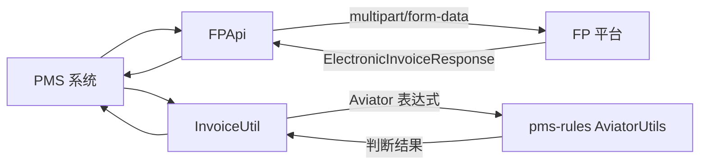

# pms-ext-fp 模块架构文档

## 1. 模块概述

pms-ext-fp 是 PMS 系统的 FP（财务平台）集成扩展模块，提供电子发票推送与本地发票识别判断能力。

- **包名**：`com.dp.plat.pms.extend.fp`
- **打包类型**：jar
- **职责**：电子发票推送（至 FP 平台）、发票类型/状态判断（Aviator 表达式）、Token 管理

> ⚠️ 本模块**不包含**发票验真、发票查询等 API。发票数据通过 `FPApi.postElectronicInvoice()` 推送到 FP 平台；发票类型与状态判断由 `InvoiceUtil` 通过 Aviator 表达式在本地完成。

---

## 2. 目录结构

```
pms-ext-fp/src/main/java/com/dp/plat/pms/extend/fp/
├── entity/              # 实体类
│   ├── BaseEntity.java               # 基础实体
│   └── InvoiceProviderInfo.java      # 发票提供者信息
├── model/               # API 模型
│   ├── Request.java                  # 请求模型
│   ├── RequestBody.java              # 请求体
│   ├── Response.java                 # 响应模型
│   ├── MsgResponse.java              # 消息响应
│   ├── TokenRequest.java             # Token 请求
│   ├── TokenResponse.java            # Token 响应
│   ├── ElectronicInvoiceModel.java   # 电子发票模型
│   ├── ElectronicInvoiceResponse.java
│   └── ElectronicInvoiceIdentifyAndVerifyResponse.java
└── util/
    ├── FPApi.java                    # FP API 工具类
    ├── InvoiceUtil.java              # 发票工具类
    └── MultipartBodyBuilder.java     # 多部分请求构建器
```

---

## 3. 核心功能

### 3.1 FP 平台 API 调用

**FPApi**：封装 FP 平台 API 调用，包括 Token 管理、HTTP 请求、限流推送。

```java
@Component("fpApi")
public class FPApi implements DisposableBean {

    // 获取访问令牌（无参，凭据来自 initConfig 注入的配置）
    public static TokenResponse getToken() {
        // 读写锁 + volatile 缓存，自动刷新过期 Token
        // ...
    }

    // 推送单条发票到 FP 平台
    public static <T> ElectronicInvoiceResponse postElectronicInvoice(T data) {
        return postElectronicInvoice(data, null);
    }

    // 批量推送发票（MULTIPLE 模式，10 线程并发）
    public static <T> List<Response<T>> postElectronicInvoice(List<T> list) {
        return postElectronicInvoice(list, null);
    }
}
```

> 完整方法清单详见 [FPApi 工具类详解](../02-modules/fp-api.md)。

### 3.2 发票识别与判断

**InvoiceUtil**：发票识别与判断工具，通过 Aviator 表达式引擎实现可配置的规则判断。

```java
public class InvoiceUtil {

    // 获取发票唯一编号
    public static String getUniqueInvoiceNumber(Map<String, Object> invoice) {
        // ...
    }

    // 检查交付件是否为发票类型（Aviator 表达式判断）
    public static boolean checkFileInvoiceType(Map<String, Object> invoice, Map<String, Object> config) {
        // ...
    }

    // 检查发票状态是否有效（Aviator 表达式判断）
    public static boolean checkFileInvoiceStatus(Map<String, Object> invoice, Map<String, Object> config) {
        // ...
    }
}
```

> InvoiceUtil 是纯本地判断工具，**不发起网络请求**，不调用 FPApi。完整方法清单详见 [InvoiceUtil 发票工具详解](../02-modules/invoice-util.md)。

### 3.3 Token 管理

Token 管理内置于 `FPApi.getToken()` 方法中，**不存在独立的 `TokenManager` 类**：

- 使用 `volatile TokenResponse cachedToken` + `ReentrantReadWriteLock(true)` 实现线程安全的 Token 缓存
- 读锁检查 Token 是否存在且未过期，未过期直接返回
- 写锁刷新 Token：`clearToken()` → 构建 `TokenRequest` → `get(tokenUrl, request, false)` 获取新 Token
- 凭据来自 `initConfig` 注入的配置字段（`appId`、`authType`、`authKey` 等）

> 详见 [FP API 架构](fp-api-architecture.md) 了解 Token 缓存机制。

---

## 4. 数据流向



---

## 5. 与其他模块集成

pms-ext-fp 依赖 pms-rules（Aviator 表达式引擎）：

```xml
<dependency>
    <groupId>com.dp.plat</groupId>
    <artifactId>pms-rules</artifactId>
    <version>${project.version}</version>
</dependency>
```
