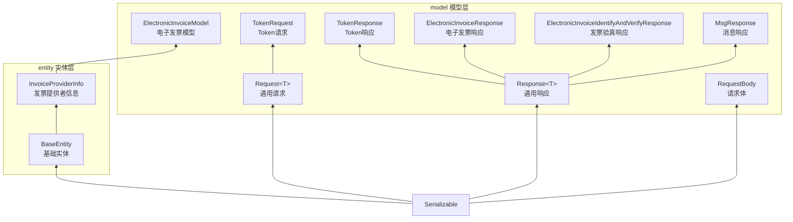

# 实体与模型参考文档

> 本文档详细说明 pms-ext-fp 模块中的实体类（entity）与模型类（model）的字段定义、继承关系与序列化配置。
>
> 源码位置：`src/main/java/com/dp/plat/pms/extend/fp/entity/` 和 `src/main/java/com/dp/plat/pms/extend/fp/model/`

---

## 1. 类继承关系总览



---

## 2. 实体类（entity）

### 2.1 BaseEntity（基础实体）

> 源码：`entity/BaseEntity.java`

| 字段 | 类型 | 说明 |
|------|------|------|
| `id` | Integer | 主键 ID |
| `createBy` | String | 创建人 |
| `createTime` | Date | 创建时间 |
| `updateBy` | String | 更新人 |
| `updateTime` | Date | 更新时间 |
| `customInfo` | Map<String, Object> | 自定义信息 |

**方法**：

| 方法签名 | 说明 |
|----------|------|
| `Object getCustomInfoByKey(String key)` | 获取自定义信息指定 key |
| `Object getCustomInfoByKey(String key, Object defaultValue)` | 获取自定义信息指定 key（带默认值） |
| `void setCustomInfoByKey(String key, Object value)` | 设置自定义信息指定 key |
| `protected String toIndentedString(Object o)` | 缩进格式化（toString 辅助） |

> **注意**：`customInfo` 用于存储扩展字段，支持运行时动态添加键值对。`setCustomInfoByKey` 在 customInfo 为 null 时自动初始化为 HashMap。

### 2.2 InvoiceProviderInfo（发票提供者信息）

> 源码：`entity/InvoiceProviderInfo.java`，继承 `BaseEntity`

| 字段 | 类型 | JSON 序列化 | 说明 |
|------|------|-------------|------|
| `invoiceId` | Integer | - | 关联 tb_invoice 表主键 |
| `provider` | String | - | 发票来源 |
| `openId` | String | - | 用户唯一标识 |
| `electricHash` | String | - | 电子发票 Hash 值 |
| `eSignature` | String | - | 电子签名状态 |
| `eDocModified` | String | - | 电子发票修改状态 |
| `eSignDate` | Date | `@JsonSerialize(using=JsonSerializer.class)` | 电子签名时间 |
| `fileSize` | Integer | - | 电子发票大小 |
| `fileExt` | String | - | 电子发票文件类型 |
| `downloadPath` | String | - | 本地下载保存地址 |
| `uploadPath` | String | - | 本地上传保存地址 |
| `sourceUrl` | String | - | 电子发票来源地址 |
| `status` | String | - | 发票状态 |
| `createBy` | String | - | 创建人（覆盖父类） |
| `createTime` | Date | `@JsonSerialize(using=JsonSerializer.class)` | 创建时间（覆盖父类） |
| `updateBy` | String | - | 更新人（覆盖父类） |
| `updateTime` | Date | `@JsonSerialize(using=JsonSerializer.class)` | 更新时间（覆盖父类） |
| `signatureInfo` | String | - | 电子签名信息 |
| `query` | ElectronicInvoiceModel | `@JSONField(name="query", serialize=true, deserialize=false)` | 发票来源查询参数 |
| `info` | Map<String, Object> | `@JSONField(name="info", serialize=true, deserialize=false)` | 发票来源发票信息 |

**构造方法**：

| 构造方法签名 | 说明 |
|-------------|------|
| `InvoiceProviderInfo()` | 无参构造 |
| `InvoiceProviderInfo(Integer invoiceId, String provider, String openId)` | 基本信息构造 |
| `InvoiceProviderInfo(Integer invoiceId, String provider, String openId, String status)` | 含状态构造 |
| `InvoiceProviderInfo(Integer invoiceId, String provider, String openId, String status, ElectronicInvoiceModel query, Map<String,Object> info)` | 完整构造 |
| `InvoiceProviderInfo(String provider, String openId, String status, ElectronicInvoiceModel query, Map<String,Object> info)` | 无 invoiceId 构造 |

**特殊方法**：

| 方法签名 | 说明 |
|----------|------|
| `@JSONField(name="query", deserialize=true) void setQuery(String query)` | 从 JSON 字符串反序列化为 ElectronicInvoiceModel |
| `@JSONField(name="info", deserialize=true) void setInfo(String info)` | 从 JSON 字符串反序列化为 Map |

> **注意**：`query` 和 `info` 字段的 `@JSONField` 配置：序列化时使用对象，反序列化时通过 String 重载方法解析 JSON 字符串。`@JsonSerialize(using=JsonSerializer.class)` 注解的 Date 字段使用 Jackson 的 JsonSerializer（此处为基类引用，实际序列化行为取决于配置）。

---

## 3. 模型类（model）

### 3.1 Request<T>（通用请求）

> 源码：`model/Request.java`，实现 `Serializable`

| 字段 | 类型 | JSON 序列化 | 说明 |
|------|------|-------------|------|
| `responseType` | Type | `@JSONField(serialize=false, deserialize=false)` | 响应类型（不参与序列化） |
| `headers` | Map<String, String> | `@JSONField(serialize=false, deserialize=false)` | 请求头（不参与序列化） |
| `request` | Object | `@JSONField(name="request")` | 请求体数据 |

**关键逻辑**：
- 构造方法通过反射获取泛型超类的 `ParameterizedType`，提取第一个类型参数作为 `responseType`
- 使用 `ConcurrentMap<Type, Type>` 缓存类型映射，避免重复反射
- 无泛型参数时，`responseType` 默认为 `Response.class`

**方法**：

| 方法签名 | 说明 |
|----------|------|
| `Request<T> request(RequestBody request)` | 链式设置请求体 |
| `Object getRequest()` | 获取请求体 |
| `void setRequest(Object request)` | 设置请求体 |
| `Type getResponseType()` | 获取响应类型 |
| `void setResponseType(Type responseType)` | 设置响应类型（null 不覆盖） |
| `Map<String, String> getHeaders()` | 获取请求头 |
| `void setHeaders(Map<String, String> headers)` | 设置请求头 |

### 3.2 Response<T>（通用响应）

> 源码：`model/Response.java`，实现 `Serializable`

| 字段 | 类型 | JSON 名称 | 说明 |
|------|------|-----------|------|
| `request` | Request<T> | 不序列化 | 原始请求（`@JSONField(serialize=false, deserialize=false)`） |
| `code` | Integer | `code` | 响应码 |
| `message` | String | `msg`（别名 `message`） | 响应消息 |
| `data` | List<T> | `data` | 响应数据列表 |
| `extend` | Map<String, Object> | `extend` | 扩展信息 |
| `isSuccess` | Boolean | `status` | 是否成功 |
| `headers` | Map<String, List<String>> | 不序列化 | 原始响应头 |

**成功码定义**：`SUCCESS_CODE = {0, 200}`

**关键方法**：

| 方法签名 | 说明 |
|----------|------|
| `boolean isSuccess()` | 是否成功（isSuccess=true 或 code 在 SUCCESS_CODE 中） |
| `long getDataSize()` | 数据量（Collection 取 size，否则 1 或 0） |
| `Response addData(T dataItem)` | 添加数据项 |
| `static <T> Response<T> failure(String message)` | 构建失败响应 |
| `static <T, R extends Response<T>> R failure(String message, Type responseType)` | 构建失败响应（指定类型） |
| `static <T, R extends Response<T>> R failure(String message, Class<R> responseClass)` | 构建失败响应（指定 Class） |

> **重要**：`Response.failure()` 是模块的**唯一错误处理机制**，不存在 `FPException` 自定义异常类。所有错误场景通过 `failure()` 静态工厂方法构建失败响应返回。

**failure 方法逻辑**：
```java
public static <T, R extends Response<T>> R failure(String message, Class<R> responseClass) {
    Response<T> response = null;
    if (responseClass != null && Response.class.isAssignableFrom(responseClass)) {
        try {
            response = responseClass.getDeclaredConstructor().newInstance();
        } catch (Exception e) {
            response = JSON.parseObject("{}", responseClass);
        }
    } else {
        response = new Response<T>();
    }
    return (R) response.message(message);
}
```

### 3.3 TokenRequest（Token 请求）

> 源码：`model/TokenRequest.java`，继承 `Request<TokenResponse>`

| 字段 | 类型 | JSON 名称 | 说明 |
|------|------|-----------|------|
| `oauthType` | String | `oauthType` | OAuth 类型 |
| `code` | String | `code` | 授权码 |
| `nickName` | String | `nickName` | 昵称 |

**继承的 responseType**：由于继承 `Request<TokenResponse>`，构造时自动设置 `responseType = TokenResponse.class`。

### 3.4 TokenResponse（Token 响应）

> 源码：`model/TokenResponse.java`，继承 `Response<Object>`

| 字段 | 类型 | JSON 名称 | 说明 |
|------|------|-----------|------|
| `tokenType` | String | `token_type` | 令牌类型 |
| `expiresIn` | String | `expires_in` | 有效期（秒） |
| `extExpiresIn` | String | `ext_expires_in` | 扩展有效期（秒） |
| `expiresOn` | String | `expires_on` | 过期时间戳（秒） |
| `expireTime` | String | `expireTime` | 过期时间（字符串日期） |
| `notBefore` | String | `not_before` | 生效时间 |
| `resource` | String | `resource` | 资源标识 |
| `accessToken` | String | `__RequestVerificationToken` | 访问令牌 |
| `error` | String | `error` | 错误标识 |
| `errorDescription` | String | `error_description` | 错误描述 |
| `errorCodes` | List<Object> | `error_codes` | 错误码列表 |
| `timestamp` | String | `timestamp` | 时间戳 |
| `traceId` | String | `trace_id` | 追踪 ID |
| `correlationId` | String | `correlation_id` | 关联 ID |
| `errorUri` | String | `error_uri` | 错误 URI |

> **注意**：`accessToken` 的 JSON 字段名为 `__RequestVerificationToken`（非标准的 `access_token`），这是 FP 平台的特定字段命名。

### 3.5 ElectronicInvoiceModel（电子发票模型）

> 源码：`model/ElectronicInvoiceModel.java`，继承 `InvoiceProviderInfo`，使用 Lombok 注解

**Lombok 注解**：`@Data`、`@Builder`、`@NoArgsConstructor`、`@AllArgsConstructor`

| 字段 | 类型 | 说明 |
|------|------|------|
| `async` | boolean | 是否异步 |
| `dataType` | String | 数据类型 |
| `dataId` | String | 数据 ID |
| `invoiceList` | List<ElectronicInvoiceModel> | 发票信息传递列表 |
| `sourceList` | List<Object> | 发票信息传递列表 |
| `files` | File[] | 附件（可多文件） |
| `jsonData` | String | JSON 格式传参数据 |
| `invoiceCode` | String | 发票编码 |
| `invoiceDate` | String | 发票日期 |
| `invoiceNumber` | String | 发票号码 |

**继承自 InvoiceProviderInfo 的字段**：invoiceId、provider、openId、electricHash、eSignature、eDocModified、eSignDate、fileSize、fileExt、downloadPath、uploadPath、sourceUrl、status、signatureInfo、query、info

**继承自 BaseEntity 的字段**：id、createBy、createTime、updateBy、updateTime、customInfo

**业务类型枚举**（来自类注释）：

| 值 | 含义 |
|----|------|
| 1 | 电子发票-原材料/加工费 |
| 2 | 发票-行政采购（OA） |
| 4 | 安服 |
| 5 | 用服 |
| 6 | 美金发票 |
| 7 | 手工凭证 |
| 8 | SSE发票-一般报销发票 |
| 9 | 增值税发票（销项）-电子票 |
| 10 | 增值税发票（销项）-纸质票扫描件 |

**档案类型枚举**：

| 值 | 含义 |
|----|------|
| 7 | 报销单据 |
| 1 | 发票 |

> **注意**：ElectronicInvoiceModel 继承 InvoiceProviderInfo，而 InvoiceProviderInfo 继承 BaseEntity，因此一个 Model 实例包含三层字段。Lombok 的 `@Builder` 注解会生成包含父类字段的构建器（需配合 `@AllArgsConstructor`）。

### 3.6 ElectronicInvoiceResponse（电子发票响应）

> 源码：`model/ElectronicInvoiceResponse.java`，继承 `Response<InvoiceProviderInfo>`

无额外字段，泛型参数为 `InvoiceProviderInfo`。`data` 字段类型为 `List<InvoiceProviderInfo>`。

### 3.7 ElectronicInvoiceIdentifyAndVerifyResponse（发票验真响应）

> 源码：`model/ElectronicInvoiceIdentifyAndVerifyResponse.java`，继承 `Response<InvoiceProviderInfo>`

无额外字段，泛型参数为 `InvoiceProviderInfo`。与 ElectronicInvoiceResponse 结构相同，语义上用于发票识别与验真场景。

### 3.8 MsgResponse（消息响应）

> 源码：`model/MsgResponse.java`，继承 `Response<InvoiceProviderInfo>`

无额外字段，泛型参数为 `InvoiceProviderInfo`。用于消息类响应场景。

### 3.9 RequestBody（请求体）

> 源码：`model/RequestBody.java`

| 字段 | 类型 | JSON 名称 | 校验 | 说明 |
|------|------|-----------|------|------|
| `func` | String | `func` | `@NotNull` | 程序名/方法名 |
| `data` | List<?> | `mainData` | `@Valid` | 推送数据 |

> **注意**：RequestBody 使用了 Jackson（`@JsonProperty`）和 FastJSON（`@JSONField`）双重注解，兼容两种 JSON 框架。当前 FPApi 主要使用 FastJSON。

---

## 4. 序列化框架使用

pms-ext-fp 模块同时使用了三种 JSON 框架的注解：

| 框架 | 注解 | 使用场景 |
|------|------|----------|
| FastJSON | `@JSONField` | FPApi 主要使用，Request/Response/Token 等模型 |
| Jackson | `@JsonProperty`、`@JsonSerialize` | RequestBody、InvoiceProviderInfo 的 Date 字段 |
| Lombok | `@Data`、`@Builder` 等 | ElectronicInvoiceModel |

> **注意**：FastJSON 的 `alternateNames` 属性（如 Response.message 的 `alternateNames = "message"`）支持 JSON 字段别名，兼容不同命名风格的响应。

---

## 5. 字段命名风格

模块中存在两种字段命名风格：

| 风格 | 示例 | 使用位置 |
|------|------|----------|
| 驼峰（camelCase） | `invoiceCode`、`invoiceNumber`、`uniqueInvoiceNumber` | Java 实体/模型字段 |
| 下划线（snake_case） | `invoice_code`、`invoice_number` | InvoiceUtil 操作的 Map 数据、TokenResponse 的 JSON 名称 |

**FastJSON 字段映射**：

| Java 字段 | JSON 字段名 | 说明 |
|-----------|-------------|------|
| `message` | `msg`（别名 `message`） | Response |
| `tokenType` | `token_type` | TokenResponse |
| `expiresIn` | `expires_in` | TokenResponse |
| `accessToken` | `__RequestVerificationToken` | TokenResponse |
| `func` | `func` | RequestBody |
| `data` | `mainData` | RequestBody |

---

## 6. 注意事项

1. **Response.failure 是唯一错误处理**：模块不存在 FPException 自定义异常，所有错误通过 Response.failure() 返回
2. **ElectronicInvoiceModel 三层继承**：包含 BaseEntity + InvoiceProviderInfo + 自身字段，字段总数约 30+
3. **accessToken 字段名特殊**：TokenResponse 的 accessToken 对应 JSON 字段 `__RequestVerificationToken`
4. **Date 序列化注解**：InvoiceProviderInfo 的 Date 字段使用 `@JsonSerialize(using=JsonSerializer.class)`，但 JsonSerializer 是抽象类，实际行为取决于 Jackson 配置
5. **query/info 反序列化**：InvoiceProviderInfo 的 setQuery(String) 和 setInfo(String) 支持从 JSON 字符串反序列化，异常时静默忽略
6. **Request 泛型推断**：Request 构造方法通过反射获取泛型类型，直接 `new Request()`（无泛型）时 responseType 为 Response.class
