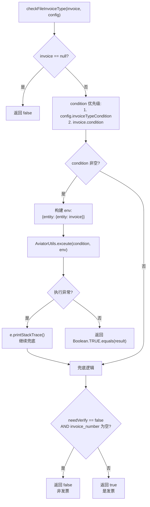
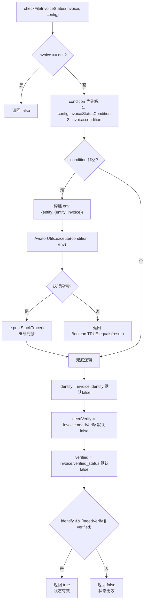
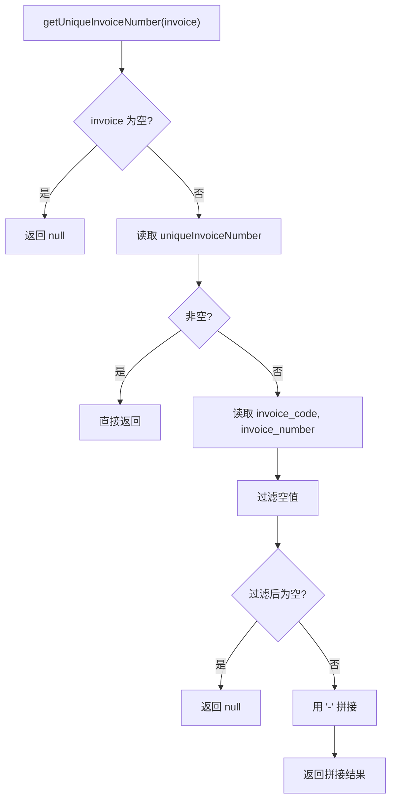

# InvoiceUtil 发票工具详解

> 本文档详细说明 pms-ext-fp 模块中 `InvoiceUtil` 工具类的发票类型判断、发票状态判断、Aviator 表达式集成与发票编号生成。
>
> 源码位置：`src/main/java/com/dp/plat/pms/extend/fp/util/InvoiceUtil.java`

---

## 1. 类定义

```java
public class InvoiceUtil {
    private static Supplier<Map<String, Object>> configSupplier;
    // ...
}
```

- **非 Spring 组件**：普通工具类，通过 `initConfig` 静态方法初始化
- **配置模式**：`Supplier<Map<String, Object>>` 动态配置供应
- **依赖**：pms-rules 的 `AviatorUtils`、commons-collections4 的 `MapUtils`、Hutool 的 `MapUtil`

> **重要纠正**：InvoiceUtil **不包含** `verifyInvoice()` 和 `getInvoiceInfo()` 方法。发票验真和查询由 FPApi 通过 HTTP 调用 FP 平台完成，InvoiceUtil 仅负责本地规则判断。

---

## 2. 方法清单

### 2.1 配置管理

| 方法签名 | 说明 |
|----------|------|
| `synchronized static void initConfig(Supplier<Map<String, Object>> configSupplier)` | 初始化配置供应器 |
| `static Map<String, Object> getConfig()` | 获取当前配置（异常返回空 Map） |

### 2.2 发票编号

| 方法签名 | 说明 |
|----------|------|
| `static String getUniqueInvoiceNumber(Map<String, Object> invoice)` | 获取发票唯一编号 |

### 2.3 交付件类型获取

| 方法签名 | 说明 |
|----------|------|
| `static <T> T getFileInvoiceType(T defalutValue)` | 获取交付件发票原件类型（使用默认配置） |
| `static <T> T getFileInvoiceType(Map<String, Object> config, T defalutValue)` | 获取交付件发票原件类型（指定配置） |
| `static <T> T getFileInspectionType(T defalutValue)` | 获取交付件验收材料类型（使用默认配置） |
| `static <T> T getFileInspectionType(Map<String, Object> config, T defalutValue)` | 获取交付件验收材料类型（指定配置） |

### 2.4 发票类型判断

| 方法签名 | 说明 |
|----------|------|
| `static boolean checkFileInvoiceType(Map<String, Object> invoice)` | 检查是否发票类型（使用默认配置） |
| `static boolean checkFileInvoiceType(Map<String, Object> invoice, Map<String, Object> config)` | 检查是否发票类型（指定配置） |

### 2.5 发票状态判断

| 方法签名 | 说明 |
|----------|------|
| `static boolean checkFileInvoiceStatus(Map<String, Object> invoice)` | 检查发票状态是否有效（使用默认配置） |
| `static boolean checkFileInvoiceStatus(Map<String, Object> invoice, Map<String, Object> config)` | 检查发票状态是否有效（指定配置） |

---

## 3. 发票类型判断详解

### 3.1 checkFileInvoiceType 逻辑

```java
public static boolean checkFileInvoiceType(Map<String, Object> invoice, Map<String, Object> config) {
    if (invoice == null) {
        return false;
    }
    String condition = (String) invoice.get("condition");
    condition = MapUtils.getString(config, "invoiceTypeCondition", condition);
    try {
        if (StringUtils.isNotBlank(condition)) {
            Map<String, Object> env = new HashMap<String, Object>();
            env.put("entity", Collections.singletonMap("entity", invoice));
            return Boolean.TRUE.equals(AviatorUtils.exceute(condition, env));
        }
    } catch (Exception e) {
        e.printStackTrace();
    }
    return !(!MapUtil.getBool(invoice, "needVerify", false) 
             && StringUtils.isBlank(MapUtil.getStr(invoice, "invoice_number")));
}
```

### 3.2 判断流程



### 3.3 兜底逻辑说明

当没有配置表达式或表达式执行异常时，使用以下兜底规则：

| needVerify | invoice_number | 结果 | 含义 |
|------------|----------------|------|------|
| false | 空 | false | 非发票（无需验证且无发票号） |
| false | 非空 | true | 是发票 |
| true | 空 | true | 是发票（需验证但号未填） |
| true | 非空 | true | 是发票 |

### 3.4 表达式配置示例

```java
// 配置 invoiceTypeCondition
Map<String, Object> config = new HashMap<>();
config.put("invoiceTypeCondition", "entity.entity.invoice_number != nil && string.length(entity.entity.invoice_number) > 0");
InvoiceUtil.initConfig(() -> config);
```

---

## 4. 发票状态判断详解

### 4.1 checkFileInvoiceStatus 逻辑

```java
public static boolean checkFileInvoiceStatus(Map<String, Object> invoice, Map<String, Object> config) {
    if (invoice == null) {
        return false;
    }
    String condition = (String) invoice.get("condition");
    condition = MapUtils.getString(config, "invoiceStatusCondition", condition);
    try {
        if (StringUtils.isNotBlank(condition)) {
            Map<String, Object> env = new HashMap<String, Object>();
            env.put("entity", Collections.singletonMap("entity", invoice));
            return Boolean.TRUE.equals(AviatorUtils.exceute(condition, env));
        }
    } catch (Exception e) {
        e.printStackTrace();
    }
    Boolean identify = MapUtil.getBool(invoice, "identify", false);
    Boolean needVerify = MapUtil.getBool(invoice, "needVerify", false);
    Boolean verified = MapUtil.getBool(invoice, "verified_status", false);
    return identify && (!needVerify || verified);
}
```

### 4.2 判断流程



### 4.3 兜底逻辑真值表

| identify | needVerify | verified_status | 结果 | 含义 |
|----------|------------|-----------------|------|------|
| true | false | false | true | 已识别，无需验证 → 有效 |
| true | false | true | true | 已识别，无需验证 → 有效 |
| true | true | false | false | 已识别，需验证但未验证 → 无效 |
| true | true | true | true | 已识别，需验证且已验证 → 有效 |
| false | * | * | false | 未识别 → 无效 |

### 4.4 表达式配置示例

```java
// 配置 invoiceStatusCondition
Map<String, Object> config = new HashMap<>();
config.put("invoiceStatusCondition", 
    "entity.entity.identify == true && (entity.entity.needVerify == false || entity.entity.verified_status == true)");
InvoiceUtil.initConfig(() -> config);
```

---

## 5. 发票编号生成详解

### 5.1 getUniqueInvoiceNumber 逻辑

```java
public static String getUniqueInvoiceNumber(Map<String, Object> invoice) {
    if (invoice == null || invoice.isEmpty()) {
        return null;
    }
    String uniqueInvoiceNumber = MapUtil.getStr(invoice, "uniqueInvoiceNumber");
    if (StringUtils.isNotBlank(uniqueInvoiceNumber)) {
        return uniqueInvoiceNumber;
    }
    String invoiceCode = MapUtil.getStr(invoice, "invoice_code");
    String invoiceNumber = MapUtil.getStr(invoice, "invoice_number");
    List<String> uniqueInvoiceParts = Arrays.asList(invoiceCode, invoiceNumber).stream()
            .filter(s -> s != null && StringUtils.isNotBlank(s))
            .collect(Collectors.toList());
    if (uniqueInvoiceParts.isEmpty()) {
        return null;
    }
    uniqueInvoiceNumber = StringUtils.join(uniqueInvoiceParts, "-");
    return uniqueInvoiceNumber;
}
```

### 5.2 编号生成规则



### 5.3 编号生成示例

| uniqueInvoiceNumber | invoice_code | invoice_number | 结果 |
|---------------------|--------------|----------------|------|
| `UNIQUE-001` | - | - | `UNIQUE-001` |
| null | `310000000` | `12345678` | `310000000-12345678` |
| null | null | `12345678` | `12345678` |
| null | `310000000` | null | `310000000` |
| null | null | null | null |
| null | `  ` (空白) | `  ` (空白) | null |

> **注意**：字段名混用风格——`uniqueInvoiceNumber`（驼峰）、`invoice_code`/`invoice_number`（下划线）。这是因为 InvoiceUtil 操作的是 Map（来自数据库或接口的原始数据），而非 ElectronicInvoiceModel 对象。

---

## 6. 交付件类型获取详解

### 6.1 getFileInvoiceType / getFileInspectionType

```java
public static <T> T getFileInvoiceType(Map<String, Object> config, T defalutValue) {
    return (T) MapUtils.getObject(config, "invoiceType", defalutValue);
}

public static <T> T getFileInspectionType(Map<String, Object> config, T defalutValue) {
    return (T) MapUtils.getObject(config, "inspectionType", defalutValue);
}
```

| 方法 | 配置项 | 用途 | 返回类型 |
|------|--------|------|----------|
| `getFileInvoiceType` | `invoiceType` | 交付件发票原件类型 | 泛型 T（通常为 String） |
| `getFileInspectionType` | `inspectionType` | 交付件验收材料类型 | 泛型 T（通常为 String） |

### 6.2 使用示例

```java
// 获取发票类型，默认 "01"
String invoiceType = InvoiceUtil.getFileInvoiceType("01");

// 获取验收材料类型，默认 "02"
String inspectionType = InvoiceUtil.getFileInspectionType("02");

// 指定配置获取
Map<String, Object> config = new HashMap<>();
config.put("invoiceType", "03");
String type = InvoiceUtil.getFileInvoiceType(config, "01");  // 返回 "03"
```

---

## 7. Aviator 表达式集成

### 7.1 调用方式

```java
import com.dp.plat.rules.util.AviatorUtils;

// 构建执行环境
Map<String, Object> env = new HashMap<String, Object>();
env.put("entity", Collections.singletonMap("entity", invoice));

// 执行表达式（注意方法名拼写为 exceute）
Boolean.TRUE.equals(AviatorUtils.exceute(condition, env));
```

### 7.2 env 结构

```
env = {
    "entity": {
        "entity": {
            "invoice_number": "...",
            "invoice_code": "...",
            "needVerify": true/false,
            "verified_status": true/false,
            "identify": true/false,
            "condition": "...",
            ...其他发票字段
        }
    }
}
```

表达式中访问字段需使用 `entity.entity.<字段名>` 路径。

### 7.3 表达式示例

```aviator
# 发票类型判断：发票号码非空
entity.entity.invoice_number != nil && string.length(entity.entity.invoice_number) > 0

# 发票类型判断：业务类型为电子发票
entity.entity.businessType == '1' || entity.entity.businessType == '9'

# 发票状态判断：已识别且已验证
entity.entity.identify == true && entity.entity.verified_status == true

# 发票状态判断：已识别且无需验证
entity.entity.identify == true && entity.entity.needVerify == false
```

> 详见 pms-rules 模块的 [Aviator 引擎架构](../../pms-rules/docs/01-architecture/aviator-engine.md) 了解表达式语法、内置函数和缓存机制。

---

## 8. 配置项汇总

| 配置项 | 使用方法 | 类型 | 说明 |
|--------|----------|------|------|
| `invoiceTypeCondition` | `checkFileInvoiceType` | String (Aviator 表达式) | 发票类型判断表达式 |
| `invoiceStatusCondition` | `checkFileInvoiceStatus` | String (Aviator 表达式) | 发票状态判断表达式 |
| `invoiceType` | `getFileInvoiceType` | Object (通常 String) | 交付件发票原件类型 |
| `inspectionType` | `getFileInspectionType` | Object (通常 String) | 交付件验收材料类型 |

---

## 9. 使用示例

### 9.1 初始化

```java
// 系统启动时初始化配置
InvoiceUtil.initConfig(() -> {
    Map<String, Object> config = new HashMap<>();
    config.put("invoiceTypeCondition", "entity.entity.invoice_number != nil");
    config.put("invoiceStatusCondition", 
        "entity.entity.identify == true && (entity.entity.needVerify == false || entity.entity.verified_status == true)");
    config.put("invoiceType", "01");
    config.put("inspectionType", "02");
    return config;
});
```

### 9.2 判断发票类型

```java
Map<String, Object> deliverable = new HashMap<>();
deliverable.put("invoice_number", "12345678");
deliverable.put("needVerify", true);

boolean isInvoice = InvoiceUtil.checkFileInvoiceType(deliverable);
// true：有发票号码，判定为发票
```

### 9.3 判断发票状态

```java
Map<String, Object> invoice = new HashMap<>();
invoice.put("identify", true);
invoice.put("needVerify", true);
invoice.put("verified_status", true);

boolean isValid = InvoiceUtil.checkFileInvoiceStatus(invoice);
// true：已识别且已验证
```

### 9.4 获取发票编号

```java
Map<String, Object> invoice = new HashMap<>();
invoice.put("invoice_code", "310000000");
invoice.put("invoice_number", "12345678");

String uniqueNumber = InvoiceUtil.getUniqueInvoiceNumber(invoice);
// "310000000-12345678"
```

---

## 10. 注意事项

1. **方法名拼写**：`AviatorUtils.exceute()` 拼写错误（应为 `execute`），这是 pms-rules 模块的定义
2. **参数名拼写**：`defalutValue` 应为 `defaultValue`，多处方法签名中存在
3. **异常处理弱**：Aviator 执行异常仅 `e.printStackTrace()`，未使用日志框架，生产排查困难
4. **env 嵌套**：`entity.entity.invoice` 双层嵌套结构，表达式编写易出错
5. **字段命名混用**：`uniqueInvoiceNumber`（驼峰）与 `invoice_code`/`invoice_number`（下划线）混用
6. **非 Spring 管理**：InvoiceUtil 不是 Spring 组件，需调用方手动 `initConfig`
7. **不调用 FPApi**：InvoiceUtil 是纯本地判断工具，不发起网络请求
