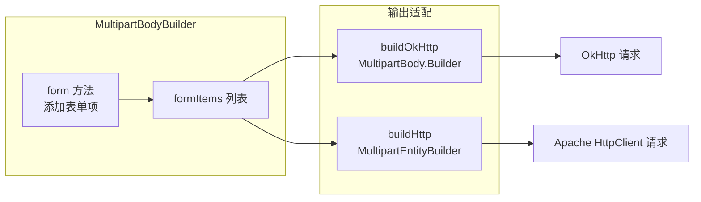

# MultipartBodyBuilder 表单构建器详解

> 本文档详细说明 pms-ext-fp 模块中 `MultipartBodyBuilder` 表单构建器，支持 OkHttp 与 Apache HttpClient 双客户端的 multipart/form-data 表单构建。
>
> 源码位置：`src/main/java/com/dp/plat/pms/extend/fp/util/MultipartBodyBuilder.java`

---

## 1. 类定义

```java
public class MultipartBodyBuilder {
    private final List<MultipartFormItem> formItems = new ArrayList<>();
    // ...
}
```

- **非 Spring 组件**：普通工具类，每次使用 `new MultipartBodyBuilder()` 创建实例
- **设计模式**：Builder 模式，链式调用
- **双客户端支持**：同时支持 OkHttp（`buildOkHttp()`）和 Apache HttpClient（`buildHttp()`）

---

## 2. 设计目的

MultipartBodyBuilder 解决了 FPApi 中三种 HTTP 客户端实现需要统一构建 multipart 表单的问题：



---

## 3. 内部类

### 3.1 MultipartFormItem（表单项）

```java
private static class MultipartFormItem {
    final String name;
    final Object value; // File, InputStream, 或 String
    
    MultipartFormItem(String name, Object value) {
        this.name = name;
        this.value = value;
    }
}
```

| 字段 | 类型 | 说明 |
|------|------|------|
| `name` | String | 表单字段名 |
| `value` | Object | 值（File / File[] / StreamPart / byte[] / String） |

### 3.2 StreamPart（流部分）

```java
private static class StreamPart {
    final String filename;
    final InputStream inputStream;
    final String contentType;
    
    StreamPart(String filename, InputStream inputStream, String contentType) {
        this.filename = filename;
        this.inputStream = inputStream;
        this.contentType = contentType;
    }
}
```

| 字段 | 类型 | 说明 |
|------|------|------|
| `filename` | String | 文件名 |
| `inputStream` | InputStream | 输入流 |
| `contentType` | String | 内容类型（如 `application/pdf`） |

### 3.3 InputStreamRequestBody（OkHttp 流请求体）

```java
private static class InputStreamRequestBody extends RequestBody {
    private final MediaType contentType;
    private final InputStream inputStream;
    
    @Override
    public MediaType contentType() { return contentType; }
    
    @Override
    public void writeTo(BufferedSink sink) throws IOException {
        byte[] buffer = new byte[8192];
        int bytesRead;
        while ((bytesRead = inputStream.read(buffer)) != -1) {
            sink.write(ByteString.of(buffer, 0, bytesRead));
        }
    }
    
    @Override
    public long contentLength() throws IOException {
        return -1; // 未知长度
    }
}
```

> **注意**：`contentLength()` 返回 -1 表示未知长度，OkHttp 会使用 chunked transfer encoding。

---

## 4. 方法清单

### 4.1 表单添加方法

| 方法签名 | 说明 |
|----------|------|
| `MultipartBodyBuilder form(Map<String, Object> form)` | 批量添加表单数据 |
| `MultipartBodyBuilder form(String name, Object value)` | 添加表单项（自动类型判断） |
| `MultipartBodyBuilder form(String name, File file)` | 添加单个文件 |
| `MultipartBodyBuilder form(String name, File[] files)` | 添加多个文件 |
| `MultipartBodyBuilder form(String name, String filename, InputStream inputStream, String contentType)` | 添加 InputStream |
| `private MultipartBodyBuilder putToForm(String name, String value)` | 内部：添加文本字段 |

### 4.2 构建方法

| 方法签名 | 返回类型 | 说明 |
|----------|----------|------|
| `MultipartBody.Builder buildOkHttp()` | OkHttp `MultipartBody.Builder` | 构建 OkHttp 表单体 |
| `MultipartEntityBuilder buildHttp()` | Apache `MultipartEntityBuilder` | 构建 Apache HttpClient 表单体 |

### 4.3 工具方法

| 方法签名 | 说明 |
|----------|------|
| `private String guessContentType(File file)` | 根据文件名猜测 Content-Type |

---

## 5. form(String, Object) 类型分发逻辑

`form(String name, Object value)` 是核心方法，根据值类型自动分发：

```mermaid
flowchart TD
    A["form(name, value)"] --> B{name == null 或 value == null?}
    B -->|是| C[忽略，返回 this]
    B -->|否| D{value 类型?}
    
    D -->|File| E["form(name, (File) value)"]
    D -->|File[]| F["form(name, (File[]) value)"]
    D -->|Iterable| G["遍历，toString 后用逗号拼接"]
    D -->|数组| H["遍历，toString 后用逗号拼接"]
    D -->|其他| I["putToForm(name, value.toString())"]
    
    E --> J[添加 File 到 formItems]
    F --> K[遍历添加每个 File 到 formItems]
    G --> L["putToForm(name, 拼接字符串)"]
    H --> L
    I --> L
    L --> M[添加 String 到 formItems]
```

### 5.1 类型处理规则

| 值类型 | 处理方式 | 存储形式 |
|--------|----------|----------|
| `File` | 直接添加 | `MultipartFormItem(name, File)` |
| `File[]` | 遍历每个存在的文件添加 | 多个 `MultipartFormItem(name, File)` |
| `Iterable<?>` | 遍历元素 toString，逗号拼接 | `MultipartFormItem(name, String)` |
| 数组（非 File[]） | 遍历元素 toString，逗号拼接 | `MultipartFormItem(name, String)` |
| 其他 | toString 转字符串 | `MultipartFormItem(name, String)` |
| `InputStream` | 通过 `form(name, filename, stream, contentType)` 添加 | `MultipartFormItem(name, StreamPart)` |

> **注意**：`Iterable` 和数组类型会被拼接为逗号分隔的字符串，而非多个表单项。只有 `File[]` 会生成多个同名字段。

---

## 6. buildOkHttp() 详解

```java
public MultipartBody.Builder buildOkHttp() throws IOException {
    MultipartBody.Builder bodyBuilder = new MultipartBody.Builder()
        .setType(MultipartBody.FORM);
    
    for (MultipartFormItem item : formItems) {
        if (item.value instanceof File) {
            File file = (File) item.value;
            MediaType mediaType = MediaType.parse(guessContentType(file));
            RequestBody fileBody = RequestBody.create(file, mediaType);
            bodyBuilder.addFormDataPart(item.name, file.getName(), fileBody);
        } else if (item.value instanceof byte[]) {
            RequestBody streamBody = InputStreamRequestBody.create((byte[]) item.value);
            bodyBuilder.addFormDataPart(item.name, item.name, streamBody);
        } else if (item.value instanceof StreamPart) {
            StreamPart sp = (StreamPart) item.value;
            MediaType mediaType = MediaType.parse(sp.contentType);
            RequestBody streamBody = new InputStreamRequestBody(mediaType, sp.inputStream);
            bodyBuilder.addFormDataPart(item.name, sp.filename, streamBody);
        } else if (item.value instanceof String) {
            bodyBuilder.addFormDataPart(item.name, (String) item.value);
        }
    }
    return bodyBuilder;
}
```

### 6.1 OkHttp 表单项映射

| formItem.value 类型 | OkHttp 方法 | 文件名 |
|---------------------|-------------|--------|
| `File` | `addFormDataPart(name, file.getName(), RequestBody.create(file, mediaType))` | file.getName() |
| `byte[]` | `addFormDataPart(name, name, InputStreamRequestBody.create(bytes))` | name（字段名作为文件名） |
| `StreamPart` | `addFormDataPart(name, sp.filename, new InputStreamRequestBody(...))` | sp.filename |
| `String` | `addFormDataPart(name, value)` | 无（文本字段） |

---

## 7. buildHttp() 详解

```java
public MultipartEntityBuilder buildHttp() {
    MultipartEntityBuilder builder = MultipartEntityBuilder.create();
    builder.setMode(HttpMultipartMode.BROWSER_COMPATIBLE);
    builder.setCharset(java.nio.charset.StandardCharsets.UTF_8);
    
    for (MultipartFormItem item : formItems) {
        if (item.value instanceof File) {
            File file = (File) item.value;
            ContentType mediaType = ContentType.parse(guessContentType(file));
            builder.addBinaryBody(item.name, file, mediaType, file.getName());
        } else if (item.value instanceof byte[]) {
            builder.addBinaryBody(item.name, (byte[]) item.value);
        } else if (item.value instanceof StreamPart) {
            StreamPart sp = (StreamPart) item.value;
            ContentType mediaType = ContentType.parse(sp.contentType);
            builder.addBinaryBody(item.name, sp.inputStream, mediaType, sp.filename);
        } else if (item.value instanceof String) {
            builder.addTextBody(item.name, (String) item.value);
        }
    }
    return builder;
}
```

### 7.1 Apache HttpClient 表单项映射

| formItem.value 类型 | Apache HttpClient 方法 | 配置 |
|---------------------|------------------------|------|
| `File` | `addBinaryBody(name, file, contentType, filename)` | BROWSER_COMPATIBLE 模式 |
| `byte[]` | `addBinaryBody(name, bytes)` | 无文件名 |
| `StreamPart` | `addBinaryBody(name, inputStream, contentType, filename)` | - |
| `String` | `addTextBody(name, value)` | 文本字段 |

### 7.2 配置差异

| 配置项 | OkHttp (buildOkHttp) | Apache HttpClient (buildHttp) |
|--------|----------------------|-------------------------------|
| Multipart 模式 | `MultipartBody.FORM` | `HttpMultipartMode.BROWSER_COMPATIBLE` |
| 字符集 | 默认 UTF-8 | 显式设置 `StandardCharsets.UTF_8` |
| 返回类型 | `MultipartBody.Builder`（需再 `.build()`） | `MultipartEntityBuilder`（需再 `.build()`） |

---

## 8. Content-Type 猜测

```java
private String guessContentType(File file) {
    String type = URLConnection.guessContentTypeFromName(file.getName());
    return type != null ? type : "application/octet-stream";
}
```

| 文件扩展名 | 猜测的 Content-Type |
|------------|---------------------|
| `.pdf` | `application/pdf` |
| `.jpg` / `.jpeg` | `image/jpeg` |
| `.png` | `image/png` |
| `.xml` | `application/xml` |
| `.html` | `text/html` |
| 其他/未知 | `application/octet-stream` |

> **注意**：`URLConnection.guessContentTypeFromName()` 基于 JDK 内置的 `content-types.properties`，识别能力有限。对于 OFD、发票专用格式等可能返回 null，此时使用 `application/octet-stream` 兜底。

---

## 9. 使用示例

### 9.1 OkHttp 表单构建

```java
// 构建 OkHttp multipart 表单
MultipartBodyBuilder builder = new MultipartBodyBuilder();
builder.form("dataType", "invoice")
      .form("dataId", "INV-001")
      .form("files", new File("/tmp/invoice1.pdf"))
      .form("files", new File("/tmp/invoice2.pdf"))
      .form("async", "false");

MultipartBody.Builder okBuilder = builder.buildOkHttp();
MultipartBody body = okBuilder.build();

// 构建 OkHttp 请求
Request request = new Request.Builder()
    .url("https://fp.example.com/api/archive")
    .post(body)
    .build();
```

### 9.2 Apache HttpClient 表单构建

```java
// 构建 Apache HttpClient multipart 表单
MultipartBodyBuilder builder = new MultipartBodyBuilder();
builder.form("dataType", "invoice")
      .form("files", new File("/tmp/invoice.pdf"));

MultipartEntityBuilder entityBuilder = builder.buildHttp();
HttpEntity entity = entityBuilder.build();

// 构建 Apache HttpClient 请求
HttpPost httpPost = new HttpPost("https://fp.example.com/api/archive");
httpPost.setEntity(entity);
```

### 9.3 InputStream 文件上传

```java
MultipartBodyBuilder builder = new MultipartBodyBuilder();
try (InputStream is = new FileInputStream("/tmp/invoice.pdf")) {
    builder.form("file", "invoice.pdf", is, "application/pdf");
    MultipartBody.Builder okBuilder = builder.buildOkHttp();
    // 使用 okBuilder 构建请求...
}
```

### 9.4 在 FPApi 中的使用

```java
// FPApi.requestWithPool() 中的使用
if (isForm) {
    Map<String, Object> form = beanToMap(requestData);
    HttpEntity formEntity = new MultipartBodyBuilder().form(form).buildHttp().build();
    entityRequest.setEntity(formEntity);
    httpRequest.setHeader(formEntity.getContentType().getName(), 
                          formEntity.getContentType().getValue());
}

// FPApi.requestWithOkHttp() 中的使用
if (isForm) {
    Map<String, Object> form = beanToMap(requestData);
    MultipartBody.Builder multipartBuilder = new MultipartBodyBuilder().form(form).buildOkHttp();
    RequestBody formBody = multipartBuilder.build();
    requestBuilder.method(method, formBody);
}
```

---

## 10. 注意事项

1. **非线程安全**：`formItems` 是普通 `ArrayList`，非并发安全，单次构建使用
2. **File 存在性检查**：`form(String, File)` 会检查 `file.exists()`，不存在的文件被忽略
3. **Iterable/数组拼接**：非 File 类型的集合/数组会被拼接为逗号分隔字符串，而非多个表单项
4. **byte[] 文件名**：`byte[]` 类型在 OkHttp 中使用字段名作为文件名，在 Apache HttpClient 中无文件名
5. **InputStream 未知长度**：`InputStreamRequestBody.contentLength()` 返回 -1，使用 chunked 编码
6. **buildOkHttp 抛 IOException**：`buildOkHttp()` 方法签名声明 `throws IOException`（虽然方法体内未显式抛出）
7. **未关闭 InputStream**：`InputStreamRequestBody.writeTo()` 读取流后未关闭，调用方需自行管理流生命周期
