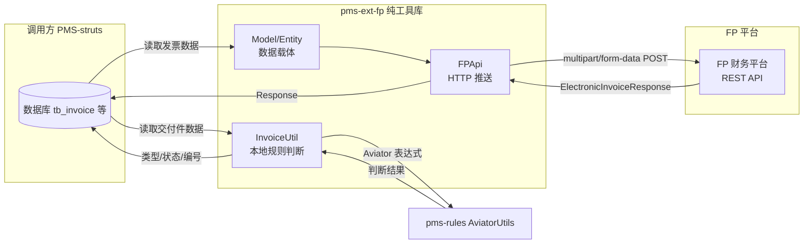

# pms-ext-fp 数据库文档

> 本文档说明 pms-ext-fp 模块的数据库使用情况。
>
> **重要纠正**：本文档已基于实际源码重写，移除了此前版本中虚构的 `ElectronicInvoiceModel` 字段（amount/taxAmount/buyerName/buyerTaxNo/sellerName/sellerTaxNo 等不存在字段）、虚构的 `ElectronicInvoiceResponse` 字段定义，以及虚构的发票开具/验证/查询流程。详见 [审计报告](../audit/audit-modules.md) 和 [综合审查报告](../audit/comprehensive-review.md)。

---

## 1. 结论：纯工具库，无数据库表

pms-ext-fp 模块是一个**纯工具库**，**不直接管理任何数据库表**，也不包含任何 MyBatis/iBATIS 映射文件或 DAO 接口。

| 维度 | 状态 |
|------|------|
| 数据库表 | 无 |
| DAO 接口 | 无 |
| MyBatis Mapper | 无 |
| iBATIS SqlMap | 无 |
| SQL 文件 | 无 |
| 数据源配置 | 无（依赖调用方） |

> 准确的纯工具库说明详见 [no-database.md](no-database.md)。

---

## 2. 与数据库的间接关系

虽然 pms-ext-fp 本身无数据库表，但其模型类被调用方（如 PMS-struts）用于承载从数据库读取的数据：

| 模型类 | 关联表（调用方管理） | 关系 |
|--------|---------------------|------|
| `InvoiceProviderInfo` | `tb_invoice`（PMS-struts） | `invoiceId` 字段关联 tb_invoice 主键 |
| `ElectronicInvoiceModel` | `tb_invoice`（PMS-struts） | 继承 InvoiceProviderInfo，扩展推送字段 |
| `BaseEntity` | - | 通用基础字段（id/createBy/createTime 等），由调用方映射 |

> **注意**：这些表由 PMS-struts 模块管理，pms-ext-fp 仅提供数据载体模型，不参与表的 CRUD。此前版本中提到的 `pm_project`、`pm_dispatch_project_settlement` 关联表不准确，pms-ext-fp 不直接关联任何表。

---

## 3. 模型类数据结构（基于实际源码）

### 3.1 ElectronicInvoiceModel

> 源码：`model/ElectronicInvoiceModel.java`

```java
@lombok.Data
@lombok.Builder
@lombok.NoArgsConstructor
@lombok.AllArgsConstructor
public class ElectronicInvoiceModel extends InvoiceProviderInfo {
    private boolean async;                          // 是否异步
    private String dataType;                        // 数据类型
    private String dataId;                          // 数据 ID
    private List<ElectronicInvoiceModel> invoiceList; // 发票信息传递列表
    private List<Object> sourceList;                // 发票信息传递列表
    private File[] files;                           // 附件（可多文件）
    private String jsonData;                        // JSON 格式传参数据
    private String invoiceCode;                     // 发票编码
    private String invoiceDate;                     // 发票日期
    private String invoiceNumber;                   // 发票号码
}
```

> **注意**：ElectronicInvoiceModel 继承 `InvoiceProviderInfo`（进而继承 `BaseEntity`），自身仅定义上述 10 个字段。继承字段包括：invoiceId、provider、openId、electricHash、eSignature、eDocModified、eSignDate、fileSize、fileExt、downloadPath、uploadPath、sourceUrl、status、signatureInfo、query、info、id、createBy、createTime、updateBy、updateTime、customInfo。完整字段清单详见 [实体与模型参考](../02-modules/entity-model-reference.md)。

### 3.2 ElectronicInvoiceResponse

> 源码：`model/ElectronicInvoiceResponse.java`

```java
public class ElectronicInvoiceResponse extends Response<InvoiceProviderInfo> implements Serializable {
    private static final long serialVersionUID = 1L;
}
```

> **注意**：ElectronicInvoiceResponse **无自身字段**，所有字段（code、message、data、extend、isSuccess、headers 等）均继承自 `Response<InvoiceProviderInfo>`。此前版本中将其描述为包含独立的 code/message/data 字段是不准确的。

### 3.3 Response<T>（ElectronicInvoiceResponse 的父类）

```java
public class Response<T> implements Serializable {
    private static final Integer SUCCESS_CODE = 0;  // 成功码（仅为 0）
    private Request<T> request;                      // 原始请求
    private Integer code;                            // 响应码
    private String message;                          // 响应消息
    private List<T> data = new ArrayList<T>();       // 响应数据列表
    private Map<String, Object> extend;              // 扩展信息
    private Boolean isSuccess;                       // 成功标志
    private Map<String, List<String>> headers;       // 原始响应头
}
```

> **重要**：`SUCCESS_CODE` 仅为 `0`（非 `{0, 200}`），`isSuccess()` 判断逻辑为 `Boolean.TRUE.equals(getIsSuccess()) || SUCCESS_CODE.equals(this.code)`。

---

## 4. 模块实际能力（基于源码）

pms-ext-fp 模块的实际能力**仅限于**：

| 能力 | 实现类 | 说明 |
|------|--------|------|
| 发票推送/归档 | `FPApi.postElectronicInvoice(...)` | 通过 HTTP POST multipart/form-data 推送发票到 FP 平台 `archiveUrl` |
| Token 管理 | `FPApi.getToken()` | 获取 FP 平台访问令牌（带缓存） |
| 发票类型判断 | `InvoiceUtil.checkFileInvoiceType(...)` | 本地 Aviator 表达式判断（不发起网络请求） |
| 发票状态判断 | `InvoiceUtil.checkFileInvoiceStatus(...)` | 本地 Aviator 表达式判断（不发起网络请求） |
| 发票编号生成 | `InvoiceUtil.getUniqueInvoiceNumber(...)` | 本地拼接发票唯一编号 |

> **重要澄清**：本模块**不包含**以下能力（此前版本文档中描述的均为虚构内容）：
> - ❌ 发票开具（issueInvoice）— 不存在该方法
> - ❌ 发票验证/验真（verifyInvoice）— 不存在该方法
> - ❌ 发票查询（getInvoiceInfo）— 不存在该方法
> - ❌ 发票真伪验证流程 — 不存在
> - ❌ 发票开具流程 — 不存在

---

## 5. 数据流向



---

## 6. 配置数据来源

pms-ext-fp 的运行时配置（如 FP 平台地址、认证信息、规则表达式）不存储在本地数据库，而是通过以下方式由调用方动态供应：

| 工具类 | 配置供应方式 | 调用方典型实现 |
|--------|-------------|---------------|
| `FPApi` | `Supplier<ConcurrentHashMap<String, Object>>` 或 `Function<String, ConcurrentHashMap<String, Object>>` 或 `Map<String, Object>` | PMS-struts 从 `sys_config` 表或配置文件读取 |
| `InvoiceUtil` | `Supplier<Map<String, Object>>` | PMS-struts 从 `sys_config` 表或规则配置表读取 |

---

## 7. 相关文档

| 文档 | 说明 |
|------|------|
| [no-database.md](no-database.md) | 纯工具库详细说明 |
| [实体与模型参考](../02-modules/entity-model-reference.md) | 全部实体与模型类字段定义 |
| [类参考](../02-modules/class-reference.md) | 14 个 Java 类完整清单与方法签名 |
| [FP 调用矩阵](../04-mapping/fp-call-matrix.md) | 调用点、方法、参数矩阵 |
| [综合审查报告](../audit/comprehensive-review.md) | 本次审查的完整报告 |
