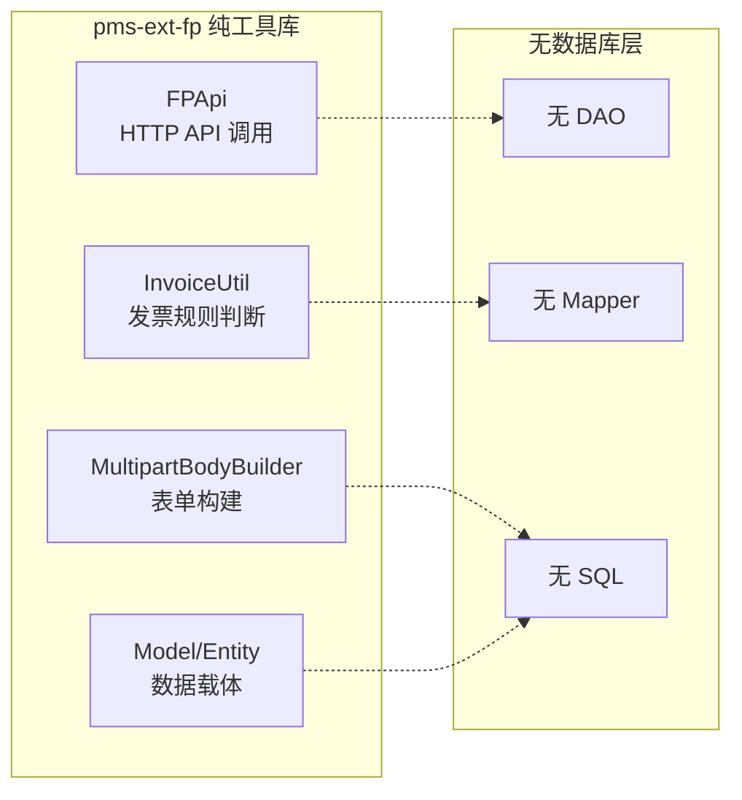

# 数据库说明文档

> 本文档说明 pms-ext-fp 模块的数据库使用情况。

---

## 1. 结论：纯工具库，无数据库表

pms-ext-fp 模块是一个**纯工具库**，**不直接管理任何数据库表**，也不包含任何 MyBatis/iBATIS 映射文件或 DAO 接口。

---

## 2. 模块定位

---

## 3. 与数据库的间接关系

虽然 pms-ext-fp 本身无数据库表，但其模型类被调用方（如 PMS-struts）用于承载从数据库读取的数据：

| 模型类 | 关联表（调用方管理） | 关系 |
|--------|---------------------|------|
| `InvoiceProviderInfo` | `tb_invoice`（PMS-struts） | `invoiceId` 字段关联 tb_invoice 主键 |
| `ElectronicInvoiceModel` | `tb_invoice`（PMS-struts） | 继承 InvoiceProviderInfo，扩展推送字段 |
| `BaseEntity` | - | 通用基础字段（id/createBy/createTime 等），由调用方映射 |

> **注意**：这些表由 PMS-struts 模块管理，pms-ext-fp 仅提供数据载体模型，不参与表的 CRUD。详见 [PMS-struts 数据库文档](../../PMS-struts/docs/03-database/database_dict.md)。

---

## 4. 配置数据来源

pms-ext-fp 的运行时配置（如 FP 平台地址、认证信息、规则表达式）不存储在本地数据库，而是通过以下方式由调用方动态供应：

| 工具类 | 配置供应方式 | 调用方典型实现 |
|--------|-------------|---------------|
| `FPApi` | `Supplier<ConcurrentHashMap<String, Object>>` 或 `Function<String, ConcurrentHashMap<String, Object>>` 或 `Map<String, Object>` | PMS-struts 从 `sys_config` 表或配置文件读取 |
| `InvoiceUtil` | `Supplier<Map<String, Object>>` | PMS-struts 从 `sys_config` 表或规则配置表读取 |

---

## 5. 现有文档纠正

现有 `03-database/database-overview.md` 中提到的以下内容**不准确**：

| 现有文档内容 | 实际情况 |
|-------------|----------|
| "关联表：pm_project、pm_dispatch_project_settlement" | pms-ext-fp 不关联任何表，这些是 PMS-struts 的表 |
| "电子发票模型字段：amount、taxAmount、buyerName、buyerTaxNo、sellerName、sellerTaxNo" | ElectronicInvoiceModel 不包含这些字段，实际字段见 [实体与模型参考](../02-modules/entity-model-reference.md) |
| "ElectronicInvoiceResponse 字段：code、message、data" | 这些是继承自 Response 的字段，非 ElectronicInvoiceResponse 自身定义 |

---

## 6. 总结

| 维度 | 状态 |
|------|------|
| 数据库表 | 无 |
| DAO 接口 | 无 |
| MyBatis Mapper | 无 |
| iBATIS SqlMap | 无 |
| SQL 文件 | 无 |
| 数据源配置 | 无（依赖调用方） |
| 模型类与表的关系 | 间接（由调用方映射） |
