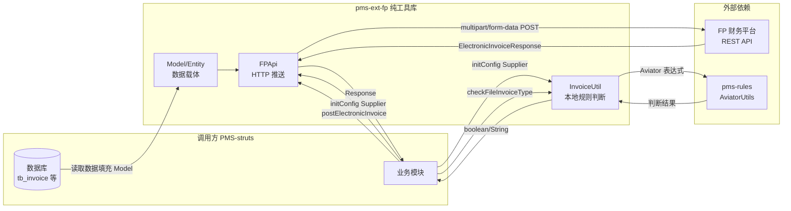

# pms-ext-fp 模块-表CRUD映射矩阵

> 本文档梳理 pms-ext-fp 模块与数据库表的 CRUD 映射关系。
>
> **重要纠正**：本文档已基于实际源码重写，移除了此前版本中虚构的数据库名（dppms_d365）、虚构的发票开具/验证/查询流程、虚构的发票类型分类。pms-ext-fp 是纯工具库，不直接管理任何数据库表。详见 [综合审查报告](../audit/comprehensive-review.md)。

---

## 1. 结论：无数据库 CRUD 操作

pms-ext-fp 模块是**纯工具库**，**不直接管理任何数据库表**，因此不存在模块-表 CRUD 映射关系。

| 维度 | 状态 |
|------|------|
| 数据库 | 无（不直接访问） |
| 数据库表 | 无 |
| CRUD 操作 | 无 |
| DAO 接口 | 无 |
| MyBatis Mapper | 无 |

> 准确的纯工具库说明详见 [database-overview.md](../03-database/database-overview.md) 和 [no-database.md](../03-database/no-database.md)。

---

## 2. 模块实际操作映射

pms-ext-fp 模块不执行数据库 CRUD 操作，其核心操作是对 FP 平台的 HTTP 调用和本地规则判断：

### 2.1 FP 平台 HTTP 操作（非数据库操作）

| 操作 | 方法 | HTTP 方法 | 目标 URL | 请求格式 | 认证 | 响应类型 |
|------|------|-----------|----------|----------|------|----------|
| 获取 Token | `FPApi.getToken()` | GET | `tokenUrl` | TokenRequest（query 参数） | 否 | `TokenResponse` |
| 推送单条发票 | `FPApi.postElectronicInvoice(T)` | POST | `archiveUrl` | multipart/form-data | 是 | `ElectronicInvoiceResponse` |
| 批量推送发票 | `FPApi.postElectronicInvoice(List<T>)` | POST | `archiveUrl` | multipart/form-data | 是 | `List<Response<T>>` |
| 文件列表批量查验 | `FPApi.postElectronicInvoice(String, String, List<File>, ...)` | POST | `archiveUrl` | multipart/form-data | 是 | `List<Response<ElectronicInvoiceModel>>` |
| 通用数据推送 | `FPApi.pushListData(...)` / `pushSingleData(...)` | POST | `syncUrl`（调用方指定） | form 或 json | 是 | `List<Response<T>>` |

> **重要澄清**：本模块**不包含**以下操作（此前版本文档中描述的均为虚构内容）：
> - ❌ 发票开具流程（申请开票 → 调用 FP API → 获取发票 → 存储发票）— 不存在
> - ❌ 发票验证流程（提交验证 → 调用 FP 验真 API → 返回结果）— 不存在
> - ❌ 发票查询流程 — 不存在

### 2.2 本地规则判断操作（非数据库操作）

| 操作 | 方法 | 输入 | 输出 | 依赖 |
|------|------|------|------|------|
| 发票类型判断 | `InvoiceUtil.checkFileInvoiceType(Map)` | 发票数据 Map | boolean | AviatorUtils（pms-rules） |
| 发票状态判断 | `InvoiceUtil.checkFileInvoiceStatus(Map)` | 发票数据 Map | boolean | AviatorUtils（pms-rules） |
| 发票编号生成 | `InvoiceUtil.getUniqueInvoiceNumber(Map)` | 发票数据 Map | String | 无 |
| 交付件类型获取 | `InvoiceUtil.getFileInvoiceType(T)` | 默认值 | 泛型 T | config.invoiceType |
| 验收材料类型获取 | `InvoiceUtil.getFileInspectionType(T)` | 默认值 | 泛型 T | config.inspectionType |

> InvoiceUtil 是纯本地判断工具，**不发起网络请求**，不调用 FPApi。

---

## 3. 数据流向图

---

## 4. 模型类与表的间接关系

虽然 pms-ext-fp 不直接管理表，但其模型类被调用方用于承载从数据库读取的数据：

| 模型类 | 关联表（调用方管理） | 关系说明 |
|--------|---------------------|----------|
| `InvoiceProviderInfo` | `tb_invoice`（PMS-struts） | `invoiceId` 字段关联 tb_invoice 主键 |
| `ElectronicInvoiceModel` | `tb_invoice`（PMS-struts） | 继承 InvoiceProviderInfo，扩展推送字段 |
| `BaseEntity` | - | 通用基础字段，由调用方映射到各表 |

> **注意**：此前版本中提到的 `pm_project`、`pm_dispatch_project_settlement` 关联表不准确，pms-ext-fp 不直接关联任何表。这些表属于 PMS-struts 模块。

---

## 5. 配置项使用矩阵

### 5.1 FPApi 配置项

| 配置项 | 使用方法 | 用途 |
|--------|----------|------|
| `serviceUrl` | `requestWith*` | 服务基础地址（URL 无 host 时拼接） |
| `tokenUrl` | `getToken` | Token 获取地址（格式化 appId） |
| `archiveUrl` | `postElectronicInvoice` | 发票归档地址 |
| `authType` | `initAuthorization` | 认证类型（bearer/header/query/cookie） |
| `authKey` | `initAuthorization` | 认证键名 |
| `appId` | `initConfig` | 应用 ID（格式化 tokenUrl） |
| `enableCookie` | `getToken`, `initAuthorization` | 是否启用 Cookie |
| `cookieKey` | `getToken`, `initAuthorization` | Cookie 键名 |
| `rateLimit` | `postElectronicInvoice(List)` | 限流频率（默认 30） |
| `enableRetry` | `retryRequest` | 是否启用重试（默认 false） |
| `debug` | `log` | 是否输出 DEBUG 日志 |
| `postByForm` | `pushData` | 是否表单提交（默认 false） |

### 5.2 InvoiceUtil 配置项

| 配置项 | 使用方法 | 用途 |
|--------|----------|------|
| `invoiceTypeCondition` | `checkFileInvoiceType` | 发票类型判断 Aviator 表达式 |
| `invoiceStatusCondition` | `checkFileInvoiceStatus` | 发票状态判断 Aviator 表达式 |
| `invoiceType` | `getFileInvoiceType` | 交付件发票原件类型 |
| `inspectionType` | `getFileInspectionType` | 交付件验收材料类型 |

> 完整配置项矩阵详见 [FP 调用矩阵](fp-call-matrix.md)。

---

## 6. 相关文档

| 文档 | 说明 |
|------|------|
| [database-overview.md](../03-database/database-overview.md) | 数据库概览（纯工具库） |
| [no-database.md](../03-database/no-database.md) | 纯工具库详细说明 |
| [fp-call-matrix.md](fp-call-matrix.md) | FP 调用矩阵（调用点、方法、参数） |
| [FPApi 工具类详解](../02-modules/fp-api.md) | FPApi 完整方法清单 |
| [InvoiceUtil 发票工具详解](../02-modules/invoice-util.md) | InvoiceUtil 完整方法清单 |
| [综合审查报告](../audit/comprehensive-review.md) | 本次审查的完整报告 |
