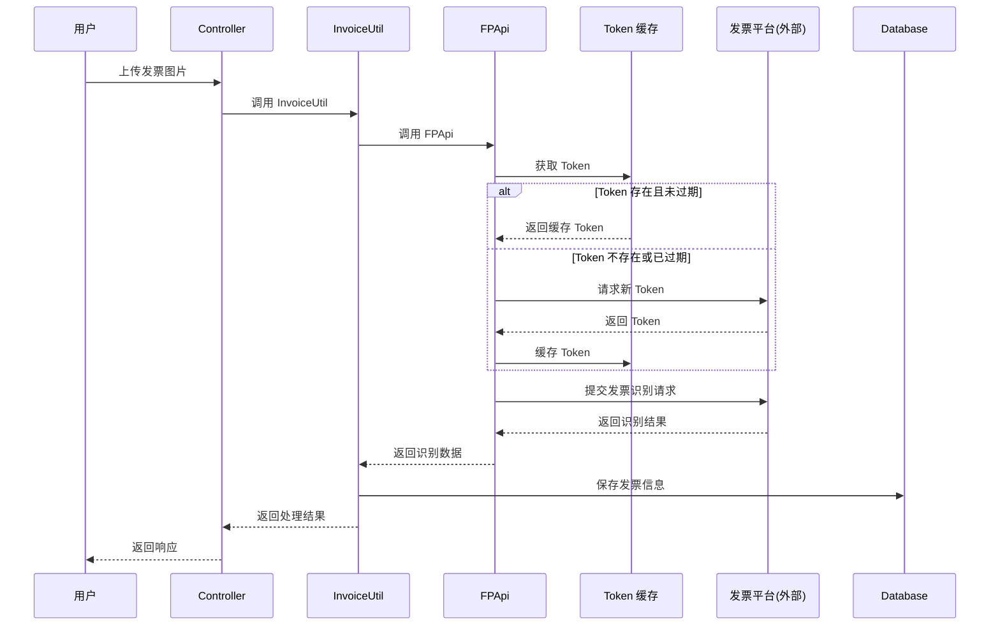
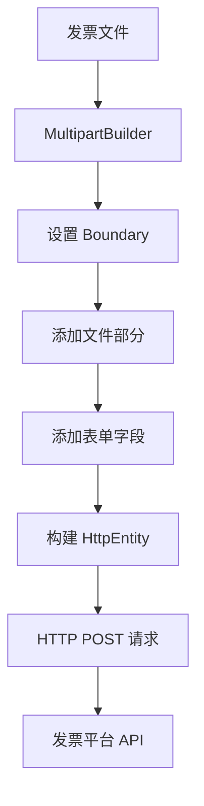
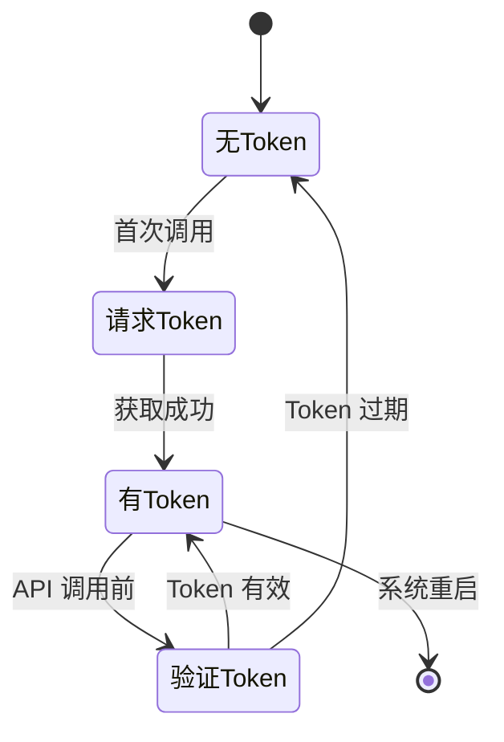
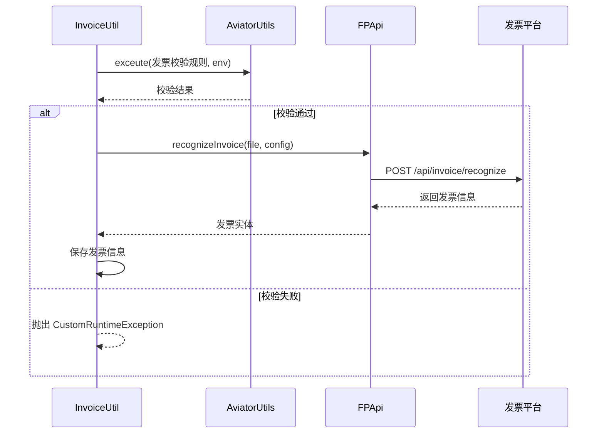
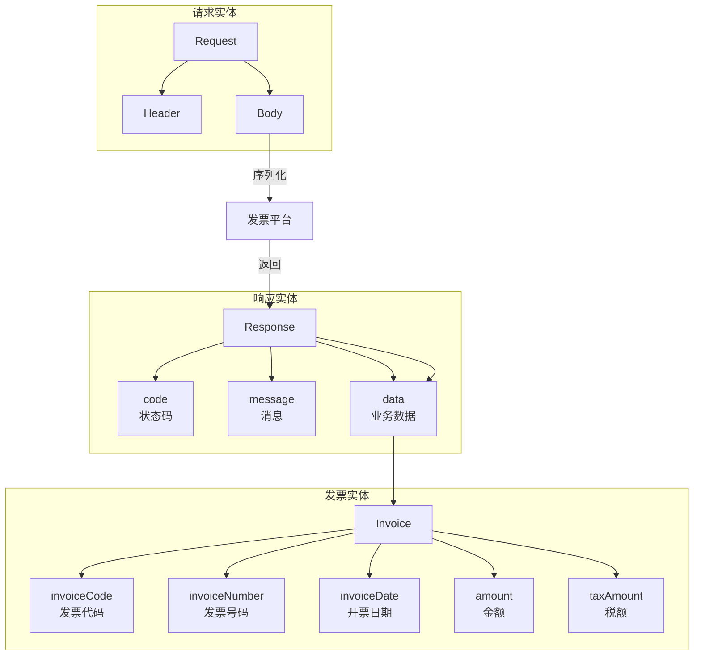
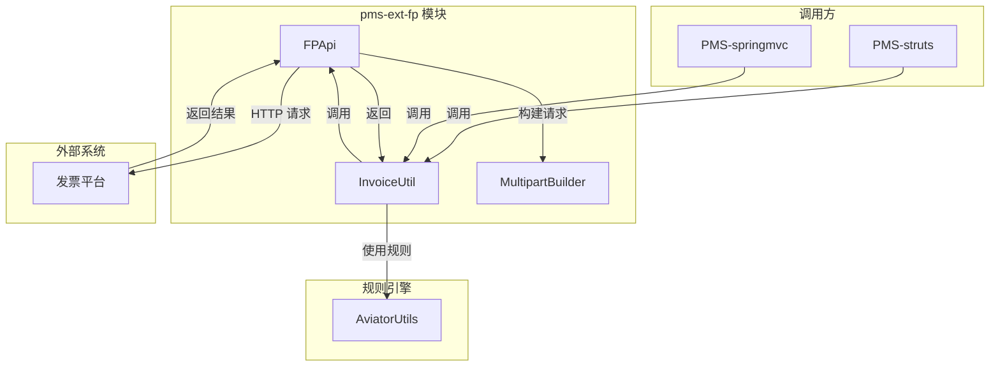
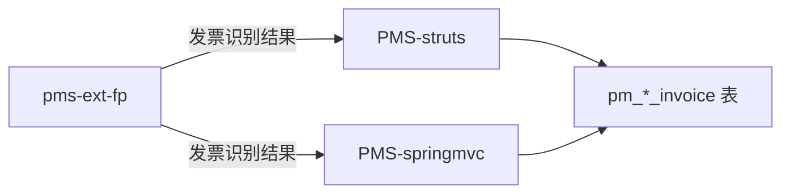

# pms-ext-fp 数据流图

## 1. 发票平台整体数据流

### 1.1 发票识别提交流程

### 1.2 Multipart 构建数据流

## 2. Token 管理数据流

## 3. 发票识别详细数据流

## 4. 实体模型数据流

## 5. 跨模块调用关系

## 6. 异常处理数据流

```mermaid
graph TB
    A[FPApi 调用] --> B{调用成功?}
    B -->|是| C[返回响应]
    B -->|否| D{异常类型}
    D -->|网络异常| E[CustomRuntimeException<br/>网络连接失败]
    D -->|Token 失效| F[重新获取 Token]
    D -->|接口错误| G[CustomRuntimeException<br/>接口返回错误]
    F --> H[重试调用]
    H --> A
    E --> I[向上抛出]
    G --> I
```

## 7. 数据库交互

pms-ext-fp 模块无独立数据库表，发票数据存储在调用方模块的表中。

