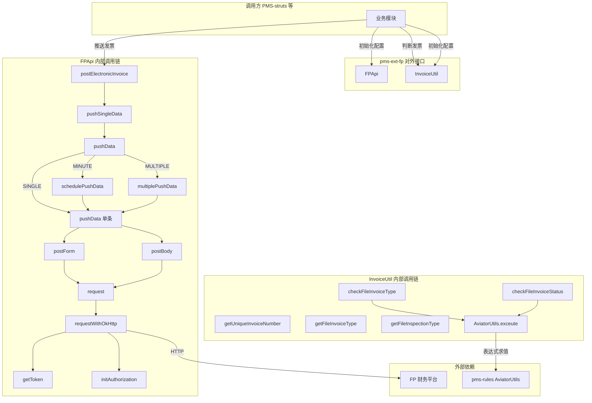
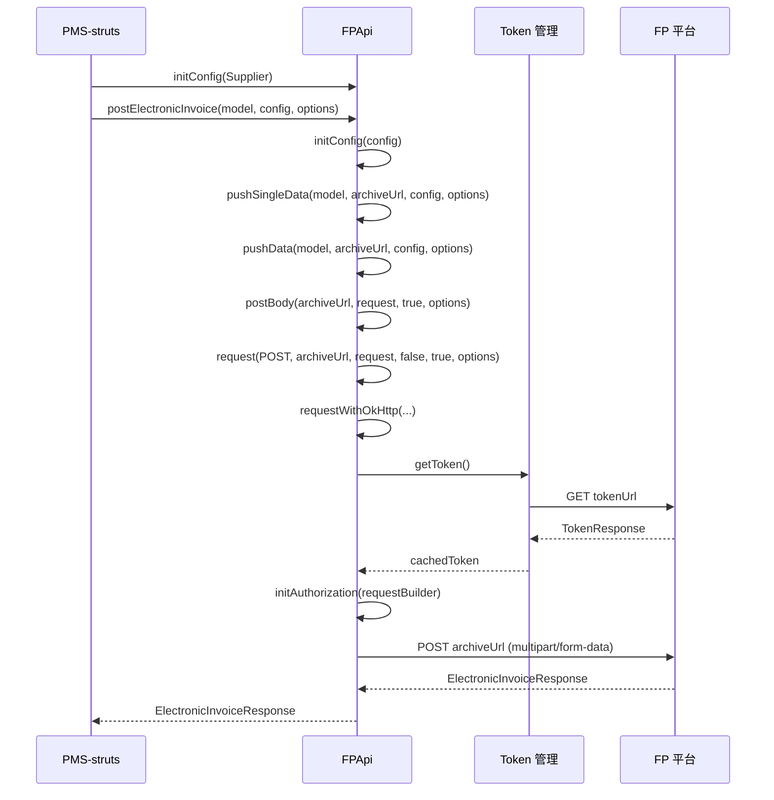
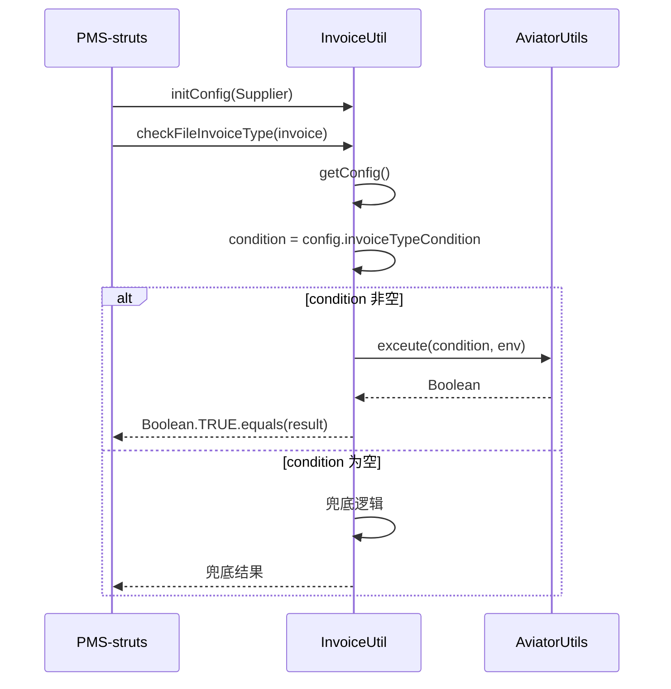

# FP 调用矩阵文档

> 本文档梳理 pms-ext-fp 模块中 FPApi 和 InvoiceUtil 的对外调用点、方法、参数与调用链路。

---

## 1. 调用关系总览

---

## 2. FPApi 调用矩阵

### 2.1 对外公开方法（调用方直接调用）

| 调用方 | 方法 | 参数 | 返回值 | 用途 |
|--------|------|------|--------|------|
| PMS-struts | `initConfig(Supplier)` | `Supplier<ConcurrentHashMap<String, Object>>` | `Map<String, Object>` | 初始化动态配置 |
| PMS-struts | `initConfig(Function, String)` | `Function<String, ConcurrentHashMap<String, Object>>`, `String key` | `Map<String, Object>` | 初始化按 key 查询配置 |
| PMS-struts | `initConfig(Map)` | `Map<String, Object> config` | `Map<String, Object>` | 初始化静态配置 |
| PMS-struts | `getConfig()` | 无 | `Map<String, Object>` | 获取当前配置 |
| PMS-struts | `getToken()` | 无 | `TokenResponse` | 获取 FP 平台 Token |
| PMS-struts | `postElectronicInvoice(T)` | `T data` | `ElectronicInvoiceResponse` | 单条发票推送 |
| PMS-struts | `postElectronicInvoice(T, Map)` | `T data`, `Map<String, Object> config` | `ElectronicInvoiceResponse` | 单条发票推送（带配置） |
| PMS-struts | `postElectronicInvoice(T, Map, Map)` | `T data`, `Map config`, `Map options` | `ElectronicInvoiceResponse` | 单条发票推送（完整参数） |
| PMS-struts | `postElectronicInvoice(List<T>)` | `List<T> list` | `List<Response<T>>` | 批量发票推送 |
| PMS-struts | `postElectronicInvoice(List<T>, Map)` | `List<T> list`, `Map config` | `List<Response<T>>` | 批量发票推送（带配置） |
| PMS-struts | `postElectronicInvoice(List<T>, Map, Map)` | `List<T> list`, `Map config`, `Map options` | `List<Response<T>>` | 批量发票推送（完整参数） |
| PMS-struts | `postElectronicInvoice(String, String, List<File>, List<Object>, Map)` | `dataType`, `dataId`, `files`, `sourceList`, `config` | `List<Response<ElectronicInvoiceModel>>` | 文件列表批量查验 |
| PMS-struts | `postElectronicInvoice(String, String, List<File>, List<Object>, Map, Map)` | 同上 + `options` | `List<Response<ElectronicInvoiceModel>>` | 文件列表批量查验（带选项） |
| PMS-struts | `pushListData(List, String, Integer, Map, Map)` | `list`, `syncUrl`, `rateLimit`, `config`, `options` | `List<Response<T>>` | 推送列表数据（SINGLE） |
| PMS-struts | `pushListData(List, String, Integer, Map, String, Map)` | 同上 + `limitType` | `List<Response<T>>` | 推送列表数据（指定限流） |
| PMS-struts | `pushSingleData(List, String, Integer, Map, String, Map)` | `list`, `syncUrl`, `rateLimit`, `config`, `limitType`, `options` | `List<Response<T>>` | 推送单条数据 |
| PMS-struts | `pushData(List, String, Integer, Map, String, boolean, Map)` | `list`, `syncUrl`, `rateLimit`, `config`, `limitType`, `splitToList`, `options` | `List<Response<T>>` | 核心推送方法 |
| PMS-struts | `postForm(String, Request)` | `url`, `params` | `T extends Response<E>` | 表单 POST |
| PMS-struts | `postBody(String, Request)` | `url`, `params` | `T extends Response<E>` | JSON Body POST |
| PMS-struts | `get(String, Request)` | `url`, `request` | `T extends Response<E>` | GET 请求 |
| PMS-struts | `request(String, String, Request, boolean, boolean, Map)` | `method`, `url`, `request`, `isForm`, `needAuth`, `options` | `T extends Response<E>` | 通用请求入口 |

### 2.2 内部调用链

| 调用方方法 | 被调用方法 | 触发条件 |
|-----------|-----------|----------|
| `postElectronicInvoice(T, Map, Map)` | `initConfig(Map)` | 初始化配置 |
| `postElectronicInvoice(T, Map, Map)` | `pushSingleData(T, String, Map, Map)` | 单条推送 |
| `postElectronicInvoice(List<T>, Map, Map)` | `initConfig(Map)` | 初始化配置 |
| `postElectronicInvoice(List<T>, Map, Map)` | `pushSingleData(List, String, Integer, Map, String, Map)` | 批量推送（MULTIPLE 模式） |
| `postElectronicInvoice(String, ..., List<File>, ...)` | `postElectronicInvoice(List, Map, Map)` | 文件转 Model 后批量推送 |
| `pushSingleData(List, ...)` | `pushData(List, ..., false, ...)` | splitToList=false |
| `pushListData(List, ...)` | `pushData(List, ..., true, ...)` | splitToList=true |
| `pushData(List, ..., MINUTE, ...)` | `schedulePushData(...)` | MINUTE 限流模式 |
| `pushData(List, ..., MULTIPLE, ...)` | `multiplePushData(...)` | MULTIPLE 限流模式 |
| `pushData(List, ..., SINGLE, ...)` | `pushData(Object, ...)` | SINGLE 模式逐个 |
| `schedulePushData` | `pushData(Object, ...)` | 调度池定时调用 |
| `multiplePushData` | `pushData(Object, ...)` | 线程池并发调用 |
| `pushData(Object, ...)` | `postForm(String, Request, boolean, Map)` | postByForm=true |
| `pushData(Object, ...)` | `postBody(String, Request, boolean, Map)` | postByForm=false |
| `postForm` | `post(String, Request, boolean, boolean, Map)` | isForm=true |
| `postBody` | `post(String, Request, boolean, boolean, Map)` | isForm=false |
| `post` | `request(String, String, Request, boolean, boolean, Map)` | 通用入口 |
| `request` | `requestWithOkHttp(...)` | **当前默认** |
| `requestWithOkHttp` | `initAuthorization(String, URI)` | needAuth=true（URL 参数） |
| `requestWithOkHttp` | `initAuthorization(okhttp3.Request.Builder)` | needAuth=true（Header） |
| `initAuthorization(*)` | `getToken()` | 获取认证 Token |
| `getToken` | `get(String, Request, boolean)` | 获取新 Token（needAuth=false） |
| `requestWithOkHttp` | `retryRequest(...)` | 响应解析失败 |
| `retryRequest` | `clearToken()` | 清除旧 Token |
| `retryRequest` | `request(...)` | enableRetry=true 且未重试 |

### 2.3 HTTP 端点调用

| FPApi 方法 | HTTP 方法 | 目标 URL | 请求格式 | 认证 | 响应类型 |
|-----------|-----------|----------|----------|------|----------|
| `getToken()` | GET | `tokenUrl`（格式化为含 appId） | TokenRequest（query 参数） | 否 | `TokenResponse` |
| `postElectronicInvoice(T)` | POST | `archiveUrl` | multipart/form-data | 是 | `ElectronicInvoiceResponse` |
| `postElectronicInvoice(List<T>)` | POST | `archiveUrl` | multipart/form-data | 是 | `List<Response<T>>` |
| `pushListData/pushSingleData` | POST | `syncUrl`（调用方指定） | form 或 json | 是 | `List<Response<T>>` |

---

## 3. InvoiceUtil 调用矩阵

### 3.1 对外公开方法

| 调用方 | 方法 | 参数 | 返回值 | 用途 |
|--------|------|------|--------|------|
| PMS-struts | `initConfig(Supplier)` | `Supplier<Map<String, Object>>` | void | 初始化配置供应器 |
| PMS-struts | `getUniqueInvoiceNumber(Map)` | `Map<String, Object> invoice` | `String` | 获取发票唯一编号 |
| PMS-struts | `getFileInvoiceType(T)` | `T defalutValue` | `T` | 获取发票原件类型 |
| PMS-struts | `getFileInvoiceType(Map, T)` | `Map config`, `T defalutValue` | `T` | 获取发票原件类型（指定配置） |
| PMS-struts | `getFileInspectionType(T)` | `T defalutValue` | `T` | 获取验收材料类型 |
| PMS-struts | `getFileInspectionType(Map, T)` | `Map config`, `T defalutValue` | `T` | 获取验收材料类型（指定配置） |
| PMS-struts | `checkFileInvoiceType(Map)` | `Map<String, Object> invoice` | `boolean` | 判断是否发票类型 |
| PMS-struts | `checkFileInvoiceType(Map, Map)` | `Map invoice`, `Map config` | `boolean` | 判断是否发票类型（指定配置） |
| PMS-struts | `checkFileInvoiceStatus(Map)` | `Map<String, Object> invoice` | `boolean` | 判断发票状态是否有效 |
| PMS-struts | `checkFileInvoiceStatus(Map, Map)` | `Map invoice`, `Map config` | `boolean` | 判断发票状态是否有效（指定配置） |

### 3.2 内部调用链

| 调用方方法 | 被调用方法 | 触发条件 |
|-----------|-----------|----------|
| `getFileInvoiceType(T)` | `getConfig()` | 获取配置 |
| `getFileInvoiceType(T)` | `getFileInvoiceType(Map, T)` | 委托带配置版本 |
| `getFileInspectionType(T)` | `getConfig()` | 获取配置 |
| `getFileInspectionType(T)` | `getFileInspectionType(Map, T)` | 委托带配置版本 |
| `checkFileInvoiceType(Map)` | `getConfig()` | 获取配置 |
| `checkFileInvoiceType(Map)` | `checkFileInvoiceType(Map, Map)` | 委托带配置版本 |
| `checkFileInvoiceStatus(Map)` | `getConfig()` | 获取配置 |
| `checkFileInvoiceStatus(Map)` | `checkFileInvoiceStatus(Map, Map)` | 委托带配置版本 |
| `checkFileInvoiceType(Map, Map)` | `AviatorUtils.exceute(condition, env)` | condition 非空 |
| `checkFileInvoiceStatus(Map, Map)` | `AviatorUtils.exceute(condition, env)` | condition 非空 |
| `getConfig()` | `configSupplier.get()` | 获取动态配置 |

### 3.3 Aviator 表达式调用

| 方法 | 表达式来源 | env 结构 | 返回处理 |
|------|-----------|----------|----------|
| `checkFileInvoiceType` | `config.invoiceTypeCondition` 或 `invoice.condition` | `{entity: {entity: invoice}}` | `Boolean.TRUE.equals(result)` |
| `checkFileInvoiceStatus` | `config.invoiceStatusCondition` 或 `invoice.condition` | `{entity: {entity: invoice}}` | `Boolean.TRUE.equals(result)` |

---

## 4. MultipartBodyBuilder 调用矩阵

### 4.1 调用点

| 调用方 | 方法 | 场景 |
|--------|------|------|
| `FPApi.requestWithPool` | `new MultipartBodyBuilder().form(form).buildHttp()` | Apache HttpClient 表单提交 |
| `FPApi.requestWithOkHttp` | `new MultipartBodyBuilder().form(form).buildOkHttp()` | OkHttp 表单提交 |

### 4.2 内部调用链

| 调用方方法 | 被调用方法 | 触发条件 |
|-----------|-----------|----------|
| `form(Map)` | `form(String, Object)` | 遍历 Map 每个 entry |
| `form(String, Object)` | `form(String, File)` | value 为 File |
| `form(String, Object)` | `form(String, File[])` | value 为 File[] |
| `form(String, Object)` | `putToForm(String, String)` | value 为 Iterable/数组/其他 |
| `form(String, File[])` | `form(String, File)` | 遍历文件数组 |
| `buildOkHttp()` | `guessContentType(File)` | File 类型表单项 |
| `buildHttp()` | `guessContentType(File)` | File 类型表单项 |

---

## 5. 配置项使用矩阵

### 5.1 FPApi 配置项

| 配置项 | 使用方法 | 用途 |
|--------|----------|------|
| `serviceUrl` | `requestWith*` | 服务基础地址（URL 无 host 时拼接） |
| `tokenUrl` | `getToken` | Token 获取地址（格式化 appId） |
| `archiveUrl` | `postElectronicInvoice` | 发票归档地址 |
| `ssoUrl` | - | SSO 地址（已定义但未在公开方法中使用） |
| `authType` | `initAuthorization` | 认证类型（bearer/header/query/cookie） |
| `authKey` | `initAuthorization` | 认证键名 |
| `authValue` | `initAuthorization` | 认证值 |
| `enableCookie` | `getToken`, `initAuthorization` | 是否启用 Cookie |
| `cookieKey` | `getToken`, `initAuthorization` | Cookie 键名 |
| `appId` | `initConfig` | 应用 ID（格式化 tokenUrl） |
| `clientSecret` | - | 客户端密钥（已定义但未在公开方法中使用） |
| `clientId` | - | 客户端 ID（已定义但未在公开方法中使用） |
| `resource` | - | 资源标识（已定义但未在公开方法中使用） |
| `grantType` | - | 授权类型（已定义但未在公开方法中使用） |
| `provider` | `getToken` | Token 请求的 oauthType |
| `openId` | `getToken` | Token 请求的 code |
| `nickName` | `getToken` | Token 请求的 nickName |
| `rateLimit` | `postElectronicInvoice(List)` | 限流频率（默认 30） |
| `enableRetry` | `retryRequest` | 是否启用重试（默认 false） |
| `debug` | `log` | 是否输出 DEBUG 日志 |
| `postByForm` | `pushData` | 是否表单提交（默认 false） |
| `httpClient.maxTotal` | `HttpClientPool`, `OkHttpPool` | 连接池最大连接数（默认 100） |
| `httpClient.maxPerRoute` | `HttpClientPool`, `OkHttpPool` | 每路由最大连接数（默认 20） |
| `httpClient.connectTimeout` | `HttpClientPool`, `OkHttpPool` | 连接超时（默认 10000ms） |
| `httpClient.readTimeout` | `HttpClientPool`, `OkHttpPool` | 读取超时（默认 60000ms） |
| `httpClient.keepAliveMinutes` | `HttpClientPool`, `OkHttpPool` | 保活时间（默认 5 分钟） |
| `httpClient.followRedirects` | `HttpClientPool`, `OkHttpPool` | 是否跟随重定向（默认 true） |

### 5.2 InvoiceUtil 配置项

| 配置项 | 使用方法 | 用途 |
|--------|----------|------|
| `invoiceTypeCondition` | `checkFileInvoiceType` | 发票类型判断 Aviator 表达式 |
| `invoiceStatusCondition` | `checkFileInvoiceStatus` | 发票状态判断 Aviator 表达式 |
| `invoiceType` | `getFileInvoiceType` | 交付件发票原件类型 |
| `inspectionType` | `getFileInspectionType` | 交付件验收材料类型 |

### 5.3 options 参数项

| options 项 | 使用方法 | 用途 |
|-----------|----------|------|
| `responseType` | `pushData`, `postElectronicInvoice` | 响应类型（默认 ElectronicInvoiceResponse.class） |
| `responseClass` | `postElectronicInvoice` | 响应 Class（默认 ElectronicInvoiceResponse.class） |
| `headers` | `pushData`, `requestWith*` | 请求头 |
| `postByForm` | `pushData` | 是否表单提交 |
| `async` | `postElectronicInvoice(String, ...)` | 是否异步 |
| `openId` | `postElectronicInvoice(String, ...)` | 用户唯一标识 |
| `rateLimit` | `postElectronicInvoice(List)` | 限流频率 |
| `retried` | `retryRequest` | 是否已重试（避免无限递归） |
| `url` | `requestWith*` | 覆盖请求 URL |

---

## 6. 典型业务调用场景

### 6.1 发票推送场景

### 6.2 发票识别场景

---

## 7. 注意事项

1. **ssoUrl 未使用**：`ssoUrl` 字段已定义并通过反射注入，但公开方法中未使用
2. **clientSecret/clientId/resource/grantType 未使用**：这些 OAuth2 标准字段已定义但公开方法中未使用，Token 获取使用 `provider`/`openId`/`nickName`
3. **requestWithHutool/requestWithPool 未启用**：当前 `request()` 默认调用 `requestWithOkHttp`，另两种实现已注释
4. **initAuthorization(Request<?>) 已废弃**：标注 `@Deprecated`，认证逻辑已内联到各 HTTP 客户端实现
