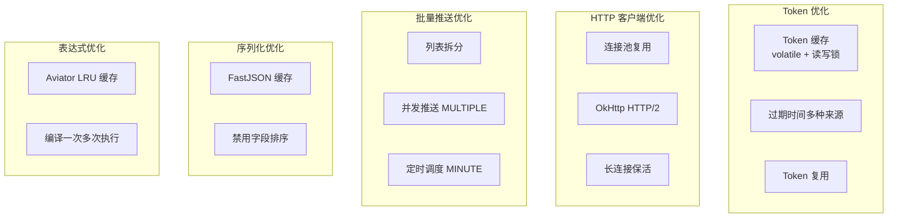
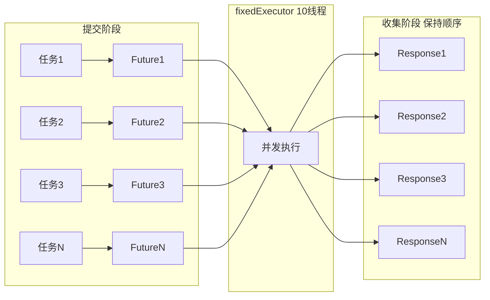

# 性能优化文档

> 本文档汇总 pms-ext-fp 模块的性能优化机制，包括 Token 缓存、连接池、批量推送与限流策略。

---

## 1. 性能优化总览



---

## 2. Token 缓存优化

### 2.1 缓存机制

| 机制 | 实现 | 效果 |
|------|------|------|
| volatile 可见性 | `private static volatile TokenResponse cachedToken` | 多线程立即可见 |
| 读写锁并发 | `ReentrantReadWriteLock(true)` 公平锁 | 读锁并发检查，写锁互斥刷新 |
| 读多写少优化 | 读锁检查缓存，写锁刷新 | 避免每次请求都获取新 Token |

### 2.2 过期时间计算优化

Token 过期时间计算后会**回填到 cachedToken**，避免每次都重新计算：

```java
if (StringUtils.isBlank(expiresOn)) {
    if (cachedToken.getExpiresIn() != null) {
        // 计算并回填
        expiresOn = String.valueOf(timeInMillis / 1000 + expiresIn);
        cachedToken.setExpiresOn(expiresOn);  // 回填
    }
    // ...其他来源
}
```

### 2.3 性能数据（估算）

| 场景 | 无缓存 | 有缓存 |
|------|--------|--------|
| Token 获取 | 每次 HTTP 请求（~100ms） | 内存读取（~0.01ms） |
| 1000 次发票推送 | 1000 次 Token 请求（~100s） | 1 次 Token 请求 + 999 次缓存命中 |

---

## 3. HTTP 连接池优化

### 3.1 连接池配置

| 配置项 | 默认值 | 推荐值（高并发） | 说明 |
|--------|--------|-----------------|------|
| `maxTotal` | 100 | 200 | 连接池最大连接数 |
| `maxPerRoute` | 20 | 50 | 每路由最大连接数 |
| `connectTimeout` | 10000ms | 5000ms | 连接建立超时 |
| `readTimeout` | 60000ms | 30000ms | 响应读取超时 |
| `keepAliveMinutes` | 5 | 5 | 连接保活时间 |
| `followRedirects` | true | true | 是否跟随重定向 |

### 3.2 OkHttp vs Apache HttpClient 性能对比

| 维度 | OkHttp（默认） | Apache HttpClient | Hutool |
|------|----------------|-------------------|--------|
| 连接复用 | ✅ ConnectionPool | ✅ PoolingHttpClientConnectionManager | ❌ 每次新建 |
| HTTP/2 | ✅ 支持 | ❌ 不支持 | ❌ 不支持 |
| 线程模型 | Dispatcher 异步 | 同步阻塞 | 同步阻塞 |
| 内存占用 | 较低 | 较高 | 最低 |
| 推荐场景 | 高并发、HTTP/2 | 兼容性要求高 | 简单场景 |

### 3.3 连接池生命周期管理

```java
// FPApi.destroy() 中回收
@Override
public void destroy() throws Exception {
    scheduler.shutdownNow();      // 调度池
    fixedExecutor.shutdownNow();  // 并发池
    HttpClientPool.close();       // Apache HttpClient
    OkHttpPool.close();           // OkHttp
}
```

> **最佳实践**：确保 Spring 容器正常关闭，触发 `destroy()` 回收连接池，避免连接泄漏。

---

## 4. 批量推送优化

### 4.1 三种限流模式选择

| 模式 | 常量 | 并发度 | 吞吐量 | 适用场景 |
|------|------|--------|--------|----------|
| SINGLE | `FPApi.SINGLE` | 1（同步） | 低 | 请求数少（<10）、无频率限制 |
| MINUTE | `FPApi.MINUTE` | 1（定时） | 中 | 严格频率限制（如 FP 平台限流） |
| MULTIPLE | `FPApi.MULTIPLE` | 10（并发） | 高 | 高吞吐、允许并发 |

### 4.2 MULTIPLE 模式并发优化



**关键优化**：
- 10 线程并发提交，充分利用连接池
- Future 列表保持顺序，结果顺序与请求顺序一致
- 异常包装为 `Response.failure()`，避免阻塞其他任务

### 4.3 rateLimit 配置建议

| FP 平台限制 | rateLimit 值 | 推荐模式 | 说明 |
|-------------|-------------|----------|------|
| 无限制 | 30（默认） | MULTIPLE | 10 线程并发，每秒约 3 次 |
| 30 次/分钟 | 30 | MINUTE | 每分钟 30 次，间隔 2 秒 |
| 10 次/分钟 | 10 | MINUTE | 每分钟 10 次，间隔 6 秒 |
| 100 次/分钟 | 100 | MULTIPLE | 10 线程并发，充分利用 |

### 4.4 列表拆分优化

`splitToList=true` 时，按 `rateLimit` 大小拆分列表，减少请求次数：

```java
// 100 条数据，rateLimit=30，splitToList=true
// 拆分为 4 个子列表：30, 30, 30, 10
// 只需 4 次请求（而非 100 次）
```

---

## 5. 序列化优化

### 5.1 FastJSON 配置优化

FPApi 的 `toJSONString()` 方法禁用了字段排序，提升序列化性能：

```java
int features = JSON.DEFAULT_GENERATE_FEATURE 
    & ~SerializerFeature.SortField.getMask()        // 禁用字段排序
    | SerializerFeature.IgnoreNonFieldGetter.getMask()  // 忽略非字段 getter
    | SerializerFeature.WriteDateUseDateFormat;     // 日期格式化

SerializeConfig serializeConfig = new SerializeConfig(true);
serializeConfig.config(clazz, SerializerFeature.SortField, false);
serializeConfig.config(clazz, SerializerFeature.MapSortField, false);
serializeConfig.config(clazz, SerializerFeature.WriteMapNullValue, false);  // 不输出 null
```

| 优化项 | 效果 |
|--------|------|
| 禁用 SortField | 避免字段名排序开销 |
| 禁用 MapSortField | 避免 Map 排序开销 |
| IgnoreNonFieldGetter | 跳过非字段 getter 方法 |
| WriteMapNullValue=false | 减少 null 字段输出 |
| WriteDateUseDateFormat | 统一日期格式 |

### 5.2 beanToMap 优化

使用 Hutool 的 `BeanUtil.beanToMap(object, false, true)`：
- 参数2 `false`：不忽略 null 属性（保留完整字段）
- 参数3 `true`：忽略错误（转换异常不抛出）

---

## 6. Aviator 表达式优化

### 6.1 表达式缓存

InvoiceUtil 调用的 `AviatorUtils.exceute()` 内部使用 LRU 缓存（容量 100），编译后的表达式会被缓存：

| 场景 | 首次执行 | 后续执行 |
|------|----------|----------|
| 相同表达式 | 编译（~5ms） | 缓存命中（~0.1ms） |
| 不同表达式 | 编译 | 编译 |

### 6.2 表达式编写建议

```aviator
# ✅ 推荐：简单字段判断（快速）
entity.entity.invoice_number != nil

# ✅ 推荐：使用内置函数
string.length(entity.entity.invoice_number) > 0

# ⚠️ 避免：复杂嵌套逻辑（影响编译和执行性能）
entity.entity.identify == true ? (entity.entity.needVerify == false ? true : entity.entity.verified_status == true) : false

# ✅ 改写为：逻辑运算
entity.entity.identify == true && (entity.entity.needVerify == false || entity.entity.verified_status == true)
```

---

## 7. 性能调优建议

### 7.1 高并发场景配置

```java
Map<String, Object> config = new ConcurrentHashMap<>();
// 基础配置
config.put("serviceUrl", "https://fp.example.com/");
config.put("tokenUrl", "/oauth/token?appId=%s");
config.put("archiveUrl", "/api/invoice/archive");

// 连接池优化
Map<String, Object> httpClientConfig = new HashMap<>();
httpClientConfig.put("maxTotal", 200);           // 增大总连接数
httpClientConfig.put("maxPerRoute", 50);         // 增大每路由连接数
httpClientConfig.put("connectTimeout", 5000);    // 缩短连接超时
httpClientConfig.put("readTimeout", 30000);      // 缩短读取超时
httpClientConfig.put("keepAliveMinutes", 5);
config.put("httpClient", httpClientConfig);

// 限流配置
config.put("rateLimit", 50);                     // 提高限流频率
config.put("enableRetry", "true");               // 启用重试

FPApi.initConfig(() -> config);
```

### 7.2 大批量推送建议

```java
// 1000 条发票推送
List<ElectronicInvoiceModel> list = ...;  // 1000 条

Map<String, Object> options = new HashMap<>();
options.put("rateLimit", 30);             // FP 平台限制 30 次/分钟

// ✅ 推荐：使用 MULTIPLE 模式（10 线程并发）
List<Response<ElectronicInvoiceModel>> responses = 
    FPApi.postElectronicInvoice(list, config, options);
// 内部使用 MULTIPLE 模式，10 线程并发，约 100 秒完成

// ⚠️ 不推荐：使用 pushListData + SINGLE 模式
// FPApi.pushListData(list, archiveUrl, 30, config, FPApi.SINGLE, options);
// 单线程同步，约 1000 秒完成
```

### 7.3 性能监控建议

| 监控项 | 监控方式 | 告警阈值 |
|--------|----------|----------|
| Token 获取频率 | 日志统计 `getToken` 调用次数 | >10 次/分钟（可能缓存失效） |
| HTTP 请求耗时 | 日志统计 `requestWithOkHttp` 耗时 | >5 秒 |
| 连接池使用率 | JMX 监控 OkHttp ConnectionPool | >80% |
| 线程池队列长度 | JMX 监控 fixedExecutor 队列 | >100 |
| 重试次数 | 日志统计 `retryRequest` 调用 | >5% 请求量 |

---

## 8. 已知性能问题

| 问题 | 影响 | 临时方案 | 根本解决 |
|------|------|----------|----------|
| getToken 递归调用 | 高并发下可能栈溢出 | 限制并发量 | 改为自旋等待 |
| schedulePushData 同步等待 | MINUTE 模式阻塞调用线程 | 使用 MULTIPLE 模式 | 改为异步回调 |
| sanitizeValue 未实现 | 无性能影响 | - | 按需实现 |
| containsChinese 未使用 | 无性能影响 | - | 可删除 |
| OkHttp maxIdleConnections 语义 | 空闲连接可能被清理 | 增大 maxTotal | 区分配置项 |
