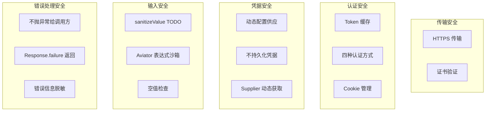
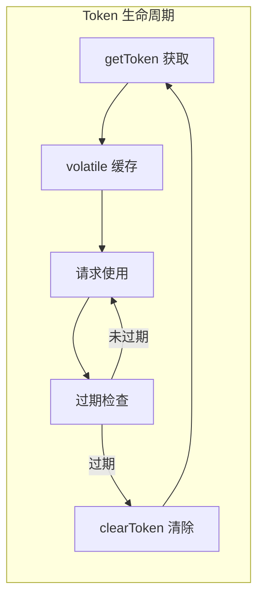

# 安全实践文档

> 本文档汇总 pms-ext-fp 模块的安全实践，包括 HTTPS、Token 安全、凭据管理与输入验证。

---

## 1. 安全架构总览



---

## 2. 传输安全

### 2.1 HTTPS 支持

FPApi 的三种 HTTP 客户端实现均支持 HTTPS：

| 客户端 | HTTPS 支持 | 证书验证 | 说明 |
|--------|-----------|----------|------|
| OkHttp（默认） | ✅ | 默认验证 | 支持 HTTP/2 over HTTPS |
| Apache HttpClient | ✅ | 默认验证 | 通过 PoolingHttpClientConnectionManager |
| Hutool | ✅ | 默认验证 | 基于 HttpURLConnection |

> **最佳实践**：FP 平台地址应使用 HTTPS（`https://`），避免 Token 和发票数据在传输中被窃取。

### 2.2 重定向安全

| 配置项 | 默认值 | 安全建议 |
|--------|--------|----------|
| `followRedirects` | true | 生产环境建议 false，防止重定向到恶意站点 |

---

## 3. Token 安全

### 3.1 Token 缓存安全



**安全机制**：
- Token 存储在 `volatile` 静态字段，仅在内存中，不持久化到磁盘
- 读写锁保护，防止并发刷新导致 Token 不一致
- 过期后立即 `clearToken()`，清除 `cachedToken` 和 `cookieValue`
- 配置变更时 `initConfig()` 会调用 `clearToken()`，确保旧 Token 失效

### 3.2 Token 过期处理

```java
// 过期时间检查
long expiresOnTimeInMillis = Long.parseLong(expiresOn) * 1000;
if (expiresOnTimeInMillis >= Calendar.getInstance().getTimeInMillis()) {
    return cachedToken;  // 未过期，返回缓存
}
// 已过期，继续获取写锁刷新
```

> **安全建议**：FP 平台的 Token 有效期通常为 30-60 分钟，建议配置略短于实际有效期，避免边界时间窗内的请求失败。

### 3.3 重试安全

`retryRequest()` 在重试前会 `clearToken()`，避免使用过期 Token 重试：

```java
public static <T extends Response<E>, E> T retryRequest(...) {
    clearToken();  // 清除可能过期的 Token
    Boolean enableRetry = MapUtil.getBool(config, "enableRetry", false);
    Boolean retried = MapUtil.getBool(options, "retried", false);
    if (enableRetry && !retried) {
        options.put("retried", true);  // 标记已重试，防止无限递归
        return request(method, url, request, isForm, needAuth, options);
    }
    // ...
}
```

---

## 4. 认证方式安全

### 4.1 四种认证方式对比

| authType | 安全等级 | 风险 | 建议 |
|----------|---------|------|------|
| `header` | 高 | Token 在 Header 中传输，不易泄露 | ✅ 推荐使用 |
| `bearer` | 高 | Bearer Token 在 form 字段中 | ✅ 可接受 |
| `query` | 低 | Token 出现在 URL 中，可能被日志记录 | ⚠️ 不推荐 |
| `cookie` | 中 | 依赖 Cookie 安全策略 | ⚠️ 需配合 Cookie 安全属性 |

### 4.2 query 方式的安全风险

```java
// query 方式会将 Token 拼接到 URL
url = url + "?" + authKey + "=" + accessToken;
```

**风险**：
- URL 可能被 Web 服务器日志记录
- URL 可能被浏览器历史记录保存
- URL 可能通过 Referer 头泄露给第三方

**缓解措施**：
- 确保 FP 平台地址使用 HTTPS
- 配置日志脱敏，避免记录完整 URL
- 优先使用 `header` 方式

### 4.3 Cookie 安全

当 `enableCookie=true` 时：

```java
if (Boolean.parseBoolean(enableCookie) && StringUtils.isNotBlank(cookieKey)) {
    cookieValue = getCookieValue(tokenResponse, cookieKey);
}
```

**安全建议**：
- Cookie 应设置 `HttpOnly` 和 `Secure` 属性（由 FP 平台控制）
- `cookieValue` 与 `cachedToken` 同生命周期，过期后同步清除
- 避免在日志中输出 `cookieValue`

---

## 5. 凭据管理安全

### 5.1 动态配置供应

pms-ext-fp 采用 `Supplier`/`Function` 动态配置供应，**不硬编码任何凭据**：

```java
// ✅ 安全：动态供应
FPApi.initConfig(() -> {
    Map<String, Object> config = new ConcurrentHashMap<>();
    // 从安全配置中心或加密的数据库读取
    config.put("appId", secureConfigService.get("fp.appId"));
    config.put("clientSecret", secureConfigService.get("fp.clientSecret"));
    return config;
});

// ❌ 不安全：硬编码
FPApi.initConfig(() -> {
    Map<String, Object> config = new ConcurrentHashMap<>();
    config.put("appId", "myAppId123");        // 硬编码
    config.put("clientSecret", "secret456");  // 硬编码
    return config;
});
```

### 5.2 凭据字段清单

以下字段属于敏感凭据，不应出现在日志或异常信息中：

| 字段 | 敏感等级 | 说明 |
|------|---------|------|
| `clientSecret` | 高 | 客户端密钥 |
| `clientId` | 中 | 客户端 ID |
| `appId` | 中 | 应用 ID |
| `cachedToken.accessToken` | 高 | 访问令牌 |
| `cookieValue` | 高 | Cookie 值 |
| `authValue` | 高 | 认证值 |

### 5.3 日志安全

FPApi 的日志方法受 `config.debug` 控制：

```java
public static void log(String format, Object... arguments) {
    Map<String, Object> config = getConfig();
    boolean debug = Boolean.parseBoolean(String.valueOf(config.getOrDefault("debug", false)));
    if (debug) {
        logger.debug(format, arguments);  // 仅 debug=true 时输出
    }
}
```

**安全建议**：
- 生产环境设置 `debug=false`，避免输出敏感信息
- 日志中避免直接输出 `request` 对象（可能包含 Token）
- `logInfo` 方法始终输出 INFO 级别，确保其中不含敏感信息

---

## 6. 输入验证安全

### 6.1 sanitizeValue（未实现）

```java
private static String sanitizeValue(Object value) {
    if (value == null) {
        return "";
    }
    if (value instanceof String) {
        return value.toString();
    }
    // TODO: 进行适当的清理和验证，例如转义特殊字符
    return JSON.toJSONString(value);
}
```

> **风险**：`sanitizeValue` 方法标注 TODO，目前未实现特殊字符转义。虽然该方法未被调用，但存在被误用的风险。

### 6.2 空值检查

FPApi 在关键路径进行了空值检查：

| 检查点 | 检查内容 | 失败处理 |
|--------|----------|----------|
| `request()` 入口 | `url == null \|\| url.length() == 0` | 返回空 Response，message="没有指定URL！" |
| `postElectronicInvoice` | `files == null \|\| files.isEmpty()` | 返回 `Collections.emptyList()` |
| `pushData` | `list == null \|\| list.isEmpty()` | 返回 `Collections.emptyList()` |
| `pushData` 单条 | `data == null` | 返回空 Response |
| `form(String, Object)` | `name == null \|\| value == null` | 忽略，返回 this |
| `form(String, File)` | `file.exists()` | 不存在的文件被忽略 |

### 6.3 Aviator 表达式沙箱

InvoiceUtil 使用 AviatorUtils 执行配置中的表达式，Aviator 引擎本身提供沙箱保护：

| 安全特性 | 说明 |
|----------|------|
| 不直接执行 Java 代码 | Aviator 表达式不能直接调用任意 Java 方法 |
| FunctionMissing 反射限制 | 仅反射调用静态方法，且参数类型需匹配 |
| 表达式来源可控 | 表达式来自配置（configSupplier），非用户输入 |

> **风险**：`JavaMethodReflectionFunctionMissing` 允许反射调用 JDK 静态方法（如 `Math.max`），若表达式来源不可控，可能被构造恶意表达式。确保 `invoiceTypeCondition`/`invoiceStatusCondition` 配置来源可信。

---

## 7. 错误处理安全

### 7.1 不抛出异常给调用方

FPApi 的所有错误场景通过 `Response.failure()` 返回，**不抛出异常**：

| 错误场景 | 处理方式 | 安全性 |
|----------|----------|--------|
| URL 为空 | `Response.message("没有指定URL！")` | ✅ 不泄露内部信息 |
| 响应非 JSON | `Response.message("响应内容不是Json格式！..." + substring(body, 0, 255))` | ⚠️ 可能泄露响应片段 |
| 反序列化异常 | `Response.message("反序列化发生异常！错误信息：" + e.getMessage())` | ⚠️ 可能泄露异常详情 |
| 请求超时 | `Response.failure("请求超时", responseType)` | ✅ 不泄露内部信息 |
| 队列已满 | `Response.failure("当前系统繁忙，请稍候再试！", responseType)` | ✅ 不泄露内部信息 |
| 推送异常 | `Response.failure(e.getMessage(), responseType)` | ⚠️ 可能泄露异常详情 |

### 7.2 安全建议

```java
// ⚠️ 当前：异常信息可能泄露
response = Response.failure(e.getMessage(), responseType);

// ✅ 建议：脱敏后返回
String safeMessage = sanitizeErrorMessage(e.getMessage());
response = Response.failure(safeMessage, responseType);
```

---

## 8. 安全检查清单

### 8.1 部署前检查

| 检查项 | 检查方法 | 通过标准 |
|--------|----------|---------|
| HTTPS 配置 | 检查 `serviceUrl` | 以 `https://` 开头 |
| 凭据存储 | 检查配置来源 | 非硬编码，来自安全配置中心 |
| debug 关闭 | 检查 `config.debug` | 生产环境为 `false` |
| followRedirects | 检查 `httpClient.followRedirects` | 生产环境建议 `false` |
| Token 有效期 | 检查 FP 平台 Token 有效期 | <1 小时 |
| 连接池配置 | 检查 `maxTotal`/`maxPerRoute` | 符合并发需求 |

### 8.2 运行时监控

| 监控项 | 告警条件 | 处理方式 |
|--------|----------|----------|
| Token 获取频率 | >10 次/分钟 | 检查 Token 缓存是否失效 |
| 认证失败率 | >5% | 检查凭据是否过期 |
| 重试次数 | >5% 请求量 | 检查 FP 平台可用性 |
| 异常响应率 | >10% | 检查网络和 FP 平台状态 |
| 连接池耗尽 | 连接池使用率 >90% | 增大 maxTotal 或降低并发 |

---

## 9. 已知安全风险

| 风险 | 严重程度 | 现状 | 建议 |
|------|---------|------|------|
| query 认证方式 Token 暴露在 URL | 中 | 可配置 | 优先使用 header 方式 |
| 错误信息可能泄露异常详情 | 低 | `e.getMessage()` 直接返回 | 脱敏处理 |
| sanitizeValue 未实现 | 低 | 未被调用 | 按需实现或删除 |
| Aviator 表达式来源 | 中 | 来自配置 | 确保配置来源可信 |
| pom.xml 拼写错误 | 低 | `${project.name}}` | 修复为 `${project.name}` |
| 日志可能输出请求体 | 中 | `log("请求：{}", request)` | debug=false 时安全 |
