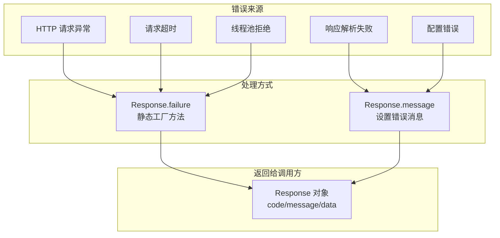
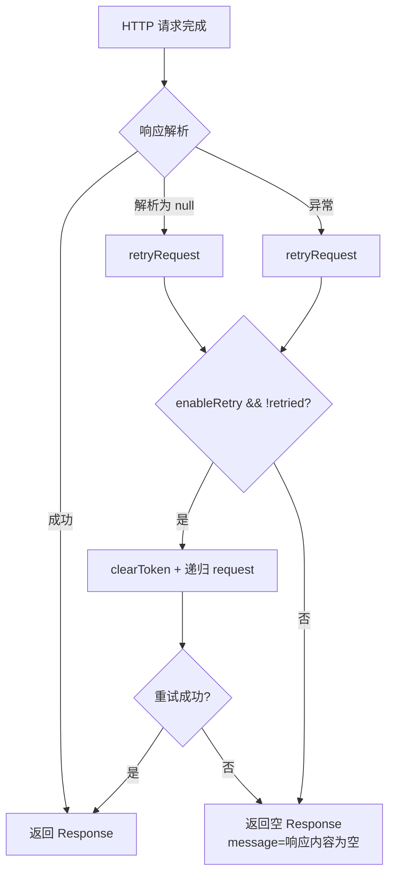

# 错误码定义文档

> 本文档定义 pms-ext-fp 模块的错误码体系，包括 Response.failure 错误消息、HTTP 状态码和 Token 错误码。

---

## 1. 错误处理机制

pms-ext-fp 模块**不使用自定义异常类**（不存在 FPException），所有错误通过 `Response` 对象返回：



---

## 2. Response 成功码

### 2.1 成功码定义

```java
private static final Integer[] SUCCESS_CODE = new Integer[] {0, 200};
```

### 2.2 成功判断逻辑

```java
public boolean isSuccess() {
    return Boolean.TRUE.equals(getIsSuccess()) || this.code != null && Arrays.asList(SUCCESS_CODE).contains(this.code);
}
```

| 判断条件 | 结果 | 说明 |
|----------|------|------|
| `isSuccess == true` | 成功 | FP 平台显式返回成功标志 |
| `code == 0` 或 `code == 200` | 成功 | FP 平台返回码 0 或 200（SUCCESS_CODE） |
| 其他 | 失败 | code 为 null 或其他值 |

> **注意**：`SUCCESS_CODE` 为 `Integer[] {0, 200}`（含 0 与 200 两个成功码）。源码 `Response.java` 第 22 行定义为数组形式。

---

## 3. Response.failure 错误消息

### 3.1 错误消息清单

| 错误消息 | 触发场景 | 触发位置 | 严重程度 |
|----------|----------|----------|----------|
| `没有指定URL！` | URL 为空或长度为 0 | `requestWithHutool`/`requestWithPool`/`requestWithOkHttp` | 高 |
| `响应内容为空！` | 响应解析为 null 且重试失败 | `retryRequest` | 中 |
| `响应内容不是Json格式！{body片段}` | 响应体非 JSON 格式 | `requestWith*` catch 块 | 中 |
| `反序列化发生异常！错误信息：{e.getMessage()}` | JSON 反序列化异常 | `requestWith*` catch 块 | 中 |
| `请求超时` | MULTIPLE 模式下 future.get 超时 | `multiplePushData` | 中 |
| `当前系统繁忙，请稍候再试！` | 线程池队列满（RejectedExecutionException） | `multiplePushData` | 中 |
| `{e.getMessage()}` | 推送异常（非超时、非拒绝） | `multiplePushData` | 中 |
| `Error pushing data` | 调度推送异常 | `schedulePushData` | 高 |

### 3.2 failure 方法签名

```java
// 基础版本
public static <T> Response<T> failure(String message) {
    return new Response<T>().message(message);
}

// 指定 Type
public static <T, R extends Response<T>> R failure(String message, Type responseType) {
    // 若 responseType 为 Class，委托给 Class 版本
    // 否则返回 new Response<T>().message(message)
}

// 指定 Class
public static <T, R extends Response<T>> R failure(String message, Class<R> responseClass) {
    // 反射创建 responseClass 实例，设置 message
    // 反射失败则 JSON.parseObject("{}", responseClass)
}
```

---

## 4. HTTP 状态码

### 4.1 FPApi 处理的 HTTP 状态码

FPApi **不直接处理 HTTP 状态码**，而是将响应体解析为 `Response` 对象。HTTP 状态码的影响体现在响应体内容：

| HTTP 状态码 | 典型响应体 | FPApi 处理结果 |
|-------------|-----------|---------------|
| 200 | JSON 响应 | 解析为 Response，检查 code/isSuccess |
| 200 | 非 JSON 响应 | `message="响应内容不是Json格式！..."` |
| 401 | JSON 错误（Token 过期） | 解析为 Response，code 非 0/200，isSuccess=false |
| 401 | HTML 登录页 | `message="响应内容不是Json格式！..."` |
| 404 | HTML 404 页 | `message="响应内容不是Json格式！..."` |
| 500 | JSON 错误 | 解析为 Response，code 非 0/200 |
| 500 | HTML 错误页 | `message="响应内容不是Json格式！..."` |
| 超时 | 无响应 | `message="请求超时"`（MULTIPLE 模式） |
| 连接拒绝 | 无响应 | `message="反序列化发生异常！错误信息：..."` |

### 4.2 重试触发条件



---

## 5. Token 错误码

### 5.1 TokenResponse 错误字段

| 字段 | JSON 名称 | 说明 |
|------|-----------|------|
| `error` | `error` | 错误标识（如 `invalid_client`、`invalid_grant`） |
| `errorDescription` | `error_description` | 错误描述 |
| `errorCodes` | `error_codes` | 错误码列表 |
| `errorUri` | `error_uri` | 错误说明 URI |

### 5.2 常见 Token 错误

| error 值 | 含义 | 可能原因 | 解决方案 |
|----------|------|----------|----------|
| `invalid_client` | 客户端无效 | appId/clientId 错误 | 检查 appId 配置 |
| `invalid_grant` | 授权无效 | provider/openId 错误 | 检查 provider/openId 配置 |
| `invalid_request` | 请求无效 | 参数缺失 | 检查 TokenRequest 参数 |
| `unauthorized_client` | 客户端未授权 | 客户端无权限 | 联系 FP 平台管理员 |
| `unsupported_grant_type` | 不支持的授权类型 | grantType 错误 | 检查 grantType 配置 |
| `invalid_scope` | 无效的 scope | resource 配置错误 | 检查 resource 配置 |

### 5.3 Token 有效性判断

```java
TokenResponse token = FPApi.getToken();
if (token.getError() != null) {
    // Token 获取失败
    String errorMsg = String.format("Token错误: %s - %s", 
        token.getError(), token.getErrorDescription());
} else if (token.getAccessToken() == null) {
    // Token 无效
    String errorMsg = "Token获取失败：accessToken为空";
} else {
    // Token 有效
    // 使用 token.getAccessToken() 调用 API
}
```

---

## 6. 业务错误码

### 6.1 FP 平台响应码

FP 平台的响应通过 `Response.code` 字段返回业务错误码：

| code 值 | 含义 | 处理方式 |
|---------|------|----------|
| 0 | 成功 | `isSuccess()` 返回 true（SUCCESS_CODE 之一） |
| 200 | 成功 | `isSuccess()` 返回 true（SUCCESS_CODE 之一） |
| 其他 | 失败 | `isSuccess()` 返回 false，查看 `message` |

> **注意**：`SUCCESS_CODE` 为 `Integer[] {0, 200}`。`isSuccess()` 的判断逻辑为 `Boolean.TRUE.equals(getIsSuccess()) || this.code != null && Arrays.asList(SUCCESS_CODE).contains(this.code)`，即 `isSuccess` 为 true 或 `code` 为 0/200 时均视为成功。

### 6.2 ElectronicInvoiceResponse 错误处理

```java
ElectronicInvoiceResponse response = FPApi.postElectronicInvoice(model, config, options);
if (response.isSuccess()) {
    // 成功，处理 response.getData()
    List<InvoiceProviderInfo> data = response.getData();
} else {
    // 失败，查看错误信息
    Integer code = response.getCode();
    String message = response.getMessage();
    log.error("发票推送失败: code={}, message={}", code, message);
}
```

---

## 7. 错误处理最佳实践

### 7.1 调用方错误处理模板

```java
public void pushInvoice(ElectronicInvoiceModel model) {
    ElectronicInvoiceResponse response = FPApi.postElectronicInvoice(model, null, null);
    
    if (response == null) {
        log.error("发票推送返回 null");
        throw new BusinessException("发票推送异常：返回 null");
    }
    
    if (!response.isSuccess()) {
        String errorMsg = String.format("发票推送失败: code=%s, message=%s", 
            response.getCode(), response.getMessage());
        log.error(errorMsg);
        throw new BusinessException(errorMsg);
    }
    
    // 成功处理
    List<InvoiceProviderInfo> data = response.getData();
    if (data == null || data.isEmpty()) {
        log.warn("发票推送成功但无数据返回");
    }
}
```

### 7.2 批量推送错误处理

```java
public void batchPushInvoices(List<ElectronicInvoiceModel> list) {
    List<Response<ElectronicInvoiceModel>> responses = 
        FPApi.postElectronicInvoice(list, config, options);
    
    int success = 0, failure = 0;
    for (int i = 0; i < responses.size(); i++) {
        Response<ElectronicInvoiceModel> resp = responses.get(i);
        if (resp.isSuccess()) {
            success++;
        } else {
            failure++;
            log.error("第{}条发票推送失败: code={}, message={}", 
                i + 1, resp.getCode(), resp.getMessage());
        }
    }
    log.info("批量推送完成: 成功{}条, 失败{}条", success, failure);
}
```

---

## 8. 错误码速查表

| 错误场景 | 错误来源 | 错误内容 | 检查方向 |
|----------|----------|----------|----------|
| Token 获取失败 | TokenResponse.error | `invalid_client` 等 | 检查 appId/clientId |
| Token 过期 | retryRequest | `响应内容为空！` | 检查 Token 有效期 |
| URL 未配置 | requestWith* | `没有指定URL！` | 检查 archiveUrl/serviceUrl |
| FP 平台返回 HTML | requestWith* | `响应内容不是Json格式！` | 检查 URL 和 Token |
| 网络超时 | multiplePushData | `请求超时` | 检查网络和 readTimeout |
| 线程池满 | multiplePushData | `当前系统繁忙，请稍候再试！` | 降低并发量 |
| 调度异常 | schedulePushData | `Error pushing data` | 检查 FP 平台连接 |
| 反序列化失败 | requestWith* | `反序列化发生异常！` | 检查 responseType 配置 |
| Aviator 异常 | InvoiceUtil | `e.printStackTrace()` | 检查表达式语法 |
| 配置未初始化 | getConfig | 返回空 Map | 检查 initConfig 调用 |

---

## 9. 不存在的错误码（澄清）

> **重要**：以下错误码/异常在现有文档中被提及，但**实际源码中并不存在**：

| 错误码/异常 | 文档中出现位置 | 实际情况 |
|------------|---------------|----------|
| `FPException` 自定义异常 | fp-integration.md、coding-standards.md、code-examples.md | **不存在**，错误通过 Response.failure() 处理 |
| `FPException(500, message)` 错误码 500 | coding-standards.md | **不存在** |
| `response.getCode() == "200"` 字符串比较 | code-examples.md | **错误**，code 是 Integer 类型，且 200 是成功码 |
