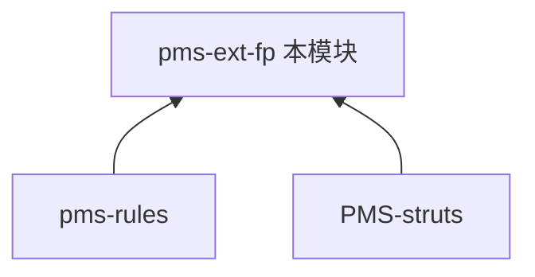

# pms-ext-fp 模块知识库

> DPtech PMS **FP（财务平台）集成扩展模块**。提供电子发票推送与本地发票识别判断能力。本知识库独立维护。

---

## 模块定位

| 项 | 值 |
|----|----|
| 目录 | `PMS/pms-ext-fp/` |
| artifactId | `pms-ext-fp` |
| 基础包 | `com.dp.plat.pms.extend.fp` |
| 打包类型 | jar |
| 职责 | 电子发票推送（至 FP 平台）、发票类型/状态判断（Aviator 表达式）、Token 管理 |

### 依赖关系

> pms-ext-fp 依赖 pms-rules（规则引擎）进行发票相关业务规则计算，并依赖 PMS-struts（共享 `com.dp.plat.util.AviatorUtils`）。PMS-struts 通过 pms-rules 间接关联 pms-ext-fp。

---

## 文档目录

| 章节 | 内容 |
|------|------|
| [01-architecture](01-architecture/) | FP 集成架构 |
| [02-modules](02-modules/) | FP 集成功能说明 |
| [03-database](03-database/) | 数据库概览 |
| [04-mapping](04-mapping/) | 功能-表 CRUD 矩阵 |
| [05-standards](05-standards/) | 编码规范 |
| [06-reference](06-reference/) | 代码示例 |

---

## 跨库知识共享

- 规则引擎：[pms-rules](../../pms-rules/docs/README.md)
- 调用方：[PMS-struts](../../PMS-struts/docs/README.md)
- 转包发票任务：[PMS-struts 转包文档](../../PMS-struts/docs/02-modules/subcontract.md)
