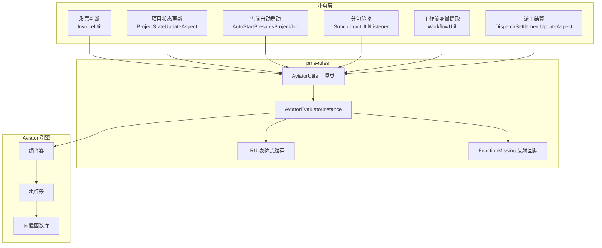
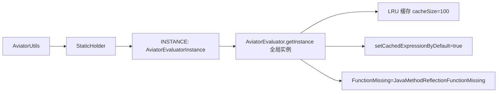
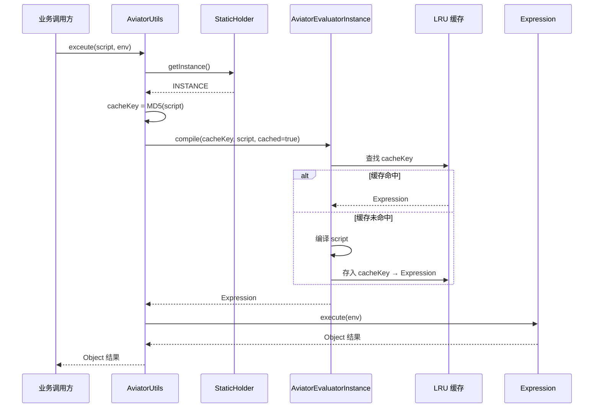
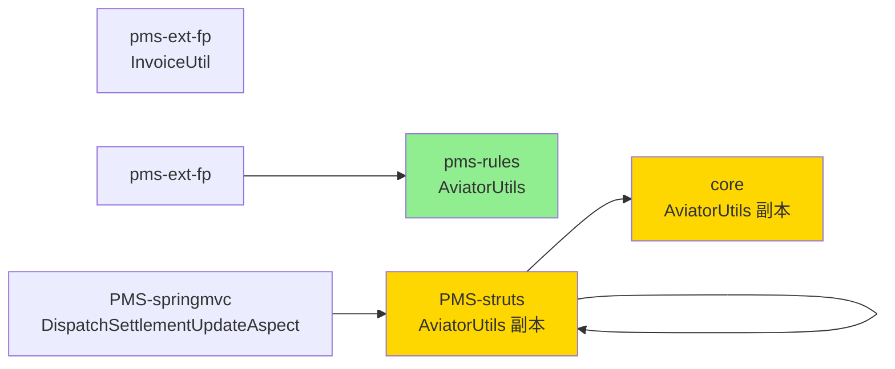

# Aviator 表达式引擎架构

> 本文档详细描述 pms-rules 模块中 Aviator 表达式引擎的架构、表达式语法、内置函数、自定义函数扩展和求值机制。

---

## 1. 引擎概述

pms-rules 模块采用 [Aviator](https://github.com/killme2008/aviatorscript) 5.4.3 作为表达式引擎。Aviator 是一个高性能、轻量级的 Java 表达式求值器，主要特点：

- **轻量级**：JAR 包约 700KB，无第三方运行时依赖
- **高性能**：编译期优化，支持表达式缓存
- **类型动态**：支持数字类型自动提升（long → double → BigInteger → BigDecimal）
- **可扩展**：支持自定义函数、函数缺失回调
- **安全可控**：不直接执行任意 Java 代码，通过 `FunctionMissing` 反射调用受控

### 1.1 在 PMS 中的定位



---

## 2. 实例化架构

AviatorUtils 采用 **静态内部类持有者（Holder）模式** 实现单例，保证线程安全的延迟初始化。



### 2.1 关键配置项

| 配置项 | 值 | 说明 |
|--------|-----|------|
| `useLRUExpressionCache` | `100` | LRU 缓存容量，默认 100 条编译后的表达式 |
| `setCachedExpressionByDefault` | `true` | 默认开启表达式缓存 |
| `setFunctionMissing` | `JavaMethodReflectionFunctionMissing` | 函数缺失时通过反射调用 Java 静态方法 |

### 2.2 FunctionMissing 反射机制

`JavaMethodReflectionFunctionMissing.getInstance()` 是 Aviator 的扩展点。当表达式中调用的函数未注册时，引擎会通过反射在 Java 类中查找匹配的静态方法。这使得表达式中可直接调用 JDK 静态方法：

```java
// 表达式中可直接使用
"Math.max(a, b)"          // 反射调用 java.lang.Math.max
"Math.round(a)"           // 反射调用 java.lang.Math.round
"StringUtils.isBlank(s)"  // 反射调用 org.apache.commons.lang3.StringUtils.isBlank
```

> **注意**：反射调用仅支持静态方法，且参数类型需匹配。该机制带来灵活性，但也存在性能开销和安全风险（详见 `05-standards/security-practices.md`）。

---

## 3. 求值机制

### 3.1 执行流程



### 3.2 缓存 Key 生成

pms-rules 版本使用 Spring 的 `DigestUtils.md5DigestAsHex` 生成缓存键：

```java
String cacheKey = DigestUtils.md5DigestAsHex(script.getBytes());
```

> **注意**：三处重复定义的 AviatorUtils 使用了不同的 MD5 实现（详见 `dependency-analysis.md`），但生成的 Key 语义一致。

### 3.3 编译与执行分离

Aviator 支持「编译一次，多次执行」模式。`AviatorUtils.getInstance().compile(script)` 返回的 `Expression` 对象可重复执行：

```java
// 编译一次
Expression compiled = AviatorUtils.getInstance().compile(expressionText);
// 获取表达式引用的变量名
List<String> vars = compiled.getVariableNames();
// 多次执行
Object r1 = compiled.execute(env1);
Object r2 = compiled.execute(env2);
```

`WorkflowUtil.java` 中使用了此模式提取工作流多实例节点的完成条件变量名。

---

## 4. 表达式语法

### 4.1 运算符

| 类别 | 运算符 | 示例 |
|------|--------|------|
| 算术 | `+ - * / %` | `price * quantity` |
| 比较 | `> >= < <= == !=` | `age >= 18` |
| 逻辑 | `&& \|\| !` | `a && b \|\| !c` |
| 位运算 | `& \| ^ ~ << >>` | `flags & 0x01` |
| 三元 | `? :` | `a > b ? a : b` |
| 范围 | `..` | `[1..10]` |
| 索引 | `[]` | `list[0]`、`map["key"]` |
| 成员访问 | `.` | `entity.name` |

### 4.2 变量引用

Aviator 中变量直接通过名称引用，从 `env` Map 中查找：

```java
// 表达式
"price * quantity"
// 等价于 env.get("price") * env.get("quantity")
```

变量名支持字母、数字、下划线，且不能以数字开头。中文变量名需使用反引号包裹：

```
`价格` * `数量`
```

### 4.3 集合操作

```java
// List 创建
[1, 2, 3, 4, 5]
// Map 创建
{"name": "张三", "age": 25}
// 范围 List
[1..10]   // [1, 2, 3, ..., 10]
// 索引访问
list[0]
map["key"]
map.key
// seq 库函数
seq.count(list)        // 元素个数
seq.contains(list, 3)  // 是否包含
seq.map(list, lambda)  // 映射
```

### 4.4 条件表达式

```java
// 三元运算
"score >= 90 ? 'A' : (score >= 60 ? 'B' : 'C')"

// 逻辑组合
"status == 'approved' && amount > 1000"
```

### 4.5 Lambda 表达式

```java
// Aviator 5.x 支持 lambda
"lambda(x) -> x * 2 end"
// 配合 seq.map 使用
"seq.map([1, 2, 3], lambda(x) -> x * x end)"
```

---

## 5. 内置函数

Aviator 5.4.3 提供丰富的内置函数库。以下列出 PMS 业务中可能用到的函数：

### 5.1 数学函数

| 函数 | 说明 | 示例 |
|------|------|------|
| `Math.max(a, b)` | 最大值（反射调用） | `Math.max(3, 5)` → 5 |
| `Math.min(a, b)` | 最小值 | `Math.min(3, 5)` → 3 |
| `Math.round(a)` | 四舍五入 | `Math.round(3.6)` → 4 |
| `Math.abs(a)` | 绝对值 | `Math.abs(-3)` → 3 |

### 5.2 字符串函数

| 函数 | 说明 | 示例 |
|------|------|------|
| `string.contains(s, sub)` | 是否包含 | `string.contains("hello", "ell")` → true |
| `string.startsWith(s, prefix)` | 前缀判断 | `string.startsWith("hello", "he")` → true |
| `string.endsWith(s, suffix)` | 后缀判断 | `string.endsWith("hello", "lo")` → true |
| `string.substring(s, start)` | 子串 | `string.substring("hello", 1)` → "ello" |
| `string.length(s)` | 长度 | `string.length("hello")` → 5 |
| `string.split(s, regex)` | 分割 | `string.split("a,b,c", ",")` → ["a","b","c"] |
| `string.join(s1, s2)` | 拼接 | `string.join("你好, ", "张三")` → "你好, 张三" |

### 5.3 集合函数（seq 库）

| 函数 | 说明 | 示例 |
|------|------|------|
| `seq.count(coll)` | 元素个数 | `seq.count([1,2,3])` → 3 |
| `seq.contains(coll, item)` | 是否包含 | `seq.contains([1,2,3], 2)` → true |
| `seq.map(coll, fn)` | 映射 | — |
| `seq.filter(coll, fn)` | 过滤 | — |
| `seq.reduce(coll, fn, init)` | 归约 | — |
| `seq.sort(coll)` | 排序 | — |

### 5.4 类型判断函数

> ⚠️ **避坑提示**：Aviator 5.4.3 **不存在** `is_nil(x)` 函数（nil 通过 `x == nil` 运算符判断），也**不存在** `typeof(x)` 函数（`typeof` 是 JavaScript 运算符，Aviator 使用 `type(x)`）。本模块 aviator-syntax.md 已明确声明此差异。

| 函数/运算符 | 说明 |
|------|------|
| `x == nil` | 判断是否为 nil（运算符，非函数） |
| `is_def(x)` | 是否已定义 |
| `type(x)` | 类型名 |
| `is_a(x, type)` | 是否为指定类型 |

---

## 6. 自定义函数扩展

### 6.1 注册自定义函数

通过 `AviatorUtils.getInstance().addFunction()` 注册自定义函数：

```java
import com.googlecode.aviator.runtime.function.AbstractFunction;
import com.googlecode.aviator.runtime.type.AviatorObject;
import com.googlecode.aviator.runtime.type.AviatorString;

AviatorUtils.getInstance().addFunction(new AbstractFunction() {
    @Override
    public String getName() {
        return "myFunc";
    }
    
    @Override
    public AviatorObject invoke(Map<String, Object> env, AviatorObject... args) {
        String arg1 = (String) args[0].getValue(env);
        return new AviatorString("结果: " + arg1);
    }
});

// 调用
Object result = AviatorUtils.exceute("myFunc('test')", new HashMap<>());
```

### 6.2 PMS 中的自定义函数现状

当前 PMS 代码库中未发现通过 `addFunction` 注册业务自定义函数的代码。业务表达式中使用的函数主要依赖：

1. Aviator 内置函数（`string.*`、`seq.*`、`Math.*` 等）
2. `JavaMethodReflectionFunctionMissing` 反射调用的 Java 静态方法

---

## 7. 线程安全

### 7.1 AviatorEvaluatorInstance 线程安全

`AviatorEvaluatorInstance` 本身是线程安全的，其内部的表达式缓存使用并发安全的数据结构。多个线程可并发调用 `compile` 和 `execute`。

### 7.2 AviatorUtils 线程安全分析

| 成员 | 线程安全 | 说明 |
|------|----------|------|
| `cacheSize` | **不安全** | `private static int`，非 volatile，`setCacheSize` 写操作无同步 |
| `StaticHolder.INSTANCE` | **不安全** | `resetAviator` 中重新赋值无同步，可能读到部分构造对象 |
| `getInstance()` | 安全 | 静态内部类初始化由 JVM 保证 |
| `exceute()` | 安全 | 无共享可变状态，依赖 AviatorEvaluatorInstance 的线程安全 |

> **风险**：`resetAviator()` 在运行期被调用可能导致短暂的不一致。建议仅在初始化阶段调用 `setCacheSize`，避免运行期重置。详见 `05-standards/performance-optimization.md`。

---

## 8. 与其他模块的关系



> **注意**：三处 AviatorUtils 重复定义，详见 `dependency-analysis.md`。pms-ext-fp 依赖 pms-rules 模块，而 PMS-struts 和 PMS-springmvc 使用各自 classpath 内的副本。
