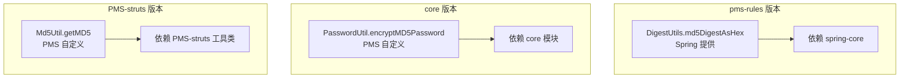
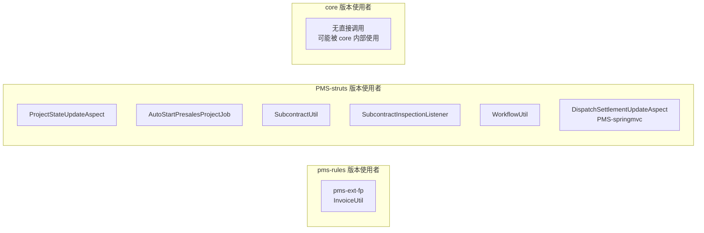
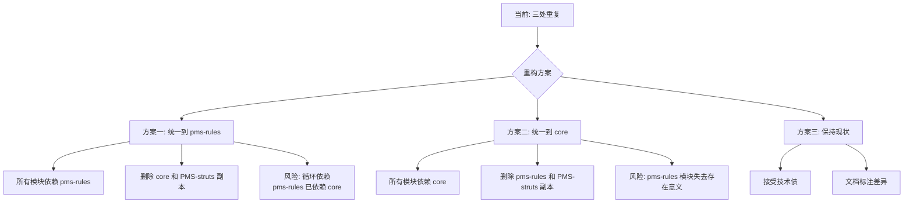
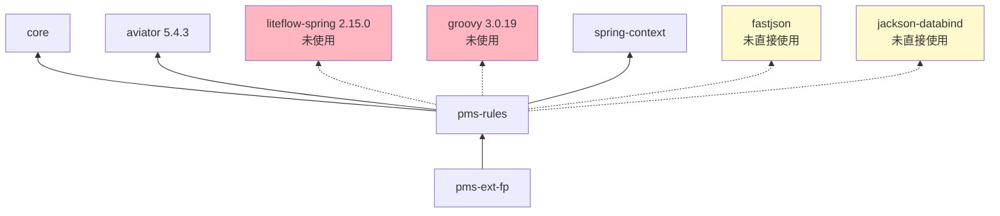

# 依赖分析

> 本文档分析 pms-rules 模块 `pom.xml` 中声明的所有依赖，重点说明 LiteFlow 和 Groovy 声明但未使用的情况，以及 AviatorUtils 三处重复定义的差异。

---

## 1. 依赖清单

### 1.1 pom.xml 声明的依赖

| 依赖 | groupId:artifactId | 版本 | scope | 实际使用 |
|------|---------------------|------|-------|----------|
| Aviator | `com.googlecode.aviator:aviator` | 5.4.3（父 pom 管理） | compile | ✅ 使用 |
| LiteFlow | `com.yomahub:liteflow-spring` | 2.15.0（父 pom 管理） | compile | ❌ 未使用 |
| Groovy | `org.codehaus.groovy:groovy` | 3.0.19 | compile | ❌ 未使用 |
| Spring Context | `org.springframework:spring-context` | 父 pom 管理 | compile | ✅ 使用（DigestUtils 间接） |
| Fastjson | `com.alibaba:fastjson` | 父 pom 管理 | compile | ⚠️ 未直接使用 |
| Jackson | `com.fasterxml.jackson.core:jackson-databind` | 父 pom 管理 | compile | ⚠️ 未直接使用 |
| Mockito | `org.mockito:mockito-inline` | 4.11.0 | test | ⚠️ 无测试代码 |
| Lombok | `org.projectlombok:lombok` | 1.18.24 | compile | ⚠️ 未使用（AviatorUtils 无注解） |

### 1.2 父 pom 版本管理

```xml
<!-- PMS/pom.xml -->
<aviator.version>5.4.3</aviator.version>
<liteflow.version>2.15.0</liteflow.version>
```

---

## 2. 僵尸依赖分析

### 2.1 LiteFlow（liteflow-spring 2.15.0）

**状态**：声明但未使用

**验证方法**：在 pms-rules 源码中搜索 LiteFlow 相关 API：

```
搜索关键词：liteflow, LiteflowResponse, FlowExecutor, NodeComponent, @LiteflowComponent
结果：pms-rules 模块中无任何匹配
```

**LiteFlow 典型使用方式（本模块未出现）**：

```java
// 1. 规则节点定义（本模块无）
@Component("projectRuleNode")
public class ProjectRuleNode extends NodeComponent {
    @Override
    public void process() { ... }
}

// 2. 规则链执行（本模块无）
FlowExecutor executor = ...;
LiteflowResponse response = executor.execute2Resp("ruleChain", context);
```

**可能引入原因**：
- 规划阶段预留的规则编排能力，最终未落地
- 误从其他项目模板复制

**影响**：
- 增加打包体积（liteflow-spring 及其传递依赖约 2MB）
- 引入不必要的传递依赖（如 Netty、Spring Boot 等）
- 增加安全扫描面

### 2.2 Groovy（groovy 3.0.19）

**状态**：声明但未使用

**验证方法**：在 pms-rules 源码中搜索 Groovy 相关 API：

```
搜索关键词：groovy, GroovyShell, GroovyClassLoader, GroovyObject, CompilerConfiguration
结果：pms-rules 模块中无任何匹配
```

**Groovy 典型使用方式（本模块未出现）**：

```java
// 1. GroovyShell 执行脚本（本模块无）
GroovyShell shell = new GroovyShell();
Object result = shell.evaluate(script);

// 2. GroovyClassLoader 动态编译（本模块无）
GroovyClassLoader loader = new GroovyClassLoader();
Class<?> clazz = loader.parseClass(script);
```

**可能引入原因**：
- 规划阶段预留的动态脚本能力，最终被 Aviator 替代
- 误从其他项目模板复制

**影响**：
- 增加打包体积（groovy JAR 约 7MB）
- Groovy 历史存在多个 CVE（如 CVE-2020-17521），增加安全风险

### 2.3 其他未充分使用的依赖

| 依赖 | 声明用途 | 实际情况 |
|------|----------|----------|
| `fastjson` | JSON 处理 | AviatorUtils 未使用，可能预留给未来规则配置解析 |
| `jackson-databind` | JSON 处理 | AviatorUtils 未使用，与 fastjson 功能重叠 |
| `mockito-inline` | 单元测试 | 模块无测试代码 |
| `lombok` | 简化 POJO | AviatorUtils 无 Lombok 注解 |

---

## 3. AviatorUtils 三处重复定义

### 3.1 重复定义清单

| 模块 | 包路径 | 文件路径 | MD5 实现方式 |
|------|--------|----------|--------------|
| **pms-rules** | `com.dp.plat.rules.util` | `pms-rules/src/main/java/com/dp/plat/rules/util/AviatorUtils.java` | `DigestUtils.md5DigestAsHex(script.getBytes())` |
| **core** | `com.dp.plat.core.util` | `core/src/main/java/com/dp/plat/core/util/AviatorUtils.java` | `PasswordUtil.encryptMD5Password(script)` |
| **PMS-struts** | `com.dp.plat.util` | `PMS-struts/src/com/dp/plat/util/AviatorUtils.java` | `Md5Util.getMD5(script.getBytes())` |

### 3.2 三处代码差异对比

三处 AviatorUtils 的**类结构、方法签名、单例模式完全一致**，唯一差异在于 `exceute` 方法中生成缓存 Key 的 MD5 实现：



| 版本 | MD5 实现 | 依赖来源 | 字符编码 |
|------|----------|----------|----------|
| pms-rules | `DigestUtils.md5DigestAsHex(script.getBytes())` | `org.springframework.util.DigestUtils` | 默认平台编码 |
| core | `PasswordUtil.encryptMD5Password(script)` | `com.dp.plat.core.util.PasswordUtil` | 实现内部决定 |
| PMS-struts | `Md5Util.getMD5(script.getBytes())` | `com.dp.plat.util.Md5Util` | 默认平台编码 |

> **注意**：三处 MD5 实现的输出格式可能不同（纯 MD5 vs 加盐 MD5），但作为 Aviator 缓存 Key 仅需保证同一表达式生成同一 Key，因此功能上等价。

### 3.3 各模块实际使用的版本

通过调用点分析（详见 `02-modules/rule-business-integration.md`）：

| 调用模块 | import 的 AviatorUtils | 实际使用版本 |
|----------|------------------------|--------------|
| pms-ext-fp（InvoiceUtil） | `com.dp.plat.rules.util.AviatorUtils` | pms-rules 版本 |
| PMS-struts（ProjectStateUpdateAspect） | `com.dp.plat.util.AviatorUtils` | PMS-struts 版本 |
| PMS-struts（AutoStartPresalesProjectJob） | `com.dp.plat.util.AviatorUtils` | PMS-struts 版本 |
| PMS-struts（SubcontractUtil） | `com.dp.plat.util.AviatorUtils` | PMS-struts 版本 |
| PMS-struts（SubcontractInspectionListener） | `com.dp.plat.util.AviatorUtils` | PMS-struts 版本 |
| PMS-struts（WorkflowUtil） | `com.dp.plat.util.AviatorUtils` | PMS-struts 版本 |
| PMS-springmvc（DispatchSettlementUpdateAspect） | `com.dp.plat.util.AviatorUtils` | PMS-struts 版本 |



### 3.4 重复定义的问题

1. **维护负担**：三处代码需同步修改，容易遗漏
2. **行为不一致风险**：MD5 实现不同，若某处实现有 Bug，其他版本不受影响但也无法受益
3. **缓存不共享**：三处各自持有独立的 `AviatorEvaluatorInstance`，表达式缓存不共享
4. **历史遗留**：方法名拼写错误 `exceute`（应为 `execute`）在三处均存在，无法单独修正

### 3.5 重构建议



**推荐方案**：保持现状（方案三），原因：
- pms-rules 依赖 core，若统一到 pms-rules 可能引入循环依赖
- 三处代码已稳定运行，重构收益低于风险
- 通过文档明确差异，避免混淆

---

## 4. 依赖关系图

### 4.1 pms-rules 的依赖者



### 4.2 模块依赖链

```
pms-ext-fp → pms-rules → core
                       → aviator
                       → spring-context
```

> **注意**：根据 AGENTS.md，模块依赖关系为 `pms-rules → PMS-struts, pms-ext-fp`，但实际 pms-rules 的 pom.xml 中并未声明对 PMS-struts 的依赖。pms-rules 被 pms-ext-fp 依赖。

---

## 5. 依赖优化建议

### 5.1 短期（低风险）

| 操作 | 优先级 | 风险 | 收益 |
|------|--------|------|------|
| 移除 `groovy` 依赖 | 高 | 低（无代码使用） | 减小 7MB 体积，消除 CVE 风险 |
| 移除 `liteflow-spring` 依赖 | 中 | 低（无代码使用） | 减小 2MB 体积 |
| 移除 `mockito-inline` 测试依赖 | 低 | 无（无测试代码） | 清理无用依赖 |

### 5.2 中期（中风险）

| 操作 | 优先级 | 风险 | 收益 |
|------|--------|------|------|
| 移除 `fastjson` 或 `jackson-databind`（二选一） | 中 | 中（需确认无反射使用） | 消除 JSON 库冗余 |
| 移除 `lombok` 依赖 | 低 | 低（无注解使用） | 清理无用依赖 |

### 5.3 长期（高风险）

| 操作 | 优先级 | 风险 | 收益 |
|------|--------|------|------|
| 统一 AviatorUtils 三处定义 | 低 | 高（影响多模块） | 消除技术债 |
| 修正方法名 `exceute` → `execute` | 低 | 高（影响所有调用点） | 消除拼写错误 |
