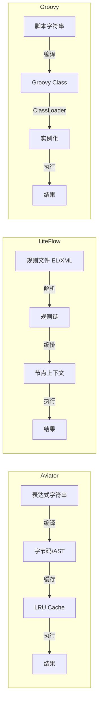
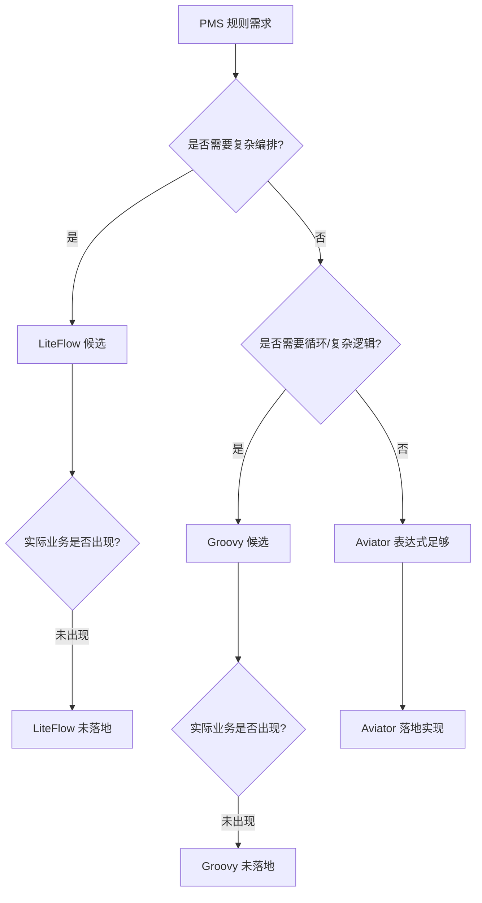
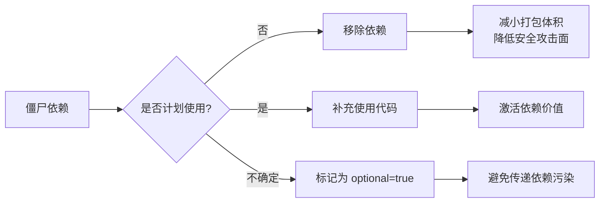
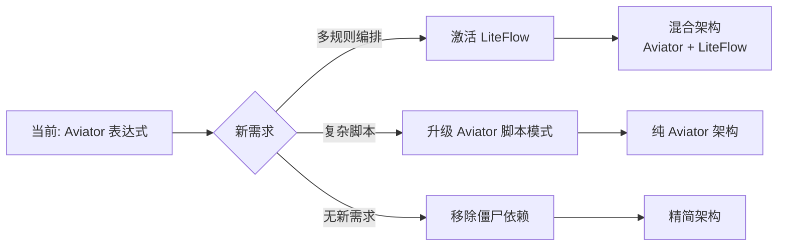

# 规则引擎对比分析

> 本文档对比 pms-rules 模块 pom.xml 中声明的三种规则引擎技术（Aviator、LiteFlow、Groovy），分析各自定位、适用场景，以及为何最终仅 Aviator 落地实现。

---

## 1. 技术选型背景

pms-rules 模块的 `pom.xml` 声明了三种规则/脚本相关依赖：

```xml
<!-- 轻量级表达式引擎 -->
<dependency>
    <groupId>com.googlecode.aviator</groupId>
    <artifactId>aviator</artifactId>
</dependency>

<dependency>
    <groupId>com.yomahub</groupId>
    <artifactId>liteflow-spring</artifactId>
</dependency>

<dependency>
    <groupId>org.codehaus.groovy</groupId>
    <artifactId>groovy</artifactId>
    <version>3.0.19</version>
</dependency>
```

| 技术 | 版本 | 定位 | 是否实际使用 |
|------|------|------|--------------|
| **Aviator** | 5.4.3 | 高性能表达式求值引擎 | ✅ 已使用（AviatorUtils） |
| **LiteFlow** | 2.15.0 | 规则编排/流程引擎 | ❌ 未使用 |
| **Groovy** | 3.0.19 | 通用动态脚本语言 | ❌ 未使用 |

---

## 2. 三种技术对比

### 2.1 能力维度对比

| 维度 | Aviator | LiteFlow | Groovy |
|------|---------|----------|--------|
| **类型** | 表达式引擎 | 规则编排引擎 | 动态脚本语言 |
| **语法复杂度** | 低（表达式级） | 中（XML/JSON 编排） | 高（完整编程语言） |
| **执行性能** | 高（编译为字节码） | 中（编排开销） | 中（脚本编译） |
| **学习成本** | 低 | 中 | 中 |
| **安全可控** | 高（受限语法） | 高（声明式编排） | 低（可执行任意代码） |
| **适用场景** | 单表达式求值、条件判断 | 多规则编排、流程决策 | 复杂业务逻辑脚本 |
| **状态管理** | 无（无状态求值） | 有（节点上下文） | 有（脚本内变量） |
| **热更新** | 支持（表达式字符串） | 支持（规则文件） | 支持（脚本字符串） |

### 2.2 性能对比



| 指标 | Aviator | LiteFlow | Groovy |
|------|---------|----------|--------|
| 首次编译耗时 | 低（~1ms） | 中（规则解析） | 高（~50ms，类编译） |
| 缓存命中执行 | 极低（~0.01ms） | 低 | 低 |
| 内存占用 | 低 | 中 | 高（ClassLoader） |
| GC 压力 | 低 | 中 | 高（Class 对象） |

### 2.3 安全性对比

| 风险点 | Aviator | LiteFlow | Groovy |
|--------|---------|----------|--------|
| 代码注入 | 中（FunctionMissing 反射） | 低 | **高**（可执行 `System.exit`） |
| 资源访问 | 受限 | 受限 | **不受限**（可访问文件/网络） |
| 死循环风险 | 低（表达式无循环） | 低 | **高**（支持 while/for） |
| 沙箱支持 | 部分（可禁用反射） | 内置 | 需自定义 SecureAST |

---

## 3. PMS 业务需求分析

### 3.1 实际业务场景

PMS 系统中规则引擎需要解决的核心问题：

| 场景 | 需求特征 | 推荐技术 |
|------|----------|----------|
| 发票类型判断 | 单表达式条件求值 | Aviator |
| 项目状态更新条件 | 单表达式条件求值 | Aviator |
| 售前项目自动启动脚本 | 简单脚本执行 | Aviator |
| 分包验收条件判断 | 单表达式条件求值 | Aviator |
| 工作流多实例变量提取 | 表达式变量名解析 | Aviator |
| 派工结算更新条件 | 单表达式条件求值 | Aviator |

### 3.2 需求特征总结



PMS 的规则场景具有以下特征：

1. **表达式简单**：主要是条件判断（`condition`）和简单计算（`script`）
2. **无复杂编排**：不需要多节点串联、并行、选择等编排能力
3. **无循环需求**：不需要 for/while 循环
4. **配置驱动**：规则表达式存储在 JSON 配置中，运行时动态加载
5. **安全优先**：表达式由配置人员编写，需限制能力范围

---

## 4. 为何仅 Aviator 落地

### 4.1 Aviator 的优势匹配

| PMS 需求 | Aviator 能力 | 匹配度 |
|----------|--------------|--------|
| 条件判断 | 原生支持逻辑运算 | ✅ 完全匹配 |
| 简单计算 | 原生支持算术运算 | ✅ 完全匹配 |
| 配置驱动 | 表达式为字符串，易于存储 | ✅ 完全匹配 |
| 高频调用 | LRU 缓存 + 编译优化 | ✅ 完全匹配 |
| 安全可控 | 受限语法 + FunctionMissing | ✅ 完全匹配 |
| 变量注入 | env Map 注入业务变量 | ✅ 完全匹配 |

### 4.2 LiteFlow 未落地原因

1. **过度设计**：LiteFlow 的规则编排能力（链式、并行、选择、循环、条件）远超 PMS 实际需求
2. **配置复杂**：LiteFlow 需要 EL 表达式或 XML/JSON 规则文件，比 Aviator 的单行表达式复杂
3. **集成成本**：LiteFlow 需要定义 `NodeComponent`、上下文等，对现有代码侵入大
4. **无编排场景**：PMS 的规则都是独立的单点判断，无多规则编排需求

### 4.3 Groovy 未落地原因

1. **安全风险**：Groovy 可执行任意 Java 代码，配置人员可能误写危险代码（如 `System.exit(0)`）
2. **性能开销**：Groovy 脚本编译为 Class，ClassLoader 管理复杂，内存占用高
3. **过度能力**：Groovy 是完整编程语言，而 PMS 仅需表达式求值
4. **维护成本**：Groovy 脚本调试、错误定位比 Aviator 表达式复杂
5. **ClassLoader 泄漏**：动态编译的 Groovy Class 可能导致 PermGen/Metaspace 泄漏

---

## 5. 架构决策记录

### 5.1 ADR：选择 Aviator 作为规则引擎

- **状态**：已采纳
- **背景**：PMS 需要在多个业务点（发票判断、状态更新、分包验收等）支持动态规则配置
- **决策**：采用 Aviator 5.4.3 作为表达式引擎，封装为 `AviatorUtils` 工具类
- **理由**：
  1. Aviator 语法简单，配置人员易于编写
  2. 性能优异，支持 LRU 缓存
  3. 安全可控，受限语法降低风险
  4. 集成成本低，仅需一个工具类
- **后果**：
  1. ✅ 正面：代码简洁，维护成本低
  2. ⚠️ 负面：复杂规则需拆分为多个表达式，无法使用循环
  3. ⚠️ 负面：pom.xml 中 LiteFlow 和 Groovy 依赖成为「僵尸依赖」

### 5.2 僵尸依赖处理建议



| 依赖 | 当前状态 | 建议处理 |
|------|----------|----------|
| `liteflow-spring` | 声明未使用 | 移除或标记 `<optional>true</optional>` |
| `groovy` | 声明未使用 | 移除或标记 `<optional>true</optional>` |

> 详见 `dependency-analysis.md`。

---

## 6. 未来演进方向

### 6.1 若需复杂规则编排

如果未来 PMS 出现多规则编排需求（如：项目审批流程中串联多个规则节点），可考虑激活 LiteFlow：

```java
// LiteFlow 编排示例（当前未实现）
@Component
public class ProjectRuleNode extends NodeComponent {
    @Override
    public void process() {
        // 规则节点逻辑
    }
}
```

### 6.2 若需复杂脚本能力

如果未来需要复杂脚本（循环、函数定义），建议优先考虑 Aviator 5.x 的脚本能力（支持 if/for/lambda），而非引入 Groovy：

```
// Aviator 5.x 脚本（当前未使用）
let total = 0;
for x in [1, 2, 3, 4, 5] {
    total = total + x;
}
return total;
```

### 6.3 推荐演进路径


