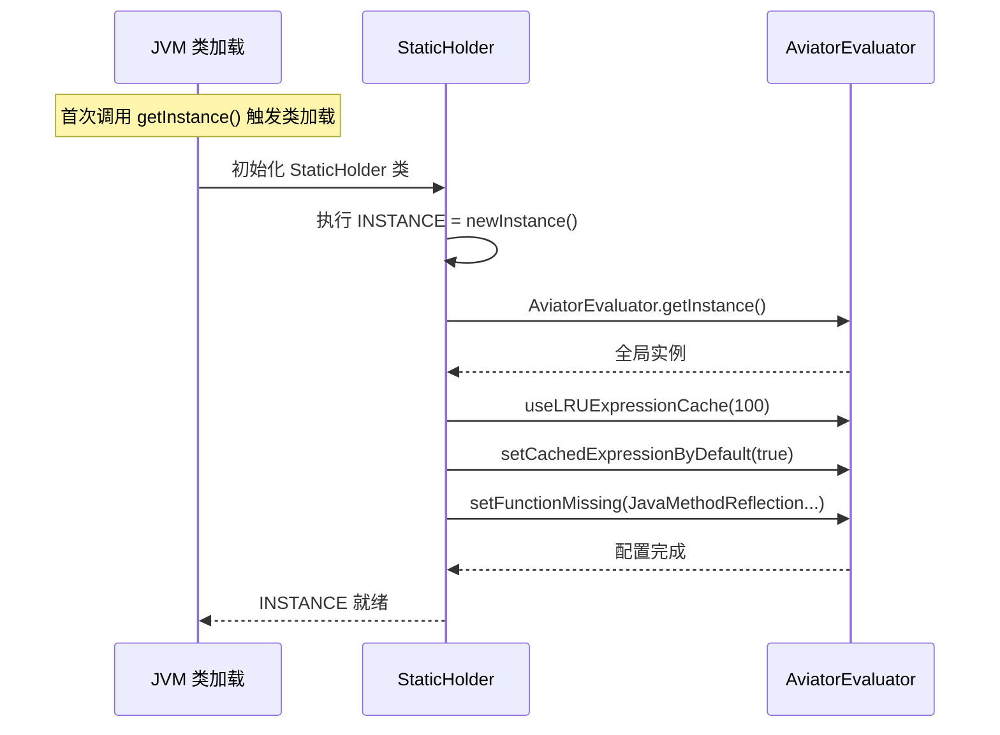
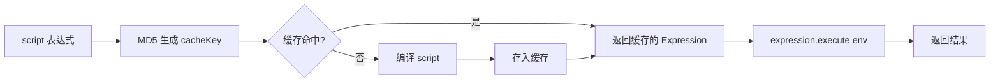
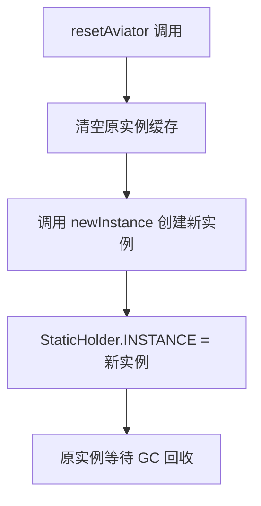
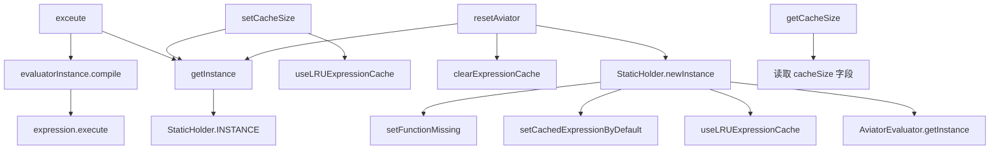

# AviatorUtils 工具类详解

> 本文档详细说明 pms-rules 模块中 `AviatorUtils` 工具类的方法清单、参数说明、返回值和使用示例。

---

## 1. 类概述

| 项目 | 内容 |
|------|------|
| **全限定名** | `com.dp.plat.rules.util.AviatorUtils` |
| **所在模块** | pms-rules |
| **源码路径** | `pms-rules/src/main/java/com/dp/plat/rules/util/AviatorUtils.java` |
| **类类型** | 公共静态工具类 |
| **设计模式** | 静态内部类持有者（Holder）单例模式 |
| **依赖** | Aviator 5.4.3、Spring（DigestUtils） |

### 1.1 类声明

```java
public class AviatorUtils {
    private static int cacheSize = 100;
    // ...
}
```

### 1.2 重复定义说明

> ⚠️ AviatorUtils 在 PMS 项目中有三处重复定义，详见 `01-architecture/dependency-analysis.md`。本文档描述的是 **pms-rules 模块** 中的版本。

---

## 2. 内部结构

### 2.1 StaticHolder 静态持有者

```java
private static class StaticHolder {
    private static AviatorEvaluatorInstance INSTANCE = newInstance();
    
    private static AviatorEvaluatorInstance newInstance() {
        AviatorEvaluatorInstance instance = AviatorEvaluator.getInstance();
        instance.useLRUExpressionCache(cacheSize);
        instance.setCachedExpressionByDefault(true);
        instance.setFunctionMissing(JavaMethodReflectionFunctionMissing.getInstance());
        return instance;
    }
}
```

| 配置项 | 值 | 作用 |
|--------|-----|------|
| `useLRUExpressionCache(cacheSize)` | `cacheSize`（默认 100） | 启用 LRU 表达式缓存 |
| `setCachedExpressionByDefault(true)` | `true` | 默认缓存编译后的表达式 |
| `setFunctionMissing(...)` | `JavaMethodReflectionFunctionMissing` | 函数缺失时通过反射调用 Java 静态方法 |

### 2.2 单例初始化时序



---

## 3. 方法清单

### 3.1 `getInstance()`

| 项目 | 内容 |
|------|------|
| **签名** | `public static AviatorEvaluatorInstance getInstance()` |
| **功能** | 获取 Aviator 求值器单例实例 |
| **参数** | 无 |
| **返回值** | `AviatorEvaluatorInstance` — Aviator 求值器实例 |
| **线程安全** | 是（JVM 保证静态内部类初始化安全） |

**使用场景**：
- 需要直接操作 Aviator 实例时（如注册自定义函数、预编译表达式）
- `WorkflowUtil.java` 中用于编译表达式并提取变量名

**示例**：

```java
// 获取实例并预编译表达式
AviatorEvaluatorInstance instance = AviatorUtils.getInstance();
Expression expr = instance.compile(expressionText);
List<String> vars = expr.getVariableNames();

// 注册自定义函数
instance.addFunction(new AbstractFunction() {
    @Override
    public String getName() { return "myFunc"; }
    
    @Override
    public AviatorObject invoke(Map<String, Object> env, AviatorObject... args) {
        return new AviatorString("result");
    }
});
```

---

### 3.2 `exceute(String, Map)`

| 项目 | 内容 |
|------|------|
| **签名** | `public static Object exceute(String script, Map<String, Object> env)` |
| **功能** | 执行 Aviator 表达式并返回结果 |
| **参数 `script`** | Aviator 表达式字符串，不可为 null |
| **参数 `env`** | 变量环境 Map，键为变量名，值为变量值；可为空 Map |
| **返回值** | `Object` — 表达式计算结果，类型取决于表达式 |
| **线程安全** | 是（无共享可变状态） |

> ⚠️ **方法名拼写错误**：`exceute` 应为 `execute`，为历史遗留问题。三处重复定义均存在此拼写错误，修正需同步修改所有调用点。

**内部实现**：

```java
public static Object exceute(String script, Map<String, Object> env) {
    // 1. 获取求值器实例
    AviatorEvaluatorInstance evaluatorInstance = getInstance();
    // 2. 生成缓存 Key（表达式内容的 MD5 哈希）
    String cacheKey = DigestUtils.md5DigestAsHex(script.getBytes());
    // 3. 编译表达式（命中缓存则直接返回）
    Expression expression = evaluatorInstance.compile(cacheKey, script, true);
    // 4. 执行表达式
    Object result = expression.execute(env);
    return result;
}
```

**执行流程**：



**返回值类型对照**：

| 表达式 | 返回类型 | 示例值 |
|--------|----------|--------|
| `1 + 2` | `Long` | `3L` |
| `1.0 + 2` | `Double` | `3.0` |
| `1 > 2` | `Boolean` | `false` |
| `'hello'` | `String` | `"hello"` |
| `[1, 2, 3]` | `List` | `[1, 2, 3]` |
| `{'a': 1}` | `Map` | `{"a": 1}` |
| `nil` | `null` | `null` |

**使用示例**：

```java
// 1. 数学计算
Object result = AviatorUtils.exceute("1 + 2 * 3", new HashMap<>());
// result = 7L (Long)

// 2. 逻辑判断
Map<String, Object> env = new HashMap<>();
env.put("age", 25);
Object result = AviatorUtils.exceute("age >= 18 && age <= 60", env);
// result = true (Boolean)

// 3. 变量替换
Map<String, Object> env = new HashMap<>();
env.put("price", 100);
env.put("quantity", 5);
Object result = AviatorUtils.exceute("price * quantity", env);
// result = 500L (Long)

// 4. 字符串处理
Map<String, Object> env = new HashMap<>();
env.put("name", "张三");
Object result = AviatorUtils.exceute("string.join('你好, ', name)", env);
// result = "你好, 张三" (String)

// 5. 业务条件判断（发票类型）
Map<String, Object> env = new HashMap<>();
env.put("entity", Collections.singletonMap("entity", invoice));
Object result = AviatorUtils.exceute(condition, env);
Boolean isInvoice = Boolean.TRUE.equals(result);
```

---

### 3.3 `getCacheSize()`

| 项目 | 内容 |
|------|------|
| **签名** | `public static int getCacheSize()` |
| **功能** | 获取当前缓存容量配置 |
| **参数** | 无 |
| **返回值** | `int` — 当前配置的缓存大小 |
| **线程安全** | 读取非 volatile 字段，可能读到旧值 |

**示例**：

```java
int size = AviatorUtils.getCacheSize();
// 默认返回 100
```

---

### 3.4 `setCacheSize(int)`

| 项目 | 内容 |
|------|------|
| **签名** | `public static void setCacheSize(int cacheSize)` |
| **功能** | 设置表达式缓存容量 |
| **参数 `cacheSize`** | 缓存容量，正整数 |
| **返回值** | 无 |
| **线程安全** | ⚠️ 不安全（写非 volatile 字段 + 调用实例方法） |

**内部实现**：

```java
public static void setCacheSize(int cacheSize) {
    AviatorUtils.cacheSize = cacheSize;          // 更新静态字段
    getInstance().useLRUExpressionCache(cacheSize); // 重新配置缓存
}
```

> ⚠️ **注意**：此方法会修改静态字段 `cacheSize`，但 `StaticHolder.INSTANCE` 在类加载时已使用旧 `cacheSize` 初始化。调用此方法后，`getInstance()` 返回的实例会重新配置缓存，但若后续调用 `resetAviator()`，新实例将使用更新后的 `cacheSize`。

**使用建议**：
- 仅在应用启动阶段调用
- 运行期调用可能导致短暂的缓存失效

**示例**：

```java
// 启动时配置
AviatorUtils.setCacheSize(200);
```

---

### 3.5 `resetAviator()`

| 项目 | 内容 |
|------|------|
| **签名** | `public static void resetAviator()` |
| **功能** | 重置 Aviator 实例，清空缓存并创建新实例 |
| **参数** | 无 |
| **返回值** | 无 |
| **线程安全** | ⚠️ 不安全（重新赋值静态字段） |

**内部实现**：

```java
public static void resetAviator() {
    // 1. 清空原实例的缓存释放内存
    getInstance().clearExpressionCache();
    // 2. 生成新实例并赋给单例对象
    StaticHolder.INSTANCE = StaticHolder.newInstance();
}
```

**执行流程**：



> ⚠️ **风险**：
> 1. 运行期调用可能导致并发请求使用旧实例（缓存已清空），引发短暂性能下降
> 2. `StaticHolder.INSTANCE` 非 volatile，其他线程可能暂时看不到新实例
> 3. 建议仅在维护窗口或测试中调用

**使用场景**：
- 表达式规则大量更新后，清理旧缓存
- 内存压力较大时，释放缓存内存
- 单元测试中重置状态

**示例**：

```java
// 规则批量更新后重置
AviatorUtils.resetAviator();
```

---

## 4. 方法调用关系



---

## 5. 异常处理

AviatorUtils 方法本身不捕获异常，所有 Aviator 异常会直接抛出。调用方需自行处理：

```java
try {
    Object result = AviatorUtils.exceute(expression, env);
} catch (ExpressionSyntaxErrorException e) {
    // 表达式语法错误
    log.error("表达式语法错误: expression={}", expression, e);
} catch (CompileExpressionErrorException e) {
    // 表达式编译错误
    log.error("表达式编译失败: expression={}", expression, e);
} catch (Exception e) {
    // 执行期异常（变量未定义、类型转换等）
    log.error("规则执行失败: expression={}", expression, e);
}
```

> **注意**：PMS 业务代码中多数调用点使用 `try-catch(Exception)` 捕获所有异常，并通过 `e.printStackTrace()` 或 `log.error` 记录。详见 `05-standards/troubleshooting.md`。

---

## 6. 与其他版本的方法对比

| 方法 | pms-rules 版本 | core 版本 | PMS-struts 版本 |
|------|----------------|-----------|-----------------|
| `getInstance()` | ✅ 一致 | ✅ 一致 | ✅ 一致 |
| `exceute(String, Map)` | MD5: `DigestUtils.md5DigestAsHex` | MD5: `PasswordUtil.encryptMD5Password` | MD5: `Md5Util.getMD5` |
| `getCacheSize()` | ✅ 一致 | ✅ 一致 | ✅ 一致 |
| `setCacheSize(int)` | ✅ 一致 | ✅ 一致 | ✅ 一致 |
| `resetAviator()` | ✅ 一致 | ✅ 一致 | ✅ 一致 |

> 三处版本的公共 API 完全一致，仅 `exceute` 方法内部 MD5 实现不同。调用方代码可互换使用（需调整 import）。
